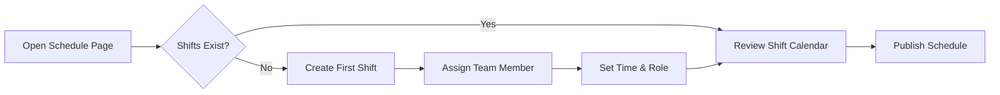
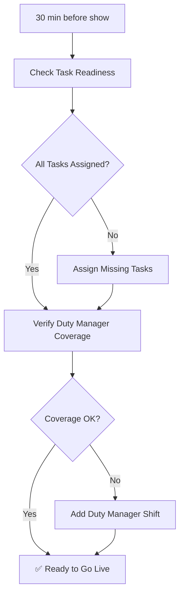
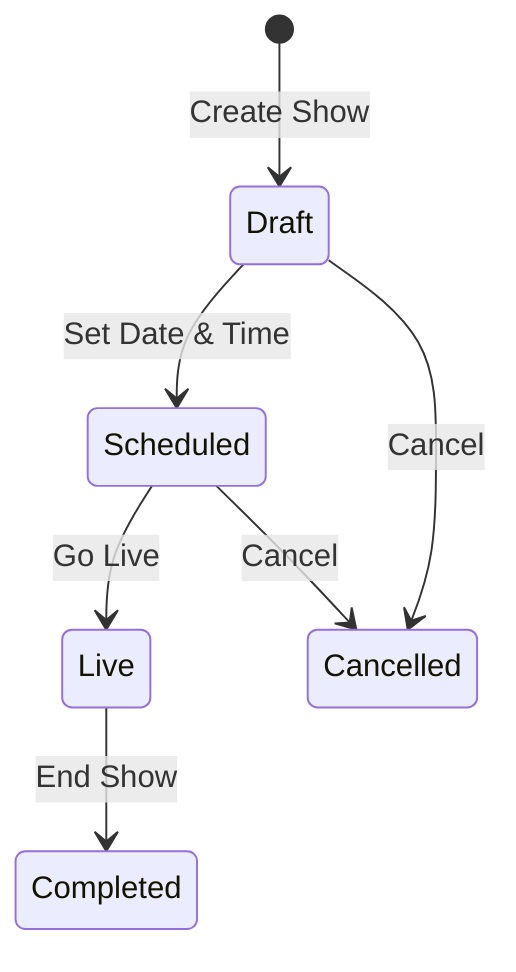

# User-Facing Documentation Generator

Convert technical PRDs and feature docs into clear, non-technical documentation for app users and studio operators. Output lives in `eridu_docs` (Astro Starlight) and, in this repo, is organized by workflow and function first. Guide, SOP, and FAQ pages for the same workflow should live together.

## When to Use

- A PRD has shipped and is being promoted via `doc-lifecycle.md` — generate the user-facing counterpart alongside the feature doc.
- A batch of related features is complete and needs a unified user manual.
- An existing user guide needs updating after a feature change or scope expansion.
- Standalone: translating any PRD or feature doc into user-facing content on demand.

## Audience

**App users and studio operators** — not developers. These people interact with `erify_creators` or `erify_studios` daily. They care about *what they can do*, *how to do it*, and *what happens when something goes wrong*. They do not care about endpoints, schemas, or database fields.

---

## Content Architecture in `eridu_docs`

For `eridu_docs`, prefer the repo-local information architecture guidance in [eridu-docs-information-architecture](../eridu-docs-information-architecture/SKILL.md).

### Directory Structure

```
apps/eridu_docs/src/content/docs/
├── getting-started/       ← Entry-point flows and app relationships
├── scheduling/            ← Schedule creation, publishing, FAQ, SOPs
├── assets/                ← Upload and asset-management workflows
└── reference/             ← Technical/supporting reference pages
```

Keep document genre inside the workflow folder, for example:

```text
scheduling/
  google-sheets-publishing.mdx
  publish-sop.mdx
  faq.mdx
```

### Sidebar Configuration

Add these sections to `astro.config.mjs`:

```javascript
sidebar: [
  { label: 'Getting Started', autogenerate: { directory: 'getting-started' } },
  { label: 'Scheduling & Shows', autogenerate: { directory: 'scheduling' } },
  { label: 'Assets & Uploads', autogenerate: { directory: 'assets' } },
  { label: 'Reference', autogenerate: { directory: 'reference' } },
],
```

Add a new top-level workflow area only when the feature introduces enough stable user-facing content to justify it, and update `eridu-docs-information-architecture` if the default IA changes.

---

## Conversion Workflow

### Step 1: Identify Source Material

Gather input documents. At minimum one of:

| Source | Location | What it provides |
|--------|----------|------------------|
| PRD | `docs/prd/<feature>.md` | Problem, users, requirements, acceptance criteria |
| Feature doc | `docs/features/<feature>.md` | What was delivered, product decisions |
| Workflow doc | `docs/workflows/<flow>.md` | End-to-end multi-feature flows |
| App design doc | `apps/*/docs/design/<feature>.md` | UI behavior, edge cases, error states |

### Step 2: Extract User-Relevant Content

From the source material, extract only what an app user needs:

**Include:**
- What the feature does (in plain language)
- Who can use it (role requirements)
- Step-by-step instructions (what to click, what to enter)
- What the user sees as output / confirmation
- What can go wrong and what to do about it
- Prerequisites (what must be set up first)
- Related features they should know about

**Exclude:**
- API endpoints, HTTP methods, status codes
- Database fields, schema definitions, Prisma types
- Architecture diagrams showing services/modules
- Implementation details (guards, decorators, transactions)
- Developer-facing acceptance criteria

### Step 3: Determine Output Documents

One PRD may produce multiple user-facing docs depending on the workflow depth involved:

```
PRD: studio-show-management.md
  ├── scheduling/show-management.mdx
  ├── scheduling/pre-show-checklist.mdx
  ├── scheduling/publish-sop.mdx
  └── scheduling/faq.mdx
```

**Decision rules:**
- If the feature belongs to an existing workflow area → add pages to that folder
- If 2+ roles interact with the feature differently → separate pages inside the same workflow area
- If the feature involves a repeatable daily/weekly process → add an SOP page in that workflow area
- If the feature has known edge cases or confusing states → add or update that workflow area's FAQ page
- Always cross-link between related docs

### Step 4: Write with Layered Abstraction

Every document follows a **summary-first, details-on-demand** structure:

1. **At-a-Glance** — 2-3 sentence plain-language summary + a visual overview diagram
2. **What You Need** — prerequisites, role requirements, prior steps
3. **How It Works** — step-by-step with visuals (the detailed layer)
4. **What to Expect** — outputs, confirmations, next steps
5. **Common Questions** — inline FAQ for this specific flow
6. **Related Guides** — links to prerequisite or follow-up docs

Users read the summary and visual to decide if they need the details.

### Step 5: Add Visual Diagrams

Use Mermaid diagrams (already supported in `eridu_docs` via `astro-mermaid`) for:

**User flow diagrams** — show the path through the app:


**Process diagrams** — show multi-step SOPs:


**State diagrams** — show what happens to an item:


**Guidelines for diagrams:**
- Use plain language labels (not technical terms)
- Keep to 5-8 nodes maximum per diagram
- Use decision diamonds for branching paths
- Mark success states with checkmarks
- Color-code by role if multiple actors appear

### Step 6: Write the FAQ Section

Generate FAQ entries from these sources:

1. **Edge cases** from the PRD's acceptance criteria and error codes
2. **Role confusion** — "Can I do X?" questions based on the role matrix
3. **State transitions** — "What happens if I do X while Y is happening?"
4. **Recovery** — "I made a mistake, how do I fix it?"
5. **Prerequisites** — "Why can't I see X?" (missing setup, wrong role, etc.)

**FAQ format:**
```markdown
### Why can't I see the shift calendar?

You need **Manager** or **Admin** role to view the full shift calendar. If you're a team member, you can only see your own shifts under **My Shifts**.

If you're a Manager and still can't see it, check that:
1. You're viewing the correct studio (top-left dropdown)
2. The date range includes published shifts

→ *See also: [Understanding Roles](/getting-started/roles-and-permissions)*
```

**Rules:**
- Write the question as the user would ask it (natural language)
- Answer in 1-3 short paragraphs maximum
- Include a numbered checklist if the answer involves verification steps
- Always end with a "See also" link to the relevant guide or SOP
- Group FAQs by feature area, not by role

### Step 7: Cross-Link and Validate

After writing all output docs:

1. **Cross-link related content:**
   - User guide → related SOP ("For the daily procedure, see...")
   - SOP → prerequisite guide ("Before starting, make sure you've completed...")
   - FAQ → detailed guide ("For full instructions, see...")
   - User guide → FAQ ("Common questions about this feature...")

2. **Validate role accuracy:**
   - Check that role requirements match the `StudioProtected` guard in the controller
   - Verify the role names used match the user-visible labels (Admin, Manager, etc.)

3. **Validate completeness:**
   - Every PRD acceptance criterion that affects user behavior has a corresponding instruction
   - Every error state mentioned in the PRD has a FAQ or troubleshooting entry
   - Every role mentioned in the PRD's user table has a guide or is explicitly noted as "no action needed"

---

## Document Templates

### User Guide Template

```markdown
---
title: <Feature Name> — <Role> Guide
description: How to <do the thing> as a <role> in <app name>.
sidebar:
  order: <N>
---

> **Role required**: <Role Name(s)>
> **App**: erify_studios / erify_creators

## At a Glance

<2-3 sentences: what this feature lets you do and why it matters.>

\`\`\`mermaid
flowchart LR
    A[Start] --> B[Step] --> C[Result]
\`\`\`

## What You Need

- <prerequisite 1 — with link to setup guide if applicable>
- <prerequisite 2>

## How It Works

### 1. <Action Name>

<What to do, what you'll see, what to enter. Use plain language.>

> [!TIP]
> <Helpful shortcut or best practice>

### 2. <Next Action>

<Continue the flow...>

## What to Expect

After completing these steps:
- <outcome 1>
- <outcome 2>

> [!NOTE]
> <Important timing or visibility note — e.g., "Changes appear after the next page refresh">

## Common Questions

### <Question as the user would ask it?>

<Short answer with verification steps if needed.>

→ *See also: [Related Guide](/path/to/related)*

## Related

- [<SOP name>](/<workflow-area>/<name>) — Daily procedure for this feature
- [<Other page>](/<workflow-area>/<name>) — Related capability in the same workflow area
- [<FAQ>](/<workflow-area>/faq) — More questions about this workflow area
```

### SOP Template

```markdown
---
title: "SOP: <Procedure Name>"
description: Step-by-step procedure for <what and when>.
sidebar:
  order: <N>
---

> **Who runs this**: <Role(s)>
> **When**: <Trigger — daily at X, before each show, when Y happens>
> **Time needed**: <Estimate — e.g., ~5 minutes>

## Overview

<1-2 sentences: what this procedure ensures and why it exists.>

\`\`\`mermaid
flowchart TD
    A[Trigger] --> B[Step 1] --> C{Check} --> D[Done]
    C --> E[Fix] --> C
\`\`\`

## Checklist

> Complete these steps in order. Each step must pass before moving to the next.

### Step 1: <Action>

- [ ] <What to verify or do>
- [ ] <Expected result>

> [!WARNING]
> <What goes wrong if you skip this step>

### Step 2: <Action>

- [ ] <What to verify or do>
- [ ] <Expected result>

### Step 3: <Action>

- [ ] <What to verify or do>
- [ ] <Expected result>

## If Something Goes Wrong

| Symptom | Likely Cause | Fix |
|---------|-------------|-----|
| <what you see> | <why> | <what to do — link to troubleshooting SOP if complex> |

## Related

- [<Workflow guide>](/<workflow-area>/<name>) — Full feature guide
- [<Related recovery page>](/<workflow-area>/<name>) — Recovery or exception handling
```

### FAQ Page Template

```markdown
---
title: "FAQ: <Feature Area>"
description: Common questions about <feature area>.
sidebar:
  order: <N>
---

## General

### <Question?>

<Answer — 1-3 short paragraphs. Include numbered steps if verification is needed.>

→ *See also: [Guide](/path)*

## Access & Permissions

### <Question about who can do what?>

<Answer with role table if multiple roles are involved.>

| Role | Can do this? |
|------|-------------|
| Admin | Yes |
| Manager | Yes |
| Member | No — contact your Manager |

## Troubleshooting

### <"Why can't I..." or "What happens if..." question?>

<Answer with diagnostic steps.>

1. Check <thing 1>
2. Verify <thing 2>
3. If still stuck, <escalation path>

→ *See also: [Related workflow page](/<workflow-area>/<name>)*
```

---

## Language & Tone Guidelines

### Do

- Use **active voice**: "Click the Create button" not "The Create button should be clicked"
- Use **present tense**: "The calendar shows your shifts" not "The calendar will show your shifts"
- Address the reader as **"you"**: "You can assign tasks" not "Users can assign tasks"
- Use the **app-visible label** for UI elements: "Shift Calendar" not "ShiftCalendarService"
- Name **roles as users know them**: "Studio Manager" not "MANAGER role with StudioProtected guard"
- Explain **why** a step matters when it's not obvious: "Publish the schedule so your team can see it"
- Use **bold** for UI element names: "Click **Create Show**"
- Use `> [!TIP]` for best practices, `> [!NOTE]` for important context, `> [!WARNING]` for destructive or irreversible actions

### Don't

- Use technical jargon: API, endpoint, schema, payload, JWT, guard, middleware, UID
- Reference code: file paths, function names, class names, database columns
- Explain architecture: "The backend validates..." — just say what the user sees
- Use passive voice for instructions
- Write paragraphs where a numbered list would be clearer
- Assume the reader knows prerequisite steps — link to them instead

### Translating Technical Concepts

| Technical Term | User-Facing Language |
|---------------|---------------------|
| API endpoint | Feature / action |
| JWT / session token | Your login session |
| StudioMembership | Studio access / your role |
| StudioProtected guard | Requires [Role] access |
| UID / nanoid | Your unique ID (shown in profile) |
| Soft delete | Removed (can be restored by an admin) |
| Optimistic locking / version conflict | Someone else edited this at the same time |
| 401 Unauthorized | You need to log in again |
| 403 Forbidden | You don't have permission for this action |
| 404 Not Found | This item doesn't exist or was removed |
| 409 Conflict | This conflicts with an existing record |
| Validation error (400) | Please check the highlighted fields |
| Prisma transaction | (omit — invisible to user) |
| BullMQ job / queue | Processing — this may take a moment |

---

## Integration with Doc Lifecycle

When running `doc-lifecycle.md` and a PRD is classified as **Shipped**:

1. **Promote to feature doc** (existing step) → `docs/features/<name>.md`
2. **Generate user-facing docs** (this skill) → `apps/eridu_docs/src/content/docs/<workflow-area>/`
3. **Update eridu_docs sidebar** only if a brand-new top-level workflow area was introduced
4. **Cross-link**: feature doc links to workflow pages; workflow pages link back to feature doc for technical readers

### Standalone Usage

This skill can also run independently:

```
Input:  Any PRD, feature doc, or workflow doc
Output: Role-scoped user guides + SOPs + FAQ entries in eridu_docs
```

Invoke when documentation cleanup reveals shipped features without user-facing coverage.

---

## Quality Checklist

Before marking user-facing docs as complete:

- [ ] Every doc has an "At a Glance" summary that stands alone
- [ ] Every multi-step process has a Mermaid diagram
- [ ] Role requirements are stated at the top of every guide
- [ ] No technical jargon remains (grep for: API, endpoint, schema, payload, JWT, guard, UID, Prisma)
- [ ] Every FAQ answer ends with a "See also" link
- [ ] Cross-links between related guides, SOPs, and FAQs are in place
- [ ] SOPs have a "If Something Goes Wrong" table
- [ ] User guides have a "Common Questions" section
- [ ] All role names match the UI labels, not the code constants
- [ ] Diagrams use plain language labels and stay under 8 nodes
- [ ] Frontmatter `title` and `description` are set for Starlight sidebar rendering
- [ ] New directories are registered in `astro.config.mjs` sidebar config

---

## Reference

- **eridu_docs app**: `apps/eridu_docs/`
- **Starlight sidebar config**: `apps/eridu_docs/astro.config.mjs`
- **Mermaid support**: `astro-mermaid` integration (already installed)
- **Existing content**: `apps/eridu_docs/src/content/docs/`
- **Doc lifecycle workflow**: `.agent/workflows/doc-lifecycle.md`
- **PRD source**: `docs/prd/`
- **Feature docs**: `docs/features/`
- **Workflow docs**: `docs/workflows/`
