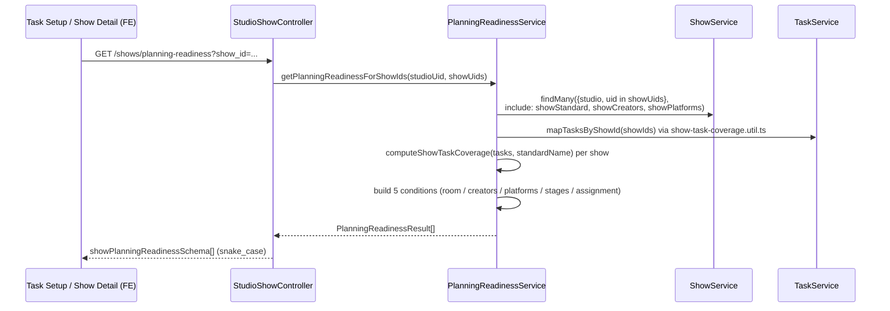
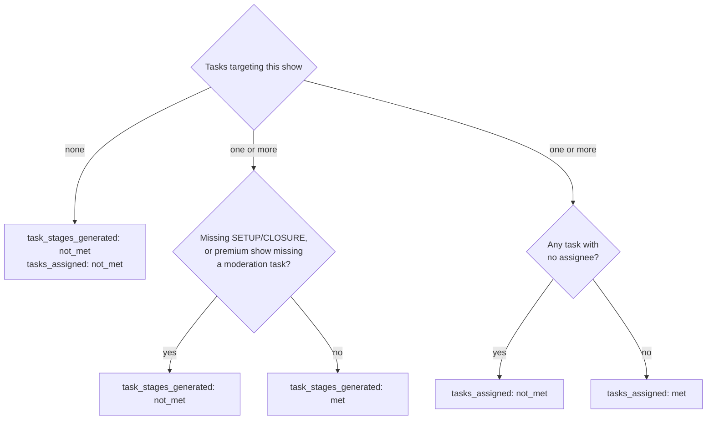

# State Gates and Readiness Conditions

Detailed reference for lifecycle transition conditions. Read this when implementing or reviewing readiness checks, completion gates, or enforcement logic.

## Enforcement Levels

Phase 5 identifies three enforcement levels, but enforcement configuration is **deferred**. Current behavior is advisory only.

| Level | Meaning | Example |
|---|---|---|
| Off | Platform records state but does not evaluate the requirement. | Studio does not require task generation before confirmation. |
| Warning | Platform highlights missing records but allows the transition. | Show can be confirmed without creator assignment, but appears as planning risk. |
| Block | Platform prevents the transition until the requirement is met or waived. | Show cannot go live without a room and at least one assigned operator. |

## Transition: draft → confirmed

Planning readiness. The planning manager has reviewed and accepted the show as operationally ready.

| Condition | Where checked today | Enforcement | Notes |
|---|---|---|---|
| Room assigned | `show.studioRoomId` is not null | Advisory (`PlanningReadinessService`) | |
| Creators assigned | `ShowCreator[]` count > 0 for the show | Advisory (`PlanningReadinessService`) | Visible in creator-mapping surface |
| Platforms assigned | `ShowPlatform[]` count > 0 for the show | Advisory (`PlanningReadinessService`) | Visible in show detail |
| Required task stages generated | Shared `show-task-coverage.util.ts` (also used by `ShiftAlignmentService`) | Advisory (`PlanningReadinessService`) | Checks SETUP/CLOSURE stages, plus moderation for premium shows |
| Required tasks assigned to operators | Shared `show-task-coverage.util.ts` | Advisory (`PlanningReadinessService`) | Checks that generated tasks have assignees |
| Critical record-collection tasks assigned | Not checked | Not enforced | Phase 5 candidate |
| Schedule linkage (if studio requires it) | `show.scheduleId` is not null | Not enforced | Orphan detection available in show list |

**Current surface (item 11)**: `PlanningReadinessService` (`apps/erify_api/src/show-orchestration/planning-readiness.service.ts`) computes all five conditions above server-side behind the shared `showPlanningReadinessSchema` contract (`@eridu/api-types/shows`), via `GET /studios/:studioId/shows/:id/planning-readiness` (single) and `GET /studios/:studioId/shows/planning-readiness?show_id=...` (bulk-by-ids). Consumed by a Planning Readiness card on show detail and a per-row column on `/task-setup`. `ShowReadinessTriagePanel` / `show-readiness.utils.ts` remain a separate, task-only display fed by `ShiftAlignmentService`'s `task_readiness_warnings` — they are not the readiness authority (see item 11's shared condition contract note in `PHASE_5.md`).

**Request flow**:

**Task-stage / task-assignment decision logic** (the two conditions sourced from `show-task-coverage.util.ts`, shared with `ShiftAlignmentService`):

## Transition: confirmed → live

Production readiness. The onset/production manager takes ownership of live execution.

| Condition | Where checked today | Enforcement | Notes |
|---|---|---|---|
| Duty manager or production owner visible | Shift coverage readable in shift-schedule surfaces | Not enforced | Time-overlap query, not show FK |
| All pre-production tasks completed | Task status check possible via task-target query | Not enforced | No live-readiness gate |
| Actual start signal | `show.actualStartTime` or manual status update | Not enforced | Can be set via task submission (fact extraction) or manager override |

**Gap**: No live control dashboard or `confirmed → live` transition trigger.

## Transition: live → completed

Post-production closure. Required records are confirmed for review, reporting, and downstream use.

| Condition | Where checked today | Enforcement | Notes |
|---|---|---|---|
| Closure tasks submitted or approved | Task review surface (task-review page) | Not enforced | Managers must know which tasks matter |
| Actual end/completion signal | `show.actualEndTime` or manual status update | Not enforced | Via fact extraction or manager override |
| Creator attendance outcome finalized | `ShowCreator.attendanceMissing` and related fields | Not enforced | Via fact extraction |
| Required platform performance facts present | `ShowPlatform.gmv`, `viewerCount`, etc. | Not enforced | Via fact extraction from closure tasks |
| No unresolved show-level blockers | No issue model exists | Not enforced | Phase 5 gap |

**Current surface**: `/studios/:studioId/task-review` for task approval, `/studios/:studioId/show-run-review` for daily exception review.

**Gap**: No show-level completion checklist.

## Transition: any → cancelled

Direct cancellation for shows that will not proceed.

| Condition | Where checked today | Enforcement | Notes |
|---|---|---|---|
| Cancellation reason provided | Cancellation gate | Required for manual cancellation | Admin/Manager direct cancel captures reason category and note |
| No active downstream work | Schedule publish and cancellation gate | Automatic | If active tasks exist, publish sets `cancelled_pending_resolution`; manual `CANCELLED` outcome requires zero active tasks |

## Transition: any → cancelled_pending_resolution

Show cannot proceed but has operational consequences that need resolution.

| Condition | Where checked today | Enforcement | Notes |
|---|---|---|---|
| Reason category | Cancellation gate | Required for manual open | Allowed categories are defined in `@eridu/api-types/shows` |
| Resolution owner assigned | Dashboard duty-manager request path and Admin/Manager sign-off | Role-tiered workflow | Focused queue/discovery remains follow-up |
| Affected records identified | Not tracked | Not enforced | Which tasks, creators, shifts are affected |

## Transition: cancelled_pending_resolution → cancelled or completed

Final disposition after resolution.

| Condition | Where checked today | Enforcement | Notes |
|---|---|---|---|
| All follow-up actions resolved | No follow-up model | Not enforced | Phase 5 gap |
| Final disposition chosen | Cancellation gate | Required for sign-off | cancelled = no production credit, completed = partial production counts |

## Fact Extraction as Implicit State Signal

The fact-extraction pipeline writes actuals that implicitly signal state progress:

| Fact written | Implicit signal |
|---|---|
| `show_actual_start_time` on Show | Show has started (live) |
| `show_actual_end_time` on Show | Show has ended |
| `creator_actual_start_time` on ShowCreator | Creator appeared |
| `creator_attendance_missing` on ShowCreator | Creator did not appear |
| `show_platform_gmv` etc. on ShowPlatform | Performance data collected |
| `show_platform_violation` on ShowPlatformViolation | Platform issue recorded |

These writes do NOT automatically transition show status. Status transitions remain manager-driven.

## Phase 5 Candidate Conditions (Not Yet Implemented)

From the Phase 5 gap summary, these conditions are identified but not yet modeled:

- State-based notification rules (who gets notified at each transition).
- Show-level issue record with owner, severity, due date, escalation path.
- Per-studio enforcement configuration (which conditions are off / warning / block).
- Schedule-change task reconciliation (stale task due dates after show timing changes).
- Show performance data correction with audit reason.
- Platform performance data import (manual upload or API).
