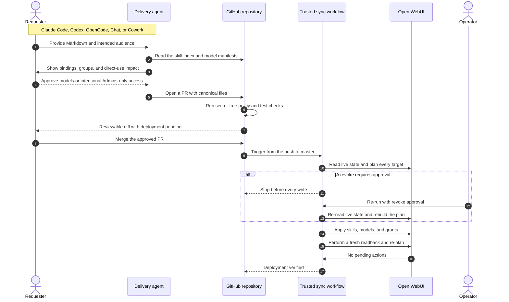

# Open WebUI Sync Delivery Workflow

This workflow turns supplied skill content into a reviewable Git change, validates its model binding
and access impact, and deploys the complete desired state only after merge.

## End-to-end sequence



## Load first

| Change | Skill |
| --- | --- |
| Skill content | [upload-openwebui-skill](../skills/upload-openwebui-skill/SKILL.md) |
| Model settings and bindings | [openwebui-assistant-adapter](../skills/openwebui-assistant-adapter/SKILL.md) |
| Groups and grant reconciliation | [openwebui-groups-permissions](../skills/openwebui-groups-permissions/SKILL.md) |
| REST behavior and version caveats | [openwebui-rest-api](../skills/openwebui-rest-api/SKILL.md) |
| Control-plane placement | [ai-workspace-control-plane](../skills/ai-workspace-control-plane/SKILL.md) |

## Steps

### 1. Classify and branch

Separate skill content, model binding, and model audience changes in the PR summary even when they
ship together. Work on a branch such as `feat/openwebui-skill-<id>`, never directly on `master`.

### 2. Record the skill verbatim

Write the Markdown to `ai/openwebui/skills/<id>.md` and add its `name` and load-bearing description
to `ai/openwebui/skills/index.json`. Do not rewrite user-supplied content.

### 3. Review binding and access

Ask which existing models should carry the skill. Show each model's current groups before editing.
Adding a group to a model grants that group every skill the model binds, not only the new one.

Open WebUI 0.10.2 uses the same skill read grants for model-bound execution, direct menu selection,
and `$` mentions. State that complete access impact; do not describe a binding as model-only.

A new skill must either be bound to an approved model or carry an explicitly chosen
`"access": "admins-only"` marker. Never silently default to Admins and never leave it unbound and
unmarked.

### 4. Dry run

When an authorized key is available, run:

```bash
python3 ai/openwebui/push_config.py all
```

Exit `2` means differences exist; `0` means in sync; `3` means the key or host is unavailable. Name
all grant additions and revokes. Do not expose the detailed output in public logs or issues.

In Claude Chat or Cowork, missing production credentials is expected. Continue with the Git change
and mark live verification as not performed.

### 5. Validate and open the PR

Run the applicable tests, `python3 ai/openwebui/validate_config.py`, and `pnpm agents:validate`, then
open a PR against `master`. `openwebui-validate.yml` repeats the repository checks on the pull
request without production credentials. The body states:

- skill files and model manifests changed;
- model bindings;
- groups gaining or losing model and direct skill use;
- dry-run result, or that it was unavailable;
- deployment is pending merge.

Do not write unmerged content or access grants to production.

### 6. Deploy after merge

A merge touching the canonical skill, model, or sync paths runs `openwebui-sync.yml`, which applies
`push_config.py all --apply`. The script plans every target before writing, gates skill and model
grant revocations, then re-reads the live state and fails if a required write did not persist.

An unattended revoke is deliberately blocked. After explicit review, an authorized operator may run:

```bash
python3 ai/openwebui/push_config.py all --apply --yes
```

### 7. Refresh observed state when appropriate

After a successful authorized deployment or audit, run `python3 ai/openwebui/pull_config.py`. It
fetches and validates every API surface before changing `ai/openwebui/synced/`. The canonical skill
and manifest files remain the deployment source of truth.

## Status report

```text
File        ai/openwebui/skills/<id>.md — created | updated
Binding     <model ids> | admins-only (intentional, no model yet)
Access      <groups and direct-use implication> | not verified (no key)
PR          <url> | not opened: <reason>
Deployment  pending merge | applied and verified | blocked: <reason>
```

## Verification

- [ ] `python3 ai/openwebui/test_push_config.py`
- [ ] `python3 ai/openwebui/validate_config.py`
- [ ] The secret-free pull-request validation passes.
- [ ] Authenticated dry run reviewed when credentials are available.
- [ ] Revokes require explicit approval before apply.
- [ ] No live write occurs before merge.
- [ ] `pnpm agents:validate` passes for agent-content changes.
- [ ] PR state and deployment state are reported separately.
