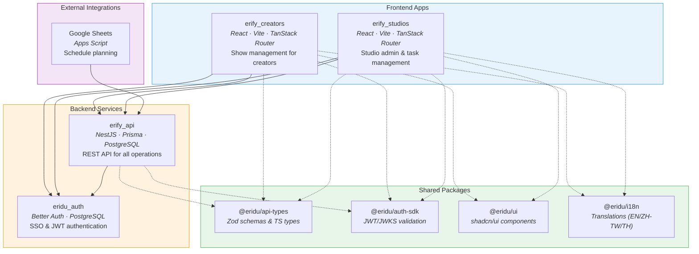

# Eridu Services

> **TLDR**: A TypeScript monorepo for live-commerce broadcast operations. `erify_api` (NestJS) manages shows, schedules, tasks, and users. `eridu_auth` (Better Auth) handles SSO. `erify_creators` and `erify_studios` (React/Vite) are the frontend apps. Shared packages provide type-safe API contracts, auth SDK, UI components, and i18n.

## Architecture



## Apps

- **`erify_api`** - REST API service built with NestJS for managing shows, schedules, tasks, users, and related entities
- **`eridu_auth`** - Better Auth service for SSO across all services in the monorepo
- **`erify_creators`** - React application for managing shows, built with TanStack Router, TypeScript, and Vite
- **`erify_studios`** - React application for studio admin, task management, and scheduling, built with TanStack Router, TypeScript, and Vite

### Authentication service

1. generate auth db schema for drizzle `pnpm auth:schema`
2. generate sql migration for database `pnpm db:generate`
3. migrate auth schema to db `pnpm db:migrate`

### Packages

- **`@eridu/api-types`** - Shared API type definitions and Zod schemas
- **`@eridu/auth-sdk`** - Authentication SDK for JWT validation and JWKS management
- **`@eridu/eslint-config`** - Shared ESLint base configuration
- **`@eridu/i18n`** - Shared internationalization translations and locale utilities
- **`@eridu/typescript-config`** - Shared TypeScript base configuration
- **`@eridu/ui`** - Shared UI components with [`shadcn/ui`](https://ui.shadcn.com/)

### to-dos

- [ ] setup semantic versioning
- [x] setup `docker-compose` for related services
- [x] Optimize `eslint` settings for editor
- [x] setup `husky` commit hooks
  - [x] `eslint` before commit
  - [x] `sherif` before commit
  - [x] `commitlint` before commit
- setup `vitest` for unit tests
  - [x] `erify_creators` app
- setup CI
  - [ ] Github actions

### Git Hooks

This monorepo uses [`husky`](https://typicode.github.io/husky/) to manage Git hooks and ensure code quality before commits.

#### Pre-commit Hook

The pre-commit hook runs automatically before each commit and executes:

1. **ESLint** - Lints all code across the monorepo using `pnpm lint`
2. **Sherif** - Checks that dependency versions are aligned across all packages using `pnpm sherif`

If any of these checks fail, the commit will be blocked.

#### Commit Message Hook

The commit-msg hook validates commit messages using [`commitlint`](https://commitlint.js.org/) with the [Conventional Commits](https://www.conventionalcommits.org/) format.

Commit messages must follow the format:
```
<type>(<scope>): <subject>
```

Examples:
- `feat: add new authentication endpoint`
- `fix(api): resolve schedule validation bug`
- `chore: update dependencies`

Valid types: `feat`, `fix`, `docs`, `style`, `refactor`, `perf`, `test`, `chore`, `ci`, `build`, `revert`

#### Setup

Husky is automatically initialized when you run `pnpm install` (via the `prepare` script). The hooks are located in `.husky/` directory.

### Utilities

[`sherif`](https://www.npmjs.com/package/sherif) to check if the same dependencies are in the same version across monorepo.

```bash
# check dependency versions in the mono repo
pnpm sherif

# fix and install dependencies in aligned versions
pnpm sherif --fix

# fix dependencies in aligned versions without install
pnpm sherif --fix --no-install
```

### Build

To build all apps and packages, run the following command:

```bash
pnpm build
```

### Develop

To develop all apps and packages, run the following command:

```bash
pnpm dev
```

### Test

To test all apps and packages, run the following command:

```bash
pnpm test
```
