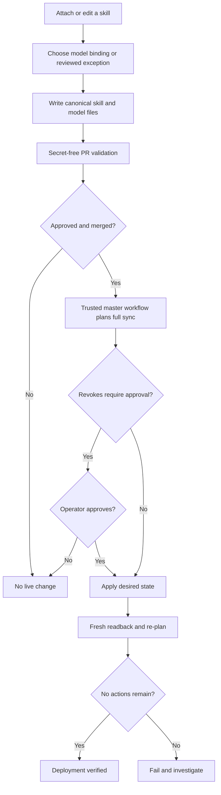

# Open WebUI Scaffold

This directory contains repo-managed Open WebUI assistant definitions, tool access policy, and Open WebUI-importable skill adapters.

## Intended role

Open WebUI should be the user-facing AI workspace. It should provide a small set of curated assistants rather than exposing raw LLM provider choices to every user.

## Files

**Git is the source of truth.** `skills/` and `models/` own the live instance's skill content and
assistant configuration; the live instance is a projection of them. A change made in the Open WebUI
admin UI is drift to be reconciled, not a new version.

| File | Purpose |
|---|---|
| `skills/` | **Source of truth** for Open WebUI skill content, one `<skill-id>.md` per skill. |
| `models/` | **Source of truth** for Workspace Model (assistant) manifests, including group access. |
| `claude-skills/` | Source for installable Claude Chat/Cowork skills. These agents create PRs and never receive the production Open WebUI key. |
| `package_claude_skill.py` | Packages the Chat/Cowork `upload-openwebui-skill` folder as a correctly rooted ZIP. |
| `validate_config.py` | Runs secret-free PR admission checks for skill metadata, model bindings, audiences, and the Cowork adapter. |
| `skill-delivery-exceptions.json` | Reviewed legacy exceptions to the binding and audience admission rules. Exceptions do not grant access. |
| `push_config.py` | Applies `skills/` and `models/` to the live instance and reconciles derived skill grants. Dry run by default; `--apply` writes. Run as `python3 ai/openwebui/push_config.py all`. |
| `pull_config.py` | Fetches live config into `synced/` for drift detection. Validates every required response before writing, and exits non-zero without changing snapshots if a read fails. Run as `python3 ai/openwebui/pull_config.py`. |
| `synced/` | Read-only drift snapshot of the live config (groups, tool-server connections, default permissions, knowledge, and a per-skill drift report). Not an edit surface. |
| `tool-access.example.json` | Example MCP tool access policy by group. |
| `knowledge/` | Git-authored Markdown knowledge sources and generated manifests for Open WebUI knowledge collections. |
| `functions/` | Canonical source for Open WebUI Functions (Pipes/Filters/Actions/Events), applied via the Admin API. Function source lives in Open WebUI's own database once deployed, not in Git — this is the reviewed copy. |

## Delivering a change

Follow [`.agents/workflows/openwebui-sync-delivery.md`](../../.agents/workflows/openwebui-sync-delivery.md),
run `/upload-openwebui-skill` in Claude Code, invoke `$upload-openwebui-skill` in a compatible agent,
or install the packaged skill in Claude Chat/Cowork.

| Client | Entry point | Procedure source | Live write |
| --- | --- | --- | --- |
| Claude Code | `/upload-openwebui-skill` | Canonical repository skill and workflow | No |
| Codex | `$upload-openwebui-skill` | Canonical repository skill and workflow | No |
| OpenCode | `upload-openwebui-skill` | Canonical repository skill and workflow | No |
| Claude Chat/Cowork | Installed `upload-openwebui-skill` adapter | Reads the canonical files from `master` each run | No |

Every client creates or hands off the same Git change. The pull request validates desired state; a
merge to `master` is the only event that can trigger production sync.

```bash
python3 ai/openwebui/push_config.py all           # dry run: what would change live
python3 ai/openwebui/push_config.py all --apply   # write
python3 ai/openwebui/pull_config.py               # refresh the drift snapshot
```

### Delivery workflow



### Claude Chat/Cowork distribution

Package the reviewed source:

```bash
python3 ai/openwebui/package_claude_skill.py /tmp/upload-openwebui-skill.zip
```

An Anthropic organization owner uploads and enables the ZIP, and GitHub is authorized for repository
content and pull-request access. Follow the complete [Claude Chat and Cowork setup](claude-skills/README.md)
for roles, permissions, first-run verification, updates, and troubleshooting.

The shared skill records content, bindings, and access impact in Git. It never asks for an Open WebUI
key and never writes live state. The trusted `master` workflow deploys after review and merge.

## Existing repo skill hierarchy

The monorepo already has canonical project skills in:

```text
.agents/skills/
```

Open WebUI skills in this directory should not compete with that system. They should wrap, summarize, or adapt canonical skills for non-developer workspace users.

Relevant existing sources include:

- `.claude/memory/skills-integration.md`
- `.agents/skills/openwebui-extensibility-design/SKILL.md` — which mechanism (Function, Tool, Tool Server, or legacy Pipeline) a new capability should use, and where its source lives
- `.agents/skills/operations-review-surface/SKILL.md`
- `.agents/skills/show-production-lifecycle/SKILL.md`
- `.agents/skills/frontend-ui-components/references/table-view-pattern.md`
- `.agents/skills/engineering-best-practices-enforcer/SKILL.md`
- `.agents/skills/agent-instruction-maintenance/SKILL.md`

## Tests

`push_config.py` decides who loses access, so its pure logic is covered by unit tests —
no network, no API key, no live instance:

```bash
python3 ai/openwebui/test_push_config.py
```

They cover the access derivation (`derive_skill_access`), grant construction
(`grants_for`), the model diff, the revoke gate's refusal on an unattended run, and
frontmatter parsing. `test_validate_config.py` covers the secret-free delivery admission policy.
Run the full suite before changing any of those:

```bash
python3 -m unittest discover -s ai/openwebui -p "test_*.py"
```

## Validate and apply with GitHub Actions

Three workflows cover PR admission, deployment, and drift. Only the trusted deployment and drift
jobs receive the live credential; none needs a service to maintain.

| Workflow | Trigger | Credentials | Does |
|---|---|---|---|
| [`openwebui-validate.yml`](../../.github/workflows/openwebui-validate.yml) | pull request touching delivery surfaces, or manual | None | validates skill metadata, model references, audience policy, tests, and the Cowork package |
| [`openwebui-sync.yml`](../../.github/workflows/openwebui-sync.yml) | push to `master` touching `skills/**`, `models/**`, or `push_config.py` | Open WebUI admin key | runs `push_config.py all --apply` |
| [`openwebui-drift.yml`](../../.github/workflows/openwebui-drift.yml) | Mondays 02:17 UTC, or manual | Open WebUI admin key | compares live and repo state and maintains a redacted drift issue |

Pull requests run only the secret-free validator. Production sync remains `push` on `master` only.
**Never give the pull-request workflow the Open WebUI key** — this repository is public, and fork
code must not reach production credentials.

The drift workflow exists because the sync workflow only sees changes that arrive through
Git. Someone editing a skill or a grant in the Open WebUI admin UI produces no Git event, so
without the weekly check it would go unnoticed until a merge silently reverted it.

### The revoke gate

A run whose plan contains any revoke **aborts before writing anything at all** — not partway
through. `push_config.py` builds the complete plan across skills, models, and access before
the first write precisely so this gate can stop all of it. Additive changes land unattended;
anything that would remove access does not.

To apply a plan that does revoke, run the sync workflow manually
(`workflow_dispatch`) with **Allow revoking access grants** checked. That is a deliberate
human action, not something a merge can do.

That guarantee covers the revoke gate only. Once past it the writes are applied in sequence with no
rollback, so an HTTP failure midway can leave earlier writes in place. A fresh readback follows every
successful action sequence and fails if required changes did not persist. Fix the cause and rerun;
the operations are idempotent upserts.

### Configuration

| Name | Where | Value |
|---|---|---|
| `OPEN_WEBUI_HOST` | repository **variable** | the instance's public URL |
| `OPEN_WEBUI_API_KEY` | repository **secret** | an admin key |

A GitHub runner is outside Railway, so it reaches Open WebUI over the public domain rather
than `open-webui.railway.internal`. That is a real step down from private networking — the
key travels over TLS from GitHub's runners — accepted in exchange for deleting the service
that would otherwise exist only to run a short script.

`OPEN_WEBUI_API_KEY` can revoke grants and delete skills. Rotate it in Open WebUI and update
the secret if it leaks.

## Assistant definition pattern

See [`models/README.md`](models/README.md) for the manifest contract. Each assistant defines a
display name, business purpose, base model, bound skills, knowledge references, MCP tools, and
group access.

## Access model

Access is expressed once, on the model:

```text
model  -> skills   (manifest `skill_ids`)
model  -> groups   (manifest `access`)
skill  -> groups   DERIVED: model audiences read; Admins write canonical skill content
```

Open WebUI `0.10.2` filters model-bound, menu-selected, and `$`-mentioned skill ids through the same
skill read grants. A model audience therefore also gets direct menu and mention use of each bound
skill. `push_config.py access` enforces that version-specific relationship and reserves skill write
access for Admins. Widen access by editing the model manifest, never by hand-editing a skill grant.

A new or changed skill must have a model audience or an explicit `"access": "admins-only"` staging
marker. `skill-delivery-exceptions.json` records inherited cases that cannot yet satisfy that rule.
The validator rejects missing reasons, stale exceptions, and new unresolved skills. An exception
only permits review of the declared legacy state; it never creates an Open WebUI grant.

## Skill management rule

Skills are authored in `skills/` and pushed. Open WebUI can still be used to try something quickly,
but a UI edit is drift: `synced/skills-drift.json` will flag it, and the next push overwrites it
unless someone adopts the change back into Git first.

Before adding a new Open WebUI skill, search `.agents/skills/` first. If a matching canonical skill exists, create an adapter that references it instead of duplicating it.
