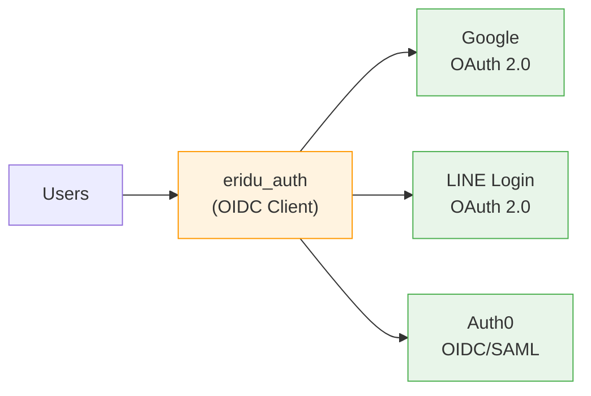

# SSO Guide

> **TLDR**: `eridu_auth` acts as an OIDC client connecting to providers like Google, LINE, and Auth0. Provider credentials are configured via environment variables. SSO is architecturally ready but **not yet enabled** in Phase 1.

## Architecture



`eridu_auth` uses [Better Auth](https://better-auth.com/) as its core. Better Auth acts as an **OIDC client** — it connects to external identity providers (Google, LINE, Auth0, etc.) and handles:

1. OAuth flow orchestration (redirect → callback → token exchange)
2. User account creation/linking from provider profiles
3. Session management and JWT issuance
4. JWKS endpoint for downstream services to verify tokens

---

## Provider Setup

### Google OAuth

#### 1. Create Google Cloud Project

1. Go to [Google Cloud Console](https://console.cloud.google.com/)
2. Create a new project or select existing
3. Enable the **Google+ API** or **People API**

#### 2. Create OAuth Credentials

1. Navigate to **APIs & Services → Credentials**
2. Click **Create Credentials → OAuth client ID**
3. Application type: **Web application**
4. Authorized redirect URIs: `{BETTER_AUTH_URL}/api/auth/callback/google`
   - Dev: `http://localhost:3000/api/auth/callback/google`
   - Prod: `https://auth.example.com/api/auth/callback/google`

#### 3. Configure Environment

```env
GOOGLE_CLIENT_ID=your-client-id.apps.googleusercontent.com
GOOGLE_CLIENT_SECRET=your-client-secret
```

#### 4. Test Flow

```
GET {BETTER_AUTH_URL}/api/auth/sign-in/social?provider=google&callbackURL={YOUR_APP_URL}
```

---

### LINE Login

#### 1. Create LINE Login Channel

1. Go to [LINE Developers Console](https://developers.line.biz/)
2. Create a new provider (or select existing)
3. Create a new **LINE Login** channel
4. Note: **Messaging API** channels will not work for login

#### 2. Configure Channel

1. Under **LINE Login** tab, set callback URL: `{BETTER_AUTH_URL}/api/auth/callback/line`
   - Dev: `http://localhost:3000/api/auth/callback/line`
   - Prod: `https://auth.example.com/api/auth/callback/line`
2. Enable required scopes: `profile`, `openid`, `email`

#### 3. Configure Environment

```env
LINE_CLIENT_ID=your-channel-id
LINE_CLIENT_SECRET=your-channel-secret
```

#### 4. Test Flow

```
GET {BETTER_AUTH_URL}/api/auth/sign-in/social?provider=line&callbackURL={YOUR_APP_URL}
```

---

### Auth0 / Generic OIDC (Future)

Better Auth supports connecting to any OIDC-compliant provider. For Auth0 or enterprise SAML federation:

1. Configure Auth0 as an OIDC provider in Better Auth
2. Set discovery URL: `https://your-tenant.auth0.com/.well-known/openid-configuration`
3. Map provider claims to Better Auth user attributes

---

## Provider Selection Strategy

| Criteria | Google | LINE | Auth0/SAML |
|----------|--------|------|------------|
| **Use case** | Employees, general users | Thai market users | Enterprise SSO |
| **Regions** | Global | Japan, Thailand, Taiwan | Global |
| **Setup complexity** | Low | Low | Medium |
| **Enterprise SAML** | ❌ | ❌ | ✅ |

---

## Frontend Integration

Frontends use `@eridu/auth-sdk` to initiate SSO flows:

```typescript
import { createAuthClient } from '@eridu/auth-sdk/client/react';

const { client, redirectToLogin } = createAuthClient({
  baseURL: 'http://localhost:3000',
});

// Redirect to SSO provider
await client.signIn.social({
  provider: 'google',            // or 'line'
  callbackURL: window.location.origin,
});
```

---

## Security Considerations

1. **Always HTTPS in production** — OAuth redirect URIs must use HTTPS
2. **Validate redirect URIs** — Only allow registered callback URLs
3. **Rotate secrets** — Periodically rotate client secrets for all providers
4. **Scope minimization** — Only request the scopes you need (profile, email)
5. **Account linking** — Better Auth handles linking multiple providers to one account via email matching
