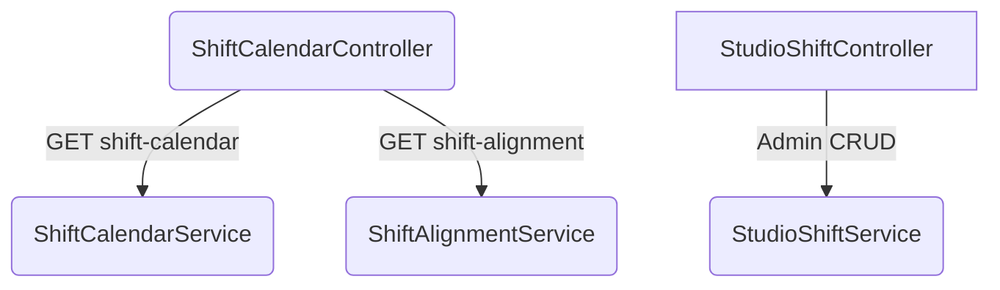

> [!NOTE]
> Studio Shift Schedule provides shift planning, duty-manager coverage analysis, and show-task readiness detection for live-commerce studios. It bridges the gap between raw backend orchestration and frontend UX.

## Business Rules

### Operational Day Boundary

Backend orchestration and frontend UX intentionally use different boundary semantics based on their operational requirements.

- **Backend orchestration (`shift-alignment`)**: operational day starts at **06:00 UTC** for consistent risk bucketing.
- **Frontend route UX (`dashboard`, `my-shifts`)**: operational day windows are computed in **local runtime time** from date inputs, then serialized to ISO for API filters.

This is compatible with the storage rule: DB timestamps are UTC instants; presentation and date-input interpretation are local.

### Duty-Manager Coverage

There is a two-level check performed during Shift Alignment:

1. **Per-show**: each upcoming show must overlap with at least one duty-manager shift block 
2. **Per-operational-day**: continuous duty-manager coverage from first-show-start to last-show-end 

### Task Readiness Contract

Each upcoming show is verified against a readiness contract prior to execution:
- **Missing Tasks:** Zero tasks linked to show.
- **Unassigned:** Tasks with `assigneeId === null`.
- **Missing Baseline:** Must have `SETUP` and `CLOSURE` stages.
- **Premium Coverage:** `premium` flagged shows require moderation coverage.

## Orchestration Architecture

### 1. ShiftCalendarService
Read-only aggregation for admin planning:
- Timeline grouped by UTC day → member → shifts → blocks
- Period-level totals (hours, projected cost, calculated cost)
- Clips and splits cross-day blocks for accurate per-day sums

### 2. ShiftAlignmentService
Planning-risk analysis for admin warnings:
- Forward-looking only (skips past shows)
- Reports missing duty managers, uncovered segments, and task readiness warnings.

*Imported from developer `.agent/skills` directly to the unified Eridu Docs knowledge base.*
