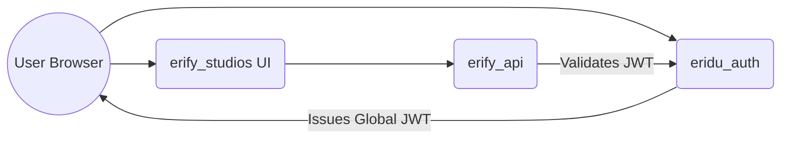

> [!NOTE]
> Eridu Services utilizes a distributed architecture where **Authentication** (who you are) is strictly decoupled from **Authorization** (what you can do). 

## High-Level Architecture

The monorepo splits user management across distinct applications. 

---

## 1. Registration (`eridu_auth`)

`eridu_auth` acts as the **Global Identity Provider** for all Eridu properties.

When a user registers or logs in via `eridu_auth`:
1. A global `User` record is verified or created.
2. The system generates a cryptographically signed JSON Web Token (JWT).
3. The JWT is stored securely in an HTTP-Only cookie (`eridu_session_token`).

> [!WARNING]
> A newly registered user has **zero permissions** in the broader ecosystem. They have simply proven their identity. If they attempt to load `erify_studios` at this exact moment, they will encounter a global "No Access" or "No Studio Assigned" state because they lack a membership.

---

## 2. Studio Enablement (`erify_api` & `erify_studios`)

For a user to actually do work, they must be granted access to a specific domain (e.g., a live-commerce Studio). This is handled entirely by `erify_api` through the concept of **Studio Memberships**.

### The Admin Workflow

To enable a newly registered user, a System Admin (or existing Studio Admin) must perform the following explicit steps:

1. **Locate the Identity:** Retrieve the user's unique global identifier (UID) that was generated by `eridu_auth`.
2. **Grant Membership:** Via `erify_studios` (Admin Panel) or backend scripts, the admin creates a `StudioMembership` record.
3. **Assign a Role:** The admin must assign one of the 6 strict hierarchical roles:
   - `ADMIN` (Full studio access + membership management)
   - `MANAGER` (Full studio access, no membership management)
   - `TALENT_MANAGER` (Creator roster/availability only)
   - `DESIGNER`, `MODERATION_MANAGER`, `MEMBER` (Dashboard, own-tasks, own-shifts only)

### How It Works Under The Hood

When the newly enabled user navigates to `erify_studios`:
1. The browser automatically sends the `eridu_session_token` to `erify_api`.
2. `erify_api` reads the token, confirms it is mathematically valid via JWKS public key verification, and extracts the `userid`.
3. The backend hits a `@StudioProtected()` endpoint.
4. The application queries the `erify_api` database: *"Does this known UserId have an active `StudioMembership` for the requested StudioId, and does their role satisfy the endpoint requirements?"*
5. Access is granted seamlessly.

> [!TIP]
> **Why decouple them?** By keeping authorization logic out of the global JWT, an Admin can instantly revoke a user's `StudioMembership` or demote their role in `erify_api`, and access is immediately blocked on their very next API request—no need to wait for a 1-hour JWT expiration window or perform complex token blacklisting.
