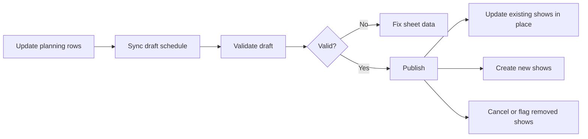

> [!IMPORTANT]
> Keep the **Show ID** stable after a show has been published once. The publish flow matches shows by that ID. If you change it, the system treats the old show as removed and the new row as a brand-new show.

## At a Glance

This workflow lets operators manage draft schedules in Google Sheets, validate them, and publish them into live show records. The sheet is the source of truth for show-owned details like name, time, room, status, creators, and platform mappings.

When you publish an updated sheet, the system does **not** wipe all old shows and recreate them. It compares each incoming row against the existing live schedule and then updates, creates, cancels, or restores records as needed.

## What You Need

- Access to the Google Sheet tabs used for scheduling, especially `schedules` and `show_planning`.
- A schedule row that already has a server-generated **Schedule ID**.
- A stable **Show ID** for every row that should stay linked to the same live show over time.
- A synced **Version** in the `schedules` tab. If the sheet version is stale, validate and publish can be skipped.

> [!TIP]
> Do not manually overwrite the Schedule ID or Version columns. If they drift from the server, use the version-sync helper before retrying.

## How the Workflow Moves

### 1. Create or select the schedule

The `schedules` tab is where each schedule row stores the Schedule ID, current status, version, and operator notes.

- New schedules start as `draft`.
- Operators mark the schedules they want to work on as active in the sheet.
- The sheet keeps the current server version so later updates can use optimistic locking safely.

### 2. Sync planning rows into the draft

The update script groups planning rows by schedule and pushes them into the draft schedule.

What happens during sync:

- Every successful draft update creates a snapshot automatically.
- The schedule version increases by 1.
- If the schedule had already been published, it is moved back to `draft` so the new changes can be reviewed and republished.
- The `show_planning` rows are marked `Synced` on success.

If the script finds a version mismatch, it fetches the latest version from the server and retries once. If that still fails, the row is marked with an error so you can fix it before moving on.

### 3. Validate the draft

Validation checks the draft before publish. In plain terms, it looks for:

- missing IDs or missing required fields
- bad date or time ranges
- invalid room, client, show type, status, or standard references
- room overlaps inside the same schedule
- creator double-bookings inside the same schedule

If validation succeeds, the schedule status moves from `draft` to `review`. If it fails, the note column explains what to fix.

### 4. Publish the reviewed schedule

Publish only runs for schedules that are in `review` and still have the same version on the sheet and the server.

When publish succeeds:

- the schedule status becomes `published`
- live shows are updated from the latest sheet data
- the note column records the publish result

## What Happens When You Update Shows

| Change in the sheet | What publish does |
| --- | --- |
| Same Show ID, changed name/time/room/status | Updates the existing live show in place |
| Same Show ID, changed creators or platforms | Updates those links to match the latest sheet |
| New Show ID | Creates a new live show |
| Row removed from the sheet | Keeps the old show record and changes its status instead of deleting it |
| Previously removed row comes back with the same Show ID | Restores the existing show record instead of making a second copy |

> [!NOTE]
> For show-owned fields, the latest published sheet wins. If someone changed those same fields in the web app, the next publish from Google Sheets overwrites them.

### Example: the show moves from 9:00 AM to 10:00 AM

If the row keeps the same Show ID and only the time changes:

- the same live show record is updated from `9:00 AM` to `10:00 AM`
- tasks already linked to that show stay linked to it
- the system does not delete and recreate those tasks just because the time changed

The important limit is that schedule publish updates the show record, not every downstream task field. If task due dates were generated earlier from the old show time, publish does **not** automatically recalculate those due dates for you.

## What Happens to Old Records

This is the critical behavior to remember when a show disappears from the latest schedule update.

### Removed shows are not deleted during normal publish

The system keeps the older show record so linked work is not lost accidentally.

### If the removed show has no linked tasks

The old show is moved to **Cancelled**.

### If the removed show still has linked tasks

The old show is moved to **Cancelled Pending Resolution**. This keeps the record visible for cleanup because downstream work is still attached.

### If that show comes back later with the same Show ID

The system treats it as the same show again:

- the existing record is restored
- show details are updated in place
- related task links can continue from that same show identity

## Operator Guardrails

- Do not change a Show ID just to rename a show. Edit the show details and keep the ID the same.
- If you intentionally want a brand-new show, use a brand-new Show ID.
- If a published schedule is edited again, expect it to go back to `draft` and require validate + publish one more time.
- If publish is skipped because of version mismatch, sync the version from the server first.

## Related Guides

- [SOP: Update and Publish Google Sheets Schedules](/scheduling/publish-sop/)
- [Scheduling FAQ](/scheduling/faq/)
- [Studio Shift Schedule](/reference/shift-schedule/)
