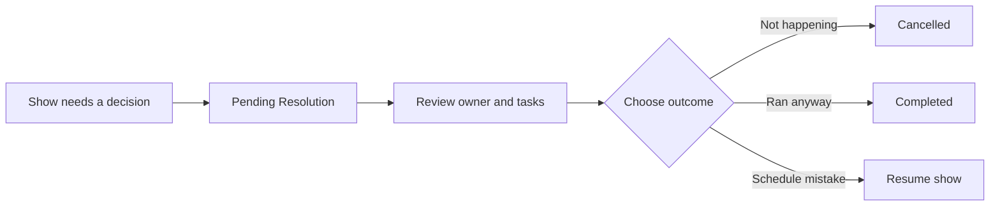
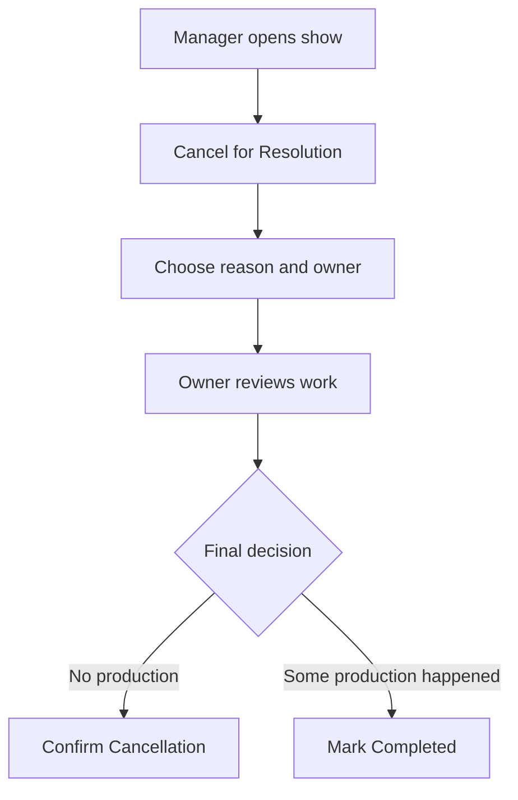
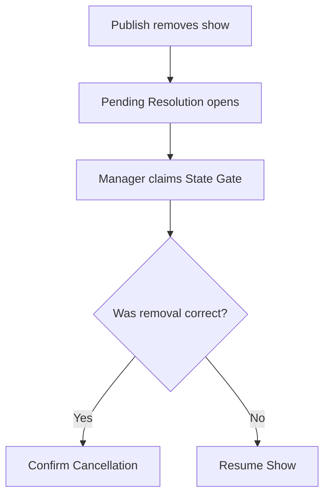

> **Role required**: Studio Admin or Studio Manager to create, claim, and resolve pending show resolution work. Account Managers can review show details, but cannot make resolution changes.
> **App**: erify_studios

## At a Glance

Pending show resolution is the review flow for a show that cannot continue normally until a human chooses what happened. It appears when a manager manually cancels a show for follow-up, or when schedule publishing removes a show that still has active work attached.

## What You Need

- Studio Admin or Studio Manager access for the studio.
- The show open in **Shows** or the pending work visible in **Task Review**.
- A clear reason for the decision, because resolution notes become part of the show history.
- Any active show tasks closed, completed, or reassigned before confirming a full cancellation.

## How People Are Involved

| Role | What they look at | What they can change |
| --- | --- | --- |
| Planner | Google Sheets schedule row and publish result | Fix the source schedule, then republish if the show was removed by mistake |
| Studio Admin | Show detail, Task Review, show task list, gate history | Create pending resolution, claim unassigned resolution work, resolve the show, and clean up tasks |
| Studio Manager | Show detail, Task Review, show task list, gate history | Same resolution actions as Studio Admin, except admin-only show deletion |
| Resolution Owner | The assigned owner shown on the Cancellation Resolution card | Owns the follow-up decision and writes the final resolution notes |
| Task Assignee | The show task list and their own tasks | Completes or closes assigned work that may block cancellation |
| Account Manager | Show detail and related read-only context | Reviews status and context only; does not claim or resolve pending work |

## Where To Look

### Shows

Use **Shows** when you know which show needs review.

1. Open the studio.
2. Go to **Shows**.
3. Open the show.
4. Find the **Cancellation Resolution** card.

The card shows the current owner, reason, pending status, and resolution history. If the show is not pending resolution yet, Studio Admins and Studio Managers can use **Cancel for Resolution** from this card.

### Task Review

Use **Task Review** when you need to find unassigned or unresolved resolution work across many shows.

1. Go to **Task Review**.
2. Look for tasks with type **State Gate**.
3. If a State Gate is unassigned, click **Claim**.
4. Open the linked show to finish the resolution.

> [!TIP]
> State Gate tasks are coordination records. They are not form-submission tasks. Use them to claim and track the decision, then resolve from the show.

### Show Tasks

Use the show task list when cancellation is blocked by active work.

1. Open the show.
2. Go to the **Tasks** tab.
3. Review active tasks attached to the show.
4. Complete, close, or reassign the tasks that should not remain attached before cancellation.

If you try to confirm cancellation while active tasks remain, the dialog shows how many active tasks are blocking the decision and links you to the show task list.

## Common Paths

### Manual cancellation

Use this when the team knows the show needs a follow-up decision.

1. Open the show from **Shows**.
2. Click **Cancel for Resolution**.
3. Select a reason category.
4. Assign a resolution owner.
5. Add a clear reason, optional due date, and follow-up notes.
6. Click **Move to Pending**.

What to check before resolving:

- Did the show happen at all?
- Are there active tasks still attached?
- Does the resolution owner agree with the final decision?
- Do the notes explain why the decision was made?

Available outcomes:

| Outcome | Use when |
| --- | --- |
| **Confirm Cancellation** | The show did not happen and should not count as completed production |
| **Mark Completed** | The show partially or fully ran and should finish as completed |

### Removed by schedule publish

Use this when a republished schedule removed a show that still had work attached.

1. Go to **Task Review**.
2. Find the unassigned **State Gate** task.
3. Click **Claim**.
4. Open the linked show.
5. Review the latest schedule row, show status, linked tasks, and gate history.
6. Resolve the show from the **Cancellation Resolution** card.

Available outcomes:

| Outcome | Use when |
| --- | --- |
| **Confirm Cancellation** | The removed show truly is not happening |
| **Resume Show** | The schedule removed the show by mistake or the show should continue |

> [!WARNING]
> If the schedule was wrong, fix the Google Sheet too. Resuming the show in the app keeps operations moving, but the next publish can remove it again if the source schedule still omits it.

## What Can Block Resolution

| What you see | Why it happens | What to do |
| --- | --- | --- |
| **Claim this gate from the task list before resolving it** | The pending work has no owner yet | Go to **Task Review**, claim the State Gate, then return to the show |
| Active tasks still attached | Cancelling would leave unfinished show work behind | Use the **Tasks** tab to close, complete, or reassign the active tasks |
| Show was live when interrupted | A live show usually had production activity | Use **Mark Completed** or **Resume Show** instead of confirming cancellation |
| Resume notice remains visible | The show was resumed after a schedule-removal gate | Fix the Google Sheet and publish the corrected schedule; the notice clears after the show appears in a later publish |

## Review Checklist

Before choosing the final outcome, confirm:

- The reason category matches what actually happened.
- The resolution owner is correct.
- Gate history shows who opened, claimed, or resolved the work.
- Active tasks have been handled if you plan to confirm cancellation.
- The source schedule is corrected if the show should continue.
- Resolution notes are written for a future reviewer who was not in the discussion.

## Common Questions

### Can another manager resolve a gate owned by someone else?

The app requires the gate to have an owner before it can be resolved. Operationally, use the owner field and gate history to coordinate before another Admin or Manager takes over the final decision.

See also: [SOP: Update and Publish Google Sheets Schedules](/scheduling/publish-sop/)

### Why can I see the show but not resolve it?

You may have read-only access, or the work may need to be claimed first. Account Managers can inspect show details but cannot change the cancellation resolution.

See also: [Scheduling FAQ](/scheduling/faq/)

### Why does cancellation say active tasks remain?

Cancellation is blocked while unfinished work is still attached to the show. Open the **Tasks** tab from the dialog, then complete, close, or reassign the tasks before trying again.

See also: [Google Sheets Schedule Publishing](/scheduling/google-sheets-publishing/)

## Related Guides

- [Google Sheets Schedule Publishing](/scheduling/google-sheets-publishing/)
- [SOP: Update and Publish Google Sheets Schedules](/scheduling/publish-sop/)
- [Scheduling FAQ](/scheduling/faq/)
