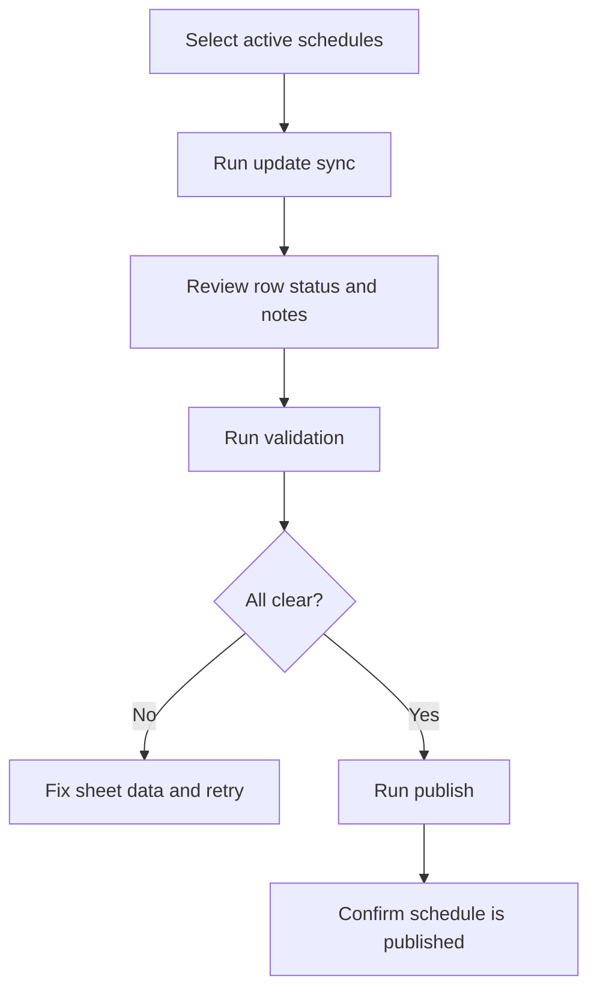

## Purpose

Use this SOP when you need to move planning changes from Google Sheets into the live show schedule.

## Before You Start

- Confirm the target schedules are checked as active in the `schedules` tab.
- Confirm each schedule row has a Schedule ID and Version.
- Confirm every show row has a stable Show ID.
- Confirm you are ready for the latest sheet values to overwrite live show-owned fields.

## Procedure

### 1. Sync the latest planning rows

Run the update script for the selected schedules.

Expected result:

- `show_planning` rows become `Synced`
- the parent schedule version increases
- any previously published schedule returns to `draft`

If you see `Validation Error` or `Error`, fix those rows before moving forward.

### 2. Review warnings in the schedules tab

Check the note column for messages such as:

- `No shows found in planning`
- version mismatch warnings
- API or publish errors

Do not continue until the warning is understood.

### 3. Validate the draft schedule

Run validation for the selected schedules.

Expected result:

- valid schedules move from `draft` to `review`
- invalid schedules stay out of review and show the reason in the note column

### 4. Publish the reviewed schedule

Run publish only after validation passes.

Expected result:

- schedule status becomes `published`
- note column records the publish time
- live shows match the latest published sheet data

### 5. Confirm continuity behavior for removed or changed shows

After publish, confirm the outcome matches the type of change you made:

- edited rows with the same Show ID should update the existing live show
- brand-new Show IDs should create new live shows
- removed rows should leave the old show record in place with a cancelled status outcome

## Recovery Steps

### Version mismatch

1. Run the version sync helper.
2. Retry the update or validate step.
3. Revalidate before publish if the draft changed.

### Removed show still has downstream work

Expect the old show to move to **Cancelled Pending Resolution** instead of disappearing. This is normal and protects linked tasks from being dropped silently.

### Published schedule changed again

If you sync more edits after publish, the schedule goes back to `draft`. Repeat the normal cycle:

1. update
2. validate
3. publish

## Related Guides

- [Google Sheets Schedule Publishing](/scheduling/google-sheets-publishing/)
- [Scheduling FAQ](/scheduling/faq/)
