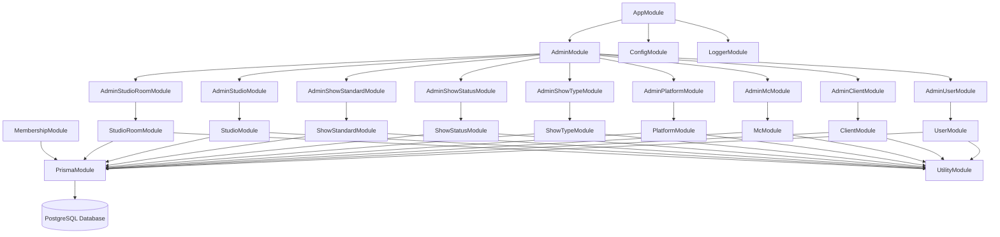
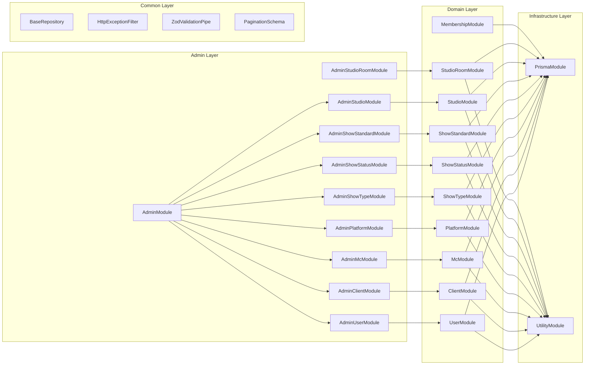
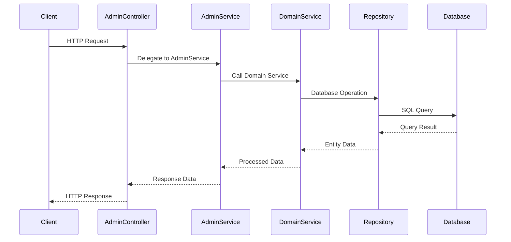
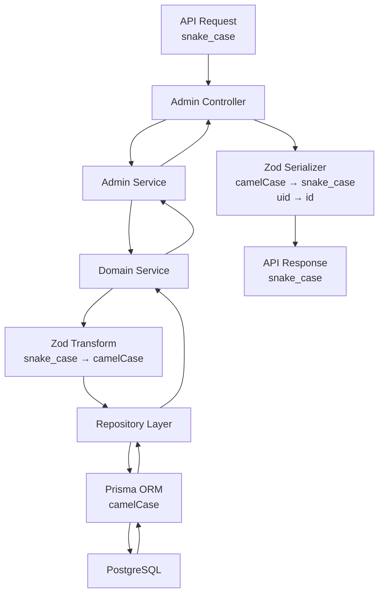

# Eridu Services API Architecture

This document provides a comprehensive overview of the module architecture and relationships in the Eridu Services API.

## Table of Contents

- [Overview](#overview)
- [Module Architecture](#module-architecture)
- [Module Relationships](#module-relationships)
- [Data Flow](#data-flow)
- [Key Components](#key-components)
- [API Endpoints](#api-endpoints)

## Overview

The Eridu Services API is built using NestJS with a modular architecture that separates concerns into distinct layers. Currently, the implementation focuses on the foundation layer with basic administrative operations for core entities.

**Current Implementation Status:**
- **Phase 1**: Core Functions with Hybrid Authentication - Essential CRUD operations, basic show management, JWT validation for user identification, and simple Membership-based admin verification
- **Admin Layer**: Administrative operations for Users, Clients, MCs, Platforms, Studios, and related entities
- **Domain Layer**: Business logic for core entities with proper service patterns
- **Infrastructure Layer**: Database access, utilities, and common services
- **Common Layer**: Shared utilities, decorators, and base classes
- **Authentication**: JWT token validation from `erify_auth` service for user identification
- **Authorization**: Simple Membership model for admin verification (Phase 1 basics, Phase 3 enhancements)

**Phase 2 Planned Features:**
- **Scheduling System**: Multi-version scheduling with change tracking
- **Collaborative Planning**: Client-studio collaboration workflows
- **Resource Management**: Studio room allocation and conflict detection
- **Basic Collaboration**: Comments and user attribution

**Phase 3 Planned Features:**
- **Advanced Authorization**: Role-based access control with granular permissions
- **Audit Trail**: Comprehensive change tracking and compliance
- **Task Management**: Complete workflow automation and task templates
- **Advanced Collaboration**: Tagging, enhanced comments, and notifications
- **Material Management**: Complete material versioning and platform targeting

## Module Architecture

### High-Level Module Structure



### Detailed Module Dependencies



## Module Relationships

### 1. AppModule (Root Module)
- **Purpose**: Application bootstrap and global configuration
- **Imports**: 
  - `ConfigModule` (Global configuration)
  - `LoggerModule` (Structured logging)
  - `AdminModule` (Main business logic)
- **Providers**: Global pipes, interceptors, and filters

### 2. AdminModule
- **Purpose**: Administrative operations aggregation
- **Imports**: 
  - `AdminUserModule`
  - `AdminClientModule` 
  - `AdminMcModule`
  - `AdminPlatformModule`
  - `AdminShowTypeModule`
  - `AdminShowStatusModule`
  - `AdminShowStandardModule`
  - `AdminStudioModule`
- **Exports**: All admin modules for external access

### 3. Domain Modules

#### UserModule
- **Purpose**: User entity management
- **Imports**: `PrismaModule`, `UtilityModule`
- **Providers**: `UserService`, `UserRepository`
- **Exports**: `UserService`

#### ClientModule
- **Purpose**: Client entity management
- **Imports**: `PrismaModule`, `UtilityModule`
- **Providers**: `ClientService`, `ClientRepository`
- **Exports**: `ClientService`

#### McModule
- **Purpose**: MC (Master of Ceremonies) entity management
- **Imports**: `PrismaModule`, `UtilityModule`
- **Providers**: `McService`, `McRepository`
- **Exports**: `McService`

#### PlatformModule
- **Purpose**: Platform entity management
- **Imports**: `PrismaModule`, `UtilityModule`
- **Providers**: `PlatformService`, `PlatformRepository`
- **Exports**: `PlatformService`

#### ShowTypeModule
- **Purpose**: ShowType entity management
- **Imports**: `PrismaModule`, `UtilityModule`
- **Providers**: `ShowTypeService`, `ShowTypeRepository`
- **Exports**: `ShowTypeService`

#### ShowStatusModule
- **Purpose**: ShowStatus entity management
- **Imports**: `PrismaModule`, `UtilityModule`
- **Providers**: `ShowStatusService`, `ShowStatusRepository`
- **Exports**: `ShowStatusService`

#### ShowStandardModule
- **Purpose**: ShowStandard entity management
- **Imports**: `PrismaModule`, `UtilityModule`
- **Providers**: `ShowStandardService`, `ShowStandardRepository`
- **Exports**: `ShowStandardService`

#### StudioModule
- **Purpose**: Studio entity management
- **Imports**: `PrismaModule`, `UtilityModule`
- **Providers**: `StudioService`, `StudioRepository`
- **Exports**: `StudioService`

#### StudioRoomModule
- **Purpose**: StudioRoom entity management
- **Imports**: `PrismaModule`, `UtilityModule`
- **Providers**: `StudioRoomService`, `StudioRoomRepository`
- **Exports**: `StudioRoomService`

#### MembershipModule
- **Purpose**: Membership entity management for user-group relationships
- **Imports**: `PrismaModule`
- **Providers**: `MembershipService`, `MembershipRepository`
- **Exports**: `MembershipService`

### 4. Admin Modules

#### AdminUserModule
- **Purpose**: Administrative user operations
- **Imports**: `UserModule`
- **Controllers**: `AdminUserController`
- **Providers**: `AdminUserService`

#### AdminClientModule
- **Purpose**: Administrative client operations
- **Imports**: `ClientModule`
- **Controllers**: `AdminClientController`
- **Providers**: `AdminClientService`

#### AdminMcModule
- **Purpose**: Administrative MC operations
- **Imports**: `McModule`
- **Controllers**: `AdminMcController`
- **Providers**: `AdminMcService`

#### AdminPlatformModule
- **Purpose**: Administrative platform operations
- **Imports**: `PlatformModule`
- **Controllers**: `AdminPlatformController`
- **Providers**: `AdminPlatformService`

#### AdminShowTypeModule
- **Purpose**: Administrative show type operations
- **Imports**: `ShowTypeModule`
- **Controllers**: `AdminShowTypeController`
- **Providers**: `AdminShowTypeService`

#### AdminShowStatusModule
- **Purpose**: Administrative show status operations
- **Imports**: `ShowStatusModule`
- **Controllers**: `AdminShowStatusController`
- **Providers**: `AdminShowStatusService`

#### AdminShowStandardModule
- **Purpose**: Administrative show standard operations
- **Imports**: `ShowStandardModule`
- **Controllers**: `AdminShowStandardController`
- **Providers**: `AdminShowStandardService`

#### AdminStudioModule
- **Purpose**: Administrative studio operations
- **Imports**: `StudioModule`
- **Controllers**: `AdminStudioController`
- **Providers**: `AdminStudioService`

#### AdminStudioRoomModule
- **Purpose**: Administrative studio room operations
- **Imports**: `StudioRoomModule`, `StudioModule`, `UtilityModule`
- **Controllers**: `AdminStudioRoomController`
- **Providers**: `AdminStudioRoomService`

### 5. Infrastructure Modules

#### PrismaModule
- **Purpose**: Database connection and ORM
- **Providers**: `PrismaService`
- **Exports**: `PrismaService`

#### UtilityModule
- **Purpose**: Utility functions (ID generation, etc.)
- **Providers**: `UtilityService`
- **Exports**: `UtilityService`

## Data Flow

### Request Processing Flow



### Data Processing Flow



## Key Components

### Services

| Service | Purpose | Dependencies |
|---------|---------|--------------|
| `UserService` | User CRUD operations | `UserRepository`, `UtilityService` |
| `ClientService` | Client CRUD operations | `ClientRepository`, `UtilityService` |
| `McService` | MC CRUD operations | `McRepository`, `UtilityService` |
| `StudioService` | Studio CRUD operations | `StudioRepository`, `UtilityService` |
| `StudioRoomService` | StudioRoom CRUD operations | `StudioRoomRepository`, `UtilityService` |
| `MembershipService` | Membership CRUD operations | `MembershipRepository` |
| `AdminUserService` | Admin user operations | `UserService` |
| `AdminClientService` | Admin client operations | `ClientService` |
| `AdminMcService` | Admin MC operations | `McService` |
| `AdminStudioService` | Admin studio operations | `StudioService` |
| `AdminStudioRoomService` | Admin studio room operations | `StudioRoomService`, `StudioService`, `UtilityService` |

### Repositories

| Repository | Purpose | Base Class |
|------------|---------|------------|
| `UserRepository` | User data access | `BaseRepository<User>` |
| `ClientRepository` | Client data access | `BaseRepository<Client>` |
| `McRepository` | MC data access | `BaseRepository<MC>` |
| `StudioRepository` | Studio data access | `BaseRepository<Studio>` |
| `StudioRoomRepository` | StudioRoom data access | `BaseRepository<StudioRoom>` |
| `MembershipRepository` | Membership data access | `BaseRepository<Membership>` |

### Utilities

| Utility | Purpose |
|---------|---------|
| `UtilityService` | ID generation, common utilities |
| `HttpExceptionFilter` | Global error handling |
| `ZodValidationPipe` | Request validation |
| `ZodSerializerInterceptor` | Response serialization |
| `BaseRepository` | Generic repository pattern with soft delete |
| `PaginationSchema` | Pagination query and response schemas |

## API Endpoints

### Admin Endpoints

#### Users
- `GET /admin/users` - List users with pagination
- `POST /admin/users` - Create user
- `GET /admin/users/:uid` - Get user by UID
- `PATCH /admin/users/:uid` - Update user
- `DELETE /admin/users/:uid` - Soft delete user

#### Clients
- `GET /admin/clients` - List clients with pagination
- `POST /admin/clients` - Create client
- `GET /admin/clients/:uid` - Get client by UID
- `PATCH /admin/clients/:uid` - Update client
- `DELETE /admin/clients/:uid` - Soft delete client

#### MCs
- `GET /admin/mcs` - List MCs with pagination
- `POST /admin/mcs` - Create MC
- `GET /admin/mcs/:uid` - Get MC by UID
- `PATCH /admin/mcs/:uid` - Update MC
- `DELETE /admin/mcs/:uid` - Soft delete MC

#### Platforms
- `GET /admin/platforms` - List platforms with pagination
- `POST /admin/platforms` - Create platform
- `GET /admin/platforms/:uid` - Get platform by UID
- `PATCH /admin/platforms/:uid` - Update platform
- `DELETE /admin/platforms/:uid` - Soft delete platform

#### ShowTypes
- `GET /admin/show-types` - List show types with pagination
- `POST /admin/show-types` - Create show type
- `GET /admin/show-types/:uid` - Get show type by UID
- `PATCH /admin/show-types/:uid` - Update show type
- `DELETE /admin/show-types/:uid` - Soft delete show type

#### ShowStatuses
- `GET /admin/show-statuses` - List show statuses with pagination
- `POST /admin/show-statuses` - Create show status
- `GET /admin/show-statuses/:uid` - Get show status by UID
- `PATCH /admin/show-statuses/:uid` - Update show status
- `DELETE /admin/show-statuses/:uid` - Soft delete show status

#### ShowStandards
- `GET /admin/show-standards` - List show standards with pagination
- `POST /admin/show-standards` - Create show standard
- `GET /admin/show-standards/:uid` - Get show standard by UID
- `PATCH /admin/show-standards/:uid` - Update show standard
- `DELETE /admin/show-standards/:uid` - Soft delete show standard

#### Studios
- `GET /admin/studios` - List studios with pagination
- `POST /admin/studios` - Create studio
- `GET /admin/studios/:uid` - Get studio by UID
- `PATCH /admin/studios/:uid` - Update studio
- `DELETE /admin/studios/:uid` - Soft delete studio

#### StudioRooms
- `GET /admin/studio-rooms` - List studio rooms with pagination
- `POST /admin/studio-rooms` - Create studio room
- `GET /admin/studio-rooms/:uid` - Get studio room by UID
- `PATCH /admin/studio-rooms/:uid` - Update studio room
- `DELETE /admin/studio-rooms/:uid` - Soft delete studio room

### Data Formats

#### Input Format (snake_case)
```json
{
  "name": "John Doe",
  "ext_id": "ext_123",
  "email": "john@example.com",
  "profile_url": "https://example.com/profile",
  "contact_person": "Jane Smith",
  "contact_email": "jane@example.com",
  "alias_name": "MC Alias",
  "user_id": 1,
  "is_banned": false,
  "metadata": {}
}
```

#### Output Format (snake_case with uid as id)
```json
{
  "id": "user_123",
  "ext_id": "ext_123",
  "email": "john@example.com",
  "name": "John Doe",
  "profile_url": "https://example.com/profile",
  "contact_person": "Jane Smith",
  "contact_email": "jane@example.com",
  "alias_name": "MC Alias",
  "user_id": 1,
  "is_banned": false,
  "created_at": "2024-01-01T00:00:00Z",
  "updated_at": "2024-01-01T00:00:00Z"
}
```

## Design Patterns

### 1. Repository Pattern
- Abstracts data access logic
- Provides consistent interface across entities
- Enables easy testing and mocking

### 2. Service Layer Pattern
- Separates business logic from controllers
- Provides reusable operations
- Handles cross-cutting concerns

### 3. Module Pattern
- Encapsulates related functionality
- Provides clear dependency boundaries
- Enables lazy loading and tree shaking

### 4. Decorator Pattern
- Adds functionality without modifying core classes
- Enables cross-cutting concerns (validation, serialization)
- Provides clean separation of concerns

## Testing Strategy

### Unit Tests
- Service layer testing with mocked dependencies
- Repository testing with in-memory database
- Utility function testing

### Integration Tests
- End-to-end API testing
- Database integration testing
- Module integration testing

### Test Structure
```
src/
├── user/
│   ├── user.service.spec.ts
│   └── user.repository.spec.ts
├── admin/
│   └── users/
│       └── admin-user.service.spec.ts
└── test/
    └── jest-e2e.json
```

## Configuration

### Environment Variables
- `DATABASE_URL`: PostgreSQL connection string
- `NODE_ENV`: Environment (development, production)
- `PORT`: Server port
- `LOG_LEVEL`: Logging level

### Database Schema
- Uses Prisma ORM for type-safe database access
- Supports migrations and schema evolution
- Includes soft delete functionality

## Security Considerations

### Input Validation
- Zod schema validation for all inputs
- Type-safe request/response handling
- SQL injection prevention via Prisma

### Error Handling
- Global exception filter
- Structured error responses
- Sensitive data protection

### Authentication & Authorization
- Ready for JWT token integration
- Role-based access control structure
- Admin-only endpoint protection

## Performance Considerations

### Database Optimization
- Indexed UID fields for fast lookups
- Soft delete pattern for data retention
- Pagination for large datasets

### Caching Strategy
- Repository-level caching ready
- Service-level caching for expensive operations
- Response caching for static data

### Monitoring
- Structured logging with Pino
- Request/response timing
- Error tracking and alerting

---

This architecture provides a solid foundation for scalable, maintainable, and testable API development while following NestJS best practices and modern software engineering principles.
