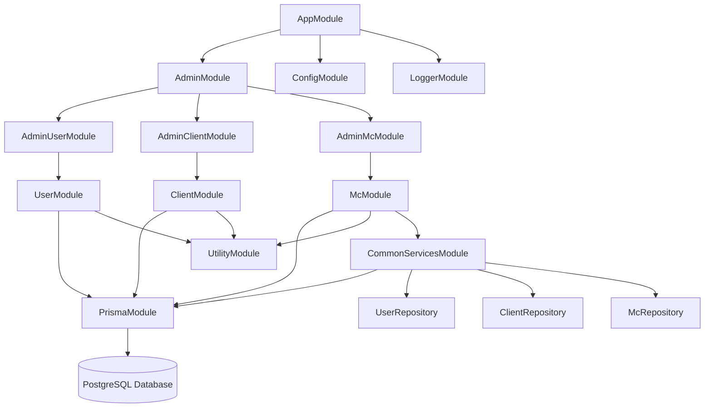
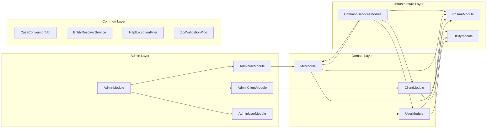
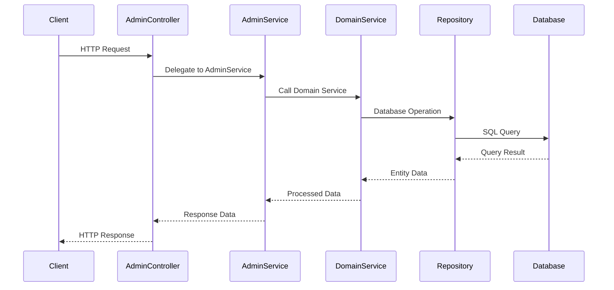
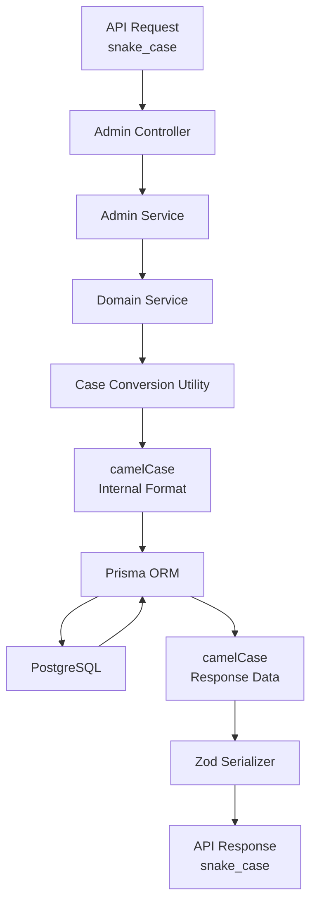

# Eridu Services API Architecture

This document provides a comprehensive overview of the module architecture and relationships in the Eridu Services API.

## Table of Contents

- [Overview](#overview)
- [Module Architecture](#module-architecture)
- [Module Relationships](#module-relationships)
- [Data Flow](#data-flow)
- [Key Components](#key-components)
- [API Endpoints](#api-endpoints)

## Overview

The Eridu Services API is built using NestJS with a modular architecture that separates concerns into distinct layers:

- **Admin Layer**: Administrative operations for managing entities
- **Domain Layer**: Core business logic for each entity
- **Infrastructure Layer**: Database access, utilities, and common services
- **Common Layer**: Shared utilities, decorators, and services

## Module Architecture

### High-Level Module Structure


```mermaid
graph TB
    App[AppModule] --> Admin[AdminModule]
    App --> Config[ConfigModule]
    App --> Logger[LoggerModule]
    
    Admin --> AdminUser[AdminUserModule]
    Admin --> AdminClient[AdminClientModule]
    Admin --> AdminMC[AdminMcModule]
    
    AdminUser --> User[UserModule]
    AdminClient --> Client[ClientModule]
    AdminMC --> MC[McModule]
    
    User --> Prisma[PrismaModule]
    User --> Utility[UtilityModule]
    
    Client --> Prisma
    Client --> Utility
    
    MC --> Prisma
    MC --> Utility
    MC --> CommonServices[CommonServicesModule]
    
    CommonServices --> Prisma
    CommonServices --> UserRepo[UserRepository]
    CommonServices --> ClientRepo[ClientRepository]
    CommonServices --> MCRepo[McRepository]
    
    Prisma --> DB[(PostgreSQL Database)]
```

### Detailed Module Dependencies


```mermaid
graph LR
    subgraph "Admin Layer"
        AdminModule
        AdminUserModule
        AdminClientModule
        AdminMcModule
    end
    
    subgraph "Domain Layer"
        UserModule
        ClientModule
        McModule
    end
    
    subgraph "Infrastructure Layer"
        PrismaModule
        UtilityModule
        CommonServicesModule
    end
    
    subgraph "Common Layer"
        CaseConversionUtil
        EntityResolverService
        HttpExceptionFilter
        ZodValidationPipe
    end
    
    AdminModule --> AdminUserModule
    AdminModule --> AdminClientModule
    AdminModule --> AdminMcModule
    
    AdminUserModule --> UserModule
    AdminClientModule --> ClientModule
    AdminMcModule --> McModule
    
    UserModule --> PrismaModule
    UserModule --> UtilityModule
    
    ClientModule --> PrismaModule
    ClientModule --> UtilityModule
    
    McModule --> PrismaModule
    McModule --> UtilityModule
    McModule --> CommonServicesModule
    
    CommonServicesModule --> PrismaModule
    CommonServicesModule --> UserModule
    CommonServicesModule --> ClientModule
    CommonServicesModule --> McModule
```

## Module Relationships

### 1. AppModule (Root Module)
- **Purpose**: Application bootstrap and global configuration
- **Imports**: 
  - `ConfigModule` (Global configuration)
  - `LoggerModule` (Structured logging)
  - `AdminModule` (Main business logic)
- **Providers**: Global pipes, interceptors, and filters

### 2. AdminModule
- **Purpose**: Administrative operations aggregation
- **Imports**: 
  - `AdminUserModule`
  - `AdminClientModule` 
  - `AdminMcModule`
- **Exports**: All admin modules for external access

### 3. Domain Modules

#### UserModule
- **Purpose**: User entity management
- **Imports**: `PrismaModule`, `UtilityModule`
- **Providers**: `UserService`, `UserRepository`
- **Exports**: `UserService`

#### ClientModule
- **Purpose**: Client entity management
- **Imports**: `PrismaModule`, `UtilityModule`
- **Providers**: `ClientService`, `ClientRepository`
- **Exports**: `ClientService`

#### McModule
- **Purpose**: MC (Master of Ceremonies) entity management
- **Imports**: `PrismaModule`, `UtilityModule`, `CommonServicesModule`
- **Providers**: `McService`, `McRepository`, `EntityResolverService`
- **Exports**: `McService`

### 4. Admin Modules

#### AdminUserModule
- **Purpose**: Administrative user operations
- **Imports**: `UserModule`
- **Controllers**: `AdminUserController`
- **Providers**: `AdminUserService`

#### AdminClientModule
- **Purpose**: Administrative client operations
- **Imports**: `ClientModule`
- **Controllers**: `AdminClientController`
- **Providers**: `AdminClientService`

#### AdminMcModule
- **Purpose**: Administrative MC operations
- **Imports**: `McModule`
- **Controllers**: `AdminMcController`
- **Providers**: `AdminMcService`

### 5. Infrastructure Modules

#### PrismaModule
- **Purpose**: Database connection and ORM
- **Providers**: `PrismaService`
- **Exports**: `PrismaService`

#### UtilityModule
- **Purpose**: Utility functions (ID generation, etc.)
- **Providers**: `UtilityService`
- **Exports**: `UtilityService`

#### CommonServicesModule
- **Purpose**: Shared services across modules
- **Imports**: `PrismaModule`
- **Providers**: `EntityResolverService`, `UserResolverService`, repositories
- **Exports**: `EntityResolverService`, `UserResolverService`

## Data Flow

### Request Processing Flow


```mermaid
sequenceDiagram
    participant Client
    participant AdminController
    participant AdminService
    participant DomainService
    participant Repository
    participant Database
    
    Client->>AdminController: HTTP Request
    AdminController->>AdminService: Delegate to AdminService
    AdminService->>DomainService: Call Domain Service
    DomainService->>Repository: Database Operation
    Repository->>Database: SQL Query
    Database-->>Repository: Query Result
    Repository-->>DomainService: Entity Data
    DomainService-->>AdminService: Processed Data
    AdminService-->>AdminController: Response Data
    AdminController-->>Client: HTTP Response
```

### Case Conversion Flow


```mermaid
flowchart TD
    API[API Request<br/>snake_case] --> Controller[Admin Controller]
    Controller --> AdminService[Admin Service]
    AdminService --> DomainService[Domain Service]
    DomainService --> CaseConversion[Case Conversion Utility]
    CaseConversion --> Internal[camelCase<br/>Internal Format]
    Internal --> Prisma[Prisma ORM]
    Prisma --> Database[PostgreSQL]
    
    Database --> Prisma
    Prisma --> Response[camelCase<br/>Response Data]
    Response --> Serializer[Zod Serializer]
    Serializer --> APIResponse[API Response<br/>snake_case]
```

## Key Components

### Services

| Service | Purpose | Dependencies |
|---------|---------|--------------|
| `UserService` | User CRUD operations | `UserRepository`, `UtilityService` |
| `ClientService` | Client CRUD operations | `ClientRepository`, `UtilityService` |
| `McService` | MC CRUD operations | `McRepository`, `UtilityService`, `EntityResolverService` |
| `AdminUserService` | Admin user operations | `UserService` |
| `AdminClientService` | Admin client operations | `ClientService` |
| `AdminMcService` | Admin MC operations | `McService` |
| `EntityResolverService` | UID to ID resolution | `UserRepository`, `ClientRepository`, `McRepository` |

### Repositories

| Repository | Purpose | Base Class |
|------------|---------|------------|
| `UserRepository` | User data access | `BaseRepository<User>` |
| `ClientRepository` | Client data access | `BaseRepository<Client>` |
| `McRepository` | MC data access | `BaseRepository<MC>` |

### Utilities

| Utility | Purpose |
|---------|---------|
| `CaseConversionUtil` | snake_case ↔ camelCase conversion |
| `UtilityService` | ID generation, common utilities |
| `HttpExceptionFilter` | Global error handling |
| `ZodValidationPipe` | Request validation |
| `ZodSerializerInterceptor` | Response serialization |

## API Endpoints

### Admin Endpoints

#### Users
- `GET /admin/users` - List users with pagination
- `POST /admin/users` - Create user
- `GET /admin/users/:uid` - Get user by UID
- `PUT /admin/users/:uid` - Update user
- `DELETE /admin/users/:uid` - Soft delete user

#### Clients
- `GET /admin/clients` - List clients with pagination
- `POST /admin/clients` - Create client
- `GET /admin/clients/:uid` - Get client by UID
- `PUT /admin/clients/:uid` - Update client
- `DELETE /admin/clients/:uid` - Soft delete client

#### MCs
- `GET /admin/mcs` - List MCs with pagination
- `POST /admin/mcs` - Create MC
- `GET /admin/mcs/:uid` - Get MC by UID
- `PUT /admin/mcs/:uid` - Update MC
- `DELETE /admin/mcs/:uid` - Soft delete MC

### Data Formats

#### Input Format (snake_case)
```json
{
  "name": "John Doe",
  "ext_id": "ext_123",
  "profile_url": "https://example.com/profile",
  "contact_person": "Jane Smith",
  "contact_email": "jane@example.com",
  "alias_name": "MC Alias",
  "user_id": "user_123",
  "is_banned": false
}
```

#### Output Format (snake_case)
```json
{
  "id": "user_123",
  "name": "John Doe",
  "ext_id": "ext_123",
  "profile_url": "https://example.com/profile",
  "created_at": "2024-01-01T00:00:00Z",
  "updated_at": "2024-01-01T00:00:00Z"
}
```

## Design Patterns

### 1. Repository Pattern
- Abstracts data access logic
- Provides consistent interface across entities
- Enables easy testing and mocking

### 2. Service Layer Pattern
- Separates business logic from controllers
- Provides reusable operations
- Handles cross-cutting concerns

### 3. Module Pattern
- Encapsulates related functionality
- Provides clear dependency boundaries
- Enables lazy loading and tree shaking

### 4. Decorator Pattern
- Adds functionality without modifying core classes
- Enables cross-cutting concerns (validation, serialization)
- Provides clean separation of concerns

## Testing Strategy

### Unit Tests
- Service layer testing with mocked dependencies
- Repository testing with in-memory database
- Utility function testing

### Integration Tests
- End-to-end API testing
- Database integration testing
- Module integration testing

### Test Structure
```
src/
├── user/
│   ├── user.service.spec.ts
│   └── user.repository.spec.ts
├── admin/
│   └── users/
│       └── admin-user.service.spec.ts
└── test/
    └── jest-e2e.json
```

## Configuration

### Environment Variables
- `DATABASE_URL`: PostgreSQL connection string
- `NODE_ENV`: Environment (development, production)
- `PORT`: Server port
- `LOG_LEVEL`: Logging level

### Database Schema
- Uses Prisma ORM for type-safe database access
- Supports migrations and schema evolution
- Includes soft delete functionality

## Security Considerations

### Input Validation
- Zod schema validation for all inputs
- Type-safe request/response handling
- SQL injection prevention via Prisma

### Error Handling
- Global exception filter
- Structured error responses
- Sensitive data protection

### Authentication & Authorization
- Ready for JWT token integration
- Role-based access control structure
- Admin-only endpoint protection

## Performance Considerations

### Database Optimization
- Indexed UID fields for fast lookups
- Soft delete pattern for data retention
- Pagination for large datasets

### Caching Strategy
- Repository-level caching ready
- Service-level caching for expensive operations
- Response caching for static data

### Monitoring
- Structured logging with Pino
- Request/response timing
- Error tracking and alerting

---

This architecture provides a solid foundation for scalable, maintainable, and testable API development while following NestJS best practices and modern software engineering principles.
