# Eridu Services API Architecture

This document provides a comprehensive overview of the module architecture and relationships in the Eridu Services API.

## Table of Contents

- [Overview](#overview)
- [Module Architecture](#module-architecture)
- [Module Relationships](#module-relationships)
- [Data Flow](#data-flow)
- [Key Components](#key-components)
- [API Endpoints](#api-endpoints)

## Overview

The Eridu Services API is built using NestJS with a modular architecture that separates concerns into distinct layers. Currently, the implementation focuses on the foundation layer with basic administrative operations for core entities.

**Current Implementation Status:**

- **Phase 1**: Core Functions with Hybrid Authentication - Essential CRUD operations, basic show management, Schedule Planning Management System, JWK-based JWT validation for user identification, and simple StudioMembership-based admin verification
- **Admin Layer**: Administrative operations for Users, Clients, MCs, Platforms, Studios, and related entities
- **Domain Layer**: Business logic for core entities with proper service patterns
- **Infrastructure Layer**: Database access, utilities, and common services
- **Common Layer**: Shared utilities, decorators, and base classes
- **Authentication**: JWK-based JWT token validation using `@eridu/auth-sdk` SDK (validates tokens from `eridu_auth` service using Better Auth's JWKS endpoint)
- **Authorization**: System Admin via `isSystemAdmin` flag (Phase 1), Studio Admin via StudioMembership model (Phase 1), Client/Platform memberships (Phase 3)

**Phase 2 Planned Features:**

- **Material Management System**: Complete material versioning and platform targeting
- **Material CRUD Operations**: Material, MaterialType, and ShowMaterial entities
- **Show-Material Associations**: Associate materials with shows for production planning
- **Platform-Specific Materials**: Materials can be targeted to specific platforms

**Phase 3 Planned Features:**

- **Advanced Authorization**: Role-based access control with granular permissions
- **Audit Trail**: Comprehensive change tracking and compliance
- **Task Management**: Complete workflow automation and task templates
- **Advanced Collaboration**: Tagging, enhanced comments, and notifications

## Module Architecture

### High-Level Module Structure


### Detailed Module Dependencies


## Module Relationships

### 1. AppModule (Root Module)

- **Purpose**: Application bootstrap and global configuration
- **Imports**:
  - `ConfigModule` (Global configuration)
  - `LoggerModule` (Structured logging)
  - `HealthModule` (Health check endpoints)
  - `AdminModule` (Administrative operations)
  - `MeModule` (User-scoped operations)
  - `BackdoorModule` (Service-to-service operations)
  - `GoogleSheetsModule` (Google Sheets integration endpoints)
  - `OpenAPIModule` (API documentation)
- **Providers**: Global pipes, interceptors, and filters

### 2. AdminModule

- **Purpose**: Administrative operations aggregation
- **Architecture**: Simplified controller-only pattern (no admin-specific services)
- **Imports**:
  - `AdminUserModule`
  - `AdminClientModule`
  - `AdminMcModule`
  - `AdminPlatformModule`
  - `AdminShowModule` ⭐
  - `AdminShowTypeModule`
  - `AdminShowStatusModule`
  - `AdminShowStandardModule`
  - `AdminStudioModule`
  - `AdminStudioRoomModule`
  - `AdminStudioMembershipModule`
  - `AdminShowMcModule`
  - `AdminShowPlatformModule`
  - `AdminScheduleModule` ⭐
  - `AdminSnapshotModule` ⭐
- **Note**: Admin modules contain only controllers; they directly use domain services and leverage Prisma's native features

### 3. Domain Modules

#### UserModule

- **Purpose**: User entity management
- **Imports**: `PrismaModule`, `UtilityModule`
- **Providers**: `UserService`, `UserRepository`
- **Exports**: `UserService`

#### ClientModule

- **Purpose**: Client entity management
- **Imports**: `PrismaModule`, `UtilityModule`
- **Providers**: `ClientService`, `ClientRepository`
- **Exports**: `ClientService`

#### McModule

- **Purpose**: MC (Master of Ceremonies) entity management
- **Imports**: `PrismaModule`, `UtilityModule`
- **Providers**: `McService`, `McRepository`
- **Exports**: `McService`

#### PlatformModule

- **Purpose**: Platform entity management
- **Imports**: `PrismaModule`, `UtilityModule`
- **Providers**: `PlatformService`, `PlatformRepository`
- **Exports**: `PlatformService`

#### ShowModule ⭐

- **Purpose**: Core show entity management with advanced DTO-to-Prisma transformation pattern
- **Imports**: `PrismaModule`, `UtilityModule`, `ClientModule`, `StudioRoomModule`, `ShowTypeModule`, `ShowStatusModule`, `ShowStandardModule`
- **Providers**: `ShowService`, `ShowRepository`
- **Exports**: `ShowService`
- **Pattern**: Implements dual-method approach with `createShowFromDto/createShow`, `updateShowFromDto/updateShow`
- **Features**:
  - Builder methods for DTO transformation (`buildCreatePayload`, `buildUpdatePayload`)
  - Generic includes for type-safe relation loading (`ShowWithIncludes<T>`)
  - Time range validation (endTime must be after startTime)
  - Core show CRUD operations only (no cross-module orchestration)
  - Comprehensive test coverage (see `show.service.spec.ts` for test implementation details)
  - **Shared Schemas**: Uses `@eridu/api-types/shows` for API request/response schemas (see [API Types & Schemas Package](#api-types--schemas-package))

#### ShowOrchestrationModule ⭐

- **Purpose**: Simplified orchestration for show operations with MC/platform assignments (Phase 1)
- **Architecture**: Orchestration layer that coordinates multiple domain services
- **Phase 1 Pattern**: Uses Prisma nested creates for atomic show creation with assignments
- **Phase 1 Scope**:
  - Atomic show creation with MC/platform assignments
  - Single show relationship operations (add/remove/replace)
  - One operation per API call (no bulk operations)
  - UI-driven sync loop for Google Sheets import
- **Key Methods**:
  - `createShowWithAssignments` - Create show with MC/platform assignments
  - `getShowsWithRelations` - Get shows with all relations
  - `getShowWithRelations` - Get single show with relations
  - `updateShowWithAssignments` - Update show with optional MC/platform assignments (sync logic)
  - `deleteShow` - Soft-delete show and all assignments
  - `removeMCsFromShow` - Remove specific MCs from show
  - `removePlatformsFromShow` - Remove specific platforms from show
  - `replaceMCsForShow` - Replace all MCs for a show
  - `replacePlatformsForShow` - Replace all platforms for a show
- **Future Enhancements** (Phase 4+ if needed):
  - Bulk operations with declarative state synchronization
  - External data sync engine with conflict resolution (deferred)
  - Advanced bulk show assignment operations
- **Benefits**:
  - Prevents circular dependencies by centralizing cross-module coordination
  - Ensures data consistency through Prisma nested creates and transactions
  - Provides unified interface for show operations with assignments
  - Maintains clean separation between core domain logic and orchestration logic
- **Status**: ✅ IMPLEMENTED - Full orchestration with relationship management operations

#### ShowTypeModule

- **Purpose**: ShowType entity management
- **Imports**: `PrismaModule`, `UtilityModule`
- **Providers**: `ShowTypeService`, `ShowTypeRepository`
- **Exports**: `ShowTypeService`

#### ShowStatusModule

- **Purpose**: ShowStatus entity management
- **Imports**: `PrismaModule`, `UtilityModule`
- **Providers**: `ShowStatusService`, `ShowStatusRepository`
- **Exports**: `ShowStatusService`

#### ShowStandardModule

- **Purpose**: ShowStandard entity management
- **Imports**: `PrismaModule`, `UtilityModule`
- **Providers**: `ShowStandardService`, `ShowStandardRepository`
- **Exports**: `ShowStandardService`

#### StudioModule

- **Purpose**: Studio entity management
- **Imports**: `PrismaModule`, `UtilityModule`
- **Providers**: `StudioService`, `StudioRepository`
- **Exports**: `StudioService`

#### StudioRoomModule

- **Purpose**: StudioRoom entity management
- **Imports**: `PrismaModule`, `UtilityModule`
- **Providers**: `StudioRoomService`, `StudioRoomRepository`
- **Exports**: `StudioRoomService`

#### MembershipModule

- **Purpose**: Studio membership entity management for user-studio relationships
- **Imports**: `PrismaModule`, `UtilityModule`, `StudioModule`
- **Providers**: `StudioMembershipService`, `StudioMembershipRepository`
- **Exports**: `StudioMembershipService`

#### ShowMcModule

- **Purpose**: Show-MC relationship management
- **Imports**: `PrismaModule`, `UtilityModule`
- **Providers**: `ShowMcService`, `ShowMcRepository`
- **Exports**: `ShowMcService`
- **Features**: Manages many-to-many show-MC relationships with notes

#### ShowPlatformModule

- **Purpose**: Show-platform relationship management
- **Imports**: `PrismaModule`, `UtilityModule`
- **Providers**: `ShowPlatformService`, `ShowPlatformRepository`
- **Exports**: `ShowPlatformService`
- **Features**: Manages multi-platform broadcasting with stream links and viewer tracking

#### ScheduleModule ⭐

- **Purpose**: Schedule entity management with JSON plan documents
- **Imports**: `PrismaModule`, `UtilityModule`, `ClientModule`, `UserModule`
- **Providers**: `ScheduleService`, `ScheduleRepository`
- **Exports**: `ScheduleService`
- **Features**:
  - CRUD operations for schedules
  - JSON plan document management
  - Optimistic locking with version tracking
  - Bulk operations (bulk create and bulk update)
  - Monthly overview (schedules grouped by client and status)
  - **Client-by-Client Upload Strategy** (Phase 1): One schedule per client (~100 shows each)

#### ScheduleSnapshotModule ⭐

- **Purpose**: Schedule snapshot entity management for version history
- **Imports**: `PrismaModule`, `UtilityModule`, `ScheduleModule`, `UserModule`
- **Providers**: `ScheduleSnapshotService`, `ScheduleSnapshotRepository`
- **Exports**: `ScheduleSnapshotService`
- **Features**:
  - Immutable snapshot creation for version history
  - Snapshot retrieval and restoration
  - Automatic snapshot creation on schedule updates

#### SchedulePlanningModule ⭐

- **Purpose**: Orchestration for schedule planning, validation, and publishing
- **Architecture**: Orchestration layer that coordinates schedule planning operations
- **Imports**: `PrismaModule`, `ScheduleModule`, `ScheduleSnapshotModule`, `ShowModule`, `ShowMcModule`, `ShowPlatformModule`
- **Providers**: `SchedulePlanningService`, `ValidationService`, `PublishingService`
- **Exports**: `SchedulePlanningService`
- **Key Services**:
  - `SchedulePlanningService` - Main orchestration service for schedule planning operations
  - `ValidationService` - Validates schedules before publishing (room conflicts, MC double-booking per client)
  - `PublishingService` - Publishes schedules to normalized Show tables (delete + insert strategy)
- **Key Methods**:
  - `validateSchedule` - Validate schedule before publish (per-client validation)
  - `publishSchedule` - Publish schedule to shows (can be queued for async processing)
  - `restoreFromSnapshot` - Restore schedule from snapshot
- **Phase 1 Strategy**: Client-by-client upload (one schedule per client, async publishing)
- **Phase 2 Enhancements**: Chunked upload for large clients (>200 shows per client) or multi-client monthly overviews (500+ shows from 10+ clients)
- **Status**: ✅ IMPLEMENTED - Full planning workflow with per-client validation and publishing

### 4. Orchestration Modules

#### ShowOrchestrationModule ⭐

- **Purpose**: Simplified orchestration for show operations with MC/platform assignments (Phase 1)
- **Architecture**: Orchestration layer that coordinates multiple domain services
- **Phase 1 Implementation**:
  - Uses Prisma nested creates for atomic show creation with assignments
  - Provides single show relationship operations (add/remove/replace MCs and platforms)
  - Sync logic for updating assignments while preserving existing ones
  - Each API call handles one operation (no bulk operations)
  - UI-driven sync loop for Google Sheets import workflow
- **Key Features**:
  - Create show with initial MC/platform assignments
  - Update show with optional assignment updates (sync logic)
  - Remove specific MCs or platforms from show
  - Replace all MCs or platforms for show
  - All operations use transactions for data consistency
- **Benefits**:
  - Prevents circular dependencies by centralizing cross-module coordination
  - Ensures data consistency through Prisma nested creates and transactions (automatic rollback on failure)
  - Provides unified interface for show operations with assignments
  - Maintains clean separation between core domain logic and orchestration logic
  - Simple and explicit operations (easy to understand and debug)
- **Future Enhancements** (Phase 4+): External data sync engine and advanced bulk operations (deferred if needed for performance)

### 5. Admin Modules

> **Architecture Note**: Admin modules follow a simplified pattern with controllers only (no admin-specific services). Controllers directly use domain services and orchestration services, leveraging Prisma's native features like nested `connect` with UIDs for foreign key relationships.

#### AdminUserModule

- **Purpose**: Administrative user operations
- **Imports**: `UserModule`, `UtilityModule`
- **Controllers**: `AdminUserController`
- **Pattern**: Directly calls `UserService` for all operations

#### AdminClientModule

- **Purpose**: Administrative client operations
- **Imports**: `ClientModule`, `UtilityModule`
- **Controllers**: `AdminClientController`
- **Pattern**: Directly calls `ClientService` for all operations

#### AdminMcModule

- **Purpose**: Administrative MC operations
- **Imports**: `McModule`, `UtilityModule`
- **Controllers**: `AdminMcController`
- **Pattern**: Uses Prisma's `connect: { uid }` for user relationships
- **Example**: `user: { connect: { uid: body.userId } }`

#### AdminPlatformModule

- **Purpose**: Administrative platform operations
- **Imports**: `PlatformModule`, `UtilityModule`
- **Controllers**: `AdminPlatformController`
- **Pattern**: Directly calls `PlatformService` for all operations

#### AdminShowModule ⭐

- **Purpose**: Administrative show operations with full CRUD and cross-module orchestration
- **Imports**: `ShowOrchestrationModule`, `UtilityModule`
- **Controllers**: `AdminShowController`
- **Pattern**: Uses `ShowOrchestrationService` as primary service for all show operations
- **Features**:
  - Unified show creation supporting both simple shows and shows with MC/platform assignments
  - Complete show retrieval with all relations (MCs, platforms, clients, studio rooms, etc.)
  - Atomic operations using Prisma transactions for data consistency
  - Transparent handling of simple vs complex show operations
  - Relationship management endpoints for MCs and platforms
  - Sync logic for updating assignments while preserving existing ones
- **Endpoints**:
  - Full CRUD at `/admin/shows`
  - Relationship management at `/admin/shows/:id/mcs/*` and `/admin/shows/:id/platforms/*`

#### AdminShowTypeModule

- **Purpose**: Administrative show type operations
- **Imports**: `ShowTypeModule`, `UtilityModule`
- **Controllers**: `AdminShowTypeController`
- **Pattern**: Directly calls `ShowTypeService` for all operations

#### AdminShowStatusModule

- **Purpose**: Administrative show status operations
- **Imports**: `ShowStatusModule`, `UtilityModule`
- **Controllers**: `AdminShowStatusController`
- **Pattern**: Directly calls `ShowStatusService` for all operations

#### AdminShowStandardModule

- **Purpose**: Administrative show standard operations
- **Imports**: `ShowStandardModule`, `UtilityModule`
- **Controllers**: `AdminShowStandardController`
- **Pattern**: Directly calls `ShowStandardService` for all operations

#### AdminStudioModule

- **Purpose**: Administrative studio operations
- **Imports**: `StudioModule`, `UtilityModule`
- **Controllers**: `AdminStudioController`
- **Pattern**: Directly calls `StudioService` for all operations

#### AdminStudioRoomModule

- **Purpose**: Administrative studio room operations
- **Imports**: `StudioRoomModule`, `UtilityModule`
- **Controllers**: `AdminStudioRoomController`
- **Pattern**: Uses Prisma's `connect: { uid }` for studio relationships
- **Example**: `studio: { connect: { uid: body.studioId } }`

#### AdminStudioMembershipModule

- **Purpose**: Administrative studio membership operations
- **Imports**: `MembershipModule`, `UserModule`, `StudioModule`, `UtilityModule`
- **Controllers**: `AdminStudioMembershipController`
- **Pattern**: Validates user/studio existence, then uses domain service
- **Special**: Requires validation as `StudioMembershipService.createStudioMembershipWithValidation()` expects internal IDs

#### AdminShowMcModule

- **Purpose**: Administrative show-MC relationship operations
- **Imports**: `ShowMcModule`, `UtilityModule`
- **Controllers**: `AdminShowMcController`
- **Pattern**: Uses `ShowMcService` DTO methods for relationship management
- **Features**: Create, read, update, delete show-MC assignments

#### AdminShowPlatformModule

- **Purpose**: Administrative show-platform relationship operations
- **Imports**: `ShowPlatformModule`, `UtilityModule`
- **Controllers**: `AdminShowPlatformController`
- **Pattern**: Uses `ShowPlatformService` DTO methods for platform integration
- **Features**: Manage multi-platform broadcasting with stream links and viewer tracking

#### AdminScheduleModule ⭐

- **Purpose**: Administrative schedule operations with full CRUD, planning, validation, and publishing
- **Imports**: `ScheduleModule`, `SchedulePlanningModule`, `UserModule`, `ClientModule`, `UtilityModule`
- **Controllers**: `AdminScheduleController`
- **Pattern**: Uses `ScheduleService` for CRUD operations and `SchedulePlanningService` for planning operations
- **Features**:
  - Full CRUD operations for schedules
  - Schedule validation before publishing (per-client)
  - Schedule publishing to normalized Show tables
  - Bulk operations (bulk create and bulk update) ✅ **IMPLEMENTED**
  - Monthly overview (schedules grouped by client and status) ✅ **IMPLEMENTED**
  - Schedule duplication and snapshot management
  - **Client-by-Client Upload Strategy** (Phase 1): Create one schedule per client (~100 shows each)
- **Endpoints**:
  - Full CRUD at `/admin/schedules`
  - Planning operations at `/admin/schedules/:id/validate`, `/admin/schedules/:id/publish`
  - Bulk operations at `/admin/schedules/bulk` ✅ **IMPLEMENTED** (supports multiple clients)
  - Monthly overview at `/admin/schedules/overview/monthly` ✅ **IMPLEMENTED** (groups by client)
  - Snapshot listing at `/admin/schedules/:id/snapshots`
- **Phase 2 Enhancements**:
  - Chunked upload endpoint (`POST /admin/schedules/:id/shows/append`) for large clients (>200 shows per client) or multi-client monthly overviews (500+ shows from 10+ clients)

#### AdminSnapshotModule ⭐

- **Purpose**: Administrative snapshot operations for schedule version history
- **Imports**: `ScheduleSnapshotModule`, `SchedulePlanningModule`, `UserModule`, `UtilityModule`
- **Controllers**: `AdminSnapshotController`
- **Pattern**: Uses `ScheduleSnapshotService` for snapshot retrieval and `SchedulePlanningService` for restore operations
- **Features**:
  - Get snapshot by ID with schedule relations
  - Restore schedule from snapshot
- **Endpoints**:
  - `GET /admin/snapshots/:id` - Get snapshot by ID (maps to internal UID)
  - `POST /admin/snapshots/:id/restore` - Restore schedule from snapshot

### 5. Infrastructure Modules

#### PrismaModule

- **Purpose**: Database connection and ORM
- **Providers**: `PrismaService`
- **Exports**: `PrismaService`

#### UtilityModule

- **Purpose**: Utility functions (ID generation, etc.)
- **Providers**: `UtilityService`
- **Exports**: `UtilityService`

### 6. User-Scoped Modules (Me Module)

#### MeModule

- **Purpose**: User-scoped API endpoints for authenticated users
- **Imports**: `ProfileModule`, `ShowsModule`
- **Exports**: `ShowsModule`
- **Features**: Endpoints prefixed with `/me` for user-scoped resources (e.g., `/me`, `/me/shows`)

#### ProfileModule

- **Purpose**: User profile endpoint for authenticated users
- **Imports**: `AuthModule` (for JWT authentication)
- **Controllers**: `ProfileController`
- **Features**:
  - `GET /me` - Returns authenticated user profile information from JWT token payload
  - Maps JWT `id` to `ext_id` for database lookup
  - Includes full JWT payload for advanced use cases

#### ShowsModule (Me)

- **Purpose**: User-scoped show operations for MC users
- **Imports**: `ShowModule`, `ShowMcModule`, `McModule`, `UtilityModule`
- **Controllers**: `ShowsController`
- **Providers**: `ShowsService`
- **Exports**: `ShowsService`
- **Features**: Endpoints for MC users to query their assigned shows (list and get by ID)
- **Key Implementation Details**:
  - Resolves MC profile from user identifier (supports both `uid` and `extId` from JWT)
  - Filters shows to only those assigned to the authenticated user's MC via `ShowMC` relationships
  - Includes all related entities (client, studioRoom, showType, showStatus, showStandard, showPlatforms)
  - Supports pagination and custom ordering (defaults to `startTime: 'asc'`)
  - Validates show assignment before returning details (prevents access to unassigned shows)
  - Returns 404 if MC not found or show not assigned to user's MC
- **Testing Requirements**: Tests should cover controller endpoints (authentication, pagination, error handling) and service logic (MC resolution, show filtering, include patterns). See `shows.controller.spec.ts` and `shows.service.spec.ts` for test implementation details.

### 7. Service-to-Service Modules

#### BackdoorModule

- **Purpose**: Service-to-service operations with API key authentication
- **Architecture**: Uses `@Backdoor()` decorator pattern for API key authentication
- **Controllers**: Backdoor controllers extend `BaseBackdoorController`
- **Features**: User creation, updates, membership management, JWKS refresh
- **Authentication**: `BackdoorApiKeyGuard` (global guard, opt-in via `@Backdoor()` decorator)

#### GoogleSheetsModule ⭐

- **Purpose**: Google Sheets integration endpoints for schedule management
- **Architecture**: Uses `@GoogleSheets()` decorator pattern for API key authentication
- **Imports**: `GoogleSheetsScheduleModule`
- **Controllers**:
  - `GoogleSheetsScheduleController` (extends `BaseGoogleSheetsController`)
- **Base Controller Pattern**:
  ```typescript
  @GoogleSheets() // Decorator enables API key authentication
  export abstract class BaseGoogleSheetsController {
    // Shared utility methods for pagination, validation, etc.
  }
  ```
- **Features**:
  - Full CRUD operations for schedules via Google Sheets
  - Schedule validation and publishing
  - Bulk operations (bulk create and bulk update)
  - Monthly overview with client grouping
  - Snapshot management
- **Authentication**: `GoogleSheetsApiKeyGuard` (global guard, opt-in via `@GoogleSheets()` decorator)
- **Guard Integration**:
  - `JwtAuthGuard` automatically skips JWT validation when `@GoogleSheets()` is present
  - `GoogleSheetsApiKeyGuard` validates `X-API-Key` header against `GOOGLE_SHEETS_API_KEY`
  - Service context attached to `request.service` with `serviceName: 'google-sheets'`
- **Module Structure**:
  ```
  google-sheets/
    ├── google-sheets.module.ts
    ├── base-google-sheets.controller.ts
    └── schedules/
        ├── google-sheets-schedule.controller.ts
        └── google-sheets-schedule.module.ts
  ```
- **Endpoints**: All endpoints prefixed with `/google-sheets/schedules`
- **Status**: ✅ IMPLEMENTED - Full schedule management via Google Sheets integration

### 8. Health Check Module

#### HealthModule

- **Purpose**: Health check endpoints for load balancers and monitoring
- **Controllers**: `HealthController`
- **Features**:
  - `GET /health` - Liveness probe (returns 200 if application is running)
  - `GET /health/ready` - Readiness probe (returns 200 if application is ready to accept traffic)
- **Implementation**: Basic implementation with service name and timestamp; can be extended with database connectivity checks

## Data Flow

### Entity Relationship Diagram (ERD)

**Core Entity Relationships**


### Request Processing Flow

**Simplified Architecture (No Admin Service Layer)**


### Data Processing Flow

**Simplified Flow (Direct Domain Service Usage)**

```mermaid
flowchart TD
    API[API Request<br/>snake_case] --> Controller[Admin Controller]
    Controller --> Transform[Zod Transform<br/>snake_case → camelCase]
    Transform --> DomainService[Domain Service]
    Note1[No admin service layer]
    DomainService --> Repository[Repository Layer]
    Repository --> Prisma[Prisma ORM<br/>camelCase]
    Note2[Prisma handles<br/>nested connect with UIDs]
    Prisma --> Database[PostgreSQL]

    Database --> Prisma
    Prisma --> Repository
    Repository --> DomainService
    DomainService --> Controller
    Controller --> Serializer[Zod Serializer<br/>camelCase → snake_case<br/>uid → id]
    Serializer --> APIResponse[API Response<br/>snake_case]
```



### Schedule Planning Workflow Sequence

**Client-by-Client Upload Flow (Phase 1)**


## Key Architectural Benefits

### 1. **Separation of Concerns**

- **Core Modules**: Focus on single domain entity management
- **Orchestration Modules**: Handle cross-module coordination and complex business operations
- **Admin Modules**: Provide clean API interfaces using appropriate services

### 2. **Circular Dependency Prevention**

- Core modules only import direct dependencies (Prisma, Utility, related entities)
- Orchestration modules import multiple domain modules without creating cycles
- Clear dependency hierarchy prevents architectural issues

### 3. **Data Consistency**

- Prisma transactions ensure atomic operations across multiple modules
- Validation happens before transaction execution
- Rollback capability for failed operations

### 4. **Performance Optimization**

- Simple operations bypass orchestration overhead
- Complex operations use optimized transaction logic
- Lazy loading and selective includes based on operation type

### 5. **Maintainability**

- Changes to MC/Platform logic don't affect core ShowModule
- Easy to test orchestration logic separately
- Clear upgrade path for complex features

### 6. **Scalability**

- Easy to add new cross-module features
- Can create multiple orchestration modules for different domains
- Supports microservice extraction later

## Key Components

### OpenAPI Documentation

The API includes comprehensive OpenAPI documentation powered by Scalar UI:

- **Interactive Documentation**: Available at `/api-reference` endpoint
- **OpenAPI JSON Spec**: Available at `/swagger-json` endpoint
- **Zod Integration**: Automatic schema generation from Zod validation schemas
- **Custom Decorators**: `ApiZodResponse`, `ApiZodBody`, `ApiZodQuery`, `ApiZodParam` for type-safe documentation
- **Modern UI**: Scalar UI provides responsive, mobile-friendly documentation interface

**Implementation Details:**

- Configuration in `src/common/openapi/openapi.config.ts`
- Custom Zod-to-OpenAPI converter in `src/common/openapi/zod-converter.ts`
- Reusable decorators in `src/common/openapi/decorators.ts`
- Scalar UI served from `public/scalar.html`

### API Types & Schemas Package

**Shared Schema Package**: `@eridu/api-types`

API request/response schemas and types are now centralized in the `@eridu/api-types` package for consistency across the monorepo. This package provides:

- **Zod schemas** for runtime validation
- **TypeScript types** inferred from schemas
- **Constants** (UID prefixes, etc.)
- **Reusable pagination schemas**

**Available Schemas:**

- `@eridu/api-types/shows` - Show API schemas (response, create, update, list query)
- `@eridu/api-types/clients` - Client API schemas
- `@eridu/api-types/show-types` - ShowType schemas
- `@eridu/api-types/show-statuses` - ShowStatus schemas
- `@eridu/api-types/show-standards` - ShowStandard schemas
- `@eridu/api-types/studio-rooms` - StudioRoom schemas
- `@eridu/api-types/pagination` - Pagination utilities
- `@eridu/api-types/constants` - UID prefixes and shared constants

**Usage Pattern:**

```typescript
// Import shared schemas from the package
import { showApiResponseSchema, createShowInputSchema } from '@eridu/api-types/shows';
import { UID_PREFIXES } from '@eridu/api-types/constants';

// Use in local schema files for DTO transformation
import { showApiResponseSchema } from '@eridu/api-types/shows';
```

**Benefits:**

- ✅ **Consistency**: Shared schemas ensure API contracts match across services
- ✅ **Type Safety**: TypeScript types automatically inferred from Zod schemas
- ✅ **Reusability**: Frontend and other services can use the same schemas
- ✅ **Single Source of Truth**: Schema changes propagate automatically
- ✅ **Validation**: Runtime validation with Zod ensures data integrity

**Local Schema Files:**

While shared API schemas are in `@eridu/api-types`, local schema files in `src/models/*/schemas/` still exist for:
- Internal database entity schemas
- DTO transformation logic (snake_case ↔ camelCase)
- Service-specific validation rules
- Integration with NestJS decorators (`createZodDto`)

**Migration Status:**

- ✅ Show schemas migrated to `@eridu/api-types/shows`
- ✅ Client, ShowType, ShowStatus, ShowStandard, StudioRoom schemas migrated
- ✅ Pagination utilities centralized
- 🔄 Additional entity schemas will be migrated as needed

### Services

**Service Architecture** (Business Logic Layer)

The service layer follows a clear separation of concerns with distinct service types:

### BaseModelService

All core entity services extend `BaseModelService` which provides:

- UID generation with entity-specific prefixes
- Common CRUD operation patterns
- Single-entity focus for data persistence

**Model Services** (Single Entity Management)

| Service                   | Purpose                                   | Dependencies                                                    |
| ------------------------- | ----------------------------------------- | --------------------------------------------------------------- |
| `UserService`             | User CRUD operations                      | `UserRepository`, `UtilityService`                              |
| `ClientService`           | Client CRUD operations                    | `ClientRepository`, `UtilityService`                            |
| `McService`               | MC CRUD operations                        | `McRepository`, `UtilityService`                                |
| `PlatformService`         | Platform CRUD operations                  | `PlatformRepository`, `UtilityService`                          |
| `ShowService` ⭐          | Show CRUD with DTO transformation pattern | `ShowRepository`, `UtilityService`                              |
| `ShowTypeService`         | ShowType CRUD operations                  | `ShowTypeRepository`, `UtilityService`                          |
| `ShowStatusService`       | ShowStatus CRUD operations                | `ShowStatusRepository`, `UtilityService`                        |
| `ShowStandardService`     | ShowStandard CRUD operations              | `ShowStandardRepository`, `UtilityService`                      |
| `StudioService`           | Studio CRUD operations                    | `StudioRepository`, `UtilityService`                            |
| `StudioRoomService`       | StudioRoom CRUD operations                | `StudioRoomRepository`, `UtilityService`                        |
| `StudioMembershipService` | Studio membership CRUD operations         | `StudioMembershipRepository`, `UtilityService`, `StudioService` |
| `ShowMcService`           | Show-MC relationship management           | `ShowMcRepository`, `UtilityService`                            |
| `ShowPlatformService`     | Show-platform relationship management     | `ShowPlatformRepository`, `UtilityService`                      |

**Orchestration Services** (Cross-Module Coordination)

| Service                       | Purpose                                                            | Dependencies                                                                                           |
| ----------------------------- | ------------------------------------------------------------------ | ------------------------------------------------------------------------------------------------------ |
| `ShowOrchestrationService` ⭐ | Atomic show creation with MC/platform assignments                  | `ShowService`, `McService`, `PlatformService`, `ShowMcService`, `ShowPlatformService`, `PrismaService` |
|                               | Single show relationship operations (add/remove/replace)           |                                                                                                        |
|                               | Sync logic for updating assignments while preserving existing ones |                                                                                                        |
|                               | Complete relationship management (remove, replace operations)      |                                                                                                        |

**Phase 1 Scope**: Single show operations with atomic assignment creation and relationship management
**Future Enhancements** (Phase 4+ if needed): ShowBulkService, ShowReconciliationService for bulk operations and external data sync engine

> **Note**: Admin modules do NOT have separate admin services. Admin controllers directly use domain services to maintain a cleaner architecture and leverage Prisma's native features.

### Repositories

| Repository                   | Purpose                                | Base Class                         |
| ---------------------------- | -------------------------------------- | ---------------------------------- |
| `UserRepository`             | User data access                       | `BaseRepository<User>`             |
| `ClientRepository`           | Client data access                     | `BaseRepository<Client>`           |
| `McRepository`               | MC data access                         | `BaseRepository<MC>`               |
| `StudioRepository`           | Studio data access                     | `BaseRepository<Studio>`           |
| `StudioRoomRepository`       | StudioRoom data access                 | `BaseRepository<StudioRoom>`       |
| `StudioMembershipRepository` | Studio membership data access          | `BaseRepository<StudioMembership>` |
| `ShowMcRepository`           | Show-MC relationship data access       | `BaseRepository<ShowMC>`           |
| `ShowPlatformRepository`     | Show-platform relationship data access | `BaseRepository<ShowPlatform>`     |

### Utilities

| Utility                    | Purpose                                     |
| -------------------------- | ------------------------------------------- |
| `UtilityService`           | ID generation, common utilities             |
| `HttpExceptionFilter`      | Global error handling                       |
| `ZodValidationPipe`        | Request validation                          |
| `UidValidationPipe`        | Path parameter UID format validation        |
| `ZodSerializerInterceptor` | Response serialization                      |
| `BaseRepository`           | Generic repository pattern with soft delete |
| `PaginationSchema`         | Pagination query and response schemas (deprecated - use `@eridu/api-types/pagination`) |

**Note on BaseRepository Types**: The `findMany` method uses `orderBy?: any` to support Prisma's complex `OrderByWithRelationInput` types, which include nested relation ordering and multiple sort orders. Type safety is maintained at the service layer where Prisma types are used.

**Note on Schemas**: API request/response schemas are now centralized in the `@eridu/api-types` package. See [API Types & Schemas Package](#api-types--schemas-package) section for details.

## API Endpoints

The API follows RESTful conventions with consistent patterns across all entities. All endpoints use snake_case for request/response data and generic `id` parameters that map to internal UIDs.

### Endpoint Patterns

**Admin Endpoints** (`/admin/*`):

- Standard CRUD operations for all entities (Users, Clients, MCs, Platforms, Shows, Studios, Schedules, etc.)
- All follow pattern: `GET /admin/{resource}`, `POST /admin/{resource}`, `GET /admin/{resource}/:id`, `PATCH /admin/{resource}/:id`, `DELETE /admin/{resource}/:id`
- Special operations: Schedule validation/publishing, Show relationship management (MCs/platforms), Bulk operations

**User-Scoped Endpoints** (`/me/*`):

- `GET /me` - Get authenticated user profile information from JWT token
- `GET /me/shows` - List shows assigned to authenticated MC user
- `GET /me/shows/:show_id` - Get show details (validates assignment)

**Health Check Endpoints**:

- `GET /health` - Liveness probe (returns 200 if application is running)
- `GET /health/ready` - Readiness probe (returns 200 if application is ready to accept traffic)

**Backdoor Endpoints** (`/backdoor/*`):

- Service-to-service operations protected by API key
- User creation/updates, membership management, JWKS refresh

### Query Parameters

All `GET` endpoints support:

- **Pagination**: `page`, `limit`, `offset`
- **Expand** (Phase 2): `?expand=relation1,relation2` - Include associated data
- **Search** (Phase 2): `?search=column1,column2&search_term=query` - Column-based searching

### Data Formats

- **Input**: snake_case (e.g., `user_id`, `start_time`)
- **Output**: snake_case with `id` field mapping to internal `uid`
- **IDs**: Generic `id` parameters in URLs map to internal UIDs (e.g., `user_123`)

**For complete API documentation**, see:

- **Interactive OpenAPI Docs**: Available at `/api-reference` endpoint (Scalar UI)
- **OpenAPI JSON Spec**: Available at `/swagger-json` endpoint
- **Postman Collection**: See `erify-api.postman_collection.json` for complete endpoint collection

## Design Patterns

### 1. Repository Pattern

- Abstracts data access logic
- Provides consistent interface across entities
- Enables easy testing and mocking

### 2. Simplified Service Layer Pattern

- **Domain Services**: Business logic for entities
- **Admin Controllers**: Directly call domain services (no admin service layer)
- **Benefits**: Reduced code duplication, cleaner architecture, better performance

### 3. Prisma Native Features

- **Nested Connect**: Use `connect: { uid }` for foreign key relationships
- **No Manual Resolution**: Prisma handles UID-to-ID conversion automatically
- **Validation**: Prisma throws errors if referenced entities don't exist

### 4. Module Pattern

- Encapsulates related functionality
- Provides clear dependency boundaries
- Enables lazy loading and tree shaking

### 5. Decorator Pattern

- Adds functionality without modifying core classes
- Enables cross-cutting concerns (validation, serialization)
- Provides clean separation of concerns

### 6. ID Mapping Pattern & Validation

- **ID Mapping**: All API endpoints use generic `id` parameters that map to internal UIDs for external communication
- **UID Format**: All entities use branded UIDs in format `{prefix}_{randomId}` internally
- **Prefix Standard**: All UID_PREFIX constants are defined WITHOUT trailing underscore for consistency
- **UidValidationPipe**: Validates path parameter IDs at the controller boundary (maps to UIDs internally)
- **Security-First**: Never exposes internal UID format patterns or number-based primary keys in URLs or error messages
- **Model-Specific**: Provides context-specific error messages (e.g., "Invalid User ID")
- **Early Validation**: Catches invalid IDs before service layer execution
- **Example Usage**:

```typescript
@Get(':id')
@HttpCode(HttpStatus.OK)
@ZodSerializerDto(UserDto)
getUser(
  @Param('id', new UidValidationPipe(UserService.UID_PREFIX, 'User'))
  id: string,
) {
  return this.userService.getUserById(id);
}
```

## Testing Strategy

The codebase follows a comprehensive testing strategy:

- **Unit Tests**: Domain services (mocked repositories), repositories (in-memory DB), utilities, controllers (mocked services)
- **Integration Tests**: End-to-end API testing, database integration, module integration
- **Test Structure**: Tests co-located with source files (`*.spec.ts`), e2e tests in `test/` directory

**Key Testing Patterns**:

- Admin controllers test directly (no admin service layer)
- Service layer tests verify business logic and error handling
- Repository tests validate data access patterns and soft delete filtering

For detailed test implementation examples, see test files in `src/` directories.

## Configuration

**Environment Variables** (see `src/config/env.schema.ts`):

- `DATABASE_URL` - PostgreSQL connection string
- `ERIDU_AUTH_URL` - Base URL of eridu_auth service (for JWT/JWKS)
- `NODE_ENV` - Environment (development, production)
- `PORT` - Server port
- `LOG_LEVEL` - Logging level
- `BACKDOOR_API_KEY` - (Optional) API key for backdoor operations

**Database**: Prisma ORM with PostgreSQL, supports migrations and schema evolution, includes soft delete functionality

## Security Considerations

### Input Validation

- Zod schema validation for all request body inputs
- UID format validation for path parameters via `UidValidationPipe`
- Type-safe request/response handling
- SQL injection prevention via Prisma
- Security-conscious error messages (no internal format exposure)

### Error Handling

- Global exception filter
- Structured error responses
- Sensitive data protection

### Authentication & Authorization

- **Phase 1 Hybrid Approach**: JWK-based JWT validation for user identification + StudioMembership model for admin verification
- **JWK-Based JWT Validation**: Token validation using `@eridu/auth-sdk` SDK
  - **SDK Package**: `@eridu/auth-sdk` provides `JwksService` and `JwtVerifier`
  - **JWKS Endpoint**: SDK fetches public keys from `{ERIDU_AUTH_URL}/api/auth/jwks`
  - **Local Verification**: SDK validates JWT tokens locally using cached JWKS (no network call per request)
  - **Startup Caching**: SDK fetches JWKS on server startup and caches in memory for efficiency
  - **Automatic Cache Recovery**: SDK automatically refetches JWKS if cache is missing (seamlessly handles edge/worker runtimes without configuration)
  - **Automatic Key Rotation**: SDK detects unknown key IDs and automatically refreshes JWKS
  - **NestJS Adapter**: `JwtAuthGuard` provided by SDK, extended in erify_api with ext_id mapping
- **Admin Verification**: StudioMembership model determines admin permissions (simple lookup in ANY studio)
  - `StudioMembershipService.isUserAdmin()` method implemented
- **Access Control**: Admin users get full CRUD access, non-admin users get read-only access
- **Service Integration**: API key authentication for internal service communication
- **Admin Guards** (Pending): JWT + StudioMembership verification guard for write operations
- **Phase 3 Enhancement**: Client/Platform memberships and advanced role-based access control

## Performance Considerations

### Database Optimization

- Indexed UID fields for fast lookups
- Soft delete pattern for data retention
- Pagination for large datasets
- Efficient eager loading with expand parameter to minimize N+1 query issues
- Optimized search queries with proper indexing for search_term functionality
- Fulltext search indexes for enhanced search performance (Phase 2)

### Caching Strategy

- Repository-level caching ready
- Service-level caching for expensive operations
- Response caching for static data

### Monitoring

- Structured logging with Pino
- Request/response timing
- Error tracking and alerting

## Controller Patterns

### ID Mapping Pattern

All admin controllers implement ID mapping for path parameters to ensure security and provide clear error messages while hiding internal UID formats and number-based primary keys from external stakeholders:

```typescript
import { UidValidationPipe } from '../../common/pipes/uid-validation.pipe';
import { UserService } from '../../user/user.service';

@Controller('admin/users')
export class AdminUserController {
  @Get(':id')
  @HttpCode(HttpStatus.OK)
  @ZodSerializerDto(UserDto)
  getUser(
    @Param('id', new UidValidationPipe(UserService.UID_PREFIX, 'User'))
    id: string,
  ) {
    return this.userService.getUserById(id);
  }

  @Patch(':id')
  @HttpCode(HttpStatus.OK)
  @ZodSerializerDto(UserDto)
  updateUser(
    @Param('id', new UidValidationPipe(UserService.UID_PREFIX, 'User'))
    id: string,
    @Body() body: UpdateUserDto,
  ) {
    return this.userService.updateUser(id, body);
  }

  @Delete(':id')
  @HttpCode(HttpStatus.NO_CONTENT)
  async deleteUser(
    @Param('id', new UidValidationPipe(UserService.UID_PREFIX, 'User'))
    id: string,
  ) {
    await this.userService.deleteUser(id);
  }
}
```

**Key Benefits:**

- ✅ **ID Mapping**: Generic `id` parameters map to internal UIDs for external communication
- ✅ **Security-First**: Never exposes internal UID format patterns or number-based primary keys in URLs
- ✅ **Stakeholder Privacy**: External stakeholders don't know about internal database structure
- ✅ **User-Friendly**: Returns model-specific error messages ("Invalid User ID")
- ✅ **Consistent**: Same pattern across all 12 admin controllers
- ✅ **Type-Safe**: Uses service's `UID_PREFIX` constant for validation
- ✅ **Clean URLs**: API endpoints use `/admin/users/:id` instead of `/admin/users/:uid`

**Error Examples:**

```json
// Empty ID
{ "statusCode": 400, "message": "User ID is required" }

// Invalid format
{ "statusCode": 400, "message": "Invalid User ID" }
```

## Recent Architectural Changes

### ID Mapping Pattern (December 2024)

**Motivation**: Implement proper ID mapping pattern to hide internal UID formats and number-based primary keys from external APIs while maintaining security and providing clear error messages for external stakeholders.

**Changes Made**:

1. **ID Mapping**: All API endpoints now use generic `id` parameters that map to internal UIDs for external communication
2. **URL Pattern Update**: Changed from `/admin/users/:uid` to `/admin/users/:id` across all controllers
3. **Security Enhancement**: Internal UID format patterns and number-based primary keys are no longer exposed in URLs
4. **Stakeholder Privacy**: External stakeholders cannot infer internal database structure from API endpoints
5. **Consistent Validation**: `UidValidationPipe` now validates `id` parameters but maps to UIDs internally
6. **Clean API Design**: External clients see generic IDs while internal systems use branded UIDs

**Implementation**:

- **Controllers**: All 12 admin controllers updated to use `@Param('id')` instead of `@Param('uid')`
- **Validation**: `UidValidationPipe` validates ID format and maps to internal UID
- **Services**: No changes needed - services continue to work with UIDs internally
- **DTOs**: Response mapping remains the same (`uid` → `id` in responses)

**Benefits**:

- ✅ **Security**: Internal UID format patterns and number-based primary keys hidden from external clients
- ✅ **Stakeholder Privacy**: External stakeholders don't know about internal database structure
- ✅ **Clean URLs**: Generic `/admin/users/:id` instead of `/admin/users/:uid`
- ✅ **Consistency**: All endpoints follow the same ID mapping pattern
- ✅ **Backward Compatibility**: Internal service layer unchanged
- ✅ **Error Messages**: Clear, model-specific error messages maintained

**Example Before/After**:

```typescript
// Before: Exposed UID format (reveals internal structure)
@Get(':uid')
getUser(@Param('uid') uid: string) { ... }
// URL: /admin/users/user_abc123 (external stakeholders see UID format)

// After: Generic ID mapping (hides internal structure)
@Get(':id')
getUser(@Param('id', new UidValidationPipe(UserService.UID_PREFIX, 'User')) id: string) { ... }
// URL: /admin/users/:id (external stakeholders see generic ID)
```

### UID Validation Pattern (October 2025)

**Motivation**: Enhance security, unify prefix format, and provide better error messages by validating UID format at the controller boundary.

**Changes Made**:

1. **Unified UID Prefix Format**: All UID*PREFIX constants now exclude trailing underscore (e.g., `'srm'` not `'srm*'`)
2. **Created `UidValidationPipe`**: Reusable pipe for UID path parameter validation with automatic prefix normalization
3. **Applied to All Admin Controllers**: 12 controllers now validate `:uid` parameters
4. **Security-Conscious Errors**: Error messages don't expose internal UID format patterns
5. **Model-Specific Messages**: Each controller specifies the model name for clear errors

**Unified Prefix Format**:
All services now use consistent prefix format (no trailing underscore):

| Service                 | UID_PREFIX   | Example UID       |
| ----------------------- | ------------ | ----------------- |
| UserService             | `'user'`     | `user_abc123`     |
| ClientService           | `'client'`   | `client_xyz789`   |
| McService               | `'mc'`       | `mc_def456`       |
| PlatformService         | `'plt'`      | `plt_ghi012`      |
| StudioService           | `'std'`      | `std_jkl345`      |
| StudioRoomService       | `'srm'`      | `srm_mno678`      |
| StudioMembershipService | `'smb'`      | `smb_pqr901`      |
| ShowService             | `'show'`     | `show_stu234`     |
| ShowTypeService         | `'sht'`      | `sht_vwx567`      |
| ShowStatusService       | `'shs'`      | `shs_yza890`      |
| ShowStandardService     | `'shs'`      | `shs_bcd123`      |
| ShowMcService           | `'show_mc'`  | `show_mc_efg456`  |
| ShowPlatformService     | `'show_plt'` | `show_plt_hij789` |

**Implementation**:

- **Location**: `src/common/pipes/uid-validation.pipe.ts`
- **Usage**: `@Param('uid', new UidValidationPipe(Service.UID_PREFIX, 'ModelName'))`
- **Validation**: Automatically normalizes prefix by adding underscore, checks format, and ensures content after prefix
- **Error Format**: Returns `BadRequestException` with status 400

**Affected Controllers**:
All admin detail endpoints (GET/PATCH/DELETE with `:uid`):

- AdminUserController, AdminClientController, AdminMcController
- AdminPlatformController, AdminStudioController, AdminStudioRoomController
- AdminShowController, AdminShowTypeController, AdminShowStatusController
- AdminShowStandardController, AdminShowPlatformController, AdminShowMcController
- AdminStudioMembershipController

### Admin Module Refactoring (October 2025)

**Motivation**: Remove unnecessary abstraction layers and leverage Prisma's native capabilities for cleaner, more maintainable code.

**Changes Made**:

1. **Removed Admin Service Layers**: All 10 admin services deleted (600+ lines of pass-through code removed)
2. **Direct Domain Service Usage**: Admin controllers now call domain services directly
3. **Prisma Native Features**: Leverage `connect: { uid }` for foreign key relationships instead of manual UID-to-ID resolution
4. **Inline Pagination**: Pagination logic moved from services to controllers

**Benefits**:

- ✅ **Reduced Code Duplication**: Eliminated redundant service layer
- ✅ **Better Performance**: Fewer database queries (Prisma handles UID resolution)
- ✅ **Cleaner Architecture**: Controllers → Domain Services → Repositories
- ✅ **Easier Maintenance**: Less code to maintain and test
- ✅ **Consistent Patterns**: All admin endpoints follow the same pattern

**Example Pattern**:

```typescript
// Before: Manual UID resolution in admin service
const user = await this.userService.findUserById(data.userId);
const payload = { userId: user.id, ...otherData };

// After: Prisma handles it natively in controller
const payload: Prisma.MCUpdateInput = {
  user: { connect: { uid: data.userId } },
  ...otherData,
};
```

**Migration Impact**:

- ✅ API contracts unchanged (same request/response formats)
- ✅ Validation handled by Prisma (throws if entity doesn't exist)
- ✅ All linter checks passing
- ✅ Documentation updated to reflect new architecture

---

This architecture provides a solid foundation for scalable, maintainable, and testable API development while following NestJS best practices and modern software engineering principles.
