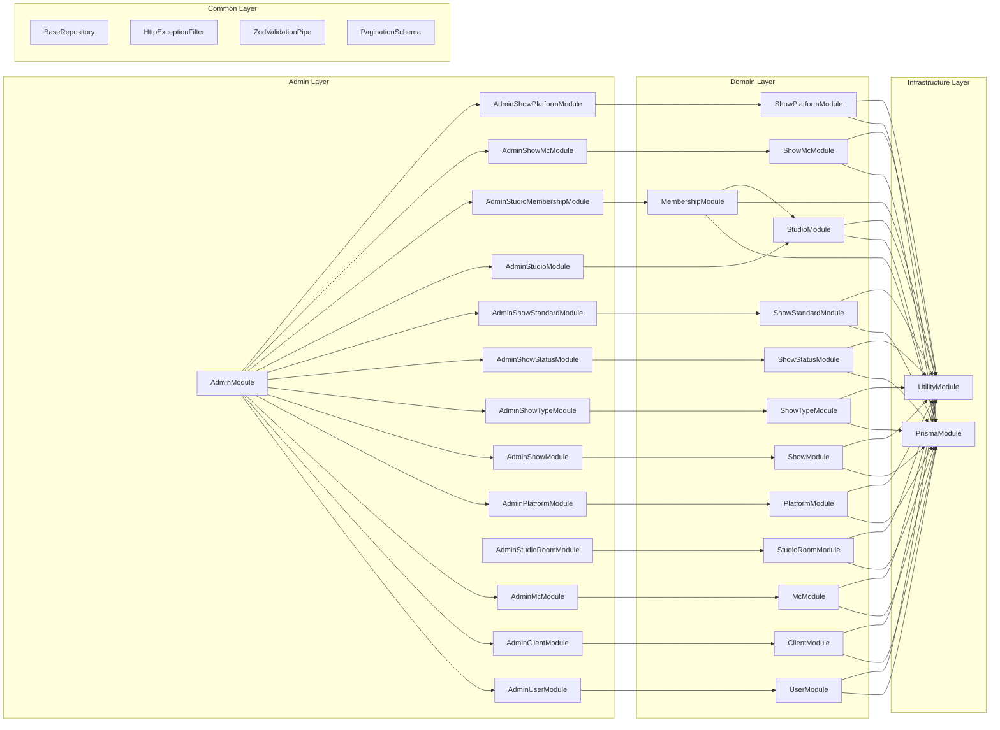

# Eridu Services API Architecture

This document provides a comprehensive overview of the module architecture and relationships in the Eridu Services API.

## Table of Contents

- [Overview](#overview)
- [Module Architecture](#module-architecture)
- [Module Relationships](#module-relationships)
- [Data Flow](#data-flow)
- [Key Components](#key-components)
- [API Endpoints](#api-endpoints)

## Overview

The Eridu Services API is built using NestJS with a modular architecture that separates concerns into distinct layers. Currently, the implementation focuses on the foundation layer with basic administrative operations for core entities.

**Current Implementation Status:**
- **Phase 1**: Core Functions with Hybrid Authentication - Essential CRUD operations, basic show management, JWT validation for user identification, and simple StudioMembership-based admin verification
- **Admin Layer**: Administrative operations for Users, Clients, MCs, Platforms, Studios, and related entities
- **Domain Layer**: Business logic for core entities with proper service patterns
- **Infrastructure Layer**: Database access, utilities, and common services
- **Common Layer**: Shared utilities, decorators, and base classes
- **Authentication**: JWT token validation from `erify_auth` service for user identification
- **Authorization**: Simple StudioMembership model for admin verification (Phase 1 basics, Phase 3 Client/Platform memberships)

**Phase 2 Planned Features:**
- **Scheduling System**: Multi-version scheduling with change tracking
- **Collaborative Planning**: Client-studio collaboration workflows
- **Resource Management**: Studio room allocation and conflict detection
- **Basic Collaboration**: Comments and user attribution

**Phase 3 Planned Features:**
- **Advanced Authorization**: Role-based access control with granular permissions
- **Audit Trail**: Comprehensive change tracking and compliance
- **Task Management**: Complete workflow automation and task templates
- **Advanced Collaboration**: Tagging, enhanced comments, and notifications
- **Material Management**: Complete material versioning and platform targeting

## Module Architecture

### High-Level Module Structure

```mermaid
graph TB
    App[AppModule] --> Admin[AdminModule]
    App --> Config[ConfigModule]
    App --> Logger[LoggerModule]
    
    Admin --> AdminUser[AdminUserModule]
    Admin --> AdminClient[AdminClientModule]
    Admin --> AdminMC[AdminMcModule]
    Admin --> AdminPlatform[AdminPlatformModule]
    Admin --> AdminShow[AdminShowModule]
    Admin --> AdminShowType[AdminShowTypeModule]
    Admin --> AdminShowStatus[AdminShowStatusModule]
    Admin --> AdminShowStandard[AdminShowStandardModule]
    Admin --> AdminStudio[AdminStudioModule]
    Admin --> AdminStudioRoom[AdminStudioRoomModule]
    Admin --> AdminStudioMembership[AdminStudioMembershipModule]
    Admin --> AdminShowMC[AdminShowMcModule]
    Admin --> AdminShowPlatform[AdminShowPlatformModule]
    
    AdminUser --> User[UserModule]
    AdminClient --> Client[ClientModule]
    AdminMC --> MC[McModule]
    AdminPlatform --> Platform[PlatformModule]
    AdminShow --> ShowOrchestration[ShowOrchestrationModule]
    AdminShowType --> ShowType[ShowTypeModule]
    AdminShowStatus --> ShowStatus[ShowStatusModule]
    AdminShowStandard --> ShowStandard[ShowStandardModule]
    AdminStudio --> Studio[StudioModule]
    AdminStudioRoom --> StudioRoom[StudioRoomModule]
    AdminStudioMembership --> Membership[MembershipModule]
    AdminShowMC --> ShowMC[ShowMcModule]
    AdminShowPlatform --> ShowPlatform[ShowPlatformModule]
    
    User --> Prisma[PrismaModule]
    User --> Utility[UtilityModule]
    
    Client --> Prisma
    Client --> Utility
    
    MC --> Prisma
    MC --> Utility
    
    Platform --> Prisma
    Platform --> Utility
    
    Show --> Prisma
    Show --> Utility
    Show --> Client
    Show --> StudioRoom
    Show --> ShowType
    Show --> ShowStatus
    Show --> ShowStandard
    
    ShowOrchestration --> Show
    ShowOrchestration --> MC
    ShowOrchestration --> Platform
    ShowOrchestration --> ShowMC
    ShowOrchestration --> ShowPlatform
    ShowOrchestration --> Prisma
    
    ShowType --> Prisma
    ShowType --> Utility
    
    ShowStatus --> Prisma
    ShowStatus --> Utility
    
    ShowStandard --> Prisma
    ShowStandard --> Utility
    
    Studio --> Prisma
    Studio --> Utility
    
    StudioRoom --> Prisma
    StudioRoom --> Utility
    
    ShowMC --> Prisma
    ShowMC --> Utility
    
    ShowPlatform --> Prisma
    ShowPlatform --> Utility
    
    StudioMembership[StudioMembershipModule] --> Prisma
    
    Prisma --> DB[(PostgreSQL Database)]
    
    %% Future modules (planned)
    classDef planned fill:#f9f9f9,stroke:#999,stroke-dasharray: 5 5
    class ShowModule,StudioModule,MaterialModule,TaskModule planned
```



### Detailed Module Dependencies



## Module Relationships

### 1. AppModule (Root Module)
- **Purpose**: Application bootstrap and global configuration
- **Imports**: 
  - `ConfigModule` (Global configuration)
  - `LoggerModule` (Structured logging)
  - `AdminModule` (Main business logic)
- **Providers**: Global pipes, interceptors, and filters

### 2. AdminModule
- **Purpose**: Administrative operations aggregation
- **Architecture**: Simplified controller-only pattern (no admin-specific services)
- **Imports**: 
  - `AdminUserModule`
  - `AdminClientModule` 
  - `AdminMcModule`
  - `AdminPlatformModule`
  - `AdminShowModule` ⭐
  - `AdminShowTypeModule`
  - `AdminShowStatusModule`
  - `AdminShowStandardModule`
  - `AdminStudioModule`
  - `AdminStudioRoomModule`
  - `AdminStudioMembershipModule`
  - `AdminShowMcModule`
  - `AdminShowPlatformModule`
- **Note**: Admin modules contain only controllers; they directly use domain services and leverage Prisma's native features

### 3. Domain Modules

#### UserModule
- **Purpose**: User entity management
- **Imports**: `PrismaModule`, `UtilityModule`
- **Providers**: `UserService`, `UserRepository`
- **Exports**: `UserService`

#### ClientModule
- **Purpose**: Client entity management
- **Imports**: `PrismaModule`, `UtilityModule`
- **Providers**: `ClientService`, `ClientRepository`
- **Exports**: `ClientService`

#### McModule
- **Purpose**: MC (Master of Ceremonies) entity management
- **Imports**: `PrismaModule`, `UtilityModule`
- **Providers**: `McService`, `McRepository`
- **Exports**: `McService`

#### PlatformModule
- **Purpose**: Platform entity management
- **Imports**: `PrismaModule`, `UtilityModule`
- **Providers**: `PlatformService`, `PlatformRepository`
- **Exports**: `PlatformService`

#### ShowModule ⭐
- **Purpose**: Core show entity management with advanced DTO-to-Prisma transformation pattern
- **Imports**: `PrismaModule`, `UtilityModule`, `ClientModule`, `StudioRoomModule`, `ShowTypeModule`, `ShowStatusModule`, `ShowStandardModule`
- **Providers**: `ShowService`, `ShowRepository`
- **Exports**: `ShowService`
- **Pattern**: Implements dual-method approach with `createShowFromDto/createShow`, `updateShowFromDto/updateShow`
- **Features**: 
  - Builder methods for DTO transformation (`buildCreatePayload`, `buildUpdatePayload`)
  - Generic includes for type-safe relation loading (`ShowWithIncludes<T>`)
  - Time range validation (endTime must be after startTime)
  - Core show CRUD operations only (no cross-module orchestration)
  - Comprehensive test coverage (15 test cases)

#### ShowOrchestrationModule ⭐
- **Purpose**: Cross-module orchestration for complex show operations involving MCs and platforms
- **Architecture**: Orchestration layer that coordinates multiple domain services
- **Pattern**: Uses Prisma transactions for atomic operations across multiple modules
- **Benefits**:
  - Prevents circular dependencies by centralizing cross-module coordination
  - Ensures data consistency through atomic transactions
  - Provides unified interface for complex business operations
  - Maintains clean separation between core domain logic and orchestration logic
- **Status**: 🚧 PLANNED - Not yet implemented

#### ShowTypeModule
- **Purpose**: ShowType entity management
- **Imports**: `PrismaModule`, `UtilityModule`
- **Providers**: `ShowTypeService`, `ShowTypeRepository`
- **Exports**: `ShowTypeService`

#### ShowStatusModule
- **Purpose**: ShowStatus entity management
- **Imports**: `PrismaModule`, `UtilityModule`
- **Providers**: `ShowStatusService`, `ShowStatusRepository`
- **Exports**: `ShowStatusService`

#### ShowStandardModule
- **Purpose**: ShowStandard entity management
- **Imports**: `PrismaModule`, `UtilityModule`
- **Providers**: `ShowStandardService`, `ShowStandardRepository`
- **Exports**: `ShowStandardService`

#### StudioModule
- **Purpose**: Studio entity management
- **Imports**: `PrismaModule`, `UtilityModule`
- **Providers**: `StudioService`, `StudioRepository`
- **Exports**: `StudioService`

#### StudioRoomModule
- **Purpose**: StudioRoom entity management
- **Imports**: `PrismaModule`, `UtilityModule`
- **Providers**: `StudioRoomService`, `StudioRoomRepository`
- **Exports**: `StudioRoomService`

#### MembershipModule
- **Purpose**: Studio membership entity management for user-studio relationships
- **Imports**: `PrismaModule`, `UtilityModule`, `StudioModule`
- **Providers**: `StudioMembershipService`, `StudioMembershipRepository`
- **Exports**: `StudioMembershipService`

#### ShowMcModule
- **Purpose**: Show-MC relationship management
- **Imports**: `PrismaModule`, `UtilityModule`
- **Providers**: `ShowMcService`, `ShowMcRepository`
- **Exports**: `ShowMcService`
- **Features**: Manages many-to-many show-MC relationships with notes

#### ShowPlatformModule
- **Purpose**: Show-platform relationship management
- **Imports**: `PrismaModule`, `UtilityModule`
- **Providers**: `ShowPlatformService`, `ShowPlatformRepository`
- **Exports**: `ShowPlatformService`
- **Features**: Manages multi-platform broadcasting with stream links and viewer tracking

### 4. Orchestration Modules

#### ShowOrchestrationModule ⭐
- **Purpose**: Cross-module coordination for complex show operations
- **Architecture**: Orchestration layer that coordinates multiple domain services
- **Pattern**: Uses Prisma transactions for atomic operations across multiple modules
- **Benefits**:
  - Prevents circular dependencies by centralizing cross-module coordination
  - Ensures data consistency through atomic transactions
  - Provides unified interface for complex business operations
  - Maintains clean separation between core domain logic and orchestration logic

### 5. Admin Modules

> **Architecture Note**: Admin modules follow a simplified pattern with controllers only (no admin-specific services). Controllers directly use domain services and orchestration services, leveraging Prisma's native features like nested `connect` with UIDs for foreign key relationships.

#### AdminUserModule
- **Purpose**: Administrative user operations
- **Imports**: `UserModule`, `UtilityModule`
- **Controllers**: `AdminUserController`
- **Pattern**: Directly calls `UserService` for all operations

#### AdminClientModule
- **Purpose**: Administrative client operations
- **Imports**: `ClientModule`, `UtilityModule`
- **Controllers**: `AdminClientController`
- **Pattern**: Directly calls `ClientService` for all operations

#### AdminMcModule
- **Purpose**: Administrative MC operations
- **Imports**: `McModule`, `UtilityModule`
- **Controllers**: `AdminMcController`
- **Pattern**: Uses Prisma's `connect: { uid }` for user relationships
- **Example**: `user: { connect: { uid: body.userId } }`

#### AdminPlatformModule
- **Purpose**: Administrative platform operations
- **Imports**: `PlatformModule`, `UtilityModule`
- **Controllers**: `AdminPlatformController`
- **Pattern**: Directly calls `PlatformService` for all operations

#### AdminShowModule ⭐
- **Purpose**: Administrative show operations with full CRUD and cross-module orchestration
- **Imports**: `ShowOrchestrationModule`, `UtilityModule`
- **Controllers**: `AdminShowController`
- **Pattern**: Uses `ShowOrchestrationService` as primary service for all show operations
- **Features**:
  - Unified show creation supporting both simple shows and shows with MC/platform assignments
  - Complete show retrieval with all relations (MCs, platforms, clients, studio rooms, etc.)
  - Atomic operations using Prisma transactions for data consistency
  - Transparent handling of simple vs complex show operations
  - Same API endpoints with enhanced functionality
- **Endpoints**: Full CRUD at `/admin/shows`

#### AdminShowTypeModule
- **Purpose**: Administrative show type operations
- **Imports**: `ShowTypeModule`, `UtilityModule`
- **Controllers**: `AdminShowTypeController`
- **Pattern**: Directly calls `ShowTypeService` for all operations

#### AdminShowStatusModule
- **Purpose**: Administrative show status operations
- **Imports**: `ShowStatusModule`, `UtilityModule`
- **Controllers**: `AdminShowStatusController`
- **Pattern**: Directly calls `ShowStatusService` for all operations

#### AdminShowStandardModule
- **Purpose**: Administrative show standard operations
- **Imports**: `ShowStandardModule`, `UtilityModule`
- **Controllers**: `AdminShowStandardController`
- **Pattern**: Directly calls `ShowStandardService` for all operations

#### AdminStudioModule
- **Purpose**: Administrative studio operations
- **Imports**: `StudioModule`, `UtilityModule`
- **Controllers**: `AdminStudioController`
- **Pattern**: Directly calls `StudioService` for all operations

#### AdminStudioRoomModule
- **Purpose**: Administrative studio room operations
- **Imports**: `StudioRoomModule`, `UtilityModule`
- **Controllers**: `AdminStudioRoomController`
- **Pattern**: Uses Prisma's `connect: { uid }` for studio relationships
- **Example**: `studio: { connect: { uid: body.studioId } }`

#### AdminStudioMembershipModule
- **Purpose**: Administrative studio membership operations
- **Imports**: `MembershipModule`, `UserModule`, `StudioModule`, `UtilityModule`
- **Controllers**: `AdminStudioMembershipController`
- **Pattern**: Validates user/studio existence, then uses domain service
- **Special**: Requires validation as `StudioMembershipService.createStudioMembershipWithValidation()` expects internal IDs

#### AdminShowMcModule
- **Purpose**: Administrative show-MC relationship operations
- **Imports**: `ShowMcModule`, `UtilityModule`
- **Controllers**: `AdminShowMcController`
- **Pattern**: Uses `ShowMcService` DTO methods for relationship management
- **Features**: Create, read, update, delete show-MC assignments

#### AdminShowPlatformModule
- **Purpose**: Administrative show-platform relationship operations
- **Imports**: `ShowPlatformModule`, `UtilityModule`
- **Controllers**: `AdminShowPlatformController`
- **Pattern**: Uses `ShowPlatformService` DTO methods for platform integration
- **Features**: Manage multi-platform broadcasting with stream links and viewer tracking

### 5. Infrastructure Modules

#### PrismaModule
- **Purpose**: Database connection and ORM
- **Providers**: `PrismaService`
- **Exports**: `PrismaService`

#### UtilityModule
- **Purpose**: Utility functions (ID generation, etc.)
- **Providers**: `UtilityService`
- **Exports**: `UtilityService`

## Data Flow

### Request Processing Flow

**Simplified Architecture (No Admin Service Layer)**


### Data Processing Flow

**Simplified Flow (Direct Domain Service Usage)**

```mermaid
flowchart TD
    API[API Request<br/>snake_case] --> Controller[Admin Controller]
    Controller --> Transform[Zod Transform<br/>snake_case → camelCase]
    Transform --> DomainService[Domain Service]
    Note1[No admin service layer]
    DomainService --> Repository[Repository Layer]
    Repository --> Prisma[Prisma ORM<br/>camelCase]
    Note2[Prisma handles<br/>nested connect with UIDs]
    Prisma --> Database[PostgreSQL]

    Database --> Prisma
    Prisma --> Repository
    Repository --> DomainService
    DomainService --> Controller
    Controller --> Serializer[Zod Serializer<br/>camelCase → snake_case<br/>uid → id]
    Serializer --> APIResponse[API Response<br/>snake_case]
```



## Key Architectural Benefits

### 1. **Separation of Concerns**
- **Core Modules**: Focus on single domain entity management
- **Orchestration Modules**: Handle cross-module coordination and complex business operations
- **Admin Modules**: Provide clean API interfaces using appropriate services

### 2. **Circular Dependency Prevention**
- Core modules only import direct dependencies (Prisma, Utility, related entities)
- Orchestration modules import multiple domain modules without creating cycles
- Clear dependency hierarchy prevents architectural issues

### 3. **Data Consistency**
- Prisma transactions ensure atomic operations across multiple modules
- Validation happens before transaction execution
- Rollback capability for failed operations

### 4. **Performance Optimization**
- Simple operations bypass orchestration overhead
- Complex operations use optimized transaction logic
- Lazy loading and selective includes based on operation type

### 5. **Maintainability**
- Changes to MC/Platform logic don't affect core ShowModule
- Easy to test orchestration logic separately
- Clear upgrade path for complex features

### 6. **Scalability**
- Easy to add new cross-module features
- Can create multiple orchestration modules for different domains
- Supports microservice extraction later

## Key Components

### OpenAPI Documentation

The API includes comprehensive OpenAPI documentation powered by Scalar UI:

- **Interactive Documentation**: Available at `/api-reference` endpoint
- **OpenAPI JSON Spec**: Available at `/swagger-json` endpoint
- **Zod Integration**: Automatic schema generation from Zod validation schemas
- **Custom Decorators**: `ApiZodResponse`, `ApiZodBody`, `ApiZodQuery`, `ApiZodParam` for type-safe documentation
- **Modern UI**: Scalar UI provides responsive, mobile-friendly documentation interface

**Implementation Details:**
- Configuration in `src/common/openapi/openapi.config.ts`
- Custom Zod-to-OpenAPI converter in `src/common/openapi/zod-converter.ts`
- Reusable decorators in `src/common/openapi/decorators.ts`
- Scalar UI served from `public/scalar.html`

### Services

**Service Architecture** (Business Logic Layer)

The service layer follows a clear separation of concerns with two distinct base service types:

### BaseModelService
All core entity services extend `BaseModelService` which provides:
- UID generation with entity-specific prefixes
- Common CRUD operation patterns
- Single-entity focus for data persistence

### BaseOrchestrationService
Cross-module coordination services extend `BaseOrchestrationService` which provides:
- Multi-service coordination patterns
- Transaction management utilities
- Entity validation helpers
- Error handling for complex operations

**Model Services** (Single Entity Management)

| Service                   | Purpose                                   | Dependencies                                                    |
| ------------------------- | ----------------------------------------- | --------------------------------------------------------------- |
| `UserService`             | User CRUD operations                      | `UserRepository`, `UtilityService`                              |
| `ClientService`           | Client CRUD operations                    | `ClientRepository`, `UtilityService`                            |
| `McService`               | MC CRUD operations                        | `McRepository`, `UtilityService`                                |
| `PlatformService`         | Platform CRUD operations                  | `PlatformRepository`, `UtilityService`                          |
| `ShowService` ⭐           | Show CRUD with DTO transformation pattern | `ShowRepository`, `UtilityService`                              |
| `ShowTypeService`         | ShowType CRUD operations                  | `ShowTypeRepository`, `UtilityService`                          |
| `ShowStatusService`       | ShowStatus CRUD operations                | `ShowStatusRepository`, `UtilityService`                        |
| `ShowStandardService`     | ShowStandard CRUD operations              | `ShowStandardRepository`, `UtilityService`                      |
| `StudioService`           | Studio CRUD operations                    | `StudioRepository`, `UtilityService`                            |
| `StudioRoomService`       | StudioRoom CRUD operations                | `StudioRoomRepository`, `UtilityService`                        |
| `StudioMembershipService` | Studio membership CRUD operations         | `StudioMembershipRepository`, `UtilityService`, `StudioService` |
| `ShowMcService`           | Show-MC relationship management           | `ShowMcRepository`, `UtilityService`                            |
| `ShowPlatformService`     | Show-platform relationship management     | `ShowPlatformRepository`, `UtilityService`                      |

**Orchestration Services** (Cross-Module Coordination)

| Service                   | Purpose                                   | Dependencies                                                    |
| ------------------------- | ----------------------------------------- | --------------------------------------------------------------- |
| *Future orchestration services will be added here as they are implemented* | | |

> **Note**: Admin modules do NOT have separate admin services. Admin controllers directly use domain services to maintain a cleaner architecture and leverage Prisma's native features.

### Repositories

| Repository                   | Purpose                                | Base Class                         |
| ---------------------------- | -------------------------------------- | ---------------------------------- |
| `UserRepository`             | User data access                       | `BaseRepository<User>`             |
| `ClientRepository`           | Client data access                     | `BaseRepository<Client>`           |
| `McRepository`               | MC data access                         | `BaseRepository<MC>`               |
| `StudioRepository`           | Studio data access                     | `BaseRepository<Studio>`           |
| `StudioRoomRepository`       | StudioRoom data access                 | `BaseRepository<StudioRoom>`       |
| `StudioMembershipRepository` | Studio membership data access          | `BaseRepository<StudioMembership>` |
| `ShowMcRepository`           | Show-MC relationship data access       | `BaseRepository<ShowMC>`           |
| `ShowPlatformRepository`     | Show-platform relationship data access | `BaseRepository<ShowPlatform>`     |

### Utilities

| Utility                    | Purpose                                     |
| -------------------------- | ------------------------------------------- |
| `UtilityService`           | ID generation, common utilities             |
| `HttpExceptionFilter`      | Global error handling                       |
| `ZodValidationPipe`        | Request validation                          |
| `UidValidationPipe`        | Path parameter UID format validation        |
| `ZodSerializerInterceptor` | Response serialization                      |
| `BaseRepository`           | Generic repository pattern with soft delete |
| `PaginationSchema`         | Pagination query and response schemas       |

## API Endpoints

### Admin Endpoints

#### Users
- `GET /admin/users` - List users with pagination
- `POST /admin/users` - Create user
- `GET /admin/users/:id` - Get user by ID (maps to internal UID)
- `PATCH /admin/users/:id` - Update user
- `DELETE /admin/users/:id` - Soft delete user

#### Clients
- `GET /admin/clients` - List clients with pagination
- `POST /admin/clients` - Create client
- `GET /admin/clients/:id` - Get client by ID (maps to internal UID)
- `PATCH /admin/clients/:id` - Update client
- `DELETE /admin/clients/:id` - Soft delete client

#### MCs
- `GET /admin/mcs` - List MCs with pagination
- `POST /admin/mcs` - Create MC
- `GET /admin/mcs/:id` - Get MC by ID (maps to internal UID)
- `PATCH /admin/mcs/:id` - Update MC
- `DELETE /admin/mcs/:id` - Soft delete MC

#### Platforms
- `GET /admin/platforms` - List platforms with pagination
- `POST /admin/platforms` - Create platform
- `GET /admin/platforms/:id` - Get platform by ID (maps to internal UID)
- `PATCH /admin/platforms/:id` - Update platform
- `DELETE /admin/platforms/:id` - Soft delete platform

#### Shows ⭐
- `GET /admin/shows` - List shows with pagination and relations
- `POST /admin/shows` - Create show (validates time range)
- `GET /admin/shows/:id` - Get show by ID with relations (maps to internal UID)
- `PATCH /admin/shows/:id` - Update show (validates time range)
- `DELETE /admin/shows/:id` - Soft delete show

#### ShowTypes
- `GET /admin/show-types` - List show types with pagination
- `POST /admin/show-types` - Create show type
- `GET /admin/show-types/:id` - Get show type by ID (maps to internal UID)
- `PATCH /admin/show-types/:id` - Update show type
- `DELETE /admin/show-types/:id` - Soft delete show type

#### ShowStatuses
- `GET /admin/show-statuses` - List show statuses with pagination
- `POST /admin/show-statuses` - Create show status
- `GET /admin/show-statuses/:id` - Get show status by ID (maps to internal UID)
- `PATCH /admin/show-statuses/:id` - Update show status
- `DELETE /admin/show-statuses/:id` - Soft delete show status

#### ShowStandards
- `GET /admin/show-standards` - List show standards with pagination
- `POST /admin/show-standards` - Create show standard
- `GET /admin/show-standards/:id` - Get show standard by ID (maps to internal UID)
- `PATCH /admin/show-standards/:id` - Update show standard
- `DELETE /admin/show-standards/:id` - Soft delete show standard

#### Studios
- `GET /admin/studios` - List studios with pagination
- `POST /admin/studios` - Create studio
- `GET /admin/studios/:id` - Get studio by ID (maps to internal UID)
- `PATCH /admin/studios/:id` - Update studio
- `DELETE /admin/studios/:id` - Soft delete studio

#### StudioRooms
- `GET /admin/studio-rooms` - List studio rooms with pagination
- `POST /admin/studio-rooms` - Create studio room
- `GET /admin/studio-rooms/:id` - Get studio room by ID (maps to internal UID)
- `PATCH /admin/studio-rooms/:id` - Update studio room
- `DELETE /admin/studio-rooms/:id` - Soft delete studio room

#### StudioMemberships
- `GET /admin/studio-memberships` - List studio memberships with pagination
- `POST /admin/studio-memberships` - Create studio membership
- `GET /admin/studio-memberships/:id` - Get studio membership by ID (maps to internal UID)
- `PATCH /admin/studio-memberships/:id` - Update studio membership
- `DELETE /admin/studio-memberships/:id` - Soft delete studio membership

#### ShowMCs
- `GET /admin/show-mcs` - List show-MC relationships with pagination
- `POST /admin/show-mcs` - Create show-MC assignment
- `GET /admin/show-mcs/:id` - Get show-MC relationship by ID (maps to internal UID)
- `PATCH /admin/show-mcs/:id` - Update show-MC relationship
- `DELETE /admin/show-mcs/:id` - Soft delete show-MC relationship

#### ShowPlatforms
- `GET /admin/show-platforms` - List show-platform integrations with pagination
- `POST /admin/show-platforms` - Create show-platform integration
- `GET /admin/show-platforms/:id` - Get show-platform integration by ID (maps to internal UID)
- `PATCH /admin/show-platforms/:id` - Update show-platform integration
- `DELETE /admin/show-platforms/:id` - Soft delete show-platform integration

### Data Formats

#### Input Format (snake_case)
```json
{
  "name": "John Doe",
  "ext_id": "ext_123",
  "email": "john@example.com",
  "profile_url": "https://example.com/profile",
  "contact_person": "Jane Smith",
  "contact_email": "jane@example.com",
  "alias_name": "MC Alias",
  "user_id": 1,
  "is_banned": false,
  "metadata": {}
}
```

#### Output Format (snake_case with uid as id)
```json
{
  "id": "user_123",
  "ext_id": "ext_123",
  "email": "john@example.com",
  "name": "John Doe",
  "profile_url": "https://example.com/profile",
  "contact_person": "Jane Smith",
  "contact_email": "jane@example.com",
  "alias_name": "MC Alias",
  "user_id": 1,
  "is_banned": false,
  "created_at": "2024-01-01T00:00:00Z",
  "updated_at": "2024-01-01T00:00:00Z"
}
```

## Design Patterns

### 1. Repository Pattern
- Abstracts data access logic
- Provides consistent interface across entities
- Enables easy testing and mocking

### 2. Simplified Service Layer Pattern
- **Domain Services**: Business logic for entities
- **Admin Controllers**: Directly call domain services (no admin service layer)
- **Benefits**: Reduced code duplication, cleaner architecture, better performance

### 3. Prisma Native Features
- **Nested Connect**: Use `connect: { uid }` for foreign key relationships
- **No Manual Resolution**: Prisma handles UID-to-ID conversion automatically
- **Validation**: Prisma throws errors if referenced entities don't exist

### 4. Module Pattern
- Encapsulates related functionality
- Provides clear dependency boundaries
- Enables lazy loading and tree shaking

### 5. Decorator Pattern
- Adds functionality without modifying core classes
- Enables cross-cutting concerns (validation, serialization)
- Provides clean separation of concerns

### 6. ID Mapping Pattern & Validation
- **ID Mapping**: All API endpoints use generic `id` parameters that map to internal UIDs for external communication
- **UID Format**: All entities use branded UIDs in format `{prefix}_{randomId}` internally
- **Prefix Standard**: All UID_PREFIX constants are defined WITHOUT trailing underscore for consistency
- **UidValidationPipe**: Validates path parameter IDs at the controller boundary (maps to UIDs internally)
- **Security-First**: Never exposes internal UID format patterns or number-based primary keys in URLs or error messages
- **Model-Specific**: Provides context-specific error messages (e.g., "Invalid User ID")
- **Early Validation**: Catches invalid IDs before service layer execution
- **Example Usage**:
```typescript
@Get(':id')
@HttpCode(HttpStatus.OK)
@ZodSerializerDto(UserDto)
getUser(
  @Param('id', new UidValidationPipe(UserService.UID_PREFIX, 'User'))
  id: string,
) {
  return this.userService.getUserById(id);
}
```

## Testing Strategy

### Unit Tests
- **Domain service** testing with mocked repositories
- **Repository** testing with in-memory database
- **Utility function** testing
- **Controller** testing with mocked services

### Integration Tests
- End-to-end API testing
- Database integration testing
- Module integration testing

### Test Structure
```
src/
├── user/
│   ├── user.service.spec.ts
│   └── user.repository.spec.ts
├── admin/
│   └── users/
│       └── admin-user.controller.spec.ts  # Controllers only (no admin services)
└── test/
    └── jest-e2e.json
```

> **Note**: Admin modules test controllers directly since there are no admin service layers.

## Configuration

### Environment Variables
- `DATABASE_URL`: PostgreSQL connection string
- `NODE_ENV`: Environment (development, production)
- `PORT`: Server port
- `LOG_LEVEL`: Logging level

### Database Schema
- Uses Prisma ORM for type-safe database access
- Supports migrations and schema evolution
- Includes soft delete functionality

## Security Considerations

### Input Validation
- Zod schema validation for all request body inputs
- UID format validation for path parameters via `UidValidationPipe`
- Type-safe request/response handling
- SQL injection prevention via Prisma
- Security-conscious error messages (no internal format exposure)

### Error Handling
- Global exception filter
- Structured error responses
- Sensitive data protection

### Authentication & Authorization
- **Phase 1 Hybrid Approach**: JWT validation for user identification + StudioMembership model for admin verification
- **JWT Validation** (Pending): Token validation from `erify_auth` service for user identification
- **Admin Verification**: StudioMembership model determines admin permissions (simple lookup in ANY studio)
- **Access Control**: Admin users get full CRUD access, non-admin users get read-only access
- **Service Integration** (Pending): API key authentication for internal service communication
- **Admin Guards** (Pending): JWT + StudioMembership verification for write operations
- **Phase 3 Enhancement**: Client/Platform memberships and advanced role-based access control

## Performance Considerations

### Database Optimization
- Indexed UID fields for fast lookups
- Soft delete pattern for data retention
- Pagination for large datasets

### Caching Strategy
- Repository-level caching ready
- Service-level caching for expensive operations
- Response caching for static data

### Monitoring
- Structured logging with Pino
- Request/response timing
- Error tracking and alerting

## Controller Patterns

### ID Mapping Pattern

All admin controllers implement ID mapping for path parameters to ensure security and provide clear error messages while hiding internal UID formats and number-based primary keys from external stakeholders:

```typescript
import { UidValidationPipe } from '../../common/pipes/uid-validation.pipe';
import { UserService } from '../../user/user.service';

@Controller('admin/users')
export class AdminUserController {
  @Get(':id')
  @HttpCode(HttpStatus.OK)
  @ZodSerializerDto(UserDto)
  getUser(
    @Param('id', new UidValidationPipe(UserService.UID_PREFIX, 'User'))
    id: string,
  ) {
    return this.userService.getUserById(id);
  }

  @Patch(':id')
  @HttpCode(HttpStatus.OK)
  @ZodSerializerDto(UserDto)
  updateUser(
    @Param('id', new UidValidationPipe(UserService.UID_PREFIX, 'User'))
    id: string,
    @Body() body: UpdateUserDto,
  ) {
    return this.userService.updateUser(id, body);
  }

  @Delete(':id')
  @HttpCode(HttpStatus.NO_CONTENT)
  async deleteUser(
    @Param('id', new UidValidationPipe(UserService.UID_PREFIX, 'User'))
    id: string,
  ) {
    await this.userService.deleteUser(id);
  }
}
```

**Key Benefits:**
- ✅ **ID Mapping**: Generic `id` parameters map to internal UIDs for external communication
- ✅ **Security-First**: Never exposes internal UID format patterns or number-based primary keys in URLs
- ✅ **Stakeholder Privacy**: External stakeholders don't know about internal database structure
- ✅ **User-Friendly**: Returns model-specific error messages ("Invalid User ID")
- ✅ **Consistent**: Same pattern across all 12 admin controllers
- ✅ **Type-Safe**: Uses service's `UID_PREFIX` constant for validation
- ✅ **Clean URLs**: API endpoints use `/admin/users/:id` instead of `/admin/users/:uid`

**Error Examples:**
```json
// Empty ID
{ "statusCode": 400, "message": "User ID is required" }

// Invalid format
{ "statusCode": 400, "message": "Invalid User ID" }
```

## Recent Architectural Changes

### ID Mapping Pattern (December 2024)

**Motivation**: Implement proper ID mapping pattern to hide internal UID formats and number-based primary keys from external APIs while maintaining security and providing clear error messages for external stakeholders.

**Changes Made**:
1. **ID Mapping**: All API endpoints now use generic `id` parameters that map to internal UIDs for external communication
2. **URL Pattern Update**: Changed from `/admin/users/:uid` to `/admin/users/:id` across all controllers
3. **Security Enhancement**: Internal UID format patterns and number-based primary keys are no longer exposed in URLs
4. **Stakeholder Privacy**: External stakeholders cannot infer internal database structure from API endpoints
5. **Consistent Validation**: `UidValidationPipe` now validates `id` parameters but maps to UIDs internally
6. **Clean API Design**: External clients see generic IDs while internal systems use branded UIDs

**Implementation**:
- **Controllers**: All 12 admin controllers updated to use `@Param('id')` instead of `@Param('uid')`
- **Validation**: `UidValidationPipe` validates ID format and maps to internal UID
- **Services**: No changes needed - services continue to work with UIDs internally
- **DTOs**: Response mapping remains the same (`uid` → `id` in responses)

**Benefits**:
- ✅ **Security**: Internal UID format patterns and number-based primary keys hidden from external clients
- ✅ **Stakeholder Privacy**: External stakeholders don't know about internal database structure
- ✅ **Clean URLs**: Generic `/admin/users/:id` instead of `/admin/users/:uid`
- ✅ **Consistency**: All endpoints follow the same ID mapping pattern
- ✅ **Backward Compatibility**: Internal service layer unchanged
- ✅ **Error Messages**: Clear, model-specific error messages maintained

**Example Before/After**:
```typescript
// Before: Exposed UID format (reveals internal structure)
@Get(':uid')
getUser(@Param('uid') uid: string) { ... }
// URL: /admin/users/user_abc123 (external stakeholders see UID format)

// After: Generic ID mapping (hides internal structure)
@Get(':id')
getUser(@Param('id', new UidValidationPipe(UserService.UID_PREFIX, 'User')) id: string) { ... }
// URL: /admin/users/:id (external stakeholders see generic ID)
```

### UID Validation Pattern (October 2025)

**Motivation**: Enhance security, unify prefix format, and provide better error messages by validating UID format at the controller boundary.

**Changes Made**:
1. **Unified UID Prefix Format**: All UID_PREFIX constants now exclude trailing underscore (e.g., `'srm'` not `'srm_'`)
2. **Created `UidValidationPipe`**: Reusable pipe for UID path parameter validation with automatic prefix normalization
3. **Applied to All Admin Controllers**: 12 controllers now validate `:uid` parameters
4. **Security-Conscious Errors**: Error messages don't expose internal UID format patterns
5. **Model-Specific Messages**: Each controller specifies the model name for clear errors

**Unified Prefix Format**:
All services now use consistent prefix format (no trailing underscore):

| Service                 | UID_PREFIX   | Example UID       |
| ----------------------- | ------------ | ----------------- |
| UserService             | `'user'`     | `user_abc123`     |
| ClientService           | `'client'`   | `client_xyz789`   |
| McService               | `'mc'`       | `mc_def456`       |
| PlatformService         | `'plt'`      | `plt_ghi012`      |
| StudioService           | `'std'`      | `std_jkl345`      |
| StudioRoomService       | `'srm'`      | `srm_mno678`      |
| StudioMembershipService | `'smb'`      | `smb_pqr901`      |
| ShowService             | `'show'`     | `show_stu234`     |
| ShowTypeService         | `'sht'`      | `sht_vwx567`      |
| ShowStatusService       | `'shs'`      | `shs_yza890`      |
| ShowStandardService     | `'shs'`      | `shs_bcd123`      |
| ShowMcService           | `'show_mc'`  | `show_mc_efg456`  |
| ShowPlatformService     | `'show_plt'` | `show_plt_hij789` |

**Implementation**:
- **Location**: `src/common/pipes/uid-validation.pipe.ts`
- **Usage**: `@Param('uid', new UidValidationPipe(Service.UID_PREFIX, 'ModelName'))`
- **Validation**: Automatically normalizes prefix by adding underscore, checks format, and ensures content after prefix
- **Error Format**: Returns `BadRequestException` with status 400

**Affected Controllers**:
All admin detail endpoints (GET/PATCH/DELETE with `:uid`):
- AdminUserController, AdminClientController, AdminMcController
- AdminPlatformController, AdminStudioController, AdminStudioRoomController
- AdminShowController, AdminShowTypeController, AdminShowStatusController
- AdminShowStandardController, AdminShowPlatformController, AdminShowMcController
- AdminStudioMembershipController

### Admin Module Refactoring (October 2025)

**Motivation**: Remove unnecessary abstraction layers and leverage Prisma's native capabilities for cleaner, more maintainable code.

**Changes Made**:
1. **Removed Admin Service Layers**: All 10 admin services deleted (600+ lines of pass-through code removed)
2. **Direct Domain Service Usage**: Admin controllers now call domain services directly
3. **Prisma Native Features**: Leverage `connect: { uid }` for foreign key relationships instead of manual UID-to-ID resolution
4. **Inline Pagination**: Pagination logic moved from services to controllers

**Benefits**:
- ✅ **Reduced Code Duplication**: Eliminated redundant service layer
- ✅ **Better Performance**: Fewer database queries (Prisma handles UID resolution)
- ✅ **Cleaner Architecture**: Controllers → Domain Services → Repositories
- ✅ **Easier Maintenance**: Less code to maintain and test
- ✅ **Consistent Patterns**: All admin endpoints follow the same pattern

**Example Pattern**:
```typescript
// Before: Manual UID resolution in admin service
const user = await this.userService.findUserById(data.userId);
const payload = { userId: user.id, ...otherData };

// After: Prisma handles it natively in controller
const payload: Prisma.MCUpdateInput = {
  user: { connect: { uid: data.userId } },
  ...otherData
};
```

**Migration Impact**:
- ✅ API contracts unchanged (same request/response formats)
- ✅ Validation handled by Prisma (throws if entity doesn't exist)
- ✅ All linter checks passing
- ✅ Documentation updated to reflect new architecture

---

This architecture provides a solid foundation for scalable, maintainable, and testable API development while following NestJS best practices and modern software engineering principles.
