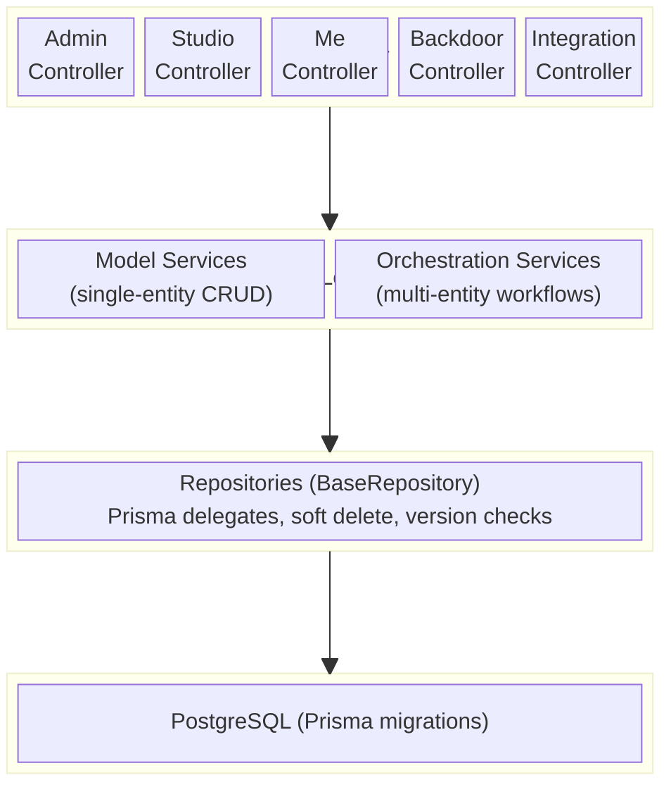

# Architecture Overview

> **TLDR**: NestJS modular architecture with three controller scopes (`/admin`, `/studios/:id`, `/me`). Uses Prisma for data access, Zod for validation/serialization, and `@eridu/auth-sdk` for JWT auth. Each domain has its own module with model service → repository → Prisma layers.

> Slim reference for high-level architecture decisions. For implementation patterns, see the **Skills** section below.

---

## Tech Stack

| Layer         | Technology                                       |
| ------------- | ------------------------------------------------ |
| Runtime       | Node.js (NestJS)                                 |
| ORM           | Prisma (PostgreSQL)                              |
| Auth          | `@eridu/auth-sdk` (JWT/JWKS), `StudioMembership` |
| API Contracts | `@eridu/api-types` (Zod schemas)                 |
| API Docs      | OpenAPI + Scalar UI                              |
| Monorepo      | Turborepo + pnpm workspaces                      |

## Module Architecture



<details>
<summary>ASCII fallback</summary>

```
┌──────────────────────────────────────────────────┐
│                   HTTP Layer                     │
│  Admin / Studio / Me / Backdoor / Integration    │
│  Controllers (extends Base*Controller)           │
└──────────────────┬───────────────────────────────┘
                   │
┌──────────────────▼───────────────────────────────┐
│              Business Logic Layer                │
│  Model Services (single entity CRUD)             │
│  Orchestration Services (multi-entity workflows) │
└──────────────────┬───────────────────────────────┘
                   │
┌──────────────────▼───────────────────────────────┐
│              Data Access Layer                   │
│  Repositories (extends BaseRepository)           │
│  Prisma delegates, soft delete, version checks   │
└──────────────────┬───────────────────────────────┘
                   │
┌──────────────────▼───────────────────────────────┐
│                Database                          │
│  PostgreSQL (via Prisma migrations)              │
└──────────────────────────────────────────────────┘
```

</details>

## Controller Scopes

| Scope       | Route Prefix          | Auth                                             | Base Class               |
| ----------- | --------------------- | ------------------------------------------------ | ------------------------ |
| Admin       | `admin/*`             | `@AdminProtected()` → `isSystemAdmin`            | `BaseAdminController`    |
| Studio      | `studios/:studioId/*` | `@StudioProtected([roles])` → `StudioMembership` | `BaseStudioController`   |
| Me (User)   | `me/*`                | JWT only                                         | `BaseController`         |
| Backdoor    | `backdoor/*`          | API Key (`@Backdoor()`)                          | `BaseBackdoorController` |
| Integration | varies                | Custom guards                                    | Custom base              |

## Key Architectural Decisions

1. **UID-based external IDs** — Internal `bigint` PKs are never exposed. All API endpoints use `uid` (prefixed string) mapped to `id` in responses.
2. **Zod response serialization** — `@ZodResponse(Schema)` on every endpoint ensures no internal data leaks.
3. **Global guards** — `JwtAuthGuard`, `AdminGuard`, `StudioGuard` registered globally; routes opt-in via decorators.
4. **CLS transactions** — `@Transactional()` from `@nestjs-cls/transactional`; never pass `tx` as parameter.
5. **Soft deletes** — All entities use `deletedAt` timestamps; base repository filters automatically.
6. **Module exports = services only** — Repositories are private; services are the module's public API.

## Monorepo Packages

| Package                | Purpose                                           |
| ---------------------- | ------------------------------------------------- |
| `@eridu/api-types`     | Shared Zod schemas and TypeScript types (FE ↔ BE) |
| `@eridu/auth-sdk`      | JWT validation, JWKS management                   |
| `@eridu/ui`            | Shared React UI components                        |
| `@eridu/i18n`          | Internationalization                              |
| `@eridu/eslint-config` | Shared linting rules                              |

## Skills Reference

For detailed implementation patterns, see `.agent/skills/`:

| Skill                                 | Covers                                                     |
| ------------------------------------- | ---------------------------------------------------------- |
| `backend-controller-pattern-nestjs`   | All controller types, base classes, response serialization |
| `service-pattern-nestjs`              | Model services, ORM decoupling, error handling             |
| `repository-pattern-nestjs`           | BaseRepository, filtering, optimistic locking              |
| `orchestration-service-nestjs`        | Multi-service coordination, `@Transactional`, processors   |
| `authentication-authorization-nestjs` | JWT validation, token storage, protected routes            |
| `erify-authorization`                 | AdminGuard, StudioProtected, role-based access             |
| `database-patterns`                   | Soft delete, bulk ops, transactions, nested writes         |
| `data-validation`                     | ID mapping, input validation, response serialization       |
| `shared-api-types`                    | Zod schemas, DTO transforms, subpath imports               |
| `design-patterns`                     | Layer boundaries, module exports, service architecture     |

## Related Documentation

- **[Business Domain](./BUSINESS.md)** — Entity relationships and domain concepts
- **[Authorization Guide](./design/AUTHORIZATION_GUIDE.md)** — Granular RBAC design proposal (not yet implemented)
- **[Schedule Planning](./SCHEDULE_PLANNING.md)** — Schedule planning system
- **[Task Management Summary](./TASK_MANAGEMENT_SUMMARY.md)** — Task management quick-reference
- **[Roadmap](./roadmap/)** — Phase 1–4 implementation plans
