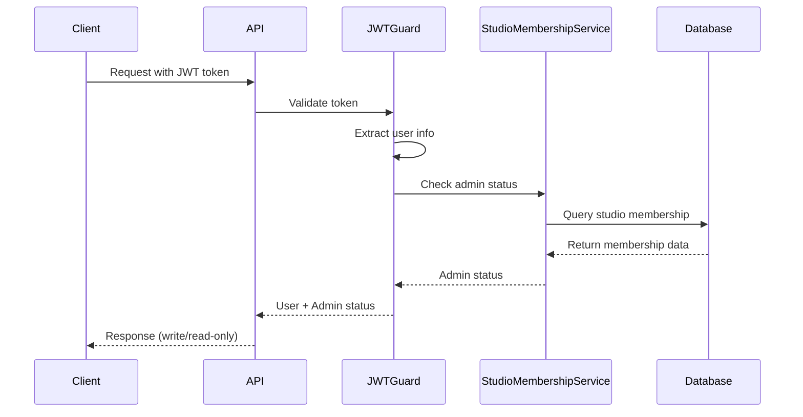

# Phase 1 Authentication Guide

## Overview

This guide provides concrete implementation details for Phase 1's hybrid authentication approach. The system uses JWT validation for user identification and a simple StudioMembership model for admin verification.

### Hybrid Approach Rationale

- **JWT Validation**: Extract user information from `erify_auth` service tokens
- **Simple Authorization**: Use StudioMembership model to distinguish admin vs non-admin users
- **Admin Write, Non-Admin Read-Only**: Clear access pattern without complex role hierarchies
- **Deferred Complexity**: Advanced authorization (Client/Platform memberships, complex roles, permissions) moved to Phase 3

## Architecture



## Implementation Components

### 1. Environment Configuration

Add to `src/config/env.schema.ts`:

```typescript
export const envSchema = z.object({
  // ... existing config
  JWT_SECRET: z.string().min(1),
  ERIFY_AUTH_URL: z.string().url(),
  ERIFY_AUTH_API_KEY: z.string().min(1),
});
```

Required environment variables:
- `JWT_SECRET`: Secret for JWT token validation
- `ERIFY_AUTH_URL`: URL of the erify_auth service
- `ERIFY_AUTH_API_KEY`: API key for service-to-service communication

### 2. JWT Validation Middleware

Create `src/common/guards/jwt-auth.guard.ts`:

```typescript
import { Injectable, CanActivate, ExecutionContext, UnauthorizedException } from '@nestjs/common';
import { JwtService } from '@nestjs/jwt';
import { ConfigService } from '@nestjs/config';

@Injectable()
export class JwtAuthGuard implements CanActivate {
  constructor(
    private readonly jwtService: JwtService,
    private readonly configService: ConfigService,
  ) {}

  async canActivate(context: ExecutionContext): Promise<boolean> {
    const request = context.switchToHttp().getRequest();
    const token = this.extractTokenFromHeader(request);
    
    if (!token) {
      throw new UnauthorizedException('No token provided');
    }

    try {
      const payload = await this.jwtService.verifyAsync(token, {
        secret: this.configService.get<string>('JWT_SECRET'),
      });
      
      // Attach user info to request
      request.user = {
        id: payload.sub,
        email: payload.email,
        name: payload.name,
        extId: payload.extId,
      };
      
      return true;
    } catch {
      throw new UnauthorizedException('Invalid token');
    }
  }

  private extractTokenFromHeader(request: any): string | undefined {
    const [type, token] = request.headers.authorization?.split(' ') ?? [];
    return type === 'Bearer' ? token : undefined;
  }
}
```

### 3. Admin Guard Implementation

Create `src/common/guards/admin.guard.ts`:

```typescript
import { Injectable, CanActivate, ExecutionContext, ForbiddenException } from '@nestjs/common';
import { StudioMembershipService } from '../../studio-membership/studio-membership.service';

@Injectable()
export class AdminGuard implements CanActivate {
  constructor(private readonly studioMembershipService: StudioMembershipService) {}

  async canActivate(context: ExecutionContext): Promise<boolean> {
    const request = context.switchToHttp().getRequest();
    const user = request.user;

    if (!user) {
      throw new ForbiddenException('User not authenticated');
    }

    // Check if user has admin studio membership in ANY studio
    const isAdmin = await this.studioMembershipService.isUserAdmin(user.id);
    
    if (!isAdmin) {
      throw new ForbiddenException('Admin access required');
    }

    return true;
  }
}
```

### 4. StudioMembership Service Enhancement

Update `src/studio-membership/studio-membership.service.ts`:

```typescript
import { Injectable } from '@nestjs/common';
import { StudioMembershipRepository } from './studio-membership.repository';

@Injectable()
export class StudioMembershipService {
  constructor(private readonly studioMembershipRepository: StudioMembershipRepository) {}

  // ... existing methods

  /**
   * Check if user has admin role in ANY studio
   * Phase 1: Simple admin check for write operations
   */
  async isUserAdmin(userId: string): Promise<boolean> {
    const memberships = await this.studioMembershipRepository.findMany({
      where: {
        userId: userId,
        role: 'admin',
        deletedAt: null,
      },
    });

    return memberships.length > 0;
  }

  /**
   * Get user's studio memberships
   * Phase 3: Client and Platform memberships will be separate models
   */
  async getUserStudioMemberships(userId: string) {
    return this.studioMembershipRepository.findMany({
      where: {
        userId: userId,
        deletedAt: null,
      },
      include: {
        studio: true,
      },
    });
  }
}
```

### 5. Controller Protection Patterns

#### Admin Endpoints (Write Operations)

```typescript
import { Controller, Post, UseGuards } from '@nestjs/common';
import { JwtAuthGuard } from '../common/guards/jwt-auth.guard';
import { AdminGuard } from '../common/guards/admin.guard';

@Controller('admin/users')
export class AdminUserController {
  @Post()
  @UseGuards(JwtAuthGuard, AdminGuard)
  async createUser(@Body() body: CreateUserDto) {
    // Only admin users can access this endpoint
    return this.adminUserService.createUser(body);
  }
}
```

#### Read-Only Endpoints (All Authenticated Users)

```typescript
@Controller('users')
export class UserController {
  @Get()
  @UseGuards(JwtAuthGuard)
  async getUsers(@Query() paginationQuery: PaginationQueryDto) {
    // All authenticated users can read
    return this.userService.getUsers(paginationQuery);
  }
}
```

### 6. Service-to-Service Authentication

Create `src/common/guards/api-key.guard.ts`:

```typescript
import { Injectable, CanActivate, ExecutionContext, UnauthorizedException } from '@nestjs/common';
import { ConfigService } from '@nestjs/config';

@Injectable()
export class ApiKeyGuard implements CanActivate {
  constructor(private readonly configService: ConfigService) {}

  canActivate(context: ExecutionContext): boolean {
    const request = context.switchToHttp().getRequest();
    const apiKey = request.headers['x-api-key'];
    const expectedApiKey = this.configService.get<string>('ERIFY_AUTH_API_KEY');

    if (!apiKey || apiKey !== expectedApiKey) {
      throw new UnauthorizedException('Invalid API key');
    }

    return true;
  }
}
```

## Database Schema

### StudioMembership Model (Phase 1 Scope)

```prisma
model StudioMembership {
  id        BigInt    @id @default(autoincrement())
  uid       String    @unique
  userId    BigInt    @map("user_id")
  studioId  BigInt    @map("studio_id")
  role      String    // "admin", "manager", "member"
  metadata  Json      @default("{}")
  user      User      @relation(fields: [userId], references: [id])
  studio    Studio    @relation(fields: [studioId], references: [id])
  createdAt DateTime  @default(now()) @map("created_at")
  updatedAt DateTime  @updatedAt @map("updated_at")
  deletedAt DateTime? @map("deleted_at")

  @@unique([userId, studioId])
  @@index([uid])
  @@index([userId])
  @@index([studioId])
  @@index([role])
  @@index([userId, role])
  @@map("studio_memberships")
}
```

**Phase 1 Implementation:**
- Studio-specific memberships only
- Direct foreign key relationship (easier for Prisma)
- Simple role system (admin, manager, member)
- Clean indexes for efficient queries

**Phase 3 Enhancements:**
- Separate ClientMembership and PlatformMembership models
- Role hierarchy (admin > manager > member)
- Context-specific permissions
- Permission metadata

## Testing Strategy

### Unit Tests

```typescript
describe('AdminGuard', () => {
  let guard: AdminGuard;
  let studioMembershipService: jest.Mocked<StudioMembershipService>;

  beforeEach(async () => {
    const module = await Test.createTestingModule({
      providers: [
        AdminGuard,
        {
          provide: StudioMembershipService,
          useValue: {
            isUserAdmin: jest.fn(),
          },
        },
      ],
    }).compile();

    guard = module.get<AdminGuard>(AdminGuard);
    studioMembershipService = module.get(StudioMembershipService);
  });

  it('should allow access for admin users', async () => {
    studioMembershipService.isUserAdmin.mockResolvedValue(true);
    
    const context = createMockExecutionContext({
      user: { id: 'usr_123' },
    });

    const result = await guard.canActivate(context);
    expect(result).toBe(true);
  });

  it('should deny access for non-admin users', async () => {
    studioMembershipService.isUserAdmin.mockResolvedValue(false);
    
    const context = createMockExecutionContext({
      user: { id: 'usr_123' },
    });

    await expect(guard.canActivate(context)).rejects.toThrow(ForbiddenException);
  });
});
```

### Integration Tests

```typescript
describe('Authentication Flow', () => {
  it('should allow admin to create users', async () => {
    const adminToken = await createJwtToken({ 
      sub: 'usr_admin', 
      email: 'admin@example.com',
      role: 'admin' 
    });

    const response = await request(app.getHttpServer())
      .post('/admin/users')
      .set('Authorization', `Bearer ${adminToken}`)
      .send(validUserData)
      .expect(201);

    expect(response.body).toHaveProperty('id');
  });

  it('should deny non-admin from creating users', async () => {
    const userToken = await createJwtToken({ 
      sub: 'usr_user', 
      email: 'user@example.com',
      role: 'member' 
    });

    await request(app.getHttpServer())
      .post('/admin/users')
      .set('Authorization', `Bearer ${userToken}`)
      .send(validUserData)
      .expect(403);
  });
});
```

## Error Handling

### Authentication Errors

```typescript
// JWT validation errors
throw new UnauthorizedException('No token provided');
throw new UnauthorizedException('Invalid token');
throw new UnauthorizedException('Token expired');

// Authorization errors
throw new ForbiddenException('Admin access required');
throw new ForbiddenException('User not authenticated');
```

### Error Response Format

```json
{
  "statusCode": 403,
  "message": "Admin access required",
  "error": "Forbidden",
  "timestamp": "2024-01-01T00:00:00.000Z",
  "path": "/admin/users"
}
```

## Security Considerations

### Token Security
- JWT tokens must be validated against the secret from `erify_auth` service
- Tokens should be extracted from Authorization header only
- No token storage in localStorage (use httpOnly cookies if needed)

### Admin Verification
- Admin status is checked on every write operation
- StudioMembership lookup is cached for performance
- Admin status changes require re-authentication

### API Key Security
- Service-to-service communication uses API keys
- API keys are stored in environment variables
- Keys are validated on every internal request

## Future Enhancements (Phase 3)

### Advanced Authorization
- Separate ClientMembership and PlatformMembership models
- Role hierarchy with permission inheritance
- Context-specific permissions (studio admin ≠ client admin)
- Permission metadata for custom access control

### Enhanced Security
- Token refresh mechanisms
- Multi-factor authentication
- Audit trails for all authorization decisions
- Rate limiting per user/role

### Performance Optimizations
- Redis caching for membership lookups
- JWT token blacklisting
- Connection pooling for auth service calls

## Migration Path

### Phase 1 → Phase 3 Migration
1. **Database Migration**: Create ClientMembership and PlatformMembership models
2. **Service Enhancement**: Create ClientMembershipService and PlatformMembershipService
3. **Guard Enhancement**: Add context-specific permission checks
4. **API Enhancement**: Add permission-based endpoint access

### Backward Compatibility
- Phase 1 studio admin check remains functional
- New membership models are additive (no breaking changes)
- Existing API endpoints continue to work
- Gradual migration of endpoints to new permission system

## Troubleshooting

### Common Issues

1. **JWT Token Invalid**
   - Check JWT_SECRET matches erify_auth service
   - Verify token format (Bearer <token>)
   - Check token expiration

2. **Admin Access Denied**
   - Verify user has admin studio membership in database
   - Check StudioMembership.role = 'admin'
   - Ensure StudioMembership.deletedAt is null

3. **Service-to-Service Auth Failed**
   - Verify ERIFY_AUTH_API_KEY matches
   - Check x-api-key header is present
   - Ensure API key is not expired

### Debugging Tools

```typescript
// Add to development environment
if (process.env.NODE_ENV === 'development') {
  console.log('User:', request.user);
  console.log('Is Admin:', await studioMembershipService.isUserAdmin(request.user.id));
}
```

This authentication guide provides a complete implementation path for Phase 1's hybrid authentication approach while maintaining clarity and simplicity for the development team.
