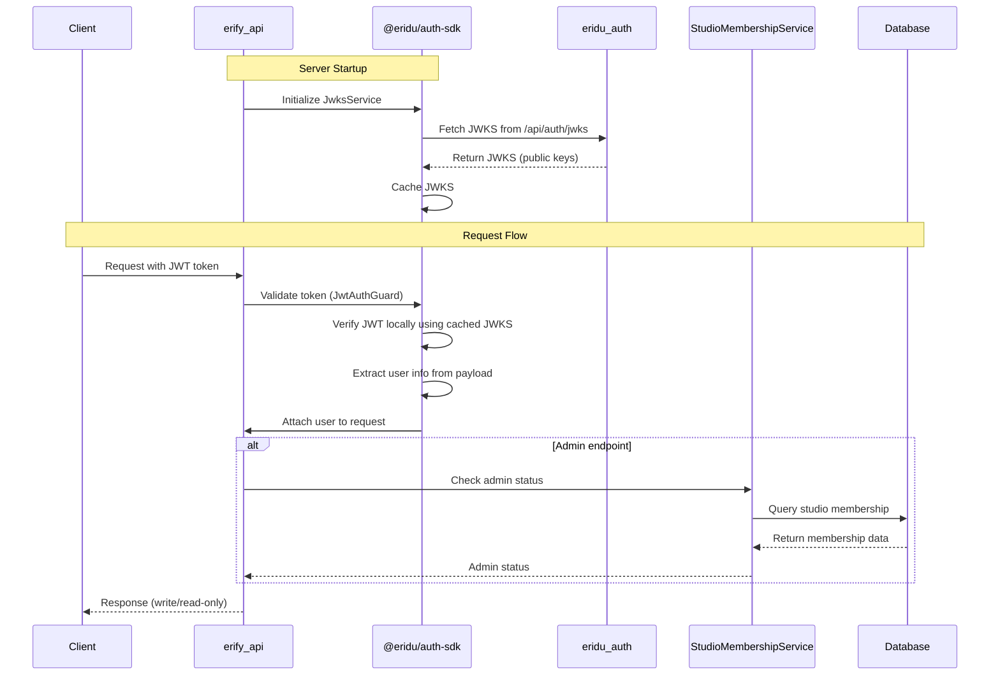

# Authentication & Authorization Guide

## Overview

This guide provides comprehensive documentation for authentication and authorization in the erify_api service. The system uses a hybrid approach combining JWT validation for user identification (via `@eridu/auth-sdk` SDK) and a simple StudioMembership model for admin verification.

**For SDK implementation details, see**: [Auth SDK README](../../../packages/auth-sdk/README.md)

### Hybrid Approach Rationale

- **JWT Validation**: Extract user information from `eridu_auth` service tokens using the `@eridu/auth-sdk` SDK
- **Simple Authorization**: Use StudioMembership model to distinguish admin vs non-admin users
- **Admin Write, Non-Admin Read-Only**: Clear access pattern without complex role hierarchies
- **Backdoor API Key**: Service-to-service authentication for privileged operations (user creation, updates, membership management) via separate `/backdoor/*` endpoints
- **Deferred Complexity**: Advanced authorization (Client/Platform memberships, complex roles, permissions) moved to Phase 3

## Architecture



## High-Level Working Mechanics

### 1. JWT Validation (SDK)

The `@eridu/auth-sdk` SDK handles all JWT validation:

- **JWKS Fetching**: SDK fetches JSON Web Key Sets from `eridu_auth` service on startup
- **Local Verification**: Tokens are verified locally using cached public keys (no network call per request)
- **User Extraction**: User information is extracted from JWT payload and attached to requests
- **Automatic Key Rotation**: SDK automatically refreshes JWKS when unknown key IDs are detected

**For detailed implementation, see**: [Auth SDK README](../../../packages/auth-sdk/README.md)

### 2. Authorization (Service-Specific)

erify_api implements authorization using the StudioMembership model:

- **Admin Check**: `AdminGuard` checks if user has admin role in ANY studio
- **Read-Only Access**: Non-admin users can only read data
- **Write Access**: Admin users can perform CRUD operations

### 3. Service-to-Service Authentication

Backdoor endpoints use API key authentication for privileged operations:

- **API Key Guards**: `BackdoorApiKeyGuard` validates service-to-service requests
- **Separate Endpoints**: `/backdoor/*` endpoints are separate from `/admin/*` endpoints
- **Use Cases**: User creation, updates, membership management, JWKS refresh

**For detailed API key configuration, see**: [Server-to-Server Authentication Guide](./SERVER_TO_SERVER_AUTH.md)

## Environment Configuration

**Reference**: `src/config/env.schema.ts`

Required environment variables:

- `ERIDU_AUTH_URL`: Base URL of the eridu_auth service (e.g., `http://localhost:3000` or `https://auth.example.com`)
- `BACKDOOR_API_KEY`: (Optional) API key for backdoor operations
- `BACKDOOR_ALLOWED_IPS`: (Optional) Comma-separated IP addresses for IP whitelisting (future enhancement)

**Note**: JWT validation uses the `@eridu/auth-sdk` SDK which fetches JWKS directly from Better Auth's `/api/auth/jwks` endpoint. No shared secret is required - uses asymmetric key cryptography (EdDSA/Ed25519). The SDK automatically handles cache recovery (refetches JWKS if cache is missing), making it seamless for edge/worker runtimes without requiring any configuration.

## Global Guards Configuration

Both `JwtAuthGuard` and `AdminGuard` are registered as **global guards** in `app.module.ts` using `APP_GUARD`. This means:

- **All endpoints are protected by default** - JWT authentication is required unless explicitly opted out
- **Admin authorization is opt-in** - Use `@AdminProtected()` decorator to require admin access
- **Public endpoints** - Use `@Public()` decorator to skip authentication

### Guard Execution Flow

1. **JwtAuthGuard** (Global):
   - Runs on all endpoints by default
   - Checks for `@Public()` decorator - if present, skips authentication
   - Checks for `@Backdoor()` decorator - if present, skips authentication (backdoor endpoints use API key auth)
   - Checks for `@GoogleSheets()` decorator - if present, skips authentication (Google Sheets endpoints use API key auth)
   - Validates JWT token and populates `request.user`
   - Extracts user information and maps `user.id` to `ext_id` for database lookups

2. **BackdoorApiKeyGuard** (Global, Opt-in):
   - Registered as global guard but only runs when `@Backdoor()` decorator is present
   - Validates `X-API-Key` header against `BACKDOOR_API_KEY` environment variable
   - Attaches service context to `request.service` with `serviceName: 'backdoor'`
   - Skips validation if API key not configured in development mode

3. **GoogleSheetsApiKeyGuard** (Global, Opt-in):
   - Registered as global guard but only runs when `@GoogleSheets()` decorator is present
   - Validates `X-API-Key` header against `GOOGLE_SHEETS_API_KEY` environment variable
   - Attaches service context to `request.service` with `serviceName: 'google-sheets'`
   - Skips validation if API key not configured in development mode

4. **AdminGuard** (Global, Opt-in):
   - Runs on all endpoints by default
   - Checks for `@AdminProtected()` decorator - if present, enforces admin authorization
   - If decorator not present, allows access (returns `true`)
   - Verifies user has admin role in ANY studio via `StudioMembershipService`

## Controller Protection Patterns

### Admin Endpoints (Write Operations)

**Using `@AdminProtected()` Decorator:**

```typescript
import { AdminProtected } from '@/lib/decorators/admin-protected.decorator';

@Controller('admin/users')
@AdminProtected() // Requires authenticated admin user
export class AdminUserController {
  // All endpoints require admin access
}
```

**Or on individual routes:**

```typescript
@Post()
@AdminProtected()  // Only this endpoint requires admin access
async createUser(@Body() body: CreateUserDto) {
  // Only authenticated admin users can access
}
```

**Note**: Since guards are global, you don't need to use `@UseGuards()` - just use the decorators.

### User-Scoped Endpoints (All Authenticated Users)

**No decorator needed** - JWT authentication is automatic:

```typescript
@Controller('me/shows')
export class ShowsController {
  @Get()
  async getShows(@CurrentUser() user: AuthenticatedUser) {
    // JWT authentication is automatic (global guard)
    // No admin check needed - all authenticated users can access
  }
}
```

### Public Endpoints (No Authentication)

**Using `@Public()` Decorator:**

```typescript
import { Public } from '@/lib/decorators/public.decorator';

@Public() // Skip authentication
@Controller('health')
export class HealthController {
  @Get()
  liveness() {
    return { status: 'ok' };
  }
}
```

### Service-to-Service Authentication (Backdoor Endpoints)

**Using API Key Guards:**

```typescript
import { BaseBackdoorController } from '@/backdoor/base-backdoor.controller';
import { BackdoorApiKeyGuard } from '@/lib/guards/backdoor-api-key.guard';

@Controller('backdoor/users')
@UseGuards(BackdoorApiKeyGuard) // API key authentication
export class BackdoorUserController extends BaseBackdoorController {
  // Service-to-service operations
  // BaseBackdoorController uses @Backdoor() decorator to skip JWT authentication
}
```

**Note**: Backdoor controllers extend `BaseBackdoorController` which uses the `@Backdoor()` decorator. This decorator tells `JwtAuthGuard` to skip JWT authentication, allowing these endpoints to use API key authentication instead.

**Protected Endpoints with Backdoor API Key**:

- `POST /backdoor/users` - Create user (API key required)
- `PATCH /backdoor/users/:id` - Update user (API key required)
- `POST /backdoor/studio-memberships` - Create studio membership (API key required)
- `POST /backdoor/auth/jwks/refresh` - Refresh JWKS (API key required)

## Available Decorators

### `@Public()`

- **Purpose**: Skip JWT authentication for public endpoints
- **Usage**: Apply to controller or method level
- **Example**: Health check endpoints, public API documentation

### `@AdminProtected()`

- **Purpose**: Require admin authorization (in addition to JWT authentication)
- **Usage**: Apply to admin controllers or methods
- **Behavior**: AdminGuard checks if user has admin role in ANY studio
- **Example**: Admin CRUD endpoints

### `@Backdoor()`

- **Purpose**: Skip JWT authentication for backdoor endpoints (use API key auth instead)
- **Usage**: Apply to backdoor controllers (typically via `BaseBackdoorController`)
- **Behavior**: Tells `JwtAuthGuard` to skip JWT validation, allowing API key authentication
- **Example**: Backdoor service-to-service endpoints

### `@CurrentUser()`

- **Purpose**: Extract authenticated user from request (provided by SDK)
- **Usage**: Method parameter decorator
- **Returns**: `AuthenticatedUser` object with `ext_id`, `id`, `name`, `email`, `image`, `payload`
- **Example**: Access user information in controller methods

**Note**: `@CurrentUser()` is provided by `@eridu/auth-sdk/adapters/nestjs/current-user.decorator`

## Module Registration

**Reference**: `src/app.module.ts` and `src/lib/auth/auth.module.ts`

### Global Guards Registration

Five guards are registered as **global guards** in `app.module.ts`:

```typescript
@Module({
  providers: [
    {
      provide: APP_GUARD,
      useClass: ThrottlerGuard, // Rate limiting
    },
    {
      provide: APP_GUARD,
      useClass: JwtAuthGuard, // Global JWT authentication
    },
    {
      provide: APP_GUARD,
      useClass: BackdoorApiKeyGuard, // API key auth for backdoor endpoints (opt-in via @Backdoor())
    },
    {
      provide: APP_GUARD,
      useClass: GoogleSheetsApiKeyGuard, // API key auth for Google Sheets endpoints (opt-in via @GoogleSheets())
    },
    {
      provide: APP_GUARD,
      useClass: AdminGuard, // Global admin authorization (opt-in via @AdminProtected())
    },
    // ... other providers
  ],
})
export class AppModule {}
```

**Guard Execution Order**:

1. `ThrottlerGuard` - Rate limiting (applies to all requests)
2. `JwtAuthGuard` - JWT validation (skips if `@Public()`, `@Backdoor()`, or `@GoogleSheets()`)
3. `BackdoorApiKeyGuard` - API key validation (only runs if `@Backdoor()` decorator present)
4. `GoogleSheetsApiKeyGuard` - API key validation (only runs if `@GoogleSheets()` decorator present)
5. `AdminGuard` - Admin authorization (only runs if `@AdminProtected()` decorator present)

**Note**: API key guards (`BackdoorApiKeyGuard` and `GoogleSheetsApiKeyGuard`) are global but use decorator-based opt-in. They only validate API keys when the corresponding decorator (`@Backdoor()` or `@GoogleSheets()`) is present on the controller or route. The `JwtAuthGuard` also checks for these decorators and skips JWT validation when they are present, allowing API key authentication to take precedence.

### Auth Module

The SDK's `JwksService`, `JwtVerifier`, and `JwtAuthGuard` are registered in the AuthModule and exported for app-wide availability. The Admin guard and Backdoor API key guard remain service-specific.

**For detailed module setup, see**: [Auth SDK README - NestJS Adapter](../../../packages/auth-sdk/README.md#3-nestjs-adapter)

## Database Schema

### StudioMembership Model (Phase 1 Scope)

```prisma
model StudioMembership {
  id        BigInt    @id @default(autoincrement())
  uid       String    @unique
  userId    BigInt    @map("user_id")
  studioId  BigInt    @map("studio_id")
  role      String    // "admin", "manager", "member"
  metadata  Json      @default("{}")
  user      User      @relation(fields: [userId], references: [id])
  studio    Studio    @relation(fields: [studioId], references: [id])
  createdAt DateTime  @default(now()) @map("created_at")
  updatedAt DateTime  @updatedAt @map("updated_at")
  deletedAt DateTime? @map("deleted_at")

  @@unique([userId, studioId])
  @@index([uid])
  @@index([userId])
  @@index([studioId])
  @@index([role])
  @@index([userId, role])
  @@map("studio_memberships")
}
```

**Phase 1 Implementation:**

- Studio-specific memberships only
- Direct foreign key relationship (easier for Prisma)
- Simple role system (admin, manager, member)
- Clean indexes for efficient queries

**Phase 3 Enhancements:**

- Separate ClientMembership and PlatformMembership models
- Role hierarchy (admin > manager > member)
- Context-specific permissions
- Permission metadata

## Service-Specific Components

### Admin Guard

**Reference**: `src/lib/guards/admin.guard.ts` ✅ (Implemented)

**Functionality:**

- Registered as global guard in `app.module.ts`
- Checks for `@AdminProtected()` decorator - only enforces admin check if present
- Verifies user has admin studio membership in ANY studio via `StudioMembershipService.findAdminMembershipByExtId()`
- Throws `UnauthorizedException` if user is not authenticated
- Throws `ForbiddenException` if user is not admin
- Uses `ext_id` from authenticated user for database lookup

**Behavior:**

- If `@AdminProtected()` decorator is present: Enforces admin authorization
- If decorator not present: Allows access (returns `true`) - useful for user-scoped endpoints

**Status**: ✅ Implemented and registered as global guard

### StudioMembership Service

**Reference**: `src/models/membership/studio-membership.service.ts`

**Key Methods:**

- `findAdminMembershipByExtId(extId: string)`: Finds admin studio membership by user's ext_id (used by AdminGuard)
- `isUserAdmin(userId: UserId)`: Checks if user has admin role in ANY studio (Phase 1 simple check)
- `getUserStudioMemberships(userId: UserId)`: Gets user's studio memberships

### JWKS Management Endpoints

**Admin JWKS Controller**: `src/admin/auth/admin-auth.controller.ts` (Pending Implementation)

- Would be protected with `@AdminProtected()` decorator (global guards handle authentication)
- Uses `JwksService` from `@eridu/auth-sdk/server/jwks`
- Endpoints: `GET /admin/jwks/status`, `POST /admin/jwks/refresh`

**Backdoor JWKS Controller**: `src/backdoor/auth/backdoor-auth.controller.ts` ✅ (Implemented)

- Protected with `BackdoorApiKeyGuard` (service-to-service authentication)
- Uses `JwksService` from `@eridu/auth-sdk/server/jwks`
- Endpoint: `POST /backdoor/auth/jwks/refresh`

## Testing Strategy

**Reference**: Test files in `src/lib/guards/` and `src/admin/` directories

### Unit Tests

- Test `AdminGuard` with mocked `StudioMembershipService`
- Verify admin users are allowed access
- Verify non-admin users are denied access

### Integration Tests

- Test complete authentication flow with JWT tokens
- Verify admin can create users
- Verify non-admin cannot create users
- Test backdoor API key authentication

## Error Handling

### Authentication Errors

- `UnauthorizedException`: No token provided, invalid token, token expired (from SDK)
- `ForbiddenException`: Admin access required, user not authenticated (from AdminGuard)

### Error Response Format

Standard NestJS error response with statusCode, message, error, timestamp, and path.

## Security Considerations

### Admin Verification

- Admin status is checked on every write operation
- StudioMembership lookup is cached for performance
- Admin status changes require re-authentication

### API Key Security

- Service-to-service communication uses API keys
- API keys are stored in environment variables
- Keys are validated on every internal request

**For JWT/JWKS security details, see**: [Auth SDK README - Security Considerations](../../../packages/auth-sdk/README.md#security-considerations)

## Future Enhancements (Phase 3)

### Advanced Authorization

- Separate ClientMembership and PlatformMembership models
- Role hierarchy with permission inheritance
- Context-specific permissions (studio admin ≠ client admin)
- Permission metadata for custom access control

### Enhanced Security

- Token refresh mechanisms
- Multi-factor authentication
- Audit trails for all authorization decisions
- Rate limiting per user/role

## Troubleshooting

### Common Issues

1. **Admin Access Denied**
   - Verify user has admin studio membership in database
   - Check StudioMembership.role = 'admin'
   - Ensure StudioMembership.deletedAt is null

2. **Service-to-Service Auth Failed**
   - Verify BACKDOOR_API_KEY matches (if using backdoor endpoints)
   - Check x-api-key header is present
   - Ensure API key is not expired

**For JWT/JWKS troubleshooting, see**: [Auth SDK README - Troubleshooting](../../../packages/auth-sdk/README.md#troubleshooting)

### Debugging Tools

In development environment, log user information and admin status for debugging purposes. Check `request.user` (attached by SDK's `JwtAuthGuard`) and call `studioMembershipService.isUserAdmin()` to verify admin status.

## Implementation Strategy

### SDK Package Approach

**Strategy**: JWT/JWKS functionality is implemented in the `@eridu/auth-sdk` SDK package, then used in `erify_api`.

**Rationale**:

1. **Clear Design**: SDK structure and API are already well-designed
2. **Clean Separation**: Framework-agnostic core vs framework-specific adapters
3. **Reusable**: Can be used by other services immediately
4. **Better Testing**: SDK can be tested independently
5. **No Refactoring**: Avoids future extraction work
6. **Professional Structure**: Follows monorepo best practices

### Implementation Components

**SDK Package** (`packages/auth-sdk/`):

- `JwksService` - Fetch and cache JWKS from Better Auth's JWKS endpoint
- `JwtVerifier` - Local JWT verification using cached public keys
- `JwtAuthGuard` - NestJS adapter for easy integration

**erify_api Integration** (`apps/erify_api/src/common/`):

- `AdminGuard` - Service-specific guard (depends on StudioMembership)
- JWKS management endpoints - Framework-specific endpoints using SDK services

### Module Registration

The SDK's `JwksService`, `JwtVerifier`, and `JwtAuthGuard` are registered in the AuthModule and exported for app-wide availability. The Admin guard and Backdoor API key guard remain service-specific.

**For detailed module setup and implementation, see**: [Auth SDK README - NestJS Adapter](../../../packages/auth-sdk/README.md#3-nestjs-adapter)

## Related Documentation

- **[Server-to-Server Authentication Guide](./SERVER_TO_SERVER_AUTH.md)** - API key guard usage for service-to-service communication
- **[Auth SDK README](../../../packages/auth-sdk/README.md)** - Complete SDK documentation and API reference
- **[Phase 1 Roadmap](./roadmap/PHASE_1.md)** - Implementation roadmap
- **[Architecture Overview](./ARCHITECTURE.md)** - System architecture
