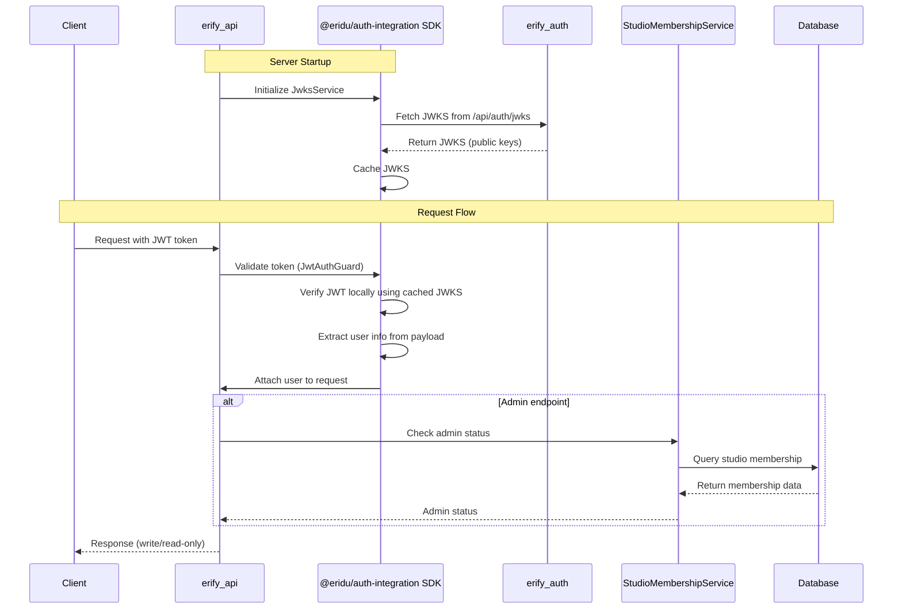

# Authentication & Authorization Guide

## Overview

This guide provides comprehensive documentation for authentication and authorization in the erify_api service. The system uses a hybrid approach combining JWT validation for user identification (via `@eridu/auth-integration` SDK) and a simple StudioMembership model for admin verification.

**For SDK implementation details, see**: [Auth Integration SDK README](../../../packages/auth-integration/README.md)

### Hybrid Approach Rationale

- **JWT Validation**: Extract user information from `erify_auth` service tokens using the `@eridu/auth-integration` SDK
- **Simple Authorization**: Use StudioMembership model to distinguish admin vs non-admin users
- **Admin Write, Non-Admin Read-Only**: Clear access pattern without complex role hierarchies
- **Backdoor API Key**: Service-to-service authentication for privileged operations (user creation, updates, membership management) via separate `/backdoor/*` endpoints
- **Deferred Complexity**: Advanced authorization (Client/Platform memberships, complex roles, permissions) moved to Phase 3

## Architecture



## High-Level Working Mechanics

### 1. JWT Validation (SDK)

The `@eridu/auth-integration` SDK handles all JWT validation:

- **JWKS Fetching**: SDK fetches JSON Web Key Sets from `erify_auth` service on startup
- **Local Verification**: Tokens are verified locally using cached public keys (no network call per request)
- **User Extraction**: User information is extracted from JWT payload and attached to requests
- **Automatic Key Rotation**: SDK automatically refreshes JWKS when unknown key IDs are detected

**For detailed implementation, see**: [Auth Integration SDK README](../../../packages/auth-integration/README.md)

### 2. Authorization (Service-Specific)

erify_api implements authorization using the StudioMembership model:

- **Admin Check**: `AdminGuard` checks if user has admin role in ANY studio
- **Read-Only Access**: Non-admin users can only read data
- **Write Access**: Admin users can perform CRUD operations

### 3. Service-to-Service Authentication

Backdoor endpoints use API key authentication for privileged operations:

- **API Key Guards**: `BackdoorApiKeyGuard` validates service-to-service requests
- **Separate Endpoints**: `/backdoor/*` endpoints are separate from `/admin/*` endpoints
- **Use Cases**: User creation, updates, membership management, JWKS refresh

**For detailed API key configuration, see**: [Server-to-Server Authentication Guide](./SERVER_TO_SERVER_AUTH.md)

## Environment Configuration

**Reference**: `src/config/env.schema.ts`

Required environment variables:
- `ERIFY_AUTH_URL`: Base URL of the erify_auth service (e.g., `http://localhost:3000` or `https://auth.example.com`)
- `BACKDOOR_API_KEY`: (Optional) API key for backdoor operations
- `BACKDOOR_ALLOWED_IPS`: (Optional) Comma-separated IP addresses for IP whitelisting (future enhancement)
- `EDGE_RUNTIME`: (Optional) Set to `true` if running on edge service or worker where caching isn't possible (defaults to `false`)

**Note**: JWT validation uses the `@eridu/auth-integration` SDK which fetches JWKS directly from Better Auth's `/api/auth/jwks` endpoint. No shared secret is required - uses asymmetric key cryptography (EdDSA/Ed25519).

## Controller Protection Patterns

### Admin Endpoints (Write Operations)

**Option 1: JWT + Admin Guard (User-based authentication)**
- Use `@UseGuards(JwtAuthGuard, AdminGuard)` on endpoints
- `JwtAuthGuard` is provided by `@eridu/auth-integration/adapters/nestjs`
- `AdminGuard` is service-specific (depends on StudioMembership)
- Only admin users can access these endpoints

**Option 2: Backdoor API Key (Service-to-service authentication)**
- Use `@UseGuards(BackdoorApiKeyGuard)` at controller level
- Used for service-to-service privileged operations

**Protected Endpoints with Backdoor API Key**:
- `POST /backdoor/users` - Create user (API key required)
- `PATCH /backdoor/users/:id` - Update user (API key required)
- `POST /backdoor/studio-memberships` - Create studio membership (API key required)
- `POST /backdoor/jwks/refresh` - Refresh JWKS (API key required)

### Read-Only Endpoints (All Authenticated Users)

- Use `@UseGuards(JwtAuthGuard)` on endpoints
- All authenticated users can access these endpoints

## Module Registration

**Reference**: `src/common/common.module.ts`

The SDK's `JwksService`, `JwtVerifier`, and `JwtAuthGuard` are registered in the CommonModule (marked as `@Global()` for app-wide availability). The Admin guard and Backdoor API key guard remain service-specific.

**For detailed module setup, see**: [Auth Integration SDK README - NestJS Adapter](../../../packages/auth-integration/README.md#3-nestjs-adapter)

## Database Schema

### StudioMembership Model (Phase 1 Scope)

```prisma
model StudioMembership {
  id        BigInt    @id @default(autoincrement())
  uid       String    @unique
  userId    BigInt    @map("user_id")
  studioId  BigInt    @map("studio_id")
  role      String    // "admin", "manager", "member"
  metadata  Json      @default("{}")
  user      User      @relation(fields: [userId], references: [id])
  studio    Studio    @relation(fields: [studioId], references: [id])
  createdAt DateTime  @default(now()) @map("created_at")
  updatedAt DateTime  @updatedAt @map("updated_at")
  deletedAt DateTime? @map("deleted_at")

  @@unique([userId, studioId])
  @@index([uid])
  @@index([userId])
  @@index([studioId])
  @@index([role])
  @@index([userId, role])
  @@map("studio_memberships")
}
```

**Phase 1 Implementation:**
- Studio-specific memberships only
- Direct foreign key relationship (easier for Prisma)
- Simple role system (admin, manager, member)
- Clean indexes for efficient queries

**Phase 3 Enhancements:**
- Separate ClientMembership and PlatformMembership models
- Role hierarchy (admin > manager > member)
- Context-specific permissions
- Permission metadata

## Service-Specific Components

### Admin Guard

**Reference**: `src/common/guards/admin.guard.ts`

**Functionality:**
- Checks if user has admin studio membership in ANY studio
- Throws `ForbiddenException` if user is not authenticated or not admin
- Used in combination with `JwtAuthGuard` for write operations

### StudioMembership Service

**Reference**: `src/studio-membership/studio-membership.service.ts`

**Key Methods:**
- `isUserAdmin(userId: string)`: Checks if user has admin role in ANY studio (Phase 1 simple check)
- `getUserStudioMemberships(userId: string)`: Gets user's studio memberships

### JWKS Management Endpoints

**Admin JWKS Controller**: `src/admin/jwks/admin-jwks.controller.ts`
- Protected with `JwtAuthGuard` (from SDK) and `AdminGuard`
- Uses `JwksService` from `@eridu/auth-integration/server/jwks`
- Endpoints: `GET /admin/jwks/status`, `POST /admin/jwks/refresh`

**Backdoor JWKS Controller**: `src/backdoor/jwks/backdoor-jwks.controller.ts`
- Protected with `BackdoorApiKeyGuard`
- Uses `JwksService` from `@eridu/auth-integration/server/jwks`
- Endpoint: `POST /backdoor/jwks/refresh`

## Testing Strategy

**Reference**: Test files in `src/common/guards/` and `src/admin/` directories

### Unit Tests
- Test `AdminGuard` with mocked `StudioMembershipService`
- Verify admin users are allowed access
- Verify non-admin users are denied access

### Integration Tests
- Test complete authentication flow with JWT tokens
- Verify admin can create users
- Verify non-admin cannot create users
- Test backdoor API key authentication

## Error Handling

### Authentication Errors
- `UnauthorizedException`: No token provided, invalid token, token expired (from SDK)
- `ForbiddenException`: Admin access required, user not authenticated (from AdminGuard)

### Error Response Format
Standard NestJS error response with statusCode, message, error, timestamp, and path.

## Security Considerations

### Admin Verification
- Admin status is checked on every write operation
- StudioMembership lookup is cached for performance
- Admin status changes require re-authentication

### API Key Security
- Service-to-service communication uses API keys
- API keys are stored in environment variables
- Keys are validated on every internal request

**For JWT/JWKS security details, see**: [Auth Integration SDK README - Security Considerations](../../../packages/auth-integration/README.md#security-considerations)

## Future Enhancements (Phase 3)

### Advanced Authorization
- Separate ClientMembership and PlatformMembership models
- Role hierarchy with permission inheritance
- Context-specific permissions (studio admin ≠ client admin)
- Permission metadata for custom access control

### Enhanced Security
- Token refresh mechanisms
- Multi-factor authentication
- Audit trails for all authorization decisions
- Rate limiting per user/role

## Troubleshooting

### Common Issues

1. **Admin Access Denied**
   - Verify user has admin studio membership in database
   - Check StudioMembership.role = 'admin'
   - Ensure StudioMembership.deletedAt is null

2. **Service-to-Service Auth Failed**
   - Verify BACKDOOR_API_KEY matches (if using backdoor endpoints)
   - Check x-api-key header is present
   - Ensure API key is not expired

**For JWT/JWKS troubleshooting, see**: [Auth Integration SDK README - Troubleshooting](../../../packages/auth-integration/README.md#troubleshooting)

### Debugging Tools

In development environment, log user information and admin status for debugging purposes. Check `request.user` (attached by SDK's `JwtAuthGuard`) and call `studioMembershipService.isUserAdmin()` to verify admin status.

## Implementation Strategy

### SDK Package Approach

**Strategy**: JWT/JWKS functionality is implemented in the `@eridu/auth-integration` SDK package, then used in `erify_api`.

**Rationale**:
1. **Clear Design**: SDK structure and API are already well-designed
2. **Clean Separation**: Framework-agnostic core vs framework-specific adapters
3. **Reusable**: Can be used by other services immediately
4. **Better Testing**: SDK can be tested independently
5. **No Refactoring**: Avoids future extraction work
6. **Professional Structure**: Follows monorepo best practices

### Implementation Components

**SDK Package** (`packages/auth-integration/`):
- `JwksService` - Fetch and cache JWKS from Better Auth's JWKS endpoint
- `JwtVerifier` - Local JWT verification using cached public keys
- `JwtAuthGuard` - NestJS adapter for easy integration

**erify_api Integration** (`apps/erify_api/src/common/`):
- `AdminGuard` - Service-specific guard (depends on StudioMembership)
- JWKS management endpoints - Framework-specific endpoints using SDK services

### Module Registration

The SDK's `JwksService`, `JwtVerifier`, and `JwtAuthGuard` are registered in the CommonModule (marked as `@Global()` for app-wide availability). The Admin guard and Backdoor API key guard remain service-specific.

**For detailed module setup and implementation, see**: [Auth Integration SDK README - NestJS Adapter](../../../packages/auth-integration/README.md#3-nestjs-adapter)

## Related Documentation

- **[Server-to-Server Authentication Guide](./SERVER_TO_SERVER_AUTH.md)** - API key guard usage for service-to-service communication
- **[Auth Integration SDK README](../../../packages/auth-integration/README.md)** - Complete SDK documentation and API reference
- **[Phase 1 Roadmap](./roadmap/PHASE_1.md)** - Implementation roadmap
- **[Architecture Overview](./ARCHITECTURE.md)** - System architecture
