# Business Domain Documentation

This document provides comprehensive business domain information for the Eridu Services API. For development roadmap and implementation phases, see the [Core Production Management System](./roadmap/PHASE_1.md) documentation.

## Development Approach

The system is being developed in structured phases:

- **Phase 1**: Core Functions with Better Auth + Local Authorization - Essential CRUD operations, basic show management, Better Auth integration, and local authorization
- **Phase 2**: Scheduling & Planning Workflow - Collaborative planning and multi-version scheduling
- **Phase 3**: Advanced Authorization Control & Tracking Features - Role-based access control, audit trails, task management

For detailed implementation plans, see:
- [Phase 1 Roadmap](./roadmap/PHASE_1.md)
- [Phase 2 Roadmap](./roadmap/PHASE_2.md)
- [Phase 3 Roadmap](./roadmap/PHASE_3.md)
- [Scheduling Architecture](./SCHEDULING_ARCHITECTURE.md)

# Models

## Audit

Purpose: Maintains complete audit trail of all significant system changes for compliance and debugging.

The `Audits` table tracks all CRUD operations performed by users, storing both old and new values for complete change history. This enables rollback capabilities, compliance reporting, and debugging of data issues.

Key Models: `audits`

Relationships: Belongs to `User` (audit creator), polymorphic to any auditable entity

## Client 

Purpose: Manages external companies that book shows and their associated resources.

### Client and Show

`Clients` are external companies that book `Shows` through studio managers. Each client owns their shows and associated materials, enabling proper data isolation and billing. The relationship supports both scheduled campaigns and ad-hoc show bookings.

Key Models: `clients`, `shows`, `schedules`

Business Rules:

- Clients can only access their own shows and materials
- Studio managers can view all client shows for their studios
- Soft delete ensures data preservation for historical reporting

### Client and Material

Materials (scripts, briefs, assets) belong to specific clients and can be reused across multiple shows. This ownership model ensures intellectual property protection and enables material versioning.

Key Models: `clients`, `materials`, `show_materials`

Business Rules:

- Materials are client-scoped and cannot be shared between clients
- Version control maintains material history
- Platform-specific materials supported through metadata

### Client and User

Each client company can have multiple user accounts for their team members. Users with 'Client' role are scoped to a single client, while studio users can interact with multiple clients.

Key Models: `clients`, `users`, `memberships`

Business Rules:

- Client users can only access their company's data
- Membership roles determine permission levels within client organization

## Comment

Purpose: Enables threaded collaboration and communication across all system entities.

`Users` can leave `Comments` on various records (shows, schedules, tasks) to facilitate collaboration. Comments support threading for organized discussions and can include mentions and notifications.

Key Models: `comments`

Features:

- Polymorphic association to any commentable entity
- Self-referencing for threaded replies
- Soft delete preserves conversation history
- Metadata supports rich formatting and attachments

## Material

Purpose: Manages content assets used in show production.

**Phase 3 Feature** - Materials represent all content assets used in shows, including scripts, briefs, graphics, and platform-specific content. Each material is owned by a client and can be associated with multiple shows.

Key Models: `materials`, `show_materials`

Features:

- Type classification (brief, mechanic, script, scene, other)
- Version control with resource URLs
- Platform-specific materials through platform_id
- Active/inactive status for material lifecycle management
- Flexible metadata for custom attributes

Business Rules:

- Materials are client-scoped for data isolation
- Platform-specific materials enable targeted content delivery
- Version tracking supports content iteration

## MC

Purpose: Manages show hosts and their performance tracking.

MCs are the talent that host shows. Each MC can participate in multiple shows, with performance ratings and notes tracked per show. MC accounts can be linked to user accounts for platform access.

Key Models: `mcs`, `show_mcs`

Features:

- User account linkage for platform access
- Performance rating and review system
- Ban status for quality control
- Flexible metadata for profile information

Business Rules:

- MCs can be shared across multiple studios
- Performance tracking enables quality management
- Ban status prevents problematic MCs from future bookings

## Membership

Purpose: Implements role-based access control across all system entities.

**Phase 1**: Basic admin verification - The polymorphic `Memberships` system grants users specific roles within Studios, Clients, and Platforms. This enables basic admin verification where users can have different roles in different contexts.

**Phase 3 Enhancement**: Advanced authorization control - Polymorphic design supports any entity type, role hierarchy with increasing permissions, and metadata for custom permission attributes.

Key Models: `memberships`, `users`

Supported Roles: `admin`, `manager`, `member`

Features:

- Polymorphic design supports any entity type
- Role hierarchy with increasing permissions
- Metadata for custom permission attributes

Business Rules:

- Users can have multiple memberships with different roles
- Role hierarchy: admin > manager > member
- Context-specific permissions (studio admin ≠ client admin)

## Platform

Purpose: Manages streaming platforms and their configurations.

Platforms represent external streaming services (Twitch, YouTube, etc.) where shows are broadcast. Each platform has specific API configurations and can have dedicated team members through memberships.

Key Models: `platforms`, `show_platforms`, `memberships`

Features:

- API configuration storage for platform integration
- Material support for platform-specific content
- Team management through memberships
- Flexible metadata for platform-specific settings

Business Rules:

- Platform configurations are securely stored
- Show broadcasts tracked per platform with unique identifiers
- Platform teams can manage their specific integrations

## Schedule management

Purpose: Enables collaborative planning and resource allocation.

The scheduling system allows Clients and studio managers to collaborate on planning before committing to actual show bookings. Schedules act as containers for related shows within a campaign or time period.

Key Models: `schedules`, `shows`

Workflow:

- Draft Phase: Initial planning with draft shows
- Proposed Phase: Ready for client review
- Confirmed Phase: Approved and ready for production
- Archived/Cancelled: End-of-lifecycle states

Features:

Status-driven workflow management
Time-bound planning periods
Resource conflict detection
Bulk show confirmation

Business Rules:

Draft shows don't reserve studio resources
Confirmed schedules prevent double-booking
Status transitions are audited

## Show

Purpose: Central operational record for livestream productions.

A `Show` is the core entity representing a confirmed livestream event. It coordinates MCs, studio resources, platforms, and materials for successful production execution.

Key Models: `shows`, `show_mcs`, `show_platforms`, `show_materials`

### Show and MC

Shows can have multiple MCs with individual performance tracking. The `ShowMCs` join table stores ratings and notes for each MC's performance on specific shows.

Features:

- Multi-MC support for complex shows
- Performance rating system (numerical scale)
- Show-specific notes and feedback
- Historical performance tracking

### Show and Platform

Shows can broadcast simultaneously across multiple platforms. Each `ShowPlatform` record represents a unique broadcast instance with platform-specific metadata.

Features:

- Multi-platform broadcasting support
- Platform-specific stream links and IDs
- Real-time viewer count tracking
- Platform-specific task generation

### Show and Material

Shows can utilize multiple materials, with optional platform targeting. Materials can be designated for specific platforms or used across all broadcast destinations.

Features:

- Multi-material support per show
- Platform-specific material assignment
- Material reuse across shows
- Version control integration

Business Rules:

- Shows require studio room and time slot reservations
- Status progression: draft → confirmed → live → completed
- Cancelled shows preserve data for analysis

## Studio

Purpose: Manages physical production facilities and their resources.

Studios represent physical locations with multiple rooms for show production. They maintain staff through memberships and can define custom operational procedures.

Key Models: `studios`, `studio_rooms`, `memberships`

Features:

- Multi-room facility management
- Staff organization through memberships
- Location-based scheduling
- Custom operational metadata

## Studio room

Studio rooms are the specific physical spaces where shows are produced. Each room has unique capabilities and availability schedules.

Features:

- Room-specific capabilities and equipment
- Availability scheduling and conflict detection
- Capacity and technical specifications
- Maintenance and booking history

Business Rules:

- Rooms cannot be double-booked
- Studio membership required for room access
- Equipment specifications stored in metadata

## Tag management

Purpose: Implements flexible categorization system across all entities.

Tags provide flexible categorization and filtering capabilities. Studio-scoped tags enable custom taxonomies while maintaining data organization.

Key Models: `tags`, `taggables`

Features:

- Studio-scoped tag namespaces
- Polymorphic taggable system
- Hierarchical tag support through metadata
- Custom tag metadata for extended attributes

Business Rules:

- Tags can be studio-specific or global (studio_id nullable)
- Polymorphic design supports tagging any entity
- Soft delete preserves tag history

## Task Management

Purpose: Ensures systematic execution of production workflows.

The task system automates workflow management by generating checklists from templates when shows are confirmed. Tasks are polymorphically linked to relevant production entities.

Key Models: `task_templates`, `task_template_items`, `tasks`

### Task

Tasks represent individual action items assigned to users for show production. They're generated from templates and linked to specific production entities (`Show`, `ShowPlatform`, `ShowMC`).

Features:

- Polymorphic linking to production entities
- Status tracking with due dates
- Assignment and reassignment capabilities
- Completion tracking with timestamps

Business Rules:

- Tasks auto-generated when shows move to CONFIRMED status
- Different task types target different production phases
- Required tasks block show progression

### Task Template

Templates define reusable checklists for consistent show production. Each template contains multiple items that become individual tasks when instantiated.

Key Models: `task_templates`, `task_template_items`

Features:

- Studio-specific template libraries
- Multiple task types (pre/during/post production)
- Various input types for data collection
- Required vs. optional task designation
- Template versioning and activation control

Task Types:

- pre_production: Setup and preparation tasks
- production: Live show execution tasks
- post_production: Cleanup and follow-up tasks
- show_mc_review: MC performance evaluation
- show_platform_review: Platform-specific analytics
- other: Custom task categories

Input Types:

- string: Text input for notes and descriptions
- number: Numeric data for metrics
- datetime: Time-based data for scheduling
- percentage: Performance and completion metrics

## User

Purpose: Manages system users and their contextual permissions.

Users are granted specific roles through `Memberships`, enabling context-specific access control. A user might be an admin for one Studio but only a member of a Client workspace.

Key Models: `users`, `memberships`, `mcs`

Features:

- External identity integration (ext_id for SSO)
- Multiple membership support
- MC profile linkage for talent accounts
- Comprehensive audit trail

User Roles:

- admin: Full system access within context
- manager: Operational management permissions
- member: Basic access and participation rights

Business Rules:

- Users can have different roles in different contexts
- MC users can access both talent and platform features
- All user actions are audited for security

```mermaid
erDiagram
    users |o--o| mcs: can_be
    clients |o--o{ materials: has_many
    clients ||--o{ shows: has_many
    clients ||--o{ schedules : has_many
    comments |o--o{ comments: has_many_replies
    platforms |o--o{ materials : has_many
    schedules }o--|| schedule_status: is
    shows |o--o{ show_mcs : hosted_by
    studios ||--o{ studio_rooms : has_many
    studios ||--o{ schedules : has_many
    studios |o--o{ tags : has_many
    studio_rooms ||--o{ shows : lives_many    
    show_mcs }o--o| mcs: hosts
    shows }o--|| show_standards: is
    shows }o--|| show_status: is
    shows }o--|| show_types: is
    shows }o--o{ show_materials: has_many
    show_materials }o--o{ materials: has_many
    materials }o--|| material_types: is 
    shows }o--o{ show_platforms: has_many
    show_platforms }o--o{ platforms: has_many
    studios |o--o{ task_templates: has_many
    tags ||--o{ taggables: has_many
    task_templates ||--o{ task_template_items: has_many
    task_template_items }o--|| task_type: is
    task_template_items }o--|| task_input_type: is
    tasks }o--|| task_status: is
    users ||--o{ comments : has_many
    users ||--o{ memberships : has_many
    users ||--o{ tasks : has_many
    users ||--o{ audits : has_many

    audits {
      int id PK
      string uid
      int user_id FK
      string action "CRUD"
      int auditable_id FK
      string auditable_type "polymorphic"
      jsonb old_values
      jsonb new_values
      jsonb metadata
      datetime created_at
    }

    clients {
      int id PK
      string uid
      string name
      string contact_person
      string contact_email
      jsonb metadata
      datetime created_at
      datetime updated_at
      datetime deleted_at
    }

    comments {
      int id PK
      string uid
      int commentable_id FK
      string commentable_type "polymorphic"
      int owner_id FK "user_id"
      int parent_id FK "self-join to reply to a comment, nullable"
      string content
      datetime created_at
      datetime updated_at
      datetime deleted_at
    }

    material_types {
      int id PK
      string uid
      string name "brief, mechanic, script, scene, other"
      jsonb metadata
      datetime created_at
      datetime updated_at
      datetime deleted_at
    }

    materials {
      int id PK
      string uid
      int client_id FK "nullable"
      int platform_id FK "nullable"
      int material_type_id FK
      string name
      string description
      url resource_url
      bool is_active
      datetime expiring_at "nullable"
      string version
      jsonb metadata
      datetime created_at
      datetime updated_at
      datetime deleted_at
    }

    mcs {
      int id PK
      string uid
      int user_id FK "nullable"
      string name
      string alias_name
      bool is_banned
      jsonb metadata
      datetime created_at
      datetime updated_at
      datetime deleted_at
    }

    memberships {
      int id PK
      string uid
      int user_id FK
      int group_id FK "client_id, platform_id, studio_id"
      string group_type "client, platform, studio"
      string role "admin, manager, member"
      jsonb metadata
      datetime created_at
      datetime updated_at
      datetime deleted_at
    }

    platforms {
      int id PK
      string uid
      string name
      jsonb api_config
      jsonb metadata
      datetime created_at
      datetime updated_at
      datetime deleted_at
    }

    schedule_status {
      int id PK
      string uid 
      string name "draft, proposed, confirmed, archived, cancelled, other"
      jsonb metadata
      datetime created_at
      datetime updated_at
      datetime deleted_at      
    }

    schedules {
      int id PK
      string uid
      int client_id FK
      int studio_id FK
      int schedule_status_id FK 
      string name
      string description
      datetime start_time
      datetime end_time
      jsonb metadata
      datetime created_at
      datetime updated_at
      datetime deleted_at
    }

    show_materials {
      int id PK
      string uid
      int show_id FK
      int material_id FK
      string note
      jsonb metadata
      datetime created_at
      datetime updated_at
      datetime deleted_at
    }

    show_mcs {
      int id PK
      string uid
      int show_id FK
      int mc_id FK
      string note
      jsonb metadata
      datetime created_at
      datetime updated_at
      datetime deleted_at
    }

    show_platforms {
      int id PK
      string uid
      int show_id FK
      int platform_id FK
      url live_stream_link
      string platform_show_id "livestream id from the hosted platform"
      int viewer_count
      jsonb metadata
      datetime created_at
      datetime updated_at
      datetime deleted_at
    }

    show_standards {
      int id PK
      string uid
      string name "standard, premium"
      jsonb metadata
      datetime created_at
      datetime updated_at
      datetime deleted_at
    }

    show_status {
      int id PK
      string uid
      string name "draft, confirmed, live, completed, cancelled"
      jsonb metadata
      datetime created_at
      datetime updated_at
      datetime deleted_at
    }

    show_types {
      int id PK
      string uid
      string name "bau, campaign, other"
      jsonb metadata
      datetime created_at
      datetime updated_at
      datetime deleted_at
    }

    shows {
      int id PK
      string uid
      int client_id FK "nullable"
      int schedule_id FK "nullable"
      int studio_room_id FK "nullable"
      int show_type_id FK
      int show_status_id FK 
      int show_standard_id FK
      string name
      datetime show_start
      datetime show_end
      datetime created_at
      datetime updated_at
      datetime deleted_at
    }

    studios {
      int id PK
      string uid
      string name
      string address
      jsonb metadata
      datetime created_at
      datetime updated_at
      datetime deleted_at
    }

    studio_rooms {
      int id PK
      string uid
      int studio_id FK
      string name
      jsonb metadata
      datetime created_at
      datetime updated_at
      datetime deleted_at
    }

    taggables {
      int id PK
      string uid
      int tag_id FK
      int taggable_id FK
      string taggable_type "polymorphic"
      datetime created_at
      datetime updated_at
      datetime deleted_at
    }

    tags {
      int id PK
      string uid
      int studio_id FK "nullable"
      string name
      jsonb metadata
      datetime created_at
      datetime updated_at
      datetime deleted_at
    }

    task_status {
      int id PK
      string uid
      string name "pending, assigned, in_progress, review, completed, blocked"
      jsonb metadata
      datetime created_at
      datetime updated_at
      datetime deleted_at
    }

    task_type {
      int id PK
      string uid
      string name "pre_production, production, post_production, show_mc_review, show_platform_review, other"
      jsonb metadata
      datetime created_at
      datetime updated_at
      datetime deleted_at
    }

    task_input_type {
      int id PK
      string uid
      string name "text, number, date, percentage, file, url"
      jsonb metadata
      datetime created_at
      datetime updated_at
      datetime deleted_at
    }

    tasks {
      int id PK
      string uid
      int assignee_id FK "FK to users"
      int taskable_id FK
      string taskable_type "polymorphic"
      int task_template_item_id FK
      int task_status_id FK
      string name
      string description
      datetime due_date
      datetime completed_at
      jsonb metadata
      datetime created_at
      datetime updated_at
      datetime deleted_at
    }

    task_templates {
      int id PK
      string uid
      int studio_id FK
      string name
      string description
      bool is_active
      jsonb metadata
      datetime created_at
      datetime updated_at
      datetime deleted_at
    }

    task_template_items {
      int id PK
      string uid
      int task_template_id FK
      int task_type_id FK
      int input_type_id FK
      bool is_required
      string name
      string description
      datetime created_at
      datetime updated_at
      datetime deleted_at
    }

    users {
      int id PK
      string uid
      string ext_id
      string email
      string name
      string role "admin, manager, user"
      bool is_banned
      jsonb metadata
      datetime created_at
      datetime updated_at
      datetime deleted_at
    }
```

