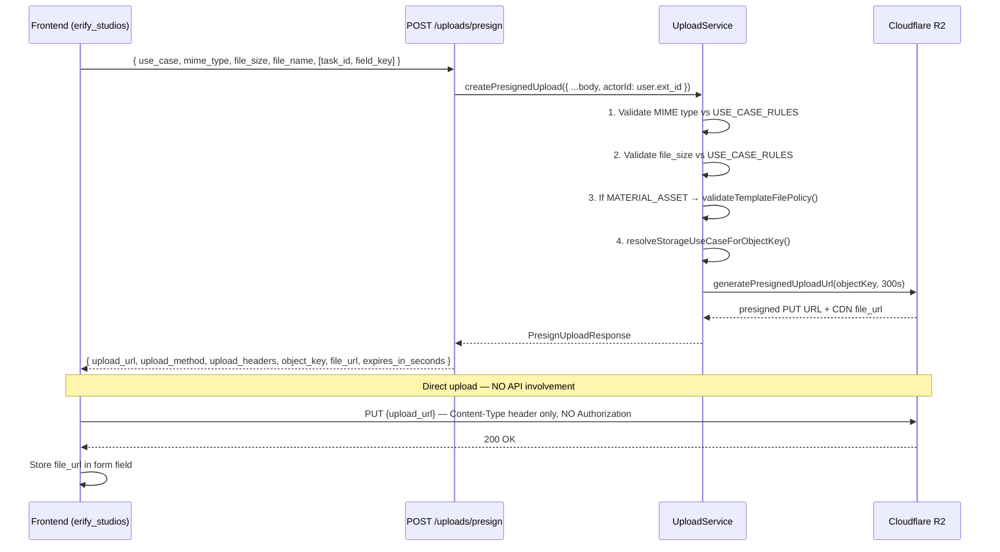
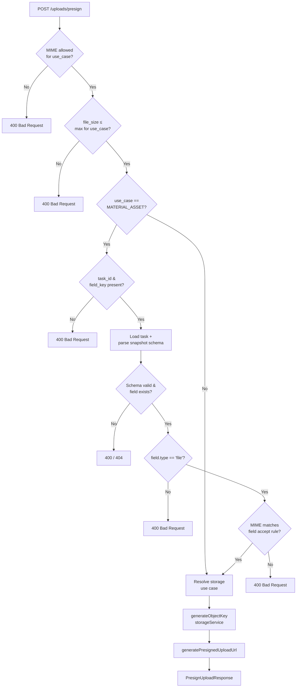
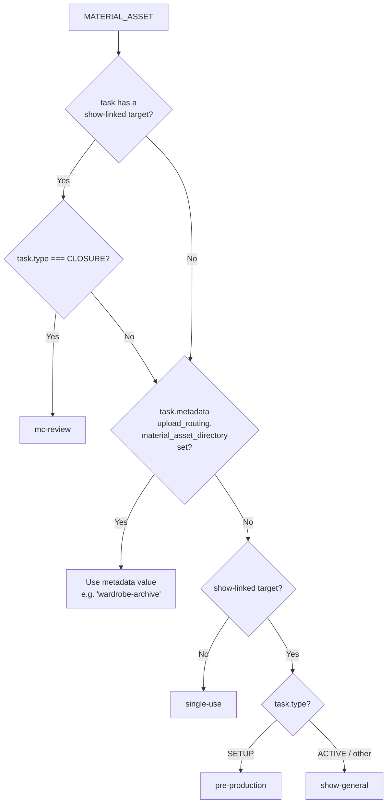

# File Upload — Presigned URL

> **Status**: ✅ Implemented (Phase 3, March 2026)

## Overview

All file uploads bypass the API server entirely. The client requests a short-lived presigned PUT URL from the API, then uploads the file directly to Cloudflare R2. This eliminates backend streaming bottlenecks and keeps upload throughput uncapped.

## Upload Flow



> **Important**: The direct R2 PUT must NOT include the API `Authorization` header. Doing so causes R2 to return 403. Frontend code uses bare `fetch()`, never `apiClient`.

## Use Cases & File Size Limits

| Use Case | Max Size | Allowed MIME Types | Notes |
|----------|:--------:|-------------------|-------|
| `QC_SCREENSHOT` | **200 KB** | `image/jpeg`, `image/png`, `image/webp` | Frontend compresses to ≤200 KB before upload |
| `SCENE_REFERENCE` | **10 MB** | `image/jpeg`, `image/png`, `image/webp`, `application/pdf` | |
| `INSTRUCTION_ASSET` | **50 MB** | `image/*`, `application/pdf`, `video/mp4` | |
| `MATERIAL_ASSET` | **50 MB** | `image/*`, `application/pdf`, `video/mp4` | Also validates against task snapshot schema |

Rules are enforced in `FILE_UPLOAD_USE_CASE_RULES` constant in [`packages/api-types/src/uploads/schemas.ts`](../../../packages/api-types/src/uploads/schemas.ts).

## Backend Validation Pipeline



## MATERIAL_ASSET Storage Routing

`MATERIAL_ASSET` uploads are routed to different R2 directories based on task context. This allows uploaded files to be organized semantically (by show, production phase, or custom template-defined buckets).



Current routing behavior:
- Show-linked `CLOSURE` tasks always resolve to `mc-review` (closure override)
- Otherwise, `upload_routing.material_asset_directory` is used when present
- Without metadata: no show-linked target → `single-use`; show-linked `SETUP` → `pre-production`; show-linked other types → `show-general`

`single-use` and `show-general` are active in storage routing. UI workflow handling for these directories remains TODO.

The metadata shape is typed as `UploadRoutingMetadata` (exported from `@eridu/api-types/uploads`). Both the producer (`TaskGenerationProcessor`) and the consumer (`UploadService.extractDirectoryFromMetadata`) use `Partial<UploadRoutingMetadata>` for typed access, eliminating stringly-typed double casts.

> TODO(upload-workflow): dedicated UI workflow handling for `pre-production` and `mc-review` directories is pending.

## Object Key Format

**Non-MATERIAL_ASSET** (via `StorageService.generateObjectKey`; not part of MATERIAL routing workflow):
```
{useCase_lower}/{actorId}/{YYYY-MM-DD}/{uuid32hex}-{safeName}

Example:
  scene_reference/ext_abc123/2026-03-03/6f2be9e1f2b94fd8b5d2d6b4186cc8a9-reference.pdf
```

`INSTRUCTION_ASSET` is a special case: it is currently mapped to `pre-production` as the storage prefix.

**MATERIAL_ASSET — show-linked** (via `buildMaterialAssetObjectKey`):
```
{storageDir}/{YYYY-MM-DD}/{showRef}-v{uploadVersion}{ext}

Example:
  pre-production/2026-03-03/show_1-v1.png
  mc-review/2026-03-03/show_wf6ac_eleklxv2n-zcqo-v1.webp
```

**MATERIAL_ASSET — no show target**:
```
{storageDir}/{YYYY-MM-DD}/{fieldKey}-v{uploadVersion}{ext}

Example:
  single-use/2026-03-03/proof_photo-v1.png
```

`actorId` = `user.ext_id` (external UID, never internal DB id). Note: MATERIAL_ASSET keys use show UID or field key as the base name — `actorId` is **not** included in MATERIAL_ASSET paths.

Normalization details for `showRef`, `fieldKey`, and `storageDir`:
- Lowercase
- Keep `a-z`, `0-9`, `_`, `-`
- Replace other characters with `-`
- Collapse duplicate `-` and trim edge `-`

`ext` comes from the uploaded file extension (or is inferred from MIME type when missing).

## Frontend Compression (erify_studios)

For `MATERIAL_ASSET` image uploads inside `JsonForm`, images are compressed client-side before the presign request:

```
File selected
    │
    ▼
Validate MIME vs field accept rule — toast error if mismatch
    │
    ▼
Is file an image/* ?
  No  ──► use file as-is
  Yes ──► maxBytes = min(item.validation.max_size ?? ∞, 200 KB)
              │
              ▼
          prepareImageForUpload(file, { targetMaxBytes, accept, preferWorker: true })
            ├─ Worker-first via native Web Worker + OffscreenCanvas
            ├─ Fallback to main-thread canvas if worker path unsupported/fails
            ├─ Main-thread decode falls back to HTMLImageElement when createImageBitmap
            │  is unavailable or rejects the Blob/File (Safari/iPhone compatibility)
            ├─ For the 200 KB screenshot path, retries from the original image at
            │  long-edge clamps [1440, 1280, 1080, 960]
            ├─ At each clamp, tries quality [0.9→0.12]
            └─ Falls back to best (smallest) attempt
              │
              ▼
          Hard check: uploadFile.size ≤ maxBytes → throws if not
    │
    ▼
requestPresignedUpload({ use_case: MATERIAL_ASSET, ... })
    │
    ▼
uploadFileToPresignedUrl(presigned, uploadFile)  ← bare fetch
    │
    ▼
form.setValue(fieldKey, presigned.file_url)
```

The 200 KB compression cap (`SCREENSHOT_MAX_BYTES` constant in `json-form.tsx`) intentionally matches the `QC_SCREENSHOT` backend limit. For screenshot-sized uploads, `JsonForm` now prefers an explicit long-edge ladder (`1440 → 1280 → 1080 → 960`) instead of a single generic clamp so tall mobile screenshots degrade in a more predictable way. The backend limit and the frontend compression target must stay in sync when changed.

## Key Files

| Layer | Path | Role |
|-------|------|------|
| API contract | `packages/api-types/src/uploads/schemas.ts` | Zod schemas, `FILE_UPLOAD_USE_CASE` enum |
| Backend service | `apps/erify_api/src/uploads/upload.service.ts` | Validation rules, routing, presign |
| Backend controller | `apps/erify_api/src/uploads/upload.controller.ts` | `POST /uploads/presign` |
| Storage abstraction | `apps/erify_api/src/lib/storage/storage.service.ts` | R2 client, key generation, presigning |
| Shared browser upload utils | `packages/browser-upload/src/index.ts` | Accept matching + worker/fallback compression |
| Compression worker | `packages/browser-upload/src/image-compress.worker.ts` | Off-main-thread image compression |
| Frontend API utils | `apps/erify_studios/src/features/tasks/api/presign-upload.ts` | `requestPresignedUpload`, `uploadFileToPresignedUrl` |
| Frontend form | `apps/erify_studios/src/components/json-form/json-form.tsx` | Image compression, flush-on-submit |
| Metadata stamp | `apps/erify_api/src/task-orchestration/task-generation-processor.service.ts` | Writes `upload_routing` metadata |
