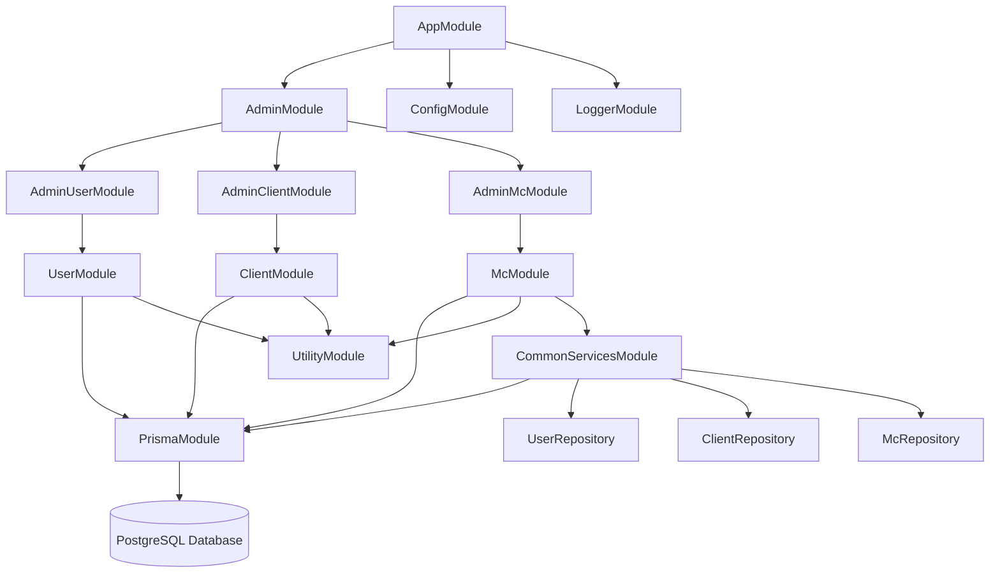
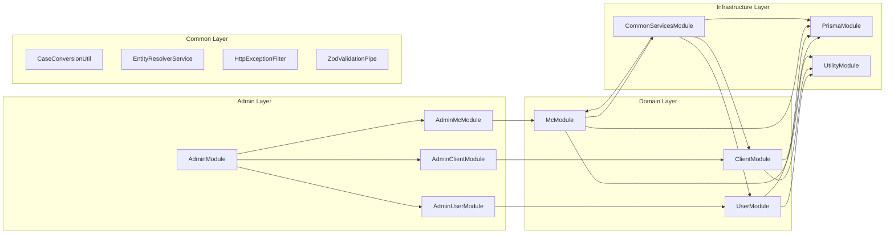
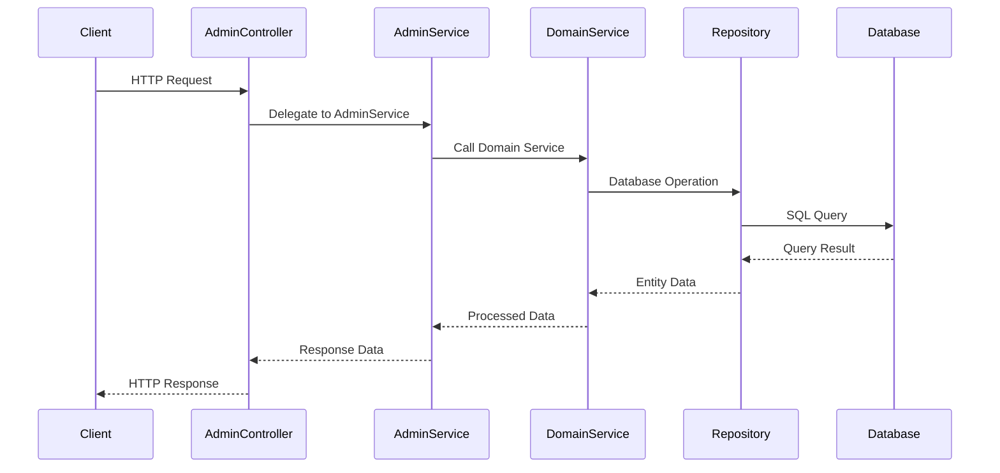
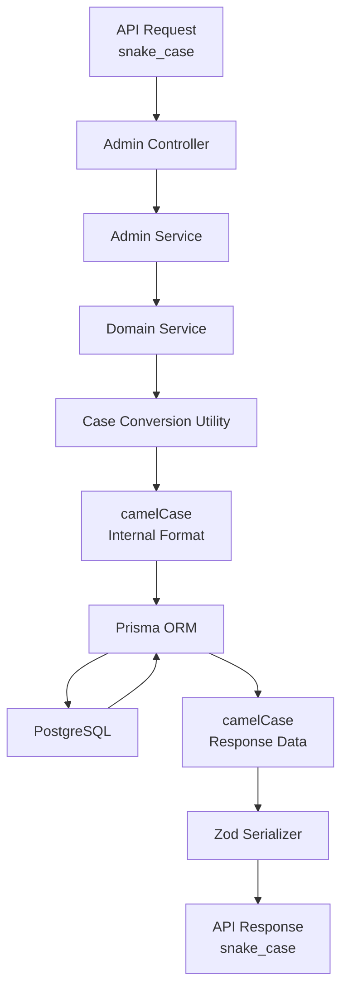
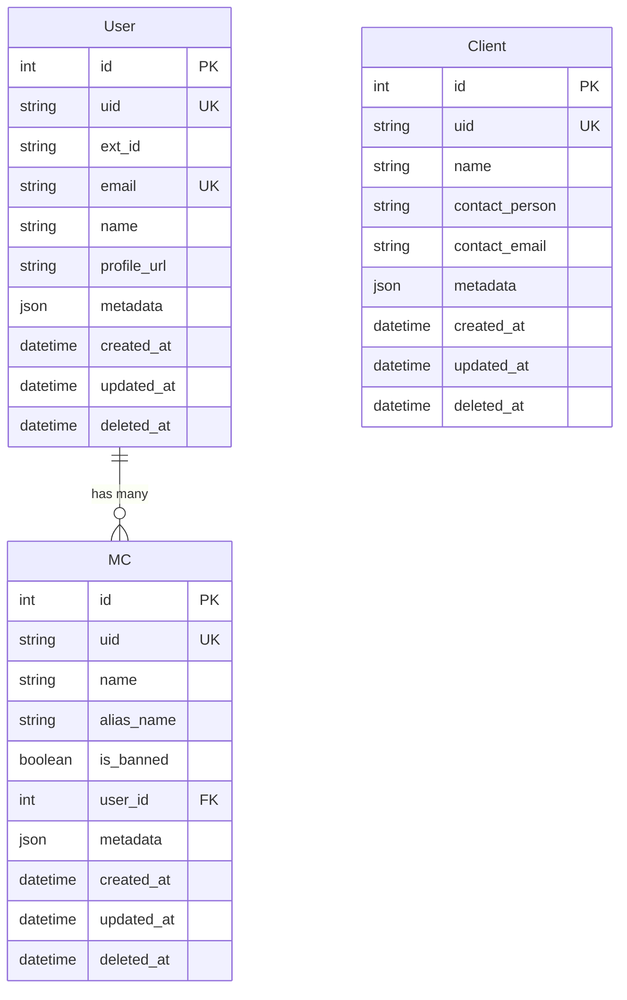
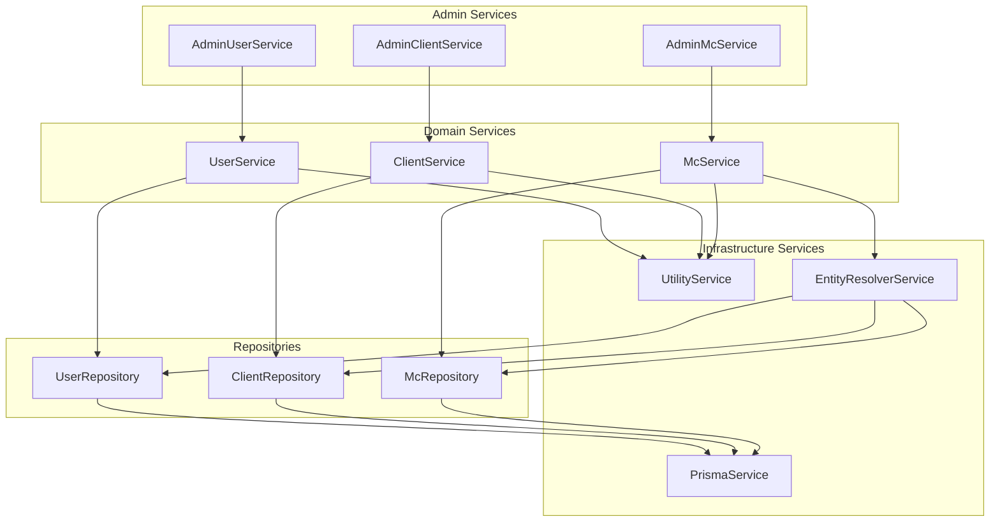
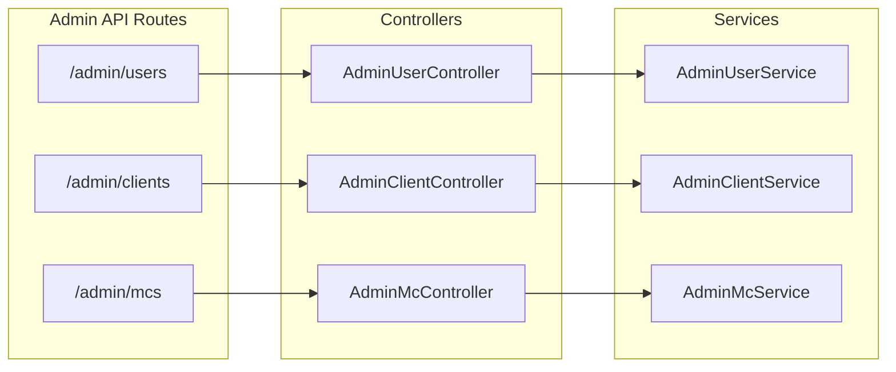

# Module Relationship Diagrams

## High-Level Architecture

## Detailed Module Dependencies

## Request Processing Flow

## Case Conversion Flow

## Entity Relationships

## Service Dependencies

## API Endpoint Structure

