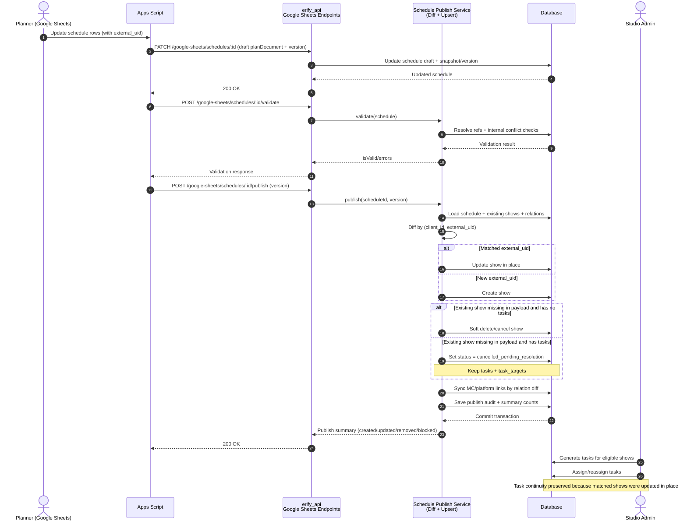
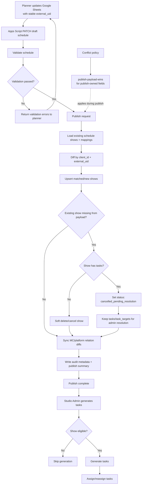

# PRD: Schedule Planning and Task Continuity

## 1. Purpose

This PRD defines the product and business requirements to make schedule updates safe for downstream task generation and assignment, while preserving the current planner workflow in Google Sheets.

This document is the source of truth for product direction before creating:

- Backend design doc (`erify_api`)
- Frontend design doc (`erify_studios`)

---

## 2. Executive Summary

The current publish flow deletes and recreates all shows in a schedule. This breaks task continuity because tasks are linked to show records.

Decision:

1. Keep Google Sheets + Apps Script workflow for planners in the current phase.
2. Keep only the existing 4 integration endpoints in active use.
3. Replace destructive publish behavior with identity-preserving `diff + upsert`.
4. Use stable Google Sheets show UID as external identity.
5. Allow mapping work (MC/platform) from both Google Sheets and web app with deterministic merge rules.

Primary objective:

- No task loss or assignment loss when schedules are updated and republished.

---

## 3. Context and Background

### 3.1 Current Operating Model

1. Planners consolidate and adjust shows in Google Sheets.
2. Apps Script calls API endpoints to create/update/validate/publish schedules.
3. Published shows are used by studio admins to generate tasks and assign members.

### 3.2 Planning Dynamics (Critical Conditions)

1. The most active planning period is typically from the 20th of the current month to the 10th of the next month.
2. Schedules and show details can still change near go-live, sometimes at T-7 days.
3. Studio room optimization and schedule balancing are ongoing in this window.
4. Task generation/assignment may already be running while schedule updates continue.

Implication:

- Schedule updates are expected operational behavior, not edge cases.

### 3.3 Why the Existing Workaround Was Used

The delete/recreate publish strategy was originally chosen because it was simple and fast to deliver at early phase.

Why it no longer works:

1. Tasks and assignments are now live.
2. Show identity churn causes downstream breakage.
3. Operational recovery cost has become higher than implementing safe sync semantics.

### 3.4 Integration Friction

Apps Script debugging and orchestration are hard for complex flows. The strategy should reduce complexity by stabilizing behavior, not by expanding endpoint surface.

---

## 4. Problem Statement

Current schedule publish behavior recreates show records, causing:

1. Loss of stable show identity.
2. Broken task-target continuity.
3. Assignment disruptions for studio managers and members.
4. Increased manual recovery effort.

The system must support frequent schedule changes without destroying operational task linkage.

---

## 5. Product Vision

Keep Google Sheets as active planner tooling now, but make backend publish safe and deterministic through stable identity + diff/upsert semantics.

This allows:

1. Minimal workflow change for planners.
2. Immediate continuity protection for tasks.
3. Incremental platform evolution without a risky process migration.

---

## 6. Scope

### 6.1 In Scope

1. Business workflow from planning -> sync -> validate -> publish -> task operations.
2. Identity model and continuity rules for shows and mappings.
3. Integration endpoint policy for Google Sheets.
4. Publish safety rules and impact handling.
5. Performance and scalability requirements at PRD level.
6. Rollout phases and acceptance criteria.

### 6.2 Out of Scope

1. Detailed DB migration scripts.
2. Endpoint payload-level API contracts.
3. FE wireframes and component specs.
4. Full operational runbooks.

---

## 7. Personas and Responsibilities

1. Planner:
   - Owns schedule/show planning, timing, room, status.
2. Mapper:
   - Owns MC mapping and may update platform mapping.
   - Can work in Google Sheets and web app.
3. Studio Admin/Manager:
   - Generates and assigns tasks, manages downstream execution.
4. Studio Member:
   - Executes assigned tasks.
5. System Admin:
   - Governance, overrides, audit visibility.

---

## 8. Goals and Non-Goals

### 8.1 Goals

1. Prevent task loss/assignment loss from schedule updates.
2. Keep planner workflow continuity in Google Sheets.
3. Limit Apps Script/API integration complexity.
4. Preserve mapping flexibility across Google Sheets and web app.
5. Maintain acceptable publish performance for current scale.
6. Ensure auditable and deterministic update behavior.

### 8.2 Non-Goals

1. Full removal of Google Sheets/App Script in this phase.
2. Mandatory planner migration to web app now.
3. Building a universal generic sync engine up front.
4. Rebuilding existing task operation UX end-to-end.

---

## 9. Current-State Findings (Codebase)

### 9.1 Backend (`erify_api`)

1. Google Sheets schedule controller currently contains broad capabilities.
2. Team currently relies on 4 practical endpoints:
   - `POST /google-sheets/schedules/bulk`
   - `PATCH /google-sheets/schedules/:id`
   - `POST /google-sheets/schedules/:id/validate`
   - `POST /google-sheets/schedules/:id/publish`
3. Publish path currently uses destructive replace-all behavior.
4. Studio task generation and assignment endpoints are deployed and active.

### 9.2 Frontend (`erify_studios`)

1. Studio operational surfaces for shows/tasks are already functional.
2. System schedule management exists but is not the primary planner workspace yet.

Conclusion:

- The immediate fix should prioritize backend publish semantics and data identity, not workflow migration.

---

## 10. Decisions Confirmed in This PRD

1. Keep Google Sheets workflow active for planners.
2. Keep current 4 integration endpoints as the active integration contract.
3. Adopt stable show identity from Google Sheets UID.
4. Replace destructive publish with `diff + upsert`.
5. Permit mapping updates from both Google Sheets and web app.
6. Use `publish-payload-wins` as deterministic conflict policy at publish time.
7. Protect task continuity as a hard constraint.
8. External UID uniqueness scope is by client (`client_id + external_uid`).
9. Removed shows with existing tasks transition to `cancelled_pending_resolution` in `show_status`.
10. Required system statuses are runtime ensured (resolve-or-create), not startup hard-fail prerequisites.

---

## 11. Target End-to-End Workflow

### 11.1 Planning and Sync

1. Planner updates shows in Google Sheets, including stable show UID.
2. Apps Script updates schedule draft via `PATCH`.
3. Planner runs `validate`.
4. Planner runs `publish`.

Expected Apps Script call pattern:

1. `PATCH /google-sheets/schedules/:id` (planDocument changes → version increments, status returns to `draft`).
2. `POST /google-sheets/schedules/:id/validate` (validate current version).
3. `POST /google-sheets/schedules/:id/publish` (publish current version).
4. Subsequent edits repeat from step 1.

Version behavior:

1. Version only increments when `planDocument` content actually changes.
2. Apps Script stores the current version from each `PATCH` response and sends it back on `publish`.
3. Publishing a stale version returns a version conflict error.

### 11.2 Publish Behavior (Target)

1. Validate all references and schedule constraints.
2. Load existing schedule shows and mappings once.
3. Compute show diff by external show UID.
4. Apply transactional upsert:
   - matched -> update in place
   - new -> create
   - missing -> remove policy (safe handling)
5. Apply mapping diffs per policy.
6. Return deterministic summary and impact information.

### 11.3 Downstream Operations

1. Studio admins generate tasks for eligible shows.
2. Studio admins assign/reassign tasks.
3. Subsequent schedule updates should not break existing task links.

Task-generation eligibility (phase 1 baseline):

1. Show is not soft-deleted.
2. Show status is not `cancelled` and not `cancelled_pending_resolution`.
3. Show has valid `start_time` and `end_time`.

---

## 12. Business Logic Requirements

### 12.1 Show Identity

1. Every show must include stable external identity stored in a dedicated DB column (`external_uid` or equivalent).
2. External identity is immutable after first association.
3. Display fields (like `name`) are editable and not identity.
4. In the current phase, external UID is generated from Google Sheets during planning and consolidation.
5. The plan document schema must include the external UID per show entry for diff matching.
6. This column also supports future use cases where clients provide their own show IDs (e.g., client-facing app or direct upload). No client-side generation is required in this phase.
7. External UID uniqueness scope is by client (recommended unique key: `client_id + external_uid`).

External UID generation (current phase):

1. Generated manually on Google Sheets via formula: `="show_"&DEC2HEX(RANDBETWEEN(0, 549755813887), 10)`.
2. Format: `show_` prefix + 10 hex characters (~39 bits of entropy).
3. Collision risk is negligible at current scale (< 2,000 shows per client).
4. The generated value is persisted as a cell value on the sheet (not recalculated).
5. Column is optional in DB schema (nullable for legacy rows) but required for the current planning process.

Validation rules for external UID:

1. Reject plan items with missing or empty external UID.
2. Reject duplicate external UIDs within the same plan document payload.
3. Reject external UIDs that collide with shows from a different schedule for the same client.

### 12.2 Show Sync Semantics

1. Matched identity -> update existing show record in place.
2. No match -> create new show record.
3. Existing but absent in incoming payload -> apply remove policy:
   - no tasks -> soft delete according to policy.
   - has tasks -> mark as `cancelled_pending_resolution`; preserve tasks and task-targets for admin resolution (Section 20.1).
4. Global delete/recreate of schedule shows is forbidden in normal publish flow.
5. Hard delete of any show is restricted to privileged override only. Cascade deletion of associated tasks is accepted in this path (Section 12.5).

### 12.3 Mapping Sync Semantics

1. MC mapping is part of planning and can be edited from Google Sheets or web app.
2. Platform mapping is relatively static but can be edited from either channel.
3. Mapping sync must be relation-level diff:
   - add missing links
   - update changed link metadata
   - remove stale links according to policy
4. Mapping updates must not require show recreation.

### 12.4 Multi-Channel Conflict Policy

A deterministic policy is finalized for this phase:

1. `publish-payload-wins` at publish time for publish-owned fields.

Mandatory:

1. Track update source (`google_sheets` or `web_app`).
2. Preserve auditability for disputed changes.

Field ownership table:

| Field | Publish Overwrites? | Web App Can Edit? | Notes |
| --- | --- | --- | --- |
| `name` | Yes | Yes (overwritten on next publish) | GS is source of truth |
| `startTime`, `endTime` | Yes | Yes (overwritten on next publish) | GS is source of truth |
| `clientId` | Yes | No | GS is source of truth |
| `studioId`, `studioRoomId` | Yes | Yes (overwritten on next publish) | |
| `showTypeId`, `showStatusId`, `showStandardId` | Yes | Yes (overwritten on next publish) | |
| MC mappings | Yes | Yes (overwritten on next publish) | |
| Platform mappings | Yes | Yes (overwritten on next publish) | |
| Task assignments | No (not in publish scope) | Yes | Studio admin owns |

### 12.5 Task Continuity Rules

1. Existing task-target links must survive show updates where identity matches.
2. System must not silently remove operational tasks due to schedule refresh.
3. Changes impacting tasks must be surfaced explicitly.
4. Default removal path is soft-cancel (Section 20.1). Tasks and task-targets are preserved for admin resolution.
5. If a show must be hard-deleted (privileged override), associated tasks and task-targets are cascade-deleted. This is acceptable because:
   - Hard delete is an explicit, audited, privileged action — not an automated path.
   - Keeping orphaned tasks with no traceable show creates worse data integrity than removing them.
   - The audit trail (publish log + override reason) preserves the historical record.
6. No automated or standard publish flow may trigger hard delete of shows. Hard delete requires privileged role + explicit reason + audit log entry.

### 12.6 Publish Safety and Governance

1. Default path is continuity-safe.
2. Destructive overrides require privileged role + explicit reason + audit trail.
3. Optimistic locking/version checks are mandatory.
4. Concurrent publish protection via advisory lock on schedule ID is required to serialize parallel publish requests for the same schedule.

### 12.7 Late-Change Rules

1. Define high-impact fields (time, room, cancellation, status class changes).
2. Late changes must surface impact and require explicit acknowledgment.
3. Freeze/override workflow can be phased in after continuity fix.

### 12.8 System Status Keys and Runtime Ensure

1. Business logic must not rely on mutable display names (`name` column) in `show_status`.
2. Add a dedicated `system_key` column (mapped as `systemKey` in Prisma) to `ShowStatus`, separate from `name`.
   - `name` is for human-readable display and may be renamed or localized in the future.
   - `system_key` is machine-owned, immutable once set, and used exclusively in code/queries.
3. `system_key` must have a unique constraint to prevent duplicates under concurrency.
4. Required system keys for this phase include at least:
   - `CANCELLED`
   - `CANCELLED_PENDING_RESOLUTION`
5. Existing statuses (`draft`, `confirmed`, `live`, `completed`, `cancelled`) should be backfilled with corresponding `system_key` values during migration.
6. Resolve status IDs by `system_key` and use IDs in logic/queries.
7. If required statuses are missing, use runtime resolve-or-create (idempotent) instead of failing app startup.
8. The `system_key` column is nullable to allow legacy rows to exist without it, but all rows used by business logic must have a `system_key` value.

---

## 13. Integration Endpoint Policy

Active Google Sheets integration endpoints:

1. `POST /google-sheets/schedules/bulk`
2. `PATCH /google-sheets/schedules/:id`
3. `POST /google-sheets/schedules/:id/validate`
4. `POST /google-sheets/schedules/:id/publish`

Policy:

1. Do not expand endpoint count in this phase.
2. Make these endpoints deterministic and retry-safe.
3. Improve internals (publish semantics), not integration complexity.
4. The bulk PATCH variant (`/google-sheets/schedules/bulk`) exists in the controller but is not part of the active integration contract for this phase.

Reasoning:

1. Matches current Apps Script operating pattern.
2. Minimizes churn and retraining risk.
3. Focuses engineering effort on highest-impact defect.

---

## 14. Performance and Scalability Requirements

### 14.1 Required Characteristics

1. Diff computation should be linear to schedule size.
2. Avoid N+1 DB patterns.
3. Batch writes where possible.
4. Keep transaction scope bounded.
5. Keep memory usage safe for expected client-by-client schedule size.

### 14.2 Minimum Data Access Strategy

1. Preload existing shows for schedule once.
2. Preload existing relation links needed for diff once.
3. Use map/set-based comparison in memory.
4. Write only changed records and affected relations.

### 14.3 Observability Requirements

Track at publish time:

1. shows created/updated/removed/blocked
2. MC links added/updated/removed
3. platform links added/updated/removed
4. rows blocked by task-safety rules
5. total latency and query/write metrics

### 14.4 Performance Rationale

1. Primary risk is inefficient DB access/write patterns, not diff CPU itself.
2. Raw SQL upsert can be phase-2 optimization if profiling shows bottlenecks.

---

## 15. Constraints, Assumptions, and Risks

### 15.1 Constraints

1. Task generation/assignment is already deployed and cannot be disrupted.
2. Planning updates are frequent near month boundary.
3. Team wants to keep Google Sheets workflow now.
4. Apps Script complexity should not grow.

### 15.2 Assumptions

1. Schedules are mostly processed client-by-client.
2. Per-schedule volume remains within manageable limits for in-memory diffing.
3. Apps Script retries may occur; idempotency/version behavior is required.

### 15.3 Risks

1. Weak identity enforcement causes recurring continuity failures.
2. Incorrect implementation of the remove policy could still cause blocking or data loss — enforce `cancelled_pending_resolution` path within the publish transaction.
3. Dual-channel edits can still cause metadata drift if source tracking is incomplete — publish-payload-wins applies only to publish-owned fields.
4. Naive relation sync can cause performance regressions.

---

## 16. Success Metrics

1. Zero incidents of task/assignment loss caused by schedule republish.
2. Reduced manual recovery workload for studio admins.
3. No forced planner workload increase from process migration.
4. Stable Apps Script operations with lower debugging burden.
5. Publish latency remains within agreed SLA (defined in BE design doc).

---

## 17. Rollout Plan

### Phase 1 (Immediate)

1. Keep current 4 endpoints.
2. Introduce stable show identity usage.
3. Replace destructive publish with show diff+upsert.
4. Add safety guard for removed shows with existing tasks.
5. Keep existing operational task UX unchanged.

### Phase 2

1. Add MC/platform relation diff sync with finalized conflict policy.
2. Add publish impact summary and source-aware audit metadata.
3. Add stronger operational reporting and diagnostics.

### Phase 3

1. Add freeze/late-change governance and override workflow.
2. Optionally expand planner-first web UX as separate product track.

### Phase 4 (Optimization)

1. Partial-success publish (commit valid shows, report invalid ones as warnings instead of failing the entire publish).
2. Raw SQL upsert for bulk show updates if profiling shows per-row update bottlenecks.
3. Chunked relation diff sync for large MC/platform sets.

Rollout rationale:

1. Fixes highest-impact production issue first.
2. Avoids high-risk process migration during active operations.
3. Enables iterative hardening with measurable checkpoints.

---

## 18. Alternatives Considered

1. Immediate planner migration to web app:
   - Rejected now due to adoption and timing risk.
2. CSV-only import and remove Google Sheets API now:
   - Rejected now due to higher manual workload and process disruption.
3. Keep destructive publish and do manual recovery:
   - Rejected due to operational instability.
4. Build full generic sync engine first:
   - Rejected due to scope/timeline; bounded diff+upsert is sufficient now.

---

## 19. E2E Acceptance Criteria

The solution is not rollout-ready until all conditions pass:

1. Republish with unchanged external UIDs does not recreate matched shows.
2. Existing generated/assigned tasks remain linked after safe republish.
3. Removing a show with tasks never silently deletes operational data.
4. MC/platform mapping updates apply correctly without show recreation.
5. Publish response/logging includes deterministic summary counts.
6. Version conflicts are deterministic and recoverable.
7. Performance meets agreed SLA for expected schedule size.

---

## 20. Finalized Decisions for Sign-off

This section summarizes the final decisions from PRD discussions with context.

### 20.1 Remove Policy for Shows with Existing Tasks

Context:

1. In real operations, a planner may remove a show from Google Sheets after tasks are already generated or assigned.
2. Silent deletion of that show can break task continuity and execution accountability.
3. Blocking all publish operations for one removed show can also stall urgent schedule updates.

Final decision:

1. Adopt **status-only transition** as default (not soft-delete). Shows are moved to a cancellation status but remain active records in the database.
2. If a removed show has tasks, move it to `cancelled_pending_resolution` in `show_status`.
3. If a removed show has no tasks, move it to `cancelled` in `show_status`.
4. Keep tasks and task-target links until admin resolution.
5. True soft-delete (`deletedAt`) is reserved for explicit admin resolution, not automated publish flow.

Restore rule:

1. If a previously cancelled show (including `cancelled_pending_resolution`) reappears in a future publish payload, the diff treats it as "matched → update".
2. The show status is updated back to the incoming payload's status (active).
3. All related tasks and task-targets are automatically resumed to support the show.

Reasoning:

1. Prevents silent data loss.
2. Avoids blocking all updates due to a single removal.
3. Preserves operational continuity while forcing explicit resolution.
4. Status-only transitions avoid unique constraint collisions on `(client_id, external_uid)` that would occur with soft-delete.
5. Auto-resume on reappearance ensures shows that come back do not leave orphaned cancelled tasks.

Required guardrails:

1. Publish response must include list/count of affected removed shows.
2. Studio admin sees actionable queue for resolution.
3. Hard delete is restricted to privileged override only.

### 20.2 Conflict Policy for Dual-Channel Updates (Google Sheets + Web App)

Context:

1. Mapper/planner can edit in both channels.
2. Without deterministic precedence, stale writes and data drift are likely.
3. Operational teams need predictable outcomes more than perfect merge intelligence.

Final decision:

1. Use **publish-payload-wins** at publish time for publish-owned fields.
2. Keep source/timestamp metadata for audit and troubleshooting.

Reasoning:

1. Simpler to explain and implement.
2. Deterministic for Apps Script flow.
3. Reduces ambiguity during rollout.

Follow-up:

1. Re-evaluate finer-grained merge only if production conflict pain appears.

### 20.3 High-Impact Field List for Late-Change Governance

Context:

1. Not all show changes carry equal downstream risk.
2. Governance should focus on changes that can invalidate task timing, staffing, and execution plans.

Recommended high-impact fields:

1. `start_time`
2. `end_time`
3. `studio_id`
4. `studio_room_id`
5. `show_status` changes to/from cancellation states
6. `show_type` (if task template binding depends on type)

Recommended policy:

1. Before freeze: allow with standard validation.
2. After freeze/T-7 window:
   - require reason
   - surface impact summary
   - require privileged acknowledgment if tasks already exist

### 20.4 Intake Mode: `POST /bulk` vs Iterative Single-Record Fallback

Context:

1. Team currently uses `POST /bulk`, but has seen 400/413 payload issues in some cases.
2. Fully abandoning bulk increases request count and operational overhead.

Final decision:

1. Keep `POST /bulk` as **primary** for normal client-by-client payload sizes.
2. Use iterative/sliced mode as **automatic fallback** when payload exceeds threshold.
3. Document thresholds and retry strategy in BE design.

Reasoning:

1. Preserves efficiency in normal path.
2. Preserves reliability in edge cases.
3. Avoids forcing one rigid mode for all clients.

### 20.5 Sign-off Proposal (Default)

If no stakeholder objections, adopt this default set:

1. Remove policy: soft-cancel + resolution queue.
2. Conflict policy: publish-payload-wins + audit metadata.
3. High-impact fields: timing, room/studio, cancellation status, type.
4. Intake mode: bulk primary with iterative fallback.
5. Status handling: runtime resolve-or-create for required system statuses.

---

## 21. Next Deliverables After PRD Approval

### 21.1 Backend Design Doc

1. Data model changes for external show identity and audit source tracking.
2. Endpoint behavior updates (same surface, new semantics).
3. Show and relation diff+upsert algorithm.
4. Remove-policy implementation for shows with tasks.
5. Performance strategy and observability plan.
6. Migration/backfill/test plan.

### 21.2 Frontend Design Doc

1. Immediate FE changes required for impact visibility and operational clarity.
2. Optional planner UX roadmap (separate from continuity fix).
3. Role-based safeguards and user-facing messaging.
4. Rollout controls and feature flags.

---

## 22. Visual Diagrams

### 22.1 Sequence Diagram (Planner to Operations)

---

### 22.2 Workflow Diagram (Decision and User Flow)

---

### 22.3 Legend

1. `external_uid`: stable show identity from planning source.
2. `publish-payload-wins`: publish payload takes precedence for publish-owned fields at publish time.
3. `cancelled_pending_resolution`: show removed from plan but has existing tasks; requires admin resolution queue.
