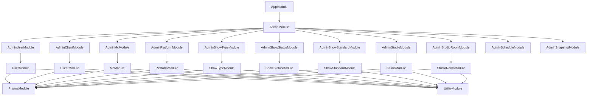

# Eridu Services API Documentation

Welcome to the comprehensive documentation for the Eridu Services API. This documentation provides detailed information about the system architecture, module relationships, and development guidelines.

## 📚 Documentation Structure

### Core Documentation

| Document                                                           | Purpose                                                                                       | Audience                                       |
| ------------------------------------------------------------------ | --------------------------------------------------------------------------------------------- | ---------------------------------------------- |
| [`IMPLEMENTATION_STATUS.md`](./IMPLEMENTATION_STATUS.md) ⭐         | **Current implementation status and gaps**                                                    | **Developers, Project Managers, Stakeholders** |
| [`ARCHITECTURE.md`](./ARCHITECTURE.md)                             | Complete system architecture overview                                                         | Developers, Architects, New Team Members       |
| [`BUSINESS.md`](./BUSINESS.md)                                     | Business domain models and relationships                                                      | Developers, Business Analysts                  |
| [`AUTHENTICATION_GUIDE.md`](./AUTHENTICATION_GUIDE.md)             | Phase 1 hybrid authentication implementation guide                                            | Developers, Security Team                      |
| [`SCHEDULE_UPLOAD_API_DESIGN.md`](./SCHEDULE_UPLOAD_API_DESIGN.md) | **Complete schedule upload system design** (Phase 1 client-by-client, Phase 2 chunked upload) | **Developers, Implementers**                   |

> **Note:** Start with [`IMPLEMENTATION_STATUS.md`](./IMPLEMENTATION_STATUS.md) for the most current status and priority actions.

### Development Roadmap

| Document                                     | Purpose                               | Audience                     |
| -------------------------------------------- | ------------------------------------- | ---------------------------- |
| [`roadmap/PHASE_1.md`](./roadmap/PHASE_1.md) | Phase 1 implementation plan and scope | Developers, Project Managers |
| [`roadmap/PHASE_2.md`](./roadmap/PHASE_2.md) | Phase 2 implementation plan and scope | Developers, Project Managers |
| [`roadmap/PHASE_3.md`](./roadmap/PHASE_3.md) | Phase 3 implementation plan and scope | Developers, Project Managers |

## 🚀 Getting Started

### For New Developers
1. **Start with** [`IMPLEMENTATION_STATUS.md`](./IMPLEMENTATION_STATUS.md) ⭐ - See what's done and what's missing
2. **Review** [`ARCHITECTURE.md`](./ARCHITECTURE.md) - Understand the system architecture
3. **Study** [`BUSINESS.md`](./BUSINESS.md) - Learn the business domain
4. **Read** [`AUTHENTICATION_GUIDE.md`](./AUTHENTICATION_GUIDE.md) - Authentication implementation (TO DO)
5. **Check** [`roadmap/PHASE_1.md`](./roadmap/PHASE_1.md) - Phase 1 implementation details
6. **Schedule Planning** (Current Focus):
   - [`SCHEDULE_UPLOAD_API_DESIGN.md`](./SCHEDULE_UPLOAD_API_DESIGN.md) ⭐ - Complete system design with **Phase 1 client-by-client workflow** and Phase 2 chunked upload
   - [`roadmap/PHASE_1.md`](./roadmap/PHASE_1.md) - Phase 1 implementation details (client-by-client upload)
   - [`test-payloads/README.md`](../test-payloads/README.md) - Testing guide and examples
7. **Reference** [`roadmap/PHASE_2.md`](./roadmap/PHASE_2.md) - Material Management & Advanced Schedule Features
8. **Review** [`roadmap/PHASE_3.md`](./roadmap/PHASE_3.md) - Advanced features roadmap

### For AI Assistants
1. **Check** [`IMPLEMENTATION_STATUS.md`](./IMPLEMENTATION_STATUS.md) ⭐ - See what's missing and critical priorities
2. **Follow** established patterns in existing modules (`src/admin/*`, `src/*/`)
3. **Study** [`AUTHENTICATION_GUIDE.md`](./AUTHENTICATION_GUIDE.md) - Complete auth implementation guide
4. **Reference** roadmaps for implementation scope and phase boundaries
5. **Maintain** consistency with existing architecture patterns
6. **Focus** on critical path: Authentication → Seed Data → Infrastructure enhancements

## 🏗️ System Overview

The Eridu Services API follows a modular architecture with clear separation of concerns:

```
AppModule (Root)
├── AdminModule (Administrative Operations)
│   ├── AdminUserModule
│   ├── AdminClientModule
│   ├── AdminMcModule
│   ├── AdminPlatformModule
│   ├── AdminShowModule ⭐
│   ├── AdminShowTypeModule
│   ├── AdminShowStatusModule
│   ├── AdminShowStandardModule
│   ├── AdminShowMcModule
│   ├── AdminShowPlatformModule
│   ├── AdminStudioModule
│   ├── AdminStudioRoomModule
│   ├── AdminStudioMembershipModule
│   ├── AdminScheduleModule ⭐
│   └── AdminSnapshotModule ⭐
├── Domain Modules (Business Logic)
│   ├── UserModule
│   ├── ClientModule
│   ├── McModule
│   ├── PlatformModule
│   ├── ShowModule ⭐
│   ├── ShowTypeModule
│   ├── ShowStatusModule
│   ├── ShowStandardModule
│   ├── ShowMcModule
│   ├── ShowPlatformModule
│   ├── StudioModule
│   ├── StudioRoomModule
│   ├── MembershipModule (StudioMembership)
│   ├── ScheduleModule ⭐
│   ├── ScheduleSnapshotModule ⭐
│   └── SchedulePlanningModule ⭐
├── Orchestration Modules
│   ├── ShowOrchestrationModule ⭐
│   └── SchedulePlanningModule ⭐
└── Infrastructure Modules (Supporting Services)
    ├── PrismaModule (Database)
    └── UtilityModule (Utilities)
```

## 📋 Key Features

### Architecture Patterns
- **Repository Pattern**: Data access abstraction
- **Service Layer Pattern**: Business logic separation
- **Module Pattern**: Encapsulated functionality
- **Decorator Pattern**: Cross-cutting concerns

### Data Handling
- **snake_case API**: External API uses snake_case
- **camelCase Internal**: Internal code uses camelCase
- **Automatic Conversion**: Generic utilities handle case conversion
- **Type Safety**: Full TypeScript support with Zod validation

### API Documentation
- **OpenAPI Integration**: Comprehensive API documentation with Scalar UI
- **Interactive Testing**: Test endpoints directly from documentation interface
- **Zod Schema Generation**: Automatic OpenAPI schema generation from Zod validation
- **Modern Interface**: Responsive, mobile-friendly documentation at `/api-reference`

### Entity Management
- **CRUD Operations**: Complete Create, Read, Update, Delete
- **Soft Delete**: Data retention with soft delete pattern
- **UID System**: Branded unique identifiers for external references
- **Pagination**: Built-in pagination for list endpoints

## 🔧 Development Workflow

### Making Changes
1. **Plan**: Identify impact scope and documentation needs
2. **Code**: Implement changes following established patterns
3. **Document**: Update all relevant documentation files
4. **Validate**: Ensure documentation accuracy and completeness
5. **Test**: Verify all examples and diagrams work correctly

### Documentation Maintenance
- **Update with every change**: Documentation is part of the codebase
- **Follow checklists**: Use provided checklists for consistency
- **Validate accuracy**: Test all examples and verify diagrams
- **Maintain consistency**: Use consistent naming and formatting

## 📊 Module Relationships

### High-Level Dependencies


## 🎯 API Endpoints

### API Documentation
- **Interactive Documentation**: `GET /api-reference` - Scalar UI interface for testing and exploring endpoints
- **OpenAPI Specification**: `GET /swagger-json` - Raw OpenAPI JSON specification

### Admin Endpoints
- **Users**: `/admin/users` - User management
- **Clients**: `/admin/clients` - Client management  
- **MCs**: `/admin/mcs` - MC (Master of Ceremonies) management
- **Platforms**: `/admin/platforms` - Platform management
- **Shows**: `/admin/shows` - Show management ⭐
- **ShowTypes**: `/admin/show-types` - Show type management
- **ShowStatuses**: `/admin/show-statuses` - Show status management
- **ShowStandards**: `/admin/show-standards` - Show standard management
- **ShowMCs**: `/admin/show-mcs` - Show-MC relationship management
- **ShowPlatforms**: `/admin/show-platforms` - Show-platform relationship management
- **Studios**: `/admin/studios` - Studio management
- **StudioRooms**: `/admin/studio-rooms` - Studio room management
- **StudioMemberships**: `/admin/studio-memberships` - Studio membership management
- **Schedules**: `/admin/schedules` - Schedule planning management ⭐
- **Snapshots**: `/admin/snapshots` - Schedule snapshot management ⭐

### Standard Operations
Each entity supports:
- `GET /admin/{entity}` - List with pagination, expand, and search
- `POST /admin/{entity}` - Create new entity
- `GET /admin/{entity}/:uid` - Get by UID with expand support
- `PUT /admin/{entity}/:uid` - Update entity
- `DELETE /admin/{entity}/:uid` - Soft delete entity

### Query Parameters (Phase 2)
- **Pagination**: `page`, `limit`, `offset`
- **Expand**: `expand=relation1,relation2` - Include associated data (e.g., `?expand=client,platform`)
- **Search**: `search=column1,column2&search_term=query` - Search on specific columns (e.g., `?search=name,description&search_term=script`)

### Request Headers (Phase 2)
- **Idempotency-Key**: Header for show and schedule creation endpoints to prevent duplicate creation from retries or concurrent requests. See [Architecture Documentation](./ARCHITECTURE.md#idempotency-headers-phase-2) for details.

See [Architecture Documentation](./ARCHITECTURE.md#api-query-parameters) for detailed usage examples.

## 🛠️ Tools and Standards

### Documentation Tools
- **Mermaid**: For creating diagrams
- **Markdown**: For documentation format
- **TypeScript**: For code examples

### Development Standards
- **Cursor Rules**: Follow `.cursorrules` for development patterns
- **Phase Alignment**: Implement features according to Phase 1/2 scope
- **Architecture Patterns**: Use established repository and service patterns

## 📈 Documentation Quality Standards

### Completeness
- [ ] All modules documented
- [ ] All services documented
- [ ] All API endpoints documented
- [ ] All major utilities documented

### Accuracy
- [ ] Code examples work without modification
- [ ] Module dependencies are correct
- [ ] Service method signatures match
- [ ] API endpoints return documented responses

### Consistency
- [ ] Naming conventions consistent across docs
- [ ] Formatting consistent across all files
- [ ] Cross-references are accurate
- [ ] Diagrams match implementation

## 🔄 Maintenance Schedule

### Regular Tasks
- **Weekly**: Review recent changes for documentation impact
- **Monthly**: Full documentation accuracy review
- **Before Releases**: Complete documentation audit

### Emergency Updates
- **Immediate**: Fix critical documentation issues
- **Comprehensive**: Schedule full review for major gaps
- **Prevention**: Update processes to prevent recurrence

## 📞 Support and Feedback

### Getting Help
- **Architecture Questions**: Reference `ARCHITECTURE.md`
- **Business Domain Questions**: Reference `BUSINESS.md`
- **Implementation Questions**: Check Phase 1/2 roadmaps
- **Scheduling Questions**: Reference `SCHEDULE_UPLOAD_API_DESIGN.md`

### Contributing
- **Follow Guidelines**: Use `.cursorrules` for development patterns
- **Maintain Quality**: Ensure accuracy and consistency
- **Update Together**: Keep documentation synchronized with code
- **Phase Alignment**: Follow Phase 1/2 implementation scope

## 📝 Change Log

### Recent Updates
- **OpenAPI Documentation Implementation (December 2024)**: ⭐ Added comprehensive OpenAPI documentation with Scalar UI
  - Interactive documentation interface at `/api-reference` endpoint
  - OpenAPI JSON specification at `/swagger-json` endpoint
  - Custom Zod-to-OpenAPI converter for automatic schema generation
  - Reusable decorators (`ApiZodResponse`, `ApiZodBody`, `ApiZodQuery`, `ApiZodParam`)
  - Modern Scalar UI with responsive design and interactive testing capabilities
- **Documentation Update (October 23, 2025)**: Updated implementation checklists to reflect current status (~90% complete)
  - Marked ShowMC as complete (service + tests + admin controller implemented)
  - Updated Show status to reflect full implementation
  - Updated Success Criteria and Dependencies with accurate completion status
- **Show Module Implementation (October 2025)**: ⭐ Completed full Show CRUD operations with advanced pattern
  - Service layer with DTO-to-Prisma payload transformation pattern
  - Separate methods for DTO input (`createShowFromDto`, `updateShowFromDto`) and direct Prisma operations
  - Builder methods (`buildCreatePayload`, `buildUpdatePayload`) for clean transformation logic
  - Type-safe generic includes for relation loading (`ShowWithIncludes<T>`)
  - Time range validation (endTime must be after startTime)
  - Comprehensive test coverage (15 test cases in `show.service.spec.ts`)
  - Admin controller with full CRUD endpoints (`/admin/shows`)
- **Admin Module Refactoring (October 2025)**: Removed all 10 admin service layers, simplified architecture to use Prisma's native features
- **Prisma Native Features**: Controllers now use `connect: { uid }` for foreign key relationships instead of manual UID-to-ID resolution
- **Performance Improvement**: Eliminated extra database queries for UID resolution (Prisma handles it automatically)
- **Code Reduction**: Removed 600+ lines of redundant pass-through code
- **Architecture Simplification**: Admin controllers → Domain services → Repositories (no admin service layer)
- **StudioMembership Admin Module**: Added full CRUD operations for studio membership management
- **Hybrid Authentication Approach**: Adopted JWT validation for user identification + simple StudioMembership model for admin verification
- **3-Phase Structure**: Restored proper 3-phase development approach
- **Phase 1 Focus**: Core Functions with Hybrid Authentication - Essential CRUD operations, JWT validation, Schedule Planning Management System
- **Phase 2 Focus**: Material Management System - Material versioning, platform targeting, show-material associations
- **Phase 3 Focus**: Advanced Authorization Control & Tracking Features - Role-based access control, audit trails, task management
- **StudioRoom Admin Module**: Completed full CRUD operations for studio room management
- **ESLint Configuration**: Updated to support underscore-prefixed variables for unused but required parameters
- **Case Conversion Refactoring**: Implemented generic snake_case/camelCase conversion utilities

### Version History
- **v1.0**: Initial documentation structure
- **v1.1**: Added Phase 1/2 roadmap structure
- **v1.2**: Aligned all documentation with current implementation
- **v1.3**: Removed duplicate content and outdated references
- **v1.4**: Unified core system approach with simplified authentication
- **v1.5**: Restored proper 3-phase structure with Phase 1 (Schedule Planning), Phase 2 (Material Management), and Phase 3 (Advanced Features)
- **v1.6**: Implemented proper 3-phase structure with advanced authorization control
- **v1.7**: Adopted hybrid authentication approach with JWT validation and simple admin verification
- **v1.8**: Refactored admin modules to remove service layers and leverage Prisma's native features

---

**Remember**: Documentation is a living part of the codebase. Keep it updated with every change to maintain its value as a reliable source of truth for the Eridu Services API architecture and implementation details.
