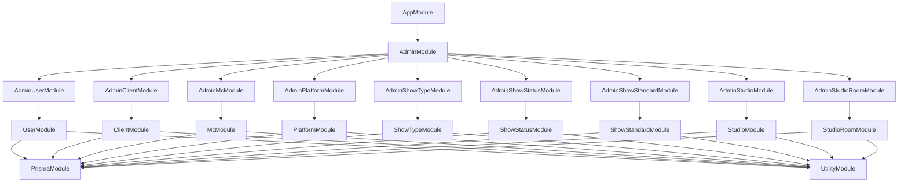

# Eridu Services API Documentation

Welcome to the comprehensive documentation for the Eridu Services API. This documentation provides detailed information about the system architecture, module relationships, and development guidelines.

## 📚 Documentation Structure

### Core Documentation

| Document | Purpose | Audience |
|----------|---------|----------|
| [`ARCHITECTURE.md`](./ARCHITECTURE.md) | Complete system architecture overview | Developers, Architects, New Team Members |
| [`BUSINESS.md`](./BUSINESS.md) | Business domain models and relationships | Developers, Business Analysts |
| [`AUTHENTICATION_GUIDE.md`](./AUTHENTICATION_GUIDE.md) | Phase 1 hybrid authentication implementation guide | Developers, Security Team |
| [`SCHEDULING_ARCHITECTURE.md`](./SCHEDULING_ARCHITECTURE.md) | Scheduling system design and rationale | Developers, Architects |

### Development Roadmap

| Document | Purpose | Audience |
|----------|---------|----------|
| [`roadmap/PHASE_1.md`](./roadmap/PHASE_1.md) | Phase 1 implementation plan and scope | Developers, Project Managers |
| [`roadmap/PHASE_2.md`](./roadmap/PHASE_2.md) | Phase 2 implementation plan and scope | Developers, Project Managers |
| [`roadmap/PHASE_3.md`](./roadmap/PHASE_3.md) | Phase 3 implementation plan and scope | Developers, Project Managers |

## 🚀 Getting Started

### For New Developers
1. **Start with** [`ARCHITECTURE.md`](./ARCHITECTURE.md) for complete system understanding
2. **Review** [`BUSINESS.md`](./BUSINESS.md) for domain model understanding
3. **Study** [`AUTHENTICATION_GUIDE.md`](./AUTHENTICATION_GUIDE.md) for Phase 1 authentication implementation
4. **Check** [`roadmap/PHASE_1.md`](./roadmap/PHASE_1.md) for Phase 1 implementation scope
5. **Reference** [`roadmap/PHASE_2.md`](./roadmap/PHASE_2.md) for Phase 2 scheduling features
6. **Review** [`roadmap/PHASE_3.md`](./roadmap/PHASE_3.md) for Phase 3 advanced features
7. **Study** [`SCHEDULING_ARCHITECTURE.md`](./SCHEDULING_ARCHITECTURE.md) for scheduling system details

### For AI Assistants
1. **Read** [`.cursorrules`](../.cursorrules) for development guidelines
2. **Follow** established patterns in existing modules
3. **Study** [`AUTHENTICATION_GUIDE.md`](./AUTHENTICATION_GUIDE.md) for authentication implementation
4. **Reference** Phase 1/2/3 roadmaps for implementation scope
5. **Maintain** consistency with existing architecture patterns
6. **Focus** on Phase 1 core functions first, then Phase 2 scheduling, then Phase 3 advanced features

## 🏗️ System Overview

The Eridu Services API follows a modular architecture with clear separation of concerns:

```
AppModule (Root)
├── AdminModule (Administrative Operations)
│   ├── AdminUserModule
│   ├── AdminClientModule
│   ├── AdminMcModule
│   ├── AdminPlatformModule
│   ├── AdminShowTypeModule
│   ├── AdminShowStatusModule
│   ├── AdminShowStandardModule
│   ├── AdminStudioModule
│   └── AdminStudioRoomModule
├── Domain Modules (Business Logic)
│   ├── UserModule
│   ├── ClientModule
│   ├── McModule
│   ├── PlatformModule
│   ├── ShowTypeModule
│   ├── ShowStatusModule
│   ├── ShowStandardModule
│   ├── StudioModule
│   ├── StudioRoomModule
│   └── MembershipModule
└── Infrastructure Modules (Supporting Services)
    ├── PrismaModule (Database)
    └── UtilityModule (Utilities)
```

## 📋 Key Features

### Architecture Patterns
- **Repository Pattern**: Data access abstraction
- **Service Layer Pattern**: Business logic separation
- **Module Pattern**: Encapsulated functionality
- **Decorator Pattern**: Cross-cutting concerns

### Data Handling
- **snake_case API**: External API uses snake_case
- **camelCase Internal**: Internal code uses camelCase
- **Automatic Conversion**: Generic utilities handle case conversion
- **Type Safety**: Full TypeScript support with Zod validation

### Entity Management
- **CRUD Operations**: Complete Create, Read, Update, Delete
- **Soft Delete**: Data retention with soft delete pattern
- **UID System**: Branded unique identifiers for external references
- **Pagination**: Built-in pagination for list endpoints

## 🔧 Development Workflow

### Making Changes
1. **Plan**: Identify impact scope and documentation needs
2. **Code**: Implement changes following established patterns
3. **Document**: Update all relevant documentation files
4. **Validate**: Ensure documentation accuracy and completeness
5. **Test**: Verify all examples and diagrams work correctly

### Documentation Maintenance
- **Update with every change**: Documentation is part of the codebase
- **Follow checklists**: Use provided checklists for consistency
- **Validate accuracy**: Test all examples and verify diagrams
- **Maintain consistency**: Use consistent naming and formatting

## 📊 Module Relationships

### High-Level Dependencies


## 🎯 API Endpoints

### Admin Endpoints
- **Users**: `/admin/users` - User management
- **Clients**: `/admin/clients` - Client management  
- **MCs**: `/admin/mcs` - MC (Master of Ceremonies) management
- **Platforms**: `/admin/platforms` - Platform management
- **ShowTypes**: `/admin/show-types` - Show type management
- **ShowStatuses**: `/admin/show-statuses` - Show status management
- **ShowStandards**: `/admin/show-standards` - Show standard management
- **Studios**: `/admin/studios` - Studio management
- **StudioRooms**: `/admin/studio-rooms` - Studio room management

### Standard Operations
Each entity supports:
- `GET /admin/{entity}` - List with pagination
- `POST /admin/{entity}` - Create new entity
- `GET /admin/{entity}/:uid` - Get by UID
- `PUT /admin/{entity}/:uid` - Update entity
- `DELETE /admin/{entity}/:uid` - Soft delete entity

## 🛠️ Tools and Standards

### Documentation Tools
- **Mermaid**: For creating diagrams
- **Markdown**: For documentation format
- **TypeScript**: For code examples

### Development Standards
- **Cursor Rules**: Follow `.cursorrules` for development patterns
- **Phase Alignment**: Implement features according to Phase 1/2 scope
- **Architecture Patterns**: Use established repository and service patterns

## 📈 Documentation Quality Standards

### Completeness
- [ ] All modules documented
- [ ] All services documented
- [ ] All API endpoints documented
- [ ] All major utilities documented

### Accuracy
- [ ] Code examples work without modification
- [ ] Module dependencies are correct
- [ ] Service method signatures match
- [ ] API endpoints return documented responses

### Consistency
- [ ] Naming conventions consistent across docs
- [ ] Formatting consistent across all files
- [ ] Cross-references are accurate
- [ ] Diagrams match implementation

## 🔄 Maintenance Schedule

### Regular Tasks
- **Weekly**: Review recent changes for documentation impact
- **Monthly**: Full documentation accuracy review
- **Before Releases**: Complete documentation audit

### Emergency Updates
- **Immediate**: Fix critical documentation issues
- **Comprehensive**: Schedule full review for major gaps
- **Prevention**: Update processes to prevent recurrence

## 📞 Support and Feedback

### Getting Help
- **Architecture Questions**: Reference `ARCHITECTURE.md`
- **Business Domain Questions**: Reference `BUSINESS.md`
- **Implementation Questions**: Check Phase 1/2 roadmaps
- **Scheduling Questions**: Reference `SCHEDULING_ARCHITECTURE.md`

### Contributing
- **Follow Guidelines**: Use `.cursorrules` for development patterns
- **Maintain Quality**: Ensure accuracy and consistency
- **Update Together**: Keep documentation synchronized with code
- **Phase Alignment**: Follow Phase 1/2 implementation scope

## 📝 Change Log

### Recent Updates
- **Hybrid Authentication Approach**: Adopted JWT validation for user identification + simple Membership model for admin verification
- **3-Phase Structure**: Restored proper 3-phase development approach
- **Phase 1 Focus**: Core Functions with Hybrid Authentication - Essential CRUD operations, JWT validation, and simple admin verification
- **Phase 2 Focus**: Scheduling & Planning Workflow - Collaborative planning and multi-version scheduling
- **Phase 3 Focus**: Advanced Authorization Control & Tracking Features - Role-based access control, audit trails, task management, material management
- **Simplified Authentication**: Admin write access, others read-only approach maintained across all phases
- **Gradual Rollout Strategy**: Features can be enabled per user type over time
- **Documentation Alignment**: Updated all references to reflect proper 3-phase structure
- **StudioRoom Admin Module**: Completed full CRUD operations for studio room management
- **ESLint Configuration**: Updated to support underscore-prefixed variables for unused but required parameters
- **Case Conversion Refactoring**: Implemented generic snake_case/camelCase conversion utilities

### Version History
- **v1.0**: Initial documentation structure
- **v1.1**: Added Phase 1/2 roadmap structure
- **v1.2**: Aligned all documentation with current implementation
- **v1.3**: Removed duplicate content and outdated references
- **v1.4**: Unified core system approach with simplified authentication
- **v1.5**: Restored proper 2-phase structure with Phase 1 MVP and Phase 2 scheduling
- **v1.6**: Implemented proper 3-phase structure with advanced authorization control
- **v1.7**: Adopted hybrid authentication approach with JWT validation and simple admin verification

---

**Remember**: Documentation is a living part of the codebase. Keep it updated with every change to maintain its value as a reliable source of truth for the Eridu Services API architecture and implementation details.
