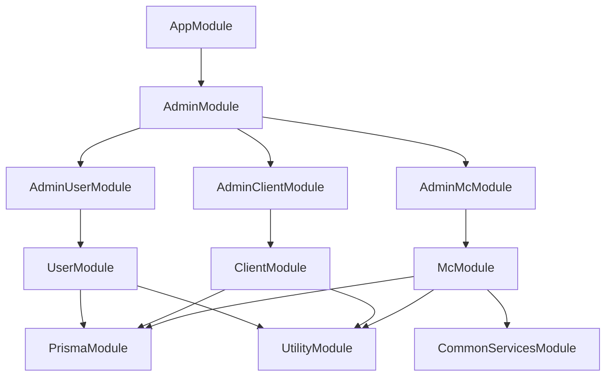

# Eridu Services API Documentation

Welcome to the comprehensive documentation for the Eridu Services API. This documentation provides detailed information about the system architecture, module relationships, and development guidelines.

## 📚 Documentation Structure

### Core Documentation

| Document | Purpose | Audience |
|----------|---------|----------|
| [`ARCHITECTURE.md`](./ARCHITECTURE.md) | Complete system architecture overview | Developers, Architects, New Team Members |
| [`MODULE_DIAGRAMS.md`](./MODULE_DIAGRAMS.md) | Visual diagrams and relationships | Developers, Architects |
| [`QUICK_REFERENCE.md`](./QUICK_REFERENCE.md) | Developer quick reference guide | Developers |

### Process Documentation

| Document | Purpose | Audience |
|----------|---------|----------|
| [`DOCUMENTATION_MAINTENANCE.md`](./DOCUMENTATION_MAINTENANCE.md) | Guidelines for keeping docs updated | Developers, AI Assistants |
| [`DOCUMENTATION_CHECKLIST.md`](./DOCUMENTATION_CHECKLIST.md) | Checklist for documentation updates | Developers, AI Assistants |
| [`AI_ASSISTANT_GUIDE.md`](./AI_ASSISTANT_GUIDE.md) | Specific guide for AI assistants | AI Assistants |

## 🚀 Getting Started

### For New Developers
1. **Start with** [`ARCHITECTURE.md`](./ARCHITECTURE.md) for complete system understanding
2. **Use** [`QUICK_REFERENCE.md`](./QUICK_REFERENCE.md) for daily development tasks
3. **Reference** [`MODULE_DIAGRAMS.md`](./MODULE_DIAGRAMS.md) for visual understanding

### For AI Assistants
1. **Read** [`AI_ASSISTANT_GUIDE.md`](./AI_ASSISTANT_GUIDE.md) before making any code changes
2. **Follow** [`DOCUMENTATION_CHECKLIST.md`](./DOCUMENTATION_CHECKLIST.md) for each change
3. **Use** [`DOCUMENTATION_MAINTENANCE.md`](./DOCUMENTATION_MAINTENANCE.md) for process understanding

## 🏗️ System Overview

The Eridu Services API follows a modular architecture with clear separation of concerns:

```
AppModule (Root)
├── AdminModule (Administrative Operations)
│   ├── AdminUserModule
│   ├── AdminClientModule
│   └── AdminMcModule
├── Domain Modules (Business Logic)
│   ├── UserModule
│   ├── ClientModule
│   └── McModule
└── Infrastructure Modules (Supporting Services)
    ├── PrismaModule (Database)
    ├── UtilityModule (Utilities)
    └── CommonServicesModule (Shared Services)
```

## 📋 Key Features

### Architecture Patterns
- **Repository Pattern**: Data access abstraction
- **Service Layer Pattern**: Business logic separation
- **Module Pattern**: Encapsulated functionality
- **Decorator Pattern**: Cross-cutting concerns

### Data Handling
- **snake_case API**: External API uses snake_case
- **camelCase Internal**: Internal code uses camelCase
- **Automatic Conversion**: Generic utilities handle case conversion
- **Type Safety**: Full TypeScript support with Zod validation

### Entity Management
- **CRUD Operations**: Complete Create, Read, Update, Delete
- **Soft Delete**: Data retention with soft delete pattern
- **UID System**: Branded unique identifiers for external references
- **Pagination**: Built-in pagination for list endpoints

## 🔧 Development Workflow

### Making Changes
1. **Plan**: Identify impact scope and documentation needs
2. **Code**: Implement changes following established patterns
3. **Document**: Update all relevant documentation files
4. **Validate**: Ensure documentation accuracy and completeness
5. **Test**: Verify all examples and diagrams work correctly

### Documentation Maintenance
- **Update with every change**: Documentation is part of the codebase
- **Follow checklists**: Use provided checklists for consistency
- **Validate accuracy**: Test all examples and verify diagrams
- **Maintain consistency**: Use consistent naming and formatting

## 📊 Module Relationships

### High-Level Dependencies

```mermaid
graph TB
    App[AppModule] --> Admin[AdminModule]
    Admin --> AdminUser[AdminUserModule]
    Admin --> AdminClient[AdminClientModule]
    Admin --> AdminMC[AdminMcModule]
    
    AdminUser --> User[UserModule]
    AdminClient --> Client[ClientModule]
    AdminMC --> MC[McModule]
    
    User --> Prisma[PrismaModule]
    User --> Utility[UtilityModule]
    
    Client --> Prisma
    Client --> Utility
    
    MC --> Prisma
    MC --> Utility
    MC --> CommonServices[CommonServicesModule]
```

## 🎯 API Endpoints

### Admin Endpoints
- **Users**: `/admin/users` - User management
- **Clients**: `/admin/clients` - Client management  
- **MCs**: `/admin/mcs` - MC (Master of Ceremonies) management

### Standard Operations
Each entity supports:
- `GET /admin/{entity}` - List with pagination
- `POST /admin/{entity}` - Create new entity
- `GET /admin/{entity}/:uid` - Get by UID
- `PUT /admin/{entity}/:uid` - Update entity
- `DELETE /admin/{entity}/:uid` - Soft delete entity

## 🛠️ Tools and Validation

### Documentation Tools
- **Mermaid**: For creating diagrams
- **Markdown**: For documentation format
- **TypeScript**: For code examples

### Validation Commands
```bash
# Validate Mermaid diagrams
npx @mermaid-js/mermaid-cli -i docs/MODULE_DIAGRAMS.md -o docs/diagrams/

# Check markdown syntax
npx markdownlint docs/*.md

# Validate links
npx markdown-link-check docs/*.md
```

## 📈 Documentation Quality Standards

### Completeness
- [ ] All modules documented
- [ ] All services documented
- [ ] All API endpoints documented
- [ ] All major utilities documented

### Accuracy
- [ ] Code examples work without modification
- [ ] Module dependencies are correct
- [ ] Service method signatures match
- [ ] API endpoints return documented responses

### Consistency
- [ ] Naming conventions consistent across docs
- [ ] Formatting consistent across all files
- [ ] Cross-references are accurate
- [ ] Diagrams match implementation

## 🔄 Maintenance Schedule

### Regular Tasks
- **Weekly**: Review recent changes for documentation impact
- **Monthly**: Full documentation accuracy review
- **Before Releases**: Complete documentation audit

### Emergency Updates
- **Immediate**: Fix critical documentation issues
- **Comprehensive**: Schedule full review for major gaps
- **Prevention**: Update processes to prevent recurrence

## 📞 Support and Feedback

### Getting Help
- **Architecture Questions**: Reference `ARCHITECTURE.md`
- **Quick Tasks**: Use `QUICK_REFERENCE.md`
- **Process Questions**: Check `DOCUMENTATION_MAINTENANCE.md`

### Contributing
- **Follow Guidelines**: Use provided checklists and guides
- **Maintain Quality**: Ensure accuracy and consistency
- **Test Examples**: Verify all code examples work
- **Update Together**: Keep documentation synchronized with code

## 📝 Change Log

### Recent Updates
- **Case Conversion Refactoring**: Implemented generic snake_case/camelCase conversion utilities
- **Documentation System**: Created comprehensive documentation maintenance system
- **AI Assistant Guide**: Added specific guidelines for AI assistants

### Version History
- **v1.0**: Initial documentation structure
- **v1.1**: Added maintenance guidelines
- **v1.2**: Added AI assistant guide
- **v1.3**: Added comprehensive checklists

---

**Remember**: Documentation is a living part of the codebase. Keep it updated with every change to maintain its value as a reliable source of truth for the Eridu Services API architecture and implementation details.
