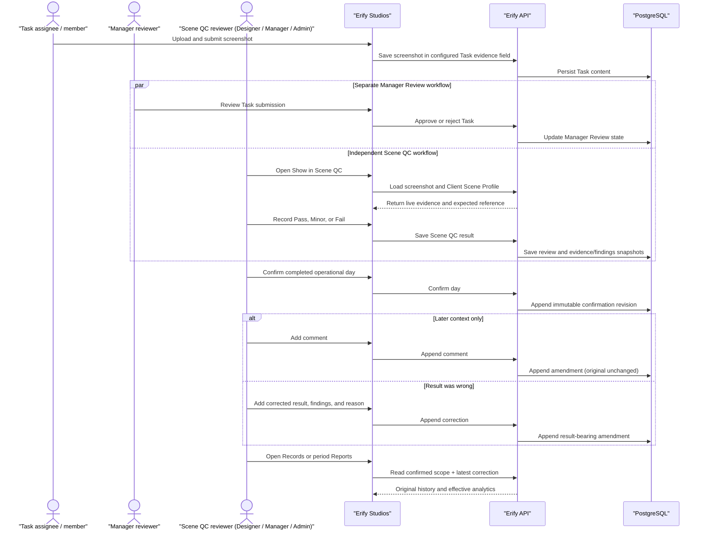

# Scene QC Backend Reference

> **Status**: ✅ Implemented — Phase 5 item 23
> **Owner app**: `apps/erify_api`
> **Product contract**: [docs/features/scene-qc.md](../../../docs/features/scene-qc.md)
> **Frontend reference**: [apps/erify_studios/docs/SCENE_QC.md](../../erify_studios/docs/SCENE_QC.md)

## Purpose

Scene QC is a capability-owned, Show-anchored persisted quality-review workflow: a Client Scene Profile (expected-scene reference), Show-level review outcomes with structured findings, organization-wide taxonomy management, append-only daily confirmations and review amendments, Records, daily manager reports, and confirmed-history period analytics.

Scene QC never writes `Task`, `TaskTarget`, `Show`, `ShowStatus`, or Manager Review data. Designating a Task Template image field as Scene QC evidence rides existing Task Template write permissions (`[ADMIN, MANAGER]`) — Scene QC access never widens template administration.

## Routes

All endpoints admit exactly `DESIGNER`, `MANAGER`, `ADMIN` via `@StudioProtected`, with no method-level override (asserted by `scene-qc-authorization.spec.ts`). List reads return the shared paginated envelope (`items` + `total`); studio-scoped path params use `UidValidationPipe`. Taxonomy rows are organization-wide even though the route carries `:studioId`: that parameter provides the existing Studio membership authorization boundary, not data ownership.

```text
GET    /studios/:studioId/scene-profiles/:clientId
PUT    /studios/:studioId/scene-profiles/:clientId
DELETE /studios/:studioId/scene-profiles/:clientId

GET    /studios/:studioId/scene-qc/summary
GET    /studios/:studioId/scene-qc/items
GET    /studios/:studioId/scene-qc/items/:showId

POST   /studios/:studioId/scene-qc-reviews
PATCH  /studios/:studioId/scene-qc-reviews/:reviewId
POST   /studios/:studioId/scene-qc-reviews/:reviewId/amendments

GET    /studios/:studioId/scene-qc-taxonomy
POST   /studios/:studioId/scene-qc-taxonomy/elements
POST   /studios/:studioId/scene-qc-taxonomy/defects
DELETE /studios/:studioId/scene-qc-taxonomy/elements/:elementId
DELETE /studios/:studioId/scene-qc-taxonomy/defects/:defectId

POST   /studios/:studioId/scene-qc-confirmations
GET    /studios/:studioId/scene-qc-confirmations/:confirmationId/report
GET    /studios/:studioId/scene-qc-confirmations/:confirmationId/report.csv

GET    /studios/:studioId/scene-qc-records
GET    /studios/:studioId/scene-qc-records/:reviewId

GET    /studios/:studioId/scene-qc-reports/period
```

`PUT` on Scene Profile creates or replaces the Client's single profile in one version-checked call — there is no separate create/update distinction. Every daily query, review command, and confirmation request sends a date-only `operational_date`; the server resolves the exact local `06:00`–`05:59` window from `SCENE_QC_OPERATIONAL_TIMEZONE` and returns `window_start` / `window_end` / `timezone` as provenance. Clients never submit bounds or timezone.

## Persisted Model

The capability-owned tables are defined under `apps/erify_api/prisma/schema.prisma`:

| Table | Key invariant |
| --- | --- |
| `SceneProfile` | At most one non-deleted row per Client, enforced by the partial unique index `scene_profiles_active_client_key` (`CREATE UNIQUE INDEX ... ON scene_profiles (client_id) WHERE deleted_at IS NULL`) — invisible to Prisma, so `migrate dev` will try to drop it; confirm its presence directly in any target environment. |
| `TaskTemplateSceneQcEvidenceRef` | Denormalizes `evidence_purpose: 'scene_qc'` per immutable Task Template snapshot (`(snapshotId, fieldKey)` unique). Written by the real Task Template save/publish path, never by a heuristic. |
| `SceneQcReview` + `SceneQcReviewEvidence` + `SceneQcReviewFinding` | One review head per `(showId, operationalDate)`. Evidence and structured finding labels are pinned snapshots; a later Task, Scene Profile, or taxonomy change never rewrites the recorded decision context. |
| `SceneQcTaxonomyElement` + `SceneQcTaxonomyDefect` | Organization-wide built-in and custom vocabulary. Built-ins are protected; retiring a custom option removes it from future selection without affecting finding snapshots. |
| `SceneQcReviewAmendment` + `SceneQcReviewAmendmentFinding` | Append-only comments and corrections for confirmed reviews. Revision allocation is serialized by a review-scoped advisory lock. A null result is comment-only; the latest result-bearing row is the effective result for Records and period analytics. |
| `SceneQcDailyConfirmation` + `SceneQcDailyConfirmationItem(Platform)` | Append-only: one revision number per `(studioId, operationalDate, revision)`. The confirm command takes `pg_advisory_xact_lock(hashtextextended('scene-qc-confirmation:{studioId}:{operationalDate}', 0))`, reads the max revision, and appends the next one — it never rewrites a prior revision's rows. |
| `SceneQcAuditTarget` | Capability-owned typed-FK side table on the standard `Audit` envelope (`sceneProfileId` / `sceneQcReviewId` / `sceneQcDailyConfirmationId`, `CHECK (num_nonnulls(...) = 1)`), so Scene QC's own audit-target growth never lands on the shared `audit_targets` table. |

All undeployed Scene QC schema work is consolidated into one official Prisma migration. Its custom SQL preserves the active-profile partial unique index, the audit single-target check, and seeds the specification's built-in taxonomy:

```text
20260730162002_scene_qc_review_workflow
```

## Evidence Resolution

`SceneQcEvidenceResolver` (`src/capabilities/scene-qc/scene-qc-evidence.resolver.ts`) is the ONLY evidence binding source:

1. finds Tasks targeted to the Show;
2. joins their immutable snapshots to `TaskTemplateSceneQcEvidenceRef` rows;
3. reads only the corresponding `task.content[fieldKey]` value;
4. accepts only values the storage service can derive a real object key from — a URL that doesn't derive back to an R2 object key is foreign content and is excluded rather than pinned and rendered unverified;
5. returns every eligible image with object key, source Task UID, field key, label, and Task version.

It never falls back to recursive URL discovery, filename matching, or provisional content-label metric matching — the heuristics the retired PR #319 Scene Review mapper used. There is no permanent heuristic compatibility path.

Evidence-reference rows are template-snapshot metadata, not submission records. A snapshot-creating Task Template save projects fields marked `evidence_purpose: 'scene_qc'`; Task submission only stores the screenshot URL in `task.content`. The one-time cutover backfill supplies reviewed bindings for historical immutable snapshots and marks the current template so future snapshot saves maintain the projection automatically.

## Transaction Semantics

- **Review save** (`SceneQcWorkflowService.createReview` / `updateReview`, `@Transactional()`): resolves and authorizes the Show, pins the operational window/evidence/Scene Profile, validates taxonomy selections, requires findings for Minor/Fail, writes the draft plus snapshots and Audit in one transaction. The note is optional. After `confirmedAt` is set, normal updates reject.
- **Confirmation** (`SceneQcConfirmationWorkflowService.confirmDay`, `@Transactional()`): acquires the advisory lock, recomputes the eligible Show set with no UI filters, resolves one effective review per Show, rejects incomplete/blocked scope, appends confirmation + item rows, snapshots confirmation-time Show/Client/platform report dimensions, marks newly included reviews confirmed, writes Audit.
- **Amendment** (`SceneQcAmendmentService.append`, `@Transactional()`): authorizes the confirmed review, validates an optional corrected result and findings, acquires `pg_advisory_xact_lock(hashtextextended('scene-qc-amendment:{reviewId}', 0))`, allocates the next revision, appends the amendment/findings, and writes Audit. It never updates the original review.
- **Period report** (`SceneQcPeriodReportQuery`): starts from the latest immutable confirmation revision per operational day, applies the latest result-bearing amendment, and returns centralized trend, Client, and issue aggregates. Report consumers never count raw finding shapes independently.
- Confirmation state is a pure comparison of the latest confirmation's pinned scope against the current eligible set: `UNCONFIRMED` (none exists), `CURRENT` (scopes match), `STALE` (a Show was added, reactivated, moved in/out of the day, or terminally cancelled since the pinned revision).

## Actor and Write Sequence

Task submission is upstream of both review workflows. Once a configured Task evidence field contains a valid screenshot, Manager Review and Scene QC can proceed independently. Manager Review approval does not gate Scene QC, and Scene QC never mutates Task or Manager Review state.



## Cutover Scripts

Two standalone NestJS-context scripts, invoked via `ts-node -r tsconfig-paths/register` (not `tsx` — `tsx` is esbuild-based and drops `emitDecoratorMetadata`, which silently breaks NestJS constructor-injection):

- `scripts/backfill-scene-qc-evidence-refs.ts` — `--report` prints candidate Task Template image fields for operator review; the default run is a dry-run; `--apply` (requires `ALLOW_PROD=1` against a non-local database) writes `evidence_purpose: 'scene_qc'` through the real `TaskTemplateService.updateTemplateWithSnapshot` path and backfills historical-snapshot ref rows. Idempotent on replay.
- `scripts/verify-scene-qc-evidence-bindings.ts` — read-only, requires `--since YYYY-MM-DD`; exits non-zero unless every in-scope `TaskTemplateSnapshot` (referenced by a live Task on a non-deleted, Scene-QC-eligible Show at or after `--since`) is bound or intentionally excluded in `scripts/scene-qc-evidence-binding-map.ts`.

Run the production cutover in this order:

1. Before deployment, confirm every mapped evidence field uses an image-only file contract (for example, `accept: "image/*"`). Correct the Task Template through the existing Task Template Builder so the normal immutable snapshot and audit behavior are preserved.
2. Deploy the consolidated Scene QC migration. The backfill cannot run before this step because its reference table does not exist in the currently deployed schema.
3. Run the backfill with `--apply` and `ALLOW_PROD=1`.
4. Run the read-only verifier with the rollout's agreed `--since` date. A non-zero exit blocks enabling Scene QC.
5. Replay the backfill and verifier once to prove the cutover is idempotent.

The binding map and intentionally-unbound registry contain operator-reviewed production template decisions. Update them only when a real Task Template or rollout scope change requires it.

## Source References

- Capability: `src/capabilities/scene-qc/`
- HTTP controllers: `src/capabilities/scene-qc/http/`
- Shared API types: `packages/api-types/src/scene-qc/`
- Frontend: [apps/erify_studios/docs/SCENE_QC.md](../../erify_studios/docs/SCENE_QC.md)
- Authorization: [`.agents/skills/erify-authorization/SKILL.md`](../../../.agents/skills/erify-authorization/SKILL.md)
- Operational-day pattern: [`.agents/skills/operations-review-surface/SKILL.md`](../../../.agents/skills/operations-review-surface/SKILL.md)
