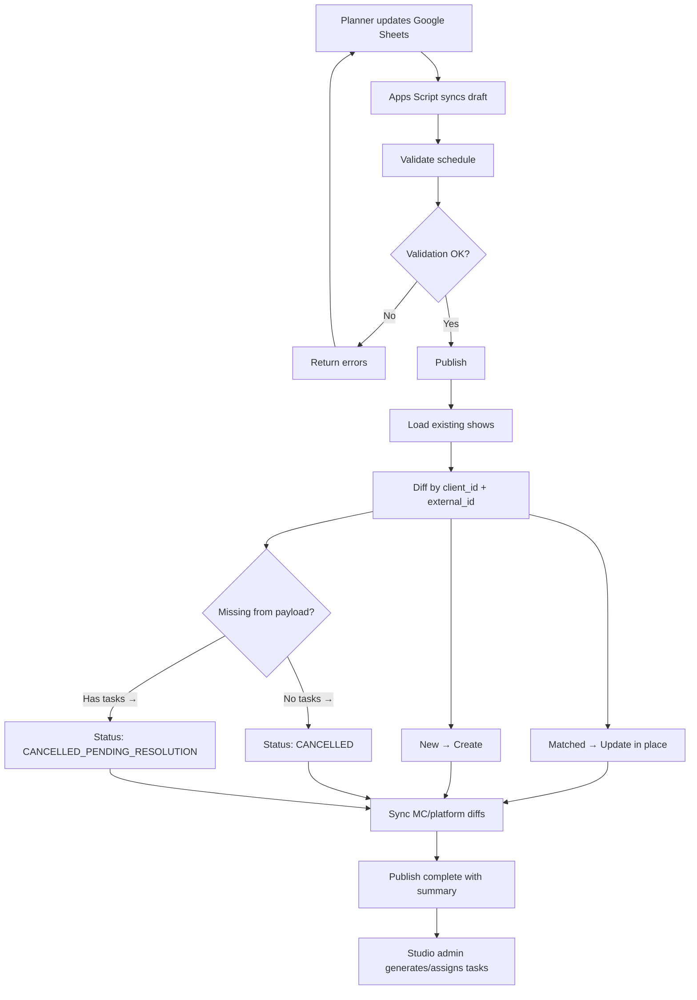
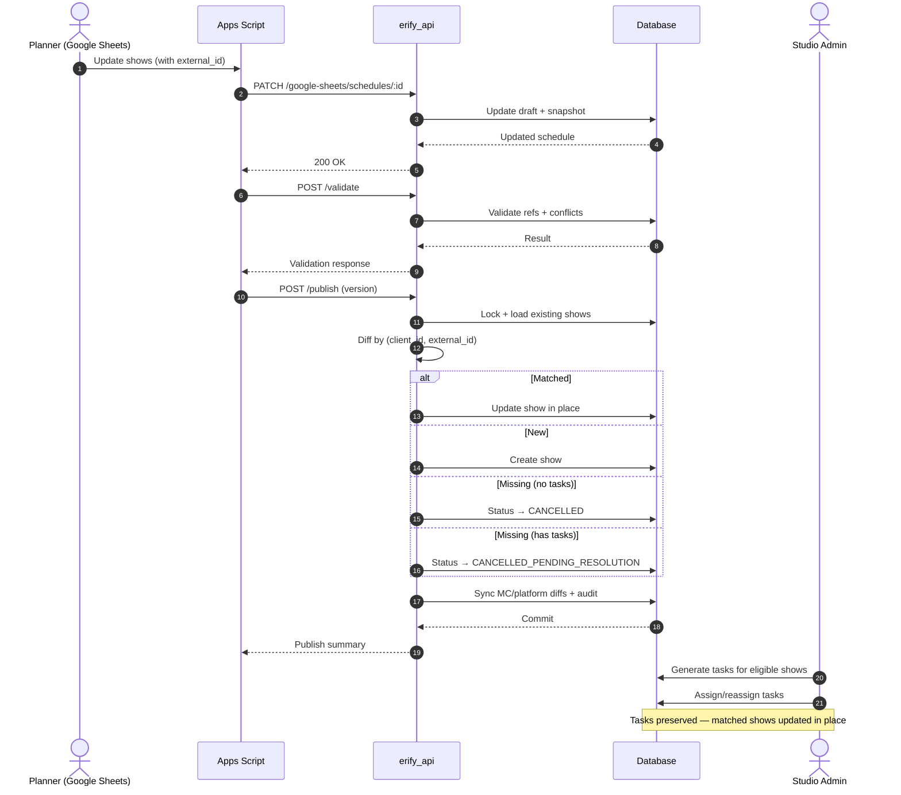

# Schedule Continuity

> **TLDR**: Schedule publish uses identity-preserving **diff + upsert** instead of delete/recreate. Shows keep a stable `external_id` across republishes. Removed shows with active non-terminal tasks enter `CANCELLED_PENDING_RESOLUTION` (not deleted). Publish payload always wins conflicts.

## Overview

Planners update shows in Google Sheets. Apps Script syncs drafts to the API. When published, the system diffs incoming shows against existing ones by `(client_id, external_id)` and applies creates, updates, or status transitions — never deleting show records. This preserves task and assignment linkage across schedule updates.



---

## Show Identity

Every show carries a stable `external_id` (generated in Google Sheets as `show_` + 10 hex chars).

| Rule             | Detail                                               |
| ---------------- | ---------------------------------------------------- |
| Uniqueness scope | `client_id + external_id` (unique constraint)        |
| Immutability     | Once associated, `external_id` cannot change         |
| Publish matching | Diff algorithm matches by `(client_id, external_id)` |
| Legacy rows      | `external_id` is nullable in DB for backward compat  |

### Data Model

```
Show
├── externalId    @map("external_id")  // stable identity
├── clientId      → Client
├── scheduleId    → Schedule
├── showStatusId  → ShowStatus
└── ...

ShowStatus
├── name          // human-readable label (editable)
└── systemKey     @map("system_key")  // machine key (immutable)
    Required: CANCELLED, CANCELLED_PENDING_RESOLUTION
    Backfilled: DRAFT, CONFIRMED, LIVE, COMPLETED
```

---

## Diff + Upsert Algorithm

Within a single transaction:

1. Load schedule + version check
2. Acquire advisory lock: `pg_advisory_xact_lock(schedule.id)`
3. Validate plan document and references
4. Query all existing shows for this schedule (including cancelled) into `existingByKey` map
5. Build `incomingByKey` map from payload
6. Partition into **create** / **update** / **remove** sets
7. Apply writes:
   - **Create**: batch insert new shows
   - **Update**: update matched shows in place (changed fields only)
   - **Restore**: if previously cancelled show reappears → update status back to active, resume tasks
   - **Remove**: apply remove policy (status transitions only, never delete)
8. Sync MC/platform relation diffs per show
9. Return deterministic publish summary

### Validation Rules for `external_id`

1. Reject items with missing or empty `external_id`
2. Reject duplicate `external_id` within the same payload
3. Reject `external_id` collisions across schedules for the same client

---

## Remove Policy

When an existing show is missing from the incoming payload:

| Condition        | Action                                      |
| ---------------- | ------------------------------------------- |
| No active tasks  | Set status → `CANCELLED`                    |
| Has active tasks | Set status → `CANCELLED_PENDING_RESOLUTION` |

### Active Task Definition (Canonical)

For schedule continuity remove/resolve decisions, **active task** means:

1. `task_target.deleted_at IS NULL`
2. `task.deleted_at IS NULL`
3. `task.status NOT IN ('COMPLETED', 'CLOSED')`

Completed/closed tasks do not block direct transition to `CANCELLED`.

- **No soft-delete**: `deletedAt` stays null. Status-only transitions avoid unique constraint collisions on `(client_id, external_id)`.
- **Restore on reappearance**: If a cancelled show reappears in a future publish, it's matched → updated back to active, and tasks are resumed.
- **Manual resolve interaction**: A studio-admin resolved show (`CANCELLED`) can still be restored to active if a later publish reintroduces the same `(client_id, external_id)`.
- **Hard delete**: Privileged override only (not standard publish path). Cascades to tasks.

### Cancellation Metadata Contract

When publish transitions a show to `CANCELLED_PENDING_RESOLUTION`, store context in `show.metadata`:

```json
{
  "cancellation_context": {
    "previous_status": "confirmed",
    "previous_status_system_key": "CONFIRMED",
    "triggered_by": "schedule_publish",
    "triggered_at": "2026-03-01T12:00:00.000Z"
  }
}
```

This metadata enables safer/manual resolution flows (for example, LIVE pre-transition safeguards).

---

## Conflict Policy

`publish-payload-wins` for all publish-owned fields:

| Field                                          | Publish Overwrites? | Web App Can Edit?                 | Notes                 |
| ---------------------------------------------- | ------------------- | --------------------------------- | --------------------- |
| `name`, `startTime`, `endTime`                 | Yes                 | Yes (overwritten on next publish) | GS is source of truth |
| `clientId`                                     | Yes                 | No                                | GS is source of truth |
| `studioId`, `studioRoomId`                     | Yes                 | Yes (overwritten on next publish) |                       |
| `showTypeId`, `showStatusId`, `showStandardId` | Yes                 | Yes (overwritten on next publish) |                       |
| MC/platform mappings                           | Yes                 | Yes (overwritten on next publish) |                       |
| Task assignments                               | No                  | Yes                               | Studio admin owns     |

---

## Task Continuity Rules

1. Task-target links survive show updates where identity matches
2. System never silently removes operational tasks via publish
3. Removed shows with tasks enter `cancelled_pending_resolution` for admin resolution
4. Hard delete (privileged only) cascades to tasks — acceptable since it's an explicit, audited action
5. Optimistic locking + advisory lock on schedule ID serializes concurrent publishes
6. Resolution workflows should use `cancellation_context` metadata and enforce domain policy (see pending-resolution MVP implementation plan)

---

## Integration Endpoints

The publish uses the same 4 Google Sheets endpoints (no surface expansion):

| Method  | Endpoint                                | Behavior                                       |
| ------- | --------------------------------------- | ---------------------------------------------- |
| `POST`  | `/google-sheets/schedules/bulk`         | Bulk create schedules                          |
| `PATCH` | `/google-sheets/schedules/:id`          | Update draft with `external_id` in plan items  |
| `POST`  | `/google-sheets/schedules/:id/validate` | Validate references and constraints            |
| `POST`  | `/google-sheets/schedules/:id/publish`  | Diff + upsert publish (returns summary counts) |

### Publish Summary Response

Includes counts for: `shows_created`, `shows_updated`, `shows_cancelled`, `shows_pending_resolution`, `shows_restored`, `mc_links_added/updated/removed`, `platform_links_added/updated/removed`.

---

## End-to-End Workflow



---

## Related Documentation

- [Schedule Planning](./SCHEDULE_PLANNING.md) — API design, data model, workflow
- [Task Management](./TASK_MANAGEMENT_SUMMARY.md) — Task lifecycle and API
- [Pending-Resolution MVP](./design/IMPLEMENTATION_CANCELLED_PENDING_RESOLUTION_GAP_MVP.md) — Studio-scoped resolution workflow (in progress)
