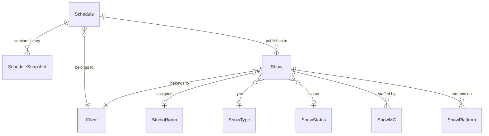
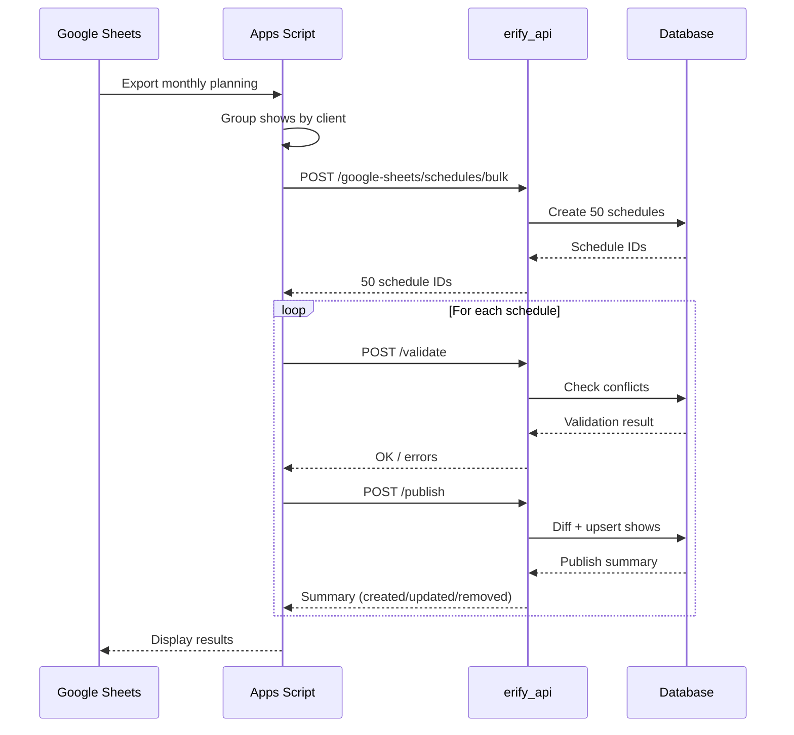

# Schedule Planning

> **TLDR**: JSON-based per-client schedule planning with snapshot versioning and optimistic locking. Schedules act both as planning documents and as date-ranged grouping containers for shows. Planners work in Google Sheets → Apps Script syncs drafts → validate → publish to normalized Show tables. One schedule per client (~50 shows each).

## Overview

The system uses **JSON documents for flexible planning** and **normalized tables for queryable published data**. Schedules go through a lifecycle of `draft` → `review` → `published`, but those statuses should be interpreted as lightweight planning markers around the latest acknowledged plan, not as universal write locks across every workflow. Automatic snapshots capture every version.

- **Update operations** (`PATCH`) only update the `planDocument` JSON column — cheap, frequent
- **Publish operations** (`POST /publish`) sync JSON to normalized Show/ShowMC/ShowPlatform tables — expensive, batched
- **Optimistic locking** via `version` column prevents concurrent update conflicts
- Schedules also serve as grouping/date-range containers for downstream studio operations, exports, and later finance workflows

> [!NOTE]
> Publish now uses identity-preserving **diff + upsert** instead of delete/recreate. See [Schedule Continuity](./SCHEDULE_CONTINUITY.md) for details.

---

## Data Model



### Schedule

| Field | Type | Description |
|-------|------|-------------|
| `planDocument` | JSON | Shows array + metadata (see below) |
| `version` | Int | Auto-increments on each update (optimistic lock) |
| `status` | Enum | `draft`, `review`, `published` planning marker for the latest acknowledged schedule state |
| `publishedAt` | DateTime? | Last publish timestamp |

### Plan Document Structure

```typescript
{
  metadata: {
    lastEditedBy: string;        // User UID
    lastEditedAt: string;        // ISO timestamp
    totalShows: number;
    clientName: string;
    dateRange: { start: string; end: string; };
  };
  shows: ShowPlanItem[];
}
```

**ShowPlanItem** fields: `tempId`, `external_id`, `name`, `startTime`, `endTime`, `clientUid`, `studioRoomUid`, `showTypeUid`, `showStatusUid`, `showStandardUid`, `mcs[]`, `platforms[]`.

### ScheduleSnapshot

Immutable version history, created automatically on every update. Snapshot reasons: `auto_save`, `manual`, `before_restore`.

---

## API Endpoints

### Schedule CRUD

| Method   | Endpoint               | Purpose |
|----------|------------------------|---------|
| `POST`   | `/admin/schedules`     | Create new schedule |
| `GET`    | `/admin/schedules`     | List schedules (plan_document excluded by default) |
| `GET`    | `/admin/schedules/:id` | Get schedule with full plan_document |
| `PATCH`  | `/admin/schedules/:id` | Update schedule plan document (creates snapshot, increments version) |
| `DELETE` | `/admin/schedules/:id` | Soft delete |

### Publishing

| Method | Endpoint | Purpose |
|--------|----------|---------|
| `POST` | `/admin/schedules/:id/validate` | Validate references, room/MC conflicts (in-schedule) |
| `POST` | `/admin/schedules/:id/publish`  | Diff + upsert to normalized Show tables |

### Bulk Operations

| Method | Endpoint | Purpose |
|--------|----------|---------|
| `POST` | `/admin/schedules/bulk` | Bulk create (one per client) |
| `PATCH` | `/admin/schedules/bulk` | Bulk update |

### Google Sheets Integration

| Method | Endpoint | Purpose |
|--------|----------|---------|
| `POST` | `/google-sheets/schedules/bulk` | Primary intake from Apps Script |
| `PATCH` | `/google-sheets/schedules/:id` | Update schedule plan with incoming sheet data |
| `POST` | `/google-sheets/schedules/:id/validate` | Validate |
| `POST` | `/google-sheets/schedules/:id/publish` | Publish |

### Supporting

| Method | Endpoint | Purpose |
|--------|----------|---------|
| `GET`  | `/admin/schedules/overview/monthly` | Schedules grouped by client and status |
| `GET`  | `/admin/schedules/:id/snapshots` | List version history |
| `GET`  | `/admin/snapshots/:id` | Get snapshot details |
| `POST` | `/admin/snapshots/:id/restore` | Restore from snapshot (draft only) |

---

## Key Workflows

### Create & Edit

1. `POST /admin/schedules` with `name`, `startDate`, `endDate`, `clientUid`
2. `GET /admin/schedules/:id` to load
3. `PATCH /admin/schedules/:id` with `planDocument` + `version` (auto-save creates snapshot)
4. On version conflict → `409 Conflict` → fetch latest, merge, retry

### Google Sheets Sync (Phase 1 Primary)

1. Planning in Google Sheets (source of truth for conflicts)
2. Apps Script groups shows by client
3. `POST /google-sheets/schedules/bulk` — create 50 schedules (~50 shows each)
4. `POST /google-sheets/schedules/:id/validate` per schedule
5. `POST /google-sheets/schedules/:id/publish` per schedule — diff + upsert

### Republish

1. `PATCH /admin/schedules/:id` — update plan_document
2. `POST /admin/schedules/:id/validate` — re-validate
3. `POST /admin/schedules/:id/publish` — diff + upsert (see [Schedule Continuity](./SCHEDULE_CONTINUITY.md))

### Restore from Snapshot

1. `GET /admin/schedules/:id/snapshots` — view available versions
2. `GET /admin/snapshots/:id` — review snapshot content
3. `POST /admin/snapshots/:id/restore` — creates `before_restore` snapshot, restores plan, increments version

---

## Validation Rules

### Per-Show

- Time range alignment: schedule planning validation may flag shows that fall outside the nominal schedule date range; exact hard enforcement for manual studio show CRUD is intentionally deferred
- Time logic: `endTime` after `startTime`
- References: all UIDs must exist (client, room, type, status, standard)
- Client consistency: all shows belong to same client

### Internal Conflicts (within schedule)

- Room conflicts: no two shows in same room with overlapping times
- MC conflicts: no MC assigned to overlapping shows

### Error Codes

| Error Code | HTTP Status | Condition |
|---|---|---|
| `VERSION_MISMATCH` | 409 | Optimistic lock conflict |
| `SEQUENTIAL_VIOLATION` | 409 | Chunk out of order (Phase 5) |
| `UPLOAD_COMPLETE` | 400 | All chunks already received (Phase 5) |
| `UPLOAD_INCOMPLETE` | 400 | Publish before all chunks (Phase 5) |

---

## Performance Targets

| Operation | Target |
|-----------|--------|
| Load schedule (50 shows) | < 500ms |
| Save draft | < 200ms |
| Publish single schedule | < 10s |
| Validate schedule | < 2s |
| Create snapshot | < 100ms |

---

## Sequence Diagram



---

## Related Documentation

- [Schedule Continuity](./SCHEDULE_CONTINUITY.md) — Diff + upsert publish, identity preservation
- [Task Management](./TASK_MANAGEMENT_SUMMARY.md) — Downstream task lifecycle
- [Business Domain](../../../docs/domain/BUSINESS.md) — Entity relationships and domain model
