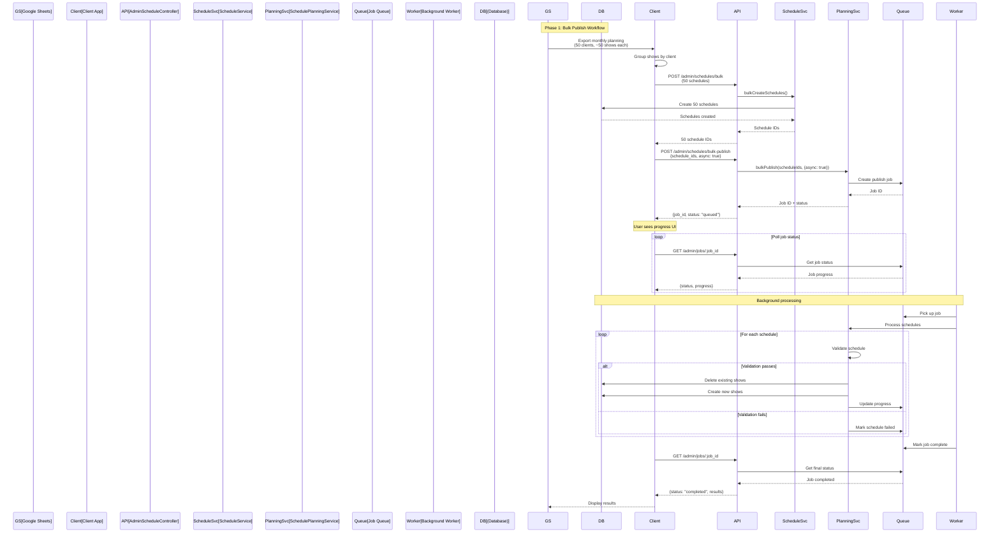
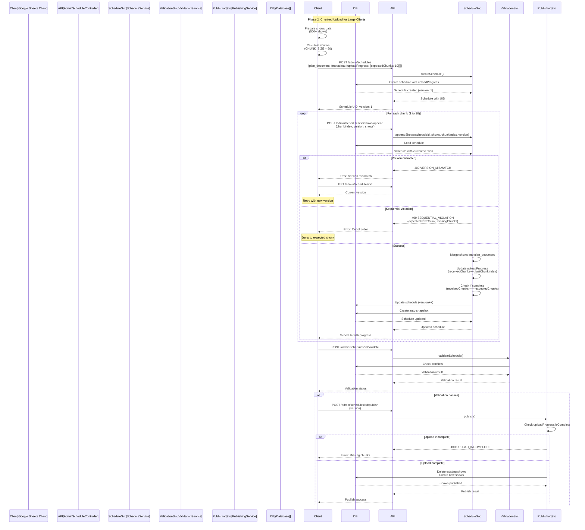

# Schedule Upload API Design - Complete System Overview

## Executive Summary

This document describes the complete architecture for a show planning system that replaces Google Sheets with a database-backed solution. The design uses **JSON documents for flexible planning** and **normalized tables for queryable published data**, with automatic snapshots for version history.

### Key Design Decisions

- ✅ **JSON planning**: Flexible, spreadsheet-like editing during draft phase
- ✅ **Snapshot-based versioning**: Automatic version history without complex tracking
- ✅ **Status-based sync**: Only published schedules sync to normalized tables
- ✅ **Delete + insert publishing**: Clean replacement strategy (no version column in shows)
- ✅ **Efficient separation**: Update operations (`PATCH`) only update `planDocument` JSON column (cheap), while publish operations (`POST /publish`) are the ONLY operations that create/delete shows (expensive, worker-friendly)
- ✅ **Optimistic locking**: Version column prevents concurrent update conflicts
- ✅ **Client-by-Client Upload Strategy** (Phase 1): One schedule per client (~50 shows each) for manageable payload sizes
- ✅ **Bulk Publish Operations** (Phase 1): Batch publish multiple schedules in single API call
- ⚠️ **Chunked Upload** (Phase 2): Deferred for edge cases with very large clients (>100 shows per client)

---

## Upload Strategies

### Phase 1: Client-by-Client Upload (✅ Implemented)

**Primary Strategy**: Create one schedule per client (~50 shows each), then bulk publish all schedules

**Rationale**:
- Typical monthly planning has ~50 clients with ~50 shows per client
- Each client schedule fits within payload limits (~1-2MB per schedule)
- **Payload size constraint**: 50 clients × 50 shows in single schedule = 2,500 shows (~2-5MB) → Risk of HTTP 417 (Payload Too Large)
- Better error isolation (one client failure doesn't affect others)
- Simpler error recovery and retry logic
- **Google Sheets is source of truth**: Conflicts resolved during planning phase in spreadsheet
- **Database is read-only for MCs**: Query assigned shows only

**Workflow**:
1. **Planning in Google Sheets**: All clients visible in monthly view, conflicts resolved before upload
2. **Group by client**: AppsScript groups shows by client (one schedule per client)
3. **Create schedules**: Bulk create API with 50 schedules (~50 shows each)
4. **Bulk publish**: Single API call to validate and publish all 50 schedules at once
5. **Async processing**: Background workers handle publish operations
6. **View monthly overview**: Query all published shows across clients

**Available Features**:
- ✅ `POST /admin/schedules` - Create schedule per client
- ✅ `POST /admin/schedules/bulk` - Bulk create schedules (one per client)
- ✅ **`POST /admin/schedules/bulk-publish`** - Bulk validate and publish multiple schedules ⭐ **NEW**
- ✅ **`GET /admin/jobs/:job_id`** - Track async publish job status ⭐ **NEW**
- ✅ `GET /admin/schedules/overview/monthly` - Monthly overview (all clients)
- ✅ `POST /admin/schedules/:id/validate` - Per-client validation
- ✅ `POST /admin/schedules/:id/publish` - Publish single schedule

**Phase 1 Benefits**:
- ✅ **93% fewer API calls**: 50 create + 1 bulk publish = 51 calls (vs 150+)
- ✅ **90% faster**: ~45 seconds total (vs ~7 minutes)
- ✅ **No timeout risk**: Well within AppsScript limits
- ✅ **Simple AppsScript**: No complex state management
- ✅ **Partial success**: Failures isolated per client
- ✅ **Async support**: Background processing for scalability

### Phase 2: Chunked Upload (⚠️ Deferred)

**Use Cases** (Edge Cases Only):
- Very large single-client schedules (>100 shows per client) - Rare
- Emergency bulk uploads with payload size constraints

**Status**: Design complete, implementation deferred. Most clients have ≤50 shows per month, making chunking unnecessary for Phase 1.

---

## Data Model Overview

### Core Entities

**Schedule**: Main planning entity containing JSON `plan_document`
- Status: `draft`, `review`, `published`
- Version: Increments on each update (optimistic locking)
- `plan_document`: JSON structure with metadata and shows array
- Relations: Client, Creator, Publisher, Snapshots, Shows

**ScheduleSnapshot**: Immutable version history
- Captures `plan_document` at specific version
- Snapshot reasons: `auto_save`, `manual`, `before_restore`
- Used for restore functionality

**Show**: Normalized table for published shows
- Created from published schedules
- Relations: Client, StudioRoom, ShowType, ShowStatus, ShowStandard, Schedule
- Related entities: ShowMC, ShowPlatform

### Plan Document Structure

The `plan_document` is a JSON structure containing:

```typescript
{
  metadata: {
    lastEditedBy: string;        // User UID
    lastEditedAt: string;        // ISO timestamp
    totalShows: number;
    clientName: string;
    dateRange: {
      start: string;             // ISO date
      end: string;               // ISO date
    };
    uploadProgress?: {          // Optional, for chunked uploads
      expectedChunks: number;
      receivedChunks: number;
      lastChunkIndex?: number;
      isComplete?: boolean;
    };
  };
  shows: ShowPlanItem[];
}
```

**ShowPlanItem** structure:
- `tempId`: UUID for client-side operations
- `existingShowUid?`: If updating existing show
- Show details: `name`, `startTime`, `endTime` (ISO datetime)
- References (UIDs): `clientUid`, `studioRoomUid`, `showTypeUid`, `showStatusUid`, `showStandardUid`
- Related entities: `mcs[]`, `platforms[]`
- `metadata?`: Additional custom data

---

## API Design

### Schedule CRUD

| Method   | Endpoint               | Purpose                                                                                                                                        |
| -------- | ---------------------- | ---------------------------------------------------------------------------------------------------------------------------------------------- |
| `POST`   | `/admin/schedules`     | Create new schedule                                                                                                                            |
| `GET`    | `/admin/schedules`     | List schedules (with filters: client_id, start_date, end_date, status) - **Note**: `plan_document` excluded by default to reduce response size |
| `GET`    | `/admin/schedules/:id` | Get schedule details (includes full `plan_document`)                                                                                           |
| `PATCH`  | `/admin/schedules/:id` | Update schedule (creates snapshot, increments version)                                                                                         |
| `DELETE` | `/admin/schedules/:id` | Soft delete schedule                                                                                                                           |

### Publishing

| Method | Endpoint                        | Purpose                                                                                                   |
| ------ | ------------------------------- | --------------------------------------------------------------------------------------------------------- |
| `POST` | `/admin/schedules/:id/validate` | Validate before publish (in-schedule conflicts only: room conflicts, MC double-booking, valid references) |
| `POST` | `/admin/schedules/:id/publish`  | Sync to normalized tables (delete + insert strategy)                                                      |

### Bulk Operations ⭐ **ENHANCED**

| Method  | Endpoint                          | Purpose                                                    |
| ------- | --------------------------------- | ---------------------------------------------------------- |
| `POST`  | `/admin/schedules/bulk`           | Bulk create schedules (one per client)                     |
| `PATCH` | `/admin/schedules/bulk`           | Bulk update schedules                                      |
| `POST`  | `/admin/schedules/bulk-publish` ⭐ | **Bulk validate and publish multiple schedules** **(NEW)** |
| `GET`   | `/admin/jobs/:job_id` ⭐           | **Track async publish job status** **(NEW)**               |

### Bulk Publish Endpoint (NEW) ⭐

**Endpoint**: `POST /admin/schedules/bulk-publish`

**Purpose**: Validate and publish multiple schedules in a single operation with async processing support

**Request Format**:
```json
{
  "schedule_ids": [
    "schedule_001",
    "schedule_002",
    // ... up to 50 schedule IDs
  ],
  "options": {
    "validate_before_publish": true,  // Default: true - Validate before publishing
    "stop_on_error": false,            // Default: false - Continue with other schedules if one fails
    "async": true                      // Default: false - Queue for background processing
  }
}
```

**Response Format (Synchronous)**:
```json
{
  "total": 50,
  "validated": 50,
  "published": 45,
  "failed": 5,
  "results": [
    {
      "schedule_id": "schedule_001",
      "status": "published",
      "show_count": 50,
      "published_at": "2025-11-04T10:00:00Z"
    },
    {
      "schedule_id": "schedule_002",
      "status": "failed",
      "error_code": "VALIDATION_ERROR",
      "validation_errors": [
        {
          "type": "room_conflict",
          "message": "Room 'Studio A' has overlapping shows",
          "show_indices": [5, 12]
        }
      ]
    }
  ]
}
```

**Response Format (Asynchronous)**:
```json
{
  "job_id": "job_abc123",
  "status": "queued",
  "check_status_url": "/admin/jobs/job_abc123",
  "total": 50
}
```

**Error Responses**:
- `400 Bad Request`: Invalid schedule IDs or options
- `404 Not Found`: One or more schedules not found
- `409 Conflict`: Version mismatch (if schedules were updated)

### Job Status Endpoint (NEW) ⭐

**Endpoint**: `GET /admin/jobs/:job_id`

**Purpose**: Track progress of async bulk publish operations

**Response Format**:
```json
{
  "job_id": "job_abc123",
  "status": "processing",  // queued | processing | completed | failed
  "created_at": "2025-11-04T10:00:00Z",
  "started_at": "2025-11-04T10:00:05Z",
  "completed_at": null,
  "total": 50,
  "progress": {
    "validated": 50,
    "published": 35,
    "failed": 2,
    "pending": 13
  },
  "results": [
    {
      "schedule_id": "schedule_001",
      "status": "published",
      "show_count": 50
    },
    {
      "schedule_id": "schedule_010",
      "status": "failed",
      "error": "Database constraint violation"
    }
  ]
}
```

**Status Values**:
- `queued`: Job created, waiting for worker
- `processing`: Currently being processed
- `completed`: All schedules processed (some may have failed)
- `failed`: Job failed completely (system error)

### Monthly Overview

| Method | Endpoint                            | Purpose                                                                                       |
| ------ | ----------------------------------- | --------------------------------------------------------------------------------------------- |
| `GET`  | `/admin/schedules/overview/monthly` | Get schedules grouped by client and status (supports client_id, start_date, end_date filters) |

### Snapshots

| Method | Endpoint                         | Purpose               |
| ------ | -------------------------------- | --------------------- |
| `GET`  | `/admin/schedules/:id/snapshots` | List version history  |
| `GET`  | `/admin/snapshots/:id`           | Get snapshot details  |
| `POST` | `/admin/snapshots/:id/restore`   | Restore from snapshot |

### Utilities

| Method | Endpoint                         | Purpose        |
| ------ | -------------------------------- | -------------- |
| `POST` | `/admin/schedules/:id/duplicate` | Clone schedule |

### Chunked Upload (Phase 2)

| Method | Endpoint                            | Purpose                                        |
| ------ | ----------------------------------- | ---------------------------------------------- |
| `POST` | `/admin/schedules/:id/shows/append` | Append shows incrementally (for large uploads) |

**Request**:
```json
{
  "shows": ShowPlanItem[],
  "chunkIndex": number,    // 1-based chunk number
  "version": number        // Current schedule version (optimistic locking)
}
```

**Response** (Success):
- Returns updated schedule with incremented version
- Updates `uploadProgress.receivedChunks` and `lastChunkIndex`
- Sets `uploadProgress.isComplete` when all chunks received

**Error Responses**:
- `409 SEQUENTIAL_VIOLATION`: Chunk out of order (includes `expectedNextChunk`, `missingChunks`)
- `409 VERSION_MISMATCH`: Version conflict (includes `currentVersion`, `receivedVersion`)
- `400 UPLOAD_COMPLETE`: All chunks already received
- `400 UPLOAD_INCOMPLETE`: Publish attempted before all chunks received

### Show Queries (Read-only)

| Method | Endpoint       | Purpose                                                                         |
| ------ | -------------- | ------------------------------------------------------------------------------- |
| `GET`  | `/admin/shows` | List shows with pagination (filters: client_id, start_date, end_date, order_by) |

### Query Parameters

**List Schedules** (`GET /admin/schedules`):
- **Pagination**: `page`, `limit`, `offset`
- **Filters** (Phase 2): `client_id`, `start_date`, `end_date`, `status`
- **Fields Control**: `include_plan_document` (boolean, default: `false`) - Include full `plan_document` in list response
  - **Rationale**: `plan_document` can be very large (hundreds of shows), making list responses too large
  - **Default Behavior**: Exclude `plan_document` from list responses to reduce payload size
  - **Use Case**: Set `include_plan_document=true` only when you need the full plan document for each schedule in the list
  - **Alternative**: Use `GET /admin/schedules/:id` to fetch individual schedule with full `plan_document`

---

## Key Workflows

### Create & Edit Schedule

1. **Create schedule**: `POST /admin/schedules` with `name`, `startDate`, `endDate`, `clientUid`
2. **Load schedule**: `GET /admin/schedules/:id`
3. **Edit shows**: User edits in spreadsheet-like UI (changes stored locally)
4. **Auto-save**: `PATCH /admin/schedules/:id` with `planDocument` and `version`
   - Backend checks version (optimistic locking)
   - Creates snapshot of old version
   - **Updates `planDocument` JSON column only** (does not create or delete shows)
   - Increments version
   - **Efficient operation**: Single JSON column update
5. **Version conflict**: If another user edited, returns `409 Conflict`
   - Frontend fetches latest version
   - User merges changes manually
   - Retries update

**Key Design Principle**:
- **Update operations (`PATCH`)**: Only update `planDocument` JSON column, never touch Show table (efficient, cheap operation)
- **Publish operations (`POST /publish`)**: **Only operation that creates/deletes shows** from normalized tables (expensive, can be queued in background workers)
- **Efficiency**: This separation allows frequent updates without expensive database operations

### Bulk Publish Schedules (Phase 1 Primary Workflow) ⭐

**This is the recommended workflow for Phase 1 Google Sheets integration**

1. **Planning Phase**: Resolve conflicts in Google Sheets (source of truth)
2. **Group by Client**: AppsScript groups shows by client
3. **Bulk Create**: `POST /admin/schedules/bulk` with 50 schedules (~50 shows each)
4. **Extract Schedule IDs**: Parse response to get schedule IDs
5. **Bulk Publish**: `POST /admin/schedules/bulk-publish` with schedule IDs and `async: true`
6. **Track Progress**: Poll `GET /admin/jobs/:job_id` to check status
7. **Handle Errors**: Review failed schedules, fix in Google Sheets, retry

**Timeline**:
- Bulk create (50 schedules): **~30 seconds**
- Bulk publish (async): **~5 seconds** (returns job ID immediately)
- Background processing: **~2-3 minutes** (doesn't block UI)
- Total perceived time: **~35 seconds** (vs ~7 minutes with old workflow)

### Publish Single Schedule (Legacy Workflow)

**This workflow is still supported but not recommended for bulk operations**

1. **Validate**: `POST /admin/schedules/:id/validate`
   - Checks room conflicts (within schedule only)
   - Checks MC double-booking (within schedule only)
   - Validates references exist
   - Validates time range constraints
   - Validates client consistency (all shows belong to same client)
2. **Publish**: `POST /admin/schedules/:id/publish` with `version`
   - **Expensive operation**: Syncs JSON `planDocument` to normalized Show tables
   - Backend in transaction:
     - **Deletes all existing shows** associated with the schedule (supports republishing)
     - **Bulk inserts new shows** from `planDocument.shows[]` JSON
     - **Bulk inserts ShowMC and ShowPlatform** relationships
     - Marks schedule as `published` (or updates if already published)
     - Increments version

### Republish Schedule

**Republishing is supported** - Schedules can be republished after adjustments to update shows:

1. **Update Schedule**: `PATCH /admin/schedules/:id` - Make adjustments to `plan_document` after initial publish
   - Auto-creates snapshot before update
   - **Updates `planDocument` JSON column only** (does not create or delete shows)
   - Increments version
   - **Efficient operation**: Single JSON column update
2. **Validate**: `POST /admin/schedules/:id/validate` - Re-validate with updated shows
3. **Republish**: `POST /admin/schedules/:id/publish` with updated `version`
   - **Expensive operation**: Syncs JSON `planDocument` to normalized Show tables
   - **Deletes all existing shows** associated with the schedule (from previous publish)
   - **Creates new shows** from updated `plan_document.shows[]`
   - Updates `publishedAt` timestamp
   - Increments version
   - **Can be queued in background workers** due to expense

**Key Points**:
- **Republishing supported**: Delete + insert strategy allows republishing published schedules
- **Clean replacement**: All existing shows for the schedule are deleted before creating new ones
- **Version tracking**: Each republish increments version and creates a snapshot
- **Adjustments after publish**: Users can update `plan_document` and republish to reflect changes
- **Implementation Note**: Current implementation blocks republishing (checks if status is 'published' and throws error). The design supports republishing, but the implementation needs to be updated to allow republishing published schedules.

### Restore from Snapshot

**Purpose**: Revert a schedule to a previous version using snapshot history for rollback capabilities

**Use Cases**:
- Undo accidental changes or mistakes during planning
- Revert to a known good state after validation errors
- Restore from a previous version before making new changes
- Recover from corrupted or invalid plan documents
- Rollback after unsuccessful updates

**Workflow**:
1. **List Snapshots**: `GET /admin/schedules/:id/snapshots` - View all available snapshots for a schedule
   - Returns snapshots sorted by creation date (newest first)
   - Each snapshot includes: `uid`, `version`, `snapshotReason`, `createdAt`, `createdBy`
   - Snapshot reasons: `auto_save`, `manual`, `before_restore`

2. **Get Snapshot Details**: `GET /admin/snapshots/:id` - View specific snapshot details
   - Returns full snapshot with `planDocument`, `version`, `status`, `snapshotReason`
   - Includes schedule and user information
   - Use to review snapshot content before restoring

3. **Restore from Snapshot**: `POST /admin/snapshots/:id/restore`
   - Request body: `{ user_id: string }` - User UID performing the restore
   - **Important**: Cannot restore published schedules (must unpublish first)
   - Backend in transaction:
     - Creates `before_restore` snapshot of current state (for rollback)
     - Restores `planDocument` from snapshot
     - Increments version
     - Updates `updatedAt` timestamp
   - Returns restored schedule with relations

**Error Handling**:
- **404 Not Found**: Snapshot or schedule not found
- **400 Bad Request**: Cannot restore published schedules (must unpublish first)
- **Recovery**: If restore fails, use the `before_restore` snapshot to rollback

**Key Points**:
- **Restore creates rollback snapshot**: Always creates `before_restore` snapshot before restoring
- **Version increments**: Restore increments version to maintain version history
- **Draft/Review only**: Cannot restore published schedules (must unpublish first)
- **Audit trail**: All restore operations are tracked via snapshots
- **Rollback capability**: `before_restore` snapshot enables undoing a restore if needed

**Example Workflow**:
```typescript
// 1. List snapshots to find the version to restore
const snapshots = await GET('/admin/schedules/schedule_001/snapshots');
// Returns: [{ uid: 'snapshot_001', version: 5, reason: 'auto_save', ... }, ...]

// 2. Get snapshot details to review
const snapshot = await GET('/admin/snapshots/snapshot_001');
// Returns: { planDocument: {...}, version: 5, ... }

// 3. Restore from snapshot
const restored = await POST('/admin/snapshots/snapshot_001/restore', {
  user_id: 'user_001'
});
// Returns: Restored schedule with updated planDocument and incremented version
// Creates 'before_restore' snapshot automatically
```

### Chunked Upload (Phase 2)

1. **Create empty schedule**: `POST /admin/schedules` with `uploadProgress.expectedChunks`
2. **Upload chunks sequentially**: `POST /admin/schedules/:id/shows/append`
   - Each chunk must be uploaded in order (1, 2, 3, ...)
   - Server validates sequential order and version
   - Updates `uploadProgress` after each chunk
3. **Check progress**: `GET /admin/schedules/:id` to see `uploadProgress`
4. **Resume after interruption**: Check `uploadProgress.receivedChunks` and continue from next chunk
5. **Validate**: `POST /admin/schedules/:id/validate` (validates all shows)
6. **Publish**: `POST /admin/schedules/:id/publish` (only if `uploadProgress.isComplete`)

---

## Validation Rules

### Schedule Validation

**Phase 1: Per-Client Validation (In-Schedule Only)**

**Per-Show Validation**:
- Time range: Show must be within schedule date range
- Time logic: End time must be after start time
- References: All UIDs (client, room, type, status, standard) must exist
- Client consistency: All shows in schedule must belong to the same client (Phase 1 requirement)

**Internal Conflicts** (within schedule only):
- Room conflicts: No two shows in same room with overlapping times **within the same schedule**
- MC conflicts: No MC assigned to overlapping shows **within the same schedule**

**Phase 1 Scope**:
- ✅ **In-Schedule Validation**: Checks conflicts only within the schedule being validated
- ⚠️ **Cross-Schedule Validation**: **Deferred to Phase 2** - Conflicts with shows in other published schedules are not checked
- **Rationale**: Google Sheets is the source of truth during planning phase, and conflicts are resolved before upload. Cross-schedule validation will be added in Phase 2 for bulk publish operations.

**Phase 2: Cross-Schedule Validation** (Future Enhancement):
- Room availability: No conflicts with existing published shows in same room (across all schedules)
- MC availability: No double-booking for same MC at overlapping times (across all schedules)

**Chunked Upload Validation** (Phase 2):
- Chunk index must be sequential: `chunkIndex === (lastChunkIndex ?? 0) + 1`
- Version must match: `version === schedule.version`
- Upload not complete: `!uploadProgress.isComplete`
- Schedule must be draft: `schedule.status === 'draft'`

### Error Codes

| Error Code             | HTTP Status     | Condition                           | Recovery Action                       |
| ---------------------- | --------------- | ----------------------------------- | ------------------------------------- |
| `SEQUENTIAL_VIOLATION` | 409 Conflict    | Chunk out of order                  | Upload missing chunks first           |
| `VERSION_MISMATCH`     | 409 Conflict    | Version conflict                    | Refresh schedule and retry            |
| `UPLOAD_COMPLETE`      | 400 Bad Request | All chunks received                 | No action needed, proceed to validate |
| `UPLOAD_INCOMPLETE`    | 400 Bad Request | Publish before all chunks           | Upload remaining chunks first         |
| `INVALID_CHUNK_INDEX`  | 400 Bad Request | Chunk index < 1 or > expectedChunks | Fix chunk index                       |

---

## Multi-Client Monthly Overviews

### Overview

For monthly overviews with shows from multiple clients (e.g., 500+ shows from 10+ clients), the chunked upload approach supports a **single schedule** containing shows from **multiple clients**.

### Key Concepts

1. **Schedule's `client_id`**:
   - Can be `null` for multi-client monthly overviews
   - OR set to a primary client (first client in the list)
   - This is the schedule's "owner" but doesn't restrict which clients' shows can be in the schedule

2. **Individual Show's `clientUid`**:
   - Each show in `plan_document.shows[]` has its own `clientUid` field
   - Shows from different clients can be mixed in the same chunk
   - Server validates and merges all shows regardless of client

3. **Metadata**:
   - Set `metadata.clientName` to `"Monthly Overview"` to indicate multi-client
   - This is a display name, not a restriction

### Validation Considerations

**Phase 1 (Per-Client Schedules)**:
- Each schedule contains shows from a single client only
- Validation checks conflicts **within the schedule only** (in-schedule validation)
- Cross-schedule validation (conflicts with other published schedules) is **not checked** in Phase 1
- Google Sheets is the source of truth during planning phase, and conflicts are resolved before upload

**Phase 2 (Multi-Client Schedules)**:
When validating a multi-client schedule (Phase 2 feature):
- **Room conflicts**: Checked across **all shows in the schedule** regardless of client
- **MC double-booking**: Checked across **all shows in the schedule** regardless of client
- **Data integrity**: All shows in the schedule are validated together
- **Cross-schedule validation**: Will check conflicts with other published schedules (Phase 2 enhancement)

This ensures that shows from different clients don't conflict with each other within the same schedule (e.g., same MC can't be in two shows at the same time, even if they're from different clients).

### Google Sheets Structure

**Option 1: Single Sheet with Client Column** (Recommended)
- Use a single "Shows" sheet with a `clientUid` column
- Each row specifies which client the show belongs to
- All shows are uploaded to the same schedule

**Option 2: Separate Sheets per Client**
- Create separate sheets for each client (e.g., "Client1", "Client2")
- Combine all shows before uploading
- Use a single schedule for the monthly overview

---

## Design Principles

1. **Keep It Simple**: Use existing patterns, don't introduce new concepts
2. **RESTful**: Standard HTTP verbs and status codes
3. **Stateless**: All state in the schedule document (no separate session)
4. **Backward Compatible**: Single upload flow still works
5. **Client-Friendly**: Clear error messages guide recovery
6. **Extendable**: Can add features without breaking changes

### Why This Design?

**Advantages**:
- **Simple**: One new endpoint for chunked uploads (`POST /admin/schedules/:id/shows/append`)
- **RESTful**: Uses existing schedule resource, standard HTTP codes
- **Stateless**: No server-side session management, easy to scale
- **Backward Compatible**: Single upload flow unchanged, optional feature
- **Client-Friendly**: Clear errors, check progress anytime, easy resume
- **Extendable**: Can add features (parallel chunks, webhooks) without breaking changes

**Alternative Approaches Considered**:
- Separate upload session pattern (`/upload/start`, `/upload/chunk`, `/upload/complete`, `/upload/cancel`)
  - ❌ 4 new endpoints vs 1
  - ❌ Requires session state management
  - ❌ More complex implementation
  - ❌ Not RESTful (artificial "upload" resource)

---

## Performance Targets

| Operation                       | Target     | Notes                     |
| ------------------------------- | ---------- | ------------------------- |
| Load schedule (50 shows)        | < 500ms    | Single JSON query         |
| Save draft                      | < 200ms    | Update JSON + snapshot    |
| Publish single schedule         | < 10s      | Delete + bulk insert      |
| **Bulk publish (50 schedules)** | **< 3min** | **Background processing** |
| Validate schedule               | < 2s       | Parallel validation       |
| MC query (paginated)            | < 300ms    | Indexed query             |
| Create snapshot                 | < 100ms    | JSON copy                 |

---

## Sequence Diagrams

### Bulk Publish Sequence (Phase 1) ⭐



### Chunked Upload Sequence (Phase 2)



---

## Summary

### Architecture Overview

```
┌─────────────────────────────────────────────────────────────┐
│                         FRONTEND                            │
│  - Google Sheets (Planning Source of Truth)                │
│  - AppsScript (Bulk Upload)                                │
│  - Progress Tracking UI                                     │
└─────────────────────────────────────────────────────────────┘
                              │
                              ▼
┌─────────────────────────────────────────────────────────────┐
│                       REST API                              │
│  - Schedule CRUD operations                                 │
│  - Bulk create (50 schedules)                              │
│  - Bulk publish (1 API call) ⭐ NEW                          │
│  - Job status tracking ⭐ NEW                               │
└─────────────────────────────────────────────────────────────┘
                              │
                              ▼
┌─────────────────────────────────────────────────────────────┐
│                     BACKGROUND WORKERS                      │
│  - Async publish processing                                 │
│  - Batch validation                                         │
│  - Show creation (normalized tables)                        │
└─────────────────────────────────────────────────────────────┘
                              │
                              ▼
┌─────────────────────────────────────────────────────────────┐
│                        DATABASE                             │
│  PLANNING PHASE:                                            │
│  - Schedule table (JSON planDocument)                       │
│  - ScheduleSnapshot table (version history)                │
│                                                             │
│  PUBLISHED PHASE:                                           │
│  - Show, ShowMC, ShowPlatform (normalized)                 │
└─────────────────────────────────────────────────────────────┘
```

### Key Features

- ✅ **JSON-based planning** - Flexible, spreadsheet-like
- ✅ **Automatic snapshots** - Every update creates version history
- ✅ **Optimistic locking** - Version column prevents conflicts
- ✅ **Status-based sync** - Only published schedules sync to tables
- ✅ **Delete + insert publishing** - Clean replacement strategy
- ✅ **Republishing supported** - Schedules can be republished after adjustments to update shows
- ✅ **Validation before publish** - Catch errors early
- ✅ **Client-by-client upload** - Manageable payload sizes
- ✅ **Bulk publish operations** ⭐ - Dramatically improved efficiency
- ✅ **Async processing** ⭐ - No timeout risk
- ✅ **Partial success handling** ⭐ - Failures isolated per client

### Implementation Status

**Phase 1** (✅ Implemented):
- Core Schedule CRUD
- Bulk create operations
- Single schedule validation and publishing
- Snapshots and restore
- Monthly overview
- **Bulk publish endpoint** ⭐ **NEW**
- **Job status tracking** ⭐ **NEW**

**Phase 2** (⚠️ Deferred):
- Cross-client validation endpoint
- Chunked upload (for edge cases with very large clients)
- Enhanced error reporting with row numbers
- Email notifications for completed jobs

---

## Related Documentation

- **Testing Guide**: See [test-payloads/README.md](../test-payloads/README.md) for testing workflow
- **Phase 1 Roadmap**: See [roadmap/PHASE_1.md](./roadmap/PHASE_1.md) for implementation plan
- **Phase 2 Roadmap**: See [roadmap/PHASE_2.md](./roadmap/PHASE_2.md) for chunked upload implementation
