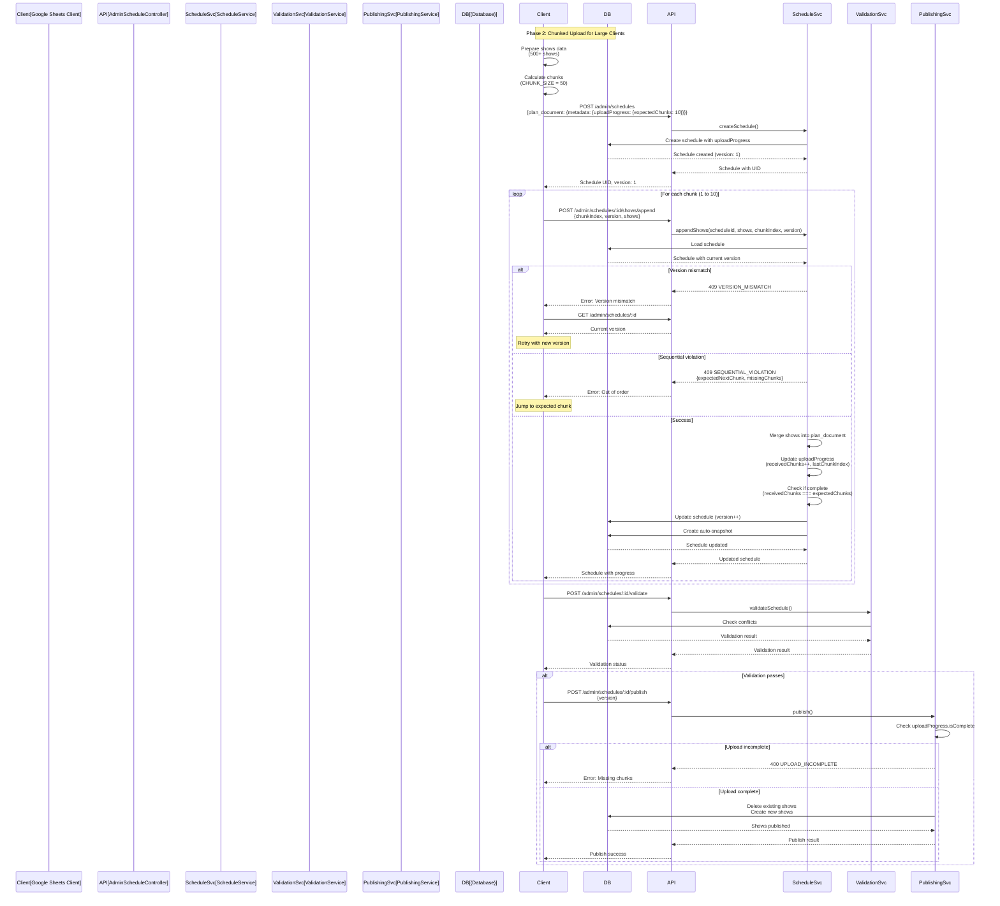

# Schedule Upload API Design - Complete System Overview

## Executive Summary

This document describes the complete architecture for a show planning system that replaces Google Sheets with a database-backed solution. The design uses **JSON documents for flexible planning** and **normalized tables for queryable published data**, with automatic snapshots for version history.

### Key Design Decisions

- ✅ **JSON planning**: Flexible, spreadsheet-like editing during draft phase
- ✅ **Snapshot-based versioning**: Automatic version history without complex tracking
- ✅ **Status-based sync**: Only published schedules sync to normalized tables
- ✅ **Delete + insert publishing**: Clean replacement strategy (no version column in shows)
- ✅ **Efficient separation**: Update operations (`PATCH`) only update `planDocument` JSON column (cheap), while publish operations (`POST /publish`) are the ONLY operations that create/delete shows (expensive, worker-friendly)
- ✅ **Optimistic locking**: Version column prevents concurrent update conflicts
- ✅ **Client-by-Client Upload** (Phase 1): One schedule per client (~100 shows each) for simpler workflow
- ✅ **Async Publishing**: Queue-based publishing per client for scalability
- ⚠️ **Chunked Upload** (Phase 2): Deferred for large clients (>200 shows per client) or multi-client monthly overviews

---

## Upload Strategies

### Phase 1: Client-by-Client Upload (✅ Implemented)

**Primary Strategy**: Create one schedule per client (~100 shows each)

**Rationale**:
- Typical monthly planning has ~10 clients with ~100 shows per client
- Each client schedule fits comfortably within payload limits
- No chunking logic needed (simpler implementation)
- Better error isolation (one client failure doesn't affect others)
- Simpler Google Sheets integration

**Workflow**:
1. Group shows by client in Google Sheets (AppsScript)
2. Create schedule for each client (~100 shows)
3. Validate per-client (room conflicts, MC double-booking within client)
4. Queue publish jobs (async worker)
5. Publish all schedules (background processing)
6. View monthly overview (grouped by client)

**Available Features**:
- ✅ `POST /admin/schedules` - Create schedule per client
- ✅ `POST /admin/schedules/bulk` - Bulk create schedules (one per client)
- ✅ `GET /admin/schedules/overview/monthly` - Monthly overview (grouped by client)
- ✅ `POST /admin/schedules/:id/validate` - Per-client validation
- ✅ `POST /admin/schedules/:id/publish` - Publish schedule (can be queued)

**Phase 1 Limitations**:
- ❌ No chunked upload (large clients with >200 shows not supported)

### Phase 2: Chunked Upload (⚠️ Deferred)

**Use Cases**:
- Large single-client schedules (>200 shows per client)
- Multi-client monthly overviews (500+ shows from 10+ clients in single schedule)

**Key Principle**: Create ONE schedule for the monthly overview (all clients), then upload shows incrementally in chunks.

**Workflow**:
1. Create empty schedule with `uploadProgress` metadata
2. Upload chunks incrementally: `POST /admin/schedules/:id/shows/append`
3. Review complete schedule: `GET /admin/schedules/:id`
4. Validate: `POST /admin/schedules/:id/validate` (checks conflicts across all clients)
5. Publish: `POST /admin/schedules/:id/publish` when ready

**Benefits**:
- ✅ Single schedule for monthly overview (all clients visible)
- ✅ Can review complete schedule before validation/publish
- ✅ Handles large datasets without payload size limits
- ✅ Better user experience with progress tracking
- ✅ Validation works across all clients (MC conflicts, room conflicts)

**Status**: ✅ Design Complete, ⚠️ Implementation Deferred to Phase 2

---

## Data Model Overview

### Core Entities

**Schedule**: Main planning entity containing JSON `plan_document`
- Status: `draft`, `review`, `published`
- Version: Increments on each update (optimistic locking)
- `plan_document`: JSON structure with metadata and shows array
- Relations: Client, Creator, Publisher, Snapshots, Shows

**ScheduleSnapshot**: Immutable version history
- Captures `plan_document` at specific version
- Snapshot reasons: `auto_save`, `before_publish`, `manual`, `before_restore`
- Used for restore functionality

**Show**: Normalized table for published shows
- Created from published schedules
- Relations: Client, StudioRoom, ShowType, ShowStatus, ShowStandard, Schedule
- Related entities: ShowMC, ShowPlatform

### Plan Document Structure

The `plan_document` is a JSON structure containing:

```typescript
{
  metadata: {
    lastEditedBy: string;        // User UID
    lastEditedAt: string;        // ISO timestamp
    totalShows: number;
    clientName: string;
    dateRange: {
      start: string;             // ISO date
      end: string;               // ISO date
    };
    uploadProgress?: {          // Optional, for chunked uploads
      expectedChunks: number;
      receivedChunks: number;
      lastChunkIndex?: number;
      isComplete?: boolean;
    };
  };
  shows: ShowPlanItem[];
}
```

**ShowPlanItem** structure:
- `tempId`: UUID for client-side operations
- `existingShowUid?`: If updating existing show
- Show details: `name`, `startTime`, `endTime` (ISO datetime)
- References (UIDs): `clientUid`, `studioRoomUid`, `showTypeUid`, `showStatusUid`, `showStandardUid`
- Related entities: `mcs[]`, `platforms[]`
- `metadata?`: Additional custom data

---

## API Design

### Schedule CRUD

| Method   | Endpoint               | Purpose                                                                                                                                        |
| -------- | ---------------------- | ---------------------------------------------------------------------------------------------------------------------------------------------- |
| `POST`   | `/admin/schedules`     | Create new schedule                                                                                                                            |
| `GET`    | `/admin/schedules`     | List schedules (with filters: client_id, start_date, end_date, status) - **Note**: `plan_document` excluded by default to reduce response size |
| `GET`    | `/admin/schedules/:id` | Get schedule details (includes full `plan_document`)                                                                                           |
| `PATCH`  | `/admin/schedules/:id` | Update schedule (creates snapshot, increments version)                                                                                         |
| `DELETE` | `/admin/schedules/:id` | Soft delete schedule                                                                                                                           |

### Publishing

| Method | Endpoint                        | Purpose                                                                       |
| ------ | ------------------------------- | ----------------------------------------------------------------------------- |
| `POST` | `/admin/schedules/:id/validate` | Validate before publish (room conflicts, MC double-booking, valid references) |
| `POST` | `/admin/schedules/:id/publish`  | Sync to normalized tables (delete + insert strategy)                          |

### Bulk Operations

| Method  | Endpoint                | Purpose                                |
| ------- | ----------------------- | -------------------------------------- |
| `POST`  | `/admin/schedules/bulk` | Bulk create schedules (one per client) |
| `PATCH` | `/admin/schedules/bulk` | Bulk update schedules                  |

### Monthly Overview

| Method | Endpoint                            | Purpose                                                                                       |
| ------ | ----------------------------------- | --------------------------------------------------------------------------------------------- |
| `GET`  | `/admin/schedules/overview/monthly` | Get schedules grouped by client and status (supports client_id, start_date, end_date filters) |

### Snapshots

| Method | Endpoint                         | Purpose               |
| ------ | -------------------------------- | --------------------- |
| `GET`  | `/admin/schedules/:id/snapshots` | List version history  |
| `GET`  | `/admin/snapshots/:id`           | Get snapshot details  |
| `POST` | `/admin/snapshots/:id/restore`   | Restore from snapshot |

### Utilities

| Method | Endpoint                         | Purpose        |
| ------ | -------------------------------- | -------------- |
| `POST` | `/admin/schedules/:id/duplicate` | Clone schedule |

### Chunked Upload (Phase 2)

| Method | Endpoint                            | Purpose                                        |
| ------ | ----------------------------------- | ---------------------------------------------- |
| `POST` | `/admin/schedules/:id/shows/append` | Append shows incrementally (for large uploads) |

**Request**:
```json
{
  "shows": ShowPlanItem[],
  "chunkIndex": number,    // 1-based chunk number
  "version": number        // Current schedule version (optimistic locking)
}
```

**Response** (Success):
- Returns updated schedule with incremented version
- Updates `uploadProgress.receivedChunks` and `lastChunkIndex`
- Sets `uploadProgress.isComplete` when all chunks received

**Error Responses**:
- `409 SEQUENTIAL_VIOLATION`: Chunk out of order (includes `expectedNextChunk`, `missingChunks`)
- `409 VERSION_MISMATCH`: Version conflict (includes `currentVersion`, `receivedVersion`)
- `400 UPLOAD_COMPLETE`: All chunks already received
- `400 UPLOAD_INCOMPLETE`: Publish attempted before all chunks received

### Show Queries (Read-only)

| Method | Endpoint       | Purpose                                                                         |
| ------ | -------------- | ------------------------------------------------------------------------------- |
| `GET`  | `/admin/shows` | List shows with pagination (filters: client_id, start_date, end_date, order_by) |

### Query Parameters

**List Schedules** (`GET /admin/schedules`):
- **Pagination**: `page`, `limit`, `offset`
- **Filters** (Phase 2): `client_id`, `start_date`, `end_date`, `status`
- **Fields Control**: `include_plan_document` (boolean, default: `false`) - Include full `plan_document` in list response
  - **Rationale**: `plan_document` can be very large (hundreds of shows), making list responses too large
  - **Default Behavior**: Exclude `plan_document` from list responses to reduce payload size
  - **Use Case**: Set `include_plan_document=true` only when you need the full plan document for each schedule in the list
  - **Alternative**: Use `GET /admin/schedules/:id` to fetch individual schedule with full `plan_document`

---

## Key Workflows

### Create & Edit Schedule

1. **Create schedule**: `POST /admin/schedules` with `name`, `startDate`, `endDate`, `clientUid`
2. **Load schedule**: `GET /admin/schedules/:id`
3. **Edit shows**: User edits in spreadsheet-like UI (changes stored locally)
4. **Auto-save**: `PATCH /admin/schedules/:id` with `planDocument` and `version`
   - Backend checks version (optimistic locking)
   - Creates snapshot of old version
   - **Updates `planDocument` JSON column only** (does not create or delete shows)
   - Increments version
   - **Efficient operation**: Single JSON column update
5. **Version conflict**: If another user edited, returns `409 Conflict`
   - Frontend fetches latest version
   - User merges changes manually
   - Retries update

**Key Design Principle**:
- **Update operations (`PATCH`)**: Only update `planDocument` JSON column, never touch Show table (efficient, cheap operation)
- **Publish operations (`POST /publish`)**: **Only operation that creates/deletes shows** from normalized tables (expensive, can be queued in background workers)
- **Efficiency**: This separation allows frequent updates without expensive database operations

### Publish Schedule

**This is the only operation that creates/deletes shows** from the normalized Show tables. All other operations (`PATCH /admin/schedules/:id`) only update the `planDocument` JSON column.

1. **Validate**: `POST /admin/schedules/:id/validate`
   - Checks room conflicts
   - Checks MC double-booking
   - Validates references exist
   - Validates time range constraints
2. **Publish**: `POST /admin/schedules/:id/publish` with `version`
   - **Expensive operation**: Syncs JSON `planDocument` to normalized Show tables
   - Backend in transaction:
     - Creates snapshot
     - **Deletes all existing shows** associated with the schedule (supports republishing)
     - **Bulk inserts new shows** from `planDocument.shows[]` JSON
     - **Bulk inserts ShowMC and ShowPlatform** relationships
     - Marks schedule as `published` (or updates if already published)
     - Increments version
   - **Can be queued in background workers** due to expense

### Republish Schedule

**Republishing is supported** - Schedules can be republished after adjustments to update shows:

1. **Update Schedule**: `PATCH /admin/schedules/:id` - Make adjustments to `plan_document` after initial publish
   - Auto-creates snapshot before update
   - **Updates `planDocument` JSON column only** (does not create or delete shows)
   - Increments version
   - **Efficient operation**: Single JSON column update
2. **Validate**: `POST /admin/schedules/:id/validate` - Re-validate with updated shows
3. **Republish**: `POST /admin/schedules/:id/publish` with updated `version`
   - **Expensive operation**: Syncs JSON `planDocument` to normalized Show tables
   - **Deletes all existing shows** associated with the schedule (from previous publish)
   - **Creates new shows** from updated `plan_document.shows[]`
   - Updates `publishedAt` timestamp
   - Increments version
   - **Can be queued in background workers** due to expense

**Key Points**:
- **Republishing supported**: Delete + insert strategy allows republishing published schedules
- **Clean replacement**: All existing shows for the schedule are deleted before creating new ones
- **Version tracking**: Each republish increments version and creates a snapshot
- **Adjustments after publish**: Users can update `plan_document` and republish to reflect changes
- **Implementation Note**: Current implementation blocks republishing (checks if status is 'published' and throws error). The design supports republishing, but the implementation needs to be updated to allow republishing published schedules.

### Chunked Upload (Phase 2)

1. **Create empty schedule**: `POST /admin/schedules` with `uploadProgress.expectedChunks`
2. **Upload chunks sequentially**: `POST /admin/schedules/:id/shows/append`
   - Each chunk must be uploaded in order (1, 2, 3, ...)
   - Server validates sequential order and version
   - Updates `uploadProgress` after each chunk
3. **Check progress**: `GET /admin/schedules/:id` to see `uploadProgress`
4. **Resume after interruption**: Check `uploadProgress.receivedChunks` and continue from next chunk
5. **Validate**: `POST /admin/schedules/:id/validate` (validates all shows)
6. **Publish**: `POST /admin/schedules/:id/publish` (only if `uploadProgress.isComplete`)

---

## Validation Rules

### Schedule Validation

**Per-Show Validation**:
- Time range: Show must be within schedule date range
- Time logic: End time must be after start time
- Room availability: No conflicts with existing shows in same room
- MC availability: No double-booking for same MC at overlapping times
- References: All UIDs (client, room, type, status, standard) must exist

**Internal Conflicts** (within schedule):
- Room conflicts: No two shows in same room with overlapping times
- MC conflicts: No MC assigned to overlapping shows

**Chunked Upload Validation** (Phase 2):
- Chunk index must be sequential: `chunkIndex === (lastChunkIndex ?? 0) + 1`
- Version must match: `version === schedule.version`
- Upload not complete: `!uploadProgress.isComplete`
- Schedule must be draft: `schedule.status === 'draft'`

### Error Codes

| Error Code             | HTTP Status     | Condition                           | Recovery Action                       |
| ---------------------- | --------------- | ----------------------------------- | ------------------------------------- |
| `SEQUENTIAL_VIOLATION` | 409 Conflict    | Chunk out of order                  | Upload missing chunks first           |
| `VERSION_MISMATCH`     | 409 Conflict    | Version conflict                    | Refresh schedule and retry            |
| `UPLOAD_COMPLETE`      | 400 Bad Request | All chunks received                 | No action needed, proceed to validate |
| `UPLOAD_INCOMPLETE`    | 400 Bad Request | Publish before all chunks           | Upload remaining chunks first         |
| `INVALID_CHUNK_INDEX`  | 400 Bad Request | Chunk index < 1 or > expectedChunks | Fix chunk index                       |

---

## Multi-Client Monthly Overviews

### Overview

For monthly overviews with shows from multiple clients (e.g., 500+ shows from 10+ clients), the chunked upload approach supports a **single schedule** containing shows from **multiple clients**.

### Key Concepts

1. **Schedule's `client_id`**:
   - Can be `null` for multi-client monthly overviews
   - OR set to a primary client (first client in the list)
   - This is the schedule's "owner" but doesn't restrict which clients' shows can be in the schedule

2. **Individual Show's `clientUid`**:
   - Each show in `plan_document.shows[]` has its own `clientUid` field
   - Shows from different clients can be mixed in the same chunk
   - Server validates and merges all shows regardless of client

3. **Metadata**:
   - Set `metadata.clientName` to `"Monthly Overview"` to indicate multi-client
   - This is a display name, not a restriction

### Validation Considerations

When validating a multi-client schedule:
- **Room conflicts**: Checked across **all shows** regardless of client
- **MC double-booking**: Checked across **all shows** regardless of client
- **Data integrity**: All shows in the schedule are validated together

This ensures that shows from different clients don't conflict with each other (e.g., same MC can't be in two shows at the same time, even if they're from different clients).

### Google Sheets Structure

**Option 1: Single Sheet with Client Column** (Recommended)
- Use a single "Shows" sheet with a `clientUid` column
- Each row specifies which client the show belongs to
- All shows are uploaded to the same schedule

**Option 2: Separate Sheets per Client**
- Create separate sheets for each client (e.g., "Client1", "Client2")
- Combine all shows before uploading
- Use a single schedule for the monthly overview

---

## Design Principles

1. **Keep It Simple**: Use existing patterns, don't introduce new concepts
2. **RESTful**: Standard HTTP verbs and status codes
3. **Stateless**: All state in the schedule document (no separate session)
4. **Backward Compatible**: Single upload flow still works
5. **Client-Friendly**: Clear error messages guide recovery
6. **Extendable**: Can add features without breaking changes

### Why This Design?

**Advantages**:
- **Simple**: One new endpoint for chunked uploads (`POST /admin/schedules/:id/shows/append`)
- **RESTful**: Uses existing schedule resource, standard HTTP codes
- **Stateless**: No server-side session management, easy to scale
- **Backward Compatible**: Single upload flow unchanged, optional feature
- **Client-Friendly**: Clear errors, check progress anytime, easy resume
- **Extendable**: Can add features (parallel chunks, webhooks) without breaking changes

**Alternative Approaches Considered**:
- Separate upload session pattern (`/upload/start`, `/upload/chunk`, `/upload/complete`, `/upload/cancel`)
  - ❌ 4 new endpoints vs 1
  - ❌ Requires session state management
  - ❌ More complex implementation
  - ❌ Not RESTful (artificial "upload" resource)

---

## Performance Targets

| Operation                  | Target  | Notes                  |
| -------------------------- | ------- | ---------------------- |
| Load schedule (1000 shows) | < 500ms | Single JSON query      |
| Save draft                 | < 200ms | Update JSON + snapshot |
| Publish 1000 shows         | < 10s   | Delete + bulk insert   |
| Validate schedule          | < 2s    | Parallel validation    |
| MC query (paginated)       | < 300ms | Indexed query          |
| Create snapshot            | < 100ms | JSON copy              |

---

## Sequence Diagrams

### Chunked Upload Sequence (Phase 2)



---

## Summary

### Architecture Overview

```
┌─────────────────────────────────────────────────────────────┐
│                         FRONTEND                            │
│  - Spreadsheet-like UI                                      │
│  - Auto-save every 30s                                     │
│  - Optimistic locking with retry                            │
│  - Client-side validation                                   │
└─────────────────────────────────────────────────────────────┘
                              │
                              ▼
┌─────────────────────────────────────────────────────────────┐
│                       REST API                              │
│  - Schedule CRUD operations                                 │
│  - Validation and publishing                                │
│  - Chunked upload (Phase 2)                                 │
└─────────────────────────────────────────────────────────────┘
                              │
                              ▼
┌─────────────────────────────────────────────────────────────┐
│                        DATABASE                             │
│  PLANNING PHASE:                                            │
│  - Schedule table (JSON planDocument)                       │
│  - ScheduleSnapshot table (version history)                │
│                                                             │
│  PUBLISHED PHASE:                                           │
│  - Show, ShowMC, ShowPlatform (normalized)                 │
└─────────────────────────────────────────────────────────────┘
```

### Key Features

- ✅ **JSON-based planning** - Flexible, spreadsheet-like
- ✅ **Automatic snapshots** - Every update creates version history
- ✅ **Optimistic locking** - Version column prevents conflicts
- ✅ **Status-based sync** - Only published schedules sync to tables
- ✅ **Delete + insert publishing** - Clean replacement strategy
- ✅ **Republishing supported** - Schedules can be republished after adjustments to update shows
- ✅ **Validation before publish** - Catch errors early
- ✅ **MC queries on normalized tables** - Fast, paginated
- ✅ **Chunked upload support** (Phase 2) - Handle large monthly overviews with hundreds of shows from multiple clients

### Implementation Status

**Phase 1** (✅ Implemented):
- Core Schedule CRUD
- Bulk operations
- Validation and publishing
- Snapshots and restore
- Monthly overview

**Phase 2** (⚠️ Deferred):
- Chunked upload endpoint
- Sequential tracking
- Error recovery for out-of-order uploads
- Multi-client monthly overviews

---

## Related Documentation

- **Testing Guide**: See [test-payloads/README.md](../test-payloads/README.md) for testing workflow
- **Phase 1 Roadmap**: See [roadmap/PHASE_1.md](./roadmap/PHASE_1.md) for implementation plan
- **Phase 2 Roadmap**: See [roadmap/PHASE_2.md](./roadmap/PHASE_2.md) for chunked upload implementation
