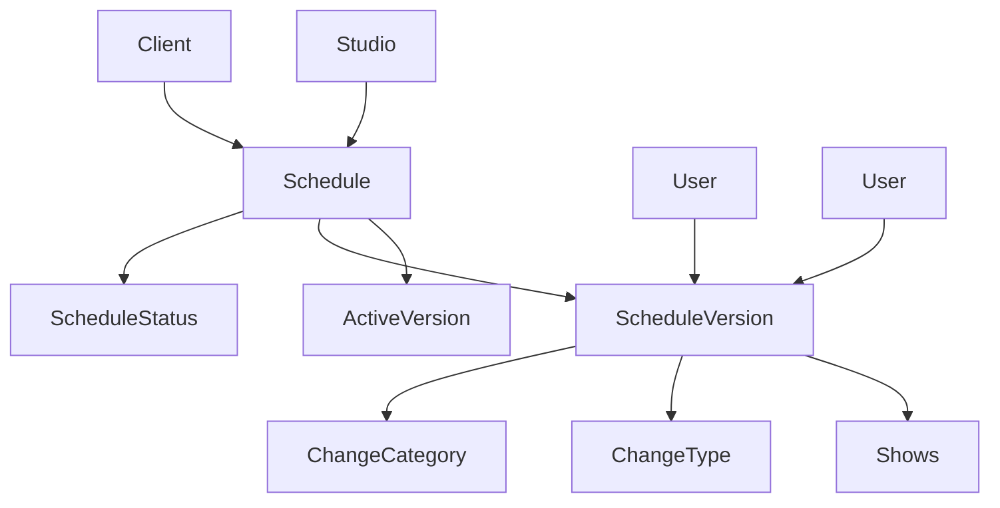

# Show Scheduling & Versioning Architecture

## Overview

The Eridu Services scheduling system is designed to handle complex livestream production workflows where operators plan and release shows, group them into schedules, and manage changes due to client requests or operational needs while maintaining complete audit trails.

## Core Design Principles

### 1. **Separation of Planning vs Execution**
- **Schedules**: High-level planning containers for related shows
- **Shows**: Individual livestream events with specific execution details
- **ScheduleVersions**: Immutable snapshots capturing changes over time

### 2. **Immutable Versioning Pattern**
- Every schedule change creates a new `ScheduleVersion`
- Previous versions remain intact for audit and rollback capabilities
- Shows reference specific schedule versions to maintain consistency

### 3. **Change Tracking & Approval Workflow**
- All changes are categorized and typed for business intelligence
- Client approval requirements are tracked per change
- Complete audit trail from creation to approval

## Architecture Components

### Schedule Management



**Schedule Model**:
- **Purpose**: Container for related shows within a campaign or time period
- **Key Fields**: `activeVersionId` points to current active version
- **Relationships**: Belongs to Client and Studio, has multiple versions

**ScheduleStatus Model**:
- **Values**: `draft`, `proposed`, `confirmed`, `archived`, `cancelled`
- **Purpose**: Controls workflow state and business rules
- **Business Impact**: Determines resource allocation and approval requirements

### Versioning System

**ScheduleVersion Model**:
- **Immutable Snapshots**: Each version represents a complete state at a point in time
- **Version Numbering**: Sequential numbering per schedule (`scheduleId + versionNumber` unique)
- **Effective Periods**: `effectiveFrom` and `effectiveTo` define when version is active
- **Change Tracking**: Complete metadata about what changed and why

**Change Classification**:
- **ChangeCategory**: `CLIENT_REQUESTED`, `OPERATIONAL`, `FORCE_MAJEURE`
- **ChangeType**: `TIME_CHANGE`, `RESOURCE_CHANGE`, `SCOPE_CHANGE`, etc.
- **Approval Workflow**: `requiresClientApproval` flag controls approval requirements

### Show Management

**Show Model**:
- **Purpose**: Individual livestream event with execution details
- **Schedule Association**: Links to specific `ScheduleVersion` for consistency
- **Resource Management**: Studio room, MCs, platforms, materials
- **Status Tracking**: Independent status from schedule status

**Show Relationships**:
- **ShowMC**: Many-to-many with MCs, includes performance ratings
- **ShowPlatform**: Multi-platform broadcasting support
- **ShowMaterial**: Material assignment per show

## Workflow Patterns

### 1. Schedule Creation & Planning

```typescript
// Initial schedule creation
const schedule = await scheduleService.create({
  clientId: 'clt_123',
  studioId: 'std_456',
  name: 'Q1 Campaign',
  startTime: '2024-01-01',
  endTime: '2024-03-31',
  scheduleStatusId: 'draft_status_id'
});

// Create initial version
const version = await scheduleVersionService.create({
  scheduleId: schedule.id,
  versionNumber: 1,
  effectiveFrom: '2024-01-01',
  changeCategoryId: 'operational_category_id',
  changeTypeId: 'initial_creation_type_id',
  changeReason: 'Initial schedule creation',
  requiresClientApproval: false
});
```

### 2. Show Planning Within Schedule

```typescript
// Add shows to schedule version
const show = await showService.create({
  clientId: 'clt_123',
  studioRoomId: 'srm_789',
  scheduleVersionId: version.id, // Links to specific version
  showTypeId: 'bau_type_id',
  showStatusId: 'draft_status_id',
  showStandardId: 'standard_id',
  name: 'Morning Show',
  startTime: '2024-01-15T09:00:00Z',
  endTime: '2024-01-15T10:00:00Z'
});
```

### 3. Change Management & Versioning

```typescript
// Client requests time change
const newVersion = await scheduleVersionService.create({
  scheduleId: schedule.id,
  versionNumber: 2,
  effectiveFrom: '2024-01-20', // When change takes effect
  changeCategoryId: 'client_requested_category_id',
  changeTypeId: 'time_change_type_id',
  changeReason: 'Client requested morning show moved to 10 AM',
  requiresClientApproval: true,
  creatorId: 'usr_operator_id'
});

// Update shows to reference new version
await showService.updateShowScheduleVersion(show.id, newVersion.id);
```

### 4. Approval Workflow

```typescript
// Client approves change
await scheduleVersionService.approve({
  versionId: newVersion.id,
  approverId: 'usr_client_id',
  approvedAt: new Date()
});

// Activate new version
await scheduleService.setActiveVersion(schedule.id, newVersion.id);
```

### 5. Rollback Functionality

```typescript
// Rollback to previous version
await scheduleService.rollbackToVersion({
  scheduleId: schedule.id,
  targetVersionId: previousVersion.id,
  rollbackReason: 'Client requested revert due to resource conflicts',
  rollbackCategoryId: 'operational_category_id',
  rollbackTypeId: 'rollback_type_id',
  creatorId: 'usr_operator_id'
});

// The rollback process:
// 1. Creates new version pointing to previous state
// 2. Updates all shows to reference the rollback version
// 3. Handles resource conflicts and dependencies
// 4. Maintains complete audit trail
```

## Rollback Scenarios & Business Rules

### Rollback Types
1. **Full Rollback**: Revert entire schedule to previous version
2. **Partial Rollback**: Revert specific shows or time periods
3. **Emergency Rollback**: Immediate rollback for critical issues

### Rollback Constraints
1. **Show Dependencies**: Cannot rollback if shows are already live/completed
2. **Resource Conflicts**: Must resolve conflicts before rollback
3. **Approval Requirements**: Rollbacks may require client approval
4. **Audit Trail**: All rollbacks are logged with complete reasoning

### Rollback Process Flow
```typescript
// 1. Validate rollback feasibility
const canRollback = await scheduleService.validateRollback({
  scheduleId: schedule.id,
  targetVersionId: targetVersion.id
});

// 2. Check for blocking conditions
const blockers = await scheduleService.checkRollbackBlockers({
  scheduleId: schedule.id,
  targetVersionId: targetVersion.id
});

// 3. Execute rollback
if (canRollback && blockers.length === 0) {
  await scheduleService.executeRollback({
    scheduleId: schedule.id,
    targetVersionId: targetVersion.id,
    rollbackReason: 'Client requested revert',
    creatorId: currentUser.id
  });
}
```

## Business Rules & Constraints

### Schedule-Level Rules
1. **Single Active Version**: Only one version can be active at a time
2. **Sequential Versioning**: Version numbers must be sequential per schedule
3. **Effective Periods**: Versions cannot overlap in effective periods
4. **Status Transitions**: Schedule status changes are audited

### Show-Level Rules
1. **Version Consistency**: Shows must reference valid schedule versions
2. **Resource Conflicts**: Studio rooms cannot be double-booked
3. **Status Workflow**: Show status follows: `draft` → `confirmed` → `live` → `completed`
4. **Material Validation**: Materials must be active and not expired

### Change Management Rules
1. **Immutable Versions**: Once created, versions cannot be modified
2. **Approval Requirements**: Client-requested changes require approval
3. **Change Documentation**: All changes must have reason and categorization
4. **Audit Trail**: Complete history of who changed what and when

### Rollback Management Rules
1. **Rollback Validation**: Cannot rollback if shows are live/completed
2. **Resource Conflict Resolution**: Must resolve conflicts before rollback
3. **Rollback Approval**: Emergency rollbacks may bypass normal approval
4. **Rollback Documentation**: All rollbacks must have clear reasoning
5. **Rollback Immutability**: Rollback creates new version, doesn't modify existing

## Data Integrity Patterns

### Foreign Key Relationships
- **Schedule → Client**: Ensures schedule belongs to valid client
- **Schedule → Studio**: Ensures schedule uses valid studio
- **ScheduleVersion → Schedule**: Ensures version belongs to valid schedule
- **Show → ScheduleVersion**: Ensures show references valid version
- **ScheduleVersion → ChangeCategory/ChangeType**: Ensures valid change classification

### Unique Constraints
- **ScheduleVersion**: `(scheduleId, versionNumber)` ensures sequential versioning
- **Schedule**: `activeVersionId` ensures single active version
- **Show**: Time-based constraints prevent double-booking

### Soft Delete Pattern
- All entities support soft delete via `deletedAt`
- Maintains referential integrity while preserving audit trails
- Allows recovery of accidentally deleted data

## Performance Optimizations

### Indexing Strategy
```sql
-- Schedule versioning queries
CREATE INDEX idx_schedule_versions_schedule_id ON schedule_versions(schedule_id);
CREATE INDEX idx_schedule_versions_effective_period ON schedule_versions(effective_from, effective_to);

-- Change tracking queries
CREATE INDEX idx_schedule_versions_change_category ON schedule_versions(change_category_id);
CREATE INDEX idx_schedule_versions_approval_status ON schedule_versions(requires_client_approval, approved_at);

-- Show scheduling queries
CREATE INDEX idx_shows_schedule_version ON shows(schedule_version_id);
CREATE INDEX idx_shows_time_period ON shows(start_time, end_time);
CREATE INDEX idx_shows_studio_room ON shows(studio_room_id, start_time);
```

### Query Patterns
1. **Active Schedule Query**: Get current active version and its shows
2. **Change History Query**: Get all versions for a schedule with change details
3. **Approval Queue Query**: Get pending approvals by category/type
4. **Resource Conflict Query**: Check studio room availability

## API Design Patterns

### Schedule Management Endpoints
```typescript
// Schedule CRUD
GET    /admin/schedules              // List schedules with pagination
POST   /admin/schedules              // Create new schedule
GET    /admin/schedules/:uid         // Get schedule with active version
PATCH  /admin/schedules/:uid         // Update schedule metadata
DELETE /admin/schedules/:uid         // Soft delete schedule

// Version management
GET    /admin/schedules/:uid/versions           // List all versions
POST   /admin/schedules/:uid/versions           // Create new version
GET    /admin/schedules/:uid/versions/:version  // Get specific version
POST   /admin/schedules/:uid/versions/:version/approve  // Approve version
POST   /admin/schedules/:uid/versions/:version/rollback // Rollback to specific version
POST   /admin/schedules/:uid/rollback-to/:version       // Alternative rollback endpoint
```

### Show Management Endpoints
```typescript
// Show CRUD
GET    /admin/shows                  // List shows with schedule info
POST   /admin/shows                  // Create new show
GET    /admin/shows/:uid             // Get show with all relationships
PATCH  /admin/shows/:uid             // Update show details
DELETE /admin/shows/:uid             // Soft delete show

// Schedule association
POST   /admin/shows/:uid/schedule-version  // Associate with schedule version
```

## Error Handling & Validation

### Business Logic Validation
- **Schedule Conflicts**: Prevent overlapping schedules for same client/studio
- **Version Consistency**: Ensure shows reference valid schedule versions
- **Resource Availability**: Check studio room availability before booking
- **Approval Workflow**: Enforce approval requirements based on change category

### Data Validation
- **Time Validation**: Start time must be before end time
- **Effective Periods**: Version effective periods cannot overlap
- **Status Transitions**: Enforce valid status transition rules
- **Required Fields**: Ensure all required fields are provided

## Security Considerations

### Access Control
- **Client Isolation**: Clients can only access their own schedules
- **Studio Access**: Studio operators can access schedules for their studios
- **Admin Override**: Admin users have full access for operational needs

### Audit Trail
- **Change Tracking**: All changes are logged with user, timestamp, and reason
- **Approval History**: Complete approval workflow is preserved
- **Data Integrity**: Soft delete pattern preserves historical data

## Future Enhancements

### Planned Features
1. **Automated Conflict Detection**: Real-time resource conflict alerts
2. **Bulk Operations**: Mass show creation and updates
3. **Template System**: Reusable schedule templates
4. **Integration APIs**: External calendar and booking system integration
5. **Advanced Analytics**: Schedule performance and utilization metrics

### Scalability Considerations
1. **Partitioning**: Schedule data partitioning by client or studio
2. **Caching**: Redis caching for frequently accessed schedule data
3. **Async Processing**: Background jobs for complex schedule operations
4. **Event Sourcing**: Consider event sourcing for complex audit requirements

## Conclusion

The scheduling and versioning system provides a robust foundation for managing complex livestream production workflows. The immutable versioning pattern ensures data integrity while the flexible change tracking system provides comprehensive audit capabilities. The design supports both operational efficiency and business intelligence requirements while maintaining scalability for future growth.
