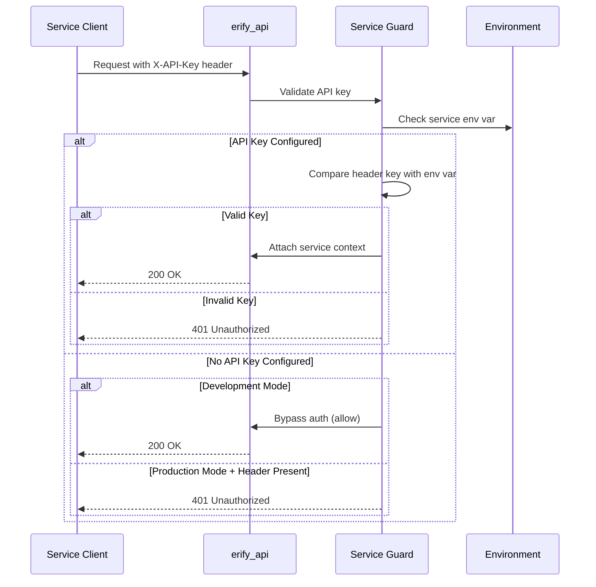

# Server-to-Server Authentication Guide

## Overview

Server-to-server authentication uses **service-specific API key guards** to authenticate external services. Each service has its own guard and API key, providing security isolation and clear service identification.

### Key Concepts

- **Service Guards**: Each service (e.g., Google Sheets) has a dedicated guard class
- **API Key Authentication**: Services authenticate using the `X-API-Key` header
- **Service Context**: Validated requests include service metadata in `request.service`
- **Environment-Aware**: Different behavior in development vs production

---

## Quick Start

### 1. Generate API Key

```bash
openssl rand -base64 32
```

### 2. Configure Environment

Add to your `.env` file:

```env
GOOGLE_SHEETS_API_KEY=<your-generated-api-key>
BACKDOOR_API_KEY=<your-generated-api-key>
```

**Environment Behavior**:

- **Production**: **Required**. API key must be configured in `.env`. Returns 401 if not configured or if header doesn't match.
- **Development**: Optional. If not set, authentication is bypassed (allows requests without key).
- **When Set**: Authentication is always enforced regardless of environment.

### 3. Protect an Endpoint

```typescript
import { Controller, Post, UseGuards, Request } from '@nestjs/common';
import { GoogleSheetsApiKeyGuard } from '@/lib/guards/google-sheets-api-key.guard';

@Controller('schedules')
export class ScheduleController {
  @Post('from-sheets')
  @UseGuards(GoogleSheetsApiKeyGuard)
  async importFromSheets(@Request() req) {
    // req.service.serviceName === 'google-sheets'
    return { success: true };
  }
}
```

### 4. Make Request from External Service

**Google Apps Script Example**:

```javascript
function callEriduAPI(endpoint, payload) {
  const apiKey = PropertiesService.getScriptProperties().getProperty(
    'ERIDU_GOOGLE_SHEETS_API_KEY',
  );

  const response = UrlFetchApp.fetch('https://api.eridu.com' + endpoint, {
    method: 'POST',
    headers: {
      'X-API-Key': apiKey,
      'Content-Type': 'application/json',
    },
    payload: JSON.stringify(payload),
  });

  return JSON.parse(response.getContentText());
}
```

---

## Architecture



---

## Available Guards

### GoogleSheetsApiKeyGuard

**Environment Variable**: `GOOGLE_SHEETS_API_KEY`

**Service Name**: `'google-sheets'`

**Guard Type**: Global guard with decorator-based opt-in

**Usage Pattern** (Recommended - Base Controller):

```typescript
import { GoogleSheets } from '@/lib/decorators/google-sheets.decorator';
import { BaseGoogleSheetsController } from '@/google-sheets/base-google-sheets.controller';

@GoogleSheets() // Decorator marks controller for API key authentication
export abstract class BaseGoogleSheetsController {
  // Shared utility methods
}

@Controller('google-sheets/schedules')
export class GoogleSheetsScheduleController extends BaseGoogleSheetsController {
  @Post()
  async createSchedule(@Request() req) {
    // req.service.serviceName === 'google-sheets'
    // API key validation happens automatically via global guard
  }
}
```

**Usage Pattern** (Alternative - Direct Decorator):

```typescript
import { GoogleSheets } from '@/lib/decorators/google-sheets.decorator';

@Controller('schedules')
export class ScheduleController {
  @Post('from-sheets')
  @GoogleSheets() // Decorator enables API key authentication
  async importFromSheets(@Request() req) {
    // req.service.serviceName === 'google-sheets'
  }
}
```

**Note**:

- The guard is registered globally, so you don't need `@UseGuards(GoogleSheetsApiKeyGuard)`
- Use the `@GoogleSheets()` decorator to opt-in to API key authentication
- The `JwtAuthGuard` automatically skips JWT validation when `@GoogleSheets()` is present

### BackdoorApiKeyGuard

**Environment Variable**: `BACKDOOR_API_KEY`

**Service Name**: `'backdoor'`

**Purpose**: Validates API keys for service-to-service backdoor operations. These endpoints are separate from admin controllers to allow for:

- Different authentication mechanism (API key vs JWT)
- Future IP whitelisting
- Clear separation of concerns

**Protected Operations**:

- Creating users
- Updating users
- Creating studio memberships for admin users

**Usage Pattern** (Recommended - Base Controller):

```typescript
import { Backdoor } from '@/lib/decorators/backdoor.decorator';
import { BaseBackdoorController } from '@/backdoor/base-backdoor.controller';

@Backdoor() // Decorator marks controller for API key authentication
export abstract class BaseBackdoorController {
  // Shared utility methods
}

@Controller('backdoor/users')
export class BackdoorUserController extends BaseBackdoorController {
  @Post()
  async createUser(@Body() body: CreateUserDto) {
    // req.service.serviceName === 'backdoor'
    // API key validation happens automatically via global guard
    return this.userService.createUser(body);
  }

  @Patch(':id')
  async updateUser(@Param('id') id: string, @Body() body: UpdateUserDto) {
    // req.service.serviceName === 'backdoor'
    return this.userService.updateUser(id, body);
  }
}
```

**Usage Pattern** (Alternative - Direct Decorator):

```typescript
import { Backdoor } from '@/lib/decorators/backdoor.decorator';

@Controller('backdoor/users')
@Backdoor() // Decorator enables API key authentication
export class BackdoorUserController {
  @Post()
  async createUser(@Body() body: CreateUserDto) {
    // req.service.serviceName === 'backdoor'
    return this.userService.createUser(body);
  }
}
```

**Note**:

- The guard is registered globally, so you don't need `@UseGuards(BackdoorApiKeyGuard)`
- Use the `@Backdoor()` decorator to opt-in to API key authentication
- The `JwtAuthGuard` automatically skips JWT validation when `@Backdoor()` is present

**Protected Endpoints**:

- `POST /backdoor/users` - Create user (API key required)
- `PATCH /backdoor/users/:id` - Update user (API key required)
- `POST /backdoor/studio-memberships` - Create studio membership (API key required)
- `POST /backdoor/auth/jwks/refresh` - Refresh JWKS cache (API key required)

**Note**: Backdoor controllers extend `BaseBackdoorController` which uses the `@Backdoor()` decorator to skip JWT authentication. This allows these endpoints to use API key authentication via `BackdoorApiKeyGuard` instead.

**Future Enhancement**: IP whitelisting can be added by configuring `BACKDOOR_ALLOWED_IPS` environment variable.

---

## Implementation

### Creating Custom Guards

Extend `BaseApiKeyGuard` to create service-specific guards:

```typescript
import { Injectable } from '@nestjs/common';
import { ConfigService } from '@nestjs/config';
import { Env } from '@/config/env.schema';
import { BaseApiKeyGuard } from '@/lib/guards/base-api-key.guard';

@Injectable()
export class MyServiceApiKeyGuard extends BaseApiKeyGuard {
  constructor(configService: ConfigService<Env>) {
    super(configService, 'my-service');
  }

  protected getApiKeyFromConfig(): string | undefined {
    return this.configService.get('MY_SERVICE_API_KEY');
  }

  protected getEnvKeyName(): string {
    return 'MY_SERVICE_API_KEY';
  }

  // Optional: Override for custom validation logic
  protected validateApiKey(
    providedKey: string,
    configuredKey: string,
  ): boolean {
    return providedKey === configuredKey;
  }
}
```

**Required Steps**:

1. Add environment variable to `env.schema.ts`:

   ```typescript
   MY_SERVICE_API_KEY: z.string().min(1).optional(),
   ```

2. Register guard in your module (if needed as provider)

3. Use guard on endpoints:
   ```typescript
   @UseGuards(MyServiceApiKeyGuard)
   ```

### Service Context

When authentication succeeds, the guard attaches service context to the request:

```typescript
request.service = {
  type: 'api-key',
  serviceName: 'google-sheets', // or 'my-service', etc.
  // Future: userId, userEmail from JWT
};
```

Access in your controller:

```typescript
import { GoogleSheets } from '@/lib/decorators/google-sheets.decorator';

@Post('endpoint')
@GoogleSheets()  // Decorator enables API key authentication
async handler(@Request() req) {
  const serviceName = req.service?.serviceName; // 'google-sheets'
}
```

---

## Behavior Matrix

| Scenario                                    | Development          | Production                     |
| ------------------------------------------- | -------------------- | ------------------------------ |
| **API Key Configured + Valid Header**       | ✅ Validates, allows | ✅ Validates, allows           |
| **API Key Configured + Invalid Header**     | ❌ Returns 401       | ❌ Returns 401                 |
| **API Key Configured + No Header**          | ❌ Returns 401       | ❌ Returns 401                 |
| **No API Key Configured + No Header**       | ✅ Bypasses auth     | ❌ Returns 401 (required)      |
| **No API Key Configured + Header Provided** | ✅ Bypasses auth     | ❌ Returns 401 (misconfigured) |

---

## Usage Examples

### Single Service Guard

```typescript
import { GoogleSheets } from '@/lib/decorators/google-sheets.decorator';

@Controller('schedules')
export class ScheduleController {
  @Post('from-sheets')
  @GoogleSheets() // Decorator enables API key authentication
  async importFromSheets(@Request() req, @Body() data: unknown) {
    // req.service.serviceName === 'google-sheets'
    return this.scheduleService.importFromSheets(data);
  }
}
```

### Multiple Service Guards (OR Logic)

**Note**: The current implementation uses decorator-based opt-in guards. To accept requests from multiple services, you would need to create a custom guard that checks multiple API keys. The decorator-based pattern is designed for single-service authentication.

For multi-service support, consider:

1. Creating a custom guard that validates multiple API keys
2. Using a shared API key for multiple services
3. Implementing a service registry pattern

**Example Custom Multi-Service Guard** (if needed):

```typescript
@Injectable()
export class MultiServiceApiKeyGuard extends BaseApiKeyGuard {
  // Override to check multiple API keys
  protected validateApiKey(
    providedKey: string,
    configuredKey: string,
  ): boolean {
    const allowedKeys = [
      this.configService.get('GOOGLE_SHEETS_API_KEY'),
      this.configService.get('MY_SERVICE_API_KEY'),
    ].filter(Boolean);

    return allowedKeys.includes(providedKey);
  }
}
```

---

## Security Best Practices

1. **Strong Keys**: Generate 32+ character random keys using `openssl rand -base64 32`
2. **Secure Storage**: Never commit API keys to version control (use `.env` files)
3. **Service Isolation**: Use different keys for each service
4. **Environment Separation**: Use different keys for dev/staging/production
5. **Regular Rotation**: Rotate API keys periodically
6. **Production Requirement**: Always configure API keys in production

---

## Error Handling

The guards throw `UnauthorizedException` (401) in these cases:

- **Missing Header**: `X-API-Key` header not provided when API key is configured
- **Invalid Key**: Header value doesn't match configured API key
- **Production Misconfiguration**: Header provided but environment variable not set in production

**Error Response**:

```json
{
  "statusCode": 401,
  "message": "Invalid API key" // or "API key is required"
}
```

---

## Testing

### Running Tests

```bash
# Run all tests
pnpm test

# Run guard tests only
pnpm test lib/guards

# Run with coverage
pnpm test:cov
```

### Test Coverage

**BaseApiKeyGuard**:

- ✅ Valid API key validation
- ✅ Invalid/missing API key rejection
- ✅ Development mode bypass
- ✅ Production mode error handling
- ✅ Case-insensitive header extraction (`X-API-Key` or `x-api-key`)
- ✅ Service context attachment

**GoogleSheetsApiKeyGuard**:

- ✅ Service-specific validation
- ✅ Service name verification (`'google-sheets'`)
- ✅ Environment-specific behavior

**BackdoorApiKeyGuard**:

- ✅ Service-specific validation
- ✅ Service name verification (`'backdoor'`)
- ✅ Environment-specific behavior
- ✅ Protects privileged user and membership operations
- ✅ Extensible for IP whitelisting (via `validateRequest()` override)

### Integration Test Example

```typescript
import { Test, TestingModule } from '@nestjs/testing';
import { INestApplication } from '@nestjs/common';
import * as request from 'supertest';
import { Controller, Post, UseGuards, Request } from '@nestjs/common';
import { ConfigModule } from '@nestjs/config';
import { GoogleSheetsApiKeyGuard } from '@/lib/guards/google-sheets-api-key.guard';
import { ServiceContext } from '@/lib/guards/base-api-key.guard';

@Controller('test')
class TestController {
  @Post('protected')
  @UseGuards(GoogleSheetsApiKeyGuard)
  async protected(@Request() req: Request & { service?: ServiceContext }) {
    return { serviceName: req.service?.serviceName };
  }
}

describe('GoogleSheetsApiKeyGuard Integration', () => {
  let app: INestApplication;

  beforeEach(async () => {
    const module = await Test.createTestingModule({
      imports: [ConfigModule.forRoot()],
      controllers: [TestController],
      providers: [GoogleSheetsApiKeyGuard],
    }).compile();

    app = module.createNestApplication();
    await app.init();
  });

  afterEach(async () => {
    await app.close();
  });

  it('should allow access with valid API key', () => {
    process.env.GOOGLE_SHEETS_API_KEY = 'test-key-123';
    return request(app.getHttpServer())
      .post('/test/protected')
      .set('X-API-Key', 'test-key-123')
      .expect(200)
      .expect((res) => {
        expect(res.body.serviceName).toBe('google-sheets');
      });
  });

  it('should reject invalid API key', () => {
    process.env.GOOGLE_SHEETS_API_KEY = 'test-key-123';
    return request(app.getHttpServer())
      .post('/test/protected')
      .set('X-API-Key', 'wrong-key')
      .expect(401);
  });
});
```

### Testing Best Practices

1. **Isolate Tests**: Each test should be independent and clean up environment variables
2. **Cover All Scenarios**: Valid keys, invalid keys, missing headers, environment differences
3. **Verify Service Context**: Assert `request.service.serviceName` is set correctly
4. **Descriptive Test Names**: Use clear descriptions like `'should reject request with invalid API key'`
5. **Test Error Messages**: Verify both status code (401) and error message content

---

## Troubleshooting

### "API key is required" Error

**Symptoms**: 401 error with message "API key is required"

**Solutions**:

- Ensure `X-API-Key` header is present in the request (case-insensitive: `x-api-key` or `X-API-Key`)
- Verify the environment variable is set: `GOOGLE_SHEETS_API_KEY` (or your service's key)
- Check that environment variables are loaded correctly in your application

### "Invalid API key" Error

**Symptoms**: 401 error with message "Invalid API key"

**Solutions**:

- Verify the header value exactly matches the environment variable (no extra spaces or characters)
- Ensure you're using the correct service's API key (e.g., `GOOGLE_SHEETS_API_KEY` for Google Sheets)
- Check for copy/paste errors or encoding issues
- Verify you're using the key for the correct environment (dev vs production)

### Authentication Bypassed Unexpectedly

**Symptoms**: Requests succeed without API key when they shouldn't

**Solutions**:

- Check if environment variable is set: `echo $GOOGLE_SHEETS_API_KEY`
- Verify environment variables are loaded: Check your `.env` file and application startup logs
- Check logs for "API key not configured" warning messages
- Ensure you're in development mode if bypass is expected

---

## Future Enhancements

The guards are designed to integrate with JWT authentication for enhanced user context:

```typescript
// Future implementation
request.service = {
  type: 'api-key',
  serviceName: 'google-sheets',
  userId: jwtPayload.sub, // User ID from JWT
  userEmail: jwtPayload.email, // User email from JWT
};
```

---

## Related Documentation

- **[Authentication Guide](./AUTHENTICATION_GUIDE.md)** - User authentication with JWT
- **[Google Sheets Workflow](../manual-test/schedule-planning/GOOGLE_SHEETS_WORKFLOW.md)** - Google Sheets integration guide
