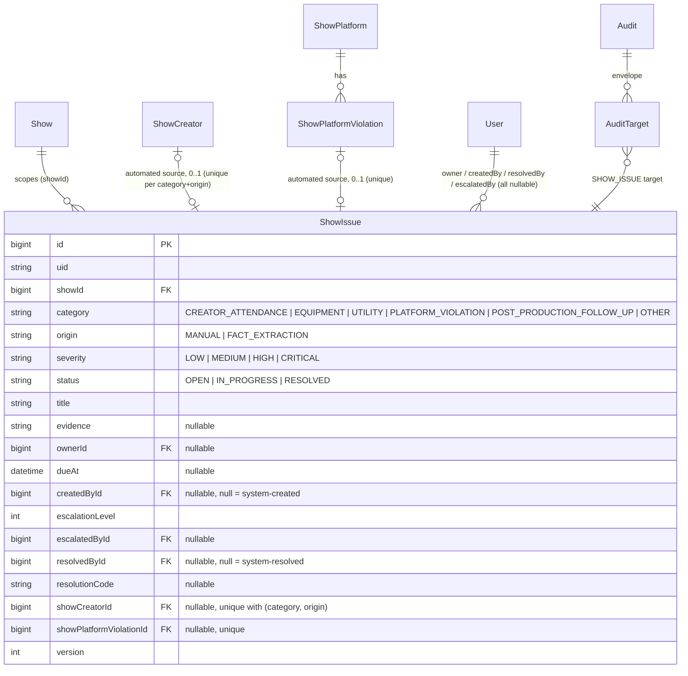
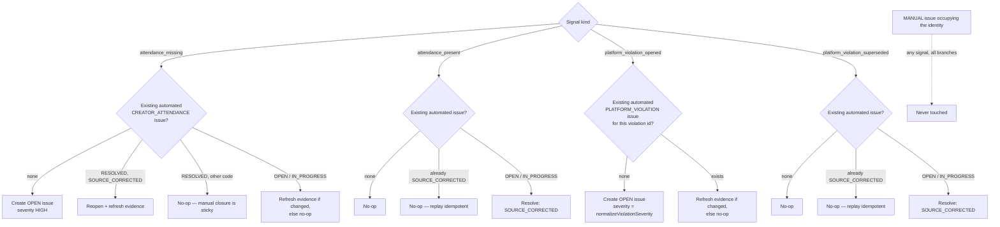
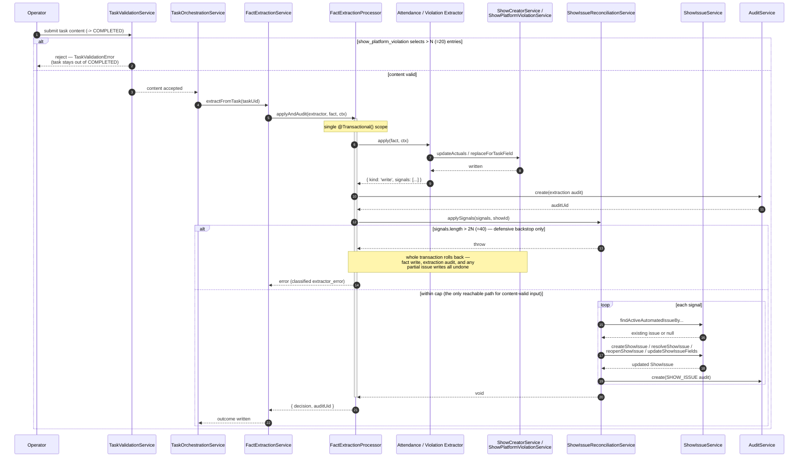

# Show-Level Issue Ownership

> **Roadmap**: [Phase 5 item 9](../../../docs/roadmap/PHASE_5.md#9-show-level-issue-ownership)

## Purpose

Show issues are advisory operational records for exceptions that need ownership and resolution. They give managers one workflow for manually reported blockers and extraction-detected anomalies without changing show status or enforcing lifecycle gates.

This feature introduces a dedicated `ShowIssue` model. It does not reuse `Task`, because tasks describe executable work and carry submission/template semantics. It does not reuse `Audit`, because audits describe immutable history rather than current ownership, due dates, severity, and resolution state.

## Scope

- manual issues for creator attendance, equipment, utilities, platform problems, post-production follow-up, and other show-specific exceptions;
- automated issues for active `ShowPlatformViolation` rows and `ShowCreator.attendanceMissing` facts;
- assignment to an active studio member, due dates, severity, manual escalation, resolution, and reopening;
- issue history through the standard `Audit` / `AuditTarget` model;
- a paginated Issues tab on show detail;
- issue counts and a lazy paginated Issues tab on Show Run Review.

The feature remains advisory. An unresolved issue does not block or cause a show state transition.

## Non-Goals And Forwarding

| Excluded work | Forwarding workstream |
| --- | --- |
| Missing-performance issue creation | Phase 5 item 12 defines required metrics, review timing, and grace-period semantics before any issue is created. Item 9 only handles facts that positively report an anomaly. |
| Notifications for issue changes | Phase 5 item 15 |
| Show state transitions or transition blocking | Phase 5 items 18 and 19 |
| Unified live-control dashboard | Phase 5 item 20 |
| Comments, mentions, attachments, and watchers | Future collaboration work; evidence is plain text |
| Configurable escalation policies, timers, or background jobs | Promote with item 15 or a separate policy workstream when a real delivery/escalation consumer exists |
| General-purpose domain event engine or NestJS CQRS migration | Reconsider only when a second independent consumer needs durable delivery |

## Domain Contract

### Status lifecycle

```mermaid
stateDiagram-v2
    [*] --> OPEN : create (manual or automated)
    OPEN --> IN_PROGRESS : start (Admin/Manager, or assigned member on own issue)
    OPEN --> RESOLVED : resolve
    IN_PROGRESS --> RESOLVED : resolve
    RESOLVED --> OPEN : reopen (Admin/Manager)
    RESOLVED --> RESOLVED : re-resolve blocked; must reopen first
```



- New manual and automated issues start `OPEN`.
- Starting work sets `IN_PROGRESS`.
- Resolution requires a resolution code and note for a user action.
- Automated source correction resolves with `SOURCE_CORRECTED` and a null actor.
- Reopening preserves the same issue identity and clears the previous resolution fields after recording an audit entry.
- There is no public delete action. Resolution is the normal terminal workflow.

### Model

`ShowIssue` is anchored directly to `Show` and uses typed nullable foreign keys for its closed set of automated sources.

| Field | Contract |
| --- | --- |
| `id`, `uid` | Internal bigint primary key plus external `issue_*` UID. Internal IDs never leave the API. |
| `showId` | Required `Show` foreign key. The show is the authorization and lifecycle scope. |
| `category` | `CREATOR_ATTENDANCE`, `EQUIPMENT`, `UTILITY`, `PLATFORM_VIOLATION`, `POST_PRODUCTION_FOLLOW_UP`, or `OTHER`. |
| `origin` | `MANUAL` or `FACT_EXTRACTION`. |
| `severity` | `LOW`, `MEDIUM`, `HIGH`, or `CRITICAL`. |
| `status` | `OPEN`, `IN_PROGRESS`, or `RESOLVED`. |
| `title`, `evidence` | Required concise title and optional plain-text evidence. Automated reconciliation copies the current source reason into evidence. |
| `ownerId`, `dueAt` | Nullable owner `User` foreign key and due date. Assignment validates an active membership in the issue's studio. |
| `createdById` | Nullable `User` foreign key. Null denotes a system-created issue. |
| `escalationLevel` | Non-negative integer, initially `0`; explicit manual escalation only. |
| `escalatedAt`, `escalatedById`, `escalationNote` | Latest escalation state. Full history remains in `Audit`. |
| `resolvedAt`, `resolvedById`, `resolutionCode`, `resolutionNote` | Resolution record. Codes: `FIXED`, `SOURCE_CORRECTED`, `NO_LONGER_APPLICABLE`, `DUPLICATE`, `OTHER`. |
| `showCreatorId` | Nullable typed source FK for attendance anomalies. |
| `showPlatformViolationId` | Nullable typed source FK for platform violations. |
| `version` | Optimistic lock, incremented on semantic issue mutations. |
| `createdAt`, `updatedAt`, `deletedAt` | Standard timestamps and soft-delete compatibility. No public delete endpoint is exposed. |



Constraints and indexes:

- unique `uid`;
- unique `showPlatformViolationId` when present;
- unique `(showCreatorId, category, origin)` when a creator source is present, so one attendance anomaly reuses one issue identity;
- index `(showId, status, dueAt, deletedAt)` for show detail and unresolved queues;
- index `(ownerId, status, deletedAt)` for owner filtering;
- index `(severity, status, deletedAt)` for review filtering;
- service validation that a typed source belongs to the same show as `showId`;
- service validation that `FACT_EXTRACTION` has exactly one supported typed source and `MANUAL` has neither automated source FK.

### Audit extension

`SHOW_ISSUE` is part of the shared audit target contract, with a typed nullable `showIssueId` foreign key on `AuditTarget`. `CREATE` or `UPDATE` audit rows record:

- issue creation;
- assignment or due-date changes;
- severity changes;
- escalation;
- resolution;
- reopening;
- automated evidence refresh and source-corrected resolution.

Audit metadata contains the changed field values and operation name. Business reasons use the first-class audit `reason` column. Issue state is not stored in JSONB metadata.

## Authorization

| Actor | Read | Create manual | Edit assignment/severity/due/evidence | Start or resolve | Escalate or reopen |
| --- | --- | --- | --- | --- | --- |
| Studio Admin / Manager | Yes | Yes | Any issue | Any issue | Any issue |
| Assigned active studio member | Yes when they can read the show | No | No | Their assigned issue | No |
| Other active studio member with show access | Yes | No | No | No | No |
| System reconciliation | Internal only | Automated sources only | Automated evidence only | Source-corrected resolution | No |

Owner assignment accepts a user UID, resolves it through an active `StudioMembership`, and stores `User.id`. Removing a membership does not erase issue history; reassignment remains an Admin/Manager action.

## API Contract

The mutable resource has one studio-scoped canonical collection:

```text
GET    /studios/:studioId/show-issues
POST   /studios/:studioId/show-issues
GET    /studios/:studioId/show-issues/:issueId
GET    /studios/:studioId/show-issues/:issueId/audits
PATCH  /studios/:studioId/show-issues/:issueId
POST   /studios/:studioId/show-issues/:issueId/resolve
POST   /studios/:studioId/show-issues/:issueId/reopen
POST   /studios/:studioId/show-issues/:issueId/escalate
```

The list endpoint uses offset pagination and supports `show_id`, `owner_id`, `status`, `severity`, `category`, `origin`, `date_from`, `date_to`, and `search`. `show_id`, `owner_id`, and issue identifiers are UIDs at the API boundary. List responses exclude audit history and return only the fields needed by issue tables. The audits endpoint returns the standard paginated audit response filtered through the typed `SHOW_ISSUE` target.

`PATCH` accepts `version` and the editable issue fields. Setting status to `IN_PROGRESS` is permitted through this endpoint; resolving and reopening use explicit commands because they require resolution or reopening reasons. Automated origin and source fields are immutable through the public API.

All request/response schemas live in `@eridu/api-types`, use snake_case externally, and map to camelCase service payloads.

Show Run Review's `GET /studios/:studioId/shows/run-review/issues` sub-resource reuses `showIssueApiResponseSchema` verbatim for its rows (see [Read Surfaces And Performance](#read-surfaces-and-performance)) and additionally carries `show_name`, since that surface spans multiple shows.

## Automated Reconciliation

### Signals

A small in-process discriminated union owned by the show-issue workflow:

```text
attendance_missing(showCreatorUid, evidence)
attendance_present(showCreatorUid)
platform_violation_opened(violationUid)
platform_violation_superseded(violationUid)
```

This is a synchronous method contract, not a published domain event and not a generic event bus.

### Rules

| Source change | Issue result |
| --- | --- |
| Attendance becomes missing | Upsert one `CREATOR_ATTENDANCE` issue for the `ShowCreator`; refresh evidence and reopen if previously source-resolved. |
| Attendance becomes present | Resolve the linked automated issue with `SOURCE_CORRECTED`; no-op when no issue exists. |
| Platform violation row is created | Create one `PLATFORM_VIOLATION` issue keyed by the violation row. Normalize the source severity through the mapping below. |
| Platform violation row is superseded | Resolve the linked issue with `SOURCE_CORRECTED`. |
| Same signal is replayed | No duplicate row and no audit when semantic state is unchanged. |



Manual issues are never automatically resolved or overwritten.

Platform violation severity is an uppercase free-form string with `WARNING` as the default. It is normalized deterministically:

| Source severity | Issue severity |
| --- | --- |
| `CRITICAL` | `CRITICAL` |
| `HIGH`, `ERROR`, `SEVERE` | `HIGH` |
| `WARNING`, `WARN`, `MEDIUM` | `MEDIUM` |
| Any other value | `LOW` |

### Transaction boundary

`FactExtractionProcessor` applies the fact, writes its extraction audit, and invokes `ShowIssueReconciliationService.applySignals(...)` inside the same CLS transaction. The relevant extractors return the typed signals with the source UIDs they created, superseded, or updated.

If issue reconciliation fails, the fact write and extraction audit roll back together and the extraction result reports an error through the existing task-submission behavior. A fact must not commit while its required automated issue is missing. Manager edits to an already-completed task re-run extraction and provide the immediate correction path; a general extraction retry queue is out of scope.

**Bounding `show_platform_violation` cardinality — two gates, not one.** A `show_platform_violation` multiselect submission can replace an existing selection wholesale, emitting one `platform_violation_superseded` signal per previously-active row plus one `platform_violation_opened` signal per newly selected row. The primary gate is at content-validation time, before the task can transition to `COMPLETED`: `task-content-validator.ts` rejects a `show_platform_violation` field selecting more than `MAX_PLATFORM_VIOLATIONS_PER_FIELD` (`N = 20`, a documented domain estimate — see the constant's doc comment) entries, in `TaskService.updateTaskContentAndStatusCore` / `TaskValidationService.validateContent`, so an oversized selection never reaches extraction and never leaves a task stuck `COMPLETED` with a failed reconciliation. `ShowIssueReconciliationService`'s own `MAX_SIGNALS_PER_CALL` (`2N = 40`) is a second, defensive backstop sized to comfortably fit the worst case a content-valid submission can produce — a full N-to-N replacement (N superseded + N created) — so it only ever trips if the two gates drift out of sync, not on any submission the content gate already accepted.



## Module Boundary

```text
StudioShowIssueController
  -> ShowIssueWorkflowService
       -> ShowIssueService
       -> StudioMembershipService
       -> AuditService

FactExtractionProcessor
  -> ShowIssueReconciliationService
       -> ShowIssueService
       -> ShowCreatorService / ShowPlatformViolationService
       -> AuditService

ShowRunReviewService
  -> ShowIssueService
```

- `ShowIssueModule` owns repository and single-model service behavior and exports only `ShowIssueService`.
- `ShowIssueOrchestrationModule` owns manual workflow and automated reconciliation services.
- The controller imports the orchestration module; it does not assemble cross-model rules.
- `FactExtractionModule` and `ShowOrchestrationModule` each import `ShowIssueModule` in one direction. The show-issue modules do not import fact extraction or show orchestration, so no `forwardRef` is needed.
- Existing task, audit, and show services remain unchanged in responsibility. This feature does not create a cross-cutting event module.

This orchestration pattern can be applied to other services when one model mutation has one required downstream workflow. Introduce a durable outbox and independent consumers only when the same committed change must fan out to at least two separately retryable concerns, such as issue reconciliation plus notifications.

## Read Surfaces And Performance

### Show detail

An **Issues** tab on the existing show detail shell uses the canonical collection filtered by `show_id`, URL-backed pagination and filters, and row actions based on authorization. The create dialog is available to Admin and Manager users.

### Show Run Review

The lean `run-review` summary carries unresolved issue counts by severity (`issues.unresolved_count`, `issues.unresolved_by_severity`), and a lazy `GET /studios/:studioId/shows/run-review/issues` paginated sub-resource lists the underlying rows. Both use the same repository `where` builder as the canonical issue list, so the summary badge and rows cannot drift; the sub-resource defaults to unresolved (`OPEN`/`IN_PROGRESS`) when no explicit `status` filter is given, which is what keeps the two counts equal under the same filters.

Issue pagination, filtering, and counting execute in PostgreSQL with `take`, `skip`, and `count`, capped at a 100-row page size — unlike the other Show Run Review sub-resources (creators, violations, tasks, shows), which slice an already-bounded in-memory show graph, this endpoint pages PostgreSQL directly. `date_from` and `date_to` filter the linked show's scheduled `startTime`, matching the Show Run Review range contract. The existing 31-day operational review bound remains in place.
