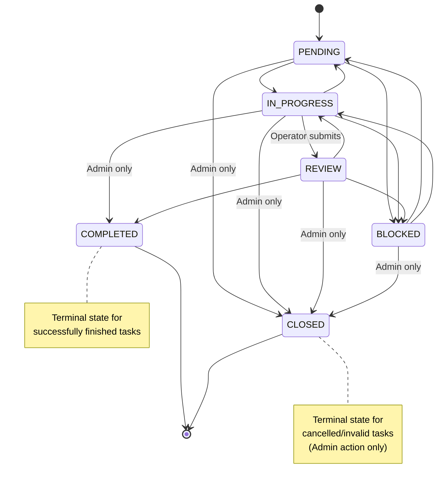

# Task Management System - Backend Design

**Version**: 3.6
**Last Updated**: February 24, 2026
**Status**: Core implemented. System admin task management (`/admin/tasks`) now supports cross-studio discovery + reassignment with membership validation, while keeping task content immutable in system scope. Planned next: studio review workflow/state machine endpoints.

> **Related Documentation**  
> For UI/UX specifications and user workflows, see [`apps/erify_studios/docs/TASK_MANAGEMENT_UIUX_DESIGN.md`](../../erify_studios/docs/TASK_MANAGEMENT_UIUX_DESIGN.md)

---

## Table of Contents

1. [Overview](#1-overview)
2. [Technical Requirements](#2-technical-requirements)
3. [Architecture Decisions](#3-architecture-decisions)
4. [Database Schema](#4-database-schema)
5. [Schema Storage Strategy](#5-schema-storage-strategy)
6. [Validation System](#6-validation-system)
7. [Service Layer](#7-service-layer)
8. [API Endpoints](#8-api-endpoints)
9. [Authentication & Authorization](#9-authentication--authorization)
10. [Error Handling](#10-error-handling)
11. [Performance & Optimization](#11-performance--optimization)
12. [Appendices](#appendices)

---

## 1. Overview

A generic, extensible Task Management system using a **"Task as Form"** architecture where each Task record represents an entire checklist/form with structure defined by a `TaskTemplate` and user data stored in JSONB.

### Core Entities

- **TaskTemplate**: Blueprint defining form structure (stored in snapshots)
- **TaskTemplateSnapshot**: Immutable schema version history
- **Task**: Instance of a form with user-entered data
- **TaskTarget**: Polymorphic association linking tasks to entities (Show, Studio, etc.)

### Key Principles

- **Task as Form**: One task = one complete checklist, not individual rows per checkbox
- **Schema Versioning**: Templates evolve; snapshots preserve exact schema used
- **JSONB Storage**: Dynamic form data without rigid columns
- **Optimistic Locking**: Prevent concurrent update conflicts
- **Polymorphic Targets**: Tasks can link to any entity type without schema changes

### Architecture Decision: "Task as Form"

**Problem**: A show with 60 checklist items creates how many DB records?

❌ **Individual Row Approach**: 60 task records  
✅ **Task as Form**: 3 task records (Pre-prod, Live, Post-prod)

**Benefits**:
- 20x fewer database rows
- Atomic assignment (update 3 records vs 60)
- No race conditions on bulk operations
- Flexible schema changes (JSON update vs migration)

**Trade-off**:
- Cannot easily query "tasks where checkbox X is true"
- Solution: Use JSONB queries or materialized views when needed

---

## 2. Technical Requirements

### System Constraints

**Scalability Targets**
- Support 100+ studios with 1000+ shows per studio
- Handle 10,000+ concurrent task updates
- Sub-200ms API response time for task operations

**Data Integrity**
- Prevent race conditions during task generation
- Ensure optimistic locking for concurrent updates
- Maintain referential integrity for polymorphic associations

**Validation Requirements**
- Server-side validation of all task content against schema
- Type-safe field validation (text, number, date, select, etc.)
- Due date validation based on task type and show schedule
- Submission window validation for show-linked tasks (type-aware, see §6.3)
- Overdue submission is warning-only in current phase (no hard block)
- **Studio Consistency**: Tasks for a Show MUST be generated using Templates from the same Studio as the Show

### API Enhancements

#### `/me` Endpoint
- **Response**: Must include `studio_memberships` to allow frontend to build studio navigation.
- **Structure**:
  ```json
  {
    "id": "usr_...",
    "email": "user@example.com",
    "name": "Sarah Connor",
    "studio_memberships": [
      {
        "studio": { "uid": "std_1", "name": "Universal Studios" },
        "role": "admin"
      },
      {
        "studio": { "uid": "std_2", "name": "Indie Productions" },
        "role": "user"
      }
    ]
  }
  ```

### Core Workflows

#### 1. Bulk Task Generation (Manager-Led)
- Tasks are NOT auto-generated when shows are created
- Manager selects **multiple shows** and chooses which templates to apply per task type
- For each show, the system generates one Task per selected template in a single transaction
- The same template set can be applied to all selected shows, or template selection can vary per show
- **Idempotency**: shows that already have active tasks for a given template are skipped.
- **Resumption**: If a task for the template exists but is **soft-deleted**, it is "resumed" (undeleted, reset to PENDING, cleared content, updated to latest template snapshot, and task `type` synchronized to latest template `task_type`) to prevent data redundancy and preserve task UID stability.
- **Advisory lock per show** prevents race conditions when two managers generate simultaneously
- Template controls task type directly (`task_type` is explicit, no name inference)
- For `ADMIN` / `ROUTINE` / `OTHER`, manager can optionally override generated due time during generation

**Generation Flow**:
1. Manager navigates to the Shows list (studio-scoped).
2. Uses advanced filters to find relevant shows.
3. Selects one or more shows (checkbox selection).
4. Clicks "Generate Tasks" to open the generation dialog.
5. For each task type slot (SETUP / ACTIVE / CLOSURE), picks a template from the studio's active templates.
6. Optionally sets due dates for `ADMIN` / `ROUTINE` / `OTHER`, or accepts auto-calculated defaults.
7. Confirms → system creates tasks in a single batch transaction.

#### 2. Bulk Task Deletion (Cleanup)
- Manager selects multiple tasks in the Show Tasks page.
- Action: **Bulk Soft Delete**.
- Implementation: `DELETE /studios/:studioId/tasks/bulk` using a batch transaction.
- Effects: sets `deletedAt` on both `Task` and its `TaskTarget` records.
- Rationale: Soft-deletion allows for **Resumption** (see workflow 1) if tasks are regenerated, preventing UID churn.

**Assignment Flow**:
1. Manager views the Shows Data Table (read-only, with Assignee column for visibility).
2. Selects one or more shows via checkboxes.
3. Clicks "Assign" in the floating action bar → opens Assignment Dialog.
4. Picks a studio member from a dropdown. Sees summary of selected shows and task counts.
5. Confirms → system calls one batch API → table refetches to reflect updated state.


#### 3. Individual Task Reassignment (Split Ownership)
- Default: One user per show (all tasks assigned to same person)
- Override: Manager can reassign individual tasks to different users
- Example: Pre-prod task → Person A, Live task → Person B, Post-prod → Person A
- Only the single task's `assigneeId` is updated; other tasks for the same show remain unchanged

#### 4. Governance
- **Strict Templates**: All tasks generated from approved templates
- **Manager Control**: Only managers generate/delete tasks, assign shows, or bulk update
- **Operator Scope**: Can only update content + status on their assigned tasks
- **Audit Trail**: (Future) Comprehensive change logging

---

## 3. Architecture Decisions

### Decision 1: Snapshot Table for Schema Versioning

**Problem**: When template changes, how do existing tasks validate their content?

**Options Considered**:
1. **Inline Schema in Task Metadata**: Copy schema to each task (2-10 KB per task)
2. **Template Versioning**: Version number only (can't retrieve old schemas)
3. **Snapshot Table**: Separate table storing each schema version ✅

**Chosen Solution**: Snapshot Table

**Why**:
- Storage efficient: 98% reduction vs inline (10 MB vs 500 MB for 100K tasks)
- Schema history preserved: Can always retrieve exact version used
- Templates deletable: Tasks reference snapshots, not templates
- Industry standard: How Stripe, GitHub, AWS handle API versioning

**Example**:
```
Template v1: 20 fields → Snapshot ID 1 → 1000 tasks reference it
Template v2: 25 fields → Snapshot ID 2 → 500 tasks reference it
Template v3: 22 fields → Snapshot ID 3 → 0 tasks (newly created)

Storage: 3 snapshots × 5 KB = 15 KB total (not 1500 × 5 KB = 7.5 MB)
```

---

### Decision 2: Polymorphic TaskTarget

**Problem**: Tasks need to link to Shows now, but Projects/Clients/Events in future.

**Options Considered**:
1. **Hard-coded showId**: Requires migration for each new entity type
2. **Enum TargetType**: Still requires migration to add new types
3. **Generic Polymorphic**: String targetType + BigInt targetId ✅

**Chosen Solution**: Generic polymorphic with optional FKs

**Schema**:
```prisma
model TaskTarget {
  targetType  String   // "SHOW", "PROJECT", "CLIENT", etc.
  targetId    BigInt   // Generic ID
  
  // Optional: Keep FKs for referential integrity
  showId      BigInt?
  show        Show?
  studioId    BigInt?
  studio      Studio?
}
```

**Why**:
- No migration needed for new entity types
- Just use `targetType="PROJECT", targetId=123`
- Still maintains referential integrity for known types
- Constraint ensures exactly one FK is set

---

### Decision 3: Race Condition Protection

**Problem**: Two managers simultaneously generate tasks for same show.

**Without Protection**:
```
Manager A: Check if tasks exist → None found
Manager B: Check if tasks exist → None found
Manager A: Create tasks → Success
Manager B: Create tasks → Duplicates created! ❌
```

**Solution**: PostgreSQL Advisory Locks inside `@Transactional()` (CLS pattern)

```typescript
// task-generation-processor.service.ts
@Transactional()
async processShow(show: any, templates: any[]) {
  // Acquire advisory lock — held for the duration of the CLS transaction
  await this.prisma.$executeRaw`SELECT pg_advisory_xact_lock(${show.id})`;

  for (const template of templates) {
    // Idempotency / Resumption check
    const existing = await this.taskRepository.findByShowAndTemplate(show.id, template.id, { includeDeleted: true });
    
    if (existing) { 
      if (!existing.deletedAt) {
        continue; // Active task exists: Skip
      } else {
        // Soft-deleted task exists: Resume (Undelete & Reset)
        await this.taskRepository.resumeDeletedTask(existing.id, latestSnapshot.id);
        continue;
      }
    }

    // Create task + TaskTarget atomically
    const task = await this.taskRepository.create({ ... });
    await this.taskTargetRepository.create({ task: { connect: { id: task.id } }, ... });
  }
}
```

> **Note**: `@Transactional()` only works on public methods called through the NestJS DI proxy.
> Use a separate injectable service (`TaskGenerationProcessor`) to hold the transactional method —
> self-invocation (`this.method()`) silently bypasses the transaction.

**Why Advisory Locks**:
- Database-level concurrency control
- No race conditions possible
- Automatic cleanup (released on transaction end)
- Works across multiple API instances

---

### Decision 4: Optimistic Locking for Task Updates

**Problem**: User A and User B both edit same task.

**Without Locking**:
```
User A reads task (version 5)
User B reads task (version 5)
User A updates → version 6
User B updates → version 6 (User A's changes lost!) ❌
```

**Solution**: Version-based Compare-And-Swap

```typescript
async update(uid: string, dto: UpdateTaskDto, expectedVersion: number) {
  const updated = await prisma.task.updateMany({
    where: {
      uid,
      version: expectedVersion,  // Must match
      deletedAt: null
    },
    data: {
      ...dto,
      version: expectedVersion + 1  // Increment
    }
  });
  
  if (updated.count === 0) {
    throw new ConflictException({
      message: 'Task modified by another user',
      currentVersion: actualVersion,
      expectedVersion
    });
  }
}
```

**Why**:
- Prevents lost updates
- Client detects conflicts immediately
- Can implement retry logic or show merge UI
- No database locks (optimistic = assume no conflict)

---

## 4. Database Schema

### Complete Prisma Schema

```prisma
// ============================================
// TASK TEMPLATES & SNAPSHOTS
// ============================================

model TaskTemplate {
  id            BigInt   @id @default(autoincrement())
  uid           String   @unique
  studioId      BigInt   @map("studio_id")
  name          String
  description   String?
  isActive      Boolean  @default(true) @map("is_active")
  
  // Current version (denormalized for convenience)
  currentSchema Json     @map("current_schema")
  version       Int      @default(1)
  
  // Relations
  studio        Studio   @relation(fields: [studioId], references: [id])
  snapshots     TaskTemplateSnapshot[]
  tasks         Task[]

  createdAt     DateTime @default(now()) @map("created_at")
  updatedAt     DateTime @updatedAt @map("updated_at")
  deletedAt     DateTime? @map("deleted_at")

  @@index([uid])
  @@index([studioId])
  @@index([isActive])
  @@map("task_templates")
}

model TaskTemplateSnapshot {
  id          BigInt   @id @default(autoincrement())
  templateId  BigInt   @map("template_id")
  template    TaskTemplate @relation(fields: [templateId], references: [id], onDelete: Cascade)
  
  version     Int      // 1, 2, 3, etc.
  schema      Json     // Immutable schema at this version
  metadata    Json     @default("{}") // Change notes, author, etc.
  
  tasks       Task[]
  
  createdAt   DateTime @default(now()) @map("created_at")

  @@unique([templateId, version])
  @@index([templateId, version])
  @@map("task_template_snapshots")
}

// ============================================
// TASKS
// ============================================

enum TaskStatus {
  PENDING
  IN_PROGRESS
  REVIEW
  COMPLETED
  BLOCKED
  CLOSED
}

enum TaskType {
  SETUP      // Pre-production
  ACTIVE     // During show
  CLOSURE    // Post-production
  ADMIN      // Administrative
  ROUTINE    // Regular maintenance
  OTHER
}

model Task {
  id          BigInt     @id @default(autoincrement())
  uid         String     @unique
  description String
  status      TaskStatus @default(PENDING)
  type        TaskType
  dueDate     DateTime?  @map("due_date")
  completedAt DateTime?  @map("completed_at")
  
  // Schema reference (immutable snapshot)
  snapshotId  BigInt     @map("snapshot_id")
  snapshot    TaskTemplateSnapshot @relation(fields: [snapshotId], references: [id], onDelete: Restrict)
  
  // Optional template reference (for convenience queries)
  templateId  BigInt?    @map("template_id")
  template    TaskTemplate? @relation(fields: [templateId], references: [id], onDelete: SetNull)
  
  // Form data (dynamic based on snapshot schema)
  content     Json       @default("{}")
  metadata    Json       @default("{}")
  
  // Optimistic locking
  version     Int        @default(1)
  
  // Scoping
  studioId    BigInt?    @map("studio_id")
  studio      Studio?    @relation(fields: [studioId], references: [id])
  
  // Assignment
  assigneeId  BigInt?    @map("assignee_id")
  assignee    User?      @relation(fields: [assigneeId], references: [id])
  
  // Associations
  targets     TaskTarget[]

  createdAt   DateTime   @default(now()) @map("created_at")
  updatedAt   DateTime   @updatedAt @map("updated_at")
  deletedAt   DateTime?  @map("deleted_at")

  @@index([uid])
  @@index([snapshotId])
  @@index([templateId])
  @@index([studioId])
  @@index([assigneeId])
  @@index([status])
  @@index([deletedAt])
  @@index([assigneeId, status, deletedAt])
  @@map("tasks")
}

// ============================================
// TASK TARGETS (POLYMORPHIC ASSOCIATION)
// ============================================

model TaskTarget {
  id          BigInt   @id @default(autoincrement())
  taskId      BigInt   @map("task_id")
  task        Task     @relation(fields: [taskId], references: [id], onDelete: Cascade)
  
  // Generic polymorphic reference
  targetType  String   @map("target_type") // "SHOW", "STUDIO", "PROJECT", etc.
  targetId    BigInt   @map("target_id")
  
  // Optional: Keep FK columns for referential integrity
  showId      BigInt?  @map("show_id")
  show        Show?    @relation(fields: [showId], references: [id], onDelete: Cascade)
  studioId    BigInt?  @map("studio_id")
  studio      Studio?  @relation(fields: [studioId], references: [id], onDelete: Cascade)
  
  deletedAt   DateTime? @map("deleted_at")
  
  @@unique([taskId, targetType, targetId, deletedAt])
  @@index([taskId])
  @@index([showId])
  @@index([studioId])
  @@index([targetType, targetId])
  @@index([deletedAt])
  @@map("task_targets")
}
```

### Database Constraints

```sql
-- Ensure TaskTarget has exactly one FK set
ALTER TABLE task_targets ADD CONSTRAINT one_target_only
  CHECK (
    (show_id IS NOT NULL)::int + 
    (studio_id IS NOT NULL)::int = 1
  );

-- Prevent task completion in future
ALTER TABLE tasks ADD CONSTRAINT realistic_completion
  CHECK (completed_at IS NULL OR completed_at <= NOW());

-- Ensure due_date makes sense
ALTER TABLE tasks ADD CONSTRAINT valid_due_date
  CHECK (due_date IS NULL OR due_date >= created_at);

-- GIN indexes for JSONB queries
CREATE INDEX idx_tasks_content_gin ON tasks USING GIN (content);
CREATE INDEX idx_snapshots_schema_gin ON task_template_snapshots USING GIN (schema);
```

### Task Status State Machine



---

## 5. Schema Storage Strategy

### Template Schema Structure

Each template defines a form using this JSON structure:

```json
{
  "items": [
    {
      "key": "script_review",
      "type": "checkbox",
      "label": "Script reviewed and approved",
      "required": true,
      "default_value": false,
      "validation": {
          "require_reason": "on-false"
      }
    },
    {
      "key": "camera_count",
      "type": "number",
      "label": "Number of cameras required",
      "required": true,
      "validation": {
        "min": 1,
        "max": 10
      }
    },
    {
      "key": "lighting_setup",
      "type": "select",
      "label": "Lighting setup status",
      "required": true,
      "options": [
        { "value": "pending", "label": "Pending" },
        { "value": "in_progress", "label": "In Progress" },
        { "value": "complete", "label": "Complete" }
      ]
    }
  ],
  "metadata": {
    "description": "Standard pre-production checklist",
    "estimated_time": 120
  }
}
```

> **Note**: For complete field type specifications and UI rendering patterns, see the [Frontend Design Document](../../erify_studios/docs/TASK_MANAGEMENT_UIUX_DESIGN.md).

### Supported Field Types

| Type          | Data Type       | Validation Options                         |
| ------------- | --------------- | ------------------------------------------ |
| `checkbox`    | Boolean         | require_reason (on-true, on-false, always) |
| `text`        | String          | minLength, maxLength, pattern              |
| `number`      | Integer/Float   | min, max                                   |
| `select`      | Enum            | options (required)                         |
| `date`        | ISO Date String | min, max                                   |
| `file`        | URL String      | accept, maxSize                            |
| `textarea`    | String          | minLength, maxLength                       |
| `multiselect` | Array           | options (future)                           |

### 5.1 Template Task Type & Due Policy

Each `TaskTemplate` must define a `task_type` so generation and validation are deterministic:

- `SETUP`
- `ACTIVE`
- `CLOSURE`
- `ADMIN`
- `ROUTINE`
- `OTHER`

For show-linked generation, backend calculates default due time as:

- `SETUP`: before show starts (default = `show.startTime`)
- `ACTIVE`: 1 hour after show ends (default = `show.endTime + 1h`)
- `CLOSURE`: 6 hours after show ends (default = `show.endTime + 6h`)
- `ADMIN` / `ROUTINE` / `OTHER`: optional manager-provided due time; if omitted, fallback default can be used by studio policy

> Current phase keeps overdue enforcement soft (warning only). Hard cutoff is deferred as a future studio setting.
>
> `Task.type` is the runtime source of truth for task lists (`/studios/:studioId/shows/:showUid/tasks`, `/me/tasks`).  
> Updating a template's `task_type` does not mutate already-active tasks. The new type applies when tasks are newly generated or resumed from soft-deleted state.

### Task Content Example

After user completes form, data stored in `task.content`:

```json
{
  "script_review": true,
  "camera_count": 4,
  "lighting_setup": "complete",
  "host_name": "Marcus Chen",
  "show_date": "2026-02-05",
  "script_url": "https://storage.example.com/scripts/final-v3.pdf",
  "special_notes": "Requires smoke machine for Act 2"
}
```

### Task Metadata Example (for Reasons)

When a field requires a reason (e.g., `require_reason: "on-false"`), the reason is stored in `task.metadata`:

```json
{
  "field_reasons": {
    "script_review": "Director requested changes to Act 3",
    "camera_count": "Only 2 cameras available today (threshold < 3)"
  }
}
```

---

## 6. Validation System

### Schema Validator

```typescript
// template-schema.validator.ts
import { z } from 'zod';

// Helper for require_reason logic
export const RequireReasonCriterion = z.object({
  op: z.enum(['lt', 'lte', 'gt', 'gte', 'eq', 'neq']),
  value: z.number()
});

export const FieldTypeEnum = z.enum([
  'text',
  'number', 
  'boolean',
  'checkbox',
  'select',
  'multiselect',
  'date',
  'file',
  'textarea'
]);

export const FieldItemSchema = z.object({
  key: z.string()
    .min(1)
    .max(50)
    .regex(/^[a-z][a-z0-9_]*$/, 'Must be snake_case (English)'),
  type: FieldTypeEnum,
  label: z.string().min(1).max(200).describe('User-facing label text'),
  description: z.string().max(500).optional(),
  required: z.boolean().optional().default(false),
  options: z.array(z.object({
    value: z.string(),
    label: z.string(),
  })).optional(),
  validation: z.object({
    min_length: z.number().int().positive().optional(),
    max_length: z.number().int().positive().optional(),
    min: z.number().optional(),
    max: z.number().optional(),
    pattern: z.string().optional(),
    accept: z.string().optional(),
    max_size: z.number().positive().optional(),
    custom_message: z.string().optional(),
    require_reason: z.union([
      z.enum(['on-true', 'on-false', 'always']),
      z.array(z.object({
        op: z.enum(['lt', 'lte', 'gt', 'gte', 'eq', 'neq']),
        value: z.number()
      }))
    ]).optional(),
  }).strict().optional(),
  default_value: z.any().optional(),
}).strict();

export const TemplateSchemaValidator = z.object({
  items: z.array(FieldItemSchema).min(1),
  metadata: z.record(z.any()).optional(),
}).strict();

export type UiSchema = z.infer<typeof TemplateSchemaValidator>;
export type FieldItem = z.infer<typeof FieldItemSchema>;
```

### Dynamic Content Validator

```typescript
// task-validation.service.ts
import { Injectable, BadRequestException } from '@nestjs/common';
import { z } from 'zod';

@Injectable()
export class TaskValidationService {
  
  /**
   * Validate template schema structure before saving
   */
  validateTemplateSchema(schema: any): UiSchema {
    const result = TemplateSchemaValidator.safeParse(schema);
    
    if (!result.success) {
      throw new BadRequestException({
        message: 'Invalid template schema',
        errors: result.error.errors,
      });
    }
    
    // Additional business rules
    const keys = new Set<string>();
    for (const item of result.data.items) {
      // Check for duplicate keys
      if (keys.has(item.key)) {
        throw new BadRequestException({
          message: 'Duplicate field key',
          field: item.key,
        });
      }
      keys.add(item.key);
      
      // Validate select/multiselect have options
      if ((item.type === 'select' || item.type === 'multiselect') && 
          (!item.options || item.options.length === 0)) {
        throw new BadRequestException({
          message: 'Select fields must have options',
          field: item.key,
        });
      }
    }
    
    return result.data;
  }
  
  /**
   * Validate task content against snapshot schema
   */
  validateTaskContent(uiSchema: UiSchema, content: any, metadata: any = {}): any {
    const zodSchema = this.buildZodSchema(uiSchema);
    const result = zodSchema.safeParse(content);

    if (!result.success) {
      throw new BadRequestException({
        message: 'Validation failed',
        errors: result.error.errors,
      });
    }

    // Validate require_reason rules
    const fieldReasons = metadata?.field_reasons || {};
    
    for (const item of uiSchema.items) {
      const value = content[item.key];
      const validation = item.validation;
      
      if (validation?.require_reason) {
        let isRequired = false;
        
        if (typeof validation.require_reason === 'string') {
           if (validation.require_reason === 'always') isRequired = true;
           if (validation.require_reason === 'on-true' && value === true) isRequired = true;
           if (validation.require_reason === 'on-false' && value === false) isRequired = true;
        } else if (Array.isArray(validation.require_reason) && typeof value === 'number') {
           // Numeric criteria (OR logic: if ANY match, reason is required)
           for (const criteria of validation.require_reason) {
             switch (criteria.op) {
               case 'lt': if (value < criteria.value) isRequired = true; break;
               case 'lte': if (value <= criteria.value) isRequired = true; break;
               case 'gt': if (value > criteria.value) isRequired = true; break;
               case 'gte': if (value >= criteria.value) isRequired = true; break;
               case 'eq': if (value === criteria.value) isRequired = true; break;
               case 'neq': if (value !== criteria.value) isRequired = true; break;
             }
             if (isRequired) break; 
           }
        }
        
        if (isRequired && !fieldReasons[item.key]) {
           throw new BadRequestException({
            message: 'Reason required for this field',
            field: item.key,
          });
        }
      }
    }

    return result.data;
  }

  private buildZodSchema(uiSchema: UiSchema): z.ZodObject<any> {
    const shape: Record<string, z.ZodTypeAny> = {};

    for (const item of uiSchema.items) {
      let validator: z.ZodTypeAny;

      switch (item.type) {
        case 'text':
        case 'textarea':
          validator = z.string();
          if (item.validation?.min_length) {
            validator = (validator as z.ZodString).min(item.validation.min_length);
          }
          if (item.validation?.max_length) {
            validator = (validator as z.ZodString).max(item.validation.max_length);
          }
          if (item.validation?.pattern) {
            validator = (validator as z.ZodString).regex(
              new RegExp(item.validation.pattern),
              item.validation.custom_message
            );
          }
          break;

        case 'number':
          validator = z.number();
          if (item.validation?.min !== undefined) {
            validator = (validator as z.ZodNumber).min(item.validation.min);
          }
          if (item.validation?.max !== undefined) {
            validator = (validator as z.ZodNumber).max(item.validation.max);
          }
          break;

        case 'boolean':
        case 'checkbox':
          validator = z.boolean();
          break;

        case 'date':
          validator = z.string().datetime();
          break;

        case 'select':
          if (!item.options || item.options.length === 0) {
            throw new Error(`Select field ${item.key} has no options`);
          }
          const values = item.options.map(o => o.value) as [string, ...string[]];
          validator = z.enum(values);
          break;
          
        case 'multiselect':
          if (!item.options || item.options.length === 0) {
            throw new Error(`Multiselect field ${item.key} has no options`);
          }
          const multivalues = item.options.map(o => o.value) as [string, ...string[]];
          validator = z.array(z.enum(multivalues));
          break;
          
        case 'file':
          validator = z.string().url();
          break;

        default:
          validator = z.any();
      }

      // Make optional if not required
      if (!item.required) {
        validator = validator.optional();
      }

      shape[item.key] = validator;
    }

    return z.object(shape).strict();
  }
}
```

---

## 7. Service Layer

### 7.1 TaskTemplateService

**Responsibilities**: CRUD operations on TaskTemplate, schema validation, and snapshot management.

| Operation    | Key Behaviors                                                                |
| ------------ | ---------------------------------------------------------------------------- |
| `create`     | Validate schema → create template + first snapshot in transaction            |
| `update`     | Validate schema → if schema changed, create new snapshot + increment version |
| `softDelete` | Set `deletedAt`, leave snapshots intact for existing tasks                   |

### 7.2 TaskOrchestrationService

**Responsibilities**: Bulk task generation, show-level assignment, task reassignment, and studio show/task read operations. All operations scoped to a single studio.

#### `generateTasksForShows` (Bulk) ✅

Generates tasks for **multiple shows** from a shared set of templates.

> **Current implementation note**: The API accepts a flat `{ show_uids, template_uids }` — the same set of templates applies to all selected shows. Per-show template selection and per-template due dates are **deferred** (see §8 for actual request shape).

**Behavior**:
1. Resolve templates and validate they belong to the studio and are active
2. Resolve shows and validate they belong to the studio
3. For each show, delegate to `TaskGenerationProcessor.processShow()` (separate injectable service to allow `@Transactional()` to work):
   - Acquire `pg_advisory_xact_lock(showId)` to prevent race conditions
   - For each template, check if a task (active or deleted) exists:
     - **Active exists**: Skip (idempotent)
     - **Soft-deleted exists**: Resume (undelete, reset to `PENDING`, wipe content, update to latest snapshot)
     - **None exists**: Create new `Task` + `TaskTarget` atomically
4. Return per-show results + summary

**Task type source**: Read from `TaskTemplate.taskType` (explicit template config).

**Due time defaults for show-linked tasks**:
- `SETUP`: show start time baseline (must be before start for submission validation)
- `ACTIVE`: show end + 1 hour buffer
- `CLOSURE`: show end + 6 hours buffer
- `ADMIN` / `ROUTINE` / `OTHER`: optional due time from generation input

#### `assignShowsToUser` (Bulk Show Assignment) ✅

Sets `assigneeId` on all tasks linked to the given show(s).

**Behavior**:
1. Validate the assignee is a studio member
2. Resolve show IDs, find all active task-target links via `TaskTarget`
3. Batch-update `assigneeId` for tasks that exist
4. Shows with **no generated tasks** are explicitly skipped (no show-level assignee record is created)
5. Return assignment summary including skipped shows

#### `reassignTask` (Individual Task Reassignment) ✅

Updates `assigneeId` on a single task.

**Behavior**:
1. Load task, verify it belongs to the studio
2. Validate new assignee is a studio member
3. Update `assigneeId` (no optimistic locking — assignment-only change)

#### `getShowTasks` (View Show Tasks) ✅

Returns all tasks for a show, ordered by type (`SETUP → ACTIVE → CLOSURE → ADMIN → ROUTINE → OTHER`).

#### `getStudioShowsWithTaskSummary` (Studio Shows List) ✅

Returns paginated shows for a studio with per-show `task_summary` (total / assigned / unassigned / completed).

### 7.3 TaskService

**Responsibilities**: Single-task update (content, status), optimistic locking, content validation.

**Current status**: ✅ Core update functionality implemented in `updateTaskContentAndStatus()`. Exposed at both `PATCH /studios/:studioId/tasks/:id` (studio admin) and `PATCH /me/tasks/:id` (operator, own tasks only).

| Operation                    | Key Behaviors                                                                                                    |
| ---------------------------- | ---------------------------------------------------------------------------------------------------------------- |
| `updateTaskContentAndStatus` | Compare `version` for optimistic lock → validate content against snapshot schema → update with version increment |
| `completedAt`                | Auto-set when transitioning to COMPLETED, cleared otherwise                                                      |
| Status transitions           | ❌ State machine enforcement **not yet implemented** — any transition currently accepted. Planned implementation: |

**Planned: Role-Based Transition Table**

| From → To               |  Operator (assignee)  |    Admin / Manager     |
| ----------------------- | :-------------------: | :--------------------: |
| PENDING → IN_PROGRESS   |           ✅           |           ✅            |
| IN_PROGRESS → REVIEW    | ✅ (submit for review) |           ✅            |
| IN_PROGRESS → COMPLETED |           ❌           |   ✅ (bypass review)    |
| REVIEW → IN_PROGRESS    |    ✅ (self-recall)    | ✅ (reject / send back) |
| REVIEW → COMPLETED      |           ❌           |      ✅ (approve)       |
| any → BLOCKED           |           ✅           |           ✅            |
| BLOCKED → IN_PROGRESS   |           ✅           |           ✅            |
| any → CLOSED            |           ❌           |           ✅            |

**Scope & Bypass Requirement (new)**
- **Studio module (`/studios/:studioId/*`)**:
  - Enforce state machine transition rules in studio-scoped services/controllers.
  - Applies to operator and studio admin/manager workflow endpoints.
- **Admin module (`/admin/*`, system admin only)**:
  - Allow cross-studio task discovery and operational reassignment/deletion for recovery/support use cases.
  - Keep task form content immutable in system scope; workflow/status/content edits remain studio-scoped.
  - Must remain restricted to system-admin roles and should preserve audit metadata (actor + timestamp + reason when available).

### 7.4 Submission Window Validation (Show-Linked Tasks)

Validation runs on submit transitions for operator/admin actions.

- `SETUP`
  - Must be submitted before show starts
- `ACTIVE`
  - Cannot be submitted before show starts
  - Soft deadline: show end + 1 hour
- `CLOSURE`
  - Cannot be submitted before show starts
  - Soft deadline: show end + 6 hours

Current behavior:
- If submitted after soft deadline: allow submit, return warning metadata (`task.metadata.due_warning`).
- If window rule is violated (e.g. ACTIVE/CLOSURE before show start): reject with validation error.

Future extension:
- Studio-level toggle `enforce_due_deadline` can convert soft overdue warnings into hard validation failures.

**Implementation notes:**
- `MeTaskService.updateMyTask()` — enforce operator-only transitions; reject others with `422 TASK_003`
- `StudioTaskController PATCH /:id` — enforce admin/manager transitions
- `rejection_note` string field accepted on `REVIEW → IN_PROGRESS` to surface reason to operator
- `BLOCKED` reason stored in `task.metadata.blocked_reason`


## 8. API Endpoints

> **Note**: This section is the single source of truth for API contracts. Frontend should reference these specifications.

### Studio Admin Endpoints

#### Template Management (✅ Implemented)

```
POST   /studios/:studioId/task-templates
GET    /studios/:studioId/task-templates
GET    /studios/:studioId/task-templates/:id
PATCH  /studios/:studioId/task-templates/:id
DELETE /studios/:studioId/task-templates/:id
```

---

#### Show Listing (Studio-Scoped)

```
GET /studios/:studioId/shows
```

Returns shows belonging to the studio with task generation status summary.

**Query Parameters**:
| Param                | Type     | Description                                                                  |
| -------------------- | -------- | ---------------------------------------------------------------------------- |
| `search`             | string   | Filter by show name (partial match)                                          |
| `client_name`        | string   | Filter by client name (exact match)                                          |
| `show_type_name`     | string   | Filter by show type name (exact match)                                       |
| `show_standard_name` | string   | Filter by show standard name (exact match)                                   |
| `show_status_name`   | string   | Filter by show status name (exact match)                                     |
| `platform_name`      | string   | Filter by broadcast platform name (exact match)                              |
| `date_from`          | ISO date | Show start time >= this date                                                 |
| `date_to`            | ISO date | Show start time <= this date                                                 |
| `has_tasks`          | boolean  | `true` = only shows with generated tasks, `false` = only shows without tasks |
| `cursor`             | string   | Cursor-based pagination                                                      |
| `limit`              | number   | Page size (default 20, max 100)                                              |

**Response: 200 OK**
```json
{
  "data": [
    {
      "uid": "show_abc123",
      "name": "Monday Night Live",
      "start_time": "2026-02-05T20:00:00Z",
      "end_time": "2026-02-05T22:00:00Z",
      "client": { "uid": "cl_001", "name": "Acme Corp" },
      "task_summary": {
        "total": 3,
        "assigned": 2,
        "unassigned": 1,
        "completed": 0
      }
    }
  ],
  "meta": { "next_cursor": "...", "has_more": true }
}
```

**Note**: `task_summary` always returns the counts object. If no tasks have been generated, all counts are `0` (not `null`).

---

#### Bulk Task Generation

```
POST /studios/:studioId/tasks/generate
```

Generates tasks for one or more shows from selected templates.

> **Current implementation**: Uses a simplified flat request shape — the same set of templates is applied to all selected shows. Per-show template selection and per-template due dates are **deferred** to a future iteration.

**Request (Current Implementation)**
```json
{
  "show_uids": ["show_abc123", "show_def456"],
  "template_uids": ["tpl_setup1", "tpl_live1", "tpl_closure1"]
}
```

**Request (Future — Per-Show Configuration)**
```json
{
  "shows": [
    {
      "show_uid": "show_abc123",
      "template_uids": ["tpl_setup1", "tpl_live1", "tpl_closure1"],
      "due_dates": {
        "tpl_setup1": "2026-02-03T17:00:00Z",
        "tpl_live1": "2026-02-05T20:00:00Z",
        "tpl_closure1": "2026-02-06T12:00:00Z"
      }
    }
  ]
}
```

**Response: 201 Created**
```json
{
  "results": [
    {
      "show_uid": "show_abc123",
      "status": "success",
      "tasks_created": 3,
      "tasks": [
        {
          "uid": "task_001",
          "description": "Pre-Production Checklist",
          "type": "SETUP",
          "status": "PENDING",
          "due_date": "2026-02-03T17:00:00Z"
        }
      ]
    },
    {
      "show_uid": "show_def456",
      "status": "success",
      "tasks_created": 2,
      "tasks": [...]
    }
  ],
  "summary": {
    "shows_processed": 2,
    "total_tasks_created": 5,
    "skipped": 0
  }
}
```

**Error Scenarios**:
- `409 Conflict`: Show already has a task from a given template (skipped, reported in `skipped` count)
- `400 Bad Request`: Template not found, inactive, or belongs to a different studio
- `403 Forbidden`: User is not a studio admin/manager

---

#### Show Tasks (View Tasks for a Show)

```
GET /studios/:studioId/shows/:showUid/tasks
```

Returns all tasks generated for a specific show, with assignee info.

**Response: 200 OK**
```json
{
  "data": [
    {
      "id": "task_001",
      "description": "Pre-Production Checklist",
      "type": "SETUP",
      "status": "PENDING",
      "due_date": "2026-02-03T17:00:00Z",
      "assignee": { "id": "usr_001", "name": "Marcus Chen" },
      "version": 1,
      "template": { "id": "tpl_setup1", "name": "Pre-Production Checklist" }
    }
  ]
}
```

---

#### Show Detail (Studio-Scoped)

```
GET /studios/:studioId/shows/:showUid
```

Returns show metadata (client, status, standard, type, schedule) for the task detail header.

**Security/Scope Rule**:
- Show must belong to `:studioId`; otherwise return `403 Forbidden`.
- Endpoint is protected by `@StudioProtected()` and membership checks.

---

#### Bulk Task Deletion

```
DELETE /studios/:studioId/tasks/bulk
```

Soft-deletes an array of tasks. Used by managers to remove wrongly generated tasks. **Soft Deletion** is necessary here because the `Task` entity contains a `deletedAt` column, ensuring that deleted tasks can be audited and recovered if necessary, rather than permanently destroying the records.

**Request**
```json
{
  "task_uids": ["task_001", "task_002"]
}
```

**Response: 200 OK**
```json
{
  "deleted_count": 2
}
```

**Error Scenarios**:
- `400 Bad Request`: Validation failure on UIDs.
- `403 Forbidden`: User is not a studio admin/manager.
- `404 Not Found`: One or more tasks do not exist or do not belong to the studio.

---

#### Bulk Show Assignment

```
POST /studios/:studioId/tasks/assign-shows
```

Assigns all tasks for selected shows to a single user.

**Request**
```json
{
  "show_uids": ["show_abc123", "show_def456"],
  "assignee_uid": "usr_001"
}
```

**Response: 200 OK**
```json
{
  "updated_count": 5,
  "show_count": 2,
  "shows_with_tasks_count": 1,
  "shows_without_tasks": ["show_def456"],
  "shows": ["show_abc123", "show_def456"],
  "assignee": { "id": "usr_001", "name": "Marcus Chen" }
}
```

**Notes**:
- Assignment is task-based. If a show has no generated tasks yet, there is nothing to assign.
- Client should prompt users to generate tasks first when all selected shows are taskless.

---

#### Individual Task Reassignment

```
PATCH /studios/:studioId/tasks/:taskUid/assign
```

Reassigns a single task to a different user.

**Request**
```json
{
  "assignee_uid": "usr_002"
}
```

**Response: 200 OK**
```json
{
  "id": "task_001",
  "assignee": { "id": "usr_002", "name": "Sarah Connor" },
  "updated_at": "2026-02-14T10:00:00Z"
}
```

---

#### Studio Members List (for Assignment Dropdowns)

```
GET /studios/:studioId/members
```

Returns studio members available for task assignment.

**Response: 200 OK**
```json
{
  "data": [
    { "uid": "usr_001", "name": "Marcus Chen", "role": "member" },
    { "uid": "usr_002", "name": "Sarah Connor", "role": "admin" }
  ]
}
```

---

#### Admin: Task Status Transition (Review Workflow) ⏳ Planned

Used by studio admins/managers to action tasks in `REVIEW` status: approve, reject, close.

```
PATCH /studios/:studioId/tasks/:taskUid/status
```

**Request**
```json
{
  "status": "COMPLETED",
  "version": 4
}
```

```json
{
  "status": "IN_PROGRESS",
  "version": 4,
  "rejection_note": "Audio setup incomplete — please redo section 3"
}
```

**Response: 200 OK**
```json
{
  "uid": "task_001",
  "status": "COMPLETED",
  "completed_at": "2026-03-01T15:00:00Z",
  "version": 5
}
```

**Transition rules** (enforced server-side):
- Only admin/manager roles may call this endpoint
- `REVIEW → COMPLETED`: approves the task
- `REVIEW → IN_PROGRESS`: rejects; `rejection_note` stored in `task.metadata.rejection_note`
- `any → CLOSED`: terminates task regardless of current state
- `any → BLOCKED`: blocks task; `rejection_note` stored as `task.metadata.blocked_reason`
- All other transitions: `422 TASK_003 Invalid status transition`
- Version mismatch: `409 TASK_004 Optimistic lock failure`

**Query: List Tasks Awaiting Review**

The existing `GET /studios/:studioId/shows/:showUid/tasks` endpoint supports `?status=REVIEW` to list tasks in the review queue. No new endpoint is needed for the review list.

---

#### Other Bulk Operations ⏳ Planned

```
POST /studios/:studioId/tasks/bulk-update-status   (bulk approve/reject)
GET  /studios/:studioId/tasks/dashboard            (cross-show task summary)
```

---

### System Admin Endpoints (`/admin/*`)

`/admin/tasks` is intended for cross-studio operations and support workflows.  
Current design keeps task content immutable in system scope and focuses on list/detail/reassign/delete actions.

```
GET    /admin/tasks
GET    /admin/tasks/:taskUid
PATCH  /admin/tasks/:taskUid/assign
DELETE /admin/tasks/:taskUid
```

#### `GET /admin/tasks` Query Parameters

| Param             | Type          | Description                                                                 |
| ----------------- | ------------- | --------------------------------------------------------------------------- |
| `status`          | enum (multi)  | Filter by task status                                                       |
| `task_type`       | enum (multi)  | Filter by task type (`SETUP`, `ACTIVE`, `CLOSURE`, `ADMIN`, `ROUTINE`, `OTHER`) |
| `due_date_from`   | ISO date-time | Due date lower bound                                                        |
| `due_date_to`     | ISO date-time | Due date upper bound                                                        |
| `show_start_from` | ISO date-time | Filter by linked show start time lower bound                                |
| `show_start_to`   | ISO date-time | Filter by linked show start time upper bound                                |
| `studio_id`       | string (UID)  | Filter by studio UID                                                        |
| `client_id`       | string (UID)  | Filter by client UID inferred through linked show                           |
| `reference_id`    | string        | Targeted text filter on show UID or assignee user UID                       |
| `search`          | string        | Text search on task UID/description/show name&uid/assignee name&uid         |
| `sort`            | string        | `due_date:asc` (default), `due_date:desc`, `updated_at:asc/desc`            |
| `page`            | number        | Page number                                                                 |
| `limit`           | number        | Page size                                                                   |

#### `PATCH /admin/tasks/:taskUid/assign`

- Body: `{ assignee_uid: string | null }`
- Validation:
  - If non-null: target user must exist.
  - Target user must have active membership in the task's studio.
  - `null` unassigns the task.
- This endpoint is the system-admin-safe path for cross-studio reassignment without mutating task form content.

---

### User (Operator) Endpoints

> **Note**: `/me/tasks/upcoming` is **not a separate endpoint**. "Upcoming" tasks are a subset of `GET /me/tasks` filtered by `status` (PENDING/IN_PROGRESS) and a `due_date_to` window. This keeps the API surface minimal.

```
GET   /me/tasks          ✅ implemented — paginated access with filters
GET   /me/tasks/:uid     ✅ implemented
PATCH /me/tasks/:uid     ✅ implemented — content/status update with optimistic locking + assignee-owns-task check
```

> **Current status**: `snapshot.schema` is included in both `GET /me/tasks` and `GET /me/tasks/:uid`, and exposed through `taskWithRelationsDto`. This supports FE `JsonForm` rendering and progress calculations.

**Query Parameters for `GET /me/tasks`**:
| Param             | Type          | Description                                                               |
| ----------------- | ------------- | ------------------------------------------------------------------------- |
| `status`          | enum (multi)  | Filter by status (e.g. `PENDING`, `IN_PROGRESS`)                          |
| `task_type`       | enum (multi)  | Filter by type: `SETUP`, `ACTIVE`, `CLOSURE`, `ADMIN`, `ROUTINE`, `OTHER` |
| `due_date_from`   | ISO date      | Tasks due on or after this date                                           |
| `due_date_to`     | ISO date      | Tasks due on or before this date (use for "upcoming" window)              |
| `show_start_from` | ISO date-time | Tasks linked to shows with `show.start_time >= value`                     |
| `show_start_to`   | ISO date-time | Tasks linked to shows with `show.start_time <= value`                     |
| `search`          | string        | Partial match on task description or show name                            |
| `sort`            | string        | `due_date:asc` (default), `due_date:desc`, `updated_at:desc`              |
| `cursor`          | string        | Cursor-based pagination                                                   |
| `limit`           | number        | Page size (default 20, max 100)                                           |

> **New params** (`task_type`, `search`, `sort`, `show_start_from`, `show_start_to`) are required to support the enhanced My Tasks filter bar (see UI/UX doc §3.4). Must be wired through `ListMyTasksQueryDto` → `TaskRepository.findTasksByAssignee()`.
>
> **TODO (system concern)**: `show_start_*` bounds should be normalized against studio timezone consistently before querying. Current implementation treats incoming ISO values directly.

**Example: Get My Tasks**
```http
GET /api/v1/me/tasks?status=PENDING&status=IN_PROGRESS&task_type=SETUP&sort=due_date:asc
Authorization: Bearer {jwt}
```

**Response: 200 OK** — with `snapshot` added
```json
{
  "data": [
    {
      "uid": "task_xyz789",
      "description": "Pre-Production Checklist",
      "status": "IN_PROGRESS",
      "type": "SETUP",
      "due_date": "2026-02-05T17:00:00Z",
      "content": { "script_review": true, "camera_count": 4 },
      "snapshot": {
        "version": 2,
        "schema": {
          "items": [
            { "key": "script_review", "type": "checkbox", "label": "Script reviewed", "required": true },
            { "key": "camera_count", "type": "number", "label": "Cameras required", "required": true }
          ]
        }
      },
      "show": {
        "uid": "show_abc123",
        "name": "Monday Night Live"
      },
      "version": 7
    }
  ],
  "meta": {
    "page": 1,
    "limit": 20,
    "total": 12,
    "totalPages": 1,
    "hasNextPage": false,
    "hasPreviousPage": false
  }
}
```

**Example: Update Task Content**
```http
PATCH /me/tasks/task_xyz789
Authorization: Bearer {jwt}
Content-Type: application/json

{
  "content": {
    "script_review": true,
    "camera_count": 4,
    "lighting_setup": "complete"
  },
  "version": 7
}
```

**Response: 200 OK**
```json
{
  "uid": "task_xyz789",
  "content": {
    "script_review": true,
    "camera_count": 4,
    "lighting_setup": "complete"
  },
  "version": 8,
  "updated_at": "2026-02-01T14:30:00Z"
}
```

**Error: 409 Conflict (Version Mismatch)**
```json
{
  "status_code": 409,
  "error": "Conflict",
  "message": "Task was modified by another user",
  "code": "TASK_004",
  "details": {
    "current_version": 8,
    "expected_version": 7
  }
}
```

---

## 9. Authentication & Authorization

### Permission Matrix

| Endpoint                               | System Admin | Studio Admin/Manager |   Operator (Member)    |
| -------------------------------------- | :----------: | :------------------: | :--------------------: |
| Create Template                        |      ✅       |          ✅           |           ❌            |
| Update Template                        |      ✅       |          ✅           |           ❌            |
| Delete Template                        |      ✅       |          ✅           |           ❌            |
| List Studio Shows                      |      ✅       |          ✅           |           ❌            |
| Generate Tasks (Bulk)                  |      ✅       |          ✅           |           ❌            |
| Assign Shows (Bulk)                    |      ✅       |          ✅           |           ❌            |
| Reassign Task                          |      ✅       |          ✅           |           ❌            |
| View Show Tasks                        |      ✅       |          ✅           |           ❌            |
| View My Tasks                          |      ✅       |          ✅           |           ✅            |
| Update task content (own)              |      ✅       |          ✅           |      ✅ (own only)      |
| Transition: PENDING → IN_PROGRESS      |      ✅       |          ✅           |      ✅ (own only)      |
| Transition: IN_PROGRESS → REVIEW       |      ✅       |          ✅           |      ✅ (own only)      |
| Transition: REVIEW → IN_PROGRESS       |      ✅       |          ✅           |    ✅ (self-recall)     |
| Transition: REVIEW → COMPLETED         |      ✅       |          ✅           |           ❌            |
| Transition: IN_PROGRESS → COMPLETED    |      ✅       |          ✅           | ❌ (must go via REVIEW) |
| Transition: any → BLOCKED              |      ✅       |          ✅           |      ✅ (own only)      |
| Transition: any → CLOSED               |      ✅       |          ✅           |           ❌            |
| Force-update any task (content/status) |      ❌       |          ✅           |           ❌            |
| Hard Delete Task                       |      ✅       |          ❌           |           ❌            |
| Admin module operational override (system reassignment/delete) |      ✅       |          ❌           |           ❌            |

### Guards

Authorization is implemented via the `@StudioProtected()` decorator, which composes `JwtAuthGuard` + `StudioMembershipGuard` + role checking in a single decorator:

```typescript
// Usage on a studio-scoped controller or method:
@StudioProtected([STUDIO_ROLE.ADMIN])
@Controller('studios/:studioId/tasks')
export class StudioTaskController extends BaseStudioController { ... }
```

The `studioId` route parameter is a UID string (e.g., `std_abc123`), which the guard resolves via the `UidValidationPipe` before performing the membership check. The role hierarchy is: `admin > manager > member`.

---

## 10. Error Handling

### Error Codes

| Code       | Description                          | HTTP Status | Retry |
| ---------- | ------------------------------------ | ----------- | ----- |
| `TASK_001` | Task not found                       | 404         | No    |
| `TASK_002` | Tasks already exist (race condition) | 409         | No    |
| `TASK_003` | Invalid status transition            | 400         | No    |
| `TASK_004` | Optimistic lock failure              | 409         | Yes   |
| `TASK_005` | Template validation failed           | 400         | No    |
| `TASK_006` | Content validation failed            | 400         | No    |
| `TASK_007` | Invalid due date                     | 400         | No    |
| `TASK_008` | Unauthorized reassignment            | 403         | No    |

### Error Response Format

```json
{
  "status_code": 409,
  "error": "Conflict",
  "message": "Task was modified by another user",
  "code": "TASK_004",
  "details": {
    "current_version": 5,
    "expected_version": 4
  },
  "timestamp": "2026-02-01T10:30:00Z",
  "path": "/me/tasks/task_xyz789"
}
```

---

## 11. Performance & Optimization

### Database Indexes

```sql
-- Task queries
CREATE INDEX idx_tasks_assignee_status ON tasks(assignee_id, status, deleted_at);
CREATE INDEX idx_tasks_due_date ON tasks(due_date) WHERE deleted_at IS NULL;
CREATE INDEX idx_tasks_completed ON tasks(completed_at) WHERE status = 'COMPLETED';

-- JSONB queries
CREATE INDEX idx_tasks_content_gin ON tasks USING GIN (content);
CREATE INDEX idx_snapshots_schema_gin ON task_template_snapshots USING GIN (schema);

-- Target lookups
CREATE INDEX idx_targets_show_type ON task_targets(show_id, target_type, deleted_at);
```

### Query Optimization

```typescript
// ❌ N+1 Query Problem
const tasks = await prisma.task.findMany();
for (const task of tasks) {
  const snapshot = await prisma.taskTemplateSnapshot.findUnique({
    where: { id: task.snapshotId }
  });
}

// ✅ Use includes
const tasks = await prisma.task.findMany({
  include: {
    snapshot: true,
    assignee: true,
    targets: {
      include: { show: true }
    }
  }
});
```

### Frontend Cache Consistency Contract

- Bulk mutation endpoints (`/tasks/generate`, `/tasks/assign-shows`) must remain studio-scoped and deterministic for submitted `show_uids`.
- Frontend invalidates cache by scope:
  - studio shows list cache for the studio
  - show task caches only for affected `show_uids`
- This keeps read-after-write consistency for:
  - `/studios/:studioId/shows`
  - `/studios/:studioId/shows/:showId/tasks`
- Avoid broad "invalidate all task queries" patterns; they increase network load with no correctness benefit.

### Pagination

```typescript
async function paginateTasks(
  where: any,
  options: { page?: number; pageSize?: number } = {}
) {
  const page = options.page || 1;
  const pageSize = Math.min(options.pageSize || 20, 100);
  const skip = (page - 1) * pageSize;

  const [tasks, total] = await Promise.all([
    prisma.task.findMany({
      where,
      skip,
      take: pageSize,
      include: { snapshot: true, assignee: true, targets: true },
      orderBy: { dueDate: 'asc' },
    }),
    prisma.task.count({ where }),
  ]);

  return {
    tasks,
    total,
    page,
    pageSize,
    totalPages: Math.ceil(total / pageSize),
  };
}
```

---

## Appendices

### Appendix A: DTOs & Schemas

> [!NOTE]
> All external API properties use `snake_case`. These are mapped to `camelCase` internally.

```typescript
// Template Management
interface CreateTaskTemplateDto {
  name: string;
  description?: string;
  task_type: TaskType;
  schema: Json;  // UI Schema
}

interface UpdateTaskTemplateDto {
  name?: string;
  description?: string;
  task_type?: TaskType;
  schema?: Json;
  is_active?: boolean;
}

// Task Management
interface CreateTaskDto {
  description: string;
  type: TaskType;
  assignee_id?: string;
  due_date?: string;
  targets: TaskTargetDto[];
  studio_id: string;
  content?: Json;
  template_id?: string;  // Optional for ad-hoc tasks
}

interface UpdateTaskDto {
  status?: TaskStatus;
  content?: Json;
  version: number;  // Optimistic lock
}

interface TaskDto {
  id: string;  // UID
  description: string;
  status: TaskStatus;
  type: TaskType;
  studio_id: string;
  assignee_id?: string;
  assignee?: UserDto;
  content: Json;
  targets: TaskTargetDto[];
  show?: {
    id: string;
    start_date: string;
    end_date: string;
  };
  due_date?: string;
  completed_at?: string;
  version: number;
  created_at: string;
  updated_at: string;
}

interface BulkDeleteTasksDto {
  task_uids: string[];
}

interface BulkDeleteTasksResponseDto {
  deleted_count: number;
}
```

---

### Appendix B: Planned & Deferred Features

**Planned (next iteration):**
1. **Form rendering fix** — include `snapshot.schema` in `GET /me/tasks` and `GET /me/tasks/:uid` responses; wire `TaskRepository` and `taskWithRelationsDto` DTO accordingly
2. **New query params for `/me/tasks`** — `task_type` (multi-enum), `search` (description/show name), `sort` (`due_date:asc/desc`, `updated_at:desc`) to support enhanced filter bar
3. **State machine enforcement (studio-scoped)** — role-based transition validation in studio module `TaskService`; operator blocked from self-completing (`TASK_003`)
4. **`PATCH /studios/:studioId/tasks/:taskUid/status`** — studio admin/manager review actions (approve, reject with note, close, block)
5. **`rejection_note` / `blocked_reason`** stored in `task.metadata` and surfaced to operator in `GET /me/tasks/:uid`
6. **Admin module task management hardening (`/admin/tasks`)** — keep reassignment/delete operational path, add audit/reason fields and richer observability

**Deferred (post-MVP):**
1. **File Upload Handling**: Support for field type `file` with direct upload to cloud storage
2. **Auto "Smart" Task Generation**: Auto-calculation of due dates based on show schedule
3. **Progress Calculation in API**: API response field `progress` derived from schema + content (currently frontend calculates)
4. **Advanced Analytics & Search**: Full-text search across JSONB content, materialized views
5. **Real-time Collaboration**: WebSocket-based live status updates
6. **Mobile Offline / PWA**: Full offline sync and conflict resolution
7. **`AdminTaskController` enhancements**: add bulk reassignment ergonomics and support-tooling safeguards

---

**End of Backend Design Document**

For frontend design, see: [`apps/erify_studios/docs/TASK_MANAGEMENT_UIUX_DESIGN.md`](../../erify_studios/docs/TASK_MANAGEMENT_UIUX_DESIGN.md)
