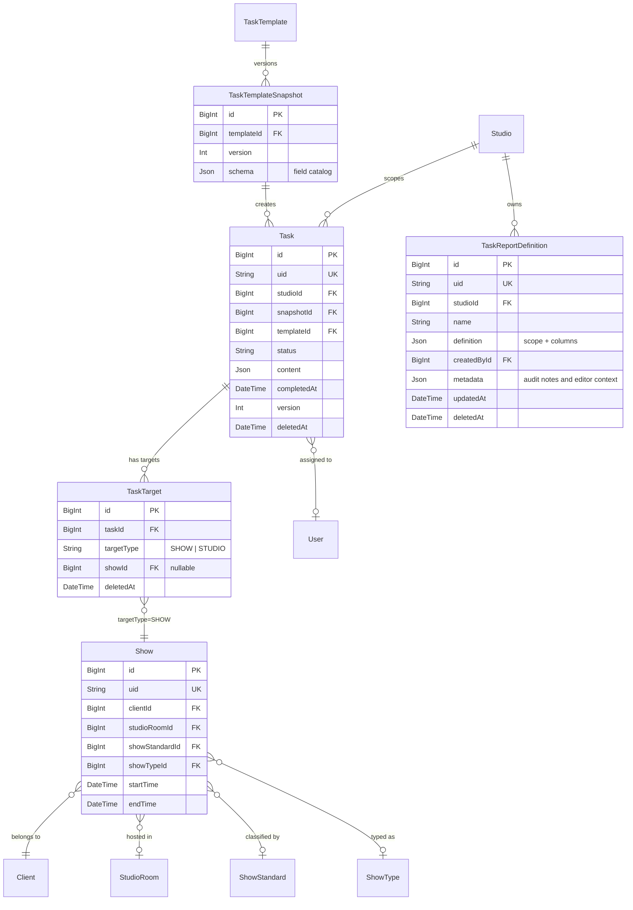
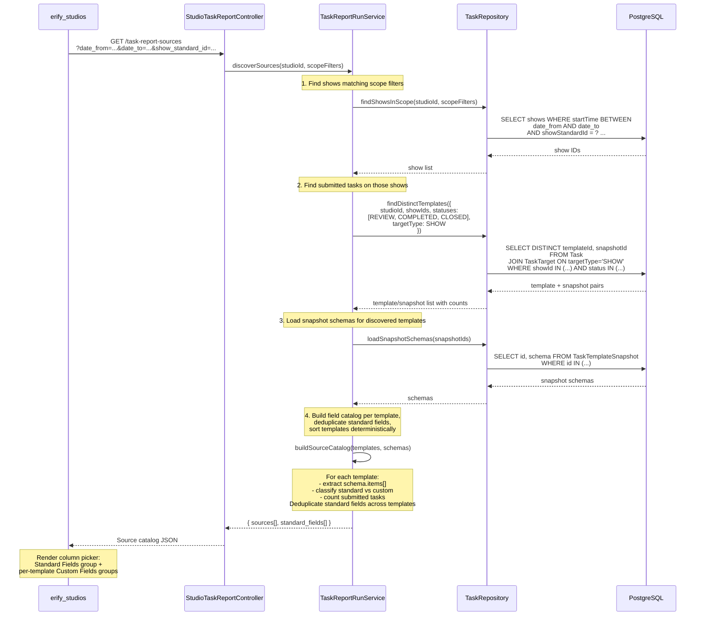
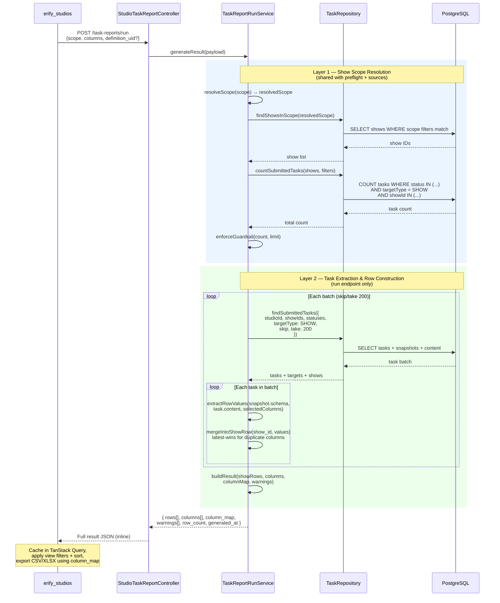
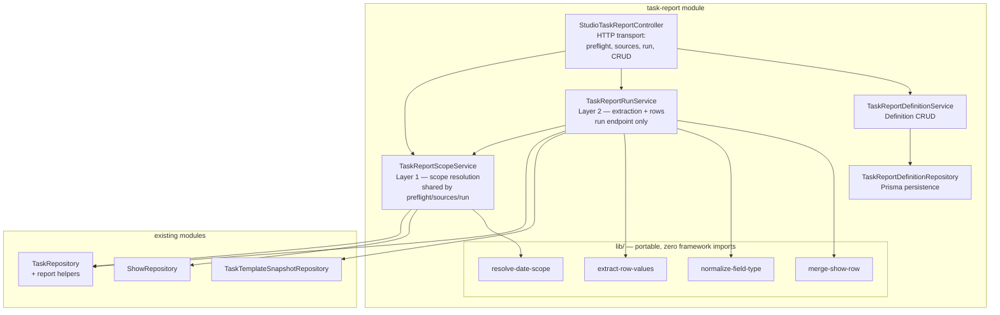

# Task Submission Reporting & Export — Backend Design

> **TLDR**: Add a studio-scoped reporting API with a show-first workflow: managers filter shows, discover available task columns contextually, then the BE joins submitted task data into a flat table JSON returned inline. No server-side result storage — the FE caches and applies view filters client-side.

> [!NOTE]
> **Status: ✅ Implemented** — This document is the architectural reference for the shipped implementation. See [`docs/features/task-submission-reporting.md`](../../../../docs/features/task-submission-reporting.md) for the shipped feature spec.

## 1. Purpose

Support manager-facing review and export of submitted task data without introducing server-side report files or a warehouse dependency. This is a **management and oversight tool** — not part of the operator task-execution flow. Junior moderators submit tasks through existing workflows; they do not interact with the reporting API.

Primary examples:

- moderation managers summarizing shared KPIs (GMV, views, conversion) across many shows and brands,
- studio managers reviewing post-production upload URLs for premium-show QC,
- admins exporting submitted task evidence by client or date range.

This design must fit the current task architecture:

- `Task.content` stores submitted values,
- `TaskTemplateSnapshot.schema` is the historical source of truth,
- tasks link to shows through `TaskTarget` (polymorphic, `targetType = SHOW`), not a direct FK,
- studio-scoped routes already exist for review and task listing,
- no DB internal IDs may leak through API responses.

## 2. Goals

1. Show-first workflow — managers filter shows, then discover available columns contextually.
2. Persist reusable report definitions (studio-shared) with optional date presets as JSON only. All permitted roles can view and run any definition; only the creator or ADMIN can modify/delete.
3. Resolve selected fields against immutable task snapshots.
4. Generate flat table JSON inline — returned in the API response, not stored server-side.
5. Reuse existing task/show/client relations instead of introducing a parallel reporting store.
6. Keep the BE stateless for results — the FE owns caching and view-layer filtering.
7. **Strong semantics, flexible operations** — standardize a small canonical set of shared fields for cross-template reporting without constraining template design or operator workflows. Reporting standardization is an engineering best-practice layer, not an operational constraint. (See feature doc [Key Product Decisions](../../../../docs/features/task-submission-reporting.md#key-product-decisions).)

## 3. Non-Goals

1. No server-side result storage (PostgreSQL JSONB, Redis). Generation is fast enough for inline response.
2. No server-side CSV/XLSX file generation.
3. No cloud-storage report artifacts.
4. No warehouse or BigQuery dependency.
5. No arbitrary formula engine in backend report definitions.
6. No cross-studio reporting or definition sharing across studios.

## Hard Invariants

These are non-negotiable constraints. Any implementation that violates these is incorrect.

1. **One row per show.** `rows[]` length always equals show count. No exceptions — duplicates use latest-wins merge, multi-target tasks merge into each target show's row. The row contract is deterministic: given the same scope and column selection, the same rows are produced.
2. **Shared field keys, types, and categories are immutable after creation.** `key`, `type`, and `category` cannot be changed, renamed, or reused. If the key is wrong, create a new one; the old key stays reserved forever.
3. **Snapshots are the runtime source of truth for data extraction.** The report engine always resolves selected fields from `snapshot.schema.items[]` + `task.content` — this is the only way to preserve historical fidelity across template versions.
   - In this phase, **shared field `category` metadata is sourced from `Studio.metadata.shared_fields[]`** at runtime to support FE grouping in the column picker and column descriptors. This is an accepted tradeoff because shared fields are rarely changed and only admin-managed.
   - **Impact**: changing a shared field's label/category in studio settings can affect future `shared_fields[]` metadata and report column descriptors, but it does not change how values are extracted/merged (the merge key is still the snapshot field `key` when `standard: true`).
   - **Follow-up (optional hardening)**: persist shared-field category into snapshot schema when `standard: true` so the reporting engine can become fully snapshot-driven for metadata as well.
4. **Scope resolution is shared across `/sources`, `/preflight`, and `/run`.** All three endpoints use `TaskReportScopeService` (Layer 1). The same scope input must produce the same resolved show set and task count across all three. If scope resolution diverges between endpoints, the preflight contract is broken.
5. **`column_map` is presentation metadata only.** It maps columns to their source `template_uid` for display grouping (column headers, visual organization). It does not drive export splitting, row expansion, or any structural transformation. Export is always one flat file.
6. **Preflight task counts must match run eligibility.** `task_count` only includes submitted tasks that can actually be processed in run (`templateId` and `snapshotId` are both non-null). Unsnapshotted tasks are excluded from both.

## 4. Key Design Decisions

### 4.1 Show-first workflow

The workflow order is: **filter shows → discover columns → select columns → run report**. This differs from the traditional "select sources first" approach.

Rationale:

- Managers think in terms of "which shows" first — the template is just how data got there.
- Contextual column discovery prevents dead-end selections (picking columns from templates with no tasks in scope).
- The source catalog endpoint accepts show filters and returns only templates/snapshots with submitted tasks on those shows.

### 4.2 Snapshot schema is canonical

Current template schema cannot be the reporting source of truth because tasks already persist against immutable snapshots. Report extraction must always resolve from `task.snapshot.schema` plus `task.content`.

Template-based source selection is allowed, but only as a convenience that resolves to one or more actual snapshot groups at query time.

### 4.3 Flat table result (inline, not stored)

The BE produces a **flat, show-centric table** returned directly in the API response:

- `rows[]` — strictly **one row per show**. Each row is a flat JSON object keyed by column identifiers, with all selected columns merged from the show's submitted tasks. Each row also includes hidden view-filter metadata for client, show status, room, and assignees so the FE can filter cached results without requiring those values as visible columns. If columns cannot be consolidated (e.g., custom fields from different templates), they appear as separate columns on the same row — never as separate rows.
- `columns[]` — ordered column descriptors including system columns (show metadata) and task-content columns. Each column records its source template for metadata.
- `column_map` — maps each column to its source `template_uid` for display grouping and column origin metadata.

This means:

- **Display**: FE receives a ready-to-render table — no client-side merge needed. One row = one show, always.
- **View filters**: FE applies client-side filters (client, status, assignee, room) and simple asc/desc column sorting on the cached result — no server round-trip. The BE includes the needed ids/names on every row, and assignee metadata may be multi-value because one show row can merge tasks from multiple assignees.
- **Export**: All columns export into **one flat file** (CSV or single XLSX sheet). No multi-file splitting — all columns (system + shared fields + custom) appear in one table.
- **Transformation**: The flat rows are easily convertible to 2D arrays for tabular rendering and serialization.

### 4.3.1 Column key format and cross-version merging

Column keys depend on whether the field is a **standard field** or a **custom field**:

- **Standard fields** (`standard: true` in `snapshot.schema.items`): column key = **`field.key`** (e.g., `gmv`). No template prefix — standard fields merge across all templates.
- **Custom fields** (`standard` absent or `false`): column key = **`{template_uid}:{field.key}`** (e.g., `tpl_abc123:notes`). Template-scoped — same key in different templates produces separate columns.

This ensures:

- **Standard fields merge across templates.** A `gmv` standard field in 30 different moderation templates produces one `gmv` column. This is the primary mechanism for cross-client reporting.
- **Same template, different snapshot versions → same column.** Field keys (`key` in `snapshot.schema.items`) are stable across snapshot versions. A field `key: "gmv"` in v1 and `key: "gmv"` in v2 of the same template merge into one column.
- **Custom fields from different templates → different columns.** Two templates with custom `key: "notes"` produce `tpl_abc123:notes` and `tpl_xyz789:notes` — distinct columns.

Why this works:

- `TaskTemplateSnapshot.schema.items[].key` is the property name used in `Task.content`. It is user-defined (snake_case, regex-enforced), not auto-generated.
- When a template is updated, a new snapshot is created but existing field keys are stable. Only adding, removing, or reordering fields changes the schema. Old tasks keep their old snapshot — their `content` keys don't change.
- Adding a new field in a later version means tasks from older versions have `null` for that column — which is the correct behavior.

**Version mismatch handling:**

| Scenario | Example | Result |
|---|---|---|
| Standard field, same key across templates | tpl_A: `gmv` (standard), tpl_B: `gmv` (standard) | Merged into one column `gmv` |
| Standard field, different versions | v1: `gmv` (standard), v2: `gmv` (standard) | Merged into one column `gmv` |
| Custom field, same template, both versions | v1: `notes`, v2: `notes` | Merged into one column `tpl_abc:notes` |
| Custom field, added in later version | v1: no `conversion`, v2: `conversion` | One column, v1 tasks show `null` |
| Custom field, removed in later version | v1: `legacy_field`, v2: no `legacy_field` | One column, v2 tasks show `null` |
| Custom field, key renamed | v1: `gmv`, v2: `gross_value` | Two separate columns (different keys) |
| Custom field, same key in different templates | tpl_A: `notes` (custom), tpl_B: `notes` (custom) | Two separate columns (different template_uid prefix) |

**Edge case — field key rename**: If a template creator renames a field key (e.g., `gmv` → `gross_value`), this is a deliberate schema change. Old and new tasks will have different content keys. The report correctly treats them as separate columns. The FE should show both columns with their respective labels, and tasks from the other version will show `null`.

**Why no server-side result storage:**

| Factor | Assessment |
|---|---|
| **Generation speed** | < 1s typical (500 shows × 2.5 tasks × 20 columns) |
| **Result size** | 100–200KB typical, well within HTTP response limits |
| **Data volatility** | Submissions rarely change once completed |
| **Cross-device** | Re-run is cheap (< 1s), no need for DB-backed sync |
| **Complexity saved** | No result model, no result CRUD, no staleness tracking, no cleanup jobs |

If generation time becomes a concern at scale, server-side result storage can be added as an optimization. The API contract (`rows[]`, `columns[]`, `column_map`) is the same either way.

### 4.4 Two-level filtering

Filters are split into scope (server) and view (client):

**Scope filters** (change the generated dataset — trigger re-generation):

- `date_from`, `date_to` (or date preset)
- `show_standard_id` — premium vs standard
- `show_type_id` — show type segmentation
- `submitted_statuses` — default `[REVIEW, COMPLETED, CLOSED]`
- `source_templates[]` — optional template/snapshot narrowing

**View filters** (slice the cached dataset — FE-only, no server call):

- `client_id` / client name
- `show_status_id` — live, completed, cancelled
- `assignee` — task assignee
- `studio_room_id` — room filter
- `platform_name` — platform filter
- Text search
- Column sort (any column, asc/desc)

This mirrors the Google Sheets workflow: one sheet per time range (scope), filter views per client/status (view).

The FE should render labels from the `*_name` metadata, but keep `*_id` fields as the selected value whenever they exist. That preserves exact filtering for non-unique display names while still showing readable option labels.

### 4.5 Single-file export

Export always produces **one flat file** — one CSV or one XLSX sheet. No multi-file splitting, no partition-based sheet separation.

All selected columns (system + shared fields + custom fields from any number of templates) appear as columns in a single table. If a show has tasks from templates A and B, that show's row has columns for both — custom fields from template A sit alongside custom fields from template B. Columns where the show has no matching task produce `null`.

`column_map` in the API response maps each column to its source `template_uid` for **display grouping** (e.g., the FE can visually group columns by template in the table header) — but it does not drive export splitting.

This keeps the export simple and avoids the confusion of multiple files or sheets for what is conceptually one table.

### 4.6 Shared fields (semantic standardization layer)

> **Guiding principle: strong semantics, flexible operations.** Shared fields standardize *how data is understood* for reporting (fixed keys, locked types and categories, stable merge semantics) without standardizing *how data is collected* (templates, mobile workflows, operator UX). This is an engineering best-practice layer for cross-template data interoperability — not a constraint on template design.

The goal is a small set of shared fields (5–15) across three categories — `metric`, `evidence`, and `status` — that form a canonical reporting vocabulary. Fields with stable semantics that any template can contribute to. These merge across templates in reports. Each template keeps its brand-specific custom fields unchanged. One operational moderation task per show — no template redesign, no second data-collection task.

**Field categories:** Each shared field is assigned an immutable category that classifies its purpose:

| Category | Purpose | Typical types | Examples |
|----------|---------|---------------|----------|
| **`metric`** | Numeric KPIs for performance analysis | `number` | `gmv`, `views`, `orders`, `conversion_rate`, `peak_viewers` |
| **`evidence`** | Proof artifacts for QC and audit | `file`, `url` | `qc_image`, `proof_url`, `post_production_link` |
| **`status`** | Compliance/readiness indicators | `checkbox`, `select` | `is_qc_ready`, `is_post_production_complete` |

Categories are immutable after creation (like key and type). They enable FE sub-grouping in the column picker and settings UI, and document the field's intent.

**Studio-scoped for now.** Shared fields are scoped to the studio because we currently operate one studio. This is practical and avoids premature abstraction. The storage structure (`Studio.metadata.shared_fields[]`) accommodates future multi-studio divergence (each studio defines its own vocabulary) or sharing (promote fields to a global catalog) without structural changes.

#### 4.6.1 Schema change

`FieldItemBaseSchema` in `@eridu/api-types` gains an optional `standard` property:

```typescript
standard: z.boolean().optional()
  .describe('True if this field uses a shared field key. Shared fields merge across templates in reports.')
```

When `standard: true`, the report engine uses `field.key` directly as the column key (no template prefix). The `key` must match one defined in the studio's shared fields list.

#### 4.6.2 Storage and management

Shared fields are stored in `Studio.metadata.shared_fields[]` — an array of field definitions managed by studio admins at runtime.

**Storage structure** (`Studio.metadata`):

```json
{
  "shared_fields": [
    { "key": "gmv", "type": "number", "category": "metric", "label": "GMV", "description": "Gross merchandise value", "is_active": true },
    { "key": "views", "type": "number", "category": "metric", "label": "Views", "description": "Show view count", "is_active": true },
    { "key": "conversion_rate", "type": "number", "category": "metric", "label": "Conversion Rate", "is_active": true },
    { "key": "peak_viewers", "type": "number", "category": "metric", "label": "Peak Viewers", "is_active": true },
    { "key": "orders", "type": "number", "category": "metric", "label": "Orders", "is_active": true },
    { "key": "qc_image", "type": "file", "category": "evidence", "label": "QC Image", "description": "Post-production quality check screenshot", "is_active": true }
  ]
}
```

**Shared fields support any `FieldType`** — not just `number`. Performance KPIs use `number` (category: `metric`), QC evidence fields use `file` or `url` (category: `evidence`), and compliance indicators use `checkbox` or `select` (category: `status`). The merge behavior is the same: fields with the same key + `standard: true` merge across templates into one column. In the export, `file`/`url` columns contain URL strings; in the table, they render as clickable links.

**Validation schema** (Zod, in `@eridu/api-types`):

```typescript
const sharedFieldCategoryEnum = z.enum(['metric', 'evidence', 'status']);
const reservedSystemColumnKeys = new Set([
  'show_id',
  'show_name',
  'show_external_id',
  'client_name',
  'studio_room_name',
  'show_standard_name',
  'show_type_name',
  'start_time',
  'end_time',
]);

const sharedFieldSchema = z.object({
  key: z.string().min(1).max(50).regex(/^[a-z][a-z0-9_]*$/)
    .refine((key) => !reservedSystemColumnKeys.has(key), {
      message: 'Shared field key cannot use reserved report system column keys',
    }),                                                        // snake_case, immutable, non-colliding
  type: FieldTypeEnum,                                          // immutable
  category: sharedFieldCategoryEnum,                            // immutable
  label: z.string().min(1).max(200),                            // editable (display only)
  description: z.string().max(500).optional(),                  // editable
  is_active: z.boolean().default(true),                         // can deactivate, never delete
});

const sharedFieldsListSchema = z.array(sharedFieldSchema)
  .refine(items => new Set(items.map(i => i.key)).size === items.length,
    { message: 'Shared field keys must be unique' });
```

Runtime behavior for malformed stored config: if `Studio.metadata.shared_fields` exists but does not match this schema, settings endpoints fail fast with an error (no silent fallback to `[]`). Missing `shared_fields` defaults to an empty list.

**Management endpoint:**

```
GET  /studios/:studioId/settings/shared-fields     → list all shared fields (ADMIN + MANAGER read)
POST /studios/:studioId/settings/shared-fields     → create a new shared field (key + type immutable after creation)
PATCH /studios/:studioId/settings/shared-fields/:key → update label, description, or is_active only
```

No DELETE — keys are reserved forever once created. Deactivate via `is_active: false` to hide from the template editor picker. Reserved system-column keys are also blocked (`show_id`, `show_name`, `show_external_id`, `client_name`, `studio_room_name`, `show_standard_name`, `show_type_name`, `start_time`, `end_time`) to prevent collisions with built-in report columns.

**Immutability rules:**

| Field | On create | After create |
|-------|-----------|-------------|
| `key` | Required, validated snake_case, must be unique in studio | **Immutable** — cannot be renamed |
| `type` | Required, must be a valid FieldType | **Immutable** — cannot be changed |
| `category` | Required, must be `metric`, `evidence`, or `status` | **Immutable** — cannot be changed |
| `label` | Required | Editable (display-only, does not affect data) |
| `description` | Optional | Editable |
| `is_active` | Default `true` | Can toggle to `false` (hides from picker, key stays reserved) |

**Why fully immutable keys?** Once a shared field key is used in a template snapshot, the snapshot captures it as part of its immutable schema. Task content uses the key as a property name. If the key could be renamed, old snapshots and content would reference the old key while new ones reference the new key — breaking the merge that makes shared fields work. Making keys immutable from creation means we never need to check if any snapshot is using it. The boundary is clear: create it right the first time.

**Role-based access:**

| Role | Shared fields | Template editor | Report builder |
|------|--------------|-----------------|----------------|
| **ADMIN** | Create, update label, deactivate | Select shared fields when building templates | Full access |
| **MANAGER** | Read only (`GET` catalog access; cannot create or modify) | Select shared fields when building templates | Full access |
| **MODERATION_MANAGER** | No access | No access (cannot edit templates) | Full access |
| **Operator / Moderator** | No access | No access | No access |

#### 4.6.3 Snapshot boundary

When a template author adds a shared field field to a template, the full field definition (key, type, label, `standard: true`, validation rules) is captured in the `TaskTemplateSnapshot.schema.items[]` — just like any other field.

**The snapshot is self-contained.** The report engine reads `standard: true` and `field.key` from the snapshot, not from `Studio.metadata`. This means:

- If a shared field's label is later updated in studio settings, old snapshots preserve their original label.
- If a shared field is deactivated (`is_active: false`), existing snapshots that reference it still work — they have the full definition.
- The report engine never queries `Studio.metadata` at runtime. It only reads `snapshot.schema.items[]`.

```
Studio.metadata.shared_fields[]          ← current list for template editor picker
         ↓ (admin selects when building template)
TaskTemplateSnapshot.schema.items[]       ← point-in-time record (immutable)
         ↓ (report engine reads)
Report column with standard: true         ← merges across templates by key
```

This clean separation means shared fields management and reporting are decoupled — changes to the shared fields list never break existing reports.

#### 4.6.4 Template editor integration

When building a template, the author (ADMIN or MANAGER) sees two field sources:
1. **Shared fields** — from `Studio.metadata.shared_fields[]` (only active ones). Selecting one inserts a field with the fixed key, type, and `standard: true`. The author can customize the label and validation rules in the template but **cannot change the key, type, or category** (locked to the shared field definition).
2. **Custom fields** — free-form fields the author defines with their own key. These are the majority of fields in any template.

**Forward-only validation rule:** If a shared field is deactivated (`is_active: false`) after templates already reference it, the behavior is:
- **Existing snapshots**: unaffected. The snapshot captured the full definition at save time — it is self-contained. Old tasks report correctly.
- **New snapshots**: the template editor picker hides deactivated fields, so authors cannot add them to new templates. If an existing template already has the field and is re-saved, the field is preserved in the new snapshot (it was already part of the template schema). The `standard: true` flag and key remain valid — deactivation only removes it from the picker, not from the data model.
- **No retroactive invalidation**: deactivating a shared field never breaks existing templates or tasks. The state only affects new records going forward.

#### 4.6.5 Template rebuild (alpha-phase migration)

> **Context**: The system is in alpha testing with production data from Google Sheets. The apps are not yet in real operational usage. This significantly reduces migration risk.

Existing ~30 moderation templates have shared field fields (GMV, views, etc.) with **different keys per brand template** that need alignment to the shared field vocabulary.

**Strategy: rebuild templates, forward-only for existing data.**

Because we are in alpha, the migration approach is straightforward — rebuild templates from the current Google Sheets source with correct shared field keys from the start. Existing task data (submitted against old snapshots) is **not retroactively migrated**. The shared fields and `standard: true` flags apply to new records only.

**Rationale for forward-only**: What has happened has happened. Existing tasks retain their original snapshot references and content keys. They will appear in reports with template-scoped columns (the old key format) rather than merged shared field columns. This avoids confusion from partial data migration and keeps the boundary clean: old data uses old keys, new data uses standardized keys. Over time, as new tasks are submitted against rebuilt templates, the shared field columns will naturally populate.

**Steps:**

1. **Studio ADMIN creates shared fields** in studio settings (e.g., `gmv` / number, `views` / number). This defines the canonical vocabulary.

2. **Rebuild templates from Google Sheets** — recreate each moderation template using the shared field keys for KPI fields and `standard: true` flag. Brand-specific custom fields are carried over as-is. Each rebuild creates a new snapshot via `updateTemplateWithSnapshot()`.

3. **Verify** — confirm rebuilt templates pass schema validation and that the shared field fields correctly use the canonical keys.

**What this means for reporting:**

- **New tasks** (submitted after rebuild): shared field fields merge across templates as designed. Full cross-template reporting works.
- **Old tasks** (submitted before rebuild): shared field data appears as template-scoped custom columns (e.g., `tpl_abc:gross_sales` instead of merged `gmv`). The data is still accessible but not merged. This is acceptable for alpha — the volume of old data is small and managers understand the transition.
- **No data loss**: old snapshots are preserved, old tasks are untouched, old content keys still resolve correctly against their original snapshots.

This approach eliminates the need for a content migration script, `snapshotId` reassignment, or batch processing — the complexity reduction is significant for alpha phase.

#### 4.6.6 Cross-doc impact

This feature extends the existing task template and studio management systems. The following docs and skills must be updated when shared fields are implemented:

| Doc / Skill | What to update |
|-------------|---------------|
| **Task template design** (if exists) | Template editor gains shared fields picker; `FieldItemBaseSchema` adds `standard` property |
| **Studio management** | New settings section for shared fields; `Studio.metadata` schema extends |
| **`erify-authorization` skill** | ADMIN scope gains "manage shared fields"; MANAGER scope gains "read shared fields" |
| **Role matrix** (`STUDIO_ROLE_USE_CASES_AND_VIEWS.md`) | Add shared-field management row for ADMIN and shared-field catalog read for MANAGER template authoring |
| **`studio-route-access.ts`** | Add `sharedFields` key for ADMIN |
| **`@eridu/api-types`** | Add `sharedFieldSchema`, update `FieldItemBaseSchema`, add settings endpoint schemas |

### 4.7 Date presets in definitions

Definitions can optionally store a default date preset that pre-fills the date range on load:

```json
{
  "scope": {
    "date_preset": "this_week"
  }
}
```

Or explicit dates:

```json
{
  "scope": {
    "date_from": "2026-03-01",
    "date_to": "2026-03-07"
  }
}
```

Supported presets:

| Preset | Resolves to |
|--------|-------------|
| `this_week` | Monday 00:00 → Sunday 23:59 of current week |
| `this_month` | 1st of current month → last day of current month |
| `custom` | Explicit `date_from` / `date_to` |

The BE resolves date presets at run time before executing the query. Presets are a convenience — the `POST /run` endpoint always receives resolved absolute dates (either from preset resolution or direct input).

### 4.8 Submission timestamp — deferred

> **Deferred to ideation**: A typed `submittedAt` field on `Task` would improve sort ordering and filtering precision, but the backfill coverage for historical tasks is poor. For MVP, use `status` filtering (`REVIEW`, `COMPLETED`, `CLOSED`) combined with `updatedAt` for sort ordering. See [docs/ideation/submitted-at-state-machine.md](../../../../docs/ideation/submitted-at-state-machine.md) for the full analysis.

### 4.9 Show-targeted tasks only

Tasks connect to shows through the polymorphic `TaskTarget` model (`targetType = SHOW`), not a direct foreign key. The reporting query must:

1. join through `TaskTarget` to resolve the associated show,
2. filter to `targetType = SHOW` — exclude studio-targeted or other non-show task targets,
3. handle the (rare) case where a task has multiple show targets by emitting one row per show target, not one row per task.

Tasks with no show-type target are excluded from reporting results entirely.

### 4.10 Role-based source visibility

MVP: all permitted roles (`ADMIN`, `MANAGER`, `MODERATION_MANAGER`) see all templates with submitted tasks in the studio.

> **Intentional role boundary expansion**: The current `erify-authorization` skill defines `MODERATION_MANAGER` as scoped to "Dashboard, own tasks, own shifts only." Reporting endpoints intentionally broaden this to cross-show visibility. This is a deliberate product decision — moderation managers need to summarize GMV/views across many shows.

If role-scoped template visibility becomes necessary, add a `template_type` filter to the source catalog endpoint rather than creating separate endpoints per role.

**Implementation checklist for MODERATION_MANAGER expansion** — the following must all be updated together when reporting endpoints are implemented:

- [ ] `erify_api` — all reporting endpoints use `@StudioProtected([ADMIN, MANAGER, MODERATION_MANAGER])`
- [ ] `erify_studios/src/lib/constants/studio-route-access.ts` — add a `taskReports` key
- [ ] `erify_studios/docs/STUDIO_ROLE_USE_CASES_AND_VIEWS.md` — update MODERATION_MANAGER row
- [ ] `erify_studios` sidebar/nav — show the Task Reports link for `MODERATION_MANAGER`
- [ ] `.agent/skills/erify-authorization/SKILL.md` — update MODERATION_MANAGER scope description
- [ ] BE tests — cover `MODERATION_MANAGER` access on all reporting endpoints

### 4.11 Synchronous generation

MVP uses **synchronous generation** — the `POST /task-reports/run` endpoint generates and returns the complete result within the HTTP request lifecycle.

| Factor | Assessment |
|---|---|
| **Typical result size** | < 1,000 rows — completes in < 1s |
| **Row cap** | 10,000 — prevents unbounded generation |
| **User frequency** | Infrequent manager action (not high-concurrency) |
| **Implementation cost** | Zero — no queue/worker infrastructure needed |

#### Decision gates for async migration

Migrate to async generation (BullMQ + 202 Accepted + polling) when **any** of these are true:

1. **P95 generation time exceeds 5 seconds** in production.
2. **HTTP gateway timeout (30s) is hit** for large studios.
3. **Concurrent generation requests cause DB connection pool pressure**.
4. **Product requires removing the 10,000-row cap**.

See [docs/ideation/bullmq-async-processing.md](../../../../docs/ideation/bullmq-async-processing.md) for the full investigation scope.

## 5. Data Model Relationships



## 6. Proposed Schema Additions

### 6.1 `TaskReportDefinition` model

Add a dedicated soft-deletable studio-scoped model.

Suggested fields:

- `id BigInt`
- `uid String @unique`
- `studioId BigInt`
- `name String`
- `description String?`
- `definition Json`
- `metadata Json` (audit notes / editor context)
- `createdById BigInt?`
- `createdAt DateTime`
- `updatedAt DateTime`
- `deletedAt DateTime?`

`definition` JSON stores:

- `scope` — scope filters: optional date preset or explicit dates, `show_standard_id`, `show_type_id`, `submitted_statuses`, `source_templates[]`
- `columns[]` — selected column keys (system + task-content) with optional display ordering

Do **not** store generated rows or result data here.

## 7. Shared API Contract Additions (`@eridu/api-types/task-management`)

Add a new reporting schema module under the task-management domain. Expected DTOs:

- `taskReportSourceDto` — template/snapshot with field catalog
- `taskReportDefinitionDto` — saved definition shape
- `createTaskReportDefinitionSchema`
- `updateTaskReportDefinitionSchema`
- `taskReportRunRequestSchema` — scope + columns (inline or definition_uid)
- `taskReportResultDto` — inline flat table result
- `taskReportColumnDto` — column descriptor with source metadata

Key request concepts (run report):

- `scope`: scope filters with optional date preset, `show_standard_id`, `show_type_id`, `submitted_statuses`
- `columns[]`: selected column keys
- `source_templates[]`: optional template/snapshot filter
- `definition_uid` (optional — for audit/logging only, does not affect generation)

Key response concepts (inline result):

- `rows[]`: strictly one row per show — all task data merged into a single flat row
- hidden row metadata: `client_id`, `client_name`, `show_status_id`, `show_status_name`, `studio_room_id`, `studio_room_name`, `assignee_ids`, `assignee_names`, plus scalar assignee fields when exactly one unique assignee exists
- `columns[]`: ordered column descriptors with source metadata
- `column_map`: maps each column to its source `template_uid` (for display grouping, not export splitting)
- `warnings[]`: duplicate-source flags, version notes
- `scope_summary`: human-readable scope description
- `row_count`: equals show count (one row per show)
- `generated_at`: timestamp

## 8. Endpoint Plan

### 8.1 Contextual source catalog

`GET /studios/:studioId/task-report-sources`

Purpose:

- given scope filters, return templates/snapshots that have submitted tasks on those shows,
- return field catalogs derived from snapshot schemas,
- expose usage summary (`submitted_task_count`, etc.).

#### Source Catalog Discovery Sequence



**Query params** (scope filters):

- `date_from`, `date_to` (at least one scope filter required)
- `show_standard_id` (optional)
- `show_type_id` (optional)
- `show_ids` (optional)
- `submitted_statuses` (optional, default `[REVIEW, COMPLETED, CLOSED]`)

Access:

- `ADMIN`, `MANAGER`, `MODERATION_MANAGER`

This endpoint takes scope filters as input, making the column catalog contextual to the manager's show selection. It uses **Layer 1 (show scope resolution)** (§9.1) to resolve shows, then discovers templates with submitted tasks on those shows.

**Response shape:**

```text
sources[]:
  template_uid         — template identifier
  template_name        — display name
  task_type            — from schema.metadata.task_type
  submitted_task_count — number of submitted tasks for this template in scope
  fields[]:
    key                — selectable column key sent to run API
                         (standard: {field_key}, custom: {template_uid}:{field_key})
    field_key          — raw field key from template snapshot schema
    label              — user-facing label
    type               — field type (text, number, checkbox, etc.)
    standard           — true if this is a standard field
shared_fields[]:      — deduplicated list of shared fields across all sources
  key
  label
  type
  category               — metric, evidence, or status
  contributing_template_count — how many templates use this shared field
  total_task_count            — total submitted tasks across all contributing templates
```

Shared fields appear both in their source template's `fields[]` (for completeness) and in the top-level `shared_fields[]` (for the FE to render the merged "Shared Fields" group in the column picker, sub-grouped by category).

`sources[]` order is deterministic and applied **after in-memory aggregation** (alphabetical by `template_name`). This is intentional: the final payload is a merged projection from grouped task rows + snapshot parsing, so DB ordering alone cannot guarantee stable final order.

### 8.2 Shared fields settings

```
GET  /studios/:studioId/settings/shared-fields       → list all shared fields
POST /studios/:studioId/settings/shared-fields       → create a new shared field
PATCH /studios/:studioId/settings/shared-fields/:key → update label, description, or is_active
```

Access:
- `GET`: **`ADMIN` + `MANAGER`** so task-template authors can load the shared-field picker
- `POST` / `PATCH`: **`ADMIN` only**

This is a studio settings endpoint, not a reporting endpoint. It extends the existing studio management surface. See §4.6.2 for storage details and immutability rules.

### 8.3 Saved definition CRUD

- `GET /studios/:studioId/task-report-definitions`
- `GET /studios/:studioId/task-report-definitions/:definitionUid`
- `POST /studios/:studioId/task-report-definitions`
- `PATCH /studios/:studioId/task-report-definitions/:definitionUid`
- `DELETE /studios/:studioId/task-report-definitions/:definitionUid`

Access:

- `ADMIN`, `MANAGER`, `MODERATION_MANAGER`

Purpose:

- persist named JSON definitions (studio-shared) with scope filters + columns,
- all permitted roles can view and run any definition in the studio,
- creator or ADMIN can update/delete; other roles get 403 on modify attempts,
- support repeated manager workflows and cross-device definition sync,
- clone (deferred to Phase 2) is just POST with pre-filled body from an existing definition.

### 8.4 Report execution (generate + return inline)

`POST /studios/:studioId/task-reports/run`

Access:

- `ADMIN`, `MANAGER`, `MODERATION_MANAGER`

Body is always a **complete, self-contained payload** — the FE resolves the definition into concrete scope + columns before sending:

- **From definition**: FE loads the definition, pre-fills the form, lets the manager override any field. The run request sends whatever the form shows — not the raw definition.
- **Ad-hoc**: FE sends scope + columns directly without referencing a definition.

The BE does **not** merge definition + overrides. It receives a fully resolved payload every time. `definition_uid` is optional metadata for audit/logging only — it does not affect generation.

This endpoint:

1. resolves date presets to absolute dates (if applicable),
2. queries matching shows and their submitted tasks,
3. joins task content into a flat table,
4. returns the complete result inline.

**Request shape:**

```text
scope { date_preset?, date_from?, date_to?, show_standard_id?, show_type_id?, submitted_statuses? }
columns[]
source_templates[]?
definition_uid?  (optional — audit trail only, does not affect generation)
```

**Response shape:**

```text
rows[]
columns[]
column_map
warnings[]
scope_summary
row_count
generated_at
resolved_scope { date_from, date_to, ... }
```

The full result is returned in the response body. No `result_uid` — the result is not persisted server-side.

### 8.5 Preflight count

`GET /studios/:studioId/task-reports/preflight`

Access:

- `ADMIN`, `MANAGER`, `MODERATION_MANAGER`

Purpose: lightweight count query before full generation. The FE calls this before `POST /run` so the manager can confirm scope size and the guardrail can be enforced early — before any heavy extraction work. Uses GET with query params (same parsing as source discovery) since it's a read-only count operation.

**Request shape** (query params, same scope as `/run`):

```text
?date_from=...&date_to=...&show_standard_id=...&show_type_id=...&submitted_statuses=...&source_templates=...
```

**Response shape:**

```text
show_count       — number of shows matching scope
task_count       — number of reportable submitted tasks on those shows (must have templateId + snapshotId)
within_limit     — boolean (task_count <= studio row cap)
limit            — the studio's configured row cap (default 10,000)
```

This is a count-only query — no content extraction, no row building. It runs the same scope resolution logic as `/run` (Layer 1 below) but stops after counting.

If `within_limit` is `false`, the FE blocks the run and shows guidance to narrow scope. The manager never waits for a generation that will fail.

## 9. Query Strategy — Two-Layer Architecture

Report generation is split into two explicit layers with a clear boundary:

| Layer | Responsibility | Shared by |
|-------|---------------|-----------|
| **Layer 1: Show scope resolution** | Resolve filters → find matching shows → count matching tasks → enforce guardrails | `preflight`, `run`, `sources` |
| **Layer 2: Task extraction & row construction** | Load task content in batches → extract column values → build show-centric rows → assemble flat table | `run` only |

This separation ensures the preflight count, source catalog, and full generation all share the same scope resolution logic. Layer 1 is reusable and cheap; Layer 2 is the heavy path that only `run` executes.

### Report Generation Sequence



### 9.1 Layer 1 — Show scope resolution

This layer is shared by `preflight`, `run`, and `sources`. It resolves scope filters into a concrete set of shows and matching task counts.

1. Validate the report scope.
2. Resolve date presets to absolute dates (`this_week` → Monday–Sunday of current week).
3. Require at least one scope filter: `date_from`/`date_to`, `show_standard_id`, `show_type_id`, or `show_ids`.
4. Query matching shows within the resolved scope, filtering by `show_standard`, `show_type`, and other scope filters.
5. Find submitted tasks on those shows (join through `TaskTarget` → `Task` with `targetType = SHOW`).
6. Count total matching tasks.
7. Enforce guardrail: if count exceeds the studio's row cap (default 10,000), abort with a descriptive error.

The output of Layer 1 is a **resolved scope context**: show IDs, task count, and the Prisma where clause for task queries.

### 9.1.1 Layer 2 — Task extraction & row construction

This layer runs only for `POST /run`. It takes the resolved scope context from Layer 1 and produces the flat table.

1. Build a lean Prisma query over `Task` with:
   - `deletedAt: null`
   - studio scope
   - submitted statuses
   - `targets: { some: { targetType: 'SHOW', showId: { in: resolvedShowIds } } }`
   - template/snapshot filters (from `source_templates` if provided)
2. Iterate all matching tasks in internal batches (`skip`/`take` with batch size 200). Each batch: extract selected column values from `snapshot.schema` + `task.content`, merge into show-centric rows, flag duplicates.
3. After all batches: build flat table result with column metadata, warnings, and return inline.

### 9.2 Lean select/include

Select only what the client needs:

- task UID, status, completed/updated timestamps,
- template UID/name,
- snapshot version/schema,
- `content`,
- show metadata via `targets` → `Show`: UID/name/external ID/start/end,
- client UID/name (via show → client),
- studio room UID/name (via show → studio room),
- show status UID/name (via show → show status),
- show standard name (via show → show standard),
- show type name (via show → show type),
- assignee UID/name,
- creator names if needed for system columns.

The `TaskTarget` join is the path to show data. Use a targeted include:

```
include: {
  targets: {
    where: { targetType: 'SHOW', deletedAt: null },
    select: {
      show: {
        select: { uid, name, externalId, startTime, endTime,
                  client: { select: { uid, name } },
                  studioRoom: { select: { uid, name } },
                  showStandard: { select: { uid, name } },
                  showType: { select: { uid, name } } }
      }
    }
  }
}
```

### 9.3 Row building (strict one row per show)

Each show produces **exactly one row** — no exceptions. All task data for a show is merged into that single row. If columns cannot be consolidated, they appear as separate columns on the same row. The row count always equals the show count.

For each matched task:

1. read selected field definitions from `snapshot.schema.items`,
2. for each selected field, compute the column key:
   - **shared field** (`standard: true`): column key = `field.key` (e.g., `gmv`)
   - **custom field**: column key = `{template_uid}:{field.key}` (e.g., `tpl_abc:notes`)
3. pull matching values from `task.content` using `field.key`,
4. normalize by field type,
5. **merge into the show's single row** using the column key.

**Shared fields** from different templates merge into the same column. If a show has moderation tasks from two different brand templates, both contributing `gmv` (standard), the values share the column key `gmv`. Since a show typically has one moderation task, this produces one value. If multiple tasks contribute to the same column on the same show, the duplicate-source handling (§9.4) applies — **the row stays single, conflicts are resolved within it**.

**Custom fields** from different templates produce distinct column keys (`tpl_abc:notes` vs `tpl_xyz:notes`) and appear as **separate columns on the same row**. This is the expected behavior — the manager sees all data for a show in one row, with template-specific columns clearly labeled.

If a show has submitted tasks from different **versions** of the same template, the field values merge into the same column because the column key is the same regardless of snapshot version. Fields that exist in one version but not another produce `null`.

Normalization rules:

- `number` -> numeric JSON value
- `checkbox` -> boolean
- `multiselect` -> array of strings in API response
- `file` / `url` -> raw URL string
- missing key -> `null`

### 9.4 Duplicate-source handling (merge into same row)

MVP assumption: one active non-deleted task per show/template is the normal case.

If multiple non-deleted submitted tasks match the same show + same template (same column keys):

- **Latest-wins merge**: use the task with the most recent `updatedAt` to populate the column values. The row stays single.
- Set `_has_duplicate_source = true` on the affected row.
- Include a warning in `warnings[]` listing the show UID, template, and count of duplicates.
- Store the winning task's UID in the row metadata (e.g., `_source_task_uid`) for traceability.

This preserves the strict one-row-per-show invariant while flagging data hygiene issues. Managers see a warning badge on the row but the table structure stays clean and predictable.

If multiple tasks match the same show but **different templates**, there is no conflict — they contribute to different column keys and merge naturally into the same row.

### 9.5 Multi-target task handling

If a single task has multiple show-type targets (rare but structurally possible via `TaskTarget`), the task's data is merged into **each target show's row**. Each show still gets exactly one row — the task's values appear in multiple rows (one per show target), not as extra rows for the same show.

### 9.6 Internal batch processing

The report generation endpoint does **not** expose pagination to the client. The `TaskReportRunService` iterates all matching tasks internally:

- Internal batch size: `200` rows per iteration (not configurable by client).
- Uses `skip`/`take` with the standard Prisma offset pattern.
- Each batch: extract values, merge into show rows (latest-wins for duplicates).
- After all batches: build flat table, attach duplicate warnings, and return inline.

**Task-count guardrail**: If total matching tasks exceeds the studio's row cap (default `10,000`), abort and return an error asking the manager to narrow scope filters. This is a **result-size cap, not a date-range restriction**. The preflight endpoint (§8.4) enforces this check before full generation — the manager sees the count and is blocked early. Large studios that routinely exceed this should configure a higher per-studio cap. Async generation removes the need for any hard cap.

**Required stable sort order**: The batch query MUST include an explicit `orderBy` clause:

1. `show.startTime DESC`
2. `show.uid DESC`
3. `task.uid DESC`

This determines the final result row order: most-recent shows first.

## 10. Service and Module Boundaries

### Module Architecture



Recommended module split:

- `StudioTaskReportController` for studio-scoped HTTP surface (preflight, sources, run, definition CRUD)
- `TaskReportScopeService` for **Layer 1** — show scope resolution, shared by preflight/sources/run
- `TaskReportRunService` for **Layer 2** — task extraction + row construction (orchestration)
- `TaskReportDefinitionService` for CRUD on saved definitions
- `TaskReportDefinitionRepository` for definition persistence
- extend `TaskRepository` with lean report-query helpers as needed

### 10.1 Extraction-ready file layout

```
src/models/task-report/
  ├── task-report.module.ts                 # NestJS wiring
  ├── task-report.controller.ts             # HTTP transport (preflight, sources, run, CRUD)
  ├── task-report-scope.service.ts          # Layer 1 — scope resolution (NestJS-coupled)
  ├── task-report-run.service.ts            # Layer 2 — extraction + row construction (NestJS-coupled)
  ├── task-report-definition.service.ts     # Definition CRUD (NestJS-coupled)
  ├── task-report-definition.repository.ts  # Definition persistence (Prisma-coupled)
  ├── schemas/                              # Zod + payload types
  └── lib/                                  # PORTABLE: pure functions only
      ├── extract-row-values.ts             # snapshot schema + content → flat values
      ├── normalize-field-type.ts           # field type normalization rules
      ├── merge-show-row.ts                 # merge task values into show-centric row
      └── resolve-date-scope.ts             # date preset → absolute dates
```

`lib/` files must not import NestJS, Prisma, or any app-specific module.

> **Numeric summaries are deferred from BE scope.** See [docs/ideation/task-analytics-summaries.md](../../../../docs/ideation/task-analytics-summaries.md).

## 11. Validation and Guardrails

1. Roles: `ADMIN`, `MANAGER`, `MODERATION_MANAGER` — this is a management tool, not for junior moderators/operators
2. Maximum selected columns per report: hard cap `50`. Rationale: typical usage is 5–15 system/KPI columns + 5–20 custom fields per template. 50 accommodates multi-template reports while keeping response size and table width manageable. The FE column picker enforces this at selection time; the BE validates on run.
3. Maximum total matched tasks: configurable per studio (default `10,000`). Enforced by both preflight (§8.5) and run (§9.1)
4. **Preflight-first flow**: the FE must call preflight before run. The preflight returns `show_count`, `task_count`, and `within_limit`. Over-limit scopes are blocked before any heavy extraction runs
5. Internal batch size: `200` rows per iteration during result generation (Layer 2)
6. Require at least one scope filter (`date_from`/`date_to`, `show_standard_id`, `show_type_id`, or `show_ids`)
7. Reject unknown column keys at validation time
8. Validate date presets against supported values
9. Response size: typical 100–200KB, max ~5MB for very large results. Standard gzip compression applies.

### 11.1 Error contract

All reporting endpoints must return structured, meaningful error responses. Design the error contract alongside the feature — not as an afterthought. Follow the existing `HttpError` utility patterns and project security practices to avoid information leakage.

**Required error responses:**

| Scenario | HTTP Status | Error message (user-facing) |
|----------|------------|----------------------------|
| No scope filters provided | 400 | "At least one scope filter is required" |
| Unknown column key in selection | 400 | "Unknown column key: {key}" |
| Column count exceeds limit | 400 | "Selected {n} columns — maximum is 50" |
| Task count exceeds studio row cap | 400 | "Scope includes {n} tasks (limit: {limit}). Narrow your scope filters." |
| Invalid date preset | 400 | "Invalid date preset: {value}" |
| Date range too wide (optional guard) | 400 | "Date range exceeds maximum of {n} days" |
| Shared field key already exists | 409 | "Shared field key '{key}' already exists" |
| Shared field key/type/category mutation attempt | 400 | "Key, type, and category cannot be changed after creation" |
| Unauthorized role | 403 | Standard guard response |

**Security considerations:**
- Never expose internal IDs, stack traces, or query details in error responses.
- Rate-limit the generation endpoint to prevent abuse (standard throttler guard applies).
- Validate all input against Zod schemas before processing — reject malformed payloads early.
- The preflight + run flow itself is a guardrail: the preflight count prevents expensive generation on over-broad scopes.

## 12. Risks and Mitigations

### 12.1 Template evolution and definition stability

Definitions reference **column keys** (e.g., `gmv`, `tpl_abc:notes`), not snapshot versions. Tasks are fixed to their assigned snapshot via `task.snapshotId` — template updates create new snapshots but don't change existing tasks.

This means definitions are inherently stable:
- Existing tasks' content keys don't change when the template is updated.
- A column key that matched data before will continue matching after a template update.
- New fields added in later snapshot versions simply produce `null` for older tasks — correct behavior.

The only scenario where a definition's column becomes empty is if **no tasks** in the scope were created from a snapshot containing that field. This is a scope issue (not a definition issue) and is visible from the result metadata.

### 12.2 File URL longevity

Risk: if upload URLs ever become signed/expiring, exported values may go stale.

Mitigation: keep URL export as current-state behavior; if signed URLs are introduced later, add on-demand re-sign endpoints.

### 12.3 TaskTarget join complexity

Risk: Tasks connect to shows through the polymorphic `TaskTarget` model, adding a join hop to every report query.

Mitigation:
- ensure `TaskTarget` has a composite index on `[taskId, targetType]`,
- the lean select/include pattern keeps the join narrow,
- if query performance degrades, consider a denormalized `showId` on `Task` for reporting-hot-path queries.

### 12.4 Large JSON response

Risk: selected task content can become large over long date ranges.

Mitigation: bounded scope, lean select, result row cap (10,000), selected-field extraction, gzip compression on response.

### 12.5 Offset-based batching under concurrent writes

Risk: row shifts during batch iteration.

Mitigation: reporting scope is limited to `REVIEW`/`COMPLETED`/`CLOSED` tasks (rarely change mid-generation). Switch to keyset pagination if needed.

### 12.6 Contextual source catalog performance

Risk: the source catalog endpoint joins shows → tasks → snapshots, which is heavier than a static catalog.

Mitigation: the manager has already narrowed the show set via scope filters, bounding the join. Add a composite index on `[studioId, status]` for task filtering. Cache source catalog responses with a short TTL if needed.

### 12.7 Repeated generation for same scope

Risk: without server-side caching, the same report scope generates redundantly across devices or after page refresh.

Mitigation: generation is fast (< 1s typical). The FE caches recently generated results in TanStack Query. IndexedDB can be added for cross-session persistence. If generation cost becomes a concern, add server-side result storage as an optimization — the API contract is the same either way.

### 12.8 Shared fields metadata write race (known issue, accepted for MVP)

Risk: shared fields settings currently use a read-modify-write flow on `Studio.metadata.shared_fields[]`. Concurrent ADMIN writes can cause last-write-wins behavior and lost updates.

Mitigation (current): accepted operational risk for MVP because updates are rare and only a small number of studio admins can modify shared fields concurrently.

Deferred hardening options:
- move shared fields to a dedicated normalized table/model with DB-level constraints, or
- add optimistic concurrency (compare-and-swap on `updatedAt` with retry/conflict response).

## 13. Rollout Recommendation

### Milestone BE-1 (Core workflow)

1. shared fields settings endpoint (`GET` readable by ADMIN + MANAGER; `POST/PATCH` ADMIN-only) stored in `Studio.metadata`
2. Layer 1 (show scope resolution) as a shared internal service used by preflight, sources, and run
3. preflight count endpoint (`GET /task-reports/preflight`) — lightweight scope validation before generation (GET with query params)
4. contextual source catalog endpoint (templates/snapshots with submitted tasks for filtered shows)
5. report generation endpoint (`POST /task-reports/run`) with Layer 2 (task extraction + row construction), date preset resolution, comprehensive scope filters, `TaskTarget` join, internal batch processing, flat table generation, and inline response
6. saved definition CRUD with date presets and scope filter persistence
7. inline ad-hoc support (run without a saved definition)
8. **cross-doc updates** (§4.6.6) — must be completed as part of BE-1, not deferred. Shared fields extend the existing task template and studio management systems; the authorization skill, role matrix, route access config, and `@eridu/api-types` must all reflect the new capability before the feature is considered complete
9. **error contract** (§11.1) — structured error responses for all reporting endpoints, designed alongside the feature

### Milestone BE-2 (Polish)

1. role-aware source catalog filtering by `task_type` if product requires it
2. per-studio configurable row cap

### Milestone BE-3 (Scale, if needed)

1. async result generation (202 + polling) for large datasets
2. optional server-side result caching for expensive reports
3. server-side CSV/XLSX export endpoint
4. response compression for large payloads

## 14. Verification Plan

When implemented, verify at minimum:

- `pnpm --filter erify_api lint`
- `pnpm --filter erify_api typecheck`
- `pnpm --filter erify_api test`

Targeted tests:

1. preflight returns correct `show_count` and `task_count` for given scope
2. preflight returns `within_limit: false` when task count exceeds studio row cap
3. preflight and run share the same scope resolution logic (Layer 1) — same scope produces same counts
4. contextual source catalog returns only templates with tasks on filtered shows
5. source catalog returns empty when no submitted tasks match the scope filters
6. source catalog filters by show standard, show type correctly
7. date presets resolve correctly (`this_week`, `this_month`)
8. result generation produces strictly one row per show with correct column values
9. show rows merge shared field values from multiple task templates into the same row correctly
10. custom fields from different templates appear as separate columns on the same row (not separate rows)
11. template-based custom columns return `null` for missing keys on older snapshots
12. submitted-status filtering excludes in-progress work by default
13. saved definition CRUD respects studio scoping and soft delete
14. only show-targeted tasks are included; studio-targeted tasks are excluded
15. tasks with multiple show targets merge into each target show's row (not extra rows)
16. `_has_duplicate_source` flag is set on rows where latest-wins conflict resolution was applied
17. duplicate-source uses latest `updatedAt` task and stores winning task UID in row metadata
18. inline response includes correct `row_count` and column metadata
19. result row cap rejects over-scoped queries with descriptive error (consistent with preflight)
20. definition with scope overrides generates correctly (e.g., stored `this_week` + override `date_from`/`date_to`)
21. column count exceeding 50 is rejected with descriptive error
22. shared field deactivation does not break existing templates or reporting on old snapshots
23. error responses follow §11.1 contract — structured, no internal ID leakage
