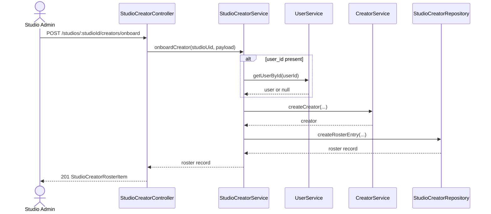

# Studio Creator Onboarding — Backend Design

> **Status**: Implemented (PR #32)
> **Phase scope**: Phase 4 Wave 1
> **Owner app**: `apps/erify_api`
> **Product source**: [`docs/prd/studio-creator-onboarding.md`](../../../../docs/prd/studio-creator-onboarding.md)
> **Depends on**: Studio creator roster ✅, creator model service ✅, user model service ✅

## Purpose

Ship the backend contract for studio-owned creator onboarding without `/system/*` dependency:

- create a brand-new global `Creator` plus active `StudioCreator` row in one atomic studio-scoped action
- expose a studio-guarded user lookup for optional `user_id` linking during onboarding
- fix the pre-existing roster-enforcement gap in show assignment so off-roster creators are rejected at write time

## Scope

| Change | Type | Priority |
| --- | --- | --- |
| `POST /studios/:studioId/creators/onboard` | New endpoint | Primary |
| `GET /studios/:studioId/creators/onboarding-users` | New endpoint | Primary |
| `CREATOR_NOT_IN_ROSTER` shared error code | Contract update | Primary |
| Roster enforcement fix in `bulkAssignCreatorsToShow` | Bug fix | Primary |
| Preserve current duplicate-user-link behavior | Explicit non-expansion | Primary |

## Ordered Task List

### BE-1 Shared Contracts

- [x] Add `onboardCreatorInputSchema` to `packages/api-types/src/studio-creators/schemas.ts`.
- [x] Add `studioCreatorOnboardingUserSearchQuerySchema` to `packages/api-types/src/studio-creators/schemas.ts`.
- [x] Add `CREATOR_NOT_IN_ROSTER` to `STUDIO_CREATOR_ROSTER_ERROR`.
- [x] Re-export any new onboarding types from the package entrypoints consumed by `erify_api` and `erify_studios`.
- [x] Add schema tests for valid onboarding payloads, invalid compensation combinations, and query-limit bounds.

### BE-2 Controller And DTO Wiring

- [x] Add `apps/erify_api/src/studios/studio-creator/schemas/studio-creator-onboard.schema.ts`.
- [x] Add `apps/erify_api/src/studios/studio-creator/schemas/studio-creator-onboarding-user-search.schema.ts`.
- [x] Add `POST /studios/:studioId/creators/onboard` to `apps/erify_api/src/studios/studio-creator/studio-creator.controller.ts`.
- [x] Add `GET /studios/:studioId/creators/onboarding-users` to `apps/erify_api/src/studios/studio-creator/studio-creator.controller.ts`.
- [x] Keep both endpoints under `ADMIN` studio guard only.

### BE-3 Service And Repository Work

- [x] Add `OnboardCreatorPayload` support in `apps/erify_api/src/models/studio-creator/schemas/studio-creator.schema.ts`.
- [x] Inject `CreatorService` into `StudioCreatorService` and add `onboardCreator(studioUid, payload)`.
- [x] Reuse the existing roster compensation validation path instead of duplicating cross-field rules.
- [x] Validate optional `userId` existence before creator creation, while preserving current duplicate-user-link behavior from `CreatorService.createCreator()`.
- [x] Add `searchOnboardingUsers({ search, limit })` to `StudioCreatorService`.
- [x] Add `searchUsersForCreatorOnboarding()` to `UserService`.
- [x] Add `searchUsersForCreatorOnboarding()` to `UserRepository` with `deletedAt = null` and "no linked creator" filtering.
- [x] Wire any missing module imports in `apps/erify_api/src/models/studio-creator/studio-creator.module.ts`.

### BE-4 Assignment Gate Fix

- [x] Update `apps/erify_api/src/show-orchestration/show-orchestration.service.ts` so creator assignment first verifies roster membership, then active state.
- [x] Return `CREATOR_NOT_IN_ROSTER` when the creator exists globally but has no `StudioCreator` row for the studio.
- [x] Preserve `CREATOR_INACTIVE_IN_ROSTER` when the row exists but is inactive.
- [x] Keep already-assigned creators idempotent instead of turning them into false-positive failures.

### BE-5 Test Coverage

- [x] Add service tests for `StudioCreatorService.onboardCreator`.
- [x] Add controller tests for both onboarding endpoints.
- [x] Add tests for onboarding-user search eligibility filtering and guard behavior.
- [x] Add regression tests for `bulkAssignCreatorsToShow` covering off-roster and inactive-roster creators.
- [x] Add or update shared contract tests in `@eridu/api-types`.

### BE-6 Verification Gate

- [x] Run `pnpm --filter @eridu/api-types lint`.
- [x] Run `pnpm --filter @eridu/api-types typecheck`.
- [x] Run `pnpm --filter @eridu/api-types test`.
- [x] Run `pnpm --filter erify_api lint`.
- [x] Run `pnpm --filter erify_api typecheck`.
- [x] Run `pnpm --filter erify_api test`.
- [x] Run `pnpm --filter erify_api build` if package exports, DTO wiring, or module wiring changes require it.

## Design Decisions

- `StudioCreatorService` owns the onboarding transaction because the desired outcome is an active studio roster row; global creator creation is a prerequisite step inside that workflow.
- `user_id` stays optional, but if supplied it must be validated through a studio-safe lookup path rather than `/admin/users`.
- This slice does **not** add a new onboarding-specific duplicate-user-link error code. It preserves the existing `CreatorService.createCreator()` behavior when a user is already linked to another creator.
- Roster-first enforcement happens in the write path immediately. Overlap/conflict logic remains in the separate creator-availability hardening scope.

## API Surface

### `POST /studios/:studioId/creators/onboard`

Creates a new global `Creator` and a new active `StudioCreator` roster row in one transaction.

**Guard**

`@StudioProtected([STUDIO_ROLE.ADMIN])`

**Request**

```json
{
  "creator": {
    "name": "Alice Example",
    "alias_name": "Alice",
    "user_id": "user_123",
    "metadata": {}
  },
  "roster": {
    "default_rate": 500,
    "default_rate_type": "FIXED",
    "default_commission_rate": null,
    "metadata": {}
  }
}
```

**Response**

`201 Created`, returning the canonical `StudioCreatorRosterItem` DTO already used by `POST /studios/:studioId/creators`.

**Behavior**

1. Validate roster compensation defaults using the same cross-field rules as roster add/reactivate.
2. If `creator.user_id` is provided, verify the user exists before creator creation.
3. Create the global `Creator` through `CreatorService.createCreator()`.
4. Create the active `StudioCreator` roster row for the current studio.
5. Return the populated roster record with creator relation.

**Error behavior**

| HTTP | Condition | Notes |
| --- | --- | --- |
| `404` | Provided `user_id` does not exist | Standard resource-not-found path; no new shared error code needed for this slice |
| `400` | Provided `user_id` is already linked to another creator | Preserve current `CreatorService.createCreator()` behavior |
| `422` | Invalid payload or invalid compensation combination | Shared schema validation |

### `GET /studios/:studioId/creators/onboarding-users`

Studio-scoped lookup endpoint for optional creator-to-user linking during onboarding.

**Guard**

`@StudioProtected([STUDIO_ROLE.ADMIN])`

**Query**

```http
GET /studios/:studioId/creators/onboarding-users?search=alice&limit=20
```

**Query contract**

- `search`: required, trimmed, minimum 1 character
- `limit`: optional, default `20`, max `50`

**Response**

`200 OK`, array of `userApiResponseSchema` items from `@eridu/api-types/users`.

**Lookup rules**

- search across `uid`, `email`, `name`, and `ext_id`
- exclude soft-deleted users
- exclude users already linked to a creator
- order by best operational readability: `name asc`, then `email asc`

**Why this endpoint exists**

The studios app currently only has `/admin/users` search. That route is not valid for a studio-admin-owned onboarding flow, so onboarding needs a studio-guarded lookup surface of its own.

### Assignment Enforcement Fix

No new endpoint. Fix the existing write path in `ShowOrchestrationService.bulkAssignCreatorsToShow`.

Current behavior only rejects inactive roster rows. New behavior must also reject creators with no roster row:

| Code | HTTP | Condition |
| --- | --- | --- |
| `CREATOR_NOT_IN_ROSTER` | `422` | Creator exists globally but has no `StudioCreator` row for the studio |
| `CREATOR_INACTIVE_IN_ROSTER` | `422` | Creator has a `StudioCreator` row but it is inactive |



## Shared Types And DTOs

### `packages/api-types/src/studio-creators/schemas.ts`

Add:

- `onboardCreatorInputSchema`
- `studioCreatorOnboardingUserSearchQuerySchema`
- `CREATOR_NOT_IN_ROSTER` to `STUDIO_CREATOR_ROSTER_ERROR`

Keep the onboarding user search response on the existing user domain contract by reusing `userApiResponseSchema` from `@eridu/api-types/users`.

### `apps/erify_api/src/studios/studio-creator/schemas/`

Add:

- `studio-creator-onboard.schema.ts`
- `studio-creator-onboarding-user-search.schema.ts`

The controller DTOs should transform wire-format snake_case into an internal camelCase payload, but preserve the nested `creator` and `roster` structure so the controller can explicitly map only the fields the service needs.

### `apps/erify_api/src/models/studio-creator/schemas/studio-creator.schema.ts`

Add:

```typescript
export type OnboardCreatorPayload = {
  creator: {
    name: string;
    aliasName: string;
    userId?: string | null;
    metadata?: Record<string, unknown>;
  };
  roster: {
    defaultRate?: number | null;
    defaultRateType?: string | null;
    defaultCommissionRate?: number | null;
    metadata?: Record<string, unknown>;
  };
};
```

## Service Layer

### `StudioCreatorService.onboardCreator`

Add a new `@Transactional()` method:

```text
onboardCreator(studioUid, payload)
1. validate compensation defaults
2. if payload.creator.userId exists, verify the user exists
3. create Creator through CreatorService.createCreator()
4. create active StudioCreator row through StudioCreatorRepository.createRosterEntry()
5. return populated roster record
```

Important details:

- inject `CreatorService`, not just `CreatorRepository`, for creator creation
- preserve the existing `CreatorService.createCreator()` duplicate-user-link behavior
- do not attempt fuzzy dedupe by `name` or `aliasName` in this slice

### `StudioCreatorService.searchOnboardingUsers`

Add a read helper for the new lookup endpoint:

```text
searchOnboardingUsers({ search, limit })
1. trim search
2. delegate to UserService.searchUsersForCreatorOnboarding()
3. return lightweight public user records
```

### `UserService` / `UserRepository`

Add a targeted onboarding-search method rather than reusing the admin user list API.

Recommended shape:

```typescript
// UserService
searchUsersForCreatorOnboarding(
  params: { search: string; limit: number }
): Promise<User[]>
```

```typescript
// UserRepository
searchUsersForCreatorOnboarding(
  params: { search: string; limit: number }
): Promise<User[]>
```

Repository filter rules:

- `deletedAt: null`
- no linked creator relation
- `OR` match on `uid`, `email`, `name`, `extId`

### `ShowOrchestrationService.bulkAssignCreatorsToShow`

Add a full roster membership check before the existing inactive check:

```typescript
const rosteredCreatorIds = new Set(
  studioCreatorRosterEntries.map((entry) => entry.creator.uid),
);

if (!rosteredCreatorIds.has(creator.creatorId)) {
  result.failed.push({
    creatorId: creator.creatorId,
    reason: STUDIO_CREATOR_ROSTER_ERROR.CREATOR_NOT_IN_ROSTER,
  });
  continue;
}
```

This fixes the current silent off-roster assignment bug without pulling overlap logic into this PR.

## Controller Layer

### `StudioCreatorController`

Add:

- `GET /studios/:studioId/creators/onboarding-users`
- `POST /studios/:studioId/creators/onboard`

Recommended patterns:

- use `@ZodResponse(z.array(userApiResponseSchema))` for onboarding-user results
- use `@ZodResponse(studioCreatorRosterItemApiSchema, HttpStatus.CREATED)` for onboarding create
- use explicit `@Param('studioId', new UidValidationPipe(...))` and explicit DTO mapping, consistent with current controller style

## Module Wiring

Update `StudioCreatorModelModule`:

- keep `CreatorModule`
- add `UserModule`
- inject `CreatorService` and `UserService` into `StudioCreatorService`

No new top-level API module is required. The work stays within the existing studio-creator controller/module boundary.

## File Inventory

| File | Action |
| --- | --- |
| `packages/api-types/src/studio-creators/schemas.ts` | Add onboard input schema, onboarding-user query schema, `CREATOR_NOT_IN_ROSTER` |
| `apps/erify_api/src/studios/studio-creator/schemas/studio-creator-onboard.schema.ts` | New DTO |
| `apps/erify_api/src/studios/studio-creator/schemas/studio-creator-onboarding-user-search.schema.ts` | New DTO |
| `apps/erify_api/src/models/studio-creator/schemas/studio-creator.schema.ts` | Add `OnboardCreatorPayload` |
| `apps/erify_api/src/studios/studio-creator/studio-creator.controller.ts` | Add onboarding create + user-search actions |
| `apps/erify_api/src/models/studio-creator/studio-creator.service.ts` | Add `onboardCreator()` and onboarding-user search |
| `apps/erify_api/src/models/studio-creator/studio-creator.module.ts` | Import `UserModule`; inject new dependencies |
| `apps/erify_api/src/models/user/user.service.ts` | Add onboarding user search method |
| `apps/erify_api/src/models/user/user.repository.ts` | Add targeted onboarding user search query |
| `apps/erify_api/src/show-orchestration/show-orchestration.service.ts` | Fix off-roster assignment enforcement |

## Testing

### Shared Schema Tests

- `onboardCreatorInputSchema` accepts valid payloads
- `onboardCreatorInputSchema` rejects invalid compensation combinations
- `studioCreatorOnboardingUserSearchQuerySchema` trims input and enforces limits
- `CREATOR_NOT_IN_ROSTER` is exported in the shared roster error contract

### `erify_api` Tests

- `StudioCreatorService.onboardCreator` happy path
- onboarding with invalid `user_id` returns not-found
- onboarding with already-linked `user_id` preserves current duplicate-user-link error behavior
- onboarding user search excludes users already linked to creators
- controller guard + response shape for both new endpoints
- `ShowOrchestrationService.bulkAssignCreatorsToShow` rejects off-roster creators
- existing inactive-roster rejection still works

## Assumptions Locked For Implementation

- No new typed error code is added for duplicate user-link conflicts in this slice.
- The onboarding user lookup is global-user search, but access to it is studio-admin-guarded.
- Off-roster enforcement is write-path-only here; overlap enforcement remains in creator-availability hardening.
