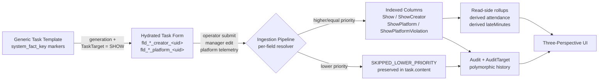
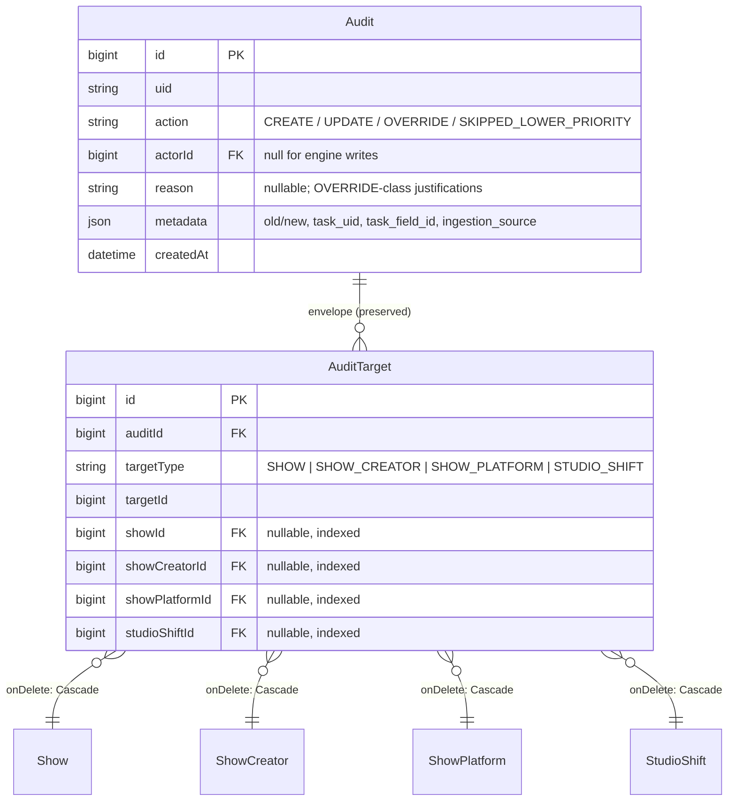
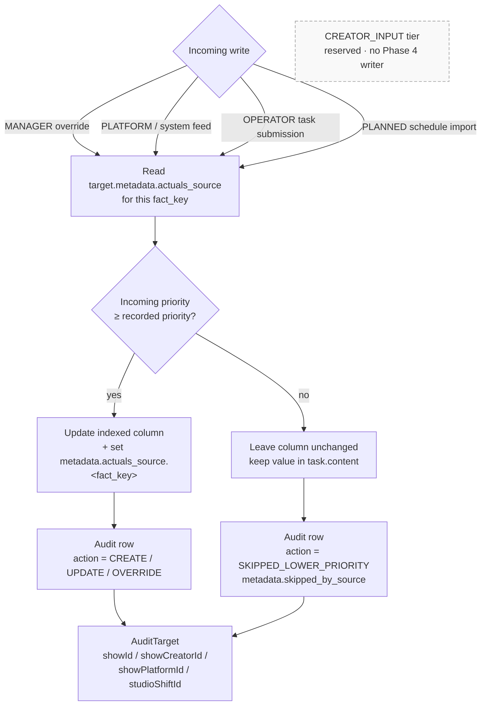
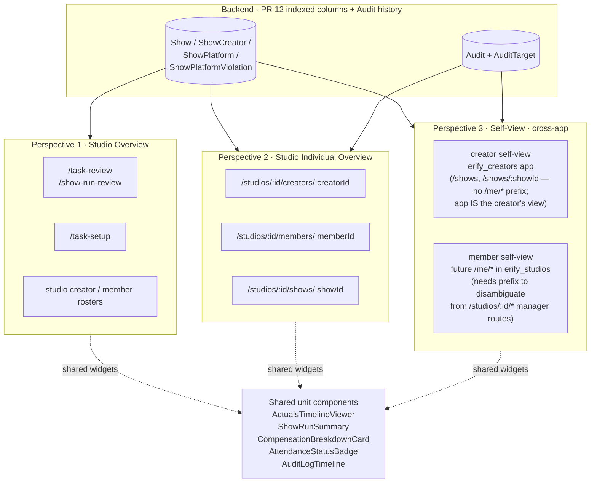

# TASK_INPUT_FACT_BINDING_DESIGN.md

## Technical Design: Task-Input Fact Binding and Event-Driven Actuals

This document defines the architectural specifications, database schemas, and extraction pipeline rules for **PR 12 (Critical task-input semantics for actuals and performance)**. It bridges the gap between generic, operator-completed task submissions and first-class indexed operational metrics across shows, platforms, creators, and platform violations.

> **Roadmap pointer**: PR 12's operational pipeline ships as foundation PRs (12.0.1-12.0.5), extractor PRs (12.1.1-12.3.2), and the expanded Operations Review workstream (12.4.1-12.4.6). The Phase 4 roadmap ([`docs/roadmap/PHASE_4.md`](../../../../docs/roadmap/PHASE_4.md)) owns the sub-PR sequencing and dependencies, including the PR 21 analytics infrastructure investigation. Every schema addition in §2 below lands as one atomic migration in **PR 12.0.2** before any consumer wiring, so the binding picker (12.0.3), hydration engine (12.0.4), extraction pipeline (12.0.5), and each downstream extractor (12.1.1-12.3.2) all assume the columns and tables already exist.

---

## 0. End-to-End Flow at a Glance



See §6 for how the three perspectives consume the same indexed reads and audit history through shared widgets.

---

## 1. Architectural Core Principles

To deliver rapid reporting, highly customizable operator form layouts, deterministic priority conflict resolution, and solid referential integrity, the architecture is grounded in five core principles:

1. **Confirmed-Submission Push Model (Deterministic Actuals)**: Facts from task forms are parsed and written when the task transitions into `COMPLETED` through manager confirmation. Operator submissions first land in `REVIEW`; manager confirmation is the gate that triggers extraction. Manager overrides and corrections also flow through submitted tasks rather than direct target-table edits. Writes are gated by a strict source priority hierarchy: manager override tasks outrank system/platform inputs, system/platform inputs outrank operator task forms, and task forms outrank planning schedules. Lower-priority updates do not overwrite newer, higher-priority data. A reserved "creator-attributed input" tier sits between system/platform inputs and operator task inputs; it has no Phase 4 writer, so the resolver implements only the active tiers (MANAGER → PLATFORM → OPERATOR → PLANNED) and documents the reserved slot for forward-compatibility.
2. **Context-Aware Task Generation (Additive Snapshot Hydration)**: Task templates remain generic and platform/creator-agnostic. When a task is instantiated for a specific show, a `TaskTarget` links them. The task generation engine scans the template for `system_fact_key` markers (e.g., `creator_attendance_missing`) and dynamically hydrates the task's snapshot schema with target-specific field inputs whose keys are deterministic and stable (e.g., `fld_attendance_missing_creator_<creatorUid>`). The snapshot is **append-only mutable** for hydrated bindings: when assignments change between generation and submission, the engine appends new hydrated fields for newly assigned targets but never removes hydrated fields for targets that were unassigned afterwards. Fields whose target is no longer assigned are marked `binding_stale: true`; the extractor skips them and routes their submitted values to the review queue (PR 12.4) instead of writing to an unassigned target. Non-hydrated template fields remain immutable.
3. **Operational Facts vs Analytical Metrics**: Operational facts that drive exception review, filtering, export, or workflow gating (actual times, attendance missing, platform violations) are stored in dedicated, indexed columns on the narrowest scoped table. Attendance state (`ON_TIME` / `LATE` / `MISSING`) and late minutes are **derived at read time** from `ShowCreator.actualStartTime`, the sticky `ShowCreator.attendanceMissing` marker, and `Show.startTime` — they are not stored as columns. Platform-scoped performance metrics — **GMV, viewer count, CTR, CTO, likes, concurrents, and any cross-show aggregate** — are classified as analytical and deferred to PR 21 (see [`show-performance-analytics.md`](../../../../docs/prd/show-performance-analytics.md)). PR 12.0.2 does not promote any analytical metric to a typed `ShowPlatform` column; `ShowPlatform.viewerCount` retains its pre-existing `Int @default(0)` shape from the initial migration but is read as an analytical fact rather than an operational gate. Show-level analytical rollups likewise belong in a separate read-model or OLAP design, not in `Show`.
   - **Promotion Workflow**: When an analytical metric proves it has a *concrete operational workflow depending on it* (e.g., exception flag, mandatory review gate), a follow-up design/ideation step decides whether to promote it to a typed indexed `ShowPlatform` column with a backfill migration, or expose it through a read-model.
4. **Prisma-Compliant Polymorphic Auditing (`Audit` & `AuditTarget`)**: Standardize confirmed task extraction writes under a centralized audit system. The schemas avoid raw string target pointers, instead defining explicit, optional foreign key fields (`showId`, `showCreatorId`, `showPlatformId`, `studioShiftId`) to preserve strict relational constraints. Engine-written audits use `actorId = null`, `metadata.ingestion_source = "task_submission"`, and carry `metadata.task_uid` and `metadata.task_field_id` so each extracted fact links back to its source field. Manager override/correction tasks carry manager-source provenance through the submitted task, then extract through the same audit pipeline on confirmation.
5. **Lean Core Models with Per-Field Source Provenance**: Core models do not carry `actualsStatus` or row-level `actualsSource` columns. Instead, the source that produced each individual selected fact is stored as a **per-field map** inside the model's existing `metadata` JSONB bucket: `metadata.actuals_source = { actual_start_time: 'MANAGER', actual_end_time: 'TASK' }`. The actuals state is dynamically inferred from pair completeness: complete means both `actualStartTime` and `actualEndTime` are present; missing/incomplete means either edge is absent. The per-field shape generalizes cleanly to later analytical facts once the analytics infrastructure decision lands (12.6+). Reads may project a "dominant source" for UI display, but the storage shape is per-field.

---

## 2. Database Schema

The database schema is updated to add nullable actuals columns to operational tables, index high-frequency query parameters, and establish the standardized polymorphic auditing system.

### A. Core Operational Models

> **Status**: ✅ Shipped in [#92](https://github.com/allenlin90/eridu-services/pull/92) (PR 12.0.2). The `Show` actual-time composite index, `ShowCreator.actualStartTime` / `actualEndTime` / `attendanceMissing` / `attendanceReason` columns and indexes, `ShowPlatform.actualStartTime` / `actualEndTime` columns and indexes, and the empty `ShowPlatformViolation` table are live. `Show.actualStartTime` / `actualEndTime` themselves predate 12.0.2 (introduced in PR #63); 12.0.2 only added the composite index. No consumers wired yet — first writer ships in 12.0.5.

```prisma
model Show {
  // ... existing fields ...
  actualStartTime    DateTime?                  @map("actual_start_time")
  actualEndTime      DateTime?                  @map("actual_end_time")

  @@index([actualStartTime, actualEndTime])
}

model ShowCreator {
  // ... existing fields ...
  actualStartTime    DateTime?                  @map("actual_start_time")
  actualEndTime      DateTime?                  @map("actual_end_time")
  attendanceMissing  Boolean                    @default(false) @map("attendance_missing") // Sticky no-show marker set explicitly by operator/manager; null actualStartTime alone is "not recorded".
  attendanceReason   String?                    @map("attendance_reason") // Required when derived attendance is LATE or attendanceMissing is true. The LATE / MISSING states are mutually exclusive per the derivation rule below, so a single column is correct design — but the cross-fact transition handoff between `creator_actual_start_time` (late reason) and `creator_attendance_missing` (no-show reason) requires care. See "Cross-fact transition handoff" caveat below before changing the resolution rules.

  @@index([actualStartTime])
  @@index([attendanceMissing])
  @@index([actualStartTime, actualEndTime])
}

// Derivation rule (read-side, single source of truth):
//   - attendanceMissing = true                          → MISSING
//   - attendanceMissing = false AND actualStartTime IS NULL → null (not recorded)
//   - attendanceMissing = false AND actualStartTime > Show.startTime → LATE
//   - attendanceMissing = false AND actualStartTime <= Show.startTime → ON_TIME
// Phase 4 has no grace window: 1-second late is LATE. lateMinutes derives as
//   GREATEST(0, EXTRACT(EPOCH FROM (ShowCreator.actualStartTime - Show.startTime)) / 60).
// ShowCreator.performanceMetrics is intentionally NOT added; creator attendance facts stay typed.

// Cross-fact transition handoff (PR 12.2 — see #104):
//   LATE and MISSING are mutually exclusive in the derivation rule above,
//   so a single `attendanceReason` column is correct. The complexity is
//   in the cross-fact handoff during state transitions in a single
//   submission — e.g., MISSING → LATE flips `attendanceMissing` from
//   true to false WHILE `actualStartTime` is set past `Show.startTime`,
//   and the late-reason write must take the column without the
//   false-write clearing it. PR 12.2 threaded that handoff through
//   `ExtractedFact.coSubmittedFactKeysForTarget` after eight Codex
//   iterations; the full rule set is in the `fact-extraction-pipeline`
//   skill under "State-transition handoff between co-submitted facts".
//   Future writes:
//     - DO NOT clear the column from one fact-key path without checking
//       co-submission for the other in the same run (otherwise a
//       legitimate state transition silently loses the new reason).
//     - DO resolve the desired value as: operator-supplied > preserve
//       existing > system fallback. The fallback only seeds first writes
//       into an empty column; a retry that omits the sidecar must NOT
//       overwrite a real reason with placeholder text.
//     - DO NOT add a THIRD writer to this column. Two-writer
//       coordination is at the limit of what runtime inference can
//       express coherently; three writers means six pairwise transitions
//       to model. At that point split the column or add explicit
//       per-write source attribution.

model ShowPlatform {
  // ... existing fields ...
  actualStartTime    DateTime?                  @map("actual_start_time")
  actualEndTime      DateTime?                  @map("actual_end_time")
  // viewerCount, gmv, and any other platform performance metric are analytical;
// their schema home (typed column vs read-model vs OLAP) is decided in PR 21
  // (see docs/prd/show-performance-analytics.md).

  @@index([actualStartTime, actualEndTime])
}

model ShowPlatformViolation {
  id             BigInt                         @id @default(autoincrement())
  uid            String                         @unique
  showPlatformId BigInt                         @map("show_platform_id")
  showPlatform   ShowPlatform                   @relation(fields: [showPlatformId], references: [id], onDelete: Cascade)
  violationType  String                         @map("violation_type") // e.g., "PRICING", "COMMUNITY", "COPYRIGHT"
  severity       String                         @default("WARNING") @map("severity") // "WARNING" | "CRITICAL"
  reason         String                         @map("reason") // Operator-entered explanation of the violation
  observedAt     DateTime                       @map("observed_at")
  // Scoped supersession: a re-submission of the same task supersedes only the violations
  // it itself previously created. Manager-entered violations or violations from other
  // tasks on the same ShowPlatform are never auto-superseded by a re-submission.
  sourceTaskId   BigInt?                        @map("source_task_id")
  sourceTask     Task?                          @relation(fields: [sourceTaskId], references: [id], onDelete: SetNull)
  sourceFieldId  String?                        @map("source_field_id") // Hydrated task field id, e.g., fld_violation_platform_<platformUid>_0
  supersededAt   DateTime?                      @map("superseded_at") // Set when a later submission supersedes this row; soft-history.
  metadata       Json                           @default("{}") @map("metadata")
  createdAt      DateTime                       @default(now()) @map("created_at")

  @@index([showPlatformId])
  @@index([violationType])
  @@index([observedAt])
  @@index([sourceTaskId, sourceFieldId])
  @@index([showPlatformId, supersededAt]) // Active-violation queries
  @@map("show_platform_violations")
}
```

### B. Centralized Polymorphic Auditing Models

> **Status**: ✅ Shipped in [#91](https://github.com/allenlin90/eridu-services/pull/91) (PR 12.0.1). The Prisma models, migration, repo/service layer, and legacy `metadata.audit.snapshot_overrides[]` sidecar merger are now in the codebase. No consumers wired yet — first writer ships in 12.0.5.



Deletion semantics: deleting a `Show`/`ShowCreator`/`ShowPlatform`/`StudioShift` cascades only into the `AuditTarget` junction rows; the parent `Audit` envelope is never deleted, preserving the historical timeline (see PRD §2.C).


```prisma
model Audit {
  id        BigInt                              @id @default(autoincrement())
  uid       String                              @unique
  action    String                              @map("action") // "CREATE" | "UPDATE" | "DELETE" | "OVERRIDE" | "SKIPPED_LOWER_PRIORITY"
  actorId   BigInt?                             @map("actor_id")
  actor     User?                               @relation(fields: [actorId], references: [id], onDelete: SetNull)
  ipAddress String?                             @map("ip_address")
  userAgent String?                             @map("user_agent")
  // Free-text justification supplied by the actor on OVERRIDE-class writes.
  // First-class column (not buried in metadata) because reasons are already
  // collected by FE override flows today (`shift-compensation-dialog`,
  // `show-creator-compensation-dialog`) and required per-writer in services
  // like `studio-shift.service`. Nullable because engine writes carry no
  // reason. Required-ness is enforced per writer, not at the schema level.
  reason    String?                             @map("reason")
  metadata  Json                                @default("{}") // Stores old/new values, ingestion_source, task_uid, task_field_id, etc.
  targets   AuditTarget[]
  createdAt DateTime                            @default(now()) @map("created_at")

  @@index([uid])
  @@index([action])
  @@index([actorId])
  @@index([createdAt])
  @@map("audits")
}

model AuditTarget {
  id            BigInt                          @id @default(autoincrement())
  auditId       BigInt                          @map("audit_id")
  audit         Audit                           @relation(fields: [auditId], references: [id], onDelete: Cascade)
  // Polymorphic reference identifiers
  targetType    String                          @map("target_type") // "SHOW" | "SHOW_CREATOR" | "SHOW_PLATFORM" | "STUDIO_SHIFT"
  targetId      BigInt                          @map("target_id")
  // Prisma referential integrity fields
  showId        BigInt?                         @map("show_id")
  show          Show?                           @relation(fields: [showId], references: [id], onDelete: Cascade)
  showCreatorId BigInt?                         @map("show_creator_id")
  showCreator   ShowCreator?                    @relation(fields: [showCreatorId], references: [id], onDelete: Cascade)
  showPlatformId BigInt?                        @map("show_platform_id")
  showPlatform  ShowPlatform?                   @relation(fields: [showPlatformId], references: [id], onDelete: Cascade)
  studioShiftId BigInt?                         @map("studio_shift_id")
  studioShift   StudioShift?                    @relation(fields: [studioShiftId], references: [id], onDelete: Cascade)

  @@unique([auditId, targetType, targetId])
  @@index([targetType, targetId])
  @@index([showId])
  @@index([showCreatorId])
  @@index([showPlatformId])
  @@index([studioShiftId])
  @@map("audit_targets")
}
```

---

## 3. Workflow Mechanics

### A. Additive Snapshot Hydration

> **Status**: 🚧 Partially shipped. The producer-facing binding picker shipped in PR 12.0.3 ([#94](https://github.com/allenlin90/eridu-services/pull/94)): `SystemFactKeyEnum` and `SYSTEM_FACT_KEY_DEFINITIONS` in `@eridu/api-types/task-management`, save-time Zod compatibility + one-binding-per-fact-key validation, and the "Auto-fill record field" combobox in the task-template builder. The hydration engine (target-scoped field expansion, deterministic per-target keys, `binding_stale: true` for unassigned targets) shipped in PR 12.0.4 ([#95](https://github.com/allenlin90/eridu-services/pull/95)) — see the "Snapshot Mutability Contract" note below for the corrected storage shape. The extraction pipeline ships in PR 12.0.5.

```mermaid
sequenceDiagram
    autonumber
    participant TPL as Task Template<br/>(generic, immutable fields)
    participant GEN as Generation Engine
    participant SNAP as Task Snapshot<br/>(append-only mutable for<br/>hydrated bindings)
    participant ASSIGN as ShowCreator /<br/>ShowPlatform set
    participant OP as Operator
    participant EXT as Extraction Engine

    TPL->>GEN: scan for system_fact_key markers
    ASSIGN->>GEN: current assignments at generation
    GEN->>SNAP: emit fld_*_creator_&lt;uid&gt; /<br/>fld_*_platform_&lt;uid&gt; (deterministic keys)

    Note over SNAP,ASSIGN: assignments mutate before submission

    ASSIGN->>GEN: render-time reconcile
    GEN->>SNAP: APPEND new targets' fields (defaulted empty)
    GEN->>SNAP: KEEP still-assigned fields (preserve in-progress values)
    GEN->>SNAP: MARK unassigned targets binding_stale: true

    OP->>SNAP: fill values + submit
    SNAP->>EXT: hand off; submission freezes snapshot
    EXT-->>EXT: stale-bound fields → review queue (PR 12.4), not target rows
```

Generic task templates do not reference static creators or platforms. The linkage is resolved at task instantiation and reconciled at render time:

1. **Linkage Trigger**: When a task is generated for a show (either via scheduler or manual batch generation), a `TaskTarget` entry of `targetType: "SHOW"` is created, linking the `Task` to the `Show` record.
2. **Snapshot Hydration (at generation)**: The generation engine scans the template's schema definitions for `system_fact_key` bindings:
   - If a field is bound to `creator_attendance_missing`, the engine queries the show's assigned `ShowCreator` relationships. For each assigned creator, it generates a deterministic, stable field input in the task's `snapshot.schema`.
     - *Generated unique input keys*: `fld_attendance_missing_creator_<creatorUid>`, `fld_actual_start_creator_<creatorUid>`, etc. Field keys MUST include the target UID, not a sequential index, so the same target always lands on the same key across re-hydrations.
   - Platform-scoped fields like `platform_actual_start_time` undergo the same expansion, producing one input per assigned platform (e.g., `fld_actual_start_platform_<platformUid>`). Analytical platform metrics (GMV, viewer count, etc.) are not in the Phase 4 fact-key catalog; they re-enter once PR 21 decides their storage shape.
3. **Additive Re-Hydration (at render)**: Before rendering a not-yet-submitted task, the engine reconciles the snapshot's hydrated fields against the current `ShowCreator` / `ShowPlatform` set:
   - **Newly assigned targets** get newly appended hydrated fields, defaulted to empty.
   - **Already-hydrated fields** for targets that are still assigned: untouched (operator's in-progress values preserved).
   - **Already-hydrated fields** for targets that are no longer assigned (unassigned, soft-deleted, or removed after generation): marked `binding_stale: true` in the snapshot. The field stays visible in the form for context, but the extractor skips it.
   - Non-hydrated, manually-authored template fields are immutable across re-hydration.
4. **Snapshot Mutability Contract** (revised as implemented in 12.0.4): `TaskTemplateSnapshot.schema` stays **immutable** — there is no per-task snapshot clone and no append-only mutation of the shared template snapshot. Hydration is computed at read time from the template snapshot + the show's currently-assigned `ShowCreator` / `ShowPlatform` set + the task's existing `task.content`. Submitted operator values live in `task.content` at deterministic keys (`<fieldId>:<scope>:<uid>` — single-colon separator, outside the nanoid UID alphabet so it can't appear inside any of the three parts), and stale targets are detected by parsing keys whose UID is no longer in the active assignment set. The submission validator re-runs the same hydration server-side so per-target validation rules (`require_reason`, etc.) line up with whatever the operator saw. "Submitted tasks freeze their snapshot" still holds: once a task is `COMPLETED` / `CLOSED`, the recorded keys in `task.content` are the final record; later re-renders do not rehydrate against newer assignments.
5. **Form Rendering**: The operator sees a dynamically built task form with labeled, explicit input fields for each currently active creator and platform, plus any stale-bound fields preserved for review.

### B. Event-Driven Push Extraction Pipeline



Priority order enforced by the resolver (`CREATOR_INPUT` slot is reserved-only in Phase 4):

$$\text{MANAGER} > \text{PLATFORM} > \underbrace{\text{CREATOR\_INPUT}}_{\text{reserved}} > \text{OPERATOR} > \text{PLANNED}$$

When a manager confirms a submitted task, a manager override/correction task is confirmed, or a system integration provides telemetry data:

1. **Extraction**: The extraction engine parses the confirmed task's `task.content` and the task's hydrated `snapshot.schema`. For each hydrated field with a `system_fact_key`, it resolves the target UID from the field key (e.g., `fld_actual_start_platform_<platformUid>` → look up `ShowPlatform` by `platformUid` within the task's `Show` target). Stale-bound fields are routed to the Operations Review stale queue (PR 12.4.6) instead of extracted.
2. **Priority Resolution Check (per fact, per field)**:
   - Read the target row's `metadata.actuals_source` map and look up the source recorded for the specific fact key (e.g., `metadata.actuals_source.actual_start_time`).
   - If absent, the fact operates at `Priority 0` (planned schedule).
   - The Phase 4 active hierarchy:
     $$\text{MANAGER Override} > \text{PLATFORM / System Input} > \text{OPERATOR Task Input} > \text{PLANNED Schedule}$$
   - A reserved tier sits between PLATFORM and OPERATOR (`CREATOR_INPUT`). It has no Phase 4 writer; the resolver enum reserves the value for forward compatibility, but no extractor emits it.
3. **Update Decision (per fact)**:
   - **Higher or Equal Priority**: Write the incoming value to the target column (e.g., `ShowPlatform.actualStartTime = '...'`) and set `metadata.actuals_source.<fact_key>` to the new source (e.g., `'OPERATOR'`). Write one `Audit` row per fact with `metadata.task_uid`, `metadata.task_field_id`, old value, and new value.
   - **Lower Priority**: The active column remains unchanged. The lower-priority input is preserved in `task.content` for operational review and historical reference; an `Audit` row with `action="SKIPPED_LOWER_PRIORITY"` records the attempt so the review surface can show "task tried to write X but was outranked by Y."
4. **Manager Override Rule**: Manager override always wins, including over system/platform inputs, because external data can be wrong and compensation-impacting corrections require human approval. Every override writes an audit record with old value, new value, actor, timestamp, and reason when supplied.

### C. Audit Write Semantics

| Trigger | `actorId` | `reason` column | `metadata` keys | Notes |
| --- | --- | --- | --- | --- |
| Manager edit via HTTP | request user id | populated when the writer collects one (FE today collects via `shift-compensation-dialog`, `show-creator-compensation-dialog`; some writers like `studio-shift hourly_rate` require it) | `ip_address`, `user_agent` are populated on the column, not metadata | Override row also sets `action="OVERRIDE"`. |
| Extraction engine write | `null` | `null` | `ingestion_source="task_submission"`, `task_uid`, `task_field_id` | `actorId=null` is intentional; the source is system-driven. |
| Extraction skipped by priority | `null` | `null` | as above + `skipped_by_source` | `action="SKIPPED_LOWER_PRIORITY"`. Lets the review surface explain non-writes. |
| Violation supersede | `null` (or actor if manager-triggered) | populated if the actor supplied one | `superseded_by_audit_id`, `superseded_violation_uids` | One audit row per supersession batch. |

Engine writes do not collect IP/UA. **Reason is a first-class column on `Audit`** (not a `metadata` key) because the codebase already treats it as a structured, validated, sometimes-required value across at least 3 BE writers (`studio-shift.service`, `show-orchestration.service`) and 3 FE dialogs (`shift-compensation-dialog`, `show-creator-compensation-dialog`, plus the legacy `compensation-line-item-form-dialog`). Promoting it to a column makes it indexable for review surface queries (e.g., "unjustified hourly_rate overrides this week") and gives the sidecar back-fill a 1:1 target. Required-ness is enforced per writer, not at the schema level. The legacy-merger code tolerates `metadata.reason` as a fallback for any pre-column rows.

The compensation-snapshot override pattern (legacy `metadata.audit.snapshot_overrides[]`) is migrated by a sidecar reader: PR 12 ships a read-time merger that returns both legacy and new audit rows as one history; a follow-up backfill PR (tracked separately, post-Phase 4 unless required earlier) writes legacy entries into `Audit` once consumers are quiet.

---

## 4. Querying & Performance Rollups

By maintaining indexed actuals columns, the database can be queried directly to support operational rollups, dashboard widgets, and financial reports. In Phase 4, submitted-task filters live on `/task-review` and show-run filters live on `/show-run-review`, not planning surfaces.

### A. Find Shows with Platform Violations

```sql
SELECT s.uid, s.name, pv.violation_type, pv.severity, pv.reason, pv.observed_at
FROM shows s
JOIN show_platforms sp ON sp.show_id = s.id
JOIN show_platform_violations pv ON pv.show_platform_id = sp.id
WHERE s.start_time BETWEEN :start_date AND :end_date;
```

### B. Calculate Creator Penalties & Attendance Issues (Derived Late Minutes)

Attendance status is derived, not stored. Filtering by `LATE` or `MISSING` reads `ShowCreator.actualStartTime` and `ShowCreator.attendanceMissing` against `Show.startTime`:

```sql
-- LATE creators in a date range, with derived late_minutes
SELECT c.name,
       sc.attendance_reason,
       s.uid AS show_uid,
       EXTRACT(EPOCH FROM (sc.actual_start_time - s.start_time)) / 60 AS late_minutes
FROM show_creators sc
JOIN creators c ON sc.mc_id = c.id
JOIN shows s   ON sc.show_id = s.id
WHERE sc.attendance_missing = false
  AND sc.actual_start_time IS NOT NULL
  AND sc.actual_start_time > s.start_time
  AND s.start_time BETWEEN :start_date AND :end_date;

-- MISSING creators in a date range
SELECT c.name, sc.attendance_reason, s.uid AS show_uid
FROM show_creators sc
JOIN creators c ON sc.mc_id = c.id
JOIN shows s   ON sc.show_id = s.id
WHERE sc.attendance_missing = true
  AND s.start_time BETWEEN :start_date AND :end_date;
```

Creator lateness compares `ShowCreator.actualStartTime` against `Show.startTime`. A show can start while waiting for one or more creators to enter the room, so lateness is never inferred from `Show.actualStartTime`. Phase 4 has no grace window: any positive difference is `LATE`. The review surface (PR 12.4) is expected to materialize a small read-model (view or computed column) if these joined predicates become hot paths.

### C. Identify Shows with Missing Actuals (Inferred Status Queries)

```sql
SELECT uid, name, start_time, end_time
FROM shows
WHERE (actual_start_time IS NULL OR actual_end_time IS NULL)
  AND start_time BETWEEN :start_date AND :end_date;
```

---

## 5. Frontend Surfaces & Endpoint Map

The same indexed columns and audit history feed every consumer. PR 12 stabilizes column shape and adds Operations Review as the manager control plane for submitted-task confirmation, exception queues, show run summaries, and filtered exports. Each FE surface in §6 hits one of the following read shapes:

| Read shape | Returns | Indexed columns it leans on | Primary consumers |
| --- | --- | --- | --- |
| Submitted-task review | `REVIEW` tasks, validation state, phase tags, approval eligibility | `Task(status, type, due_date)`, `TaskTarget(show_id)`, hydrated snapshot/content | `/task-review` |
| Show timeline | `actual_start_time`, `actual_end_time`, `metadata.actuals_source` per fact | `Show(actual_start_time, actual_end_time)` | `/show-run-review`, `/task-setup`, `/studios/:id/shows/:showId` |
| Creator attendance | derived `ON_TIME` / `LATE` / `MISSING`, `late_minutes`, `attendance_reason` | `ShowCreator(actual_start_time)`, `(attendance_missing)` joined to `Show.start_time` | `/show-run-review`, `/studios/:id/creators/:creatorId`, `/me/shows` |
| Platform actual window | `actual_start_time`, `actual_end_time`, `metadata.actuals_source` | `ShowPlatform(actual_start_time, actual_end_time)` | `/show-run-review`, `/task-setup`, `/studios/:id/shows/:showId` |
| Platform performance (GMV, viewer count, etc.) | deferred to PR 21 — see [`show-performance-analytics.md`](../../../../docs/prd/show-performance-analytics.md) | analytical layer (TBD: read model vs OLAP) | PR 21 |
| Platform violations (active) | `violation_type`, `severity`, `reason`, `observed_at` (excluding superseded) | `ShowPlatformViolation(show_platform_id, superseded_at)` | `/show-run-review`, show / platform detail surfaces |
| Audit history | unified `Audit` + `AuditTarget` rows (engine + manager + legacy sidecar merger) | `AuditTarget(targetType, targetId)` and per-target FK indexes | every detail surface that hosts `AuditLogTimeline` |

> **Reviewer note**: any FE surface added during PR 12.x must declare which read shape(s) it consumes. New read shapes require a paragraph here before the consuming sub-PR lands.

---

## 6. Three-Perspective UI Consumption Map

Every entity-scoped feature in PR 12 ships across the three perspectives canonized in [`.agent/skills/frontend-ui-components/SKILL.md`](../../../../.agent/skills/frontend-ui-components/SKILL.md). Shared widgets pass an entity scope + filter into the same renderer; data and audit history come from the read shapes in §5.



Coverage matrix — what each shared widget renders in each perspective:

| Widget | P1 · Studio Overview | P2 · Studio Individual | P3 · `/me/*` Self-View |
| --- | --- | --- | --- |
| `ActualsTimelineViewer` | aggregated per-show row strip in `/task-setup` | full timeline on show / creator / member detail | own upcoming + completed shows |
| `ShowRunSummary` | `/show-run-review` summary for submitted show runs only | detail-page summaries as host routes land | own show-run summaries as self-view routes land |
| `PerformanceMetricsWidget` | deferred to PR 21 (analytics infra investigation) | deferred to PR 21 | deferred to PR 21 |
| `CompensationBreakdownCard` | not used (roll-up only) | per-creator / per-show breakdown | own breakdown for the logged-in entity |
| `AttendanceStatusBadge` | grid cells in roster + ops tables | header status on creator / show detail | own attendance per show |
| `AuditLogTimeline` | not used (too noisy) | full override + ingestion history | own override / ingestion history (read-only) |

**Scope per sub-PR**: which perspectives ship is a PRD decision per sub-PR, not a same-PR delivery rule. PR 12.4.x lights up P1 (`/task-review` and `/show-run-review`) first; P2 detail pages and P3 self-views are added as their host routes land. The matrix above is the *eventual* coverage shape — use it as a design checklist when introducing a new read, not as a merge gate.

**Cross-app boundary for P3**: creator self-view lives in `erify_creators` (top-level `/shows`, `/shows/:showId` — no `/me/*` prefix because the entire app is scoped to the logged-in creator). Member self-view, when it ships, lives in `erify_studios` under `/me/*` to disambiguate from manager-facing `/studios/:id/*` routes in the same app. Any widget reused across P1/P2 (in `erify_studios`) and creator P3 (in `erify_creators`) must therefore live in a **shared package** (`@eridu/ui` or a new domain package), not in either app's `src/features/`.

**Performance review, not economics review**: this is the upstream performance/quality layer. Late and missing creator events, platform violations, and incomplete actuals are tracked here primarily because they are *damage-causing performance facts*. Downstream, [PR 19's economics review surface](../../../../docs/roadmap/PHASE_4.md#pr-19--economics-review-surface) at `/studios/:id/finance/economics` consumes the same indexed columns as cost inputs. PR 12 never writes derived finance totals; the storage and review layer stays monetary-agnostic so it remains useful as an operational quality view even without economics consuming it.
