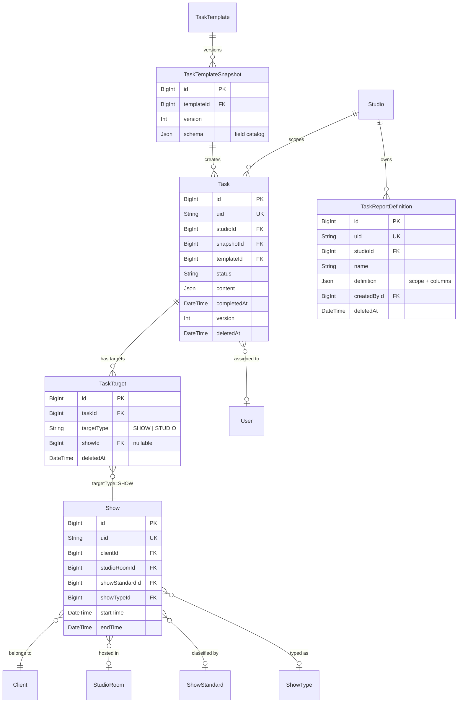
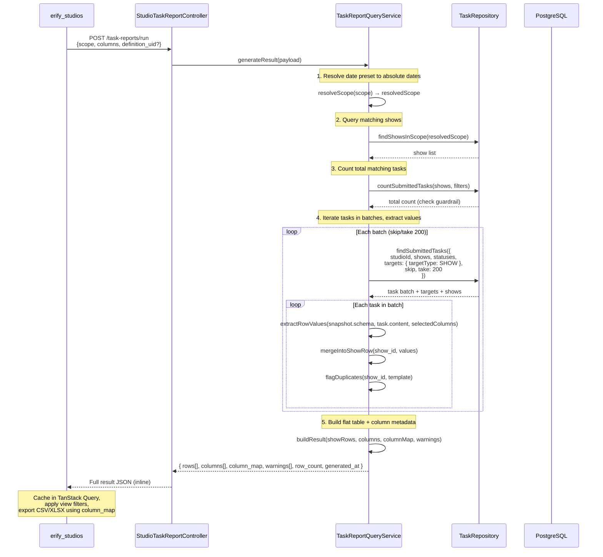
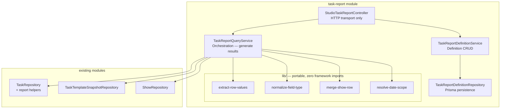

# Task Submission Reporting & Export — Backend Design

> **TLDR**: Add a studio-scoped reporting API with a show-first workflow: managers filter shows, discover available task columns contextually, then the BE joins submitted task data into a flat table JSON returned inline. No server-side result storage — the FE caches and applies view filters client-side.

## 1. Purpose

Support manager-facing review and export of submitted task data without introducing server-side report files or a warehouse dependency.

Primary examples:

- moderation managers summarizing GMV, views, and performance metrics across many shows,
- studio managers reviewing post-production upload URLs for premium-show QC,
- admins exporting submitted task evidence by client or date range.

This design must fit the current task architecture:

- `Task.content` stores submitted values,
- `TaskTemplateSnapshot.schema` is the historical source of truth,
- tasks link to shows through `TaskTarget` (polymorphic, `targetType = SHOW`), not a direct FK,
- studio-scoped routes already exist for review and task listing,
- no DB internal IDs may leak through API responses.

## 2. Goals

1. Show-first workflow — managers filter shows, then discover available columns contextually.
2. Persist reusable report definitions (personal presets) with optional date presets as JSON only.
3. Resolve selected fields against immutable task snapshots.
4. Generate flat table JSON inline — returned in the API response, not stored server-side.
5. Reuse existing task/show/client relations instead of introducing a parallel reporting store.
6. Keep the BE stateless for results — the FE owns caching and view-layer filtering.

## 3. Non-Goals

1. No server-side result storage (PostgreSQL JSONB, Redis). Generation is fast enough for inline response.
2. No server-side CSV/XLSX file generation.
3. No cloud-storage report artifacts.
4. No warehouse or BigQuery dependency.
5. No arbitrary formula engine in backend report definitions.
6. No cross-studio reporting or definition sharing across studios.

## 4. Key Design Decisions

### 4.1 Show-first workflow

The workflow order is: **filter shows → discover columns → select columns → run report**. This differs from the traditional "select sources first" approach.

Rationale:

- Managers think in terms of "which shows" first — the template is just how data got there.
- Contextual column discovery prevents dead-end selections (picking columns from templates with no tasks in scope).
- The source catalog endpoint accepts show filters and returns only templates/snapshots with submitted tasks on those shows.

### 4.2 Snapshot schema is canonical

Current template schema cannot be the reporting source of truth because tasks already persist against immutable snapshots. Report extraction must always resolve from `task.snapshot.schema` plus `task.content`.

Template-based source selection is allowed, but only as a convenience that resolves to one or more actual snapshot groups at query time.

### 4.3 Flat table result (inline, not stored)

The BE produces a **flat, show-centric table** returned directly in the API response:

- `rows[]` — one row per show, with all selected columns merged from submitted tasks. Each row is a flat JSON object keyed by column identifiers.
- `columns[]` — ordered column descriptors including system columns (show metadata) and task-content columns. Each column records its source template for export integrity.
- `column_map` — maps each column to its source `template_uid`, enabling the FE to split by template for export without the BE sending separate partition arrays.

This means:

- **Display**: FE receives a ready-to-render table — no client-side merge needed.
- **View filters**: FE applies client-side filters (client, status, sort) on the cached result — no server round-trip.
- **Export**: FE reads `column_map` to group columns by source template. Columns from the same template export to one sheet; columns from different templates split into separate sheets.
- **Transformation**: The flat rows are easily convertible to 2D arrays for tabular rendering and serialization.

### 4.3.1 Column key format and cross-version merging

Column keys depend on whether the field is a **standard field** or a **custom field**:

- **Standard fields** (`standard: true` in `snapshot.schema.items`): column key = **`field.key`** (e.g., `gmv`). No template prefix — standard fields merge across all templates.
- **Custom fields** (`standard` absent or `false`): column key = **`{template_uid}:{field.key}`** (e.g., `tpl_abc123:notes`). Template-scoped — same key in different templates produces separate columns.

This ensures:

- **Standard fields merge across templates.** A `gmv` standard field in 30 different moderation templates produces one `gmv` column. This is the primary mechanism for cross-client reporting.
- **Same template, different snapshot versions → same column.** Field keys (`key` in `snapshot.schema.items`) are stable across snapshot versions. A field `key: "gmv"` in v1 and `key: "gmv"` in v2 of the same template merge into one column.
- **Custom fields from different templates → different columns.** Two templates with custom `key: "notes"` produce `tpl_abc123:notes` and `tpl_xyz789:notes` — distinct columns.

Why this works:

- `TaskTemplateSnapshot.schema.items[].key` is the property name used in `Task.content`. It is user-defined (snake_case, regex-enforced), not auto-generated.
- When a template is updated, a new snapshot is created but existing field keys are stable. Only adding, removing, or reordering fields changes the schema. Old tasks keep their old snapshot — their `content` keys don't change.
- Adding a new field in a later version means tasks from older versions have `null` for that column — which is the correct behavior.

**Version mismatch handling:**

| Scenario | Example | Result |
|---|---|---|
| Standard field, same key across templates | tpl_A: `gmv` (standard), tpl_B: `gmv` (standard) | Merged into one column `gmv` |
| Standard field, different versions | v1: `gmv` (standard), v2: `gmv` (standard) | Merged into one column `gmv` |
| Custom field, same template, both versions | v1: `notes`, v2: `notes` | Merged into one column `tpl_abc:notes` |
| Custom field, added in later version | v1: no `conversion`, v2: `conversion` | One column, v1 tasks show `null` |
| Custom field, removed in later version | v1: `legacy_field`, v2: no `legacy_field` | One column, v2 tasks show `null` |
| Custom field, key renamed | v1: `gmv`, v2: `gross_value` | Two separate columns (different keys) |
| Custom field, same key in different templates | tpl_A: `notes` (custom), tpl_B: `notes` (custom) | Two separate columns (different template_uid prefix) |

**Edge case — field key rename**: If a template creator renames a field key (e.g., `gmv` → `gross_value`), this is a deliberate schema change. Old and new tasks will have different content keys. The report correctly treats them as separate columns. The FE should show both columns with their respective labels, and tasks from the other version will show `null`.

**Why no server-side result storage:**

| Factor | Assessment |
|---|---|
| **Generation speed** | < 1s typical (500 shows × 2.5 tasks × 20 columns) |
| **Result size** | 100–200KB typical, well within HTTP response limits |
| **Data volatility** | Submissions rarely change once completed |
| **Cross-device** | Re-run is cheap (< 1s), no need for DB-backed sync |
| **Complexity saved** | No result model, no result CRUD, no staleness tracking, no cleanup jobs |

If generation time becomes a concern at scale, server-side result storage can be added as an optimization. The API contract (`rows[]`, `columns[]`, `column_map`) is the same either way.

### 4.4 Two-level filtering

Filters are split into scope (server) and view (client):

**Scope filters** (change the generated dataset — trigger re-generation):

- `date_from`, `date_to` (or date preset)
- `show_standard_id` — premium vs standard
- `show_type_id` — show type segmentation
- `submitted_statuses` — default `[REVIEW, COMPLETED, CLOSED]`
- `source_templates[]` — optional template/snapshot narrowing

**View filters** (slice the cached dataset — FE-only, no server call):

- `client_id` / client name
- `show_status_id` — live, completed, cancelled
- `assignee` — task assignee
- `studio_room_id` — room filter
- `platform_name` — platform filter
- Text search
- Column sort (any column, asc/desc)

This mirrors the Google Sheets workflow: one sheet per time range (scope), filter views per client/status (view).

### 4.5 Export partition key

The partition key in `column_map` depends on whether the column is standard or custom:

- **Standard fields** → partition key `"_standard"` (shared partition). Standard fields from all templates are grouped together — they never cause export splits.
- **Custom fields** → partition key `template_uid`. Custom fields from different templates produce separate partitions.

Since field keys are stable across snapshot versions of the same template (see §4.3.1), columns from different versions of the same template merge naturally within their partition.

Export behavior:

- Standard fields + custom fields from one template → one CSV/sheet (standard fields are always included in every sheet)
- Custom fields from template A + custom fields from template B → separate CSV/sheets (each includes the standard field columns)

This eliminates the previous concern about consecutive snapshot versions producing separate partition groups. No `schema_signature` is needed.

### 4.6 Standard field catalog and backfill

#### 4.6.1 Schema change

`FieldItemBaseSchema` in `@eridu/api-types` gains an optional `standard` property:

```typescript
standard: z.boolean().optional()
  .describe('True if this field uses a key from the standard field catalog. Standard fields merge across templates in reports.')
```

When `standard: true`, the report engine uses `field.key` directly as the column key (no template prefix). The `key` must match one of the canonical standard field keys defined in the studio's standard field catalog.

#### 4.6.2 Standard field catalog

The standard field catalog is a set of pre-defined data collection field definitions with fixed keys. It is a **prerequisite for cross-template reporting** — not a separate feature.

**Catalog scope for MVP**: The catalog is a small, stable set of 8–10 fields defined collaboratively with the moderation team. For MVP, the catalog can be stored as a **seed configuration** (a JSON file or DB seed) rather than a full CRUD API. Template authors select standard fields from a picker in the template editor — the picker reads from the catalog and inserts the field with its canonical key and `standard: true`.

Examples of standard field keys:

- `gmv` — gross merchandise value
- `views` — show view count
- `conversion_rate` — conversion percentage
- `peak_viewers` — peak concurrent viewers
- `orders` — order count
- `likes` — like count
- `comments` — comment count
- `new_followers` — new follower count

**Template editor integration**: When building a template, the author sees two field sources:
1. **Standard fields** — pre-defined from the catalog. Selecting one inserts a field with the canonical key, type, and label. The author can customize the label and validation but **cannot change the key** (it's locked to the standard).
2. **Custom fields** — free-form fields the author defines with their own key.

This ensures standard field keys are consistent across all templates without requiring a full catalog management API. If the catalog needs to grow beyond ~20 fields, add a CRUD API in a future milestone.

**Reporting dependency**: The report engine only depends on the `standard: true` flag and the field `key`. It does not import or query the catalog — it reads the flag from `snapshot.schema.items[]`.

#### 4.6.3 Backfill migration

Existing ~30 moderation templates have data collection fields with non-standard keys that need alignment.

**Why this is non-trivial**: The report engine discovers columns by reading `snapshot.schema.items[].key` and extracts values from `task.content` using that key. Both must agree. Snapshots are immutable — existing ones cannot be modified. The content validator uses `.strict()` mode, so content keys must exactly match the snapshot schema.

**Migration strategy — application-level script** (not a raw SQL migration):

The backfill must go through application logic because:
- Snapshot creation uses `TaskTemplateService.updateTemplateWithSnapshot()` which handles version incrementing, schema validation, and the atomic template + snapshot update.
- `Task.content` is validated against `snapshot.schema` via `buildTaskContentSchema().strict()` — any key rename must keep content in sync with its referenced snapshot.
- The `standard: true` flag must be validated through `FieldItemBaseSchema`.

Steps:

1. **Define key mapping** — for each template, map existing field keys to standard keys (e.g., `gross_sales` → `gmv`, `view_count` → `views`). This is a manual review step with the moderation team.

2. **Create new snapshots via service** — for each affected template, call `updateTemplateWithSnapshot()` with the updated schema (renamed keys + `standard: true` flag). This creates an immutable new snapshot and increments the version. Old snapshots are preserved.

3. **Migrate Task.content + snapshotId** — for each task referencing an old snapshot of the affected template:
   - Read the task's current `content` and the old snapshot's key mapping.
   - Rename keys in `content` to match the new standard keys.
   - Update `task.snapshotId` to point to the new snapshot so that validation and reporting align.
   - Write both changes in a single update.

   This is done via a TypeScript migration script using Prisma, **not** a raw SQL migration, because:
   - The key mapping varies per template and per snapshot version.
   - Content transformation needs the old→new key map from the schema diff.
   - Updating `snapshotId` requires knowing the new snapshot's ID (created in step 2).

4. **Verify** — for each migrated task, confirm `task.content` keys match `task.snapshot.schema.items[].key`. Run `buildTaskContentSchema(snapshot.schema).safeParse(task.content)` on a sample to catch mismatches.

**Risk mitigation**:
- Run as a dry-run first (log changes without writing).
- Process in batches (e.g., 100 tasks per transaction) with progress logging.
- Back up `Task.content` values before overwriting (e.g., store original in `task.metadata.pre_standard_content`).

This migration is required before MVP reporting can produce cross-template moderation summaries.

### 4.7 Date presets in definitions

Definitions can optionally store a default date preset that pre-fills the date range on load:

```json
{
  "scope": {
    "date_preset": "this_week"
  }
}
```

Or explicit dates:

```json
{
  "scope": {
    "date_from": "2026-03-01",
    "date_to": "2026-03-07"
  }
}
```

Supported presets:

| Preset | Resolves to |
|--------|-------------|
| `this_week` | Monday 00:00 → Sunday 23:59 of current week |
| `this_month` | 1st of current month → last day of current month |
| `custom` | Explicit `date_from` / `date_to` |

The BE resolves date presets at run time before executing the query. Presets are a convenience — the `POST /run` endpoint always receives resolved absolute dates (either from preset resolution or direct input).

### 4.8 Submission timestamp — deferred

> **Deferred to ideation**: A typed `submittedAt` field on `Task` would improve sort ordering and filtering precision, but the backfill coverage for historical tasks is poor. For MVP, use `status` filtering (`REVIEW`, `COMPLETED`, `CLOSED`) combined with `updatedAt` for sort ordering. See [docs/ideation/submitted-at-state-machine.md](../../../../docs/ideation/submitted-at-state-machine.md) for the full analysis.

### 4.9 Show-targeted tasks only

Tasks connect to shows through the polymorphic `TaskTarget` model (`targetType = SHOW`), not a direct foreign key. The reporting query must:

1. join through `TaskTarget` to resolve the associated show,
2. filter to `targetType = SHOW` — exclude studio-targeted or other non-show task targets,
3. handle the (rare) case where a task has multiple show targets by emitting one row per show target, not one row per task.

Tasks with no show-type target are excluded from reporting results entirely.

### 4.10 Role-based source visibility

MVP: all permitted roles (`ADMIN`, `MANAGER`, `MODERATION_MANAGER`) see all templates with submitted tasks in the studio.

> **Intentional role boundary expansion**: The current `erify-authorization` skill defines `MODERATION_MANAGER` as scoped to "Dashboard, own tasks, own shifts only." Reporting endpoints intentionally broaden this to cross-show visibility. This is a deliberate product decision — moderation managers need to summarize GMV/views across many shows.

If role-scoped template visibility becomes necessary, add a `template_type` filter to the source catalog endpoint rather than creating separate endpoints per role.

**Implementation checklist for MODERATION_MANAGER expansion** — the following must all be updated together when reporting endpoints are implemented:

- [ ] `erify_api` — all reporting endpoints use `@StudioProtected([ADMIN, MANAGER, MODERATION_MANAGER])`
- [ ] `erify_studios/src/lib/constants/studio-route-access.ts` — add a `taskReports` key
- [ ] `erify_studios/docs/STUDIO_ROLE_USE_CASES_AND_VIEWS.md` — update MODERATION_MANAGER row
- [ ] `erify_studios` sidebar/nav — show the Task Reports link for `MODERATION_MANAGER`
- [ ] `.agent/skills/erify-authorization/SKILL.md` — update MODERATION_MANAGER scope description
- [ ] BE tests — cover `MODERATION_MANAGER` access on all reporting endpoints

### 4.11 Synchronous generation

MVP uses **synchronous generation** — the `POST /task-reports/run` endpoint generates and returns the complete result within the HTTP request lifecycle.

| Factor | Assessment |
|---|---|
| **Typical result size** | < 1,000 rows — completes in < 1s |
| **Row cap** | 10,000 — prevents unbounded generation |
| **User frequency** | Infrequent manager action (not high-concurrency) |
| **Implementation cost** | Zero — no queue/worker infrastructure needed |

#### Decision gates for async migration

Migrate to async generation (BullMQ + 202 Accepted + polling) when **any** of these are true:

1. **P95 generation time exceeds 5 seconds** in production.
2. **HTTP gateway timeout (30s) is hit** for large studios.
3. **Concurrent generation requests cause DB connection pool pressure**.
4. **Product requires removing the 10,000-row cap**.

See [docs/ideation/bullmq-async-processing.md](../../../../docs/ideation/bullmq-async-processing.md) for the full investigation scope.

## 5. Data Model Relationships



## 6. Proposed Schema Additions

### 6.1 `TaskReportDefinition` model

Add a dedicated soft-deletable studio-scoped model.

Suggested fields:

- `id BigInt`
- `uid String @unique`
- `studioId BigInt`
- `name String`
- `description String?`
- `definition Json`
- `createdById BigInt?`
- `updatedById BigInt?`
- `createdAt DateTime`
- `updatedAt DateTime`
- `deletedAt DateTime?`

`definition` JSON stores:

- `scope` — scope filters: optional date preset or explicit dates, `show_standard_id`, `show_type_id`, `submitted_statuses`, `source_templates[]`
- `columns[]` — selected column keys (system + task-content) with optional display ordering

Do **not** store generated rows or result data here.

## 7. Shared API Contract Additions (`@eridu/api-types/task-management`)

Add a new reporting schema module under the task-management domain. Expected DTOs:

- `taskReportSourceDto` — template/snapshot with field catalog
- `taskReportDefinitionDto` — saved definition shape
- `createTaskReportDefinitionSchema`
- `updateTaskReportDefinitionSchema`
- `taskReportRunRequestSchema` — scope + columns (inline or definition_uid)
- `taskReportResultDto` — inline flat table result
- `taskReportColumnDto` — column descriptor with source metadata

Key request concepts (run report):

- `scope`: scope filters with optional date preset, `show_standard_id`, `show_type_id`, `submitted_statuses`
- `columns[]`: selected column keys
- `source_templates[]`: optional template/snapshot filter
- `definition_uid` (optional — for audit/logging only, does not affect generation)

Key response concepts (inline result):

- `rows[]`: flat show-centric rows
- `columns[]`: ordered column descriptors with source metadata
- `column_map`: partition grouping for export
- `warnings[]`: version conflicts, duplicate flags
- `scope_summary`: human-readable scope description
- `row_count`: quick metadata
- `generated_at`: timestamp

## 8. Endpoint Plan

### 8.1 Contextual source catalog

`GET /studios/:studioId/task-report-sources`

Purpose:

- given scope filters, return templates/snapshots that have submitted tasks on those shows,
- return field catalogs derived from snapshot schemas,
- expose usage summary (`submitted_task_count`, etc.).

**Query params** (scope filters):

- `date_from`, `date_to` (at least one scope filter required)
- `show_standard_id` (optional)
- `show_type_id` (optional)
- `show_ids` (optional)
- `submitted_statuses` (optional, default `[REVIEW, COMPLETED, CLOSED]`)

Access:

- `ADMIN`, `MANAGER`, `MODERATION_MANAGER`

This endpoint takes scope filters as input, making the column catalog contextual to the manager's show selection. It joins through `TaskTarget` → `Show` to find which templates have submitted tasks for the filtered shows.

**Response shape:**

```text
sources[]:
  template_uid         — template identifier
  template_name        — display name
  task_type            — from schema.metadata.task_type
  submitted_task_count — number of submitted tasks for this template in scope
  fields[]:
    key                — field key (used in column selection)
    label              — user-facing label
    type               — field type (text, number, checkbox, etc.)
    standard           — true if this is a standard field
standard_fields[]:     — deduplicated list of standard fields across all sources
  key
  label
  type
  contributing_template_count — how many templates use this standard field
  total_task_count            — total submitted tasks across all contributing templates
```

Standard fields appear both in their source template's `fields[]` (for completeness) and in the top-level `standard_fields[]` (for the FE to render the merged "Standard Fields" group in the column picker).

### 8.2 Saved definition CRUD

- `GET /studios/:studioId/task-report-definitions`
- `GET /studios/:studioId/task-report-definitions/:definitionUid`
- `POST /studios/:studioId/task-report-definitions`
- `PATCH /studios/:studioId/task-report-definitions/:definitionUid`
- `DELETE /studios/:studioId/task-report-definitions/:definitionUid`

Access:

- `ADMIN`, `MANAGER`, `MODERATION_MANAGER`

Purpose:

- persist named JSON definitions (personal presets) with scope filters + columns,
- support repeated manager workflows and cross-device definition sync,
- clone is just POST with pre-filled body from an existing definition.

### 8.3 Report execution (generate + return inline)

`POST /studios/:studioId/task-reports/run`

Access:

- `ADMIN`, `MANAGER`, `MODERATION_MANAGER`

Body is always a **complete, self-contained payload** — the FE resolves the definition into concrete scope + columns before sending:

- **From definition**: FE loads the definition, pre-fills the form, lets the manager override any field. The run request sends whatever the form shows — not the raw definition.
- **Ad-hoc**: FE sends scope + columns directly without referencing a definition.

The BE does **not** merge definition + overrides. It receives a fully resolved payload every time. `definition_uid` is optional metadata for audit/logging only — it does not affect generation.

This endpoint:

1. resolves date presets to absolute dates (if applicable),
2. queries matching shows and their submitted tasks,
3. joins task content into a flat table,
4. returns the complete result inline.

**Request shape:**

```text
scope { date_preset?, date_from?, date_to?, show_standard_id?, show_type_id?, submitted_statuses? }
columns[]
source_templates[]?
definition_uid?  (optional — audit trail only, does not affect generation)
```

**Response shape:**

```text
rows[]
columns[]
column_map
warnings[]
scope_summary
row_count
generated_at
resolved_scope { date_from, date_to, ... }
```

The full result is returned in the response body. No `result_uid` — the result is not persisted server-side.

## 9. Query Strategy

### Report Generation Sequence



### 9.1 Scope resolution

1. Validate the report scope.
2. Resolve date presets to absolute dates (`this_week` → Monday–Sunday of current week).
3. Require at least one scope filter: `date_from`/`date_to`, `show_standard_id`, `show_type_id`, or `show_ids`.
4. Query matching shows within the resolved scope, filtering by `show_standard`, `show_type`, and other scope filters.
5. Find submitted tasks on those shows (join through `TaskTarget` → `Task` with `targetType = SHOW`).
6. Count total matching tasks (for guardrail enforcement).
7. Build a lean Prisma query over `Task` with:
   - `deletedAt: null`
   - studio scope
   - submitted statuses
   - `targets: { some: { targetType: 'SHOW', show: { ... scope filters } } }`
   - template/snapshot filters (from `source_templates` if provided)
8. Iterate all matching tasks in internal batches (`skip`/`take` with batch size 200). Each batch: extract selected column values, merge into the show row, flag duplicates.
9. After all batches: build flat table result with column metadata and return inline.

### 9.2 Lean select/include

Select only what the client needs:

- task UID, status, completed/updated timestamps,
- template UID/name,
- snapshot version/schema,
- `content`,
- show metadata via `targets` → `Show`: UID/name/external ID/start/end,
- client name (via show → client),
- studio room name (via show → studio room),
- show standard name (via show → show standard),
- show type name (via show → show type),
- assignee name,
- creator names if needed for system columns.

The `TaskTarget` join is the path to show data. Use a targeted include:

```
include: {
  targets: {
    where: { targetType: 'SHOW', deletedAt: null },
    select: {
      show: {
        select: { uid, name, externalId, startTime, endTime,
                  client: { select: { uid, name } },
                  studioRoom: { select: { uid, name } },
                  showStandard: { select: { uid, name } },
                  showType: { select: { uid, name } } }
      }
    }
  }
}
```

### 9.3 Row building (show-centric merge)

For each matched task:

1. read selected field definitions from `snapshot.schema.items`,
2. for each selected field, compute the column key:
   - **standard field** (`standard: true`): column key = `field.key` (e.g., `gmv`)
   - **custom field**: column key = `{template_uid}:{field.key}` (e.g., `tpl_abc:notes`)
3. pull matching values from `task.content` using `field.key`,
4. normalize by field type,
5. **merge into the show's row** using the column key — the show row accumulates values from all its submitted tasks.

**Standard fields** from different templates merge into the same column. If a show has moderation tasks from two different brand templates, both contributing `gmv` (standard), the values share the column key `gmv`. Since a show typically has one moderation task, this produces one value per show. If multiple tasks contribute to the same standard column on the same show, the duplicate-source handling (§9.4) applies.

**Custom fields** from different templates produce distinct column keys (`tpl_abc:notes` vs `tpl_xyz:notes`) and appear as separate columns.

If a show has submitted tasks from different **versions** of the same template, the field values merge into the same column because the column key is the same regardless of snapshot version. Fields that exist in one version but not another produce `null`.

Normalization rules:

- `number` -> numeric JSON value
- `checkbox` -> boolean
- `multiselect` -> array of strings in API response
- `file` / `url` -> raw URL string
- missing key -> `null`

### 9.4 Duplicate-source handling

MVP assumption: one active non-deleted task per show/template is the normal case.

If multiple non-deleted submitted tasks match the same show + source template:

- emit **separate rows** (one per duplicate task),
- set `_duplicate_source = true` on affected rows,
- include a warning in `warnings[]`.

This keeps export lossless and flags data hygiene issues explicitly.

### 9.5 Multi-target task handling

If a single task has multiple show-type targets (rare but structurally possible via `TaskTarget`), emit one row per show target. Each row carries the same task UID but different show metadata.

### 9.6 Internal batch processing

The report generation endpoint does **not** expose pagination to the client. The `TaskReportQueryService` iterates all matching tasks internally:

- Internal batch size: `200` rows per iteration (not configurable by client).
- Uses `skip`/`take` with the standard Prisma offset pattern.
- Each batch: extract values, merge into show rows, flag duplicates.
- After all batches: build flat table and return inline.

**Task-count guardrail**: If total matching tasks exceeds `10,000`, abort and return an error asking the manager to narrow scope filters. This is a **result-size cap, not a date-range restriction**. Large studios that routinely exceed this should configure a higher per-studio cap. Async generation removes the need for any hard cap.

**Required stable sort order**: The batch query MUST include an explicit `orderBy` clause:

1. `show.startTime DESC`
2. `show.uid DESC`
3. `task.uid DESC`

This determines the final result row order: most-recent shows first.

## 10. Service and Module Boundaries

### Module Architecture



Recommended module split:

- `StudioTaskReportController` for studio-scoped HTTP surface
- `TaskReportDefinitionService` for CRUD on saved definitions
- `TaskReportQueryService` as orchestration layer for result generation
- `TaskReportDefinitionRepository` for definition persistence
- extend `TaskRepository` with lean report-query helpers as needed

### 10.1 Extraction-ready file layout

```
src/models/task-report/
  ├── task-report.module.ts                 # NestJS wiring
  ├── task-report.controller.ts             # HTTP transport
  ├── task-report-definition.service.ts     # Definition CRUD (NestJS-coupled)
  ├── task-report-definition.repository.ts  # Definition persistence (Prisma-coupled)
  ├── task-report-query.service.ts          # Orchestration — generate results (NestJS-coupled)
  ├── schemas/                              # Zod + payload types
  └── lib/                                  # PORTABLE: pure functions only
      ├── extract-row-values.ts             # snapshot schema + content → flat values
      ├── normalize-field-type.ts           # field type normalization rules
      ├── merge-show-row.ts                 # merge task values into show row
      └── resolve-date-scope.ts             # date preset → absolute dates
```

`lib/` files must not import NestJS, Prisma, or any app-specific module.

> **Numeric summaries are deferred from BE scope.** See [docs/ideation/task-analytics-summaries.md](../../../../docs/ideation/task-analytics-summaries.md).

## 11. Validation and Guardrails

1. Roles: `ADMIN`, `MANAGER`, `MODERATION_MANAGER`
2. Maximum selected columns per report: recommended `<= 50`
3. Maximum total matched tasks: `10,000` (result-size cap). Configurable per studio.
4. Internal batch size: `200` rows per iteration during result generation
5. Require at least one scope filter (`date_from`/`date_to`, `show_standard_id`, `show_type_id`, or `show_ids`).
6. Reject unknown column keys at validation time
7. Validate date presets against supported values
8. Response size: typical 100–200KB, max ~5MB for very large results. Standard gzip compression applies.

## 12. Risks and Mitigations

### 12.1 Template evolution and definition stability

Definitions reference **column keys** (e.g., `gmv`, `tpl_abc:notes`), not snapshot versions. Tasks are fixed to their assigned snapshot via `task.snapshotId` — template updates create new snapshots but don't change existing tasks.

This means definitions are inherently stable:
- Existing tasks' content keys don't change when the template is updated.
- A column key that matched data before will continue matching after a template update.
- New fields added in later snapshot versions simply produce `null` for older tasks — correct behavior.

The only scenario where a definition's column becomes empty is if **no tasks** in the scope were created from a snapshot containing that field. This is a scope issue (not a definition issue) and is visible from the result metadata.

### 12.2 File URL longevity

Risk: if upload URLs ever become signed/expiring, exported values may go stale.

Mitigation: keep URL export as current-state behavior; if signed URLs are introduced later, add on-demand re-sign endpoints.

### 12.3 TaskTarget join complexity

Risk: Tasks connect to shows through the polymorphic `TaskTarget` model, adding a join hop to every report query.

Mitigation:
- ensure `TaskTarget` has a composite index on `[taskId, targetType]`,
- the lean select/include pattern keeps the join narrow,
- if query performance degrades, consider a denormalized `showId` on `Task` for reporting-hot-path queries.

### 12.4 Large JSON response

Risk: selected task content can become large over long date ranges.

Mitigation: bounded scope, lean select, result row cap (10,000), selected-field extraction, gzip compression on response.

### 12.5 Offset-based batching under concurrent writes

Risk: row shifts during batch iteration.

Mitigation: reporting scope is limited to `REVIEW`/`COMPLETED`/`CLOSED` tasks (rarely change mid-generation). Switch to keyset pagination if needed.

### 12.6 Contextual source catalog performance

Risk: the source catalog endpoint joins shows → tasks → snapshots, which is heavier than a static catalog.

Mitigation: the manager has already narrowed the show set via scope filters, bounding the join. Add a composite index on `[studioId, status]` for task filtering. Cache source catalog responses with a short TTL if needed.

### 12.7 Repeated generation for same scope

Risk: without server-side caching, the same report scope generates redundantly across devices or after page refresh.

Mitigation: generation is fast (< 1s typical). The FE caches recently generated results in TanStack Query. IndexedDB can be added for cross-session persistence. If generation cost becomes a concern, add server-side result storage as an optimization — the API contract is the same either way.

## 13. Rollout Recommendation

### Milestone BE-1 (Core workflow)

1. contextual source catalog endpoint (templates/snapshots with submitted tasks for filtered shows)
2. report generation endpoint (`POST /task-reports/run`) with date preset resolution, comprehensive scope filters, `TaskTarget` join, internal batch processing, flat table generation, and inline response
3. saved definition CRUD with date presets and scope filter persistence
4. inline ad-hoc support (run without a saved definition)

### Milestone BE-2 (Polish)

1. role-aware source catalog filtering by `task_type` if product requires it
2. per-studio configurable row cap

### Milestone BE-3 (Scale, if needed)

1. async result generation (202 + polling) for large datasets
2. optional server-side result caching for expensive reports
3. server-side CSV/XLSX export endpoint
4. response compression for large payloads

## 14. Verification Plan

When implemented, verify at minimum:

- `pnpm --filter erify_api lint`
- `pnpm --filter erify_api typecheck`
- `pnpm --filter erify_api test`

Targeted tests:

1. contextual source catalog returns only templates with tasks on filtered shows
2. source catalog returns empty when no submitted tasks match the scope filters
3. source catalog filters by show standard, show type correctly
4. date presets resolve correctly (`this_week`, `this_month`)
5. result generation produces flat rows with correct column values
6. show rows merge values from multiple task templates correctly
7. template-based columns return `null` for missing keys on older snapshots
8. submitted-status filtering excludes in-progress work by default
9. saved definition CRUD respects studio scoping and soft delete
10. only show-targeted tasks are included; studio-targeted tasks are excluded
11. tasks with multiple show targets emit one row per show
12. `_duplicate_source` flag is set when multiple tasks match same show + template
13. inline response includes correct `row_count` and column metadata
14. result row cap (10,000) rejects over-scoped queries with descriptive error
15. definition with scope overrides generates correctly (e.g., stored `this_week` + override `date_from`/`date_to`)
