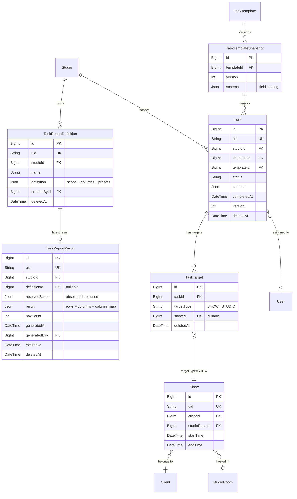
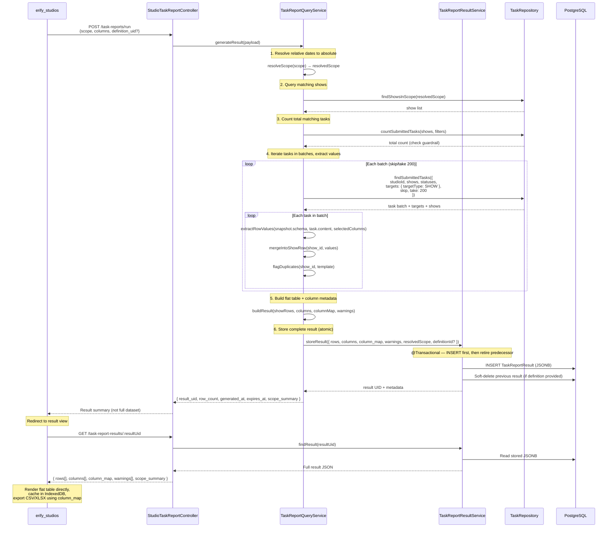
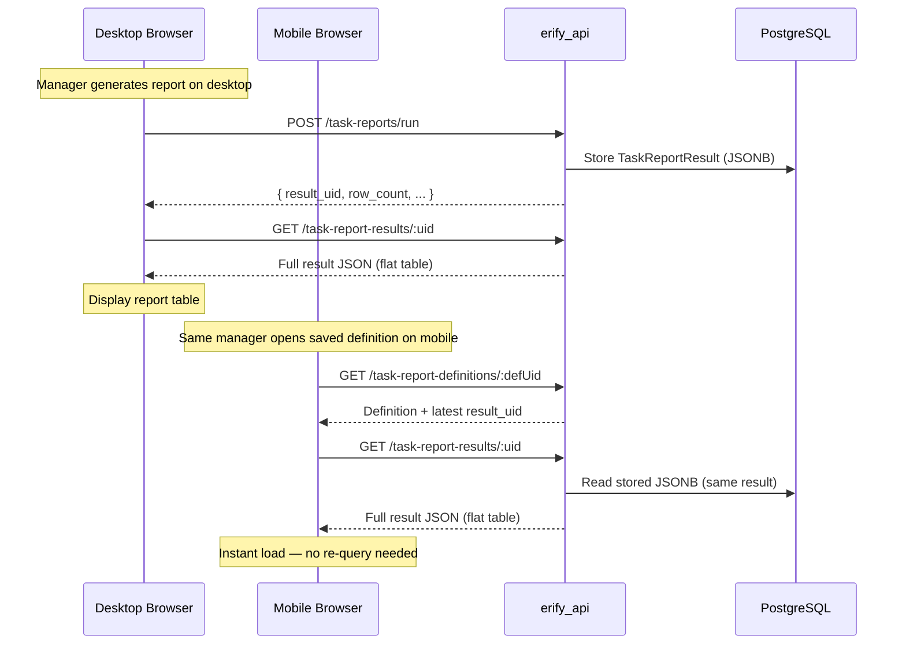
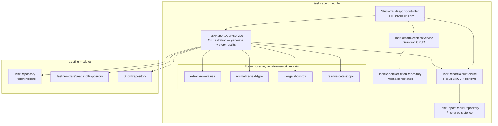

# Task Submission Reporting & Export — Backend Design

> **TLDR**: Add a studio-scoped reporting API with a show-first workflow: managers filter shows, discover available task columns contextually, then the BE joins submitted task data into a flat materialized table stored as JSONB for cross-device access and client-side CSV/XLSX export.

## 1. Purpose

Support manager-facing review and export of submitted task data without introducing server-side report files or a warehouse dependency.

Primary examples:

- moderation managers summarizing GMV, views, and performance metrics across many shows,
- studio managers reviewing post-production upload URLs for premium-show QC,
- admins exporting submitted task evidence by client or date range.

This design must fit the current task architecture:

- `Task.content` stores submitted values,
- `TaskTemplateSnapshot.schema` is the historical source of truth,
- tasks link to shows through `TaskTarget` (polymorphic, `targetType = SHOW`), not a direct FK,
- studio-scoped routes already exist for review and task listing,
- no DB internal IDs may leak through API responses.

## 2. Goals

1. Show-first workflow — managers filter shows, then discover available columns contextually.
2. Persist reusable report definitions with relative date presets as JSON only.
3. Resolve selected fields against immutable task snapshots.
4. Generate and persist complete results as flat materialized table JSON (JSONB) for cross-device access and export.
5. Reuse existing task/show/client relations instead of introducing a parallel reporting store.
6. Balance FE/BE workload — backend owns query execution, joining, and result materialization; frontend owns display rendering, caching, export serialization.

## 3. Non-Goals

1. No server-side CSV/XLSX file generation (MVP — JSON is the interchange format; FE serializes to CSV/XLSX).
2. No cloud-storage report artifacts.
3. No warehouse or BigQuery dependency for the first version.
4. No arbitrary formula engine in backend report definitions.
5. No external cache layer (Redis) for the first version — PostgreSQL JSONB is sufficient.
6. No cross-studio reporting or definition sharing across studios.

## 4. Key Design Decisions

### 4.1 Show-first workflow

The workflow order is: **filter shows → discover columns → select columns → run report**. This differs from the traditional "select sources first" approach.

Rationale:

- Managers think in terms of "which shows" first — the template is just how data got there.
- Contextual column discovery prevents dead-end selections (picking columns from templates with no tasks in scope).
- The source catalog endpoint accepts show filters and returns only templates/snapshots with submitted tasks on those shows.

### 4.2 Snapshot schema is canonical

Current template schema cannot be the reporting source of truth because tasks already persist against immutable snapshots. Report extraction must always resolve from `task.snapshot.schema` plus `task.content`.

Template-based source selection is allowed, but only as a convenience that resolves to one or more actual snapshot groups at query time.

### 4.3 Flat materialized table result

The BE produces a **flat, show-centric table** as the primary result shape:

- `rows[]` — one row per show, with all selected columns merged from submitted tasks. Each row is a flat JSON object keyed by column identifiers.
- `columns[]` — ordered column descriptors including system columns (show metadata) and task-content columns. Each column records its source template/snapshot for export integrity.
- `column_map` — maps each column to its source `template_uid` + `snapshot_version`, enabling the FE to split by partition for export without the BE sending separate partition arrays.

This means:

- **Display**: FE receives a ready-to-render table — no client-side merge needed.
- **Export**: FE reads `column_map` to group columns by source partition. Compatible columns export to one sheet; incompatible columns split into separate sheets.
- **Transformation**: The flat rows are easily convertible to 2D arrays for tabular rendering and serialization.

When schemas are incompatible (columns from different template versions that can't be merged), the result includes `warnings[]` flagging which columns have version conflicts.

### 4.4 Safe partition key (for export grouping)

Do not group columns by `task.type + snapshot.version` alone. Snapshot versions are local to each template and can collide across unrelated schemas.

Safe partition key (used in `column_map`):

- `template_uid`
- `snapshot_version`
- optional future `schema_signature`

The partition key is metadata on columns — not a separate data structure. The FE uses it only at export time to split sheets.

**Known UX friction (MVP)**: When a manager selects "all versions" of a template, consecutive snapshot versions with identical schemas will produce separate partition groups in `column_map` even though their columns are the same. Adding a `schema_signature` to collapse structurally identical snapshots is the recommended follow-up for milestone 2.

### 4.5 Server-side result storage (JSONB)

The backend stores complete report results as JSONB in a dedicated `TaskReportResult` model. This is **not** a file artifact — it is structured JSON that serves as:

1. **the canonical report output** — the authoritative result of a report execution,
2. **a cross-device sync mechanism** — any device loading the same saved definition retrieves the stored result instantly,
3. **the export source** — CSV/XLSX serialization reads from this JSON, not from re-queried live data.

The backend does **not** persist generated CSV/XLSX files or cloud-storage artifacts.

#### 4.5.1 Result storage comparison matrix

The following matrix evaluates four approaches to report result persistence. The chosen approach is **Option B: PostgreSQL JSONB**.

| Criteria | A: FE-only (IndexedDB) | B: PostgreSQL JSONB | C: Redis cache | D: Redis + PostgreSQL |
|---|---|---|---|---|
| **Cross-device access** | No — browser-local only | Yes — any authenticated device | Yes — while cached | Yes |
| **Team sharing** | No | Yes — same studio role access | Yes — while cached | Yes |
| **Survives restart** | Yes (IndexedDB persists) | Yes | No — evicted on restart | Partially |
| **Storage cost** | Free (client disk) | DB disk — ~100KB-5MB per result | Memory — expensive for large blobs | Memory + disk |
| **Staleness handling** | Client-side 24h rule | `expires_at` column, server-managed | TTL-based auto-expiration | TTL + DB fallback |
| **Infrastructure** | None | Already exists (PostgreSQL) | New dependency (not in codebase) | Two new dependencies |
| **Implementation effort** | Minimal | Low — one new model + service | Medium — Redis setup + cache logic | High |

**Decision: Option B (PostgreSQL JSONB)**

Rationale:

- No new infrastructure. PostgreSQL is already the primary datastore.
- Cross-device sync is achieved naturally through the DB.
- Result access pattern is simple: single-row read by UID — JSONB is efficient for this.
- Result sizes (100KB–5MB) are well within PostgreSQL JSONB limits.
- IndexedDB remains available as an optional FE optimization for offline/low-latency display.

### 4.6 Relative date presets in definitions

Definitions store the filter *intent*, not resolved dates:

```json
{
  "scope": {
    "date_mode": "relative",
    "date_preset": "this_week"
  }
}
```

Or for absolute dates:

```json
{
  "scope": {
    "date_mode": "absolute",
    "date_from": "2026-03-01",
    "date_to": "2026-03-07"
  }
}
```

Supported presets for MVP:

| Preset | Resolves to |
|--------|-------------|
| `this_week` | Monday 00:00 → Sunday 23:59 of current week |
| `last_7_days` | Now minus 7 days → now |
| `this_month` | 1st of current month → last day of current month |
| `custom` | Explicit `date_from` / `date_to` (absolute) |

The BE resolves relative dates at run time before executing the query. The stored `TaskReportResult.scope` records the **resolved absolute dates** so the manager knows exactly what was queried.

### 4.7 Submission timestamp — deferred

> **Deferred to ideation**: A typed `submittedAt` field on `Task` would improve sort ordering and filtering precision, but the backfill coverage for historical tasks is poor. For MVP, use `status` filtering (`REVIEW`, `COMPLETED`, `CLOSED`) combined with `updatedAt` for sort ordering. See [docs/ideation/submitted-at-state-machine.md](../../../../docs/ideation/submitted-at-state-machine.md) for the full analysis.

### 4.8 Show-targeted tasks only

Tasks connect to shows through the polymorphic `TaskTarget` model (`targetType = SHOW`), not a direct foreign key. The reporting query must:

1. join through `TaskTarget` to resolve the associated show,
2. filter to `targetType = SHOW` — exclude studio-targeted or other non-show task targets,
3. handle the (rare) case where a task has multiple show targets by emitting one row per show target, not one row per task.

Tasks with no show-type target are excluded from reporting results entirely.

### 4.9 Role-based source visibility

MVP: all permitted roles (`ADMIN`, `MANAGER`, `MODERATION_MANAGER`) see all templates with submitted tasks in the studio.

> **Intentional role boundary expansion**: The current `erify-authorization` skill defines `MODERATION_MANAGER` as scoped to "Dashboard, own tasks, own shifts only." Reporting endpoints intentionally broaden this to cross-show visibility. This is a deliberate product decision — moderation managers need to summarize GMV/views across many shows.

If role-scoped template visibility becomes necessary, add a `template_type` filter to the source catalog endpoint rather than creating separate endpoints per role.

**Implementation checklist for MODERATION_MANAGER expansion** — the following must all be updated together when reporting endpoints are implemented:

- [ ] `erify_api` — all reporting endpoints use `@StudioProtected([ADMIN, MANAGER, MODERATION_MANAGER])`
- [ ] `erify_studios/src/lib/constants/studio-route-access.ts` — add a `taskReports` key
- [ ] `erify_studios/docs/STUDIO_ROLE_USE_CASES_AND_VIEWS.md` — update MODERATION_MANAGER row
- [ ] `erify_studios` sidebar/nav — show the Task Reports link for `MODERATION_MANAGER`
- [ ] `.agent/skills/erify-authorization/SKILL.md` — update MODERATION_MANAGER scope description
- [ ] BE tests — cover `MODERATION_MANAGER` access on all reporting endpoints

### 4.10 Synchronous vs asynchronous generation

MVP uses **synchronous generation** — the `POST /task-reports/run` endpoint generates the complete result within the HTTP request lifecycle.

#### Why synchronous is sufficient for MVP

| Factor | Assessment |
|---|---|
| **Typical result size** | < 2,000 rows — completes in < 3s |
| **Row cap** | 10,000 — prevents unbounded generation |
| **User frequency** | Infrequent manager action (not high-concurrency) |
| **Implementation cost** | Zero — no queue/worker infrastructure needed |

#### Decision gates for async migration

Migrate to async generation (BullMQ worker or Node.js worker thread + 202 Accepted + polling) when **any** of these are true:

1. **P95 generation time exceeds 5 seconds** in production.
2. **HTTP gateway timeout (30s) is hit** for large studios.
3. **Concurrent generation requests cause DB connection pool pressure**.
4. **Product requires removing the 10,000-row cap**.

See [docs/ideation/bullmq-async-processing.md](../../../../docs/ideation/bullmq-async-processing.md) for the full investigation scope.

#### Mobile / low-bandwidth note

On slow connections, the bottleneck is **result retrieval** (downloading 100KB–5MB JSON), not generation time. Mitigations:
- gzip compression on the API response (standard middleware — already available)
- optional response streaming (`Transfer-Encoding: chunked`) as a future optimization
- IndexedDB caching (FE milestone 2) eliminates repeated downloads for the same result

## 5. Data Model Relationships



## 6. Proposed Schema Additions

### 6.1 `TaskReportDefinition` model

Add a dedicated soft-deletable studio-scoped model.

Suggested fields:

- `id BigInt`
- `uid String @unique`
- `studioId BigInt`
- `name String`
- `description String?`
- `definition Json`
- `createdById BigInt?`
- `updatedById BigInt?`
- `createdAt DateTime`
- `updatedAt DateTime`
- `deletedAt DateTime?`

`definition` JSON stores:

- `scope` — show filters with date mode (`relative` / `absolute`), date preset or explicit dates, `client_id`, `show_ids`, `submitted_statuses`, etc.
- `columns[]` — selected column keys (system + task-content) with optional display ordering
- `source_templates[]` — optional template/snapshot filters for column discovery refinement
- `export_preferences` — optional preferred export format

Do **not** store generated rows or file URLs here.

### 6.2 `TaskReportResult` model

Add a dedicated model for storing complete report execution results.

Suggested fields:

- `id BigInt`
- `uid String @unique`
- `studioId BigInt`
- `definitionId BigInt?` (FK → `TaskReportDefinition`, nullable for ad-hoc runs)
- `resolvedScope Json` (the exact absolute filters used for this execution — resolved from definition)
- `result Json` (the full materialized table: `rows[]`, `columns[]`, `column_map`, `warnings[]`)
- `rowCount Int` (quick metadata without parsing JSONB)
- `generatedAt DateTime`
- `generatedById BigInt?` (FK → `User`)
- `expiresAt DateTime` (soft staleness marker, default = `generatedAt + 24h`)
- `version Int` (optimistic locking)
- `createdAt DateTime`
- `updatedAt DateTime`
- `deletedAt DateTime?`

`result` JSON stores:

- `rows[]` — flat show-centric rows, each a JSON object keyed by column identifiers (system + task-content fields)
- `columns[]` — ordered column descriptors: `{ key, label, type, source_template_uid, source_snapshot_version }`
- `column_map` — maps column keys to partition groups (template_uid + snapshot_version) for export splitting
- `warnings[]` — version conflict warnings, duplicate-source flags, missing-data notes
- `scope_summary` — human-readable description of the resolved filters

Indexes:

- `[studioId, definitionId]` — find result for a saved definition
- `[studioId, generatedAt]` — list recent results
- `[expiresAt]` — cleanup stale results

**Why separate from `TaskReportDefinition`:**

1. **Size asymmetry**: Definitions are small (~1-5KB config). Results can be large (100KB-5MB).
2. **Decoupled lifecycle**: Re-running a definition creates a new result without touching the definition.
3. **Ad-hoc support**: Results can exist without a saved definition (inline/one-off queries).
4. **Query performance**: List queries on definitions stay fast.

**Result lifecycle:**

1. A "Run Report" action generates a new `TaskReportResult` and soft-deletes the previous one for the same definition.
2. Only the latest result per definition is kept active.
3. Stale results (past `expiresAt`) show a warning but remain accessible until explicitly refreshed.
4. A periodic cleanup job can hard-delete soft-deleted results older than a retention period (e.g. 30 days).

## 7. Shared API Contract Additions (`@eridu/api-types/task-management`)

Add a new reporting schema module under the task-management domain. Expected DTOs:

- `taskReportSourceDto` — template/snapshot with field catalog
- `taskReportDefinitionDto` — saved definition shape
- `createTaskReportDefinitionSchema`
- `updateTaskReportDefinitionSchema`
- `taskReportRunRequestSchema` — scope + columns (inline or definition_uid)
- `taskReportResultDto` — materialized table result
- `taskReportColumnDto` — column descriptor with source metadata
- `taskReportRowDto` — flat show-centric row

Key request concepts (run report):

- `scope`: show filters with date mode (`relative` / `absolute`), `client_id`, `show_ids`, `submitted_statuses`
- `columns[]`: selected column keys
- `source_templates[]`: optional template/snapshot filter
- `definition_uid` (optional — link result to a saved definition)

Key response concepts (result):

- `uid`: result identifier for subsequent retrieval
- `rows[]`: flat show-centric rows
- `columns[]`: ordered column descriptors with source metadata
- `column_map`: partition grouping for export
- `warnings[]`: version conflicts, duplicate flags
- `scope_summary`: human-readable scope description
- `row_count`: quick metadata
- `generated_at`, `expires_at`: freshness metadata

## 8. Endpoint Plan

### 8.1 Contextual source catalog

`GET /studios/:studioId/task-report-sources`

Purpose:

- given show filters, return templates/snapshots that have submitted tasks on those shows,
- return field catalogs derived from snapshot schemas,
- expose usage summary (`submitted_task_count`, etc.).

**Query params** (show filters):

- `date_from`, `date_to` (required — at least one scope filter)
- `client_id` (optional)
- `show_ids` (optional)
- `submitted_statuses` (optional, default `[REVIEW, COMPLETED, CLOSED]`)

Access:

- `ADMIN`, `MANAGER`, `MODERATION_MANAGER`

**Key change from previous design**: This endpoint now takes show filters as input, making the column catalog contextual to the manager's show selection. It joins through `TaskTarget` → `Show` to find which templates have submitted tasks for the filtered shows.

### 8.2 Saved definition CRUD

- `GET /studios/:studioId/task-report-definitions`
- `GET /studios/:studioId/task-report-definitions/:definitionUid`
- `POST /studios/:studioId/task-report-definitions`
- `PATCH /studios/:studioId/task-report-definitions/:definitionUid`
- `DELETE /studios/:studioId/task-report-definitions/:definitionUid`

Access:

- `ADMIN`, `MANAGER`, `MODERATION_MANAGER`

Purpose:

- persist named JSON definitions with scope (including date presets) + columns,
- support repeated manager workflows and cross-device access,
- clone is just POST with pre-filled body from an existing definition.

### 8.3 Report execution (generate result)

`POST /studios/:studioId/task-reports/run`

Access:

- `ADMIN`, `MANAGER`, `MODERATION_MANAGER`

Body accepts either:

- inline definition payload (ad-hoc), or
- `definition_uid` plus optional scope overrides.

This endpoint:

1. resolves relative date presets to absolute dates,
2. queries matching shows and their submitted tasks,
3. joins task content into a flat materialized table,
4. stores the result as `TaskReportResult`.

The response returns the result UID plus summary metadata — not the full dataset.

**Request shape:**

```text
scope { date_mode, date_preset?, date_from?, date_to?, client_id?, show_ids?, submitted_statuses? }
columns[]
source_templates[]?
definition_uid?  (optional — links result to saved definition)
```

**Response shape:**

```text
result_uid
row_count
generated_at
expires_at
scope_summary
resolved_scope { date_from, date_to, ... }
```

If a `definition_uid` is provided and a previous active result exists for that definition, the replacement must be **atomic**: INSERT the new result first, then soft-delete the predecessor — both in a single `@Transactional()` block.

### 8.4 Retrieve result

`GET /studios/:studioId/task-report-results/:resultUid`

Access:

- `ADMIN`, `MANAGER`, `MODERATION_MANAGER`

Returns the full stored result JSON (flat materialized table) for client-side display and export.

**Response shape:**

```text
uid
rows[]
columns[]
column_map
warnings[]
scope_summary
row_count
generated_at
expires_at
```

This is the endpoint the FE calls on any device to load a report result. It reads from stored JSONB — no live query re-execution.

### 8.5 List results

`GET /studios/:studioId/task-report-results`

Access:

- `ADMIN`, `MANAGER`, `MODERATION_MANAGER`

Returns a paginated list of active results for the studio, with summary metadata only (no full result payloads).

Query params: `definition_uid?` (filter by definition), standard `page` + `limit`.

## 9. Query Strategy

### Report Generation Sequence



### Cross-Device Access Sequence



### 9.1 Scope resolution

1. Validate the report scope.
2. Resolve relative date presets to absolute dates (`this_week` → Monday–Sunday of current week).
3. Require at least one scope filter: `show_ids`, `date_from`, `date_to`, or `client_id`.
4. Query matching shows within the resolved scope.
5. Find submitted tasks on those shows (join through `TaskTarget` → `Task` with `targetType = SHOW`).
6. Count total matching tasks (for guardrail enforcement).
7. Build a lean Prisma query over `Task` with:
   - `deletedAt: null`
   - studio scope
   - submitted statuses
   - `targets: { some: { targetType: 'SHOW', show: { ... scope filters } } }`
   - template/snapshot filters (from `source_templates` if provided)
8. Iterate all matching tasks in internal batches (`skip`/`take` with batch size 200). Each batch: extract selected column values, merge into the show row, flag duplicates.
9. After all batches: build flat table result with column metadata and store as `TaskReportResult`.

### 9.2 Lean select/include

Select only what the client needs:

- task UID, status, completed/updated timestamps,
- template UID/name,
- snapshot version/schema,
- `content`,
- show metadata via `targets` → `Show`: UID/name/external ID/start/end,
- client name (via show → client),
- studio room name (via show → studio room),
- assignee name,
- creator names if needed for system columns.

The `TaskTarget` join is the path to show data. Use a targeted include:

```
include: {
  targets: {
    where: { targetType: 'SHOW', deletedAt: null },
    select: {
      show: {
        select: { uid, name, externalId, startTime, endTime,
                  client: { select: { name } },
                  studioRoom: { select: { name } } }
      }
    }
  }
}
```

### 9.3 Row building (show-centric merge)

For each matched task:

1. read selected field definitions from `snapshot.schema.items`,
2. pull matching values from `task.content`,
3. normalize by field type,
4. **merge into the show's row** — the show row accumulates values from all its submitted tasks.

If a show has submitted tasks from multiple templates, each template's columns appear in the same row under distinct column keys.

Normalization rules:

- `number` -> numeric JSON value
- `checkbox` -> boolean
- `multiselect` -> array of strings in API response
- `file` / `url` -> raw URL string
- missing key -> `null`

### 9.4 Duplicate-source handling

MVP assumption: one active non-deleted task per show/template is the normal case.

If multiple non-deleted submitted tasks match the same show + source template:

- emit **separate rows** (one per duplicate task),
- set `_duplicate_source = true` on affected rows,
- include a warning in `warnings[]`.

This keeps export lossless and flags data hygiene issues explicitly.

### 9.5 Multi-target task handling

If a single task has multiple show-type targets (rare but structurally possible via `TaskTarget`), emit one row per show target. Each row carries the same task UID but different show metadata.

### 9.6 Internal batch processing

The report generation endpoint does **not** expose pagination to the client. The `TaskReportQueryService` iterates all matching tasks internally:

- Internal batch size: `200` rows per iteration (not configurable by client).
- Uses `skip`/`take` with the standard Prisma offset pattern.
- Each batch: extract values, merge into show rows, flag duplicates.
- After all batches: build flat table, store complete result.

**Task-count guardrail**: If total matching tasks exceeds `10,000`, abort and return an error asking the manager to narrow scope filters. This is a **result-size cap, not a date-range restriction**. Large studios that routinely exceed this should configure a higher per-studio cap. Async generation removes the need for any hard cap.

**Required stable sort order**: The batch query MUST include an explicit `orderBy` clause:

1. `show.startTime DESC`
2. `show.uid DESC`
3. `task.uid DESC`

This determines the final result row order: most-recent shows first.

### 9.7 Result retrieval

The `GET /task-report-results/:resultUid` endpoint returns the stored JSONB. For MVP, return the complete result — typical result sizes (100KB-2MB) are within acceptable response limits.

Standard offset-based pagination (`page` + `limit`) is used for the result **list** endpoint only.

## 10. Service and Module Boundaries

### Module Architecture



Recommended module split:

- `StudioTaskReportController` for studio-scoped HTTP surface
- `TaskReportDefinitionService` for CRUD on saved definitions
- `TaskReportResultService` for result storage, retrieval, and lifecycle (model-style service)
- `TaskReportQueryService` as orchestration layer for result generation
- `TaskReportDefinitionRepository` for definition persistence
- `TaskReportResultRepository` for result persistence
- extend `TaskRepository` with lean report-query helpers as needed

### 10.1 Extraction-ready file layout

```
src/models/task-report/
  ├── task-report.module.ts                 # NestJS wiring
  ├── task-report.controller.ts             # HTTP transport
  ├── task-report-definition.service.ts     # Definition CRUD (NestJS-coupled)
  ├── task-report-definition.repository.ts  # Definition persistence (Prisma-coupled)
  ├── task-report-result.service.ts         # Result CRUD (NestJS-coupled)
  ├── task-report-result.repository.ts      # Result persistence (Prisma-coupled)
  ├── task-report-query.service.ts          # Orchestration — generate results (NestJS-coupled)
  ├── schemas/                              # Zod + payload types
  └── lib/                                  # PORTABLE: pure functions only
      ├── extract-row-values.ts             # snapshot schema + content → flat values
      ├── normalize-field-type.ts           # field type normalization rules
      ├── merge-show-row.ts                 # merge task values into show row
      └── resolve-date-scope.ts             # relative date preset → absolute dates
```

`lib/` files must not import NestJS, Prisma, or any app-specific module.

> **Numeric summaries are deferred from BE scope.** See [docs/ideation/task-analytics-summaries.md](../../../../docs/ideation/task-analytics-summaries.md).

## 11. Validation and Guardrails

1. Roles: `ADMIN`, `MANAGER`, `MODERATION_MANAGER`
2. Maximum selected columns per report: recommended `<= 50`
3. Maximum total matched tasks: `10,000` (result-size cap). Configurable per studio.
4. Internal batch size: `200` rows per iteration during result generation
5. Require at least one scope filter (`show_ids`, `date_from`, `date_to`, or `client_id`).
6. Reject unknown column keys at validation time
7. Validate relative date presets against supported values
8. Result expiry: default `24 hours` after `generatedAt`. Stale results remain accessible but show a warning.
9. Result retention: soft-deleted results are hard-deleted after `30 days`.

## 12. Risks and Mitigations

### 12.1 Template evolution drift

Risk: template-based saved definitions may reference column keys that disappear in later versions.

Mitigation: return `null` for missing fields and surface compatibility warnings in `warnings[]`.

### 12.2 File URL longevity

Risk: if upload URLs ever become signed/expiring, exported values may go stale.

Mitigation: keep URL export as current-state behavior; if signed URLs are introduced later, add on-demand re-sign endpoints.

### 12.3 TaskTarget join complexity

Risk: Tasks connect to shows through the polymorphic `TaskTarget` model, adding a join hop to every report query.

Mitigation:
- ensure `TaskTarget` has a composite index on `[taskId, targetType]`,
- the lean select/include pattern keeps the join narrow,
- if query performance degrades, consider a denormalized `showId` on `Task` for reporting-hot-path queries.

### 12.4 Large JSON payloads

Risk: selected task content can become large over long date ranges.

Mitigation: bounded scope, lean select, result row cap (10,000), selected-field extraction before storage.

### 12.5 Result JSONB storage growth

Risk: each result can be 100KB–5MB. High-volume studios could accumulate significant JSONB data.

Mitigation: only one active result per definition, hard-delete after 30-day retention, `rowCount` enables monitoring.

### 12.6 Result generation duration

Risk: large result sets may take several seconds.

Mitigation: synchronous generation for MVP (< 3s typical), async generation if needed (see §4.10).

### 12.7 Offset-based batching under concurrent writes

Risk: row shifts during batch iteration.

Mitigation: reporting scope is limited to `REVIEW`/`COMPLETED`/`CLOSED` tasks (rarely change mid-generation). Switch to keyset pagination if needed.

### 12.8 Broken shared result links after re-run

Risk: re-running soft-deletes the previous result, breaking shared URLs.

Mitigation: return 410 Gone with `definition_uid` for FE redirect. Consider `successor_result_uid` in milestone 2.

### 12.9 Contextual source catalog performance

Risk: the source catalog endpoint now joins shows → tasks → snapshots, which is heavier than a static catalog.

Mitigation: the manager has already narrowed the show set via filters, bounding the join. Add a composite index on `[studioId, status]` for task filtering. Cache source catalog responses with a short TTL if needed.

## 13. Rollout Recommendation

### Milestone BE-1 (Core workflow)

1. contextual source catalog endpoint (templates/snapshots with submitted tasks for filtered shows)
2. report generation endpoint (`POST /task-reports/run`) with relative date resolution, `TaskTarget` join, internal batch processing, flat table materialization, and result storage
3. result retrieval endpoint (`GET /task-report-results/:resultUid`)
4. inline definition support only (no saved definitions yet)

### Milestone BE-2 (Persistence + polish)

1. saved definition CRUD with relative date presets and latest `result_uid` linkage
2. result list endpoint (`GET /task-report-results`)
3. result cleanup job (hard-delete soft-deleted results past retention)
4. role-aware source catalog filtering by `task_type` if product requires it
5. `schema_signature` on snapshots for cross-version partition merging

### Milestone BE-3 (Scale, if needed)

1. async result generation (202 + polling) for large datasets
2. Redis read-through cache for hot results
3. server-side CSV/XLSX export endpoint
4. result compression for large JSONB payloads

## 14. Verification Plan

When implemented, verify at minimum:

- `pnpm --filter erify_api lint`
- `pnpm --filter erify_api typecheck`
- `pnpm --filter erify_api test`

Targeted tests:

1. contextual source catalog returns only templates with tasks on filtered shows
2. source catalog returns empty when no submitted tasks match the show filters
3. relative date presets resolve correctly (`this_week`, `last_7_days`, `this_month`)
4. result generation produces flat rows with correct column values
5. show rows merge values from multiple task templates correctly
6. template-based columns return `null` for missing keys on older snapshots
7. submitted-status filtering excludes in-progress work by default
8. saved definition CRUD respects studio scoping and soft delete
9. only show-targeted tasks are included; studio-targeted tasks are excluded
10. tasks with multiple show targets emit one row per show
11. `_duplicate_source` flag is set when multiple tasks match same show + template
12. result stores correct `rowCount` and column metadata
13. result retrieval returns stored JSONB without re-querying
14. re-running a definition soft-deletes previous result and creates new one
15. result `expiresAt` is correctly set to `generatedAt + 24h`
16. result row cap (10,000) rejects over-scoped queries with descriptive error
