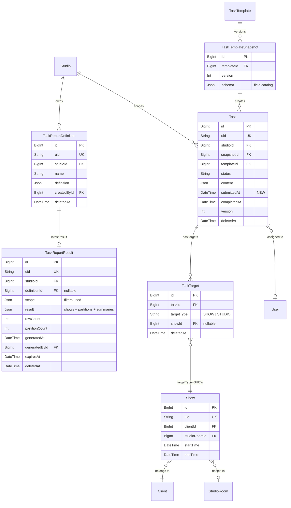
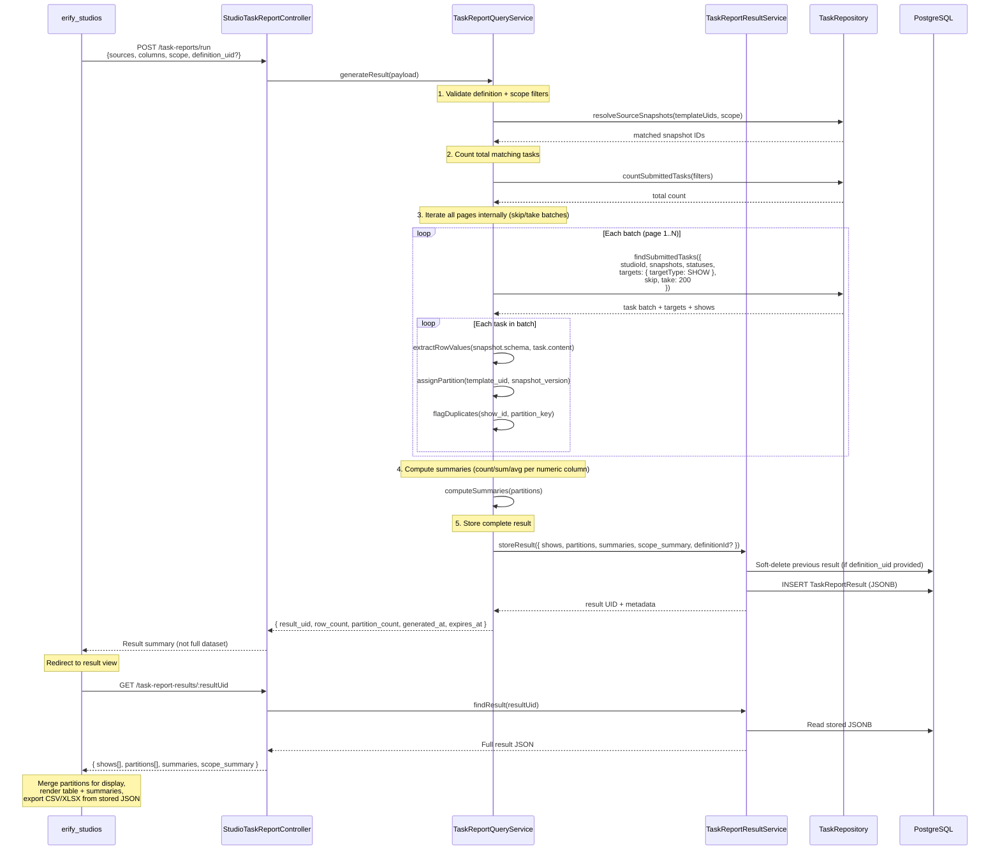
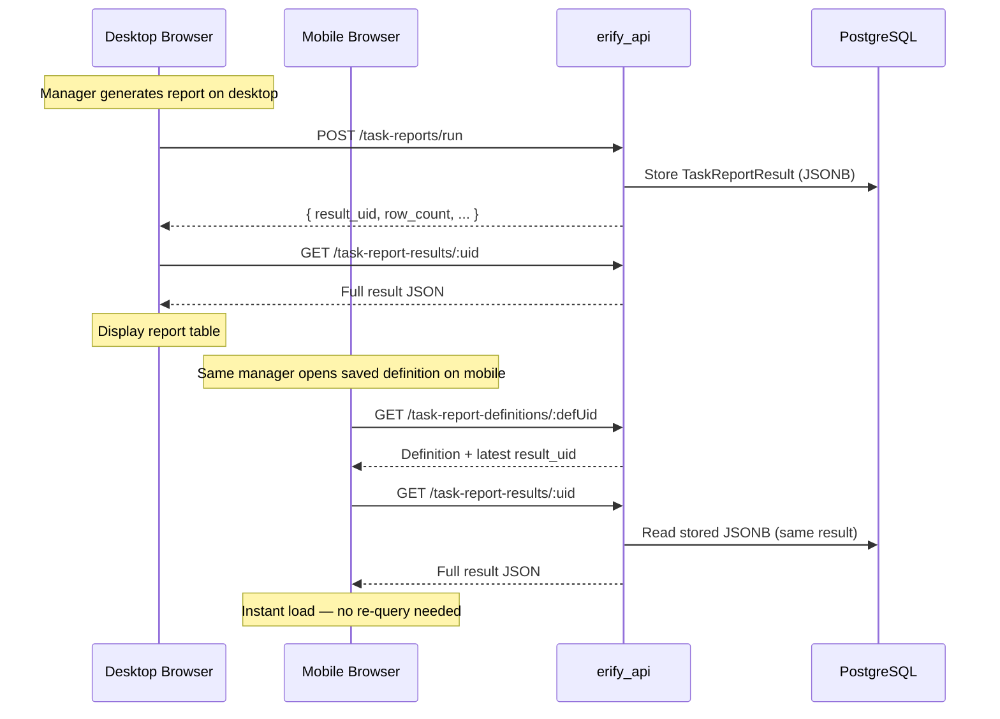
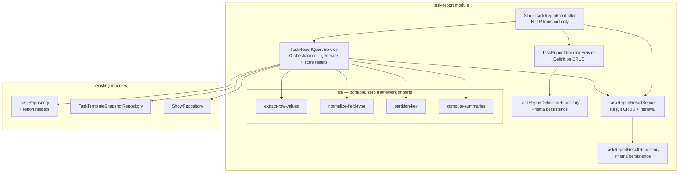

# Task Submission Reporting & Export — Backend Design

> **TLDR**: Add a studio-scoped reporting API that stores reusable report definitions as JSON, resolves submitted-task data from immutable template snapshots, generates and persists complete result snapshots as JSONB for cross-device access, and serves structured JSON that the client can review and serialize to CSV/XLSX.

## 1. Purpose

Support manager-facing review and export of submitted task data without introducing server-side report files or a warehouse dependency.

Primary examples:

- moderation managers summarizing GMV, views, and performance metrics across many shows,
- studio managers reviewing post-production upload URLs for premium-show QC,
- admins exporting submitted task evidence by client or date range.

This design must fit the current task architecture:

- `Task.content` stores submitted values,
- `TaskTemplateSnapshot.schema` is the historical source of truth,
- tasks link to shows through `TaskTarget` (polymorphic, `targetType = SHOW`), not a direct FK,
- studio-scoped routes already exist for review and task listing,
- no DB internal IDs may leak through API responses.

## 2. Goals

1. Persist reusable report definitions as JSON only.
2. Resolve selected fields against immutable task snapshots.
3. Generate and persist complete result snapshots as JSONB for cross-device access and export.
4. Return compatibility-grouped datasets so exports remain schema-safe.
5. Reuse existing task/show/client relations instead of introducing a parallel reporting store.
6. Balance FE/BE workload — backend owns query execution, result accumulation, and summary computation; frontend owns display merging and export serialization.

## 3. Non-Goals

1. No server-side CSV/XLSX file generation (MVP — JSON is the interchange format; FE serializes to CSV/XLSX).
2. No cloud-storage report artifacts.
3. No warehouse or BigQuery dependency for the first version.
4. No arbitrary formula engine in backend report definitions.
5. No external cache layer (Redis) for the first version — PostgreSQL JSONB is sufficient.

## 4. Key Design Decisions

### 4.1 Snapshot schema is canonical

Current template schema cannot be the reporting source of truth because tasks already persist against immutable snapshots. Report extraction must always resolve from `task.snapshot.schema` plus `task.content`.

Template-based source selection is allowed, but only as a convenience that resolves to one or more actual snapshot groups at query time.

### 4.2 Show-centric review, snapshot-centric export

Managers want one operational review table per show, but backend export groups must preserve schema compatibility. The API therefore returns:

1. a top-level show index for client-side joining, and
2. one or more source partitions keyed by snapshot compatibility.

The client can merge partitions for on-screen review by `show_id`, but export must keep incompatible partitions separate.

### 4.3 Safe partition key

Do not group rows by `task.type + snapshot.version` alone. Snapshot versions are local to each template and can collide across unrelated schemas.

Safe MVP partition key:

- `template_uid`
- `snapshot_version`
- optional future `schema_signature`

Future cross-template merging is acceptable only if a deterministic schema-compatibility fingerprint is introduced.

**Known UX friction (MVP)**: When a manager selects "all versions" of a template, consecutive snapshot versions with identical schemas will produce separate partitions (and separate export sheets) even though their columns are the same. This is correct for data integrity but will surprise managers. The source catalog should surface version count per template so managers can narrow their selection. Adding a `schema_signature` to collapse structurally identical snapshots is the recommended follow-up for milestone 2.

### 4.4 Server-side result snapshots (JSONB)

The backend stores complete report results as JSONB in a dedicated `TaskReportResult` model. This is **not** a file artifact — it is structured JSON that serves as:

1. **the canonical report output** — the authoritative result of a report execution,
2. **a cross-device sync mechanism** — any device loading the same saved definition retrieves the stored result instantly,
3. **the export source** — CSV/XLSX serialization reads from this JSON, not from re-queried live data.

The backend does **not** persist generated CSV/XLSX files or cloud-storage artifacts. JSON is the first-class report format; CSV and XLSX are serialization targets derived from it.

#### 4.4.1 Result storage comparison matrix

The following matrix evaluates four approaches to report result persistence. The chosen approach is **Option B: PostgreSQL JSONB**.

| Criteria | A: FE-only (IndexedDB) | B: PostgreSQL JSONB | C: Redis cache | D: Redis + PostgreSQL |
|---|---|---|---|---|
| **Cross-device access** | No — browser-local only | Yes — any authenticated device | Yes — while cached | Yes |
| **Team sharing** | No | Yes — same studio role access | Yes — while cached | Yes |
| **Survives restart** | Yes (IndexedDB persists) | Yes | No — evicted on restart | Partially |
| **Storage cost** | Free (client disk) | DB disk — ~100KB-5MB per result | Memory — expensive for large blobs | Memory + disk |
| **Staleness handling** | Client-side 24h rule | `expires_at` column, server-managed | TTL-based auto-expiration | TTL + DB fallback |
| **Infrastructure** | None | Already exists (PostgreSQL) | New dependency (not in codebase) | Two new dependencies |
| **Operational complexity** | Low | Low | Medium — Redis ops, memory sizing | High |
| **Query performance** | N/A — local reads | Single-row JSONB read by UID | Sub-ms key lookup | Sub-ms hot, ~ms warm |
| **Export workflow** | FE accumulates all pages first | FE reads stored JSON directly | Same as B while cached | Same as B |
| **Offline resume** | Single browser only | Any device, any time | Only while cached | Any device if in DB |
| **Implementation effort** | Minimal | Low — one new model + service | Medium — Redis setup + cache logic | High |

**Decision: Option B (PostgreSQL JSONB)**

Rationale:

- No new infrastructure. PostgreSQL is already the primary datastore.
- Cross-device sync is achieved naturally through the DB.
- Result access pattern is simple: single-row read by UID — JSONB is efficient for this.
- Result sizes (100KB–5MB) are well within PostgreSQL JSONB limits.
- Redis (Options C/D) adds operational complexity for marginal latency improvement on an infrequent manager action. If report result reads become a measurable bottleneck at scale, Redis can be added as a transparent read-through cache without architectural changes.
- IndexedDB (Option A) remains available as an optional FE optimization for offline/low-latency display, but it is no longer the primary persistence layer.

#### 4.4.2 FE/BE workload rebalancing

| Responsibility | Previous (FE-heavy) | Revised (balanced) |
|---|---|---|
| Query execution | BE | BE (unchanged) |
| Page accumulation | FE (`useInfiniteQuery` + IndexedDB) | BE — generates full result internally |
| Row extraction + partitioning | BE | BE (unchanged) |
| Numeric summaries | FE (client-side computation) | BE — computed during result generation |
| Result persistence | FE (IndexedDB, browser-local) | BE — `TaskReportResult` in PostgreSQL |
| Cross-device sync | Not supported | BE — result accessible from any device |
| Staleness detection | FE (24h rule in IndexedDB) | BE — `expiresAt` / `generatedAt` comparison |
| Partition merge for display | FE | FE (unchanged — display concern) |
| CSV/XLSX serialization | FE | FE from stored JSON (unchanged for MVP) |
| IndexedDB cache | Primary persistence | Optional FE optimization for offline/speed |

**Key architectural shift**: The BE generates and stores the **complete result** for a report run (iterating through all pages internally), rather than serving individual pages for the FE to accumulate. The FE still does display-layer work (merge, render, export serialization) but no longer manages multi-page accumulation or cross-device caching.

### 4.5 Typed submission timestamp is worth adding

Current task model has `completedAt`, but not a first-class `submittedAt` for `REVIEW`. Reporting and sorting on "submitted tasks" becomes awkward if this remains buried only in metadata transitions.

Recommended addition:

- `Task.submittedAt DateTime? @map("submitted_at")`

Set when a task transitions into `REVIEW` for the current submission cycle. Keep `completedAt` for approval/final completion.

**Resubmission semantics**: If a task is rejected back to `IN_PROGRESS` and resubmitted, `submittedAt` is overwritten with the latest submission time. This means `submittedAt` always reflects the most recent submission, not the first. The full submission history remains available in `metadata.audit` for audit purposes.

**Historical backfill strategy**: Existing tasks in `REVIEW`, `COMPLETED`, or `CLOSED` status will have `submittedAt = null` after migration. The migration should include a data backfill that extracts the latest `REVIEW` transition timestamp from `metadata.audit.last_transition.at` (or `metadata.due_warning.submitted_at` for overdue tasks) and populates `submittedAt`. Tasks where no audit metadata exists remain `null` — the reporting query must treat `null` `submittedAt` as valid (task was submitted before the field existed) and fall back to `updatedAt` for sort ordering.

### 4.6 Show-targeted tasks only

Tasks connect to shows through the polymorphic `TaskTarget` model (`targetType = SHOW`), not a direct foreign key. The reporting query must:

1. join through `TaskTarget` to resolve the associated show,
2. filter to `targetType = SHOW` — exclude studio-targeted or other non-show task targets,
3. handle the (rare) case where a task has multiple show targets by emitting one row per show target, not one row per task.

Tasks with no show-type target are excluded from reporting results entirely. This primarily affects `ADMIN`-type tasks that target the studio rather than a specific show.

### 4.7 Role-based source visibility

MVP: all permitted roles (`ADMIN`, `MANAGER`, `MODERATION_MANAGER`) see all templates with submitted tasks in the studio.

> **Intentional role boundary expansion**: The current `erify-authorization` skill defines `MODERATION_MANAGER` as scoped to "Dashboard, own tasks, own shifts only." Reporting endpoints intentionally broaden this to cross-show visibility. This is a deliberate product decision — moderation managers need to summarize GMV/views across many shows and cannot do so from the per-task review queue. If this expansion is later revisited, restrict reporting access to `ADMIN` + `MANAGER` only and add a separate moderation-summary workflow.

If role-scoped template visibility becomes necessary (e.g. moderation managers should only see moderation-type templates), add a `template_type` filter to the source catalog endpoint rather than creating separate endpoints per role. The source catalog response should include `task_type` on each template entry so the frontend can implement client-side role-aware defaults (e.g. pre-selecting moderation templates when the current user is a `MODERATION_MANAGER`).

## 5. Data Model Relationships



## 6. Proposed Schema Additions

### 6.1 `Task` model

Add:

- `submittedAt DateTime? @map("submitted_at")`
- index on `[studioId, submittedAt]`
- optional index on `[templateId, submittedAt]`

Reason:

- reliable filtering of submitted work,
- stable sorting for batched report queries,
- avoids JSON-metadata queries for core report workflows.

### 6.2 `TaskReportDefinition` model

Add a dedicated soft-deletable studio-scoped model.

Suggested fields:

- `id BigInt`
- `uid String @unique`
- `studioId BigInt`
- `name String`
- `description String?`
- `definition Json`
- `createdById BigInt?`
- `updatedById BigInt?`
- `createdAt DateTime`
- `updatedAt DateTime`
- `deletedAt DateTime?`

`definition` JSON stores:

- source descriptors (`template` or `snapshot`)
- selected field keys
- show/task filters
- optional preferred export format / column ordering

Do **not** store generated rows or file URLs here.

### 6.3 `TaskReportResult` model

Add a dedicated model for storing complete report execution results.

Suggested fields:

- `id BigInt`
- `uid String @unique`
- `studioId BigInt`
- `definitionId BigInt?` (FK → `TaskReportDefinition`, nullable for ad-hoc runs)
- `scope Json` (the exact filters used for this execution)
- `result Json` (the full result payload: `shows[]`, `partitions[]`, `summaries`, `scope_summary`)
- `rowCount Int` (quick metadata without parsing JSONB)
- `partitionCount Int`
- `generatedAt DateTime`
- `generatedById BigInt?` (FK → `User`)
- `expiresAt DateTime` (soft staleness marker, default = `generatedAt + 24h`)
- `version Int` (optimistic locking)
- `createdAt DateTime`
- `updatedAt DateTime`
- `deletedAt DateTime?`

`result` JSON stores:

- `shows[]` — stable show metadata index (same structure as query response)
- `partitions[]` — compatibility-grouped flat rows with extracted values
- `summaries` — pre-computed numeric aggregates per partition (count, sum, avg per numeric column)
- `scope_summary` — human-readable description of the filters used

Indexes:

- `[studioId, definitionId]` — find result for a saved definition
- `[studioId, generatedAt]` — list recent results
- `[expiresAt]` — cleanup stale results

**Why separate from `TaskReportDefinition`:**

1. **Size asymmetry**: Definitions are small (~1-5KB config). Results can be large (100KB-5MB).
2. **Decoupled lifecycle**: Re-running a definition creates a new result without touching the definition.
3. **Ad-hoc support**: Results can exist without a saved definition (inline/one-off queries).
4. **Query performance**: List queries on definitions stay fast — no accidental loading of large JSONB blobs.

**Result lifecycle:**

1. A "Run Report" action generates a new `TaskReportResult` and soft-deletes the previous one for the same definition.
2. Only the latest result per definition is kept active. Older results are soft-deleted but retained for audit.
3. Stale results (past `expiresAt`) show a warning but remain accessible until explicitly refreshed.
4. A periodic cleanup job can hard-delete soft-deleted results older than a retention period (e.g. 30 days).

## 7. Shared API Contract Additions (`@eridu/api-types/task-management`)

Add a new reporting schema module under the task-management domain. Expected DTOs:

- `taskReportSourceDto`
- `taskReportDefinitionDto`
- `createTaskReportDefinitionSchema`
- `updateTaskReportDefinitionSchema`
- `taskReportRunRequestSchema`
- `taskReportResultDto`
- `taskReportResultSummaryDto`
- `taskReportPartitionDto`
- `taskReportColumnDto`

Key request concepts (run report):

- `sources[]`: template-based or snapshot-based selection
- `columns[]`: selected field keys plus optional display overrides
- `scope`: show filters (`show_ids`, `date_from`, `date_to`, `client_id`, `show_id`, etc.)
- `submitted_statuses`: default `[REVIEW, COMPLETED, CLOSED]`
- `definition_uid` (optional — link result to a saved definition)

Key response concepts (result):

- `uid`: result identifier for subsequent retrieval
- `shows[]`: stable show metadata index
- `partitions[]`: compatibility-grouped flat rows
- `summaries`: pre-computed numeric aggregates per partition
- `scope_summary`: human-readable scope description
- `row_count`, `partition_count`: quick metadata
- `generated_at`, `expires_at`: freshness metadata

## 8. Endpoint Plan

### 8.1 Source catalog

`GET /studios/:studioId/task-report-sources`

Purpose:

- list available templates/snapshots that have submitted tasks in the studio,
- return field catalogs derived from snapshot schemas,
- expose usage summary (`submitted_task_count`, `latest_show_start`, etc.).

Access:

- `ADMIN`, `MANAGER`, `MODERATION_MANAGER`

### 8.2 Saved definition CRUD

- `GET /studios/:studioId/task-report-definitions`
- `GET /studios/:studioId/task-report-definitions/:definitionUid`
- `POST /studios/:studioId/task-report-definitions`
- `PATCH /studios/:studioId/task-report-definitions/:definitionUid`
- `DELETE /studios/:studioId/task-report-definitions/:definitionUid`

Access:

- `ADMIN`, `MANAGER`, `MODERATION_MANAGER`

Purpose:

- persist named JSON definitions only,
- support repeated manager workflows,
- keep ownership studio-scoped.

### 8.3 Report execution (generate result)

`POST /studios/:studioId/task-reports/run`

Access:

- `ADMIN`, `MANAGER`, `MODERATION_MANAGER`

Body accepts either:

- inline definition payload (ad-hoc), or
- `definition_uid` plus optional scope overrides.

This endpoint generates the **complete result** server-side (iterating through all matching tasks internally) and stores it as a `TaskReportResult`. The response returns the result UID plus summary metadata — not the full dataset.

**Request shape:**

```text
sources[]
columns[]
scope { show_ids?, date_from?, date_to?, client_id?, submitted_statuses? }
definition_uid?  (optional — links result to saved definition)
```

**Response shape:**

```text
result_uid
row_count
partition_count
generated_at
expires_at
scope_summary
```

If a `definition_uid` is provided and a previous active result exists for that definition, the previous result is soft-deleted before the new one is stored.

### 8.4 Retrieve result

`GET /studios/:studioId/task-report-results/:resultUid`

Access:

- `ADMIN`, `MANAGER`, `MODERATION_MANAGER`

Returns the full stored result JSON for client-side display and export. For very large results, the endpoint supports optional pagination over the `partitions[]` array:

- `partition_page` (default `1`)
- `partition_limit` (default: all — return complete result)

**Response shape:**

```text
uid
shows[]
partitions[]
summaries
scope_summary
row_count
partition_count
generated_at
expires_at
```

This is the endpoint the FE calls on any device to load a report result. It reads from stored JSONB — no live query re-execution.

### 8.5 List results

`GET /studios/:studioId/task-report-results`

Access:

- `ADMIN`, `MANAGER`, `MODERATION_MANAGER`

Returns a paginated list of active results for the studio, with summary metadata only (no full result payloads). Useful for the FE to show recent reports and check freshness.

Query params: `definition_uid?` (filter by definition), standard `page` + `limit`.

Each partition row (inside a stored result) includes:

- `show_id`
- `task_uid`
- `task_status`
- `submitted_at`
- `completed_at`
- `template_uid`
- `snapshot_version`
- `values`
- `duplicate_source_on_show`

## 9. Query Strategy

### Report Generation Sequence



### Cross-Device Access Sequence



### 9.1 Scope resolution

1. Validate the report definition.
2. Require at least one scope filter: `show_ids`, `date_from`, `date_to`, or `client_id`. The system does not impose hard upper limits on date ranges — managers may query a full quarter or 6 months.
3. Resolve template-based sources to matching submitted-task snapshots inside scope.
4. Count total matching tasks (for progress tracking and guardrail enforcement).
5. Build a lean Prisma query over `Task` with:
   - `deletedAt: null`
   - studio scope
   - submitted statuses
   - `targets: { some: { targetType: 'SHOW', ... } }` — show-target filter via `TaskTarget` join
   - template/snapshot filters
6. Iterate all matching tasks in internal batches (`skip`/`take` with batch size 200). Each batch: extract rows, assign partitions, flag duplicates. Accumulate into the result structure.
7. Join through `TaskTarget` to resolve the associated `Show`. The query must use `task.targets` (with `targetType = SHOW`) to reach show metadata — there is no direct `task.showId` FK.
8. After all batches: compute numeric summaries, store complete result as `TaskReportResult`.

### 9.2 Lean select/include

Select only what the client needs:

- task UID, status, submitted/completed timestamps,
- template UID/name,
- snapshot version/schema,
- `content`,
- show metadata via `targets` → `Show`: UID/name/external ID/start/end,
- client name (via show → client),
- studio room name (via show → studio room),
- assignee name,
- creator names if needed for system columns.

The `TaskTarget` join is the path to show data. Use a targeted include:

```
include: {
  targets: {
    where: { targetType: 'SHOW', deletedAt: null },
    select: {
      show: {
        select: { uid, name, externalId, startTime, endTime,
                  client: { select: { name } },
                  studioRoom: { select: { name } } }
      }
    }
  }
}
```

Avoid broad includes that duplicate full show objects.

### 9.3 Row extraction

For each matched task:

1. read selected field definitions from `snapshot.schema.items`,
2. pull matching values from `task.content`,
3. normalize by field type,
4. append into the appropriate partition.

Normalization rules:

- `number` -> numeric JSON value
- `checkbox` -> boolean
- `multiselect` -> array of strings in API response
- `file` / `url` -> raw URL string
- missing key -> `null`

### 9.4 Duplicate-source handling

MVP assumption: one active non-deleted task per show/template is the normal case.

If multiple non-deleted submitted tasks match the same show + source partition:

- do not silently merge them,
- emit separate rows,
- set `duplicate_source_on_show = true`.

This keeps export lossless and flags data hygiene issues explicitly.

### 9.5 Multi-target task handling

If a single task has multiple show-type targets (rare but structurally possible via `TaskTarget`), emit one row per show target. Each row carries the same task UID but different `show_id`. The `duplicate_source_on_show` flag is independent — it tracks duplicate tasks per show, not duplicate targets per task.

### 9.6 Internal batch processing

The report generation endpoint does **not** expose pagination to the client. Instead, the `TaskReportQueryService` iterates all matching tasks internally using offset-based batches:

- Internal batch size: `200` rows per iteration (not configurable by client).
- Uses `skip`/`take` with the standard Prisma offset pattern.
- Each batch: extract rows, assign partitions, flag duplicates, accumulate into result.
- After all batches: compute numeric summaries, store complete result.

**Guardrail**: If total matching tasks exceeds `10,000`, abort and return an error asking the manager to narrow scope filters. This prevents runaway result generation. The cap is configurable per studio if needed.

Recommended sort order (inside result):

1. `show.startTime DESC`
2. `show.uid DESC`
3. `task.uid DESC`

Reason: most-recent shows first is the natural manager expectation for operational review.

### 9.7 Result retrieval pagination

The `GET /task-report-results/:resultUid` endpoint returns the stored JSONB. For very large results, the endpoint can optionally paginate over the `partitions[]` array to avoid sending multi-MB JSON in one response. However, for MVP, return the complete result — typical result sizes (100KB-2MB) are well within acceptable response limits.

Standard offset-based pagination (`page` + `limit`) is used for the result **list** endpoint (`GET /task-report-results`), following existing `paginationQuerySchema` patterns.

## 10. Service and Module Boundaries

### Module Architecture



Recommended module split:

- `StudioTaskReportController` for studio-scoped HTTP surface
- `TaskReportDefinitionService` for CRUD on saved definitions
- `TaskReportResultService` for result storage, retrieval, and lifecycle (model-style service)
- `TaskReportQueryService` as orchestration layer for result generation (coordinates tasks, templates, snapshots, shows, and result storage)
- `TaskReportDefinitionRepository` for definition persistence
- `TaskReportResultRepository` for result persistence
- extend `TaskRepository` with lean report-query helpers as needed

Boundary rules:

- controllers stay transport-only,
- definition CRUD is a model-style service,
- result CRUD is a model-style service,
- report generation is orchestration because it coordinates multiple services and repositories.

### 10.1 Extraction-ready file layout

Per the `package-extraction-strategy` skill, isolate pure logic into a `lib/` subdirectory with zero framework imports:

```
src/models/task-report/
  ├── task-report.module.ts                 # NestJS wiring
  ├── task-report.controller.ts             # HTTP transport
  ├── task-report-definition.service.ts     # Definition CRUD (NestJS-coupled)
  ├── task-report-definition.repository.ts  # Definition persistence (Prisma-coupled)
  ├── task-report-result.service.ts         # Result CRUD (NestJS-coupled)
  ├── task-report-result.repository.ts      # Result persistence (Prisma-coupled)
  ├── task-report-query.service.ts          # Orchestration — generate results (NestJS-coupled)
  ├── schemas/                              # Zod + payload types
  └── lib/                                  # PORTABLE: pure functions only
      ├── extract-row-values.ts             # snapshot schema + content → flat row
      ├── normalize-field-type.ts           # field type normalization rules
      ├── partition-key.ts                  # template_uid + snapshot_version grouping
      └── compute-summaries.ts             # numeric aggregation (count/sum/avg)
```

`lib/` files must not import NestJS, Prisma, or any app-specific module. They take plain objects as input and return plain objects. This makes future extraction to a shared `@eridu/report-core` package a file move, not a rewrite. Do not extract until a second consumer (e.g. a dedicated reporting service) exists.

Note: `compute-summaries.ts` exists in both BE and FE `lib/` directories. The BE version runs during result generation (pre-computed summaries stored in JSONB). The FE version is available for client-side re-computation if needed (e.g. after column reordering or filtering). If both converge on the same algorithm, extract to a shared package.

## 11. Validation and Guardrails

1. Roles: `ADMIN`, `MANAGER`, `MODERATION_MANAGER`
2. Maximum sources per query: recommended `<= 10`
3. Maximum selected fields per source: recommended `<= 50`
4. Maximum total result rows: `10,000` (abort with error if exceeded — ask manager to narrow scope)
5. Internal batch size: `200` rows per iteration during result generation
6. Require at least one scope filter (`show_uids`, `date_from`, `date_to`, or `client_id`) to prevent unscoped full-studio scans. No hard upper limit on date ranges — managers may export a quarter or longer.
7. Reject unknown field keys for snapshot-based definitions at validation time
8. For template-based definitions, allow missing keys in older snapshots but return `null` rather than fabricating values
9. Result expiry: default `24 hours` after `generatedAt`. Stale results remain accessible but show a warning.
10. Result retention: soft-deleted results are hard-deleted after `30 days` by a periodic cleanup job.

## 12. Risks and Mitigations

### 12.1 Template evolution drift

Risk:

- template-based saved definitions may reference field keys that disappear in later versions.

Mitigation:

- snapshot-based presets remain exact,
- template-based presets return `null` for missing fields and surface compatibility warnings.

### 12.2 File URL longevity

Risk:

- if upload URLs ever become signed/expiring, exported values may go stale.

Mitigation:

- keep URL export as current-state behavior,
- if signed URLs are introduced later, move report responses to stable asset identifiers plus on-demand re-sign endpoints.

### 12.3 TaskTarget join complexity

Risk:

- Tasks connect to shows through the polymorphic `TaskTarget` model, not a direct FK. This adds a join hop to every report query and makes cursor pagination more complex (sort order spans `Show.startTime` via an intermediate table).

Mitigation:

- ensure `TaskTarget` has a composite index on `[taskId, targetType]` for efficient filtering,
- the lean select/include pattern (section 8.2) keeps the join narrow,
- if query performance degrades at scale, consider a denormalized `showId` on `Task` for reporting-hot-path queries only (evaluate after production data volumes are known).

### 12.4 Large JSON payloads

Risk:

- selected task content can become large over long date ranges.

Mitigation:

- bounded scope (at least one filter required),
- lean select (only selected fields extracted),
- result row cap (`10,000` default),
- selected-field extraction in service before result storage — raw `task.content` JSONB is never stored in the result.

### 12.5 Result JSONB storage growth

Risk:

- each result can be 100KB–5MB. High-volume studios generating many reports could accumulate significant JSONB data.

Mitigation:

- only one active result per definition (previous soft-deleted on re-run),
- hard-delete soft-deleted results after 30-day retention period,
- `rowCount` and `partitionCount` fields enable monitoring without parsing JSONB,
- if storage becomes a concern, introduce result compression (gzip JSONB) or move large results to object storage with a DB pointer.

### 12.6 Result generation duration

Risk:

- large result sets (5,000–10,000 rows) may take several seconds to generate, leading to HTTP timeout or poor UX.

Mitigation:

- synchronous generation is acceptable for MVP (typical result sets < 2,000 rows complete in < 3s),
- if generation consistently exceeds 5s, introduce async generation: return `202 Accepted` with a `result_uid`, then poll `GET /task-report-results/:uid` until status transitions from `GENERATING` to `READY`.

### 12.7 Offset-based batching under concurrent writes

Risk:

- the internal `skip`/`take` batch loop uses offset pagination. If new tasks are submitted (or existing tasks change status) while result generation is in progress, rows can shift pages — causing some tasks to be skipped or duplicated across batches.

Mitigation:

- the reporting scope is limited to `REVIEW`, `COMPLETED`, and `CLOSED` tasks. These statuses rarely change mid-generation in practice (a submitted task is unlikely to be re-opened and moved back to `IN_PROGRESS` during the seconds the loop runs), so drift risk is low.
- if correctness under concurrent writes becomes a requirement, switch the batch loop to keyset/cursor pagination (ordering by `(submittedAt, id)` and using a cursor instead of `skip`) — this is immune to row insertion drift.

### 12.8 Broken shared result links after re-run

Risk:

- re-running a report for a saved definition soft-deletes the previous `TaskReportResult`. Any manager who bookmarked or shared a URL containing the old `result_id` will get a 404 or a "not found" response.

Mitigation:

- `GET /task-report-results/:resultUid` should return a structured 410 Gone response (not a generic 404) that includes the `definition_uid` for the soft-deleted result.
- the frontend must handle 410 responses gracefully: redirect the user to the definition view and offer a "Run Report" prompt rather than showing a raw error.
- for milestone 2, consider returning a `successor_result_uid` in the 410 body so the FE can redirect directly to the latest active result for the same definition.

## 13. Rollout Recommendation

### Milestone BE-1 (Core workflow)

1. `submittedAt` migration + historical backfill from audit metadata
2. source catalog endpoint (templates/snapshots with submitted task counts, field catalogs, `task_type` per entry)
3. report generation endpoint (`POST /task-reports/run`) with `TaskTarget` join, internal batch processing, and result storage
4. result retrieval endpoint (`GET /task-report-results/:resultUid`)
5. inline definition support only (no saved definitions yet — validate the generate-and-retrieve workflow first)

### Milestone BE-2 (Persistence + polish)

1. saved definition CRUD with latest `result_uid` linkage (only worth building after the generate workflow is proven useful)
2. result list endpoint (`GET /task-report-results`) for recent report history
3. result cleanup job (hard-delete soft-deleted results past retention period)
4. role-aware source catalog filtering by `task_type` if product requires it
5. `schema_signature` on snapshots for cross-version partition merging

### Milestone BE-3 (Scale, if needed)

1. async result generation (202 + polling) for large datasets
2. Redis read-through cache for hot results (transparent to FE)
3. server-side CSV/XLSX export endpoint (`GET /task-report-results/:uid/export?format=csv`)
4. result compression for large JSONB payloads

## 14. Verification Plan

When implemented, verify at minimum:

- `pnpm --filter erify_api lint`
- `pnpm --filter erify_api typecheck`
- `pnpm --filter erify_api test`

Targeted tests:

1. source catalog resolves snapshot field metadata correctly
2. result generation partitions rows by template + snapshot version
3. template-based definitions return `null` for missing keys on older snapshots
4. submitted-status filtering excludes in-progress work by default
5. saved definition CRUD respects studio scoping and soft delete
6. only show-targeted tasks are included; studio-targeted tasks are excluded
7. tasks with multiple show targets emit one row per show
8. `submittedAt` backfill correctly extracts timestamps from audit metadata
9. `submittedAt` is overwritten on resubmission (rejection → resubmit cycle)
10. `duplicate_source_on_show` flag is set when multiple tasks match same show + partition
11. result generation stores complete JSONB with correct `rowCount` and `partitionCount`
12. result retrieval returns stored JSONB without re-querying live data
13. re-running a definition soft-deletes previous result and creates new one
14. result `expiresAt` is correctly set to `generatedAt + 24h`
15. numeric summaries (count, sum, avg) are correctly computed and stored in result
16. result row cap (10,000) rejects over-scoped queries with descriptive error
