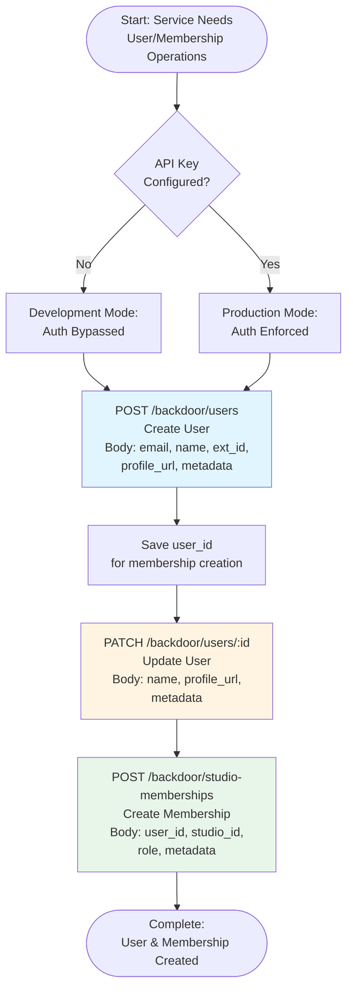

# Backdoor API Integration Workflow

This document describes the complete API calling workflow for service-to-service backdoor operations. These endpoints are separate from admin endpoints (`/admin/*`) and use API key authentication via `BackdoorApiKeyGuard`.

## Overview

The backdoor endpoints provide service-to-service operations for privileged tasks:

- **User Management**: Create and update users
- **Membership Management**: Create studio memberships for admin users

**Key Differences from Admin Endpoints**:

- **Authentication**: API key (`BACKDOOR_API_KEY`) instead of JWT
- **Endpoints**: `/backdoor/*` instead of `/admin/*`
- **Future Enhancement**: IP whitelisting support via `BACKDOOR_ALLOWED_IPS`
- **Purpose**: Service-to-service operations, not user-facing admin operations

## Workflow Flowchart



## API Call Sequence

### 1. Create User

**Purpose**: Create a new user account via service-to-service API

- **`POST /backdoor/users`** - Create user (API key required)
  - Request body includes: `email`, `name`, `ext_id` (optional), `profile_url` (optional), `metadata` (optional)
  - Response includes: `id` (user UID), `email`, `name`, `created_at`, `updated_at`
  - **Authentication**: Requires `X-API-Key` header with `BACKDOOR_API_KEY` value

**Example Request**:

```bash
curl -X POST http://localhost:3000/backdoor/users \
  -H "X-API-Key: your-backdoor-api-key" \
  -H "Content-Type: application/json" \
  -d '{
    "email": "admin@example.com",
    "name": "Admin User",
    "ext_id": "sso_admin_123",
    "profile_url": "https://example.com/profiles/admin",
    "metadata": {
      "department": "IT",
      "role": "super_admin"
    }
  }'
```

**Example Response**:

```json
{
  "id": "user_abc123",
  "email": "admin@example.com",
  "name": "Admin User",
  "ext_id": "sso_admin_123",
  "profile_url": "https://example.com/profiles/admin",
  "created_at": "2024-01-15T10:00:00Z",
  "updated_at": "2024-01-15T10:00:00Z"
}
```

### 2. Update User

**Purpose**: Update an existing user account

- **`PATCH /backdoor/users/:id`** - Update user (API key required)
  - Request body includes: `name` (optional), `email` (optional), `profile_url` (optional), `metadata` (optional)
  - Response includes: Updated user object
  - **Authentication**: Requires `X-API-Key` header with `BACKDOOR_API_KEY` value

**Example Request**:

```bash
curl -X PATCH http://localhost:3000/backdoor/users/user_abc123 \
  -H "X-API-Key: your-backdoor-api-key" \
  -H "Content-Type: application/json" \
  -d '{
    "name": "Updated Admin User",
    "profile_url": "https://example.com/profiles/admin-updated",
    "metadata": {
      "department": "IT",
      "role": "super_admin",
      "updated_at": "2024-01-15T10:00:00Z"
    }
  }'
```

### 3. Create Studio Membership

**Purpose**: Create a studio membership to grant admin access to a user

- **`POST /backdoor/studio-memberships`** - Create studio membership (API key required)
  - Request body includes: `user_id`, `studio_id`, `role` (admin/manager/member), `metadata` (optional)
  - Response includes: Membership object with user and studio relations
  - **Authentication**: Requires `X-API-Key` header with `BACKDOOR_API_KEY` value

**Example Request**:

```bash
curl -X POST http://localhost:3000/backdoor/studio-memberships \
  -H "X-API-Key: your-backdoor-api-key" \
  -H "Content-Type: application/json" \
  -d '{
    "user_id": "user_abc123",
    "studio_id": "studio_xyz789",
    "role": "admin",
    "metadata": {
      "assigned_by": "system",
      "assigned_at": "2024-01-15T10:00:00Z"
    }
  }'
```

**Example Response**:

```json
{
  "id": "membership_def456",
  "user_id": "user_abc123",
  "studio_id": "studio_xyz789",
  "role": "admin",
  "metadata": {
    "assigned_by": "system",
    "assigned_at": "2024-01-15T10:00:00Z"
  },
  "user": {
    "id": "user_abc123",
    "email": "admin@example.com",
    "name": "Admin User"
  },
  "studio": {
    "id": "studio_xyz789",
    "name": "Main Studio",
    "address": "123 Studio St"
  },
  "created_at": "2024-01-15T10:00:00Z",
  "updated_at": "2024-01-15T10:00:00Z"
}
```

## Authentication

### API Key Configuration

The backdoor endpoints require API key authentication via the `X-API-Key` header:

```env
BACKDOOR_API_KEY=your-generated-api-key-here
```

**Generate API Key**:

```bash
openssl rand -base64 32
```

### Environment Behavior

- **Production**: **Required**. API key must be configured in `.env`. Returns 401 if not configured or if header doesn't match.
- **Development**: Optional. If not set, authentication is bypassed (allows requests without key).
- **When Set**: Authentication is always enforced regardless of environment.

### Future: IP Whitelisting

The guard supports future IP whitelisting via `BACKDOOR_ALLOWED_IPS` environment variable:

```env
BACKDOOR_ALLOWED_IPS=192.168.1.100,10.0.0.50
```

When implemented, requests will be validated against the whitelist in addition to API key validation.

## Test Scripts

### Quick Start (Automated)

**Option 1: Run Complete Workflow (Recommended)**

```bash
# Run all steps sequentially
pnpm run manual:backdoor:all

# With custom API URL
pnpm run manual:backdoor:all -- --api-url=http://localhost:3000
```

**Option 2: Run Steps Individually**

```bash
# Step 1: Create a user
pnpm run manual:backdoor:create-users

# Step 2: Update the user (replace user_123 with actual user ID from step 1)
pnpm run manual:backdoor:update-users -- --user-id=user_123

# Step 3: Create a membership (update user_id and studio_id in payload first)
pnpm run manual:backdoor:create-memberships
```

### Available Scripts

All scripts are located in `backdoor/scripts/`:

1. **`manual:backdoor:create-users`** (`1.create-users.ts`) - Creates a user via backdoor endpoint
   - Reads from `01-create-user.json`
   - Uses `POST /backdoor/users`

2. **`manual:backdoor:update-users`** (`2.update-users.ts`) - Updates a user via backdoor endpoint
   - Reads from `02-update-user.json`
   - Uses `PATCH /backdoor/users/:id`
   - Requires `--user-id` argument

3. **`manual:backdoor:create-memberships`** (`3.create-memberships.ts`) - Creates a studio membership via backdoor endpoint
   - Reads from `03-create-membership.json`
   - Uses `POST /backdoor/studio-memberships`

4. **`manual:backdoor:all`** (`workflows/run-all.ts`) - Runs all steps sequentially
   - Creates user, updates user, creates membership
   - Automatically passes user ID between steps

### Custom API URL

All scripts support a custom API URL via command line argument:

```bash
pnpm run manual:backdoor:create-users -- --api-url=http://localhost:3000
pnpm run manual:backdoor:update-users -- --user-id=user_123 --api-url=http://localhost:3000
pnpm run manual:backdoor:all -- --api-url=http://localhost:3000
```

### Optional API Key Authentication

All scripts automatically read `BACKDOOR_API_KEY` from your `.env` file and include the `X-API-Key` header when configured:

```bash
# Test without authentication (no key in .env)
# Scripts won't send X-API-Key header
pnpm run manual:backdoor:create-users

# Test with authentication (key configured in .env)
# Add to .env: BACKDOOR_API_KEY=your-api-key-here
# Scripts will automatically include X-API-Key header
pnpm run manual:backdoor:create-users
```

**Behavior**:

- **Without `BACKDOOR_API_KEY` in .env**: Scripts don't send the header → test dev mode behavior (authentication bypassed if guard allows)
- **With `BACKDOOR_API_KEY` in .env**: Scripts automatically include `X-API-Key` header → test production mode behavior (authentication enforced)

This matches the server's actual configuration, allowing you to test the real API behavior based on server mode (dev vs prod) and `.env` configuration.

See [Server-to-Server Authentication Guide](../docs/SERVER_TO_SERVER_AUTH.md) for complete authentication details.

## Test Payloads

### Payload Files

All payload files are located in `backdoor/payloads/`:

- **`01-create-user.json`** - Payload for creating a user
- **`02-update-user.json`** - Payload for updating a user
- **`03-create-membership.json`** - Payload for creating a studio membership

**Note**: Update `user_id` and `studio_id` in `03-create-membership.json` with actual UIDs before running the script.

## Error Handling

### Authentication Errors

**401 Unauthorized** - Missing or invalid API key:

```json
{
  "statusCode": 401,
  "message": "backdoor API key is required"
}
```

or

```json
{
  "statusCode": 401,
  "message": "Invalid backdoor API key"
}
```

### Validation Errors

**400 Bad Request** - Invalid payload:

```json
{
  "statusCode": 400,
  "message": "Validation failed",
  "errors": [
    {
      "path": ["email"],
      "message": "Invalid email"
    }
  ]
}
```

### Not Found Errors

**404 Not Found** - User or studio not found:

```json
{
  "statusCode": 404,
  "message": "User not found",
  "identifier": "user_123"
}
```

## Use Cases

### Use Case 1: Initial System Setup

**Scenario**: Setting up initial admin users and memberships during system deployment

**Workflow**:

1. Create admin user via `POST /backdoor/users`
2. Create studio membership with admin role via `POST /backdoor/studio-memberships`
3. User can now authenticate via JWT and access admin endpoints

### Use Case 2: Bulk User Import

**Scenario**: Importing users from external system (SSO, LDAP, etc.)

**Workflow**:

1. For each user:
   - Create user via `POST /backdoor/users` (with `ext_id` for SSO mapping)
   - Optionally create memberships via `POST /backdoor/studio-memberships`

### Use Case 3: User Profile Updates

**Scenario**: Updating user profiles from external system

**Workflow**:

1. Update user via `PATCH /backdoor/users/:id`
2. Can update name, profile URL, or metadata without affecting authentication

## Security Considerations

1. **API Key Security**:
   - Store `BACKDOOR_API_KEY` securely (never commit to version control)
   - Use different keys for dev/staging/production
   - Rotate keys periodically

2. **IP Whitelisting** (Future):
   - When implemented, configure `BACKDOOR_ALLOWED_IPS` to restrict access
   - Only allow requests from trusted service IPs

3. **Endpoint Separation**:
   - Backdoor endpoints (`/backdoor/*`) are separate from admin endpoints (`/admin/*`)
   - Clear separation allows different security policies
   - Admin endpoints will use JWT + AdminGuard in the future

4. **Minimal Surface**:
   - Only essential operations exposed (create user, update user, create membership)
   - No read or delete operations via backdoor endpoints

## Related Documentation

- **[Server-to-Server Authentication Guide](../docs/SERVER_TO_SERVER_AUTH.md)** - Complete API key guard documentation
- **[Authentication Guide](../docs/AUTHENTICATION_GUIDE.md)** - JWT validation and authorization patterns
- **[Test Payloads README](./README.md)** - Complete testing guide
