# Google Sheets Integration Workflow

This document describes the complete API calling workflow for Google Sheets integration with the schedule planning lifecycle. This workflow implements the **client-by-client upload strategy** where one schedule is created per client (~100 shows each).

## Overview

The Google Sheets integration workflow enables operators to:
1. Maintain monthly planning data in Google Sheets (sorted by client)
2. Use AppsScript to group shows by client and create schedules via API
3. Update, validate, and publish schedules client-by-client
4. Handle version conflicts and validation errors
5. Republish schedules after adjustments
6. View monthly overview of all schedules

## Workflow Flowchart

The following flowchart illustrates the complete API calling sequence for Google Sheets integration with the schedule planning lifecycle:

```mermaid
flowchart TD
    Start([Start: Google Sheets<br/>Monthly Planning Data]) --> Group[Group Shows by Client<br/>AppsScript Processing]
    Group --> InitLoop["Initialize: clientIndex = 1<br/>schedules = []"]
    InitLoop --> CheckClients{More Clients?}
    
    CheckClients -->|No| AllCreated[All Schedules Created]
    CheckClients -->|Yes| CreateSchedule["POST /admin/schedules<br/>Create Schedule for Client N<br/>Body: name, start_date, end_date,<br/>plan_document with ~100 shows,<br/>client_id, created_by"]
    
    CreateSchedule --> CreateResult{Create Success?}
    CreateResult -->|Error| LogError[Log Error<br/>Continue to Next Client]
    CreateResult -->|Success| SaveSchedule["Save schedule_id and version<br/>schedules.push schedule_id"]
    
    LogError --> IncrementClient["clientIndex++"]
    SaveSchedule --> IncrementClient
    IncrementClient --> CheckClients
    
    AllCreated --> ReviewLoop[For each schedule in schedules]
    ReviewLoop --> GetSchedule["GET /admin/schedules/:id<br/>Get current schedule state"]
    GetSchedule --> CheckVersion{Version Changed?<br/>Another user edited?}
    
    CheckVersion -->|Yes| HandleConflict["Handle Version Conflict<br/>Option 1: Merge changes<br/>Option 2: Fetch latest and retry<br/>Option 3: Notify user"]
    HandleConflict --> UpdateSchedule
    
    CheckVersion -->|No| UpdateSchedule["PATCH /admin/schedules/:id<br/>Update plan_document<br/>Body: plan_document, version<br/>Auto-creates snapshot"]
    
    UpdateSchedule --> UpdateResult{Update Success?}
    UpdateResult -->|409 Conflict| HandleConflict
    UpdateResult -->|Success| ValidateSchedule["POST /admin/schedules/:id/validate<br/>Check room conflicts,<br/>MC double-booking"]
    
    ValidateSchedule --> ValidationResult{Validation Passes?}
    ValidationResult -->|No| ShowErrors["Show Validation Errors<br/>Fix in Google Sheets<br/>Update schedule again"]
    ShowErrors --> UpdateSchedule
    
    ValidationResult -->|Yes| GetLatestVersion["GET /admin/schedules/:id<br/>Get latest version before publish"]
    GetLatestVersion --> PublishSchedule["POST /admin/schedules/:id/publish<br/>Body: version<br/>Deletes existing shows,<br/>Creates new shows from plan_document<br/>Supports republishing"]
    
    PublishSchedule --> PublishResult{Publish Success?}
    PublishResult -->|409 Conflict| GetLatestVersion
    PublishResult -->|Error| LogPublishError[Log Publish Error<br/>Continue to Next Schedule]
    PublishResult -->|Success| MarkPublished["Mark schedule as published<br/>Shows created/updated in database"]
    
    LogPublishError --> NextSchedule{More Schedules?}
    MarkPublished --> NextSchedule
    NextSchedule -->|Yes| ReviewLoop
    NextSchedule -->|No| CheckRepublish{Need Adjustments?<br/>Republish Required?}
    
    CheckRepublish -->|Yes| UpdateAfterPublish["PATCH /admin/schedules/:id<br/>Update plan_document<br/>Make adjustments to shows"]
    UpdateAfterPublish --> ValidateAfterUpdate["POST /admin/schedules/:id/validate<br/>Re-validate with updated shows"]
    ValidateAfterUpdate --> RepublishSchedule["POST /admin/schedules/:id/publish<br/>Republish with updated version<br/>Deletes old shows, creates new ones"]
    RepublishSchedule --> CheckRepublish
    
    CheckRepublish -->|No| MonthlyOverview["GET /admin/schedules/overview/monthly<br/>Query: start_date, end_date<br/>View all schedules grouped by client"]
    
    MonthlyOverview --> Complete([Complete:<br/>All Schedules Published])
    
    style CreateSchedule fill:#e1f5ff
    style UpdateSchedule fill:#fff4e1
    style ValidateSchedule fill:#fff4e1
    style PublishSchedule fill:#e8f5e9
    style MonthlyOverview fill:#f3e5f5
    style HandleConflict fill:#ffebee
    style ShowErrors fill:#ffebee
```

## API Call Sequence

### 1. Initial Creation Phase

**Purpose**: Create schedules for each client with initial plan documents

- **`POST /admin/schedules`** - Create schedule for each client with initial plan_document
  - Request body includes: `name`, `start_date`, `end_date`, `plan_document` with ~100 shows, `client_id`, `created_by`
  - Response includes: `id` (schedule UID), `version` (starts at 1)
  - **Error handling**: If creation fails for a client, log error and continue to next client

**AppsScript Processing**:
- Group shows by client from Google Sheets data
- For each client, create a schedule with ~100 shows
- Store schedule IDs and versions for subsequent operations

### 2. Update Phase (Client-by-Client)

**Purpose**: Update plan documents after initial creation or after adjustments

- **`GET /admin/schedules/:id`** - Get current schedule state and version
  - Check if version has changed (another user may have edited)
  - If version changed, handle conflict (merge, fetch latest and retry, or notify user)

- **`PATCH /admin/schedules/:id`** - Update plan_document with current version
  - Request body includes: `plan_document`, `version` (for optimistic locking)
  - Auto-creates snapshot before update
  - **Updates `planDocument` JSON column only** (does not create or delete shows)
  - Increments version on success
  - Returns 409 Conflict if version mismatch
  - **Efficient operation**: Single JSON column update

**Error Handling**:
- **409 Conflict**: Version mismatch detected
  - Fetch latest version and retry update
  - Option 1: Merge changes manually
  - Option 2: Fetch latest and retry
  - Option 3: Notify user of conflict

### 3. Validation Phase

**Purpose**: Validate schedule before publishing to catch errors early

- **`POST /admin/schedules/:id/validate`** - Validate schedule before publish
  - Checks room conflicts within schedule
  - Checks MC double-booking within schedule
  - Validates all UIDs exist (client, room, type, status, standard, MCs, platforms)
  - Validates time range constraints

**Error Handling**:
- **Validation Errors**: If validation fails
  - Show validation errors to user
  - Fix issues in Google Sheets
  - Update schedule again via `PATCH /admin/schedules/:id`

### 4. Publishing Phase

**Purpose**: Sync JSON plan document to normalized Show tables

**Important**: **This is the only operation that creates/deletes shows** from the normalized Show tables. All other operations (`PATCH /admin/schedules/:id`) only update the `planDocument` JSON column.

- **`GET /admin/schedules/:id`** - Get latest version (optimistic locking)
  - Ensure we have the latest version before publishing

- **`POST /admin/schedules/:id/publish`** - Publish schedule
  - Request body includes: `version` (for optimistic locking)
  - **Expensive operation**: Syncs JSON `planDocument` to normalized Show tables
  - Backend in transaction:
    - Creates snapshot before publish
    - **Deletes all existing shows** associated with the schedule (supports republishing)
    - **Creates new shows** from `plan_document.shows[]`
    - Creates ShowMC and ShowPlatform relationships
    - Marks schedule as `published` (or updates if already published)
    - Increments version
  - **Can be queued in background workers** due to expense

**Error Handling**:
- **409 Conflict**: Version mismatch detected
  - Fetch latest version and retry publish
- **Publish Errors**: If publish fails
  - Log error, continue with next schedule (independent error handling per client)

### 5. Republishing Phase (After Adjustments)

**Purpose**: Make adjustments to published schedules and republish

- **`PATCH /admin/schedules/:id`** - Update plan_document with adjustments
  - **Updates `planDocument` JSON column only** (does not create or delete shows)
  - **Efficient operation**: Single JSON column update
  - Auto-creates snapshot before update
  - Increments version

- **`POST /admin/schedules/:id/validate`** - Re-validate with updated shows
  - Validate updated plan document before republishing

- **`POST /admin/schedules/:id/publish`** - Republish schedule
  - Request body includes: updated `version`
  - **Expensive operation**: Syncs JSON `planDocument` to normalized Show tables
  - **Deletes all existing shows** from previous publish
  - **Creates new shows** from updated `plan_document.shows[]`
  - Updates `publishedAt` timestamp
  - Increments version
  - **Can be queued in background workers** due to expense

**Note**: Current implementation blocks republishing (checks if status is 'published'), but design supports it. Implementation needs update to allow republishing published schedules.

### 6. Overview Phase

**Purpose**: View all schedules together for monthly overview

- **`GET /admin/schedules/overview/monthly`** - View all schedules grouped by client and status
  - Query parameters: `start_date`, `end_date`
  - Returns schedules grouped by client and status within date range
  - Useful for viewing complete monthly planning across all clients

## Error Handling

### Version Conflicts (409 Conflict)

**When**: Version mismatch detected during update or publish

**Recovery Options**:
1. **Merge changes**: Manually merge changes from both versions
2. **Fetch latest and retry**: Fetch latest version and retry operation
3. **Notify user**: Notify user of conflict and let them decide

**Implementation**:
- Always fetch latest version before update/publish
- Compare versions before making changes
- Handle 409 Conflict responses gracefully

### Validation Errors

**When**: Schedule validation fails (room conflicts, MC double-booking, invalid references)

**Recovery**:
1. Show validation errors to user
2. Fix issues in Google Sheets
3. Update schedule again via `PATCH /admin/schedules/:id`
4. Re-validate before publishing

### Publish Errors

**When**: Publishing fails (database errors, transaction failures)

**Recovery**:
- Log error for the specific schedule
- Continue with next schedule (independent error handling per client)
- Allow retry of failed publishes

## Snapshot Behavior

### Auto-snapshot on Update

- Created automatically before each `PATCH /admin/schedules/:id`
- Snapshot reason: `auto_save`
- Captures current `planDocument` and version
- Used for rollback capability

### Snapshot before Publish

- Created automatically before `POST /admin/schedules/:id/publish`
- Snapshot reason: `before_publish`
- Captures final `planDocument` before syncing to Show tables
- Used for rollback capability

## Version Management

### Version Lifecycle

1. **Initial Creation**: Version starts at 1 when schedule is created
2. **On Update**: Version increments on each successful `PATCH /admin/schedules/:id`
3. **On Publish**: Version increments on successful `POST /admin/schedules/:id/publish`
4. **Optimistic Locking**: Use version for optimistic locking to prevent concurrent edit conflicts

### Version Usage

- **Optimistic Locking**: Always include `version` in update/publish requests
- **Conflict Detection**: Compare versions before making changes
- **Version Tracking**: Each snapshot captures the version it represents

## AppsScript Integration

### Data Preparation

1. **Google Sheets Structure**: Maintain monthly planning data in Google Sheets (sorted by client)
2. **Group by Client**: AppsScript groups shows by client (one schedule per client)
3. **Data Transformation**: Transform Google Sheets data to API payload format

### API Integration

1. **Authentication**: Use API key or OAuth for authentication
2. **Error Handling**: Implement retry logic for transient errors
3. **Version Management**: Track schedule IDs and versions for subsequent operations
4. **Progress Tracking**: Track creation, update, validation, and publish progress

### Best Practices

- **Client-by-Client Processing**: Process one client at a time for better error isolation
- **Version Tracking**: Always track schedule IDs and versions
- **Error Recovery**: Implement retry logic for transient errors
- **Progress Logging**: Log progress for debugging and monitoring

## Related Documentation

- **[Schedule Upload API Design](../../docs/SCHEDULE_UPLOAD_API_DESIGN.md)** - Complete API design and architecture
- **[Phase 1 Roadmap](../../docs/roadmap/PHASE_1.md)** - Phase 1 implementation plan
- **[Test Payloads README](./README.md)** - Test payloads and testing guide

