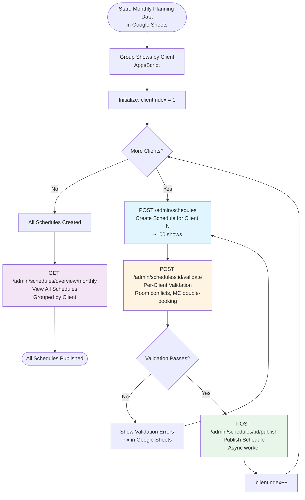
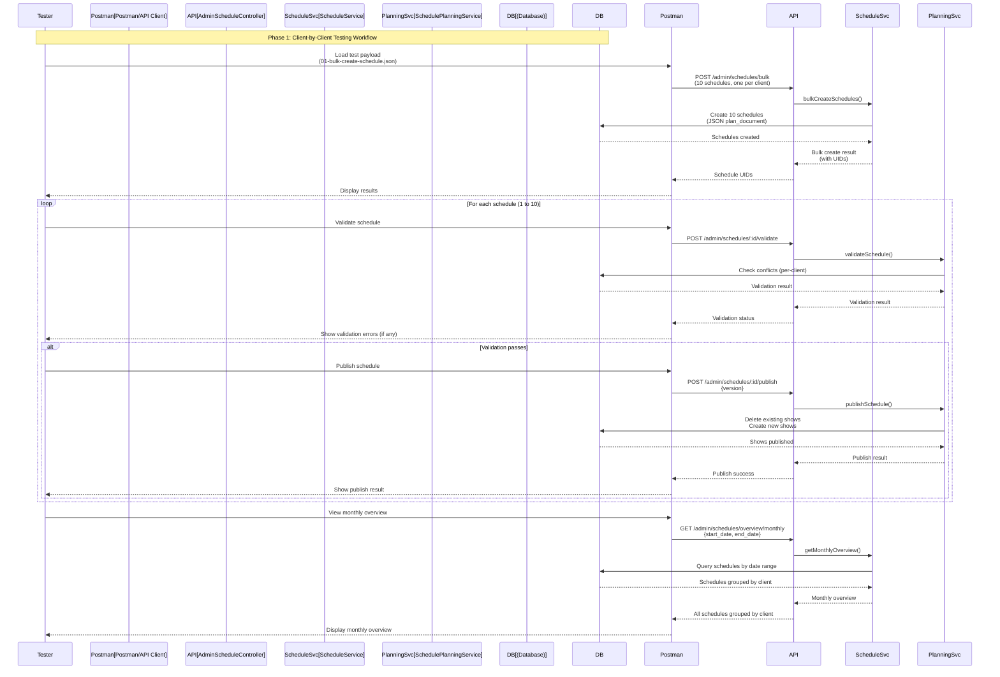

# Schedule Planning Test Payloads & Testing Guide

This directory contains test payloads for simulating the schedule planning flow when operators send schedule plans from Google Sheets to the API endpoint.

## Upload Strategy: Client-by-Client (Phase 1)

**Phase 1 Approach**: Create one schedule per client (~100 shows each)

**Rationale**:
- Typical monthly planning has ~10 clients with ~100 shows per client
- Each client schedule fits comfortably within payload limits
- No chunking logic needed (simpler implementation and testing)
- Better error isolation (one client failure doesn't affect others)
- Simpler Google Sheets integration

## Overview

The testing flow validates the **client-by-client upload strategy**:
1. **Group by Client**: Group shows by client in Google Sheets
2. **Create Schedules**: Create one schedule per client (via single or bulk endpoint)
3. **Validate Schedules**: Validate each schedule independently (per-client validation)
4. **Publish Schedules**: Publish schedules (can be queued for async processing)
5. **Monthly Overview**: View all schedules together via monthly overview endpoint

**Phase 2 Enhancements**:
- Chunked upload for large clients (>200 shows per client) or multi-client monthly overviews (500+ shows from 10+ clients)

## Google Sheets Integration

For complete Google Sheets integration workflow, API call sequence, error handling, and AppsScript integration details, see **[Google Sheets Workflow](./GOOGLE_SHEETS_WORKFLOW.md)**.

## Generated Files

- **`01-create-schedule.json`** - Payload for creating a single schedule (POST `/admin/schedules`) - *Single client, one schedule*
- **`01-bulk-create-schedule.json`** - Payload for bulk creating schedules (POST `/admin/schedules/bulk`)
  - **Phase 1 (Recommended)**: Contains multiple schedules (one per client)
  - Each schedule has ~100 shows from a single client
  - Simulates typical monthly planning workflow
- **`02-update-schedule.json`** - Payload for updating a schedule (includes full plan document)
- **`03-publish-schedule.json`** - Payload for publishing a schedule (version only)
- **`chunked/`** - Directory containing chunked payloads **[Phase 2 Only]**
  - Files: `chunk-001.json`, `chunk-002.json`, etc.
  - For testing chunked upload strategy with large clients (>200 shows per client) or multi-client monthly overviews (500+ shows from 10+ clients)
  - Each chunk contains shows to append via `POST /admin/schedules/:id/shows/append`

## Prerequisites

1. **Database Setup**: Ensure the database is seeded with fixtures
   ```bash
   cd apps/erify_api
   pnpm run db:seed
   ```

2. **API Server**: Start the API server
   ```bash
   pnpm run dev
   ```

3. **Generate Payloads** (if needed):
   ```bash
   cd apps/erify_api
   
   # Phase 1 (Recommended): Multi-client monthly overview
   # Creates one schedule per client with ~100 shows each
   pnpm run test:generate -- --shows=1000 --clients=10
   # Generates: 01-bulk-create-schedule.json with 10 schedules (100 shows each)
   
   # Phase 1: Single client (for testing)
   pnpm run test:generate -- --shows=100
   # Generates: 01-create-schedule.json with 1 schedule (100 shows)
   
   # Phase 2 Only: Chunked upload for large clients (>200 shows per client) or multi-client monthly overviews (500+ shows from 10+ clients)
   pnpm run test:generate -- --shows=500 --clients=1 --chunk-size=50
   # Generates: chunked/chunk-001.json, chunk-002.json, etc. (50 shows each)
   ```
   
   **Parameters:**
   - `--shows=N`: Total number of shows to generate (default: 50)
   - `--clients=N`: Number of clients for monthly overview (default: 1)
   - `--chunk-size=N`: Shows per chunk for chunked uploads (default: 50) **[Phase 2 Only]**
   
   **Recommendations**:
   - **Phase 1**: Use `--clients=10` to simulate realistic monthly planning (one schedule per client)
   - **Phase 1 Limit**: Each client should have ≤200 shows to avoid payload size issues
   - **Phase 2**: Use chunking only for clients with >200 shows per month

4. **API Base URL**: Set your API base URL (default: `http://localhost:3000`)

5. **Authentication**: You may need to authenticate. Check your API documentation for authentication requirements.

## Test Data

- **Total Shows**: Configurable (default: 50, can be increased with `--shows=N`)
- **Clients**: 50 clients (shows distributed evenly across clients)
- **Date Range**: Current month (first day to last day)
- **Show Types**: BAU (70%), Campaign (15%), Other (15%)
- **Show Statuses**: Draft (60%), Confirmed (20%), Live (20%)
- **Show Standards**: Standard (70%), Premium (30%)
- **MCs per Show**: 1-3 MCs
- **Platforms per Show**: 1-2 platforms
- **Show Duration**: 1-4 hours

## Diagrams

### Client-by-Client Upload Flowchart (Phase 1)



### Testing Workflow Sequence Diagram



## Automated Scripts Workflow

For convenience, automated scripts are available to simulate the complete Google Sheets workflow:

### Quick Start (Automated)

```bash
# Step 1: Create schedules (one per client)
pnpm run test:schedule:create

# Step 2: Upload schedule plan documents
pnpm run test:schedule:upload

# Step 3: Validate all schedules
pnpm run test:schedule:validate

# Step 4: Publish validated schedules
pnpm run test:schedule:publish
```

### Available Scripts

All scripts are located in `test-payloads/scripts/schedule-planning-flow/` and follow a numbered sequence:

1. **`test:schedule:create`** (`1.create-schedules.ts`) - Creates schedules for the current month (one per client)
   - Uses bulk create endpoint
   - Generates schedules with empty plan documents

2. **`test:schedule:upload`** (`2.upload-schedule-plan-documents.ts`) - Uploads plan documents to existing schedules
   - Updates each schedule with its plan document
   - Simulates Google Sheets data upload

3. **`test:schedule:validate`** (`3.validate-schedules.ts`) - Validates all draft schedules for the current month
   - Calls validation endpoint for each schedule
   - Reports validation results and errors
   - Filters to only draft schedules (skips already published)

4. **`test:schedule:publish`** (`4.publish-schedules.ts`) - Publishes all validated draft schedules
   - Publishes each draft schedule using its current version
   - Reports publishing results and errors
   - Exits with error code if any publish fails

### Custom API URL

All scripts support a custom API URL via command line argument:

```bash
pnpm run test:schedule:validate -- --api-url=http://localhost:3000
pnpm run test:schedule:publish -- --api-url=http://localhost:3000
```

### Script Workflow Details

The scripts follow this workflow:

1. **Fetch schedules** for the current month (first day to last day)
2. **Filter schedules** by status (draft for validation/publish)
3. **Process each schedule** sequentially with small delays
4. **Report results** with summary statistics

**Note**: The scripts assume schedules have been created and plan documents uploaded before running validation and publish steps.

## Test Flow

### Phase 1: Client-by-Client Upload (Recommended)

This is the primary testing workflow for Phase 1. You can use either the automated scripts (above) or manual API calls (below).

### Step 1: Create Schedules (One Per Client)

You can create schedules using either:
- **Single schedule**: `POST /admin/schedules` (for one client only)
- **Bulk create**: `POST /admin/schedules/bulk` ✅ **Recommended** (for multiple clients)

#### Option A: Bulk Create (Recommended for Phase 1)

**Endpoint**: `POST /admin/schedules/bulk`

**Why Bulk Create?**
- Creates multiple schedules in one request (one per client)
- Simulates realistic monthly planning workflow
- Better error handling with partial success reporting

**Payload**: Use `01-bulk-create-schedule.json`

**Request**:
```bash
curl -X POST http://localhost:3000/admin/schedules/bulk \
  -H "Content-Type: application/json" \
  -d @test-payloads/01-bulk-create-schedule.json
```

**Response Structure**:
```json
{
  "success_count": 8,
  "error_count": 2,
  "results": [
    {
      "index": 0,
      "success": true,
      "schedule": {
        "id": "schedule_001",
        "client_id": "client_001",
        "name": "Client A - November 2025",
        "status": "draft",
        "version": 1,
        "plan_document": {
          "shows": [...], // 100 shows
          "metadata": {...}
        }
      }
    },
    {
      "index": 1,
      "success": false,
      "error_code": "CONFLICT",
      "error_message": "Schedule already exists for this date range"
    },
    // ... more results
  ]
}
```

#### Option B: Single Schedule

**Endpoint**: `POST /admin/schedules`

**Use Case**: Testing with one client only

**Payload**: Use `01-create-schedule.json`

**Request**:
```bash
curl -X POST http://localhost:3000/admin/schedules \
  -H "Content-Type: application/json" \
  -d @test-payloads/01-create-schedule.json
```

### Step 2: View Monthly Overview (All Schedules)

**Endpoint**: `GET /admin/schedules/overview/monthly`

**Purpose**: View all client schedules together for a given month

**Request**:
```bash
curl -X GET "http://localhost:3000/admin/schedules/overview/monthly?start_date=2025-11-01&end_date=2025-11-30" \
  -H "Content-Type: application/json"
```

**Response Structure**:
```json
{
  "schedules": [
    {
      "client_id": "client_001",
      "client_name": "Client A",
      "schedules": [
        {
          "id": "schedule_001",
          "name": "Client A - November 2025",
          "status": "draft",
          "version": 1,
          "show_count": 100
        }
      ]
    },
    {
      "client_id": "client_002",
      "client_name": "Client B",
      "schedules": [
        {
          "id": "schedule_002",
          "name": "Client B - November 2025",
          "status": "draft",
          "version": 1,
          "show_count": 95
        }
      ]
    }
    // ... more clients
  ]
}
```

### Step 3: Validate Schedules (Per Client)

**Expected Response** (bulk from Step 1):
- Status: `201 Created`
- Response includes:
  - `total`: Total number of schedules in request
  - `successful`: Number of successfully created schedules
  - `failed`: Number of failed schedules
  - `results`: Array of results for each schedule
    - `index`: Index in the original array
    - `schedule_id`: Schedule UID (if successful)
    - `success`: Boolean indicating success
    - `error`: Error message (if failed)
  - `successful_schedules`: Array of created schedule objects

**Expected Response** (single):
- Status: `201 Created`
- Response includes:
  - `id`: Schedule UID
  - `name`: Schedule name
  - `status`: `"draft"`
  - `version`: `1`
  - `plan_document`: Contains shows

**Save the schedule ID** from the response for subsequent steps:

For **single create**:
```bash
SCHEDULE_ID="<id_from_response>"
```

For **bulk create**, extract from the response:
```bash
# From successful_schedules array
SCHEDULE_ID="<id_from_successful_schedules[0].id>"

# Or from results array
SCHEDULE_ID="<schedule_id_from_results[0].schedule_id>"
```

**Validation**:
- ✅ Schedule is created with status `draft`
- ✅ Plan document contains the expected number of shows
- ✅ All shows have valid UIDs for clients, rooms, types, statuses, standards
- ✅ Shows are distributed across all 50 clients

### Step 2: Validate Schedule (Optional but Recommended)

**Endpoint**: `POST /admin/schedules/:id/validate`

**Request**:
```bash
curl -X POST http://localhost:3000/admin/schedules/${SCHEDULE_ID}/validate \
  -H "Content-Type: application/json"
```

**Expected Response**:
- Status: `200 OK`
- Response includes:
  - `isValid`: `true` or `false`
  - `errors`: Array of validation errors (if any)
    - `type`: Error type (e.g., `room_conflict`, `mc_double_booking`)
    - `message`: Error message
    - `showIndex` or `showTempId`: Which show has the error

**Validation**:
- ✅ If `isValid: true`, proceed to publish
- ✅ If `isValid: false`, review errors and fix issues in the plan document
- ✅ Common errors to check:
  - Room conflicts (same room, overlapping times)
  - MC double-booking (same MC, overlapping times)
  - Invalid references (non-existent UIDs)
  - Time range issues (show outside schedule date range)

**Note**: If validation fails, you'll need to update the schedule with corrected data.

### Step 3: Update Schedule (If Needed)

**Endpoint**: `PATCH /admin/schedules/:id`

**Payload**: Use `02-update-schedule.json` (update the `version` field to match the current schedule version)

**Important**: Before updating, get the current schedule version:
```bash
curl -X GET http://localhost:3000/admin/schedules/${SCHEDULE_ID}
```

Update the `version` field in `02-update-schedule.json` to match the current schedule version.

**Request**:
```bash
curl -X PATCH http://localhost:3000/admin/schedules/${SCHEDULE_ID} \
  -H "Content-Type: application/json" \
  -d @test-payloads/02-update-schedule.json
```

**Expected Response**:
- Status: `200 OK`
- Response includes:
  - `version`: Incremented version number
  - `plan_document`: Updated plan document

**Validation**:
- ✅ Schedule version is incremented
- ✅ Snapshot is automatically created (check `/admin/schedules/:id/snapshots`)
- ✅ Plan document is updated

**Note**: 
- If you're updating to fix validation errors, ensure the plan document in the payload has the corrections
- The `version` field is required for optimistic locking

### Step 4: Publish Schedule

**Endpoint**: `POST /admin/schedules/:id/publish`

**Payload**: Use `03-publish-schedule.json` (update the `version` field to match the current schedule version)

**Important**: Before publishing, get the current schedule version:
```bash
curl -X GET http://localhost:3000/admin/schedules/${SCHEDULE_ID}
```

Update the `version` field in `03-publish-schedule.json` to match the current schedule version.

**Request**:
```bash
curl -X POST http://localhost:3000/admin/schedules/${SCHEDULE_ID}/publish \
  -H "Content-Type: application/json" \
  -d @test-payloads/03-publish-schedule.json
```

**Expected Response**:
- Status: `200 OK`
- Response includes:
  - `status`: `"published"`
  - `published_at`: Timestamp
  - `version`: Incremented version

**Validation**:
- ✅ Schedule status is `published`
- ✅ `published_at` is set
- ✅ Version is incremented

### Step 5: Verify Published Shows

**Endpoint**: `GET /admin/shows`

**Query Parameters**:
- `start_date`: Start date of the schedule
- `end_date`: End date of the schedule
- `schedule_id`: Schedule UID (optional, to filter by schedule)

**Request**:
```bash
curl -X GET "http://localhost:3000/admin/shows?start_date=2025-11-01T00:00:00Z&end_date=2025-11-30T23:59:59Z"
```

**Expected Response**:
- Status: `200 OK`
- Response includes paginated shows

**Validation**:
- ✅ Expected number of shows are created
- ✅ All shows have `schedule_id` set to the schedule UID
- ✅ Shows are distributed across all clients
- ✅ Shows have correct MCs assigned (check `show_mcs` table)
- ✅ Shows have correct platforms assigned (check `show_platforms` table)
- ✅ Shows are within the schedule date range
- ✅ No duplicate shows (same room, overlapping times)

### Step 6: Test Delete and Recreate (Re-publish)

This step validates that publishing again will delete existing shows and create new ones.

**Prepare a Modified Schedule**:
1. Get the current schedule:
   ```bash
   curl -X GET http://localhost:3000/admin/schedules/${SCHEDULE_ID}
   ```

2. Modify the plan document (e.g., change some show times, add/remove shows)

3. Update the schedule with the modified plan document:
   ```bash
   curl -X PATCH http://localhost:3000/admin/schedules/${SCHEDULE_ID} \
     -H "Content-Type: application/json" \
     -d @test-payloads/02-update-schedule.json
   ```

4. Publish again:
   ```bash
   curl -X POST http://localhost:3000/admin/schedules/${SCHEDULE_ID}/publish \
     -H "Content-Type: application/json" \
     -d @test-payloads/03-publish-schedule.json
   ```

**Validation**:
- ✅ Old shows are deleted (check count before and after)
- ✅ New shows are created from the updated plan document
- ✅ Total show count matches the plan document
- ✅ No orphaned shows from the previous publish

## Payload Structure

### Bulk Create Schedule Payload

For `POST /admin/schedules/bulk`, the payload should be wrapped in a `schedules` array:

```json
{
  "schedules": [
    {
      "name": "Monthly Schedule - 2025-11-01 to 2025-11-30",
      "start_date": "2025-11-01T00:00:00.000Z",
      "end_date": "2025-11-30T23:59:59.000Z",
      "status": "draft",
      "plan_document": {
        "metadata": {
          "lastEditedBy": "user_00000000000000000001",
          "lastEditedAt": "2025-11-04T02:59:48.760Z",
          "totalShows": 50,
          "clientName": "Nike",
          "dateRange": {
            "start": "2025-11-01T00:00:00.000Z",
            "end": "2025-11-30T23:59:59.000Z"
          }
        },
        "shows": [ ... ]
      },
      "version": 1,
      "client_id": "client_00000000000000000001",
      "created_by": "user_00000000000000000001"
    }
  ]
}
```

You can include multiple schedules in the array (up to 1000).

### Single Create Schedule Payload

```json
{
  "name": "Monthly Schedule - 2025-11-01 to 2025-11-30",
  "start_date": "2025-11-01T00:00:00.000Z",
  "end_date": "2025-11-30T23:59:59.000Z",
  "status": "draft",
  "plan_document": {
    "metadata": {
      "lastEditedBy": "user_00000000000000000001",
      "lastEditedAt": "2025-11-04T02:59:48.760Z",
      "totalShows": 500,
      "clientName": "Nike",
      "dateRange": {
        "start": "2025-11-01T00:00:00.000Z",
        "end": "2025-11-30T23:59:59.000Z"
      }
    },
    "shows": [
      {
        "tempId": "temp_...",
        "name": "Nike Show 1",
        "startTime": "2025-11-01T10:00:00.000Z",
        "endTime": "2025-11-01T13:00:00.000Z",
        "clientUid": "client_00000000000000000001",
        "studioRoomUid": "srm_00000000000000000001",
        "showTypeUid": "sht_00000000000000000001",
        "showStatusUid": "shst_00000000000000000001",
        "showStandardUid": "shsd_00000000000000000001",
        "mcs": [
          {
            "mcUid": "mc_00000000000000000001",
            "note": "Optional note"
          }
        ],
        "platforms": [
          {
            "platformUid": "plt_00000000000000000001",
            "liveStreamLink": "https://shopee.com/live/...",
            "platformShowId": "platform_show_..."
          }
        ],
        "metadata": {}
      }
    ]
  },
  "version": 1,
  "client_id": "client_00000000000000000001",
  "created_by": "user_00000000000000000001"
}
```

### Update Schedule Payload

```json
{
  "plan_document": {
    "metadata": { ... },
    "shows": [ ... ]
  },
  "version": 1
}
```

**Important**: Update the `version` field to match the current schedule version before sending.

### Publish Schedule Payload

```json
{
  "version": 1
}
```

**Important**: Update the `version` field to match the current schedule version before sending.

## Using Postman

If you prefer using Postman, import the collection from:
`docs/erify-api.postman_collection.json`

Then use the following requests:
1. **Create Schedule**: `POST /admin/schedules`
   - Body: Use `01-create-schedule.json`

2. **Get Schedule**: `GET /admin/schedules/:id`
   - Save the `id` and `version` to environment variables

3. **Validate Schedule**: `POST /admin/schedules/:id/validate`

4. **Update Schedule**: `PATCH /admin/schedules/:id`
   - Body: Use `02-update-schedule.json`
   - Update `version` to `{{schedule_version}}`

5. **Publish Schedule**: `POST /admin/schedules/:id/publish`
   - Body: Use `03-publish-schedule.json`
   - Update `version` to `{{schedule_version}}`

6. **Get Shows**: `GET /admin/shows`
   - Query: `start_date`, `end_date`, `schedule_id`

## Database Verification

After publishing, verify the database directly:

### Check Shows Count
```sql
SELECT COUNT(*) FROM shows 
WHERE schedule_id = (SELECT id FROM schedules WHERE uid = '<SCHEDULE_UID>')
  AND deleted_at IS NULL;
```
Expected: Number of shows in your plan document

### Check Shows by Client
```sql
SELECT c.name, COUNT(s.id) as show_count
FROM shows s
JOIN clients c ON s.client_id = c.id
WHERE s.schedule_id = (SELECT id FROM schedules WHERE uid = '<SCHEDULE_UID>')
  AND s.deleted_at IS NULL
GROUP BY c.name
ORDER BY show_count DESC;
```

### Check MC Assignments
```sql
SELECT COUNT(*) FROM show_mcs sm
JOIN shows s ON sm.show_id = s.id
WHERE s.schedule_id = (SELECT id FROM schedules WHERE uid = '<SCHEDULE_UID>')
  AND s.deleted_at IS NULL;
```

### Check Platform Assignments
```sql
SELECT COUNT(*) FROM show_platforms sp
JOIN shows s ON sp.show_id = s.id
WHERE s.schedule_id = (SELECT id FROM schedules WHERE uid = '<SCHEDULE_UID>')
  AND s.deleted_at IS NULL;
```

### Verify No Room Conflicts
```sql
SELECT s1.id as show1_id, s1.name as show1_name, s1.start_time, s1.end_time,
       s2.id as show2_id, s2.name as show2_name, s2.start_time, s2.end_time,
       sr.name as room_name
FROM shows s1
JOIN shows s2 ON s1.studio_room_id = s2.studio_room_id
JOIN studio_rooms sr ON s1.studio_room_id = sr.id
WHERE s1.id < s2.id
  AND s1.schedule_id = (SELECT id FROM schedules WHERE uid = '<SCHEDULE_UID>')
  AND s2.schedule_id = (SELECT id FROM schedules WHERE uid = '<SCHEDULE_UID>')
  AND s1.deleted_at IS NULL
  AND s2.deleted_at IS NULL
  AND (
    (s1.start_time <= s2.start_time AND s1.end_time > s2.start_time) OR
    (s2.start_time <= s1.start_time AND s2.end_time > s1.start_time)
  );
```
Expected: 0 rows (no conflicts)

## Chunked Upload Strategy for Large Monthly Overviews

### Problem Statement

When planners export hundreds of shows from multiple clients in Google Sheets for monthly overview, the payload can become too large (500KB+) to process in a single request, leading to:
- HTTP 417 errors (Payload Too Large)
- Request timeouts
- Memory issues on the server
- Poor user experience

### Solution: Incremental Plan Document Updates

**Key Principle**: Create ONE schedule for the monthly overview (all clients), then upload shows incrementally in chunks.

**Workflow**:
1. **Create empty schedule**: `POST /admin/schedules` with empty `plan_document.shows`
2. **Upload chunks incrementally**: `POST /admin/schedules/:id/shows/append` to append shows
3. **Review complete schedule**: `GET /admin/schedules/:id` to see all shows (monthly overview)
4. **Validate**: `POST /admin/schedules/:id/validate` to check conflicts across all shows
5. **Publish**: `POST /admin/schedules/:id/publish` when ready

**Benefits**:
- ✅ Single schedule for monthly overview (all clients visible)
- ✅ Can review complete schedule before validation/publish
- ✅ Handles large datasets without payload size limits
- ✅ Better user experience with progress tracking
- ✅ Validation works across all clients (MC conflicts, room conflicts)

### API Endpoint: Append Shows

**New Endpoint**: `POST /admin/schedules/:id/shows/append` ⚠️ **NOT YET IMPLEMENTED**

**Status**: Design complete, implementation pending. See [SCHEDULE_UPLOAD_API_DESIGN.md](../docs/SCHEDULE_UPLOAD_API_DESIGN.md) for full specification.

**Request Format**:
```json
{
  "shows": [ /* array of shows to append */ ],
  "chunkIndex": 1,
  "version": 1
}
```

**Key Fields**:
- `shows`: Array of show items to append to the schedule
- `chunkIndex`: 1-based chunk number (must be sequential: 1, 2, 3, ...)
- `version`: Current schedule version for optimistic locking

**Response Format**:
```json
{
  "id": "schedule_xxx",
  "version": 2,
  "plan_document": {
    "metadata": {
      "totalShows": 150,
      "lastEditedAt": "2025-11-04T10:00:00Z",
      "uploadProgress": {
        "expectedChunks": 10,
        "receivedChunks": 1,
        "lastChunkIndex": 1,
        "isComplete": false
      }
    },
    "shows": [ /* all shows including appended ones */ ]
  }
}
```

**Error Responses**:
- `409 Conflict`: Sequential violation (chunk out of order) or version mismatch
- `400 Bad Request`: Upload already complete or invalid chunk index

See [SCHEDULE_UPLOAD_API_DESIGN.md](../docs/SCHEDULE_UPLOAD_API_DESIGN.md) for complete API specification and error handling.

### Google Sheets Integration Example

See complete client implementation in [SCHEDULE_UPLOAD_API_DESIGN.md](../docs/SCHEDULE_UPLOAD_API_DESIGN.md#client-implementation).

**Quick Example**:
```typescript
// Simplified workflow
async function uploadMonthlySchedule(shows: ShowPlanItem[]) {
  const CHUNK_SIZE = 50;
  const totalChunks = Math.ceil(shows.length / CHUNK_SIZE);
  
  // Step 1: Create empty schedule with uploadProgress
  const schedule = await api.post('/admin/schedules', {
    // ... schedule fields ...
    plan_document: {
      metadata: {
        // ... metadata ...
        uploadProgress: {
          expectedChunks: totalChunks,
          receivedChunks: 0
        }
      },
      shows: []
    }
  });
  
  let currentVersion = schedule.version;
  
  // Step 2: Upload chunks sequentially
  for (let chunkIndex = 1; chunkIndex <= totalChunks; chunkIndex++) {
    const start = (chunkIndex - 1) * CHUNK_SIZE;
    const chunk = shows.slice(start, start + CHUNK_SIZE);
    
    const updated = await api.post(`/admin/schedules/${schedule.id}/shows/append`, {
      shows: chunk,
      chunkIndex: chunkIndex,
      version: currentVersion
    });
    currentVersion = updated.version;
  }
  
  // Step 3: Validate and Publish
  await api.post(`/admin/schedules/${schedule.id}/validate`);
  await api.post(`/admin/schedules/${schedule.id}/publish`, {
    version: currentVersion
  });
}
```

### Testing with Chunked Payloads

⚠️ **Note**: The `/shows/append` endpoint is not yet implemented. This section describes the intended testing workflow once implementation is complete.

**Generate chunked payloads**:
```bash
# Generate monthly overview with chunked payloads
pnpm run test:generate -- --shows=500 --clients=10 --chunk-size=50
```

**Testing Workflow** (once endpoint is implemented):
1. Create schedule with empty shows and `uploadProgress` metadata
2. Append chunks sequentially using `POST /admin/schedules/:id/shows/append`
3. Review complete schedule: `GET /admin/schedules/:id`
4. Validate: `POST /admin/schedules/:id/validate`
5. Publish: `POST /admin/schedules/:id/publish`

**Generated Files**:
- `01-create-schedule.json`: Create empty schedule with `uploadProgress` metadata
- `chunked/chunk-001.json`, `chunk-002.json`, etc.: Individual chunks with `chunkIndex` field

**Example**:
```bash
# Step 1: Create empty schedule
SCHEDULE_ID=$(curl -X POST http://localhost:3000/admin/schedules \
  -H "Content-Type: application/json" \
  -d @test-payloads/01-create-schedule.json | jq -r '.id')

# Step 2: Append chunks sequentially
for chunk in test-payloads/chunked/chunk-*.json; do
  curl -X POST "http://localhost:3000/admin/schedules/${SCHEDULE_ID}/shows/append" \
    -H "Content-Type: application/json" \
    -d @$chunk
done

# Step 3: Review complete schedule
curl -X GET "http://localhost:3000/admin/schedules/${SCHEDULE_ID}"

# Step 4: Validate
curl -X POST "http://localhost:3000/admin/schedules/${SCHEDULE_ID}/validate"

# Step 5: Publish
curl -X POST "http://localhost:3000/admin/schedules/${SCHEDULE_ID}/publish" \
  -H "Content-Type: application/json" \
  -d '{"version": <current_version>}'
```

### Best Practices

1. **Chunk Size**: Keep chunks at 50-100 shows for optimal performance
2. **Sequential Upload**: Must upload chunks in order (1, 2, 3, ...) - server enforces this
3. **Error Handling**: Implement retry logic for failed chunks (check error response for guidance)
4. **Progress Tracking**: Use `uploadProgress` metadata to show progress to users
5. **Version Management**: Always use the latest version from the previous response
6. **Declare Total Upfront**: Set `expectedChunks` when creating the schedule

For complete implementation guide, see [SCHEDULE_UPLOAD_API_DESIGN.md](../docs/SCHEDULE_UPLOAD_API_DESIGN.md).

### Recommended Payload Sizes

- **Small**: 50 shows (~40KB) - Safe for testing, can use single request
- **Medium**: 100-200 shows (~80-160KB) - May work depending on server config
- **Large**: 500+ shows (~600KB+) - **Use chunked upload strategy**
- **Very Large**: 1000+ shows (~1MB+) - **Must use chunked upload strategy**

## Troubleshooting

### Issue: HTTP 417 Error (Payload Too Large)

**Symptom**: Getting HTTP 417 error when creating or updating schedule

**Cause**: The payload is too large for the server to handle

**Solution**:
1. **Use chunked upload strategy**: Follow the workflow above
2. **Generate chunked payloads**: Use multi-client mode with chunking
   ```bash
   # Generate monthly overview with chunked payloads
   pnpm run test:generate -- --shows=500 --clients=10 --chunk-size=50
   ```
3. **Use chunked payloads**: Upload shows from `chunked/` directory sequentially using `POST /admin/schedules/:id/shows/append`
4. **Increase server limits** (quick fix, not recommended for production): Configure NestJS/Express to accept larger payloads
   ```typescript
   // main.ts
   app.use(json({ limit: '50mb' }));
   app.use(urlencoded({ extended: true, limit: '50mb' }));
   ```

### Issue: Validation Fails with Room Conflicts

**Solution**: 
- Check if there are existing shows in the database that conflict
- The validation should catch internal conflicts in the plan document
- If conflicts are with existing shows, you may need to adjust the schedule date range or room assignments

### Issue: Publish Fails with Version Mismatch

**Solution**:
- Get the current schedule version: `GET /admin/schedules/:id`
- Update the `version` field in the publish payload to match

### Issue: Shows Not Created After Publish

**Solution**:
- Check the publish response for errors
- Verify the plan document structure is correct
- Check database logs for constraint violations
- Verify all UIDs in the plan document exist in the database

### Issue: Wrong Number of Shows Created

**Solution**:
- Verify the plan document has the expected number of shows
- Check if some shows were filtered out during validation
- Verify the date range is correct

## Performance Testing

For 50 shows, expected performance:
- **Create Schedule**: < 1 second
- **Validate Schedule**: < 5 seconds
- **Update Schedule**: < 2 seconds
- **Publish Schedule**: < 10 seconds

If performance is slower, consider:
- Database indexes on `schedule_id`, `start_time`, `end_time`
- Bulk insert optimization
- Transaction timeout settings

## Re-generating Payloads

### Single Client Scenario

```bash
# Default: 50 shows (recommended for testing)
pnpm run test:generate

# Custom number of shows
pnpm run test:generate -- --shows=100
pnpm run test:generate -- --shows=200
```

### Multi-Client Monthly Overview (Realistic Scenario)

```bash
# Generate monthly overview with multiple clients
pnpm run test:generate -- --shows=500 --clients=10

# With custom chunk size
pnpm run test:generate -- --shows=1000 --clients=20 --chunk-size=50

# Large monthly overview (realistic production scenario)
pnpm run test:generate -- --shows=2000 --clients=50 --chunk-size=50
```

**Parameters:**
- `--shows=N`: Total number of shows across all clients
- `--clients=N`: Number of clients (shows distributed evenly)
- `--chunk-size=N`: Shows per chunk for chunked uploads (default: 50)

**Output:**
- `01-bulk-create-schedule.json`: All schedules in one payload (may be too large)
- `chunked/` directory: Individual chunked payloads for sequential upload

### Modifying Script Behavior

To modify other parameters (date range, show distribution, etc.), edit `test-payloads/scripts/generate-schedule-payload.ts`:
- Modify date range calculation
- Adjust show distribution across clients
- Change show characteristics (duration, types, etc.)
- Modify chunking logic

## Next Steps

After successful testing:
1. Test with different show counts (100, 1000, 5000)
2. Test concurrent publishes
3. Test error scenarios (invalid UIDs, missing references)
4. Test snapshot restoration
5. Test duplicate schedule functionality

## Notes

- The generated payloads use fixture UIDs from `prisma/fixtures.ts`
- All dates are in ISO 8601 format
- The schedule uses the current month as the date range
- Shows are distributed across all 50 clients
- Each show has 1-3 MCs and 1-2 platforms assigned
- Show durations are 1-4 hours
- All shows have valid UIDs for all references
- Shows are sorted by start time
