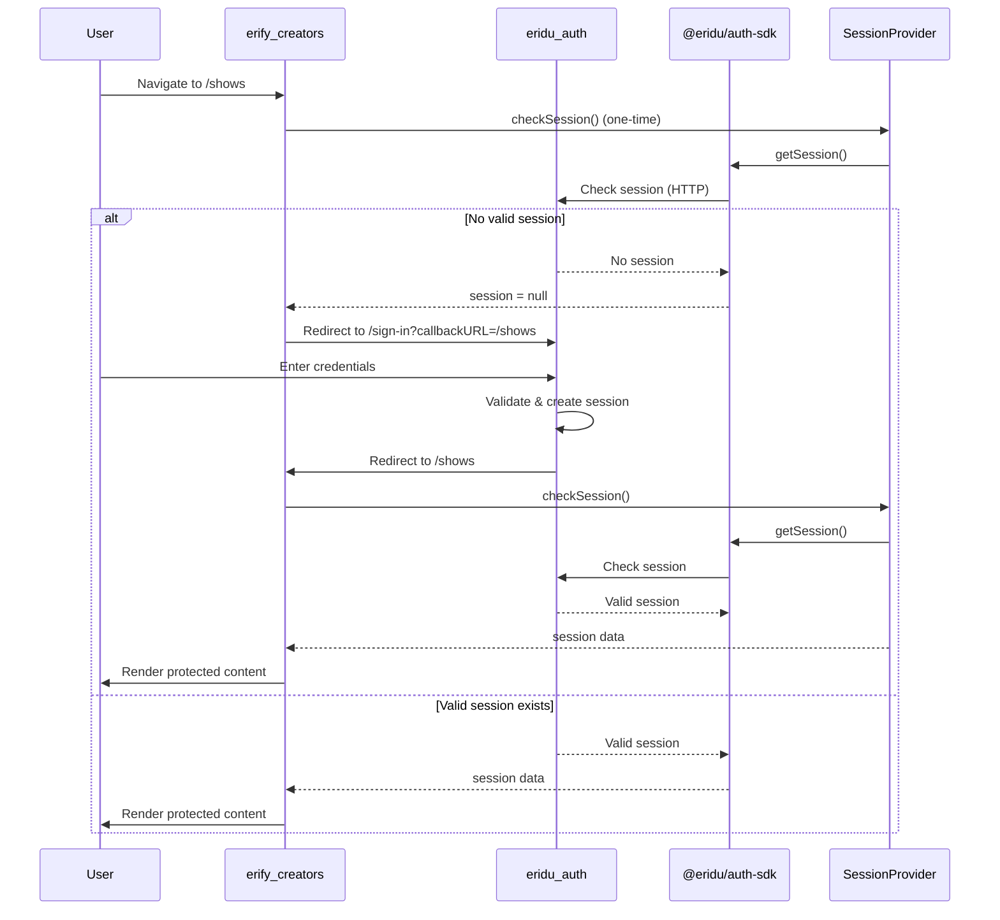

# Erify Creators

A modern React application for managing shows, built with TanStack Router, TypeScript, and Vite.

**Current Status**: Phase 1 ✅ - Content creator UI for viewing and managing shows with advanced table features

## 🚀 Getting Started

### Prerequisites

- Node.js 22+
- pnpm (recommended) or npm/yarn
- `erify_api` service running (for API endpoints)
- `eridu_auth` service running (for authentication)

### Installation

```bash
# Install dependencies
pnpm install

# Start development server (with API/Auth services running)
pnpm dev

# Build for production
pnpm build

# Preview production build
pnpm preview

# Lint code
pnpm lint

# Format code
pnpm format
```

### Environment Setup

Create a `.env` file (copy from `.env.example`):

```env
# Auth service URL (used for login/session validation)
VITE_AUTH_URL=http://localhost:5173

# API service URL (for backend API calls)
VITE_API_URL=http://localhost:3000
```

**Note**: In development, Vite dev server handles proxying to backend services.

## � Documentation for AI Agents

When working on erify_creators, refer to these guides:

| Document                                                      | Use When                                                                  |
| ------------------------------------------------------------- | ------------------------------------------------------------------------- |
| This README                                                   | Understanding project structure, architecture, testing, and setup         |
| [Copilot Instructions](../../.github/copilot-instructions.md) | Understanding monorepo patterns, conventions, and cross-app communication |
| [erify_api Docs](../erify_api/docs/)                          | Working on API integration, understanding backend features                |
| [Auth SDK Docs](../../packages/auth-sdk/README.md)            | Implementing authentication flows, session management                     |
| [API Types Docs](../../packages/api-types/README.md)          | Understanding shared schemas and types                                    |
| [UI Library](../../packages/ui/README.md)                     | Building UI components with shadcn/ui                                     |
| [i18n Package](../../packages/i18n/README.md)                 | Adding new translations or language support                               |

**Key Reference**: The [Architecture Principles](#architecture-principles) section below explains the three-layer pattern used throughout this app.

## ✨ Current Features

### Implemented (Phase 1) ✅

- ✅ **Shows Management**: View list of shows assigned to authenticated user
- ✅ **Show Details**: View detailed information for individual shows
- ✅ **Advanced Table**: Pagination, sorting, filtering with URL state persistence
- ✅ **Authentication**: JWT-based session management via `@eridu/auth-sdk`
- ✅ **Internationalization**: Multi-language support (English, Traditional Chinese, Thai)
- ✅ **Offline Support**: IndexedDB persistence for offline capability
- ✅ **Error Handling**: Global error boundary with recovery options
- ✅ **Responsive Design**: Mobile-friendly UI with sidebar collapse
- ✅ **Comprehensive Testing**: Unit and component tests with good coverage

### Planned Features (Phase 2+)

- ⏳ **Show Creation**: Create new shows as a creator
- ⏳ **Show Editing**: Edit show details and schedule information
- ⏳ **Schedule Management**: View and manage show schedules
- ⏳ **Team Collaboration**: Collaborate with other creators on shows
- ⏳ **Activity History**: Track changes and activity on shows
- ⏳ **Notifications**: Real-time notifications for show updates

## 📁 Project Structure

This project follows the **Bulletproof React** architecture pattern with feature-based organization and includes comprehensive testing, API integration, and offline support:
src/
├── app.tsx                    # Main app component with providers
├── components/                # Shared UI components
│   ├── __tests__/            # Component tests
│   ├── language-switcher.tsx
│   ├── route-error.tsx       # Global error handling component
│   └── route-pending.tsx     # Route loading component
├── config/                   # Application configuration
│   └── sidebar-config.tsx    # Sidebar navigation configuration
├── features/                 # Feature modules (business logic)
│   └── shows/               # Shows feature
│       ├── api/             # Feature-specific API hooks
│       │   ├── index.ts
│       │   ├── use-show.ts  # Individual show fetching
│       │   └── use-shows.ts # Shows list fetching
│       ├── components/      # Feature-specific reusable components
│       │   ├── __tests__/   # Component tests
│       │   ├── columns.tsx  # Table column definitions
│       │   ├── show-detail.tsx
│       │   ├── show-list.tsx
│       │   ├── shows-table-pagination.tsx
│       │   ├── shows-table-toolbar.tsx
│       │   └── shows-table.tsx
│       └── types.ts         # Feature-specific types
├── i18n/                    # Internationalization
│   ├── messages/            # Translation files (en.json, zh-TW.json, th.json)
│   ├── index.ts             # i18n exports
│   ├── utils.ts             # i18n utility functions
│   └── use-language.ts      # React hook for language management
├── layouts/                 # Layout components
│   ├── __tests__/           # Layout tests
│   ├── sidebar-layout.tsx
│   └── sidebar-layout-header.tsx
├── lib/                     # Shared utilities and helpers
│   ├── api/                 # API client and utilities
│   │   ├── client.ts        # Axios client with auth interceptors
│   │   ├── index.ts
│   │   ├── persister.ts     # IndexedDB persister for offline support
│   │   ├── query-client.ts  # React Query client configuration
│   │   ├── query-keys.ts    # Query key factory functions
│   │   └── token-store.ts   # JWT token caching
│   ├── auth.ts              # Authentication client
│   ├── hooks/               # Shared React hooks
│   │   ├── index.ts
│   │   └── use-table-url-state.ts # URL state synchronization for tables
│   └── session-provider.tsx # Authentication session provider
├── pages/                   # Page-level components (orchestration)
│   ├── __tests__/           # Page tests
│   ├── not-found-page.tsx   # 404 page
│   └── shows/               # Shows pages
│       ├── __tests__/       # Page tests
│       ├── show-detail-page.tsx
│       └── shows-list-page.tsx
├── paraglide/               # Generated i18n files (auto-generated)
│   ├── messages/            # Compiled translation files
│   ├── messages.js
│   ├── registry.js
│   ├── runtime.js
│   └── server.js
├── router.tsx               # TanStack Router configuration
├── routes/                  # TanStack Router routes (thin routing layer)
│   ├── __root.tsx          # Root route with layout
│   ├── $.tsx               # Catch-all route for 404s
│   ├── index.tsx           # Root redirect to /shows
│   └── shows/              # Shows routes
│       ├── $showId.tsx     # Individual show route
│       └── index.tsx       # Shows list route
├── routeTree.gen.ts        # Auto-generated route tree
├── test/                   # Test utilities and setup
│   ├── setup.ts            # Test environment setup
│   └── test-utils.tsx      # Testing utilities
├── index.css               # Global styles
└── main.tsx                # Application entry point
```

### Architecture Principles

1. **Feature-Based Organization**: Business logic is organized by features in the `features/` directory
2. **Three-Layer Architecture**: Routes → Pages → Feature Components
   - **Routes** (`routes/`): Thin routing configuration, delegates to pages
   - **Pages** (`pages/`): Page-level orchestration (data fetching, error handling, page structure)
   - **Feature Components** (`features/*/components/`): Reusable presentation components
3. **Separation of Concerns**:
   - Routes handle routing configuration only
   - Pages handle page-level concerns (data fetching, error handling, page structure)
   - Features contain reusable business logic and presentation components
   - Components contain shared UI components (error boundaries, loading states, etc.)
   - Layouts provide shared UI structure
   - Lib contains reusable utilities and helpers (pure functions, hooks, etc.)

> 📖 The three-layer architecture pattern separates routing concerns (routes), page orchestration (pages), and reusable business logic (features) for better maintainability and testability.

## 🛣️ Routing

The application uses [TanStack Router](https://tanstack.com/router) for type-safe routing with a **thin routing layer** pattern.

### Route Architecture Pattern

Following the three-layer architecture:

```
Routes (Thin) → Pages (Orchestration) → Features (UI Logic)
```

- **Routes** (`routes/`): Only handle routing configuration, delegate to pages
- **Pages** (`pages/`): Orchestrate features, manage data fetching, handle page-level state
- **Features** (`features/`): Encapsulate UI components, business logic, API calls

### Current Routes

- `/` - Redirects to `/shows`
- `/shows` - Shows list page with advanced table features
- `/shows/:showId` - Show detail page
- `/*` (catch-all) - 404 Not Found page

### Route Generation

Routes are automatically generated using TanStack Router's file-based routing:

- **Route Tree**: Auto-generated in `src/routeTree.gen.ts`
- **Type Safety**: Full TypeScript support for route parameters and search params
- **File-based**: Routes are defined as files in `src/routes/` directory
- **Catch-all Route**: `src/routes/$.tsx` handles unmatched routes (404s)

## 🧭 Navigation & Layout

The application uses a sidebar-based navigation system with configurable menu items:

### Sidebar Configuration (`src/config/sidebar-config.tsx`)

The sidebar is configured through a structured configuration object:

```typescript
const sidebarConfig: AppSidebarProps = {
  header: {
    icon: Command,
    title: 'Erify',
    subtitle: 'Studio',
    url: '/',
  },
  navMain: [
    {
      title: m['sidebar.shows'](),
      url: '/shows',
      icon: Video,
      isActive: true,
      items: [
        // Dynamic show items can be populated here
      ],
    },
  ],
  navMainLabel: m['sidebar.activities'](),
  user: {
    name: 'User',
    email: 'user@example.com',
    avatar: '/avatars/default.jpg',
  },
};
```

### Layout Components

- **SidebarLayout** (`src/layouts/sidebar-layout.tsx`): Main layout with collapsible sidebar
- **SidebarLayoutHeader** (`src/layouts/sidebar-layout-header.tsx`): Header with navigation controls
- **AppSidebar**: Reusable sidebar component from `@eridu/ui`

### Navigation Features

- **Responsive Design**: Sidebar collapses on mobile devices
- **Internationalization**: All navigation labels use i18n translations
- **User Context**: Displays current user information
- **Dynamic Items**: Support for dynamically populated navigation items

### Adding New Routes

1. Create a new route file in `src/routes/` following TanStack Router conventions
2. Create a corresponding page component in `src/pages/`
3. The route tree is automatically generated by the TanStack Router plugin
4. Routes should be thin and delegate to page components

Example:

```tsx
// src/routes/shows/$showId.tsx
import { createFileRoute } from '@tanstack/react-router';
import { ShowDetailPage } from '@/pages/shows/show-detail-page';

export const Route = createFileRoute('/shows/$showId')({
  component: ShowDetailPageRoute,
});

function ShowDetailPageRoute() {
  const { showId } = Route.useParams();
  return <ShowDetailPage showId={showId} />;
}
```

```tsx
// src/pages/shows/show-detail-page.tsx
import { ShowDetailView } from '@/features/shows/components/show-detail';
import { useShow } from '@/features/shows/hooks/use-show';

export function ShowDetailPage({ showId }: { showId: string }) {
  const { data: show, isLoading } = useShow(showId);

  if (isLoading) return <LoadingPage />;
  if (!show) return <NotFound />;

  return <ShowDetailView show={show} />;
}
```

## 🎨 Features

### Error Handling

- **Route Error Component**: Global error handling via TanStack Router's `defaultErrorComponent` (`src/components/route-error.tsx`)
  - Catches all errors in route components, loaders, and during route rendering
  - Provides error recovery with "Try Again" and "Reload Page" options
- **Not Found Page**: Dedicated 404 page for unmatched routes (`src/pages/not-found-page.tsx`)

### Loading States

- **Loading Components**: Reusable loading spinners (`src/components/loading.tsx`)
- **Route Loading**: TanStack Router provides built-in pending states via `src/components/route-pending.tsx`
- **Component Loading**: Feature components handle their own loading states

### Type Safety

- Full TypeScript support with strict mode
- Type-safe routing with TanStack Router
- Feature-specific types in `features/*/types.ts`

## 🧩 Features Module Pattern

Features are self-contained modules that include:

- **Components**: Feature-specific UI components
- **Types**: TypeScript types and interfaces
- **API**: Feature-specific API hooks and data fetching logic
- **Hooks**: Custom React hooks (when needed)
- **Utils**: Feature-specific utilities (when needed)

Example feature structure:

```
features/shows/
├── api/             # API hooks and data fetching
│   ├── use-shows.ts
│   └── use-show.ts
├── components/
│   ├── show-list.tsx
│   └── show-detail.tsx
├── types.ts
└── index.ts         # Feature exports
```

## 🔌 API Integration

The application provides comprehensive API integration with advanced features:

### API Client (`src/lib/api/client.ts`)

- **Axios-based HTTP client** with automatic authentication
- **JWT token management** with caching and expiration handling
- **Automatic token refresh** on expiration with retry logic
- **Request/response interceptors** for authentication and error handling
- **Type-safe API requests** with TypeScript inference

### Data Fetching (`src/lib/api/`)

- **React Query integration** for caching, background updates, and error handling
- **Offline support** with IndexedDB persistence
- **Query key factory** for consistent cache invalidation
- **Type-safe query schemas** using Zod validation

### API Hooks Pattern

Feature-specific API hooks provide clean data fetching interfaces:

```typescript
// Example: Shows API hooks
export function useShows(params: ListShowsParams = {}) {
  return useQuery({
    queryKey: queryKeys.shows.list(params),
    queryFn: () => fetchShows(params),
  });
}
```

### Authentication & Security

- **JWT token caching** in memory with IndexedDB persistence
- **Token expiration detection** using `jose` library
- **Automatic session refresh** on API calls
- **Secure token storage** with automatic cleanup
- **CSRF protection** via SameSite cookies

### Offline Support

- **IndexedDB persistence** for query cache
- **Background synchronization** when online
- **Optimistic updates** for better UX
- **Cache invalidation** strategies

## 🧪 Testing

The application includes comprehensive testing coverage with multiple testing frameworks:

### Test Setup

- **Vitest** - Fast unit testing framework
- **React Testing Library** - Component testing utilities
- **Jest DOM** - Additional DOM matchers
- **jsdom** - Browser environment simulation
- **Test utilities** - Custom testing helpers and setup

### Test Structure

```
src/
├── components/__tests__/    # Component tests
├── layouts/__tests__/       # Layout component tests
├── pages/__tests__/         # Page component tests
├── features/**/__tests__/   # Feature-specific tests
└── test/
    ├── setup.ts             # Global test setup
    └── test-utils.tsx       # Testing utilities
```

### Test Categories

- **Unit Tests**: Individual function and hook testing
- **Component Tests**: React component testing with RTL
- **Integration Tests**: Component interaction testing
- **Page Tests**: Route and page-level testing

### Testing Commands

```bash
# Run all tests
pnpm test

# Run tests with UI
pnpm test:ui

# Run tests with coverage
pnpm test:coverage

# Run tests in watch mode
pnpm test --watch
```

### Test Configuration

- **Parallel execution** for faster test runs
- **Coverage reporting** with detailed metrics
- **Visual testing UI** via Vitest UI
- **Watch mode** for development workflow

## 📊 Advanced Table Features

The application includes sophisticated table functionality with URL state synchronization:

### URL State Management (`src/lib/hooks/use-table-url-state.ts`)

- **URL-driven table state** - All table state (pagination, sorting, filters) is synchronized with URL parameters
- **Browser navigation support** - Back/forward buttons work correctly with table state
- **Shareable URLs** - Table state can be shared via URL
- **Deep linking** - Direct links to specific table views

### Table Components

- **ShowsTable** (`src/features/shows/components/shows-table.tsx`): Main table component with TanStack Table integration
- **ShowsTableToolbar** (`src/features/shows/components/shows-table-toolbar.tsx`): Search, filter controls, and actions
- **ShowsTablePagination** (`src/features/shows/components/shows-table-pagination.tsx`): Pagination controls
- **Columns** (`src/features/shows/components/columns.tsx`): Column definitions and rendering

### Table Features

- **Pagination**: Server-side pagination with URL state
- **Sorting**: Multi-column sorting with URL persistence
- **Filtering**: Text search and date range filtering
- **Column visibility**: Show/hide columns dynamically
- **Responsive design**: Mobile-friendly table layout

### Data Flow

```
URL Parameters → useTableUrlState Hook → TanStack Table State → API Request → Table Display
```

The table state is automatically synchronized between URL parameters and table state, enabling:
- Bookmarkable search results
- Browser back/forward navigation
- Shareable filtered views
- Consistent state across page reloads

## 🌐 Internationalization (i18n)

This app uses [Paraglide JS](https://inlang.com/m/gerre34r/library-inlang-paraglideJs) for type-safe internationalization with:
- **Shared translations**: Common translations from `@eridu/i18n` package
- **App-specific translations**: Translations specific to this app

### Supported Languages

- `en` - English (default)
- `zh-TW` - Traditional Chinese
- `th` - Thai

### Usage

#### Basic Usage

```tsx
import * as m from '@/i18n';
import * as shared from '@eridu/i18n';

// Use app-specific translations
const appName = m.app_name(); // "Eridu Creators"

// Use shared translations
const welcome = shared.common_welcome(); // "Welcome", "歡迎", or "ยินดีต้อนรับ"
```

#### Using the React Hook (Recommended)

```tsx
import { useLanguage } from '@/i18n';

function MyComponent() {
  const { locale, setLocale, availableLocales } = useLanguage();

  return (
    <select value={locale} onChange={(e) => setLocale(e.target.value)}>
      {availableLocales.map(loc => (
        <option key={loc} value={loc}>{loc}</option>
      ))}
    </select>
  );
}
```

#### Language Switcher Component

A ready-to-use language switcher component is available:

```tsx
import { LanguageSwitcher } from '@/components/language-switcher';

function Header() {
  return (
    <header>
      <LanguageSwitcher />
    </header>
  );
}
```

### Language Detection & Storage

The app automatically detects the user's language preference from:
1. `localStorage.getItem('language')` (if previously set)
2. Browser language settings
3. Falls back to English (`en`)

Language preferences are stored in **localStorage** (not cookies or route-based) for persistence across page reloads. The preference is automatically synced across browser tabs using the `storage` event.

### Adding New Translations

1. Edit `src/i18n/messages/en.json` for English translations
2. Edit corresponding language files (e.g., `zh-TW.json`, `th.json`)
3. Translations are automatically compiled during build/dev

### Build Process Integration

Paraglide JS integrates with the build process:

- **Development**: Translations are compiled on-the-fly with file watching
- **Production**: Translations are compiled during the build process
- **Generated Files**: Compiled translations are placed in `src/paraglide/`
- **Type Safety**: Full TypeScript support for all translation keys

### Generated Files Structure

```
src/paraglide/
├── messages/            # Compiled translation modules
│   ├── app_name.js
│   ├── common_welcome.js
│   └── ... (one file per translation key)
├── messages.js          # Main messages export
├── registry.js          # Language registry
├── runtime.js           # Runtime utilities
└── server.js            # Server-side utilities
```

### Build Commands with i18n

```bash
# Development (watches translation files)
pnpm dev

# Production build (compiles all translations)
pnpm build
```

> 📖 For detailed i18n setup and adding new languages, see [`@eridu/i18n` README](../../packages/i18n/README.md)

## 🔐 Authentication

This app uses the `@eridu/auth-sdk` package for authentication, which integrates with the `eridu_auth` service (powered by Better Auth).

### Authentication Design

The app implements **route-level authentication** where all routes require authentication by default:

- **Root Route Protection**: The `__root.tsx` route checks for a valid session before rendering any content
- **Automatic Redirects**: Unauthenticated users are automatically redirected to the login page
- **Session Management**: User session is managed via Better Auth's React hooks
- **Return URL Handling**: After login, users are redirected back to their original destination

### Setup

#### 1. Environment Configuration

Create a `.env` file with the auth service URL:

```env
# Auth server URL - in dev mode, use Vite dev server which proxies to backend
# In production, set this to your actual auth server URL
VITE_AUTH_URL=http://localhost:5173
```

> **Note**: In development, the Vite dev server proxies auth requests to the backend. In production, set this to your actual auth service URL.

#### 2. Auth Client Initialization

The auth client is initialized in [`src/lib/auth.ts`](file:///Users/allenlin/Desktop/projects/eridu-services/apps/erify_creators/src/lib/auth.ts):

```typescript
import { createAuthClient } from '@eridu/auth-sdk/client/react';

export const authClient = createAuthClient({
  baseURL: import.meta.env.VITE_AUTH_URL,
});

export type Session = Awaited<ReturnType<typeof authClient.client.getSession>>['data'];
```

### Usage

#### Checking Authentication Status

The root route ([`__root.tsx`](file:///Users/allenlin/Desktop/projects/eridu-services/apps/erify_creators/src/routes/__root.tsx#L11-L43)) handles authentication for the entire app:

```typescript
import { authClient, type Session } from '@/lib/auth';

function RootLayout() {
  return (
    <SessionProvider>
      <AuthenticatedLayout />
    </SessionProvider>
  );
}

function AuthenticatedLayout() {
  const { session, isLoading, checkSession } = useSession();

  // Check session once on mount (no continuous polling)
  useEffect(() => {
    checkSession();
  }, [checkSession]);

  // Show loading state while checking session
  if (isLoading) {
    return (
      <div className="flex h-screen items-center justify-center">
        <Spinner />
      </div>
    );
  }

  // If no session, redirect to login
  if (!session) {
    authClient.redirectToLogin();
    return null;
  }

  return (
    <>
      <SidebarLayout>
        <Outlet />
      </SidebarLayout>
    </>
  );
}
```

#### Accessing User Session

In any component, you can access the current user session:

```typescript
import { authClient } from '@/lib/auth';

function MyComponent() {
  const { session } = useSession();

  return (
    <div>
      <p>Welcome, {session?.user.name}!</p>
      <p>Email: {session?.user.email}</p>
    </div>
  );
}
```

#### Manual Login Redirect

To manually redirect users to the login page:

```typescript
import { authClient } from '@/lib/auth';

function LoginButton() {
  return (
    <button onClick={() => authClient.redirectToLogin()}>
      Sign In
    </button>
  );
}
```

The `redirectToLogin()` function automatically:
- Captures the current URL as the return destination
- Prevents redirect loops (won't redirect if already on the auth app)
- Handles query parameters and hash fragments
- Redirects to `/sign-in?callbackURL=<current-url>`

### Authentication Flow



### Session Type

The session type is derived from Better Auth's session structure:

```typescript
type Session = {
  user: {
    id: string;
    name: string;
    email: string;
    image?: string;
    // ... other Better Auth user fields
  };
  session: {
    id: string;
    userId: string;
    expiresAt: Date;
    // ... other session fields
  };
};
```

### Security Considerations

- **Session Validation**: Sessions are validated on every request to the auth service
- **Automatic Expiration**: Sessions expire based on Better Auth's configuration
- **Secure Cookies**: Session cookies are HTTP-only and secure in production
- **CSRF Protection**: Better Auth includes built-in CSRF protection
- **Return URL Validation**: The SDK validates return URLs to prevent open redirects

### Troubleshooting

#### Session Not Persisting

- Verify `VITE_AUTH_URL` is correctly set in `.env`
- Check browser console for CORS errors
- Ensure cookies are enabled in the browser
- Verify the auth service is running and accessible

#### Redirect Loop

- The SDK automatically prevents redirect loops
- Check that `VITE_AUTH_URL` matches the auth service URL
- Verify the auth service's `callbackURL` handling

#### Session Loading Forever

- Check network tab for failed auth requests
- Verify the auth service is running at `VITE_AUTH_URL`
- Check auth service logs for errors

> 📖 For detailed auth SDK documentation, see [`@eridu/auth-sdk` README](../../packages/auth-sdk/README.md)

## 🛠️ Technology Stack

### Core Framework
- **React 19** - UI library with latest features
- **TypeScript** - Type safety and developer experience
- **Vite** - Fast build tool and development server

### Routing & State Management
- **TanStack Router** - Type-safe routing with file-based routing
- **TanStack React Query** - Powerful data fetching and caching
- **TanStack React Table** - Advanced table functionality

### UI & Styling
- **Tailwind CSS** - Utility-first CSS framework
- **@eridu/ui** - Shared UI component library
- **Lucide React** - Beautiful icon library

### API & Networking
- **Axios** - HTTP client with interceptors
- **Jose** - JWT token handling and validation

### Data & Storage
- **Zod** - TypeScript-first schema validation
- **IDB-Keyval** - IndexedDB wrapper for offline storage
- **Date-fns** - Modern date utility library

### Internationalization
- **Paraglide JS** - Type-safe internationalization
- **@eridu/i18n** - Shared i18n translations

### Authentication
- **@eridu/auth-sdk** - Authentication SDK (Better Auth integration)

### Testing
- **Vitest** - Fast unit testing framework
- **React Testing Library** - Component testing utilities
- **@testing-library/jest-dom** - Additional DOM matchers
- **jsdom** - Browser environment simulation

### Development Tools
- **ESLint** - Code linting with custom rules
- **TypeScript ESLint** - TypeScript-specific linting
- **Prettier** - Code formatting
- **Concurrently** - Run multiple commands simultaneously
- **Chokidar** - File watching for development

## 📦 Workspace Packages

This app consumes packages from the monorepo:

- `@eridu/ui` - Shared UI components
- `@eridu/i18n` - Shared i18n translations and locale utilities
- `@eridu/auth-sdk` - Authentication SDK for Better Auth integration
- `@eridu/api-types` - Shared API type definitions
- `@eridu/eslint-config` - Shared ESLint configuration
- `@eridu/typescript-config` - Shared TypeScript configuration

## 🔧 Configuration

### Path Aliases

- `@/*` - Maps to `src/*`

### Environment Variables

Create a `.env` file for environment-specific configuration:

```env
# Auth server URL - in dev mode, use Vite dev server which proxies to backend
# In production, set this to your actual auth server URL
VITE_AUTH_URL=http://localhost:5173

# API server URL - backend API endpoint for data fetching
# In production, set this to your actual API server URL
VITE_API_URL=http://localhost:3000
```

Access via `import.meta.env.VITE_AUTH_URL` or `import.meta.env.VITE_API_URL`

### Environment Variable Usage

- **VITE_AUTH_URL**: Used by `@eridu/auth-sdk` for authentication flows
- **VITE_API_URL**: Used by the API client for data fetching and CRUD operations
- All environment variables must be prefixed with `VITE_` to be accessible in the browser

## 🧪 Development Guidelines

### Code Style

- Use TypeScript strict mode
- Follow ESLint rules (configured via `@eridu/eslint-config`)
- Format code with Prettier
- Use functional components and hooks
- Prefer named exports over default exports

### Component Guidelines

- Keep components small and focused
- Use TypeScript interfaces for props
- Extract reusable logic into custom hooks
- Place feature-specific components in `features/[feature-name]/components/`
- Place shared UI components in `components/` or use `@eridu/ui`
- Place utilities and helpers (pure functions, hooks) in `lib/`

### Adding a New Feature

1. Create feature directory in `src/features/[feature-name]/`
2. Add types in `types.ts`
3. Create components in `components/` directory
4. Create route(s) in `src/routes/` that use the feature components
5. Update this README if needed

## 🤝 Development Workflow

### Before Starting Work

1. Review the [Copilot Instructions](.github/copilot-instructions.md) for monorepo conventions
2. Check [erify_api docs](../erify_api/docs/) to understand API features you'll integrate
3. Review the Architecture Principles section to understand the three-layer pattern
4. Run `pnpm dev` to start the dev server

### Working on Features

- Follow the feature-based organization pattern
- Use the three-layer architecture (routes → pages → features)
- Create tests alongside your implementation
- Keep components focused and reusable
- Use TypeScript for type safety
- Reference shared schemas from `@eridu/api-types`

### Common Tasks

```bash
# Add a new route
# 1. Create route file in src/routes/
# 2. Create page in src/pages/
# 3. Create feature components in src/features/

# Add new translations
# 1. Edit src/i18n/messages/*.json files
# 2. Run dev server - translations auto-compile

# Run tests
pnpm test

# Check component coverage
pnpm test:coverage

# Debug in browser
# 1. Start dev server: pnpm dev
# 2. Open http://localhost:5173
# 3. Use DevTools and React DevTools extension
```

## 📚 Resources

- [TanStack Router Docs](https://tanstack.com/router)
- [React Query Docs](https://tanstack.com/query/latest)
- [Paraglide JS i18n](https://inlang.com/m/gerre34r/library-inlang-paraglideJs)
- [Monorepo Conventions](../../.github/copilot-instructions.md)
- [API Documentation](../erify_api/docs/)
- [React Documentation](https://react.dev)
- [Vite Documentation](https://vite.dev)
- [Tailwind CSS Documentation](https://tailwindcss.com)

## 🐛 Troubleshooting

### Route Tree Not Updating

If routes aren't being recognized, ensure:

1. TanStack Router plugin is configured in `vite.config.ts`
2. Route files follow naming conventions
3. Run `pnpm dev` to regenerate route tree

### Type Errors

Ensure TypeScript can resolve path aliases:

1. Check `tsconfig.json` and `tsconfig.app.json` paths configuration
2. Restart TypeScript server in your IDE

## 📝 License

Private - Eridu Services
