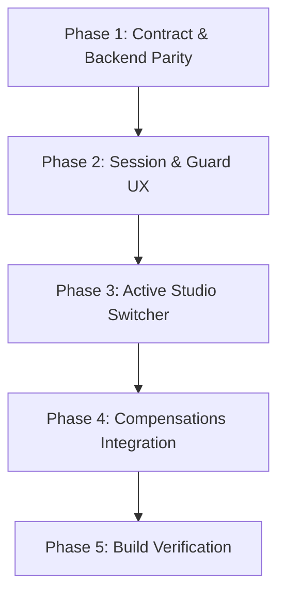

# Creator Portal Foundation & Compensations Reference

> **Status**: ⏸️ Planning (Awaiting Approval)
> **Phase scope**: Phase 2 Wave 1
> **Owner app**: `apps/erify_creators`
> **Depends on**: SSO JWT Authentication ✅, Shared Economics Contract Alignment ✅

## Purpose

Technical reference and implementation blueprint for establishing the `erify_creators` portal foundation and mounting creator show-based compensations. This document outlines the unified three-layer architecture, active studio switcher, onboarding session guards, and the new premium **My Compensations** portal matching the visual design and quality standards of `erify_studios`.

---

## Architectural Alignment & Stack Parity

Both `erify_creators` and `erify_studios` share the same core technical stack and design principles to ensure a seamless development experience and unified visual language across business scope:

```
Routes (Thin Routing) ➔ Pages (Orchestration) ➔ Features (Presentation & API Hooks)
```

- **Shared Component Library**: Instead of duplicating styled structures, both apps pull standard elements (dense grids, tables, badge variants, and date pickers) from the shared monorepo package `@eridu/ui`.
- **Query Invalidation**: State updates automatically invalidate dependent scopes using centralized query keys from `src/lib/api/query-keys.ts`.
- **Offline Reliability**: Axios endpoints leverage IndexedDB for caching cache reads and offline support.

---

## Phased Roadmap

To manage execution safely, we divide the roadmap into 5 sequential phases:



### Phase 1: Contract Parity & Backend Support
- **Goal:** Update DTO structures and expose user creator linkage.
- **Scope:** `@eridu/api-types` and `erify_api`.
- **Deliverables:**
  - Add optional `creator` profile containing active `studio_creators` to `profileResponseSchema`.
  - Add optional `studio_id` query parameter to `listShowsQuerySchema`.
  - Support `studio_id` filtering inside `buildShowWhereClause` within `erify_api`.

### Phase 2: Session & Guard UX in Creators App
- **Goal:** Restrict creators portal to valid linked creators with premium layouts.
- **Scope:** `apps/erify_creators` roots.
- **Deliverables:**
  - Implement `useUserProfile` hook pulling `/me` profile.
  - Implement unlinked validation in the root layout (`__root.tsx`).
  - Render beautiful premium HSL gradient designs for unlinked/inactive fallback states.

### Phase 3: Active Studio Switcher
- **Goal:** Provide seamless studio switching context.
- **Scope:** `apps/erify_creators` navigation.
- **Deliverables:**
  - Implement `useActiveStudio` storing context in `localStorage`.
  - Build Radix-based `StudioSwitcher` dropdown component.
  - Integrate switcher into the sidebar header.

### Phase 4: My Compensations Dashboard
- **Goal:** Implement the show-based personal earnings dashboard.
- **Scope:** `apps/erify_creators` pages.
- **Deliverables:**
  - Create `useMyShowCompensations` hook querying `/me/show-compensations`.
  - Mount date-range filtered `/compensations` route and page.
  - Design premium summary cards (Total Earned, Shows Completed, Pending Items).
  - Build dense payment breakdown table detailing agreed rates, commissions, adjustments, and status notes.

### Phase 5: Verification & Quality Gate
- **Goal:** Clean lints, builds, typechecks, and tests.
- **Scope:** Monorepo validation.
- **Deliverables:**
  - Build and lint of `@eridu/api-types`, `erify_api`, and `erify_creators`.
  - Run Vitest tests inside `erify_creators`.

---

## API Surface & Shared Contracts

### 1. User Profile (`GET /me`)
The profile schema in `packages/api-types/src/users/schemas.ts` will support:

```typescript
export const profileResponseSchema = z.object({
  ext_id: z.string(),
  id: z.string(),
  name: z.string(),
  email: z.string().email(),
  image: z.string().nullable(),
  is_system_admin: z.boolean(),
  payload: jwtPayloadSchema,
  studio_memberships: z.array(
    z.object({
      studio: z.object({
        uid: z.string(),
        name: z.string(),
      }),
      role: z.string(),
    })
  ).optional(),
  creator: z
    .object({
      uid: z.string(),
      name: z.string(),
      alias_name: z.string(),
      studio_creators: z.array(
        z.object({
          studio: z.object({
            uid: z.string(),
            name: z.string(),
          }),
          is_active: z.boolean(),
        })
      ),
    })
    .nullable()
    .optional(),
});
```

### 2. Shows Listing (`GET /me/shows`)
- Add `studio_id` optional filter to `listShowsQuerySchema` in `packages/api-types/src/shows/schemas.ts`.

### 3. Show Compensations (`GET /me/show-compensations`)
- Reuses `StudioCreatorCompensationResponse` contract from `packages/api-types/src/studio-creators/schemas.ts`.
- Params:
  - `studio_id`: Studio UID
  - `date_from`: ISO string datetime
  - `date_to`: ISO string datetime

---

## Detailed Frontend Components

### 🛡️ Onboarding Fallback Guards
We will render custom full-page layouts inside `__root.tsx` to handle onboarding exceptions with rich aesthetics:

1. **`UnlinkedCreatorView`**: 
   - *Aesthetics*: Elegant deep HSL slate background with a glass-like centered card and subtle glowing outline.
   - *Copy*: "Account Unlinked. Your account is not yet connected to a Creator Profile. Please contact your studio manager to link your account."
2. **`NoStudioAssociationView`**:
   - *Aesthetics*: Sleek dark-indigo radial gradient.
   - *Copy*: "Roster Verification Pending. Your profile is not yet active on any studio rosters. Contact your studio manager to activate your studio memberships."

### 🔄 Active Studio Selector (`StudioSwitcher`)
A dropdown placed at the top of the sidebar using Radix UI primitives. It lets creators working across multiple studios swap contexts instantly. Switching the studio automatically updates active query scopes and invalidates cache states.

### 💰 Personal Compensations Page
Mounted at `/compensations`, utilizing a design aligned with `apps/erify_studios`:
- **Date Range Picker**: Easy calendar range modifier (defaults to a 30-day window).
- **Summary Row**:
  - *Planned/Total Earnings Card*: Gross amount calculated from shows and commissions.
  - *Shows Count Card*: Total number of shows completed in the duration.
  - *Pending Resolution Card*: Displays number of shows with active unresolved status flags.
- **Breakdown Table**: A clean, responsive list/table with:
  - Show Name & Date
  - Compensation Type (FIXED / COMMISSION / HYBRID)
  - Agreed Rate & Commission Rate
  - Base Amount & Adjustment Total
  - Final Show Payout
  - Notes & Status badges

---

## Verification & Execution commands

Validate every workspace involved in this branch in the sequence below:

```bash
# 1. Rebuild shared contracts
pnpm --filter @eridu/api-types build

# 2. Re-verify backend API builds and run tests
pnpm --filter erify_api build
pnpm --filter erify_api test

# 3. Re-verify creators portal build and run tests
pnpm --filter erify_creators build
pnpm --filter erify_creators lint
pnpm --filter erify_creators test
```
