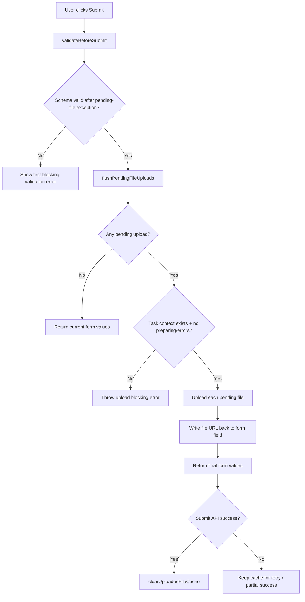
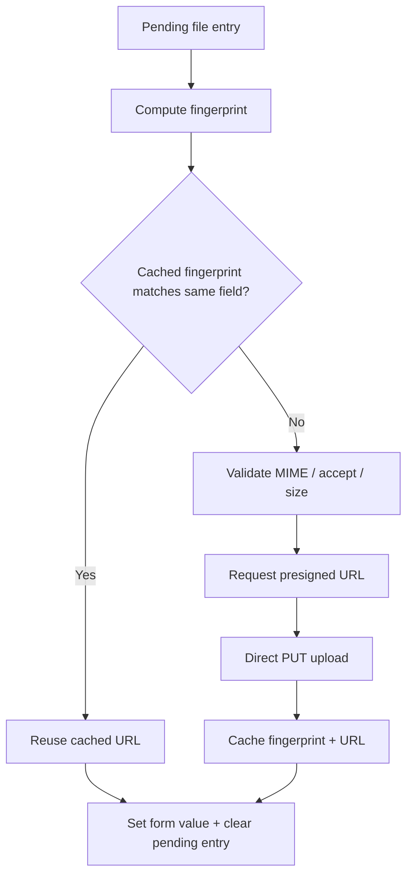

# JsonForm Submission and Upload Flow

Canonical behavior for task execution form submission when file fields are present.

## Source of Truth

- `apps/erify_studios/src/components/json-form/json-form.tsx`
- `apps/erify_studios/src/features/tasks/components/task-execution-sheet.tsx`
- `apps/erify_studios/src/features/tasks/components/studio-task-action-sheet.tsx`

## Submission Phases

1. Call `validateBeforeSubmit()` before any upload request.
2. Validation ignores required-file errors only for file fields that currently have pending uploads.
3. Validation still blocks all non-file issues and any file-field error that is not covered by pending upload state.
4. If validation passes, call `flushPendingFileUploads()` to upload pending files and replace file fields with final URL values.
5. After submit API success, caller clears the uploaded-file cache via `clearUploadedFileCache()`.

## Pending Upload Rules

1. A pending file blocks submit if preparation is still running.
2. A pending file blocks submit if local validation produced an error (type/accept/size/preparation failure).
3. Pending file entries are removed after a successful upload or when the user clears/replaces the file.
4. Preview URLs are revoked when pending entries are removed to avoid object URL leaks.

## Upload Execution Rules

1. Upload uses `MATERIAL_ASSET` presign flow via `requestPresignedUpload()` and direct PUT via `uploadFileToPresignedUrl()`.
2. Upload validates MIME/accept/max-size again at submit time before calling presign.
3. Image preparation happens during file selection; submit path uploads the prepared file currently stored in pending state.
4. Image compression is driven by the actual file MIME type (`file.type.startsWith('image/')`), **not** the template's `accept` field. A file field with no accept restriction still compresses image uploads.
5. The uploaded-file URL cache applies to all file types (images and non-images).

## Uploaded File Reuse Cache

1. `JsonForm` tracks a per-field fingerprint (`name:size:type:lastModified`) plus `uploadTaskId` for uploaded files.
2. If the same file is submitted again for the same field in the same task context during the same form session, submit reuses the cached URL and skips a second upload.
3. Cache is intentionally kept across retries and partial upload success, so re-submit can reuse already uploaded file URLs.
4. Cache is cleared only after successful submit API completion (`clearUploadedFileCache()`).
5. Per-field cache entries are still removed when the user clears/replaces a file field.

## Current Uploaded File Preview UX

1. `JsonForm` attempts to render current uploaded URLs as image previews when either:
   - URL looks like an image URL, or
   - field `accept` includes `image/`.
2. If image preview fails to load from the actual host URL, the form shows a fallback message and keeps the link visible.
3. In editable mode, this fallback helps users detect missing/broken hosted files and replace + submit again.

