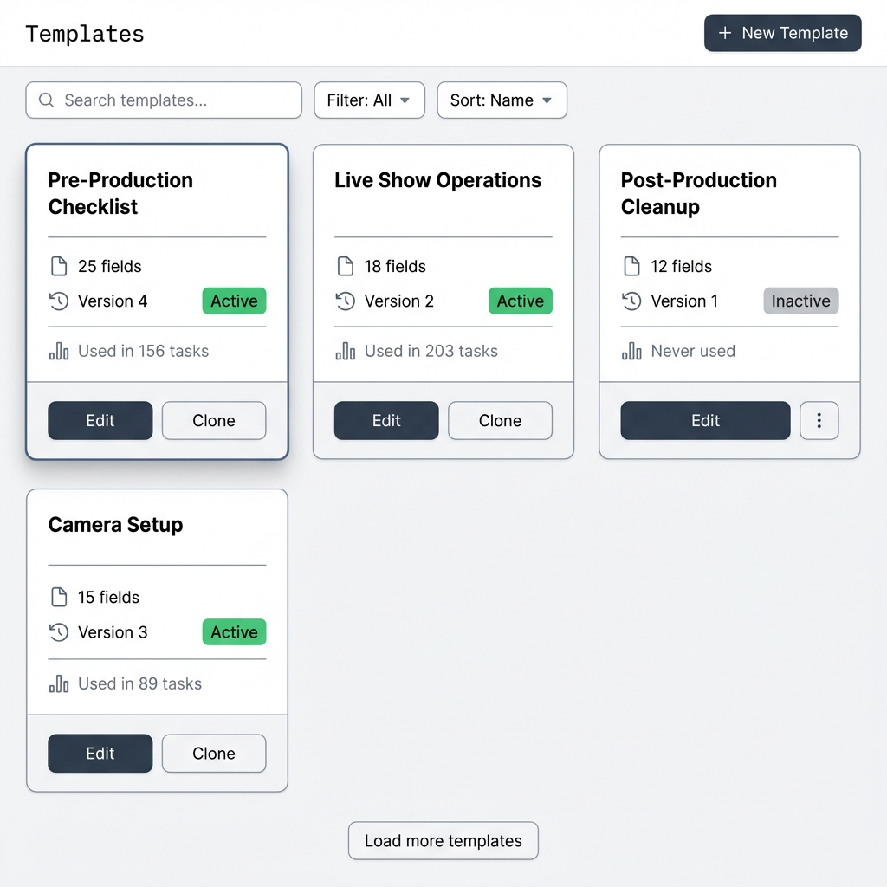
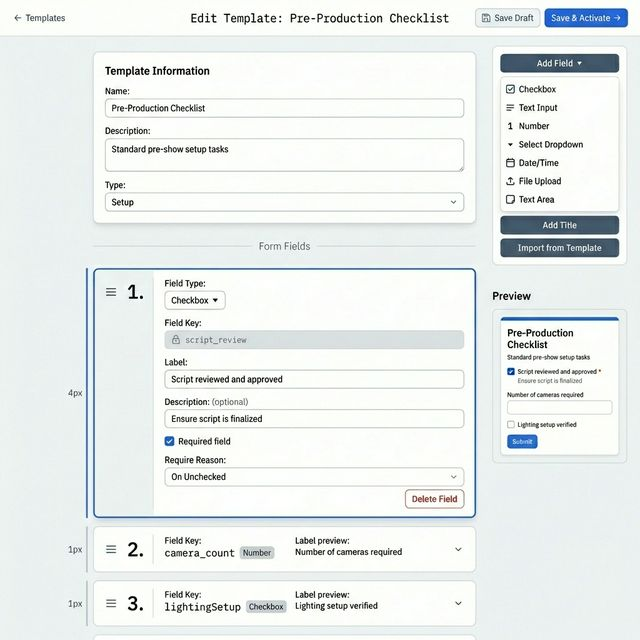
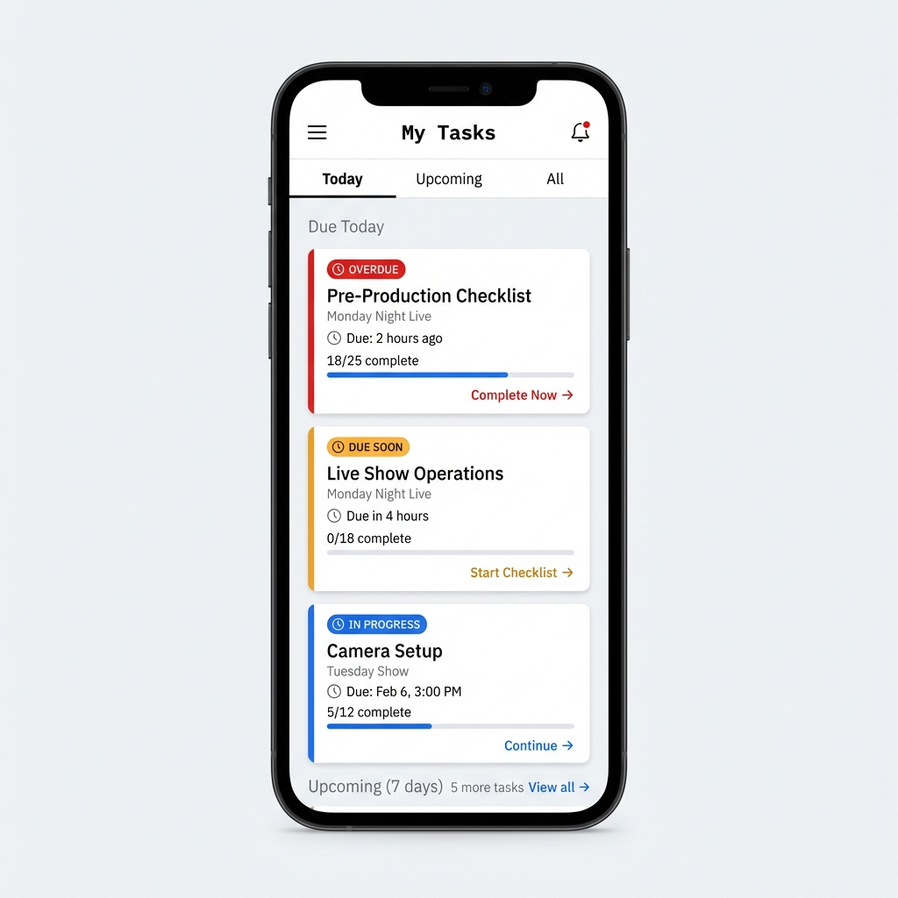
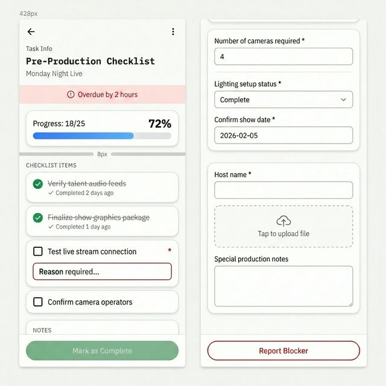
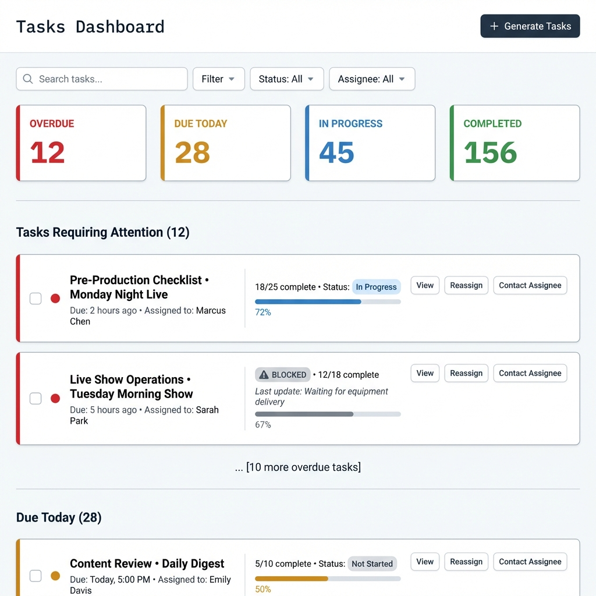
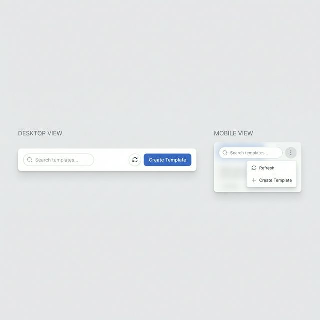
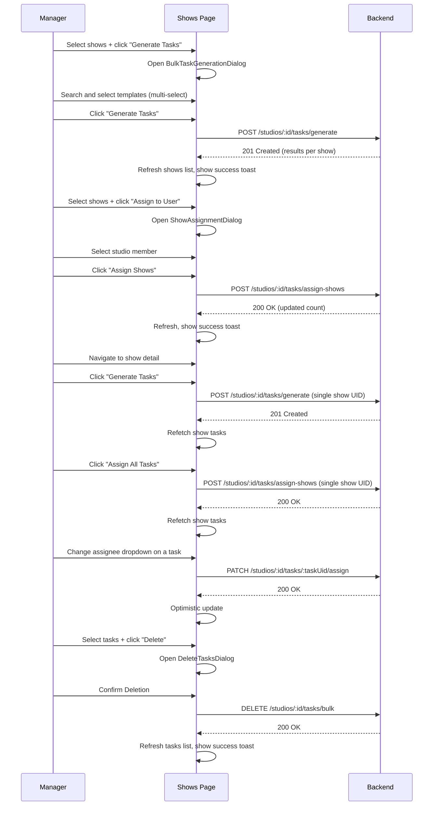

# Task Management System - UI/UX Design

**Version**: 3.2
**Last Updated**: February 23, 2026
**Status**: Implemented. Deferred items: animations (confetti/checkbox), mobile swipe gestures, file uploads, PWA/offline, real-time WebSocket updates, analytics dashboard.

> **Related Documentation**  
> For API contracts, database schema, and backend architecture, see [`apps/erify_api/docs/TASK_MANAGEMENT_DESIGN.md`](../../erify_api/docs/TASK_MANAGEMENT_DESIGN.md)

---

## Table of Contents

1. [Design Philosophy & User Personas](#1-design-philosophy--user-personas)
2. [Information Architecture](#2-information-architecture)
3. [Screen Designs & Workflows](#3-screen-designs--workflows)
4. [Visual Design System](#4-visual-design-system)
5. [Component Patterns](#5-component-patterns)
6. [Interaction Patterns](#6-interaction-patterns)
7. [Accessibility](#7-accessibility)
8. [Error States & Edge Cases](#8-error-states--edge-cases)
9. [Technical Integration](#9-technical-integration)
10. [Implemented Component Patterns](#10-implemented-component-patterns)
11. [Task Generation & Assignment Workflows](#11-task-generation--assignment-workflows)

---

## 1. Design Philosophy & User Personas

### Design Philosophy

**Target Users**: Studio admins and users (operators) in live production environments  
**Core Principle**: Clarity under pressure - minimize cognitive load during high-stakes show preparation  
**Aesthetic Direction**: Clean, functional interface with production-grade polish and contextual depth

### User Personas

#### Persona 1: Studio Admin (Sarah)
**Role**: Plans shows, manages templates, assigns work  
**Context**: Desk-based, multi-tasking, needs overview and control  
**Pain Points**: 
- Last-minute schedule changes
- Tracking 20+ shows simultaneously
- Ensuring nothing falls through cracks

**Key Workflows**:
1. Create/update task templates
2. Generate tasks and confirm due dates
3. Assign tasks to users
4. Monitor overall progress
5. Intervene on blocked tasks

#### Persona 2: User / Operator (Marcus)
**Role**: Executes checklists, updates task status  
**Context**: Moving between studio floor and control room, mobile-first  
**Pain Points**:
- Distractions during live shows
- Finding what needs to be done NOW
- Unclear expectations

**Key Workflows**:
1. See today's tasks (can be assigned to multiple)
2. Complete checklist items
3. Report blockers
4. Mark tasks complete
5. Quick status updates on mobile

---

## 2. Information Architecture

```
┌─ Studio Management (Admin Role)
│  ├─ Templates
│  │  ├─ Template Library
│  │  ├─ Create/Edit Template
│  │  └─ Template History
│  ├─ Shows
│  │  ├─ Show Calendar
│  │  ├─ Show Detail
│  │  └─ Generate Tasks for Show
│  └─ Tasks (Admin View)
│     ├─ All Tasks Dashboard
│     ├─ Assign Tasks
│     └─ Task Analytics
│
└─ My Tasks (User Role)
   ├─ Today's Tasks
   ├─ Upcoming (7 days)
   ├─ Task Detail
   └─ Task History
```

### Architectural Boundary

> [!IMPORTANT]
> **`/system/*` routes** are root-level record control — plain CRUD, no business logic. For super-admin access to raw model data only.
>
> **`/studios/$studioId/*` routes** own all business workflows — task generation, assignment, progress tracking, and operator execution. Scoped to studio context with role-based access.

### Global Navigation

#### Studio Manager View
- **Top Bar**:
  - Breadcrumbs: `Studio Name > Section`
  - User Menu: Profile, Switch Studio, Logout
- **Sidebar (Collapsible)**:
  - **Dashboard**: Studio overview
  - **Shows**: Manage shows and runs
  - **Templates**: Task templates library (Standard, Active, etc.)
  - **Tasks**: Global task board
  - **Settings**: Studio settings, Members

### Sidebar Navigation & Studio Switcher

**Purpose**: Enable seamless navigation within a studio context and quick switching between multiple studio memberships.

**Implementation Pattern**: Uses existing `AppSidebar` and `TeamSwitcher` components from `@eridu/ui` package, configured via `useSidebarConfig` hook.

---

#### Studio Switcher Implementation

**Component**: `TeamSwitcher` from `@eridu/ui`  
**Location**: Passed to `AppSidebar` via `header` prop  
**Data Source**: User profile's `studio_memberships` from `/me/profile` endpoint

**Implementation Pattern**:
- Uses `useStudioTeams` hook to manage team list and switching logic
- Maps studio memberships to `Team` objects for the switcher component
- Displays studio name and user's role (shown as "plan" in the UI)
- Handles team changes by updating active studio and navigating to studio dashboard
- Persists active studio selection in localStorage for session continuity

**Key Hooks**:
- `useStudioTeams`: Transforms studio memberships into team list, manages active team state
- `useActiveStudio`: Manages active studio selection, localStorage persistence, and navigation
- `useLocalStorage`: Provides cross-tab synchronized localStorage with React 18's `useSyncExternalStore`

**State Management**:
- Active studio ID stored in localStorage as `lastActiveStudioId`
- Auto-initializes to first studio when user has memberships
- Invalidates queries for both old and new studios on switch
- Always navigates to `/studios/$studioId/dashboard` after switching

**Visual Appearance** (provided by `TeamSwitcher` component):
```
┌─────────────────────────────────────┐
│ ┌─────────────────────────────────┐ │
│ │ [🏢] Universal Studios   [▼]    │ │ ← Active Studio
│ │      Admin                      │ │ ← Role (shown as "plan")
│ └─────────────────────────────────┘ │
│                                     │
│ [Dropdown when clicked:]            │
│ ┌─────────────────────────────────┐ │
│ │ [🏢] Universal Studios          │ │
│ │      Admin                      │ │
│ ├─────────────────────────────────┤ │
│ │ [🏢] Indie Productions          │ │
│ │      User                       │ │
│ └─────────────────────────────────┘ │
└─────────────────────────────────────┘
```

---

#### Navigation Items (Studio-Scoped)

**Pattern**: Navigation items are dynamically generated in `useSidebarConfig` based on:
- User's system admin status
- Active studio membership
- User's role within the active studio
- Current route path for active state

**Navigation Structure**:
1. **Dashboard** - Top-level item, always visible
2. **System** - Collapsible group, visible only to system admins
   - Contains: Clients, Studios, MCs, Memberships, Users, Platforms, Show Standards, Show Types, Schedules, Shows
3. **Studio** - Collapsible group, visible when user has active studio
   - **Dashboard** - Studio-specific dashboard (all roles)
   - **My Tasks** - User's assigned tasks (all roles)
   - **Shows** - Show management with task generation & assignment (admin role only)
   - **Task Templates** - Template management (admin role only)

**Role-Based Access**:
- Admin role: Gets access to Shows, Task Templates in addition to Dashboard and My Tasks
- Non-admin roles: Only see Dashboard and My Tasks
- Role comparison uses exact match against `STUDIO_ROLE.ADMIN` constant

**Active State Management**:
- Dashboard: Active when pathname exactly matches `/dashboard`
- System: Active when pathname starts with `/system`
- Studio: Active when pathname starts with `/studios`

**Implementation Details**:
- Uses `useMemo` with dependencies on `activeStudio`, `isSystemAdmin`, and `location.pathname`
- Helper function `getStudioManagementItems` generates studio-specific nav items
- All studio routes include `studioId` parameter for proper scoping


---

#### User Profile Menu

**Component**: `NavUser` from `@eridu/ui` (automatically rendered in `AppSidebar` footer)  
**Location**: Bottom of sidebar  
**Data Source**: Session user data mapped to `SidebarUser` type

**Implementation**:
- Maps session user data (name, email, avatar) to component props
- Provides logout handler that clears caches before signing out
- Redirects to login page after successful logout
- Avatar defaults to `/avatars/default.jpg` if user has no image

**Logout Flow**:
1. Clear all TanStack Query caches to prevent data leakage
2. Call auth client's sign out method
3. Redirect to login page

**Visual Appearance** (provided by `NavUser` component):
```
┌─────────────────────────────────────┐
│ ┌───┐                               │
│ │ SC│  Sarah Connor                 │ ← Avatar + Name
│ └───┘  sarah@example.com            │ ← Email
│        [⋮]                          │ ← Menu trigger
└─────────────────────────────────────┘
```

---

#### Studio Context Hook

**Hook**: `useActiveStudio` (manages active studio selection and persistence)

**Purpose**: Provides centralized studio context management with localStorage persistence and query invalidation.

**Key Features**:
- Fetches user profile with studio memberships from `/me/profile`
- Persists active studio ID in localStorage (`lastActiveStudioId`)
- Auto-initializes to first studio when user has memberships
- Provides `switchStudio` function for changing active studio
- Invalidates queries for both old and new studios on switch
- Always navigates to `/studios/$studioId/dashboard` after switching

**State Management**:
- Uses `useLocalStorage` hook for cross-tab synchronized storage
- Initializes with `null` to avoid race conditions during data loading
- Uses `useEffect` to set default studio when profile data loads
- Memoizes studios list and active studio for performance

**Query Invalidation**:
- Invalidates previous studio's queries when switching
- Invalidates new studio's queries to fetch fresh data
- Uses query key pattern: `['studios', studioId]`

**Exported Values**:
- `activeStudio`: Current active studio membership object (includes studio info and user role)
- `studios`: Array of all studio memberships
- `switchStudio`: Function to change active studio
- `activeStudioId`: Current active studio ID (or null)

---

#### Edge Cases & Error States

**No Studio Memberships**:
- Hide studio switcher component when user has no memberships
- Return empty navigation items array
- Show empty state UI in main content area (see below)
- Still provide user profile menu and logout functionality

**Empty State UI** (shown in main content area):
```
┌─────────────────────────────────────┐
│                                     │
│     [Illustration: Empty inbox]     │
│                                     │
│   No Studio Access                  │
│                                     │
│   You don't have access to any      │
│   studios yet. Contact your         │
│   administrator to get started.     │
│                                     │
└─────────────────────────────────────┘
```

**Studio Removed During Session**:
- Detected when `activeStudioId` is not in `studio_memberships`
- Auto-switch to first available studio
- Show toast notification

**Permission Downgrade**:
- Navigation items update automatically via `useMemo` dependency on `session`
- No manual refresh needed

---

**SidebarLayout Integration**:
- No changes needed to existing `SidebarLayout` component
- Uses `useSession` hook to get current session
- Passes session to `useSidebarConfig` hook
- Spreads sidebar config props to `AppSidebar` component
- Provides `RouterLink` adapter for TanStack Router integration

**RouterLink Adapter**:
- Adapts TanStack Router's `Link` component to work with `AppSidebar`
- Maps `href` prop to `to` prop for router compatibility
- Already exists in codebase, no changes needed

---

#### Mobile Considerations

**Handled by `@eridu/ui` components**:
- `TeamSwitcher` uses `useSidebar().isMobile` to adjust dropdown position
- `AppSidebar` uses `variant="inset"` for responsive behavior
- Touch targets automatically meet 44px minimum via Shadcn/Radix primitives

---

## 3. Screen Designs & Workflows

### 3.1 Manager: Template Library

**Purpose**: Browse, search, and manage task templates. Quick access to create new or edit existing templates.

**Key Features**:
- **Card-based layout**: Visual scanning, not table overload
- **Version indicator**: Show current version prominently
- **Usage stats**: "Used in X tasks" helps understand template impact
- **Status badge**: Active/Inactive at a glance
- **Quick actions**: Edit, Clone, More options

**Interactions**:
- Click card → View template detail
- Hover → Show last edited date, author
- Filter by: Active/Inactive, Type (Setup/Active/Closure)
- Search: Full-text search across name, description, field labels

**Layout Reference**:


---

### 3.2 Manager: Create/Edit Template

**Purpose**: Design task template with visual form builder. No-code interface for managers.

**Key Features**:
- **Live preview**: See exactly what operators will see
- **Drag-to-reorder**: Visual field ordering with ☰ handle
- **Field validation**: Real-time validation of rules
- **Version warning**: "Saving will create version 5. Existing tasks use version 4."
- **Smart defaults**: Auto-generate field keys from labels

**Template Builder Pattern** (Card Stack Design):


**Interactions**:
- Drag fields to reorder
- Click field → Open editor
- Delete → Confirm (show count of tasks using this field)
- Save → Show version increment notification

#### Validation Configuration UI
When editing a field, managers can configure advanced validation rules:

**Common Config**:
- **Description/Help Text**: Instructions for the operator
- **Default Value**: Pre-filled value (supports all types)

**Checkbox Fields**:
- **Require Reason**: Dropdown `[None, On Checked, On Unchecked, Always]`
  - *Example usage*: "Equipment NOT OK" must have a reason why.

**Number Fields**:
- **Min/Max**: Standard inputs
- **Conditional Reason**: "Require reason if..."
  - Operators: `lt`, `lte`, `gt`, `gte`, `eq`, `neq`
  - *Example*: Require reason if "Camera Count" < 3.

**Date/Datetime Fields**:
- **Conditional Reason**:
  - Operators: `Before`, `After`, `On Date`
  - *Example*: Require reason if date is before today.

**Select/Multiselect Fields**:
- **Conditional Reason**:
  - Operators: `Is`, `Is Not`, `Is One Of`, `Is Not One Of`
  - *Example*: Require reason if Status is "Blocked" or "On Hold".


---

### 3.3 Manager: Shows List (Studio-Scoped)

**Purpose**: Browse studio shows, filter by date and status, select shows, and act on them via dialogs.

**Route**: `/studios/$studioId/shows`

**Design Rationale: Read-Only Table + Action Dialogs**

Users are accustomed to spreadsheet-like dense data views. The Data Table satisfies this by providing sortable columns, filters, and pagination — giving managers the at-a-glance overview they expect. However, **the table itself is read-only**. All mutations (task generation, assignment) happen through explicit dialogs triggered from the floating action bar. This avoids:
- Chatty per-row mutations and constant refetching
- Mixing read and write concerns in the same component
- Over-engineering a simple "select and act" workflow

**Key Features**:
- **Data Table**: Columns for Show Name, Client, Start Time, Task Status (badge), and Assignee (read-only text). Familiar dense layout for scanning.
- **Checkbox Selection**: Select one or many shows. Selection is ID-based (cross-page safe — selecting a show on page 1, navigating to page 2, and returning to page 1 keeps the original selection).
- **Adaptive Bulk Actions**: Appears when ≥1 row is selected. Desktop uses a floating action bar; mobile uses a bottom sticky action tray + bottom sheet actions.
- **Toolbar Filters**: Reuses `<AdminTableToolbar />` from system shows with advanced filters for show name, task presence (`has_tasks`), date range (`date_from`/`date_to`), and dimensions: Client, Show Type, Show Standard, Show Status, Platform.

**Layout** (Desktop Data Table):
```
┌───────────────────────────────────────────────────────────────────────┐
│ Shows                                                                 │
│ Manage show tasks and assignments                                     │
│                                                                       │
│ [Search Shows...] [Date: Next 7 Days ▼] [Client ▼] [Type ▼] [Tasks ▼] │
├───┬────────────────────┬──────────┬──────────────┬─────────┬──────────┤
│ ☐ │ Show Name          │ Client   │ Start Time   │ Tasks   │ Assignee │
├───┼────────────────────┼──────────┼──────────────┼─────────┼──────────┤
│ ☑ │ Monday Night Live  │ Acme     │ Feb 5, 8 PM  │ 3 tasks │ Marcus C.│
│ ☑ │ Morning Report     │ Acme     │ Feb 6, 7 AM  │ No tasks│    —     │
│ ☐ │ Weekend Special    │ Globex   │ Feb 8, 6 PM  │ 2 tasks │ Mixed    │
├───┴────────────────────┴──────────┴──────────────┴─────────┴──────────┤
│                      [ < Prev ] Page 1 of 5 [ Next > ]                │
└───────────────────────────────────────────────────────────────────────┘

            ┌──────────────────────────────────────────┐
            │ 2 selected  [Generate Tasks] [Assign] [✕]│  ← Floating bar
            └──────────────────────────────────────────┘
```

**Assignee Column (Read-Only)**:
- Shows the name of the assigned user if all tasks share the same assignee.
- Shows `Mixed` if tasks are split across different users.
- Shows `—` if no tasks exist or none are assigned.
- Clicking the show name navigates to the Show Detail (§3.3.3) for granular task-level reassignment.

---

### 3.3.1 Bulk Task Generation Dialog

**Trigger**: Select shows → click "Generate Tasks" in bulk action bar

**Purpose**: Select one or more templates to apply across all selected shows.

**Dialog Layout**:
```
┌───────────────────────────────────────────────────────────────────┐
│ Generate Tasks                                           [✕]      │
├───────────────────────────────────────────────────────────────────┤
│                                                                   │
│ Selected Shows: 2                                                 │
│ ┌─────────────────────────────────────────────────────────────┐   │
│ │ • Monday Night Live — Feb 5, 8:00 PM                        │   │
│ │ • Morning Report — Feb 6, 7:00 AM                           │   │
│ └─────────────────────────────────────────────────────────────┘   │
│                                                                   │
│ Template Selection:                                               │
│                                                                   │
│ [Search task templates...                                  ▼]     │
│   3 selected                                                      │
│                                                                   │
│ ℹ️ Showing first 10 templates by default.                         │
│    Type to search templates by name.                              │
│                                                                   │
│ ───────────────────────────────────────────────────────────────── │
│                                                                   │
│ ℹ️  Tasks will be created with PENDING status.                    │
│     Shows with active tasks for a template will be skipped.       │
│     Previously deleted tasks will be reset to PENDING.            │
│                                                                   │
│ This will create up to 6 new tasks across 2 shows.                │
│                                                                   │
│                        [Cancel]  [Generate Tasks] →               │
└───────────────────────────────────────────────────────────────────┘
```

**Key Design Decisions**:
- Uses searchable multi-select combobox (`AsyncMultiCombobox`) for template selection
- First 10 templates are loaded by default; search refines server-side results
- The same template set is applied to **all** selected shows
- Generation is idempotent with three cases per show+template pair: (1) **active task exists** → skip; (2) **soft-deleted task exists** → resume (restore, reset to `PENDING`, wipe content, update to latest snapshot); (3) **no task** → create new
- Due dates are optional in v1 (deferred to Smart Due Date feature)
- Summary line updates dynamically as user selects templates

**Success State**: After generation, shows table refreshes and task status badges update.

---

### 3.3.2 Show Assignment Dialog (Bulk)

**Trigger**: Select shows → click "Assign to User" in bulk action bar

**Purpose**: Assign all tasks of the selected shows to a single studio member.

**Dialog Layout**:
```
┌───────────────────────────────────────────────────────────────┐
│ Assign Shows                                          [✕]    │
├───────────────────────────────────────────────────────────────┤
│                                                               │
│ Assign all tasks for these shows to:                         │
│                                                               │
│ [Select studio member...                              ▼]     │
│                                                               │
│ Selected Shows:                                              │
│ ┌─────────────────────────────────────────────────────────┐   │
│ │ • Monday Night Live — 3 tasks (currently: Marcus Chen) │   │
│ │ • Morning Report — 3 tasks (currently: unassigned)     │   │
│ └─────────────────────────────────────────────────────────┘   │
│                                                               │
│ ⚠️  1 show has tasks already assigned to another user.        │
│     Existing assignments will be overwritten.                │
│                                                               │
│ This will assign 6 tasks to the selected user.               │
│                                                               │
│                     [Cancel]  [Assign Shows] →                │
└───────────────────────────────────────────────────────────────┘
```

**Key Features**:
- Studio members fetched from `GET /studios/:studioId/members`
- Warning when overwriting existing assignments
- Informational warning for selected shows with no generated tasks
- Disable submit when all selected shows have no generated tasks (prompt user to generate tasks first)
- Shows summary with current assignee info
- Dynamic task count based on selected shows

---

### 3.3.3 Show Detail: Task List & Reassignment

**Trigger**: Click "View Tasks" on a show row, or click show name

**Purpose**: View all tasks for a show, run show-level generate/assign actions, and reassign individual tasks.

**Route**: `/studios/$studioId/shows/$showUid/tasks`

**Layout**:
```
┌───────────────────────────────────────────────────────────────────┐
│ ← Back to Shows                                                  │
│                                                                   │
│ Monday Night Live                                                │
│ Acme Corp • Feb 5, 2026, 8:00 PM – 10:00 PM                     │
├───────────────────────────────────────────────────────────────────┤
│                                                                   │
│ Tasks (3)                     [Generate Tasks] [Assign All Tasks]│
│                                                                   │
│ ┌──────────────────────────────────────────────────────────────┐  │
│ │ SETUP  Pre-Production Checklist                              │  │
│ │ Status: PENDING    Due: Feb 3, 5:00 PM                       │  │
│ │ Assignee: [Marcus Chen ▼]              [View Task →]         │  │
│ └──────────────────────────────────────────────────────────────┘  │
│                                                                   │
│ ┌──────────────────────────────────────────────────────────────┐  │
│ │ ACTIVE  Live Show Operations                                 │  │
│ │ Status: PENDING    Due: Feb 5, 8:00 PM                       │  │
│ │ Assignee: [Marcus Chen ▼]              [View Task →]         │  │
│ └──────────────────────────────────────────────────────────────┘  │
│                                                                   │
│ ┌──────────────────────────────────────────────────────────────┐  │
│ │ CLOSURE  Post-Production Cleanup                             │  │
│ │ Status: PENDING    Due: Feb 6, 12:00 PM                      │  │
│ │ Assignee: [Sarah Connor ▼]             [View Task →]         │  │
│ └──────────────────────────────────────────────────────────────┘  │
│                                                                   │
└───────────────────────────────────────────────────────────────────┘
```

**Individual Task Reassignment**:
- Each task card has an inline assignee dropdown
- Changing the dropdown immediately triggers `PATCH /studios/:studioId/tasks/:taskUid/assign`
- Change is reflected instantly (optimistic update)
- "Assign All Tasks" button opens the same assignment dialog from §3.3.2 but for a single show

**Show-Level Actions in Detail Page**:
- "Refresh" button invalidates relevant TanStack Query caches and refetches active data for:
  - current show detail (`['studio-show', studioId, showUid]`)
  - current show task list (`['show-tasks', 'list', studioId, showUid]`)
  - studio show lists (`['studio-shows', 'list', studioId, ...]`)
  - memberships lists used by assignee dropdowns (`['memberships', 'list', ...]`)
- "Generate Tasks" button opens the same generation dialog from §3.3.1 scoped to the current show
- "Assign All Tasks" opens assignment dialog from §3.3.2 scoped to the current show
- Successful generate/assign actions refetch the show task list immediately
- Route receives show metadata via navigation state and passes it to `useStudioShow` as `initialData` for instant header render
- Detail query always remains active and revalidates from `GET /studios/:studioId/shows/:showUid` (not only on route transitions)
- On refresh/direct access (no navigation state), the same studio-scoped detail query loads full show metadata
- Studio scoping is enforced server-side; users can only load show details for studios they can access

**Key Features**:
- Ordered by task type: SETUP → ACTIVE → CLOSURE → OTHER
- Status badges and due date indicators consistent with task card design
- Quick "View Task" link navigates to the full task detail (form view)

---

### 3.4 Operator: My Tasks (Mobile-First)

**Purpose**: The operator's command center. Show what needs attention NOW.

**Key Features**:
- **Visual priority**: Color-coded urgency (red/yellow/white)
- **Contextual info**: Show name, due date, progress
- **One-tap action**: Direct to task detail
- **Smart grouping**: Due today vs upcoming
- **Progress indicators**: X/Y complete gives sense of completion

**Mobile Layout**:


**Implementation Details**:
- **Path**: `/my-tasks`
- **Component**: `MobileTaskList` with tab navigation
- **Tabs**: Today, Upcoming, All
- **Card States**: Overdue (red border), Due Soon (amber border), In Progress (blue border)
- **Actions**: Tap card to navigate to task detail

---

### 3.5 Operator: Task Detail (Mobile)

**Purpose**: Complete checklist items. Report issues. Update status.

**Mobile Layout** (Scrollable):


**Interaction Patterns**:
- **Tap checkbox** → Instant update, checkmark animation
- **Tap completed item** → Expand to show completion time
- **Hold checkbox** → Quick action menu (Undo, Add note)
- **Progress Inference** → Frontend calculates progress percentage from content and required fields

**Optimistic UI Updates**:
```typescript
// When user taps checkbox
1. Immediately show checkmark (optimistic)
2. Send API request with version number
3. If conflict (409):
   - Revert UI
   - Show toast: "Someone else updated this task. Refreshing..."
   - Reload task
4. If success:
   - Keep checkmark
   - Increment local version
   - Show confetti animation (if task now 100% complete)
```

---

### 3.6 Manager: All Tasks Dashboard

**Purpose**: Overview of all tasks across shows. Filter, search, monitor.

**Desktop Layout**:


**Key Features**:
- **Summary cards**: Quick stats at top
- **Attention-based sorting**: Overdue → Due today → In progress → Upcoming
- **Bulk actions**: Select multiple, reassign all
- **Real-time updates**: WebSocket for live status changes (future)
- **Export**: Download task report as CSV/PDF

---

## 4. Visual Design System

### Color Palette

```css
:root {
  /* Base colors */
  --color-background: #FAFAFA;
  --color-surface: #FFFFFF;
  --color-border: #E5E5E5;
  
  /* Text */
  --color-text-primary: #1A1A1A;
  --color-text-secondary: #737373;
  --color-text-tertiary: #A3A3A3;
  
  /* Status colors */
  --color-overdue: #DC2626;      /* Red 600 */
  --color-due-soon: #F59E0B;     /* Amber 500 */
  --color-in-progress: #3B82F6;  /* Blue 500 */
  --color-completed: #10B981;    /* Green 500 */
  --color-blocked: #6B7280;      /* Gray 500 */
  
  /* Accents */
  --color-primary: #0F172A;      /* Slate 900 - CTA buttons */
  --color-primary-hover: #1E293B;
  
  /* Feedback */
  --color-success: #059669;
  --color-error: #DC2626;
  --color-warning: #D97706;
  --color-info: #0284C7;
}
```

### Typography

```css
/* Headings - Space Mono (distinctive monospace) */
@import url('https://fonts.googleapis.com/css2?family=Space+Mono:wght@400;700&display=swap');

/* Body - IBM Plex Sans (readable, professional) */
@import url('https://fonts.googleapis.com/css2?family=IBM+Plex+Sans:wght@400;500;600&display=swap');

:root {
  --font-heading: 'Space Mono', monospace;
  --font-body: 'IBM Plex Sans', -apple-system, system-ui, sans-serif;
}

h1 {
  font-family: var(--font-heading);
  font-size: 2rem;
  font-weight: 700;
  letter-spacing: -0.02em;
}

h2 {
  font-family: var(--font-heading);
  font-size: 1.5rem;
  font-weight: 700;
}

body {
  font-family: var(--font-body);
  font-size: 1rem;
  line-height: 1.5;
}
```

---

## 5. Component Patterns

### Task Card

```css
.task-card {
  background: var(--color-surface);
  border: 1px solid var(--color-border);
  border-radius: 8px;
  padding: 20px;
  transition: all 0.2s ease;
  
  /* Subtle depth */
  box-shadow: 0 1px 3px rgba(0, 0, 0, 0.06);
}

.task-card:hover {
  border-color: var(--color-primary);
  box-shadow: 0 4px 12px rgba(0, 0, 0, 0.08);
  transform: translateY(-2px);
}

.task-card--overdue {
  border-left: 4px solid var(--color-overdue);
}

.task-card--due-soon {
  border-left: 4px solid var(--color-due-soon);
}
```

### Status Badge

```css
.status-badge {
  display: inline-flex;
  align-items: center;
  gap: 6px;
  padding: 4px 12px;
  border-radius: 12px;
  font-size: 0.875rem;
  font-weight: 500;
}

.status-badge--pending {
  background: #F3F4F6;
  color: #374151;
}

.status-badge--in-progress {
  background: #DBEAFE;
  color: #1E40AF;
}

.status-badge--completed {
  background: #D1FAE5;
  color: #065F46;
}

.status-badge--blocked {
  background: #FEE2E2;
  color: #991B1B;
}
```

### Progress Bar

```css
.progress-bar {
  width: 100%;
  height: 8px;
  background: #E5E7EB;
  border-radius: 4px;
  overflow: hidden;
}

.progress-bar__fill {
  height: 100%;
  background: linear-gradient(90deg, #3B82F6 0%, #2563EB 100%);
  transition: width 0.6s cubic-bezier(0.4, 0, 0.2, 1);
}

/* Completed state */
.progress-bar__fill--complete {
  background: linear-gradient(90deg, #10B981 0%, #059669 100%);
}

/* Overdue state */
.progress-bar__fill--overdue {
  background: linear-gradient(90deg, #DC2626 0%, #B91C1C 100%);
}
```

---

## 6. Interaction Patterns

### Animations & Micro-interactions

#### Checkbox Complete Animation
```css
@keyframes checkmark {
  0% {
    transform: scale(0) rotate(0deg);
    opacity: 0;
  }
  50% {
    transform: scale(1.2) rotate(180deg);
  }
  100% {
    transform: scale(1) rotate(360deg);
    opacity: 1;
  }
}

.checkbox__checkmark {
  animation: checkmark 0.4s cubic-bezier(0.68, -0.55, 0.265, 1.55);
}
```

#### Task Complete Confetti
```javascript
// When task reaches 100% completion
function celebrateTaskComplete() {
  confetti({
    particleCount: 100,
    spread: 70,
    origin: { y: 0.6 },
    colors: ['#10B981', '#059669', '#34D399']
  });
}
```

#### Loading States
```css
@keyframes shimmer {
  0% {
    background-position: -1000px 0;
  }
  100% {
    background-position: 1000px 0;
  }
}

.skeleton {
  background: linear-gradient(
    90deg,
    #F3F4F6 0%,
    #E5E7EB 50%,
    #F3F4F6 100%
  );
  background-size: 1000px 100%;
  animation: shimmer 2s infinite;
}
```

### Mobile Patterns

#### Swipe Actions
```
┌─────────────────────────────┐
│ [Swipe left on task card]   │
│                             │
│ Task Card                   │
│ ←                      [✓]  │ ← Swipe reveals "Complete" action
│                             │
└─────────────────────────────┘
```

#### Pull to Refresh
```
┌─────────────────────────────┐
│ [Pull down on task list]    │
│        ↓ Release to refresh │
│                             │
│ [Loading spinner]           │
│                             │
└─────────────────────────────┘
```

#### Bottom Sheet for Actions
```
┌─────────────────────────────┐
│ Task Detail                 │
│ ...                         │
│ [Press "⋮ Menu"]            │
├─────────────────────────────┤
│ ┌─────────────────────────┐ │
│ │ [Sheet slides up]       │ │
│ │                         │ │
│ │ Reassign Task           │ │
│ │ Report Blocker          │ │
│ │ View History            │ │
│ │ Delete Task             │ │
│ │                         │ │
│ │ [Cancel]                │ │
│ └─────────────────────────┘ │
└─────────────────────────────┘
```

---

## 7. Accessibility

### Keyboard Navigation
- **Tab order**: Logical flow through interactive elements
- **Enter/Space**: Activate buttons and checkboxes
- **Escape**: Close modals and drawers
- **Arrow keys**: Navigate within lists

### Screen Reader Support
```html
<!-- Task card example -->
<article 
  role="article" 
  aria-label="Pre-Production Checklist for Monday Night Live, due in 2 hours, 18 of 25 items complete">
  
  <h3 id="task-title-123">Pre-Production Checklist</h3>
  <p id="task-show-123">Monday Night Live</p>
  
  <div role="progressbar" 
       aria-valuenow="72" 
       aria-valuemin="0" 
       aria-valuemax="100"
       aria-labelledby="task-title-123">
    18 of 25 complete (72%)
  </div>
  
  <button aria-label="View details for Pre-Production Checklist">
    View Task
  </button>
</article>
```

### Color Contrast
- All text meets WCAG AA standards (4.5:1 minimum)
- Status indicators use both color AND icons
- Focus indicators clearly visible

### Mobile Accessibility
- Touch targets minimum 44x44px
- Generous spacing between interactive elements
- Support for increased text size

---

## 8. Error States & Edge Cases

### Empty States

#### No Tasks Assigned
```
┌─────────────────────────────┐
│                             │
│     [Illustration]          │
│                             │
│   No tasks assigned yet     │
│                             │
│   You'll see tasks here     │
│   when a manager assigns    │
│   work to you.              │
│                             │
│   [Refresh]                 │
│                             │
└─────────────────────────────┘
```

#### No Templates Created
```
┌─────────────────────────────┐
│                             │
│     [Illustration]          │
│                             │
│   No templates yet          │
│                             │
│   Create your first task    │
│   template to get started.  │
│                             │
│   [Create Template] →       │
│                             │
└─────────────────────────────┘
```

### Conflict Resolution

#### Version Conflict
```
┌───────────────────────────────┐
│ ⚠️  Task Updated               │
├───────────────────────────────┤
│                               │
│ This task was modified by     │
│ another user while you were   │
│ editing it.                   │
│                               │
│ Your changes:                 │
│ • Marked "Audio check" done   │
│                               │
│ Their changes:                │
│ • Changed status to "Review"  │
│ • Added note about mic issue  │
│                               │
│ [Keep Their Changes]          │
│ [Keep My Changes]             │
│ [Merge Both]                  │
│                               │
└───────────────────────────────┘
```

### Network Offline

#### Offline Mode (PWA - Future)
```
┌─────────────────────────────┐
│ ⚠️  You're offline           │
│                             │
│ Changes will sync when      │
│ connection is restored.     │
│                             │
│ [Dismiss]                   │
└─────────────────────────────┘

[Tasks marked offline show "↻" icon]
```

---

## 9. Technical Integration

> **Note**: For complete API specifications, see the [Backend Design Document](../../erify_api/docs/TASK_MANAGEMENT_DESIGN.md#8-api-endpoints).

### State Management

```typescript
// Use Zustand for global state
interface TaskStore {
  tasks: Task[];
  filters: FilterState;
  selectedTask: Task | null;
  
  // Actions
  setTasks: (tasks: Task[]) => void;
  updateTask: (uid: string, updates: Partial<Task>) => void;
  toggleChecklistItem: (taskUid: string, itemKey: string) => void;
}
```

### API Integration

```typescript
// React Query for data fetching
const { data: tasks, isLoading } = useQuery({
  queryKey: ['tasks', 'my-tasks'],
  queryFn: () => api.getMyTasks(),
  refetchInterval: 30000, // Refresh every 30s
});

// Optimistic updates
const { mutate: completeItem } = useMutation({
  mutationFn: (itemKey: string) => 
    api.updateTaskContent(taskUid, { [itemKey]: true }, currentVersion),
  onMutate: async (itemKey) => {
    // Optimistically update UI
    await queryClient.cancelQueries(['tasks', taskUid]);
    const previous = queryClient.getQueryData(['tasks', taskUid]);
    
    queryClient.setQueryData(['tasks', taskUid], (old) => ({
      ...old,
      content: { ...old.content, [itemKey]: true }
    }));
    
    return { previous };
  },
  onError: (err, itemKey, context) => {
    // Revert on error
    queryClient.setQueryData(['tasks', taskUid], context.previous);
    toast.error('Update failed. Please try again.');
  },
});
```

### Form Engine Pattern

```typescript
/**
 * Dynamic form renderer that accepts a schema and renders fields
 * Schema structure defined in backend doc
 */
interface JsonFormProps {
  schema: UiSchema;
  values: Record<string, any>;
  onChange: (values: Record<string, any>) => void;
  onValidate?: (errors: Record<string, string>) => void;
}

function JsonForm({ schema, values, onChange, onValidate }: JsonFormProps) {
  // Build Zod schema from UI schema
  const zodSchema = buildTaskContentSchema(schema);
  
  // Use react-hook-form for validation
  const { register, handleSubmit, formState: { errors } } = useForm({
    resolver: zodResolver(zodSchema),
    defaultValues: values,
  });
  
  return (
    <form onSubmit={handleSubmit(onChange)}>
      {schema.items.map((field) => (
        <FieldRenderer 
          key={field.key} 
          field={field} 
          register={register}
          error={errors[field.key]}
        />
      ))}
    </form>
  );
}
```

### Progress Calculation

```typescript
/**
 * Calculate task progress from content and schema
 * Frontend responsibility (not in API response)
 */
function calculateProgress(task: Task): { completed: number; total: number } {
  const schema = task.snapshot.schema;
  const content = task.content;
  
  let completed = 0;
  let total = 0;
  
  for (const item of schema.items) {
    if (!item.required) continue;
    
    total++;
    
    const value = content[item.key];
    const isComplete = isFieldComplete(item.type, value);
    
    if (isComplete) completed++;
  }
  
  return { completed, total };
}

function isFieldComplete(type: string, value: any): boolean {
  switch (type) {
    case 'checkbox':
      return value === true;
    case 'text':
    case 'textarea':
      return value && value.trim().length > 0;
    case 'number':
      return typeof value === 'number' && !isNaN(value);
    case 'select':
    case 'multiselect':
    case 'date':
    case 'datetime':
      return value && (Array.isArray(value) ? value.length > 0 : String(value).length > 0);
    // 'file' type currently disabled
    // case 'file':
    //   return value && value.length > 0;
    default:
      return false;
  }
}
```

---

## 10. Implemented Component Patterns

The following patterns are implemented and available for use:

### 10.1 ResponsiveCardGrid Component

**Purpose**: Provides a responsive grid layout that automatically adjusts the number of columns based on available width without media queries.

**Location**: `apps/erify_studios/src/components/responsive-card-grid.tsx`

**Features**:
- Auto-fill grid using CSS Grid `repeat(auto-fill, minmax(...))`
- Configurable minimum card width
- Configurable gap between cards
- No media queries needed
- Fully responsive

**Usage Example**:
```tsx
import { ResponsiveCardGrid } from '@/components/responsive-card-grid';

function CardList({ items }) {
  return (
    <ResponsiveCardGrid minCardWidth="280px" gap="1.5rem">
      {items.map(item => (
        <Card key={item.id} {...item} />
      ))}
    </ResponsiveCardGrid>
  );
}
```

**Props**:
| Prop           | Type        | Default    | Description                 |
| -------------- | ----------- | ---------- | --------------------------- |
| `children`     | `ReactNode` | -          | Card components to render   |
| `minCardWidth` | `string`    | `'280px'`  | Minimum width for each card |
| `gap`          | `string`    | `'1.5rem'` | Gap between cards           |
| `className`    | `string`    | -          | Additional CSS classes      |

---

### 10.2 useInfiniteScroll Hook

**Purpose**: Implements infinite scroll using Intersection Observer API, automatically fetching more data when user scrolls near the bottom.

**Location**: `apps/erify_studios/src/hooks/use-infinite-scroll.ts`

**Features**:
- Automatic observation of sentinel element
- Configurable root margin for early loading
- Conditional enabling/disabling
- Automatic cleanup on unmount
- Works with TanStack Query's `useInfiniteQuery`

**Usage Example**:
```tsx
import { useInfiniteScroll } from '@eridu/ui';

function InfiniteList() {
  const { data, hasNextPage, isFetchingNextPage, fetchNextPage } = useInfiniteQuery({
    queryKey: ['items'],
    queryFn: fetchItems,
    getNextPageParam: (lastPage) => lastPage.nextCursor,
  });
  
  const sentinelRef = useInfiniteScroll({
    hasNextPage,
    isFetchingNextPage,
    fetchNextPage,
    rootMargin: '400px', // Start loading 400px before reaching bottom
  });
  
  return (
    <div>
      {data.pages.map(page => 
        page.items.map(item => <ItemCard key={item.id} {...item} />)
      )}
      <div ref={sentinelRef} />
      {isFetchingNextPage && <LoadingSpinner />}
    </div>
  );
}
```

**Options**:
| Option               | Type         | Default   | Description                       |
| -------------------- | ------------ | --------- | --------------------------------- |
| `hasNextPage`        | `boolean`    | -         | Whether more pages are available  |
| `isFetchingNextPage` | `boolean`    | -         | Whether currently fetching        |
| `fetchNextPage`      | `() => void` | -         | Function to fetch next page       |
| `rootMargin`         | `string`     | `'400px'` | Distance before bottom to trigger |
| `enabled`            | `boolean`    | `true`    | Whether to enable observation     |

---

### 10.3 Route Layout Pattern

**Pattern**: Parent route layouts should render `<Outlet />` without additional wrappers, as each child route handles its own layout structure.

**Route Structure**:
```
/studios (route.tsx - just renders <Outlet />)
  ├─ /studios/$studioId/dashboard
  ├─ /studios/$studioId/my-tasks
  └─ /studios/$studioId/task-templates
```

**Implementation**:
```tsx
// ✅ Parent route - minimal wrapper
function StudioLayout() {
  return <Outlet />;
}

// ✅ Child route - owns its layout structure
function TaskTemplatesPage() {
  return (
    <div className="flex flex-1 flex-col gap-4 p-4 pt-0">
      <div>
        <h1 className="text-2xl font-bold tracking-tight">Task Templates</h1>
        <p className="text-muted-foreground">Description...</p>
      </div>
      {/* Sticky toolbar, list content, etc. */}
    </div>
  );
}
```

**Why This Pattern**:
- Maximum flexibility for route-specific requirements
- No accumulation of query-related props
- Each route controls its own layout independently

---

### 10.4 Sticky Toolbar Pattern

**Use Case**: Pages with infinite scroll lists where search and actions should remain accessible while scrolling.

**Applied To**:
- Task Templates list
- Future: My Tasks list
- Future: Shows list

#### Implementation Pattern

For pages with infinite scroll (e.g., Task Templates), the toolbar should be sticky to keep search and actions accessible.

**CSS Pattern**:
```tsx
<div className="flex flex-1 flex-col gap-4 p-4 pt-0">
  {/* Header - scrolls normally */}
  <div>
    <h1 className="text-2xl font-bold tracking-tight">Task Templates</h1>
    <p className="text-muted-foreground">Description...</p>
  </div>

  {/* Toolbar - sticky with backdrop blur */}
  <div className="sticky top-0 z-10 -mx-4 px-4 py-2 bg-background/95 backdrop-blur supports-backdrop-filter:bg-background/60">
    <TaskTemplatesToolbar {...} />
  </div>

  {/* List - scrolls, toolbar sticks */}
  <TaskTemplateList {...} />
</div>
```

**Sticky Top Value**: Use `top-0` because:
- The `SidebarInset` container handles its own scroll context
- The sidebar header is outside the main content scroll area
- Content padding starts after the header, so `top-0` aligns with content area top

#### Responsive Toolbar Actions



Actions collapse to a dropdown on mobile (`<768px` / below `md` breakpoint) to save horizontal space:

```
Desktop (≥768px):   [Search.............] [Refresh] [Create Template]
Mobile (<768px):    [Search.................] [⋮ Menu]
                                              └─ Refresh
                                              └─ Create Template
```

Use `MoreVertical` icon (⋮) for the menu trigger - it's the standard mobile pattern.

#### Query State Ownership

**Principle**: Feature hooks own all query state. UI components receive callbacks, not query internals.

**Pattern**:
```tsx
// ✅ GOOD: Hook owns query, exposes both data and refetching state
function useTaskTemplates({ studioId }) {
  const query = useInfiniteQuery({ ... });
  return {
    templates: ...,
    isLoading: query.isLoading,
    isFetching: query.isFetching,  // Include for refresh button state
    refetch: query.refetch,
    ...
  };
}

// ✅ GOOD: Toolbar receives callback, doesn't know about React Query
<TaskTemplatesToolbar
  tableState={tableState}
  onRefresh={refetch}
  isRefreshing={isFetching}  // Use isFetching (any fetch), not isLoading || isFetchingNextPage
  studioId={studioId}
/>
```

**Anti-Pattern**:
```tsx
// ❌ BAD: Layout component using useIsFetching
function PageLayout({ refreshQueryKey }) {
  const fetchingCount = useIsFetching({ queryKey: refreshQueryKey });
  // This couples layout to query internals
}
```

---

## 11. Task Generation & Assignment Workflows

### Route Structure

```
/studios/$studioId/shows                     → Shows list (§3.3)
/studios/$studioId/shows/$showUid/tasks      → Show task detail (§3.3.3)
```

### Component Hierarchy

```
ShowsPage
├── ShowsToolbar (search, date filter, status filter, refresh)
├── BulkActionBar (visible when shows selected)
│   ├── "Generate Tasks" → BulkTaskGenerationDialog (§3.3.1)
│   └── "Assign to User" → ShowAssignmentDialog (§3.3.2)
└── ShowsTable
    └── ShowRow (checkbox, show info, task status badge, actions menu)

ShowTasksPage
├── ShowHeader (back link, show name, client, schedule)
├── "Refresh" button → invalidate show/task/member caches and refetch active queries
├── "Generate Tasks" button → BulkTaskGenerationDialog (for single show)
├── "Assign All Tasks" button → ShowAssignmentDialog (for single show)
├── "Delete Selected" button → DeleteTasksDialog (for selected tasks)
└── TaskCardList
    └── TaskCard (type badge, status, due date, assignee dropdown, view link)
        └── AssigneeDropdown → inline PATCH assign API call
```

### State Management

**Feature hooks** (own all query state, no query internals leak to UI):
- `useStudioShows({ studioId, search, dateFrom, dateTo, hasTasks })` → paginated shows with task summary
- `useShowTasks({ studioId, showUid })` → tasks for a specific show
- `useStudioMembers({ studioId })` → studio members for assignment dropdowns
- `useGenerateTasks()` → mutation for bulk task generation
- `useAssignShows()` → mutation for bulk show assignment
- `useReassignTask()` → mutation for individual task reassignment

### Data Flow



### Reusable Patterns

These workflows reuse existing patterns from the codebase:
- **Sticky Toolbar** (§11.4): Search + filters + bulk actions stay visible while scrolling
- **Debounced Search**: Same pattern as Task Templates toolbar
- **Cursor-based Pagination**: Same `useInfiniteScroll` hook (§11.2)
- **Checkbox Selection**: Shared `useRowSelection` hook for multi-select + bulk action bar
- **Optimistic Updates**: Same TanStack Query mutation pattern for inline reassignment

---


## Deferred Features

The following features are deferred for post-MVP implementation:

### 1. File Uploads
- **Requirement**: Client-side compression (< 200 KB) before upload
- **UI**: Upload progress indicators and image previews

### 2. PWA & Offline Support
- Full offline data persistence and background sync
- Local-first data management for high-latency environments

### 3. Smart Due Date Calculation
- Automatic date estimation based on show start/end times

### 4. Real-time Status Sync
- WebSocket integration for live multi-user status updates

### 5. Advanced Analytics Dashboard
- Comprehensive reporting and task efficiency metrics

---

## Summary

This UI design prioritizes:

1. **Clarity under pressure** - Clean visual hierarchy, obvious next actions
2. **Mobile-first for operators** - Large touch targets, swipe gestures, offline support (future)
3. **Desktop power for managers** - Batch operations, analytics, oversight
4. **Real-time feedback** - Optimistic updates, live status, conflict resolution
5. **Professional polish** - Distinctive typography, smooth animations, attention to detail

The design balances functional efficiency with visual refinement, creating an interface that users trust during high-stakes live production and admins rely on for oversight.

---

**End of UI/UX Design Document**

For backend architecture and API specifications, see: [`apps/erify_api/docs/TASK_MANAGEMENT_DESIGN.md`](../../erify_api/docs/TASK_MANAGEMENT_DESIGN.md)

