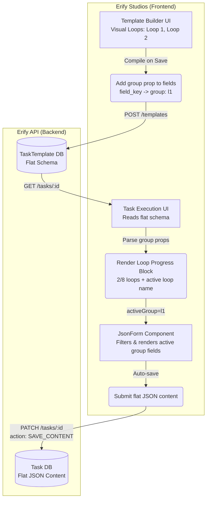

# Moderation Workflow UI/UX Design & Implementation Plan

## 1. Overview
The moderation workflow requires handling a high volume of recurring tasks (loops) during a livestream show (e.g., eight 15-minute loops in a 2-hour show). The current task management system produces flat lists, making large quantities of loop-based tasks unmanageable for moderators and planners.

### The "Loop-based Task Payload" Approach (Option A)
Instead of creating 240 individual `Task` rows in the database, we treat the entire "Show Moderation" as a single `Task`, where the `content` JSON holds the configurations and completion state for all loops.

---

## 2. Architecture & Data Flow (Mermaid)

The core architectural decision is to keep the Backend (`erify_api`) completely ignorant of "Loops". The Backend simply validates a flat array of `FieldItem` definitions. The Frontend (`erify_studios`) handles compiling the visual loops into flat fields, and grouping flat fields back into visual loops.



---

## 3. UI/UX Specifications (Erify Studios)

### 3.1 Planner UI: Custom Template Builder
When creating a template, planners can switch **Workflow View** between:
* `Standard checklist`
* `Loop-based moderation`

Loop mode is configurable directly in the existing task template builder.

#### UI Mockup (ASCII)
```text
+-----------------------------------------------------------+
| Moderation Template Builder                      [ Save ] |
+-----------------------------------------------------------+
| Template Name: [ Campaign Livestream Moderation ]         |
+-----------------------------------------------------------+
| Loops Configuration                                       |
| Total duration: 2 hrs 15 mins                 [ Add Loop ]|
|                                                           |
| ▼ Loop 1 • 5 items [Clone] [Remove]                      |
|   +---------------------------------------------------+   |
|   | Name: [Welcome & Intro] Duration: [15 min] Pos:[1]|  |
|   | 1. [Checkbox] Pin Welcome Comment                 |   |
|   | 2. [Text] Add Campaign Link to chat               |   |
|   | [+ Add Field to Loop 1]                           |   |
|   +---------------------------------------------------+   |
|                                                           |
| ▶ Loop 2 • 4 items [Clone] [Remove]                      |
|   +---------------------------------------------------+   |
|   | (collapsed)                                       |   |
|   +---------------------------------------------------+   |
+-----------------------------------------------------------+
```

#### Planner Interaction Rules (Implemented)
* **Loop section controls**: collapse/expand, clone, remove, move by explicit 1-based position.
* **Loop duration**: duration is set in minutes per loop, with a running total shown in human-readable form (for example, `2 hrs 15 mins`).
* **Loop completion context**: loop headers show total item count only (e.g., `5 items`). Per-loop filled/completed count is visible in the live preview and the task execution sheet, not in the builder header.
* **Add Loop UX**: clicking Add Loop scrolls to the new loop section. No forced focus/auto-blur behavior.
* **Mobile fit**: loop actions use compact icon buttons to prevent overflow.
* **Reordering semantics**: moving loop N to position M behaves like array splice (intermediate loops shift accordingly).

### 3.2 Moderator UI: The "Focus Mode" (Task Execution Sheet)
The execution sheet parses the flat schema and groups fields by loop, then presents loop navigation as a compact **progress block** instead of horizontal tabs.

#### UX Rules
* **Current Loop Awareness**: The loop matching current clock time vs `Show.startTime` is identified as the live loop.
* **Navigation**: Moderators move with `Previous`/`Next` between loops (soft constraints).
* **Auto-Save**: Inputs are saved locally / directly to the DB as the user types to prevent accidental data loss.
* **No horizontal overflow**: loop navigation avoids overflow-x by using progress + text layout.

#### UI Mockup (ASCII)
```text
+-----------------------------------------------------------+
| Task: Livestream Moderation             [Status: ACTIVE]  |
| Show: Summer Campaign 2026                  Due: In 2 hrs |
+-----------------------------------------------------------+
| [ Submit for Review ]                                     |
+-----------------------------------------------------------+
|                                                           |
|  Loop Progress                                2/8 loops  |
|  [========------]                                         |
|  2. Flash Sale Push                                      |
|  Items completed: 3/5 (Live)                             |
|  [ Previous ]                                  [ Next ]  |
|                                                           |
+-----------------------------------------------------------+
|  [x] Pin Welcome Comment                                  |
|  [x] Block offensive keywords                             |
|  [ ] Announce Flash Sale 1                                |
|                                                           |
+-----------------------------------------------------------+
```

> **Deferred (not yet implemented):** "Time remaining in Loop N" countdown timer and "Mark Loop Complete" button are not part of the current implementation. The live clock tick (every 30s) is used solely to identify the current live loop — it is too coarse for a countdown display. These features can be added in a future phase.

---

## 4. Implementation Details (Erify Studios)

### 4.1 Schema Updates (`@eridu/api-types`)
* Add an optional `group: z.string().optional()` to `FieldItemBaseSchema` in `packages/api-types/src/task-management/template-definition.schema.ts`.
* *Why?* This allows the UI to group fields semantically without backend validation caring about nested loop arrays.

### 4.2 Template Metadata (App Layer Loop Definitions)
Because there is no backend schema strictly enforcing loops, the frontend will store formal loop configurations in the template's generic `metadata` JSON object.
* **Schema Contract**:
  ```json
  "metadata": {
    "loops": [
      {
        "id": "l1",
        "name": "Welcome & Intro",
        "durationMin": 15
      }
    ]
  }
  ```
* Individual field items link to these loops by setting their `group` property to the corresponding loop `id` (e.g., `group: "l1"`).

### 4.3 Template Builder (`apps/erify_studios/src/components/task-templates/builder/task-template-builder.tsx`)
* Instead of only the standard drag-and-drop flat list, provide a **Workflow View** switch with a dedicated moderation mode.
* **Output Compilation**: Under the hood, the builder "compiles" these visual loops into a standard flat array of `FieldItem` objects, and serializes the loop definitions to `metadata.loops`.
  * *UI Loop 1, Question 1* becomes: `{ key: 'l1_q1', group: 'l1', label: 'Pin Comment', ... }`
  * This ensures the existing `TemplateSchemaValidator` continues to work seamlessly.
* **Preview parity**:
  * Preview reflects the same loop progression concept as runtime.
  * Active loop label is shown as numbered order first (`2. Loop Name`) for clarity.
  * Loop progress and loop item completion are visible in preview.

### 4.4 Task Execution UI (`apps/erify_studios/src/features/tasks/components/task-execution-sheet.tsx` & `json-form.tsx`)
* Read the `task.template.metadata.loops` to determine the exact sequence, names, and durations of loops.
* Render a **loop progress block** (progress bar + `current/total` loop text + current loop name + per-loop completion + previous/next controls) above the `JsonForm`.
* If `Show.startTime` is present, use actual clock time and `durationMin` to estimate and mark the live loop.
* **Component Changes**:
  * Pass an `activeGroup` (Loop ID) prop down to `JsonForm`.
  * `JsonForm` will filter the rendered fields: `schema.items.filter(item => !activeGroup || item.group === activeGroup)`.
  * Because `react-hook-form` tracks all fields regardless of visual display, completion state for *all* loops is maintained in memory.
* **Local Persistence**: The existing auto-save hook (`enableAutosave`) inside `TaskExecutionSheet` will automatically persist the grouped payload to the database smoothly.

---

## 5. Performance & React Best Practices (Implemented)
* Removed unstable per-item inline ref callbacks in sortable field lists that caused unnecessary rerenders despite `memo`.
* Switched add-item scroll targeting to DOM query via `data-field-id` + parent ref to keep child props stable.
* Replaced effect-synchronized loop selection with derived state (`resolvedActiveGroup`) to avoid transient invalid UI state and reduce render churn.
* Added shared `Progress` primitive in `@eridu/ui` (`@radix-ui/react-progress`) and normalized input value clamping to `0-100`.
* **Memoized Loop Collections**: Prevented `TaskTemplateBuilder` from recreating item arrays per loop on every render, ensuring stable object identities for `SortableFieldList`.
* **Debounced Form State**: `TaskExecutionSheetInner` now debounces the `JsonForm` `onChange` tracking via `useDebounceCallback` to decouple local component state updates from rapid typing, eliminating input lag for large moderation tasks.

---

## 6. Example Template Schema (3 Loops x 5 Items)
The following example matches the current task template engine contract in this repo:
* top-level template fields: `name`, `description`, `task_type`, `metadata`, `items`
* loop definitions in `metadata.loops`
* loop-field linkage via `items[].group`
* mixed `type`, `options`, and `validation` constraints

```json
{
  "name": "Livestream Moderation - 3 Loops Example",
  "description": "Example template with 3 loops x 5 items, using mixed field types and validation constraints.",
  "task_type": "ACTIVE",
  "metadata": {
    "loops": [
      { "id": "l1", "name": "Loop 1 - Warm Up", "durationMin": 15 },
      { "id": "l2", "name": "Loop 2 - Engagement Push", "durationMin": 15 },
      { "id": "l3", "name": "Loop 3 - Wrap & Escalation", "durationMin": 15 }
    ]
  },
  "items": [
    {
      "id": "0b1d5f94-3c9c-4bf5-9ec3-6f54f1f2b901",
      "key": "l1_pin_welcome",
      "type": "checkbox",
      "label": "Pin welcome comment",
      "group": "l1",
      "required": true,
      "default_value": false,
      "validation": {
        "require_reason": "on-false",
        "custom_message": "Please explain if welcome comment is not pinned."
      }
    },
    {
      "id": "cc1b5ee5-51de-4cff-8ed7-c814c7dc9f11",
      "key": "l1_campaign_link",
      "type": "url",
      "label": "Campaign link in chat",
      "group": "l1",
      "required": true,
      "validation": {
        "pattern": "^https?://.+",
        "custom_message": "Enter a valid URL."
      }
    },
    {
      "id": "19f772d3-f8b3-4d34-b410-5507b8dd1df3",
      "key": "l1_flash_sale_copy",
      "type": "textarea",
      "label": "Flash sale announcement copy",
      "group": "l1",
      "required": true,
      "validation": {
        "min_length": 20,
        "max_length": 300
      }
    },
    {
      "id": "f9e8ff8e-b8c0-4a5f-a8d9-04d2de8e4a56",
      "key": "l1_comment_tone",
      "type": "select",
      "label": "Primary comment tone",
      "group": "l1",
      "required": true,
      "options": [
        { "value": "friendly", "label": "Friendly" },
        { "value": "neutral", "label": "Neutral" },
        { "value": "urgent", "label": "Urgent" }
      ],
      "default_value": "friendly"
    },
    {
      "id": "136525f8-2f53-4cf9-ac74-bf444ea22779",
      "key": "l1_viewer_count",
      "type": "number",
      "label": "Current viewer count",
      "group": "l1",
      "required": true,
      "default_value": 0,
      "validation": {
        "min": 0,
        "max": 50000
      }
    },
    {
      "id": "58ab3f8f-54b5-4559-9025-f0254f2c95a3",
      "key": "l2_detected_keywords",
      "type": "multiselect",
      "label": "Detected risky keywords",
      "group": "l2",
      "required": false,
      "options": [
        { "value": "spam", "label": "Spam" },
        { "value": "hate_speech", "label": "Hate Speech" },
        { "value": "self_harm", "label": "Self-harm" },
        { "value": "scam_link", "label": "Scam Link" }
      ],
      "default_value": [],
      "validation": {
        "require_reason": [
          { "op": "in", "value": ["hate_speech", "self_harm"] }
        ]
      }
    },
    {
      "id": "50f176c7-777f-4c13-b216-ea22dcda22bf",
      "key": "l2_blocked_accounts",
      "type": "number",
      "label": "Accounts blocked this loop",
      "group": "l2",
      "required": true,
      "default_value": 0,
      "validation": {
        "min": 0,
        "max": 200
      }
    },
    {
      "id": "1a03e2dc-adde-44c6-8c90-b421f2fcb6bb",
      "key": "l2_evidence_upload",
      "type": "file",
      "label": "Upload moderation evidence",
      "group": "l2",
      "required": false,
      "validation": {
        "accept": "image/*",
        "max_size": 5242880,
        "custom_message": "Upload image evidence under 5MB."
      }
    },
    {
      "id": "cf009ce5-3f75-41a5-998b-16cf80e5fd09",
      "key": "l2_followup_action",
      "type": "select",
      "label": "Follow-up action",
      "group": "l2",
      "required": true,
      "options": [
        { "value": "warn", "label": "Warn user" },
        { "value": "escalate", "label": "Escalate to lead" },
        { "value": "ignore", "label": "Ignore" }
      ],
      "default_value": "warn"
    },
    {
      "id": "56cc39d2-597f-41dc-86cf-c438abb58dc7",
      "key": "l2_next_check_at",
      "type": "datetime",
      "label": "Next moderation check time",
      "group": "l2",
      "required": true
    },
    {
      "id": "0f73f6d1-b977-4d8f-bfcf-cc9ff45fc6d9",
      "key": "l3_summary_note",
      "type": "text",
      "label": "Loop summary note",
      "group": "l3",
      "required": true,
      "validation": {
        "min_length": 5,
        "max_length": 120
      }
    },
    {
      "id": "3e9fb71f-0784-49a2-9023-0ca95b9943ea",
      "key": "l3_issue_severity",
      "type": "select",
      "label": "Highest issue severity",
      "group": "l3",
      "required": true,
      "options": [
        { "value": "low", "label": "Low" },
        { "value": "medium", "label": "Medium" },
        { "value": "high", "label": "High" },
        { "value": "critical", "label": "Critical" }
      ],
      "default_value": "low"
    },
    {
      "id": "6d3a8936-7b6e-4038-b83e-c7f30f6ca10c",
      "key": "l3_needs_supervisor",
      "type": "checkbox",
      "label": "Needs supervisor follow-up",
      "group": "l3",
      "required": true,
      "default_value": false,
      "validation": {
        "require_reason": "on-true"
      }
    },
    {
      "id": "1261f3ef-37eb-4d6e-9198-8186ffd445d4",
      "key": "l3_followup_reason",
      "type": "textarea",
      "label": "Follow-up reason",
      "group": "l3",
      "required": false,
      "validation": {
        "max_length": 400
      }
    },
    {
      "id": "fa7c8f35-c7ad-4f03-a8f8-8a8e93f31f10",
      "key": "l3_report_date",
      "type": "date",
      "label": "Post-loop report date",
      "group": "l3",
      "required": true
    }
  ]
}
```
