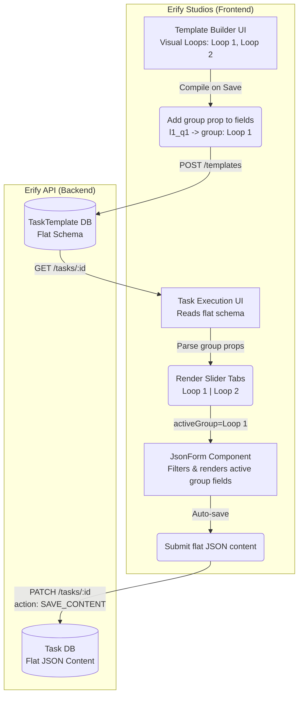

# Moderation Workflow UI/UX Design & Implementation Plan

## 1. Overview
The moderation workflow requires handling a high volume of recurring tasks (loops) during a livestream show (e.g., eight 15-minute loops in a 2-hour show). The current task management system produces flat lists, making large quantities of loop-based tasks unmanageable for moderators and planners.

### The "Loop-based Task Payload" Approach (Option A)
Instead of creating 240 individual `Task` rows in the database, we treat the entire "Show Moderation" as a single `Task`, where the `content` JSON holds the configurations and completion state for all loops.

---

## 2. Architecture & Data Flow (Mermaid)

The core architectural decision is to keep the Backend (`erify_api`) completely ignorant of "Loops". The Backend simply validates a flat array of `FieldItem` definitions. The Frontend (`erify_studios`) handles compiling the visual loops into flat fields, and grouping flat fields back into visual loops.



---

## 3. UI/UX Specifications (Erify Studios)

### 3.1 Planner UI: Custom Template Builder
When creating a template, admins can choose "Moderation Setup". This changes the builder to a block-based editor.

#### UI Mockup (ASCII)
```text
+-----------------------------------------------------------+
| Moderation Template Builder                      [ Save ] |
+-----------------------------------------------------------+
| Template Name: [ Campaign Livestream Moderation ]         |
+-----------------------------------------------------------+
| Loops Configuration                                       |
| [ Add Loop ]                                              |
|                                                           |
| ▼ Loop 1 (0:00 - 0:15)                         [Remove]   |
|   +---------------------------------------------------+   |
|   | 1. [Checkbox] Pin Welcome Comment                 |   |
|   | 2. [Text] Add Campaign Link to chat               |   |
|   | [+ Add Field to Loop 1]                           |   |
|   +---------------------------------------------------+   |
|                                                           |
| ▼ Loop 2 (0:15 - 0:30)                         [Remove]   |
|   +---------------------------------------------------+   |
|   | 1. [Checkbox] Announce Flash Sale                 |   |
|   | [+ Add Field to Loop 2]                           |   |
|   +---------------------------------------------------+   |
+-----------------------------------------------------------+
```

### 3.2 Moderator UI: The "Focus Mode" (Task Execution Sheet)
The execution sheet parses the flat schema and groups them into horizontal slider tabs.

#### UX Rules
* **Current Loop Awareness**: The Tab matching the current clock time vs `Show.startTime` is highlighted automatically.
* **Navigation**: Moderators can freely click back to "Loop 1" to finish missed items (Soft constraints).
* **Auto-Save**: Inputs are saved locally / directly to the DB as the user types to prevent accidental data loss.

#### UI Mockup (ASCII)
```text
+-----------------------------------------------------------+
| Task: Livestream Moderation             [Status: ACTIVE]  |
| Show: Summer Campaign 2026                  Due: In 2 hrs |
+-----------------------------------------------------------+
| [ Submit for Review ]                                     |
+-----------------------------------------------------------+
|                                                           |
|  <  [ Loop 1 ]  [ 🟢 Loop 2 (Live) ]  [ Loop 3 ]  >     |
|                                                           |
+-----------------------------------------------------------+
|  Time remaining in Loop 2: 04:23                          |
|                                                           |
|  [x] Pin Welcome Comment                                  |
|  [x] Block offensive keywords                             |
|  [ ] Announce Flash Sale 1                                |
|                                                           |
|  [ Mark Loop Complete ]                                   |
+-----------------------------------------------------------+
```

---

## 4. Implementation Details (Erify Studios)

### 4.1 Schema Updates (`@eridu/api-types`)
* Add an optional `group: z.string().optional()` to `FieldItemBaseSchema` in `packages/api-types/src/task-management/template-definition.schema.ts`.
* *Why?* This allows the UI to group fields semantically without backend validation caring about nested loop arrays.

### 4.2 Template Builder (`apps/erify_studios/src/components/task-templates/builder/task-template-builder.tsx`)
* Instead of the standard drag-and-drop flat list, introduce a **Moderation Template Builder Mode**.
* **Output Compilation**: Under the hood, the builder "compiles" these visual loops into a standard flat array of `FieldItem` objects.
  * *UI Loop 1, Question 1* becomes: `{ key: 'l1_q1', group: 'Loop 1', label: 'Pin Comment', ... }`
  * This ensures the existing `TemplateSchemaValidator` continues to work seamlessly.

### 4.3 Task Execution UI (`apps/erify_studios/src/features/tasks/components/task-execution-sheet.tsx` & `json-form.tsx`)
* Detect Moderation templates based on the presence of `group` strings in the `uiSchema.items`.
* **Component Changes**:
  * Pass an `activeGroup` prop down to `JsonForm`.
  * `JsonForm` will filter the rendered fields: `schema.items.filter(item => !activeGroup || item.group === activeGroup)`.
  * Because `react-hook-form` tracks all fields regardless of visual display (if unmounted fields are configured to be retained), completion state for *all* loops is maintained in memory.
* **Local Persistence**: The existing auto-save hook (`enableAutosave`) inside `TaskExecutionSheet` will automatically persist the grouped payload to the database smoothly.
